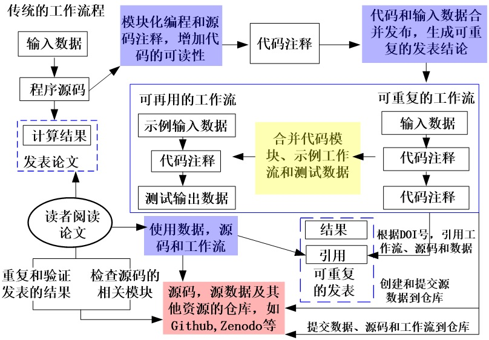
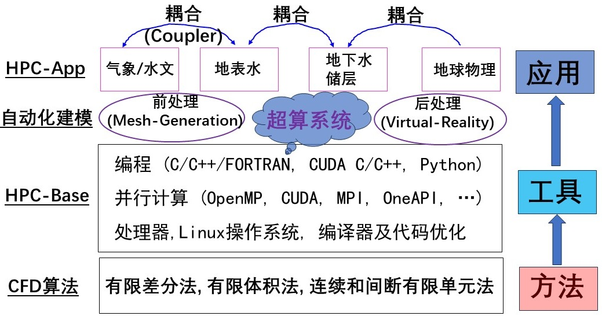

# OpenGeoModeller

## 仓库介绍

地球科学模拟有很多 [Awesome 项目](https://gitee.com/lijian-cug/awesome-geosciences)。本仓库建立地球科学模式的工作流，包含：区域性气象模式、地表水、地下水、地震波正演等数学模式，以及相应的前后处理程序。

选择 HPC 应用程序的思考维度：

1. 前沿的数值算法
2. 并行模式和计算效率
3. 模型的工业级应用能力
4. 可迁移和可重复（Performance-Productivity-Portability）

数学模型开发与发表的规范化操作流程：

目的是将地球科学模拟统一在一个框架下，包含**前处理、编译运行和后处理可视化**的全工作流程：

## Geosciences for the Future

[工程流体力学](https://gitee.com/lijian-cug/fluid-dynamics-course-cug) →
[CFD 基础算法](https://gitee.com/lijian-cug/cfd-course-cug) →
[计算机辅助设计 (CAD)](https://gitee.com/lijian-cug/pre-surface-water) →
[高性能计算基座](https://gitee.com/lijian-cug/kunpeng-competition-2022) →
[地球科学的 Awesome 项目](https://gitee.com/lijian-cug/awesome-geosciences) →
[海洋模拟](https://gitee.com/lijian-cug/ocean-modeling-course-cug)

## 仓库建设内容

- [Meteorology](./Meteorology/)：数值气象预报 (NWP)，包括 WRF、RegCM、MPAS、HWRF 等
- [SurfaceWater](./SurfaceWater/)：地表水（河流、海洋）模式，包括 SCHISM、telemac、shyfem、SUNTANS、DGSWE、ADCIRC、WW3、CROCO、NEMO、Firedrake 等
- [Underground](./Underground/)：地下流动，包括 MODFLOW6、MPLBM-UT、OPM、GEOSX、waiwera、OpenGeoSys 等
- [Geological-Modelling](./Geological-Modelling/)：地质建模，地震数据处理与解释 (OpendTect)、隐式地质建模 (GemPy、LoopStructural)
- [VirtualReality](./VirtualReality/)：可视化后处理，包括 VR、原位可视化、集群图形渲染等
- [hpc-base](./hpc-base/)：高性能计算基座（子模块）；完整检出：`git clone --recursive https://gitee.com/lijian-cug/open-geo-modeller`
- [ESM-Coupler](./ESM-Coupler/)：地球系统模式与耦合器，包括 RegESM、ESMF、BMI 等
- [Geophysics](./Geophysics/)：地球物理正反演，OpenSWPC、Seissol、Devito/JUDI、spyro 等
- [ShallowWater](./ShallowWater/)：浅水方程求解，Triton、Volna-OP2、Titan2d、BASEMENT 等
- [Hydrology](./Hydrology/)：分布式水文模拟，PIHM、CHM、ParFLOW、GSFLOW 等
- [Meshing](./Meshing/)：网格生成（前处理），CFD 建模中最耗时的步骤之一
- [Turbulence](./Turbulence/)：高精度湍流模型，如 DNS、LES、RANS 等
- [Hemodynamics](./Hemodynamics/)：心血管血液动力学 CFD 模型
- [GroundWater](./GroundWater/)：地下水相关说明（与 Underground 互补）

各学科目录之间的工作流依赖、交叉链接与主题耦合，见 [学科关系图](./docs/学科关系图.md)。

## 仓库建设目标

1. 开源：摆脱商业软件的制约，实现持续性的开发，增强模式的先进性。
2. 高效性：脚本语言的自动化建模工作流，提高建模效率和可重复性。
3. 高性能：高性能计算技术支持，充分利用超算算力资源。
4. 系统性：实现不同模式组件的耦合模拟，反映地球系统的复杂性。
5. 易用性：脚本化模式的编译部署，快速解决实际工程问题。
6. 可操作性：完善的操作流程说明，实现傻瓜操作完成项目研究。
7. 引导性：使用 Markdown 文本与超链接，使用户能快速找到需要的资料和工具。

## B 站视频教程

[space.bilibili.com/581683925/video](https://space.bilibili.com/581683925/video)

## 实施效果展示

1. [集群硬件平台](https://gitee.com/lijian-cug/hpc-base/blob/master/Ubuntu20.04-Cluster/我的集群照片.jpg)
2. [CPU 集群监控界面](https://gitee.com/lijian-cug/hpc-base/blob/master/Ubuntu20.04-Cluster/media/image7.png)
3. [GPU 集群监控界面](https://gitee.com/lijian-cug/hpc-base/blob/master/Ubuntu20.04-Cluster/media/image13.png)
4. [高性能计算部署](https://gitee.com/lijian-cug/hpc-base/blob/master/opengeomodeller-build.png)

## 相关文档

- [学科关系图](./docs/学科关系图.md)
- [文档整理备忘 (CLAUDE.md)](./docs/CLAUDE.md)
- [hpc-base Markdown 规范](./docs/superpowers/specs/2026-08-14-hpc-base-markdown-design.md)
- [非 hpc-base Markdown 规范](./docs/superpowers/specs/2026-08-14-non-hpc-base-markdown-design.md)

## 合作与共赢

有对这个项目感兴趣的同仁，一块研究，提高地球科学数值模拟的研究。

作者简介：李健，QQ: 94207625；email: jianli@cug.edu.cn

[微信 QR](https://gitee.com/lijian-cug/hpc-base/blob/master/QR-code.png)
