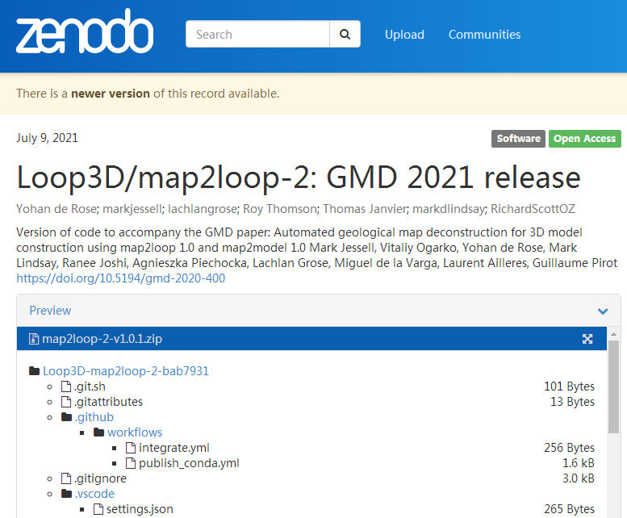
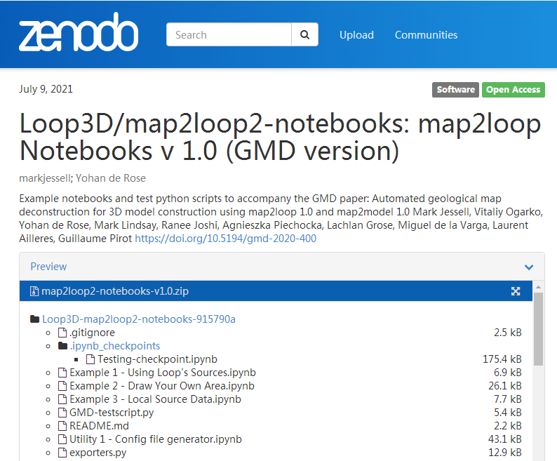
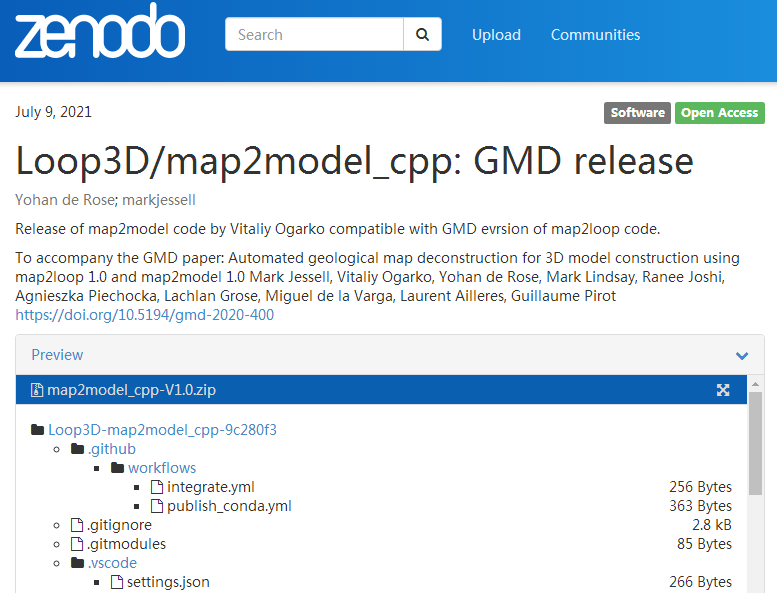
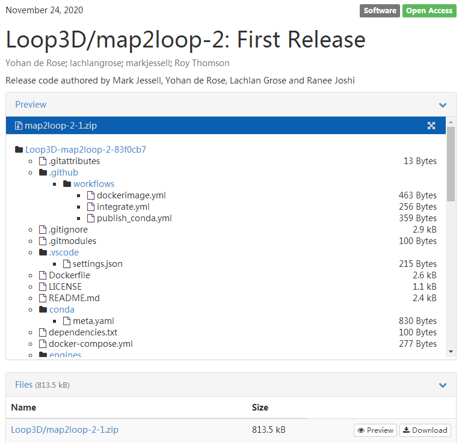

# LoopStructural及GemPy的输入文件

## 隐式地质建模的数据输入

[Jessell et al. (2014)]{.mark}将3D地质建模分为4种场景：

1.  local-scale (mine) models

2.  regional-scale sedimentary basins

3.  regional-scale hard-rock terranes

4.  large-scale (crustal or lithospheric) models

根据Lajaunie et al. (1997)的论文，隐式地质建模需要的基本数据包括2方面：

（1）plane orientation data (then be transformed into vectorial data);

（2）polarity of structures must be known in some places.

加速隐式地质建模，特别是考虑到speed, reproducibility, separation of
data, concepts, and interpretations。

地质建模需要融入各方面的数据源，针对LoopStructural和GemPy的隐式地质建模程序的输入数据文件，可总结为：

1、低层级别(low-level)的输入数据准备：使用某些解释软件（Petrel,
Geoframe）解释测井或3D地震数据，获得断层、褶皱或层理的参数数据（见examples/4_advanced/plot_model_from_geological_map.py中读取解译的地质数据：from
LoopStructural.datasets import load_geological_map_data）；

2、高层级别(high-level)的输入数据准备：map2loop和map2model项目，为GemPy和LoopStructural提供完整的输入文件。需要提供包含断层、褶皱或层理等关键信息的GIS矢量文件(shapefile格式)，根据\*.hjson文件，自动生成GemPy和LoopStructural需要的输入文件。map2loop为澳大利亚的地质图制作用于LoopStructural地质建模的输入文件的。但是，中国也有自己公开的MapGIS格式的地质图。但是，目前看来对澳大利亚公开的地质图GIS文件处理是高效的，应用于中国的公开的地质数字图（李晨阳,
2019），需要进一步研究。

3、其他来源的数据融入地质建模，包括：Google Earth地表卫星数据(GemPy,
Wellmann et al., 2019)、钻孔数据(Loop, dh2loop
1.0)、重磁数据（Tomofast-x v1.0）、传感器数据（Blockworlds
0.1.0）等。需要对隐式地质建模的不确定性做定量评估（loopUI-0.1）。

## csv输入文件(断层与地层的参数)

目前看来，Petrel以及大多数的地震解释软件，根据测井或地震数据，解译的断层参数有：

1 断层的名称(Feature_name)、XYZ坐标、断层编号

下面是LoopStructural需要的最地层的地质模型输入文件：

### 地层方面的数据文件 {#地层方面的数据文件 .标题3}

\(1\)
地层接触(contacts.csv)，包括：地层接触的XYZ坐标、名称(\*\*\*\_Formation,
\*\*\*\_Group)

\(2\) 地层方向(stratigraphic_orientation.csv)，包括：XYZ坐标、azimuth
(360.0), dip(40.0), polarity (1), formation (\*\*\_Formation), source
(observed or contact_orientations)

\(3\) 地层厚度(stratigraphic_thickness.csv)，包括：地层名称(name),
厚度(m)

\(4\) 地层顺序(stratigraphic_order.csv)，包括：地层group, formation
index in the group, unit_name

\(5\) 建模区域范围(bbox.csv)，包括：origin与maximum的XYZ坐标

### 断层的数据文件 {#断层的数据文件 .标题3}

\(1\) 断层的位移(fault_displacement.csv)：Fault (Fault_2997),
displacement (84.0)

\(2\) 断层的边界(fault_edges.txt)：两两断层的名称对(\*\*1_Fault,
\*\*2_Fault)

\(3\) 断层的位置(fault_locations.csv)：XYZ坐标、val (all are
0?)、feature_name (Fault_2997, \...)、coord (all is 0?)
界面上的一些点(Lajaunie et al., 1997)

\(4\) 断层的方向(fault_orientations.csv)：XYZ坐标、梯度(gx, gy,
gz)、Coord (all are 0?)、feature_name (Fault_2997, \...)
界面上的另一些点(Lajaunie et al., 1997)

注意：(3)与(4)的点位相同也是没问题的。

### 疑问 {#疑问 .标题3}

如果从钻孔或地震数据，解释得到上述的至少关于断层的参数(XYZ坐标、Orientation
(dip, azimuth, polarity)、连接关系、位移)？

## 钻孔数据融入

dh2loop (Loop3D project)

GemPy也使用钻孔数据(welly, striplog)

## 总结

隐式地质建模是一种快速的、定量的并可重复的地质建模方式，但用于中国区域性地质建模需要注意几个问题：

（1）对于油田等特殊区域的地质建模，需要使用低层级别的建模方式；

（2）中国公开的地质图数据库很有限（目前仅找到李晨阳,
2019），因此使用高层级别的（如map2loop）建模数据准备，在中国是很难实施的（可以使用李晨阳,
2019提供的数据开展这个研究）；

（3）其他地质数据来源（钻孔、重磁和传感器）的方式在中国区域地质建模的使用也很有限；

（4）基于地质建模文件，取代Petrel等前处理程序的部分功能，与数值模拟应用可结合。

{width="5.3323829833770775in"
height="3.0498337707786525in"}

图1 地质建模与有限元模拟的结合

### 参考文献 {#参考文献 .标题3}

1.  Wellmann J. F., Schaaf A., de la Varga M., von Hagke C. 2019.From
    Google Earth to 3D Geology Problem 2: Seeing Below the Surface of
    the Digital Earth, Developments in Structural Geology and Tectonics,
    5: 189-204.

2.  李晨阳，王新春，何春珍，吴轩，孔昭煜，李晓蕾. 2019. 全国1∶200
    000数字地质图（公开版）空间数据库. 中国地质，46(S1): 1-10.

3.  Joshi, R., Madaiah, K., Jessell, M., Lindsay, M., Pirot, G.: dh2loop
    1.0: an open-source python library for automated processing and
    classification of geological logs, Geosci. Model Dev.

4.  LoopStructural 1.0: time-aware geological modelling

5.  Modelling of faults in LoopStructural 1.0

6.  Automated geological map deconstruction for 3D model construction
    using map2loop 1.0 and map2model 1.0

7.  Structural, petrophysical, and geological constraints in potential
    field inversion using the Tomofast-x v1.0 open-source code

8.  dh2loop 1.0: an open-source Python library for automated processing
    and classification of geological logs

9.  Blockworlds 0.1.0: a demonstration of anti-aliased geophysics for
    probabilistic inversions of implicit and kinematic geological models

10. loopUI-0.1: indicators to support needs and practices in 3D
    geological modelling uncertainty quantification

11. Miguel de la Varga, Alexander Schaaf, FlorianWellmann. 2019. GemPy
    1.0: open-source stochastic geological modeling and inversion.
    Geosci. Model Dev., 12: 1-32.

# LoopStructural的低层级输入方式

参考examples/4_advanced/plot_model_from_geological_map.py中读取解译的地质数据：from
LoopStructural.datasets import load_geological_map_data

## 4.a Building a model using the ProcessInputData (advanced示例)

There is a disconnect between the input data required by 3D modelling
software and a geological map. In LoopStructural the geological model is
a collection of implicit functions that can be mapped to the
distribution of stratigraphic units and the location of fault surfaces.
Each implicit function is approximated from the observations of the
stratigraphy, this requires grouping conformable geological units
together as a single implicit function, mapping the different
stratigraphic horizons to a value of the implicit function and
determining the relationship with geological structures such as faults.

In this tutorial the \*\*ProcessInputData\*\* class will be used to
convert geologically meaningful datasets to input for LoopStructural.

The \*\*ProcessInputData\*\* class uses:\* stratigraphic contacts\*
stratigraphic orientations\* stratigraphic thickness\* stratigraphic
order. To build a model of stratigraphic horizons and:\* fault
locations\* fault orientations \* fault properties\* fault edges. To use
incorporate faults into the geological model.

总结，LoopStructural输入就是要准备：

-   stratigraphic contacts（地层接触）

-   stratigraphic orientations（地层方向）

-   stratigraphic thickness（地层厚度）

-   stratigraphic order（地层顺序）

为构建地层平面模型，需要：

-   fault locations（断层位置）

-   fault orientations（断层方向）

-   fault properties（断层属性）

-   fault edges（断层边界）

# LoopStructural的高层级输入方式：map2loop 1.0和map2model 1.0

目前是针对西澳大利亚的地质数据库开展的研究，自动化程度很高。

## 1前言

map2model和map2loop项目旨在：改进3D地质建模部分工作流，主要是从地质图数据到建模的转换，这是最耗时的部分（hours
to
days），属于预建模过程。转换不是唯一的，与选择使用何种地质特征的参数以及联合源数据集的方法有关。

map2loop项目研究着眼于hard-rock区域建模场景，相比矿山和沉积盆地来说，data-poor。地下3D地质的最佳预测因子是包含在地质图中的信息以及测井(logged
well)数据（如果可获取的话）。但是，除了沉积盆地外，钻井(drill
hole)都太浅，不能提供在区域尺度上的约束，通常还缺少层序信息。

[map2loop需要的地质图]{.mark}需提供：

-   主要几何数据：如层序接触位置

-   次级几何数据：局部地质层组(formation)厚度

-   断层和层序拓扑信息

输入地质建模的数据源还有卫星数据(Wellmann et al.,
2019)以及从钻孔直接自动提取的信息(dh2loop, Joshi et al.,
2021)，但不在本文讨论范围内。

map2loop是依赖于map2model，但map2loop是独立开发的，依赖于外部开源库有：Geopandas(管理矢量格式的地理空间数据)，Rasterio
(管理栅格格式的地理空间数据),
Networkx（管理网络图）和Shapely(管理2D计算几何)。

## [2 基本的数据输入]{.mark}文件

此处，input指对map2loop和map2model的输入。augumented
data是map2loop的数据产品，augumented data是3D地质建模的输入。

所有与map2model库相关的输入和输出都封装在map2loop库中。

地质图的信息分为3类几何数据：

1.  位置相关数据，如：断层、侵入体与层序接触的位置

2.  梯度数据，如：接触或断层的倾角

3.  时空拓扑数据，如：断层之间以及层序单元之间的年代关系

map2loop导入不同的数据集（手工生成输入文件非常费劲），输出一些标准格式文件，如Graphy
Meta Language (GML), csv, geotiff, ESRI
shapefile，这样3D模拟系统可以使用它们。

一旦输入参数定义了，整个工作流是自动化的，因此需要实现决定选择哪些参数（表1为参数列表）。整个工作流如图2。一旦生成配置文件以及在map2loop控制脚本中定义工作流控制参数，所有接下来的操作都是自动化的，从访问输入数据到使用GemPy或LoopStructural构建3D模型。

使用2016
1:50万解译的西澳大利亚的基岩地质图以及WAROX露头数据库，构建Hamersley
Region of Western
Australia地区的初步模型（图1）。组成有：Archean褶皱和覆盖在Archean基础之上的Proterozoic(元古代)地层，被50NW-SE方向的，形成Nanjilgardy断层系统的一部分断层切割。

map2loop使用Geopandas库从几种格式（shapefiles, MapInfo tab,
JSON）文件加载数据，地理空间数据可以是任意标准的参考坐标系统（EPSG）。使用这些库加载和转换输入的地质几何和属性（表2）。

\-\-\-\-\-\-\-\-\-\-\-\-\-\-\-\-\-\-\-\-\-\-\-\-\-\-\-\-\-\-\-\-\-\-\-\-\-\-\-\-\-\-\-\-\-\-\-\-\-\-\-\-\-\-\--

图2
自动化工作流：一旦创建了配置文件和在map2loop控制脚本中定义了工作流参数(表1)，所有虚线框内的步骤完全自动化，没有手动干扰。更细节的工作流见图5。

map2loop与map2model使用的[6种输入数据]{.mark}（图1），这2个库使用一个配置文件(HJSON格式的配置文件)，用户指定GIS层的哪个场或WFS服务器包含何种信息。Jupyter
Notebook帮助用户从输入层，创建HJSON格式的配置文件（Utility 1 --
Configfilegenerator.ipynb）。map2loop需要的最低输入数据见附录A。

\-\-\-\-\-\-\-\-\-\-\-\-\-\-\-\-\-\-\-\-\-\-\-\-\-\-\-\-\-\-\-\-\-\-\-\-\-\-\-\-\-\-\-\-\-\-\-\-\-\-\-\-\-\-\--

图1 输入map2loop的6类输入: (a) 基岩地质图(1:50万); (b) 前7类的层序关系;
(c) SRTM DTM

### 2.1 地层年代Polygon 和 MultiPolygon层 {#地层年代polygon-和-multipolygon层 .标题3}

The layer may contain a mixture of single Polygons, MultiPolygons (sets
of Polygons with the same non-spatial attributes), and or Polygons with
holes (also stored as MultiPolygons,
图3)。这些对象作为Geopandas数据对象。每个Polygon需要包含如下元素：

（1）定义节点的有序封闭循环*x y*坐标的列表；

（2）层序编号或更低层级（如formation, member）的名称，称之为\"units\"

（3）一个或更多高层级的层序定义（如group, supergroup, spuersuite,
province），称之为\"groups\"。

（4）一个或更多岩性描述，有助于确定地层单元是否是火山、基石或其他类型的侵入体或其他类型的沉积岩?

（5）可选但重要：细尺度层序单元的最大和最小估计年代。

基岩地质图包含各组(formation)的最大和最小年代，但是由于缺少绝对的地质年代约束，一个群(group)内共享相同的范围。

\-\-\-\-\-\-\-\-\-\-\-\-\-\-\-\-\-\-\-\-\-\-\-\-\-\-\-\-\-\-\-\-\-\-\-\-\-\-\-\-\-\-\-\-\-\-\-\-\-\-\-\-\-\-\--

图3 地质图中使用的几何单元：B, C,
D是层序Polygon，由节点的*xy*坐标定义。A是一个MultiPolygon，因为其包含一个洞。E是一个断层Polyline。F,
G是断层MultiPolyline，描述相同断层的片段（断层E也是）。构造观测（层理测量）是Point类型。所有几何单元可能拥有多个属性，通过增加栅格的DTM信息，被转换为3D几何单元。

### 2.2 断层Polyline和MultiPolyline层 {#断层polyline和multipolyline层 .标题3}

该矢量层描述在地表的断层或窄的剪切带的位置、方向和位移信息。

该层由MultiPolylines（具有相同非空间属性的Polylines组）混合组成。map2loop将MultiPolylines分解为分离的Polylines，允许正确实施断层长度和方向的分析。比用户定义长度还短的断层给过滤掉，降低模型的复杂度。

各断层Polyline需要包含如下元素：

（1）定义节点的顺序开放循环*x,y*坐标列表

（2）唯一的识别号，以某种方式标记断层

（3）在中点处存储断层的倾角和倾角方向（或走向）

使用1:50万的澳大利亚的解释的基岩线特征图层，由map2loop过滤提取断层。

### 2.3 褶皱轴向轨迹Polyline层（可选项） {#褶皱轴向轨迹polyline层可选项 .标题3}

map2loop过滤地质图，提取褶皱轴向轨迹。改成可能包含Polylines和MultiPolylines
(具有非空间属性的Polylines组)。

各褶皱轴向轨迹Polyline需要包含如下元素：

（1）定义节点的有序开环x,y坐标序列；

（2）以某种方式标记的褶皱轴向轨迹的位移的标识；

（3）褶皱轴向轨迹的极性(polarity) (syncline, synform, anticline or
antiform)

### 2.4 层理方向Point层（露头数据） {#层理方向point层露头数据 .标题3}

该矢量层描述层理局部方向，一般不包含在地质图内，但可以从单独的数据库或野薄找到。还可以通过航拍图像解译或3点分析得到。

各层理方向点(Point)应包含如下元素：

（1）定义Point的单个*x, y*坐标

（2）倾角信息；

（3）倾角方向或走向信息，这里称为\"azimuth\"以避免混淆；

（4）层理的Polarity (upright地层为1或 overturned地层为0)。

### 2.5 参考地层 {#参考地层 .标题3}

Australian Stratigraphic Units Database
(ASUD)，可以下载组(formation)的层级及上层的细节的层序信息，如2.1节提到的最大-最小年代的Polygon。层序信息一般没有空间信息，但假设映射的层序年代Polygon与ASUD的编码相同，如此得到层序关系（如A
overlies
B），map2model执行拓扑分析，这样有助于定义地图区域上的局部层序。map2loop目前从澳大利亚ASUD数据集（定义相邻层序关系对，A层覆盖在B层上:
A-B pair）密集提取，来定义局部层序（图1b）。

### 2.6 地表高程数据模型(DEM) {#地表高程数据模型dem .标题3}

使用SRTM 90m，geotif格式的栅格文件。

### 2.7 输入数据的校验 {#输入数据的校验 .标题3}

首先，将数据剪切到建模区域；

然后，检查新的层，确保有足够的层理数据，因为使用的算法需要至少3个方向插值，得到完整的层理方向场；

然后，检查是否地质Polygon文件有数据。没有数据，则出错。

## 3方法

map2loop与map2model融合第2节介绍的[输入数据]{.mark}，以不同的组合方式，生成一系列csv,
geotiff和gml格式的输出，可直接用于3D地质建模或2D研究的分析数据源。

map2model实施地质图的空间和时间拓扑分析：断层-断层交互、断层地层交互和局部地层分析。map2loop进一步细化分析结果，融入非地图数据源信息，如地层数据集，作用是封装map2model，并实施其他计算。

map2loop输出数据分为3个类型：positional, gradient和topological输出。

关键计算的伪代码见附录B。

3维建模引擎用到的具体输出见表3。

表3 Gempy与LoopStructural建模引擎输入数据的比较。

\-\-\-\-\-\-\-\-\-\-\-\-\-\-\-\-\-\-\-\-\-\-\-\-\-\-\-\-\-\-\-\-\-\-\-\-\-\-\-\-\-\-\-\-\-\-\-\-\-\-\-\-\-\--

图4 GIS地图层,
Web服务器和地层数据库提供的数据流输入（椭圆框），处理后的数据（矩形）是整合输入数据和map2loop工作流得到的。map2model处理拓扑关系分析：断层-断层相交、断层-地层相交和局部的地层分析，所有其他计算都是由map2loop管理的。

### [3.1位置输出]{.mark}(Positional output) {#位置输出positional-output .标题3}

map2loop算法导出的第1类建模约束是提供位置数据，即定义一种地质特征的*x,y,z*位置坐标，包括断层、侵入体及地层接触。

#### 3.1.1 DTM {#dtm .标题4}

重投影后的DTM存储为geotiff格式，将来允许导入单独geotiff格式的DTM数据源。

#### 3.1.2基岩接触(Basal Contacts) {#基岩接触basal-contacts .标题4}

map2loop目前使用由覆盖地层单元标记的地层接触约定，因此接触表征地层单元的基座，称之为基岩接触。使用相邻的年代地层Polygon的相交计算基岩和侵入接触（2.1节）。目前忽略sill-like侵入接触，因为它们不符合大规模pluton-like几何体或者严格的地层关系，但需要将来的研究。尽管map2loop可以处理地层透镜体，但3D建模程序目前不能处理这些地质特征，除了在各透镜体顶部插入不整合，这需要将来研究。为确定Polyline的标识，需要使用map2model库（3.3.1节）计算的局部地层信息分析2个Polygon之间的地层关系。

1、如果2个地层单元都是火山-沉积单元，使用更年轻的单元名称标记基岩接触；

2、如果其中1个单元是入侵体（不是sill），另一个有火山-沉积源，如果入侵体比火山-沉积地层单元更年轻，则分配入侵单元名称；如果入侵体更老，则分配火山-沉积地层单元名称；

3、如果两个单元都是入侵体（不是sill），为更年轻的地层单元分配接触名称。

如果两个或其中一个单元是sill，可完全忽略该接触。

相交的Polylines的x,y坐标在每个节点上逗号隔开(csv)，*z*坐标值从DTM得来。map2loop输出由以下数据组成：

1、*x,y,z*坐标点序列

2、各Polyline对应唯一的地层名称

3、各点上接触的polarity(地层年代减小的相对方向和倾角方向；1表示他们在一个方向上，因此层理是向上的；0表示overturned层理)。

#### 3.1.3断层位置及维度 {#断层位置及维度 .标题4}

断层几何处理涉及：从断层Polyline提取节点*x,y*位置（2.2节），将它们与从DTM得到的*z*值合并，然后计算两个断层尖之间的移动，定义整体的断层维度。应用最小断层长度阈值，因此短的断层对建模影响很小，可以忽略。还可实施每n个节点的重采样因子。

如果需要，在map2loop执行处理之前，使用FracG (Kelka et al.,
2020)基于断层尖位置的重合和相似的断层轨迹方向，重新合并所有断层分段。

Kelka, U., Westwerlund, S., and Peeters, L.: GIS based fault and
fracture network analysis. Abstract, Sub 20 Conference, Perth,
Australia, 12-13 February 2020, available at:
<https://wp.csiro.au/>sub20/program/ (last access: 9 August 2021), 2020.

map2loop的输出由如下元素组成：

1、*x,* *y,* *z*点序列

2、用来为各Polyline创建名称的位移的编码

3、各断层Polyline的dip, azimuth和length

#### 3.1.4褶皱轴向迹的位置及维度 {#褶皱轴向迹的位置及维度 .标题4}

与断层处理类似。构建和存储褶皱polarity(背斜/向斜)。map2loop输出由如下元素组成：

1、*x, y, z*点序列

2、各Polyline的位移的褶皱轴向轨迹名称

3、各褶皱轴向轨迹Polyline的polarity

#### 3.1.5局部地层单元厚度 {#局部地层单元厚度 .标题4}

通过搜索与局部地层接触和下一个地层接触的局部切向的法向线的相交，计算地层单元的局部厚度，如图5.基于地层关系有3种可能：

map2loop输出由如下元素组成：

1、*x, y, z*点序列

2、各节点（有些做误差估计）的明显的、实际和最小的以及归一化的实际和最小厚度

3、所有地层单元的厚度列表

#### 3.1.6局部断层位移(fault displacement) {#局部断层位移fault-displacement .标题4}

根据可获取的数据，实施3种方法计算断层间的位移：

\(1\)
断层位移的最完整分析是基于识别跨越一个断层的等量地层接触，然后两侧他们显著的偏移(offset)，见图6a的D~a~，假设断层不再移动。如果将断层位移与局部插值计算的整张地质图的dip与azimuth合并（3.2.4节），就知道了滑动矢量的方向，可以计算真实的断层偏移（图5a）。不幸的是滑动向量通常难以测量，很少记录在地质图中。鉴于此，可以做个假设：滑动矢量是向下倾角(down-dip,
F~t~)，然后基于层理倾角和接触与断层轨迹法向的点乘，计算断层位移，如下式：

{width="1.269676290463692in"
height="0.2371872265966754in"}

。。。。。。。

\(2\)
断层位移的另一种计算是通过比较跨越断层的地层偏移，因此如果有从老到年轻的地层C-B-A，以及一个断层局部分离为单元A和单元C，然后可以假设偏移至少是单元B的厚度。因此，如果可以计算地层单元后（3.1.5节），然后计算最小偏移（图5b）。如果对于相同地层，断层偏移相同的单元A-A，或者地层上为相邻单元A-B，保守估计最小移动为0.

\(3\)
断层厚度计算的第3种方法：如果不能获取地层单元厚度，可以总是以单元数目简单记录地层偏移（图5b）。

[后2种计算方法]{.mark}在自动化工作流中没有使用，但为某地区内断层是最重要的建模提供了见解。

### 3.2梯度输出 {#梯度输出 .标题3}

map2loop算法导出的第2类建模约束是提供梯度数据。

梯度数据设置定义地质特征的局部方向的信息，诸如地层接触或断层的倾角。

#### 3.2.1层理方位(Bedding Orientation) {#层理方位bedding-orientation .标题4}

map2loop库生成的方向数据是从梯度和位置的联合源推导得到，特别是层理方向点位(x,
y, dip, azimuth, polarity; 2.4节)，DTM (z,
2.6节)和地层年代Polygon层（Unit, 2.1节）。

#### 3.2.2褶皱方位 {#褶皱方位 .标题4}

如果可获取褶皱轴向轨迹数据，可提供额外的方向信息，指导背斜-向斜几何建模。

#### 3.2.3断层方向 {#断层方向 .标题4}

如果可以获取断层方向数据，如数字化的dip或azimuth（如dip=75,
azimuth=055）或以文本形式（），可以构建和存储断层方向。

对于各断层, map2loop输出如下元素：

1、断层起始点的xyz坐标

2、各位置的dip-azimuth对

#### 3.2.4插值的方向场 {#插值的方向场 .标题4}

从地区图范围内的层理获取倾角的计算是map2loop库的重要方面，为计算重要信息，如地层单元厚度（3.1.5节），断层偏移（3.1.6节）和任意位置处的基础的倾角，是必须的前提。

### 3.3拓扑输出 {#拓扑输出 .标题3}

map2model导出的第3类建模约束是提供地质图层的时空拓扑。具体地，创建网络图，显示建模区域内地层单元的层序关系、断层间的关系网络图以及显示某断层是否切割一个地层单元或地层群(Group)的关系列表。

#### 3.3.1局部地层 {#局部地层 .标题4}

map2loop使用map2model
C++库，从地质图提取局部层序、构造和侵入关系。map2model使用map2loop提供的2个图层：地层年代Polygon层（2.1节）与断层Polyline层（2.2节）。

\-\-\-\-\-\-\-\-\-\-\-\-\-\-\-\-\-\-\-\-\-\-\-\-\-\-\-\-\-\-\-\-\-\-\-\-\-\-\-\-\-\-\-\-\-\-\-\-\-\-\-\-\-\-\-\-\-\-\--

图6

map2loop的输出是地层列表(csv格式)，定义地层单元与地层群的顺序，以及一个表格（哪个群形成待插值的超群）。

#### 3.3.2断层-断层关系 {#断层-断层关系 .标题4}

#### 3.3.3断层-层序关系 {#断层-层序关系 .标题4}

### 3.4处理后[数据]{.mark}([Augumented Data)]{.mark}的验证 {#处理后数据augumented-data的验证 .标题3}

自动完成最终所有处理后数据的检验，确保没有orphan数据。

### 3.5使用map2lopp和map2model处理数据做3D建模 {#使用map2lopp和map2model处理数据做3d建模 .标题3}

2个库处理的数据比一定是3D建模有关的，但对地质背景区域分析提供有用的数据。

map2loop与map2model的输出提供所有构建3D地质模型(GemPy与LoopStructural)需要的信息。

数分钟完成建模，降低地质学家的入门障碍。

## [4 结果]{.mark}

### 4.1位置计算的结果 {#位置计算的结果 .标题3}

### 4.2梯度计算的结果 {#梯度计算的结果 .标题3}

图8 从地质图求得的梯度信息，放大到Brockman向斜(syncline)

### 4.3拓扑计算的结果 {#拓扑计算的结果 .标题3}

图9 从地质图求得的拓扑信息：(a) 层序年代关系

### 4.4三维模型计算的结果 {#三维模型计算的结果 .标题3}

图10 LoopStructural和GemPy构建的3D地质模型

## 5讨论

### 5.1对计算的改进 {#对计算的改进 .标题3}

#### 5.1.1 数据的选择 {#数据的选择 .标题4}

#### 5.1.2单元厚度的计算 {#单元厚度的计算 .标题4}

#### 5.1.3断层偏移的计算 {#断层偏移的计算 .标题4}

#### 5.1.4 super-groups的计算 {#super-groups的计算 .标题4}

#### 5.1.5层序顺序的选择 {#层序顺序的选择 .标题4}

#### 5.1.6断层-断层与断层-单元拓扑分析 {#断层-断层与断层-单元拓扑分析 .标题4}

### 5.2 三维建模的局限 {#三维建模的局限 .标题3}

#### [5.2.1 数据不充足]{.mark} {#数据不充足 .标题4}

1、**基岩地质数据的获取**：（数字化）地质图仅能提供潜在的地表信息，表层地质图不能为3D模型提供足够的信息。很多地区，地表覆盖阻碍基岩地质的观测，此时没有地质图可以解构。随着很多地区的地球物理数据集变的可获取，产出了基岩顶部的解译地质图，以及覆盖-基岩界面几何的计算（如澳大利亚的GSWA）。map2loop的示例代码展示了，如何合并这些数据，来代替地表地质，作为地质建模的输入，但这对Hamersley案例是不必的。Loop项目有将地球物理数据整合入Loop的工具(Tomofast-x
v1.0, Giraud et al., 2021)，但不在本文讨论范围内。

2、**地球物理数据的约束及地质学家的经验融入**：还需要解译的断面数据来约束3D地质，但是即使有诸如地球物理数据、或者地震数据解译、或者重磁校验等的约束，仍然相比地表数据的约束要差。如果地震数据可获取，解译经验是偏差的显著来源。钻孔数据目前尚未考虑在本工作流中（Joshi
et al.,
2021的工具可集成）。地质学家绘制的没有地球物理约束的断面图依赖两种信息源：(1)
地质图，将来map2loop会提供当量信息；(2)地质学家的经验，这难以程序化，是一个很大的挑战。map2loop目前没有利用一定[置信度]{.mark}的接触和断层的数据（传统地质图上的虚线)。

3、不是所有的地图都符合地层年代逻辑，例如图11，

4、制图早期，接触位置是很难定义的，因此一种方法要回避一块使用多个接触，SURFE软件允许不预定义接触位置的3D建模。

5、对于埋藏在盆地或风化层下面的地质，基于地图的方法可能就不合适了。地质学家很擅长构建这种缺乏数据的区域地质图，尽管3D地质模型的验证常受限于稀少的钻孔数据，此时模型可能是错误的，但很难说为什么。

6、**以数字化形式的地质数据的获取**：各国家存储的地质调查数据及露头数据库的格式都不同，还可能除了地质图，根本就不提供露头数据，对于露头数据库，有些国家就不开放。因此，建立对各类算法需要的["最低数据标准"]{.mark}。

[最低要求的地质图（矢量格式）：]{.mark}

\(1\) 层序编号和岩石类型信息的地质多边形（必须的）

\(2\) 断层多段线（必须的）

\(3\) 层理倾角（dip和dip方向的点）（必须的）

\(4\) 矿物沉积层（可选）

\(5\) 褶皱轴向迹层（可选）

#### [5.2.2数据质量差]{.mark} {#数据质量差 .标题4}

地质图信息错误导致如图8b的错误的封闭断层。

如果输入地图中层序信息是错误的，可以做些地图逻辑分析，如3.3.2节描述的。

如果使用解构数据构建3D模型失败了，可能是输入数据的不一致导致的，但模型不能告诉是哪个数据造成的错误，因此以后还需要一个健壮的地图校验程序，提供正确建模的指导。目前，重合Polygons和Polylines之间的节点的小的不匹配是可接受的。

#### 5.2.3数据的错误解构 {#数据的错误解构 .标题4}

map2loop在解构地图数据过程中做了很多简化。可以自动检验断层位移和单元厚度的计算，保证沿着一个断面或接触的一致性。

#### 5.2.4不完备的3D建模算法 {#不完备的3d建模算法 .标题4}

map2loop不能生成满意的3D地质模型的最后一个原因是：模拟系统本身不能很好地考虑所有类型的地质场景。隐式建模的模拟引擎在well-defined和变形不大的层序的区域，工作很好，尽管LoopStructural也可以处理poly-deformed的阶地。一旦overprinting构造很重要，隐式建模需要越来越多的信息（通常是解译后的数据，不是原始数据），来浮现地质学家设想的地质模型。地质学家头脑中的概念模型可称为\"先验的概念\"，这很难编成程序。

### 5.3将来的工作 {#将来的工作 .标题3}

（1）随机模型系综生成器：<https://github.com/Loop3D/ensemble_generator>。

（2）批量的地质建模（1000个建模与1个建模的时间是差不多的）。

（3）GemPy有自己的先进的框架分析不确定性。下一步，封装数据提取、3D地质建模、地球物理正反演工作流到Bayesian分析框架，因此所有建模、不确定度定量化和联合地质-地球物理反演决策的累积影响可以统一的方式进行分析。

（4）集成自动提取钻孔数据信息(Joshi et al.,
2021)和考虑sill-like侵入接触(Alvarado-Neves et al., 2020)。

（5）map2loop及相关代码，需要管理更多种类的数据数据集，比如钻孔和剖面数据（已经在进行了）。

（6）最大的挑战还是融入地质学家的先验概念到解构工作流(Jessell, 2021)。

## 6结论

自动化的优势：

1.  减少建模准备数据的时间；

2.  可重复建模；

3.  分离主要的观测、解释、推演数据和概念；

4.  提供敏感性分析、不确定定量和信息的价值研究的途径。

## 附录A: map2loop的最低输入要求

Zenodo:

map2loop（依赖于map2model）源码及Notebook下载：

{width="2.665298556430446in"
height="2.2023654855643047in"}{width="2.6541305774278214in"
height="2.1952460629921258in"}

map2model源码下载：

{width="2.877117235345582in"
height="2.1964162292213474in"}

测试数据（访问在线的地理空间数据）下载：

{width="2.9834612860892387in"
height="2.844724409448819in"}

## 参考文献

Jessell, M.: Current and future limits to automated 3D geological model
construction, EGU General Assembly 2021, online, 19-30 Apr 2021,
EGU21-632, https://doi.org/10.5194/egusphereegu21-632, 2021.

Jessell, M.W., Aillères, L., de Kemp, E., Lindsay, M.,Wellmann, F.,
Hillier, M., and Martin, R.: Next Generation Three-Dimensional Geologic
Modeling and Inversion, Society of Economic Geologists Special
Publication 18, 261-272, 2014.

Giraud, J., Ogarko, V., Martin, R., Jessell, M., and Lindsay, M.:
Structural, petrophysical and geological constraints in potential field
inversion using the Tomofast-x v1.0 open-source code, Geosci. Model Dev.
2021

### 澳大利亚地层单元数据库 {#澳大利亚地层单元数据库 .标题3}

Geoscience Australia and Australian Stratigraphy Commission: Australian
Stratigraphic Units Database, available at: https://asud.ga.gov.au/

# dh2loop 1.0 (从钻孔提取信息到LOOP)

dh2loop提取和标准化地质钻孔数据，并将其输出到准备性的可导入的内部表格（collar,
survey, lithology）。

通过模糊字符匹配，标准化遗留的地质钻孔数据（历史上的钻孔数据，格式都不一样，还有手写的）。

dh2loop格式化遗留数据，填补利用和最大化遗留钻孔数据、现有的钻孔分析功能库（如lasio,
welly, striplog）之间的缺口。

-   lasio是读写标准化的Log ASCII Standard (LAS)文件的Python库；

-   welly是加载、处理和分析钻孔的Python库；

-   striplog是数字化、可视化和存档地层和岩性数据的库，还可以读取自然语言的"描述"。

dh2loop进一步将岩性数据分为多级分组，可用于系统性的upscale和downscale钻孔数据，用于多尺度3D地质建模的输入数据。dh2loop还提供钻孔的勘探解译(de-surveying)，即计算三维空间内的钻孔的几何，以及测井相关函数，因此结果可3D绘制，分析相互关系。

## 数据源

WAMEX(西澳大利亚的钻孔数据库)

## 数据提取

本文着重岩性提取。

岩性提取分为2个工作流：Lithology Code workflow与Comments workflow

2个工作流都输出岩性的CSV文件，包含如下信息（图2）：

-   CompanyID、CollarID、FromDepth and ToDepth、Detailed_Lithology

-   Lithology_Subgroup和Lithology_Group

-   calculated X, Y, Z for the start, mid- and endpoint also using the
    minimum curvature algorithm

## 讨论

Exporting and Text Parsing of Drillhole Data Demo

VTK

It also provides a notebook that demonstrates the application of lasio
and striplog on dh2loop interval table exporters

## 参考文献

Joshi, R., Madaiah, K., Jessell, M., Lindsay, M., Pirot, G.: dh2loop
1.0: an open-source python library for automated processing and
classification of geological logs, Geosci. Model Dev.
