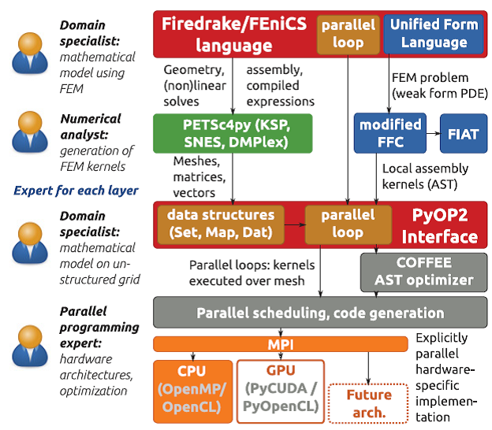
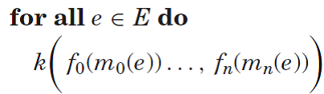
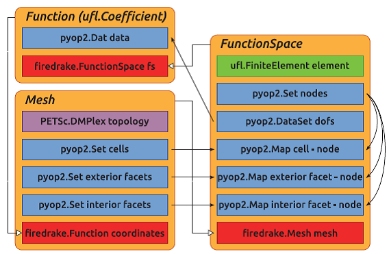

# Firedrake软件栈说明

## FEniCS, Firedrake与基于库的CFD

FEniCS分离了developing FEM和employing FEM

Firedrake引入新的抽象，PyOP2，分离了数学算子的局部离散与在网格上并行执行算子。

数学抽象：微分方程的符号结构，函数空间，对系数矩阵的循环代替积分和浮点运算。其中涉及并行通信、线程和矢量命令等等。

抽象数学表述微分方程，实现：将待求解的方程与离散方法、与实施的线性或非线性求解技术、与实施集合和求解器，相分离。手动编码和底层实施将无法实现上述分离。

一种常见和很成功的方法是：在面向对象库中，将待描述的数学对象表述为**数据对象**(data
object,
C++/FORTRAN90)。然后，高级数学操作表述为对这些对象的操作，即**方法调用**(method
calls)。对浮点数数组的原始数值操作的实际实施，隐藏在这些**方法**的实施中。例如，Deal.II,
DUNE-FEM。先进的稀疏线性代数库，如PETSc等成功应用于这些面向对象库方法。库方法实现了**算法与实施**的分离。

最内层循环：数值操作在网格实体上实行，如cell, face, edge,
vertex，操作与待求解的PDE和使用的数值方法有关。

细粒度并行

基于库的有限单元库，如DUNE-FEM,
Deal.II，积分使用C++表述为在积分点上的底层求和。

## 有限单元的特定域语言(DSL)

与直接编写可执行代码，利用库调用访问功能模块，有限单元方法的数值方法，在特殊目的语言中，单纯地符号定义。然后，特殊编译器或解释器使用该输入，生成底层的高效代码。

UFL (Alnaes et al., 2014)是有限单元的特定域语言(DSL)，内嵌在Python中。

FEniCS Form Compiler
(FFC)将UFL作为输入语言，用于开发高度优化的积分(Olgaard and Wells,
2010)和实施有限单元集合的张量规约(Kirby et al., 2005)。

DSL的另一个好处是：变分问题的符号数学形式。还用来提供：自动伴随算子，自适应误差控制、泛函优化和稳定性分析\[Rognes
and Logg 2013; Farrell et al. 2013; Funke and Farrell 2013; Farrell et
al. 2014\]。

## Firedrake中的抽象

Firedrake软件包将软件栈组合到一个大型的无缝抽象。

图1展示了Firedrake软件栈，显示了各抽象和软件层之间的关系。

图1 抽象组成创建Firedrake工具链，创建问题的分离

### 定义有限单元问题: FEniCS 语言

Poisson和线性波动方程的有限单元问题，以FEniCS语言定义，由Firedrake执行的代码示例(Listing
1, 2)。

### Finite Element Tabulation: FIAT

FInite element Automatic Tabulator (FIAT) \[Kirby 2004\]

### 在Mesh Graph上的循环: PyOP2

Fundamental concepts are shared with OP2 \[Giles et al. 2011\]

PyOP2通过使用Python，在**运行时**，**动态**生成代码，检查对象和数据结构。

OP2依赖输入程序的**静态**分析，在**编译时**，通过source-to-source转换静态分析结果，难以嵌入到其他应用。

另外，PyOP2提供稀疏矩阵和其他数据结构用于有限单元计算，OP2不支持。

### 非结构网格: DMPlex

Firedrake通过使用PETSc的DMPlex，推导出间接网格拓扑对象的输入网格的间接访问Map。

DMPlex将非结构网格数据表征为直接非循环图(Directed Acyclic
Graph)，抽象数据管理。这允许Firedrake利用DMPlex的区域分解和数据转移接口，在运行时实施区域分解，同时支持多种网格文件格式。

Firedrake重排序(reorder)网格实体，通过重叠计算-通信，确保计算效率，并且还利用DMPlex提供的网格重编码(renumbering)技术，改善高速缓存中数据集的局部性(Lange
et al., 2016)。

### 线性和非线性求解器: PETSc

Balay et al. 2014

PETSc 的Python接口(PETSc4py, Dalcin et al. 2011)

## PyOP2

### Set

### Map

### Data

PyOP2支持3种交互数据的核心排列：

(1) Dat, 抽象的离散向量

(2) Mat, 稀疏矩阵

(3) Global，表征与单个Set成员无关的数据

### Parloops 和 Kernels

间接访问，可能引起写操作的竞争，PyOP2采用着色通信避免此问题。

Access Descriptors：核函数修改数据形参。PyOP2采用了OP2的Critical
Observation。以字符形式在核函数修改其形参。

访问描述符，包括：READ, WRITE, RW, INC

Global Arguments：READ, SUM, MIN, MAX

Matrix
Arguments：从PyOP2角度看，Mat是只写数据结构。矩阵-向量乘积和求解线性系统，可使用稀疏矩阵库来执行，如PETSc。

### COFFEE中的核函数优化

核函数，或者使用C代码的字符串，或者使用抽象语法树(AST)，然后生成C代码，来初始化。AST表征提供了通过COFFEE
AST优化程序优化的契机。COFFEE是专门对短的循环做优化的编译器，循环式定义有限单元局部集合核函数的数学表述。

## Firedrake层

Firedrake层的作用就是指挥由UFL, FIAT, FFC, PETSc,
PyOP2提供的抽象，以FEniCS语言定义有限单元问题并有效求解。

### 映射有限单元结构体到数据抽象

网格抽象

图2 PyOP2 and PETSc objects of which key Firedrake objects are composed.
PyOP2 objects are shown in blue, references to other Firedrake objects
are red, and PETSc objects are purple.

Function Spaces and Functions

Assembling Forms

## 修正的FFC

## Escaping the Abstraction

### Custom Kernels

### Direct Access to Data Structures

### Access to Generated Code

## Additional Features Facilitated by the Firedrake Abstraction

### Factorization of Mixed Function Spaces

### Pointwise Operations

### Immersed Manifolds and Extruded Meshes

Rognes et al., 2013介绍了高维空间中的浸没流形，直接扩展到Firedrake

另外，Firedrake扩展了UFL,
FFC和FIAT中的有限单元的代数标准和基函数，可以在四边形、三角形棱柱和六面体单元上代数创建有限单元张量积。

大气和海洋中常用的高长宽比的计算域网格。

## 7 目前的限制和将来的扩展

### 7.1. Accelerators and Threads

### 7.2. *hp*-Adaptive Finite Element Methods

### 7.3. Firedrake Adjoint

## 文献

Florian Rathgeber, David A. Ham, Lawrence Mitchell, Michael Lange, Fabio
Luporini, Andrew T. T. McRae, Gheorghe-Teodor Bercea, Graham R. Markall,
Paul H. J. Kelly. 2016. Firedrake: Automating the finite element method
by composing abstractions. ACM Trans. Math. Softw. 43, 3, Article 24
(December 2016), 27 pages. DOI: http://dx.doi.org/10.1145/2998441
