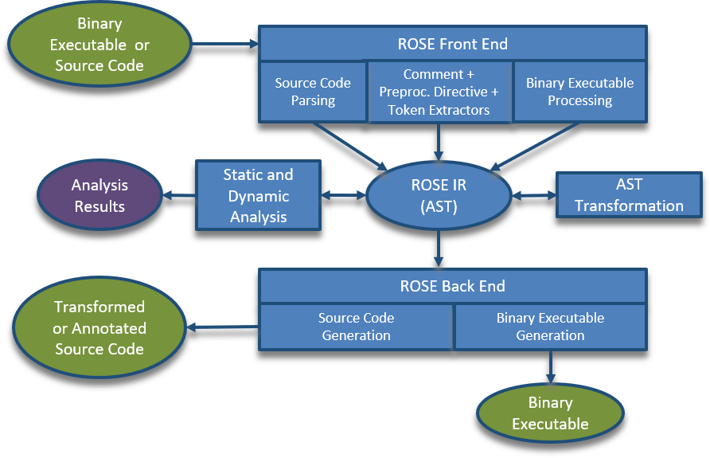

# MG-CFD的异构并行优化

# 目录 {#目录 .TOC-Heading}

[GPU+CPU异构并行优化方案测试
[1](#mg-cfd的异构并行优化)](#mg-cfd的异构并行优化)

> [1工作站配置介绍 [2](#工作站配置介绍)](#工作站配置介绍)
>
> [2多瑙调度器 [2](#多瑙调度器)](#多瑙调度器)
>
> [4测试用例MGCFD
> [3](#优化前op2构建脚本及运行步骤)](#优化前op2构建脚本及运行步骤)
>
> [4.1mgcfd运行步骤 [3](#mgcfd可执行程序概况)](#mgcfd可执行程序概况)
>
> [4.2mgcfd运行参数 [3](#mgcfd运行参数)](#mgcfd运行参数)
>
> [5对比场景（1）：未优化的计算作为对比基准
> [4](#对比场景1未优化的计算作为对比基准)](#对比场景1未优化的计算作为对比基准)
>
> [5.1Rotor37_1M测试用例的运行
> [4](#rotor37_1m测试用例的运行)](#rotor37_1m测试用例的运行)
>
> [5.2Rotor37_8M测试用例的运行
> [7](#rotor37_8m测试用例的运行)](#rotor37_8m测试用例的运行)
>
> [5.3小结 [8](#小结)](#小结)
>
> [7对比场景（3）：CPU代码优化（HDF5异步存储）
> [8](#对比场景2cpu代码优化hdf5异步存储)](#对比场景2cpu代码优化hdf5异步存储)
>
> [7.1HDF5同步与异步的对比
> [8](#hdf5同步与异步的对比)](#hdf5同步与异步的对比)
>
> [7.2数据一致性的检查 [9](#_Toc122339230)](#_Toc122339230)
>
> [7.3小结 [11](#小结-1)](#小结-1)
>
> [8对比场景（4）：GPU代码优化
> [12](#对比场景3gpu代码优化)](#对比场景3gpu代码优化)
>
> [8.1基于CPU-GPU间数据异步拷贝的优化
> [12](#基于cpu-gpu间数据异步拷贝的优化)](#基于cpu-gpu间数据异步拷贝的优化)
>
> [8.2基于GPUDirect RDMA优化GPU设备间通信
> [13](#基于gpudirect-rdma优化gpu设备间通信)](#基于gpudirect-rdma优化gpu设备间通信)
>
> [8.3小结 [15](#小结-2)](#小结-2)
>
> [9项目研究结论 [16](#项目研究结论)](#项目研究结论)

## 1工作站配置介绍

OP2-Common及MGCFD-OP2应用的编译、运行及优化，首先在X86 AMD
CPU的工作站上完成，然后迁移至鲲鹏920集群的登录节点，做计算性能的对比。下面介绍一下X86工作站与鲲鹏920工作站的配置情况。

X86工作站的处理安装的是AMD 3800 (8核16线程，3.9GHz)，Nvidia Quadro 4000
GPU；而鲲鹏920集群的登录节点上安装的是：Kunpeng920 CPU与 Nvidia Tesla
A100 GPU。具体的配置信息及软硬件情况如表1所列。

表1 硬件与软件配置

  -----------------------------------------------------------------------
  硬件                                            
  ----------------------- ----------------------- -----------------------
  处理器                  AMD 3800                Kunpeng920

  核心频率(GHz)           3.9                     2.9

  核心数(个)              8x2                     64x2 (NUMA)

  Host ISA                AVX512                  ARM

  内存(GB)                16                      128

  加速器(GPU)             Quadro 4000             Tesla A100

  CUDA核心(个)            1792                    6912

  GPU核主频               400 MHz                 1.41 GHz

  显存(GB)                8                       40

  显存带宽                243 GB/s                1.6 TB/s

  是否支持NVLink          不支持                  支持

  是否支持GPUDirect       支持                    支持

  软件                                            

  操作系统                Ubuntu 20.04            openEuler 20.03-sp3

  编译器                  GNU g++ 10.4            毕昇编译器2.1

  MPI通信库               openMPI-4.0             Hyper MPI 1.1.1
  -----------------------------------------------------------------------

## 2多瑙调度器

鲲鹏集群使用多瑙调度器，调度Kunpeng920集群与Tesla
A100集群，相关命令执行如下：

（1）dconfig，输入密码，获取令牌。

（2）查询节点：dnode

{width="5.338859361329834in"
height="1.7319761592300962in"}

（3）dsub -s jobscript.sh （参考鲲鹏集群登录节点提供的示例脚本）。

（4）dsub \--help 查询形参选择

（5）查询Nvidia显卡的配置及安装情况，执行：nvidia-smi，显示如下：

{width="4.765416666666667in"
height="2.7361603237095364in"}

## [3优化前OP2构建脚本及运行步骤]{.mark}

### 3.1mgcfd可执行程序概况 {#mgcfd可执行程序概况 .标题3}

（1）在X86工作站上，运行mgcfd_seq、mgcfd_openmp、mgcfd_mpi和mgcfd_cuda，以及mgcfd_mpi_openmp。因为X86工作仅有1个GPU卡，因此没有运行mgcfd_mpi_cuda。

（2）在鲲鹏920集群上，在登录节点运行mgcfd_seq、mgcfd_openmp和mgcfd_cuda；使用多瑙调度器运行mgcfd_mpi（CPU集群）和mgcfd_mpi_cuda（GPU集群）。

### 3.2mgcfd运行参数 {#mgcfd运行参数 .标题3}

快速运行mgcfd\_\*\*\*，进入有HDF5格式的输入文件的目录，最基本的执行命令是：

./mgcfd\_\*\*\* -i input.dat

mgcfd\_\*\*\*还有其他一些命令行参数，可查询：./mgcfd\_\*\*\*
\--help，显示如下：

（1）关键形参

-i, \--input-file=PATH 多重网格输入文件(.dat)

-c, \--config-filepath=FILEPATH，配置文件，多种情景批处理运行

（2）可选性形参

-d, \--input-directory 输入文件的路径

-o, \--output-file-prefix=STRING 输出文件名前缀

-p, \--papi-config-file=FILEPATH 监控PAPI事件列表的文件

-g, \--num-cycles=INT 执行多重网格的V循环的次数

-m, \--partitioner=STRING: parmetis (default), ptscotch, inertial
非结构网格区域分解库选择

-r, \--partitioner-method=STRING: geom(default), kway, geomkway
区域分解算法选择

-n, \--renumber 使用SCOTCH重编码网格

-b, \--measure-mem-bound
运行核函数\"unstructured_steam\"，量测\"compute_flux_edge\"核函数的内存界限

-v, \--validate-result 检查最终状态变量值

-I, \--output-flow-interval=INT
2次流体计算输出之间的多重网格循环计算次数

（3）调试用形参

\--output-variables 输出Euler方程变量值到HDF5文件

\--output-fluxes 输出通量累积值到HDF5文件

\--output-step-factors 输出时间步因子到HDF5文件

### [3.3构建脚本说明]{.mark} {#构建脚本说明 .标题3}

（1）进入OP2-Common-BeforeOPT-Kunpeng920目录。

cd OP2-Common-BeforeOPT-Kunpeng920

（2）执行OP2库与MGCFD-OP2应用程序的构建命令：

bash build.sh /path/to/buildpath /path/to/installpath

注：/path/to/buildpath
/path/to/installpath分别为用户自己定义的构建目录与安装目录。

（3）下载2个涡轮叶片的绕流计算测试算例文件。

一个是113万网格单元的算例；一个是800万网格单元的算例。

wget
https://warwick.ac.uk/fac/sci/dcs/research/systems/hpsc/software/rotor37_1m.tar.gz

wget
https://warwick.ac.uk/fac/sci/dcs/research/systems/hpsc/software/rotor37_8m.tar.gz

分别解压缩：

tar xf rotor37_1m.tar.gz

tar xf rotor37_8m.tar.gz

生成2个测试算例的文件夹（Rotor37_1M与Rotor37_8M），每个文件夹下面包含一个ASCII格式的输入文件input.dat和4个HDF5格式的网格文件，还有4个H5格式的计算结果文件。

（4）将OP2-Common-AfterOPT-Kunpeng920/beforeOPT_donau目录下的多瑙调取器调度脚本（包含1M和8M两个测试算例的脚本），分别拷贝到Rotor37_1M与Rotor37_8M两个测试算例的目录下。以Rotor37_1M的调度脚本为例：

submit_mgcfd_mpi.sh为CPU集群的调度脚本；

submit_mgcfd_mpi_cuda.sh为GPU集群的调度脚本。

submit_mgcfd_mpi.sh脚本内容：（用户必须设置正确的安装目录的路径：export
installpath=/workspace/home/migration/zhusihai，见调度脚本内容）。

#!/bin/sh

#===========================================================

\# DSUB

#===========================================================

#DSUB \--job_type cosched

#DSUB -n mgcfd_mpi

#DSUB -A root.migration

#DSUB -q root.default

#DSUB -R cpu=32;mem=40960;gpu=1

#DSUB -N 2

#DSUB -o out%J.log

#DSUB -e err%J.log

#===========================================================

\# module load env.

#===========================================================

module use /workspace/public/software/modules

module purge

module use /workspace/public/software/modules

module load compilers/bisheng/2.1.0/bisheng2.1.0

module use /workspace/public/software/modules

module load mpi/hmpi/1.1.1/bisheng2.1.0

module use /workspace/public/software/modules

module load compilers/cuda/11.14.1

export installpath=/workspace/home/migration/zhusihai

export CUDA_INSTALL_PATH=/usr/local/cuda-11.4

export
MPI_INSTALL_PATH=/workspace/public/software/mpi/hmpi/1.1.1/bisheng2.1.0/ompi

export PTSCOTCH_INSTALL_PATH=\$installpath/scotch_6.0.6

export PARMETIS_INSTALL_PATH=\$installpath/parmetis-4.0.3/metis

export HDF5_INSTALL_PATH=\$installpath/hdf5-1.12.1

export OP2_COMPILER=\'clang\'

export LD_LIBRARY_PATH=\$CUDA_INSTALL_PATH/lib64:\$LD_LIBRARY_PATH

export
LD_LIBRARY_PATH=\$PARMETIS_INSTALL_PATH/lib:\$PTSCOTCH_INSTALL_PATH/lib:\$LD_LIBRARY_PATH

export LD_LIBRARY_PATH=\$HDF5_INSTALL_PATH/lib:\$LD_LIBRARY_PATH

export OP2_INSTALL_PATH=\$installpath/OP2-Common-release-2020/op2/c

export PATH=\$installpath/MG-CFD-app-OP2/bin:\$PATH

#===========================================================

\# hostfile

#===========================================================

echo \-\-\-\-- print env vars \-\-\-\--

if \[ \"\${CCS_ALLOC_FILE}\" != \"\" \]; then

echo \" \"

ls -la \${CCS_ALLOC_FILE}

echo \-\-\-\-\-- cat \${CCS_ALLOC_FILE}

cat \${CCS_ALLOC_FILE}

fi

export HOSTFILE=/tmp/hostfile.\$\$

rm -rf \$HOSTFILE

touch \$HOSTFILE

\# parse CCS_ALLOC_FILE

\## node name, cores, tasks, task_list

\# hpcbuild002 8 1 container_22_default_00001_e01_000002

\# hpctest005 8 1 container_22_default_00000_e01_000001

ntask=\`cat \${CCS_ALLOC_FILE} \| awk -v fff=\"\$HOSTFILE\" \'{}

{

split(\$0, a, \" \")

if (length(a\[1\]) \>0 && length(a\[3\]) \>0) {

print a\[1\]\" slots=\"a\[2\] \>\> fff

total_task+=a\[3\]

}

}END{print total_task}\'\`

echo \"hypermpi hostfile \$HOSTFILE generated:\"

echo \"\-\-\-\-\-\-\-\-\-\-\-\-\-\-\-\-\-\-\-\-\-\--\"

cat \$HOSTFILE

echo \"\-\-\-\-\-\-\-\-\-\-\-\-\-\-\-\-\-\-\-\-\-\--\"

echo \`which mgcfd_mpi\`

echo \"\-\-\-\-\-\-\-\-\-\-\-\-\-\-\-\-\-\-\-\-\-\--\"

echo \"Total tasks is \$ntask\"

echo \"mpirun -hostfile \$HOSTFILE -n \$ntask \<your application\>\"

#===========================================================

\# run script: we use 2 nodes and 2x32=64 processes

#===========================================================

#start a simple mpi program

#/usr/local/bin/mpirun -hostfile \$HOSTFILE -n \$ntask hostname

mpirun -hostfile \$HOSTFILE -N 2 \--mca plm_rsh_agent
/opt/batch/agent/tools/dstart -x PATH -x LD_LIBRARY_PATH -mca pml ucx -x
UCX_NET_DEVICES=mlx5_0:1 -mca btl \^vader,tcp,openib,uct -x
UCX_TLS=self,sm,rc \--bind-to core \--map-by socket \--rank-by core
mgcfd_mpi -i input.dat -m parmetis -r kway \--output-variables

ret=\$?

submit_mgcfd_mpi_cuda.sh脚本内容（用户必须设置正确的安装目录的路径：export
installpath=/workspace/home/migration/zhusihai，见调度脚本内容）。

#!/bin/sh

#===========================================================

#配置DSUB资源

#===========================================================

#DSUB \--job_type cosched

#DSUB -n mgcfd_mpi_cuda

#DSUB -A root.migration

#DSUB -q root.default

#DSUB -R cpu=4;mem=40960;gpu=1

#DSUB -N 1

#DSUB -o out%J.log

#DSUB -e err%J.log

#===========================================================

#加载环境变量

#===========================================================

module use /workspace/public/software/modules

module purge

module use /workspace/public/software/modules

module load compilers/bisheng/2.1.0/bisheng2.1.0

module use /workspace/public/software/modules

module load mpi/hmpi/1.1.1/bisheng2.1.0

module use /workspace/public/software/modules

module load compilers/cuda/11.14.1

export installpath=/workspace/home/migration/zhusihai

export CUDA_INSTALL_PATH=/usr/local/cuda-11.4

export
MPI_INSTALL_PATH=/workspace/public/software/mpi/hmpi/1.1.1/bisheng2.1.0/ompi

export PTSCOTCH_INSTALL_PATH=\$installpath/scotch_6.0.6

export PARMETIS_INSTALL_PATH=\$installpath/parmetis-4.0.3/metis

export HDF5_INSTALL_PATH=\$installpath/hdf5-1.12.1

export OP2_COMPILER=\'clang\'

export LD_LIBRARY_PATH=\$CUDA_INSTALL_PATH/lib64:\$LD_LIBRARY_PATH

export
LD_LIBRARY_PATH=\$PARMETIS_INSTALL_PATH/lib:\$PTSCOTCH_INSTALL_PATH/lib:\$LD_LIBRARY_PATH

export LD_LIBRARY_PATH=\$HDF5_INSTALL_PATH/lib:\$LD_LIBRARY_PATH

export OP2_INSTALL_PATH=\$installpath/OP2-Common-release-2020/op2/c

export PATH=\$installpath/MG-CFD-app-OP2/bin:\$PATH

#===========================================================

#获得hostfile

#===========================================================

echo \-\-\-\-- print env vars \-\-\-\--

if \[ \"\${CCS_ALLOC_FILE}\" != \"\" \]; then

echo \" \"

ls -la \${CCS_ALLOC_FILE}

echo \-\-\-\-\-- cat \${CCS_ALLOC_FILE}

cat \${CCS_ALLOC_FILE}

fi

export HOSTFILE=/tmp/hostfile.\$\$

rm -rf \$HOSTFILE

touch \$HOSTFILE

\# parse CCS_ALLOC_FILE

\## node name, cores, tasks, task_list

\# hpcbuild002 8 1 container_22_default_00001_e01_000002

\# hpctest005 8 1 container_22_default_00000_e01_000001

ntask=\`cat \${CCS_ALLOC_FILE} \| awk -v fff=\"\$HOSTFILE\" \'{}

{

split(\$0, a, \" \")

if (length(a\[1\]) \>0 && length(a\[3\]) \>0) {

print a\[1\]\" slots=\"a\[2\] \>\> fff

total_task+=a\[3\]

}

}END{print total_task}\'\`

echo \"hypermpi hostfile \$HOSTFILE generated:\"

echo \"\-\-\-\-\-\-\-\-\-\-\-\-\-\-\-\-\-\-\-\-\-\--\"

cat \$HOSTFILE

echo \"\-\-\-\-\-\-\-\-\-\-\-\-\-\-\-\-\-\-\-\-\-\--\"

echo \`which mgcfd_mpi_cuda\`

echo \"\-\-\-\-\-\-\-\-\-\-\-\-\-\-\-\-\-\-\-\-\-\--\"

echo \"Total tasks is \$ntask\"

echo \"mpirun -hostfile \$HOSTFILE -n \$ntask \<your application\>\"

#===========================================================

#运行测试脚本: multi-GPU should use -np 4

#===========================================================

mpirun -hostfile \$HOSTFILE -np 4 \--mca plm_rsh_agent
/opt/batch/agent/tools/dstart -x LD_LIBRARY_PATH -mca pml ucx -x
UCX_NET_DEVICES=mlx5_0:1 -mca btl \^vader,tcp,openib,uct -x
UCX_TLS=self,sm,rc \--bind-to core \--map-by socket \--rank-by core
mgcfd_mpi_cuda -i input.dat -r kway \--output-variables

ret=\$?

两个算例的多瑙调度脚本是一样的，不再重复介绍。

（5）执行多瑙调度即可：

dsub -s submit_mgcfd_mpi.sh

或

dsub -s submit_mgcfd_mpi_cuda.sh

由于测试迭代步数较少，稍等片刻即可完成计算测试，查看log文件内容，找到max
total runtime即为计算耗时(s)。

## 4对比场景（1）：未优化的计算作为对比基准

### 4.1Rotor37_1M测试用例的运行 {#rotor37_1m测试用例的运行 .标题3}

以113万(Rotor37_1M)三角形网格单元的网格文件测试未优化的常规MGCFD-OP2的计算效率。分别在X86和鲲鹏920工作站上运行了不同并行方式的可执行程序，总的执行耗时汇总于表1。串行程序，在鲲鹏920处理器的执行耗时（116.42s），比X86工作站（108.65s）的要长，表明仅单核计算，鲲鹏920处理器并无优势。但使用多线程并行时（OpenMP），鲲鹏920处理器的64个物理核心的多线程并发优势显著，比X86的多线程并行降低了约3s，提速34%。还值得注意的是：在鲲鹏920处理器上，如果不使用kway的非结构网格分区，将无法发挥MPI的多进程并行，MPI并行计算耗时与串行相当，只有使用kway分区算法时，才能显著加速计算，而X86工作站上没有发现此问题。

GPU异构并行计算，Tesla A100卡显著优于Quadro
4000显卡，这是意料之中的结果，因为Tesla A100的物理核心数远超过Quadro
4000显卡。

表1 在x86和鲲鹏920上的计算耗时(s)

  -------------------------------------------------------------------------
  可执行程序名称     X86服务器       鲲鹏920服务器       备注
  ------------------ --------------- ------------------- ------------------
  mgcfd_seq          108.654         116.42              串行

  mgcfd_openmp       10.821          7.85                多线程并行

  mgcfd_cuda         4.69            3.88                单GPU

  mgcfd_mpi          11.253          108.01 (-n 64)      geom分区

  mgcfd_mpi          10.982          9.65 (-n 16)        kway分区

  mgcfd_mpi          \-              3.2884 (-n 64)      kway分区

  mgcfd_mpi          \-              8.0925 (-np 64)     kway, dsub集群调度

  mgcfd_mpi_openmp   \-              3.2897(-np 64)      kway, 混合并行
  -------------------------------------------------------------------------

基于表1中的测试耗时数据作图，如图1，当使用16个线程时，鲲鹏920处理器的性能与X86处理器的性能才能持平。这里需要提到的是：X86架构的AMD
3800处理器有8核，16个超线程的计算性能，各核心的主频高于鲲鹏920处理器，当使用更多的线程后，鲲鹏920处理器的性能将超过普通的X86处理器（例如Intel
Phi处理器与AMD
EPYC处理器也拥有众多物理核心），如图2所示。在鲲鹏920处理器上，使用MPI的多线程运行时，其性能超过OpenMP，如图2，因为MPI的运行时线程捆绑核心，避免了NUMA问题，充分发挥了多线程的功能，性能优于OpenMP并行。

{width="3.600786307961505in"
height="2.6768952318460193in"}

图1 多线程并行(OpenMP)在X86与鲲鹏920处理器上的性能差异

{width="3.4113517060367453in"
height="2.7977668416447945in"}

图2 鲲鹏920集群登录节点上的CPU多线程并行(OpenMP)测试

需要注意的是，鲲鹏920处理器对非结构网格区域分解有要求，如图3，除了kway的分区算法可以在鲲鹏920处理器上发挥MPI的并行效率外，其他两种（geom,
geomkway）均不能起作用。这个问题在X86处理器上未发现，也有可能是X86处理器不是NUMA架构。这一点需要在同样NUMA架构的X86处理器上验证。

{width="3.7848939195100613in"
height="2.5389107611548556in"}

图3 鲲鹏920集群上的CPU集群并行测试

### 4.2Rotor37_8M测试用例的运行 {#rotor37_8m测试用例的运行 .标题3}

增大计算规模，测试并行计算效率。使用800万网格单元（Rotor37_8M）测试多种并行方式的MGCFD应用程序，计算耗时列于表2。由于计算规模很大，超出了单机的内存，因此无法以串行和OpenMP多线程并行在单机上运行，包括X86与鲲鹏920工作站。仅测试了MPI多进程与GPU异构并行。从表2可以看出：随着使用的进程数增加，计算耗时逐渐减小，MPI并行的扩展性超过80%，在鲲鹏920集群上具有很好的性能表现。A100显卡的优势较小规模计算时，较Quadro4000卡的优势更加明显。

表2 在X86和鲲鹏920上的计算耗时(s)

  ------------------------------------------------------------------------
  可执行程序名称       X86服务器     鲲鹏920服务器      备注
  -------------------- ------------- ------------------ ------------------
  mgcfd_seq            无法计算      无法计算           内存不足

  mgcfd_openmp         无法计算      无法计算           内存不足

  mgcfd_mpi            \-            56.864 (-np 32)    CPU集群

  mgcfd_mpi            \-            29.255 (-np 64)    CPU集群

  mgcfd_mpi            \-            19.532 (-np 128)   CPU集群

  mgcfd_mpi            \-            16.972 (-np 256)   CPU集群

  mgcfd_cuda           46.215        27.920             单GPU
  ------------------------------------------------------------------------

根据表2的测试数据作图4，可见：鲲鹏集群上的MPI并行的扩展比超过80%，具有很好的扩展性和性能表现。目前的测试仅使用了4个计算节点，因为计算规模仍然不够大，如果继续增大计算规模，使用更多的计算节点，会有更好的性能表现。

{width="3.890702099737533in"
height="2.659459755030621in"}

图4 鲲鹏集群上的MPI并行计算加速效果

### 4.3小结 {#小结 .标题3}

1、在X86服务器上，各种并行模式和考虑荷载均衡的非结构网格区域分解的3种算法(geom,
kway, geomkway)，都能取得很好的加速效率。

2、在鲲鹏920处理器上，网格区域分解算法对并行效率影响很大，geom和geomkway分区算法后，MPI并行相比串行的计算耗时差不多，不能加速；而使用kway分区算法，MPI并行可以加速计算，达到与x86服务器上相似的加速效率。因此，OP2库的github仓库代码中，默认的区域分解算法修改为kway。另外，同样的数值算法，MPI并行方式的计算效率超过OpenMP并行，因为MPI调度时绑定物理核心，回避的NUMA的问题。以上2点发现对鲲鹏920处理器的并行加速有很好的启示。

## [5优化后OP2构建脚本及运行步骤]{.mark}

优化后的OP2库与MGCFD-OP2的构建过程，与优化前的源码构建过程几乎一致，除了优化后的OP2库需要用到带GPUDirect
RDMA构建功能的OpenMPI-4.1和HDF5-1.13.0库。优化后的OP2库与MGCFD-app-OP2源码的构建执行脚本程序即可。

构建步骤：

（1）进入OP2-Common-AfterOPT-Kunpeng920目录。

cd OP2-Common-AfterOPT-Kunpeng920

（2）执行OP2库与MGCFD-OP2应用程序的构建命令：

bash build.sh /path/to/buildpath /path/to/installpath

注：/path/to/buildpath
/path/to/installpath分别为用户自己定义的构建目录与安装目录。

（3）下载2个涡轮叶片的绕流计算测试算例文件。

一个是113万网格单元的算例；一个是800万网格单元的算例。

wget
https://warwick.ac.uk/fac/sci/dcs/research/systems/hpsc/software/rotor37_1m.tar.gz

wget
https://warwick.ac.uk/fac/sci/dcs/research/systems/hpsc/software/rotor37_8m.tar.gz

分别解压缩：

tar xf rotor37_1m.tar.gz

tar xf rotor37_8m.tar.gz

生成2个测试算例的文件夹（Rotor37_1M与Rotor37_8M），每个文件夹下面包含一个ASCII格式的输入文件input.dat和4个HDF5格式的网格文件，还有4个H5格式的计算结果文件。

（4）将OP2-Common-AfterOPT-Kunpeng920/afterOPT_donau目录下的多瑙调取器调度脚本（包含1M和8M两个测试算例的脚本），分别拷贝到Rotor37_1M与Rotor37_8M两个测试算例的目录下。以Rotor37_1M的调度脚本为例：

submit_mgcfd_mpi.sh为CPU集群的调度脚本；

submit_mgcfd_mpi_cuda.sh为GPU集群的调度脚本。

submit_mgcfd_mpi.sh脚本内容：

注意：红色部分的脚本内容，必须加载安装正确的OpenMPI、设置正确的安装目录路径、设置正确的OP2库安装路径等。

#!/bin/sh

#===========================================================

\# 配置DSUB资源

#===========================================================

#DSUB \--job_type cosched

#DSUB -n mgcfd_mpi

#DSUB -A root.migration

#DSUB -q root.default

#DSUB -R cpu=32;mem=40960;gpu=1

#DSUB -N 2

#DSUB -o out%J.log

#DSUB -e err%J.log

#===========================================================

#加载环境变量

#===========================================================

module use /workspace/public/software/modules

module purge

module use /workspace/public/software/modules

module load compilers/bisheng/2.1.0/bisheng2.1.0

module use /workspace/home/migration/zhusihai/openmpi-gdr/

module load
/workspace/home/migration/zhusihai/openmpi-gdr/openmpi_modulefiles

module use /workspace/public/software/modules

module load compilers/cuda/11.14.1

export installpath=/workspace/home/migration/zhusihai

export CUDA_INSTALL_PATH=/usr/local/cuda-11.4

export MPI_INSTALL_PATH=\$installpath/openmpi4.1-with-gdr

export PTSCOTCH_INSTALL_PATH=\$installpath/scotch_6.0.6

export PARMETIS_INSTALL_PATH=\$installpath/parmetis-4.0.3/metis

export HDF5_INSTALL_PATH=\$installpath/hdf5-1.13.0

export OP2_COMPILER=\'clang\'

export LD_LIBRARY_PATH=\$CUDA_INSTALL_PATH/lib64:\$LD_LIBRARY_PATH

export
LD_LIBRARY_PATH=\$PARMETIS_INSTALL_PATH/lib:\$PTSCOTCH_INSTALL_PATH/lib:\$LD_LIBRARY_PATH

export LD_LIBRARY_PATH=\$HDF5_INSTALL_PATH/lib:\$LD_LIBRARY_PATH

export
OP2_INSTALL_PATH=\$installpath/OP2-Common-release-2020-async/op2/c

export PATH=\$installpath/MG-CFD-app-OP2/bin:\$PATH

#===========================================================

\# 获得hostfile

#===========================================================

echo \-\-\-\-- print env vars \-\-\-\--

if \[ \"\${CCS_ALLOC_FILE}\" != \"\" \]; then

echo \" \"

ls -la \${CCS_ALLOC_FILE}

echo \-\-\-\-\-- cat \${CCS_ALLOC_FILE}

cat \${CCS_ALLOC_FILE}

fi

export HOSTFILE=/tmp/hostfile.\$\$

rm -rf \$HOSTFILE

touch \$HOSTFILE

\# parse CCS_ALLOC_FILE

\## node name, cores, tasks, task_list

\# hpcbuild002 8 1 container_22_default_00001_e01_000002

\# hpctest005 8 1 container_22_default_00000_e01_000001

ntask=\`cat \${CCS_ALLOC_FILE} \| awk -v fff=\"\$HOSTFILE\" \'{}

{

split(\$0, a, \" \")

if (length(a\[1\]) \>0 && length(a\[3\]) \>0) {

print a\[1\]\" slots=\"a\[2\] \>\> fff

total_task+=a\[3\]

}

}END{print total_task}\'\`

echo \"hypermpi hostfile \$HOSTFILE generated:\"

echo \"\-\-\-\-\-\-\-\-\-\-\-\-\-\-\-\-\-\-\-\-\-\--\"

cat \$HOSTFILE

echo \"\-\-\-\-\-\-\-\-\-\-\-\-\-\-\-\-\-\-\-\-\-\--\"

echo \`which mgcfd_mpi\`

echo \"\-\-\-\-\-\-\-\-\-\-\-\-\-\-\-\-\-\-\-\-\-\--\"

echo \"Total tasks is \$ntask\"

echo \"mpirun -hostfile \$HOSTFILE -n \$ntask \<your application\>\"

#===========================================================

\# 运行测试脚本

#===========================================================

#start a simple mpi program

#/usr/local/bin/mpirun -hostfile \$HOSTFILE -n \$ntask hostname

mpirun -hostfile \$HOSTFILE -N 2 \--mca plm_rsh_agent
/opt/batch/agent/tools/dstart -x PATH -x LD_LIBRARY_PATH -mca pml ucx -x
UCX_NET_DEVICES=mlx5_0:1 -mca btl \^vader,tcp,openib,uct -x
UCX_TLS=self,sm,rc \--bind-to core \--map-by socket \--rank-by core
mgcfd_mpi -i input.dat -m parmetis -r kway \--output-variables

ret=\$?

submit_mgcfd_mpi_cuda.sh脚本内容（注意红色部分的脚本，与脚本submit_mgcfd_mpi.sh的设置内容相似）。

#!/bin/sh

#===========================================================

#配置DSUB资源

#===========================================================

#DSUB \--job_type cosched

#DSUB -n mgcfd_mpi_cuda

#DSUB -A root.migration

#DSUB -q root.default

#DSUB -R cpu=4;mem=40960;gpu=1

#DSUB -N 1

#DSUB -o out%J.log

#DSUB -e err%J.log

#===========================================================

#加载环境变量

#===========================================================

module use /workspace/public/software/modules

module purge

module use /workspace/public/software/modules

module load compilers/bisheng/2.1.0/bisheng2.1.0

module use /workspace/home/migration/zhusihai/openmpi-gdr/

module load
/workspace/home/migration/zhusihai/openmpi-gdr/openmpi_modulefiles

module use /workspace/public/software/modules

module load compilers/cuda/11.14.1

export installpath=/workspace/home/migration/zhusihai

export CUDA_INSTALL_PATH=/usr/local/cuda-11.4

export MPI_INSTALL_PATH=\$installpath/openmpi4.1-with-gdr

export PTSCOTCH_INSTALL_PATH=\$installpath/scotch_6.0.6

export PARMETIS_INSTALL_PATH=\$installpath/parmetis-4.0.3/metis

export HDF5_INSTALL_PATH=\$installpath/hdf5-1.13.0

export OP2_COMPILER=\'clang\'

export LD_LIBRARY_PATH=\$CUDA_INSTALL_PATH/lib64:\$LD_LIBRARY_PATH

export
LD_LIBRARY_PATH=\$PARMETIS_INSTALL_PATH/lib:\$PTSCOTCH_INSTALL_PATH/lib:\$LD_LIBRARY_PATH

export LD_LIBRARY_PATH=\$HDF5_INSTALL_PATH/lib:\$LD_LIBRARY_PATH

export
OP2_INSTALL_PATH=\$installpath/OP2-Common-release-2020-async/op2/c

export PATH=\$installpath/MG-CFD-app-OP2/bin:\$PATH

\# GDRCopy so library

export LD_PRELOAD=\"\$installpath/gdrcopy-2.3/lib64/libgdrapi.so\"

#===========================================================

#获得hostfile

#===========================================================

echo \-\-\-\-- print env vars \-\-\-\--

if \[ \"\${CCS_ALLOC_FILE}\" != \"\" \]; then

echo \" \"

ls -la \${CCS_ALLOC_FILE}

echo \-\-\-\-\-- cat \${CCS_ALLOC_FILE}

cat \${CCS_ALLOC_FILE}

fi

export HOSTFILE=/tmp/hostfile.\$\$

rm -rf \$HOSTFILE

touch \$HOSTFILE

\# parse CCS_ALLOC_FILE

\## node name, cores, tasks, task_list

\# hpcbuild002 8 1 container_22_default_00001_e01_000002

\# hpctest005 8 1 container_22_default_00000_e01_000001

ntask=\`cat \${CCS_ALLOC_FILE} \| awk -v fff=\"\$HOSTFILE\" \'{}

{

split(\$0, a, \" \")

if (length(a\[1\]) \>0 && length(a\[3\]) \>0) {

print a\[1\]\" slots=\"a\[2\] \>\> fff

total_task+=a\[3\]

}

}END{print total_task}\'\`

echo \"hypermpi hostfile \$HOSTFILE generated:\"

echo \"\-\-\-\-\-\-\-\-\-\-\-\-\-\-\-\-\-\-\-\-\-\--\"

cat \$HOSTFILE

echo \"\-\-\-\-\-\-\-\-\-\-\-\-\-\-\-\-\-\-\-\-\-\--\"

echo \`which mgcfd_mpi_cuda\`

echo \"\-\-\-\-\-\-\-\-\-\-\-\-\-\-\-\-\-\-\-\-\-\--\"

echo \"Total tasks is \$ntask\"

echo \"mpirun -hostfile \$HOSTFILE -n \$ntask \<your application\>\"

#===========================================================

#运行测试脚本

#===========================================================

mpirun -hostfile \$HOSTFILE -np 4 \--mca plm_rsh_agent
/opt/batch/agent/tools/dstart -x LD_LIBRARY_PATH -mca pml ucx -x
UCX_NET_DEVICES=mlx5_0:1 -mca btl \^vader,tcp,openib,uct -x
UCX_TLS=self,sm,rc,cuda_copy \--bind-to core \--map-by socket \--rank-by
core mgcfd_mpi_cuda -gpudirect -i input.dat -m parmetis -r kway
\--output-variables

ret=\$?

两个算例的多瑙调度脚本是一样的，不再重复介绍。

（5）执行多瑙调度即可：

dsub -s submit_mgcfd_mpi.sh

或

dsub -s submit_mgcfd_mpi_cuda.sh

由于测试迭代步数较少，稍等片刻即可完成计算测试，查看log文件内容，找到max
total runtime即为计算耗时(s)。

## 6对比场景（2）：CPU代码优化（HDF5异步存储）

### 6.1HDF5同步与异步的对比 {#hdf5同步与异步的对比 .标题3}

（1）运行MPI并行的MGCFD-OP2的应用程序，使用标准的（同步）HDF5库执行计算结果的保存；

（2）对OP2库的HDF5
API部分代码，基于HDF5-1.13.0与VOL-Async库做优化，重叠数据I/O与计算部分，与标准的HDF5
API调用做对比。

如图7，由于隐藏了部分数据写到磁盘的时间到计算部分，相比同步的HDF5调用，异步HDF5保存数据降低了0.5(s)，相比同步的数据存储耗时降低了20.0%。但是，由于MGCFD-OP2的HDF5格式的计算结果是在时间层迭代完成时执行一次保存，如果将异步的HDF5调用放入时间层迭代，会导致HDF5文件的不断打开与关闭的频繁操作。而如果一次性打开和关闭HDF5文件，又会破坏特定域语言的结构设计。因此，如果要进一步发挥异步存储的优势，后期需要重新规划OP2库中HDF5
API的调用。

图7 同步和异步模式的HDF5格式文件保存的性能对比

  -----------------------------------------------------------------------
                          Rotor37_1M算例          Rotor37_8M算例
  ----------------------- ----------------------- -----------------------
  同步HDF5                2.55                    18.82

  异步HDF5                2.05                    14.43
  -----------------------------------------------------------------------

[]{#_Toc122339230 .anchor}注：表中计时会有波动，但波动范围不大。

### 6.2数据一致性的检查 {#数据一致性的检查 .标题3}

由于使用HDF5文件格式保存MGCFD应用的计算结果，因此至少有3种方式可以检查计算结果的数据一致性，包括：

\(1\)
使用h5py的Python工具包或有关HDF5文件读写的MATLAB程序，输出指定变量，使用可视化软件（如Tecplot,
ParaView）作图。

\(2\) 使用HDFView的界面化操作。

\(3\) 使用h5dump工具，转换为ASCII格式文件。执行命令：\$ h5dump -g z
op2_result.h5 \>\>result.txt

考虑到第1种需要大量编程，且本项目的重点是考虑CPU和GPU代码的优化及硬件平台的计算性能，而不是CFD模型的可视化以及与试验数据的验证。而第3种方式，当大规模并行时，转换为ASCII格式文件的内容过大，且转换效率很低。因此，采用在X86工作站上，使用界面化的HDF5View工具来考察MGCFD的计算结果数据一致性。

如图8，将HDF5格式的结果文件导入HDFView 3.1.4软件，可以看到各网格层（L0,
L1, L2, L3）上保存的压力p的计算结果。

{width="5.073622047244094in"
height="4.581124234470691in"}

图8 导入MGCFD计算结果的HDF5文件到HDFView软件的界面

比较图9的X86和鲲鹏920处理器上的压力p的计算结果，发现是一致的。表明：使用异步的HDF5存储功能，没有影响MGCFD的计算结果的精度和准确度。

{width="4.769086832895888in"
height="3.411132983377078in"}

\(a\) X86工作站上的HDF5计算结果文件查看

{width="4.710579615048119in"
height="3.170708661417323in"}

\(b\) 鲲鹏920工作站上的HDF5计算结果文件查看

图9 使用HDFView工具检查h5文件的数据一致性

### 6.3小结 {#小结-1 .标题3}

异步HDF5保存数据相比同步的数据存储耗时降低了16.7%。但是仅在时间层迭代结束后执行了一次HDF5文件操作，如果能增大时间层内计算结果的保存频率，将进一步发挥异步存储的优势，但这需要重新设计OP2库的代码结构。最后，使用HDFView工具的可视化界面，可方便检查HDF5文件的数据一致性。

## 7对比场景（3）：GPU代码优化

关于CUDA版本MGCFD运行优化的相关形参有2个：

A、export
OP_AUTO_SOA=1，在op2.py转换代码之前设置好环境变量。这一步在代码转换时已经完成。

B、运行可执行程序时加上参数-gpudirect，如果正确安装了GPUDirect
RDMA的驱动，则运行时实现GPU设备间直连，否则仅实施正常的CUDA-aware
MPI操作。

（1）在鲲鹏920服务器上，运行未优化的CUDA版本的MGCFD模型，包括单节点的GPU和GPU集群。

（2）使用cudaMemcpyAsync优化GPU设备间的数据拷贝代码，增加CPU-GPU间的数据拷贝速率。

（3）使用CUDA-aware MPI操作或GPUDirect
RDMA，增加GPU设备间halo数据交换的通信带宽。

### 7.1基于CPU-GPU间数据异步拷贝的优化 {#基于cpu-gpu间数据异步拷贝的优化 .标题3}

在GPU异构并行的代码中，增加cudaMemcpyAsync和固定内存，实现CPU与GPU之间的异步数据拷贝，即重叠核函数计算与数据传输。目前，仅在默认流(0)中实现固定内存拷贝，提高数据传输速度。如果进一步发挥核函数之间的数据异步拷贝，需要修改OP2的CUDA部分源码，主要是针对不同的核函数需要添加CUDA流的编号，但这样会破坏特定语言库的结构。

如图10，仅实施cudaMemcpyAsync及固定内存的设定后，优化前后的单机GPU异构并行计算效率，未得到显著提升。

{width="4.220054680664917in"
height="2.85in"}

\(a\) 优化前

{width="4.249127296587926in"
height="2.460115923009624in"}

\(b\) 优化后

图10 使用cudaMemcpyAsync和固定内存的CUDA异构并行优化对比

### 7.2基于GPUDirect RDMA优化GPU设备间通信 {#基于gpudirect-rdma优化gpu设备间通信 .标题3}

运行GPUDirect的CUDA-aware
MPI功能的mgcfd_mpi_cuda可执行程序的计算耗时，列入表3。在较小的计算规模（113万计算网格单元）下，多GPU并行（使用2个和4个计算节点，每个计算节点对应一个GPU显卡）时，计算耗时的减小并不显著，不具有扩展性。

表3 GPU异构并行计算耗时（Rotor37 1M测试）

+---------+-------------------+-----------------+---------------------+
| GPU(个) | X86 (Quadro 4000) | 鲲鹏(Tesla      | 鲲鹏(Tesla A100)    |
|         |                   | A100)           |                     |
|         |                   |                 | -gpudirect          |
+=========+===================+=================+=====================+
| 1       | 5.632             | 3.884           | \-                  |
+---------+-------------------+-----------------+---------------------+
| 2       | \-                | 4.189           | 3.163               |
+---------+-------------------+-----------------+---------------------+
| 4       | \-                | 5.412           | 4.078               |
+---------+-------------------+-----------------+---------------------+

根据表3中的测试耗时作图11，可以看到：在小计算规模下，尽管使用多个GPU时可以降低计算耗时，但并不具有可扩展性，这表明1个Tesla
A100卡的多线程完全可以并发执行100万计算网格单元的核函数执行。如图11(b)，使用CUDA-aware
MPI通信还是可以提高多计算节点之间GPU设备之间的数据拷贝速率，节省计算时间。

{width="4.100832239720035in"
height="2.664607392825897in"}

\(a\) 鲲鹏920集群上的多GPU异构并行耗时

{width="3.7093438320209975in"
height="2.6749879702537185in"}

\(b\) CUDA-aware MPI通信方式的计算效率比较

图11 GPU异构并行（Rotor37_1M测试算例）

在较大计算规模（800万计算网格单元）使用GPU集群异构并行的计算耗时列入表4。根据表4的测试耗时作图12，均可以发现：增加计算规模后，单个A100卡内存和线程不足以并发执行核函数的循环计算，多GPU集群的扩展性显露。在此基础上，使用CUDA-awareMPI通信进一步提高GPU集群的计算性能。在使用4个计算节点（对应4张A100显卡），CUDA-awareMPI通信相比常规的cudaMemcpy结合MPI通信的方式，性能提升20.3%。

表4 GPU异构并行计算耗时(s) （Rotor37 8M测试）

  ------------------------------------------------------------------------
  GPU(个)    X86 (Quadro 4000)   鲲鹏 (Tesla A100)  鲲鹏(Tesla A100)
                                                    -gpudirect
  ---------- ------------------- ------------------ ----------------------
  1          36.215              27.920             \-

  2          \-                  16.524             14.209

  4          \-                  12.580             10.021
  ------------------------------------------------------------------------

{width="3.8431681977252845in"
height="2.523720472440945in"}

\(a\) 鲲鹏920集群上的多GPU异构并行耗时

{width="3.8227132545931757in"
height="2.679557086614173in"}

\(b\) CUDA-aware MPI通信方式的计算效率比较

图12 GPU异构并行（Rotor37_8M测试算例）

### 7.3小结 {#小结-2 .标题3}

分别使用cudaMemcpyAsync和CUDA-aware
MPI通信优化OP2库的CUDA部分代码，并使用MGCFD-OP2应用程序在鲲鹏920集群上测试了优化前后的性能，得出以下结论：

（1）cudaMemcpyAsync在默认流下，部分提高了CPU与GPU间的数据传输速率，但由于特定域语言OP2库的设计框架，使用不同的CUDA流会破坏特定域语言的结构。因此，使用cudaMemcpyAsync优化CUDA代码的性能不明显，还需要改写核函数执行时的CUDA流参数。

（2）使用CUDA-aware
MPI通信优化GPU设备间的数据拷贝可显著提高GPU异构集群的计算性能。小计算规模下，单张GPU显卡即可实现多线程的并发计算，不具有扩展性。当增大计算规模后，GPU集群并行的性能优势充分显示，本测试中，使用800万计算单元的计算规模下，使用4个计算节点（对应4张A100显卡），CUDA-awareMPI通信相比常规的cudaMemcpy结合MPI通信的方式，性能提升20.3%。

## 8项目研究结论

本项目研究基于特定域语言库OP2及CFD模型MGCFD-OP2，在鲲鹏920集群和X86工作站上，分别运行和测试了针对CPU和GPU部分代码优化的应用程序，取得了一些成果和认识，总结如下：

（1）OP2库及在其基础上开发的CFD模型，核函数要么完全在CPU上运行，要么在GPU上运行，目前不支持CPU与GPU混合执行核函数的开发。因此，本项目中针对CPU和GPU部分的代码优化，也不能混合执行。

（2）在鲲鹏920处理器上，网格区域分解算法对并行效率影响很大，geom和geomkway分区算法后，MPI并行相比串行的计算耗时差不多，不能加速；而使用kway分区算法，MPI并行可以加速计算，达到与x86服务器上相似的加速效率。因此，OP2库的github仓库代码中，默认的区域分解算法修改为kway。另外，同样的数值算法，MPI并行方式的计算效率超过OpenMP并行，因为MPI调度时绑定物理核心，避免NUMA问题。以上2点发现对鲲鹏920处理器的并行加速有很好的启示。

（4）异步HDF5保存数据相比同步的数据存储耗时**降低20.0%**。

（5）使用CUDA-aware
MPI通信优化GPU设备间的数据拷贝可显著提高GPU异构集群的计算性能。MGCFD-OP2使用800万计算单元的计算规模下，使用4个计算节点（对应4张A100显卡），CUDA-awareMPI通信相比常规的cudaMemcpy和MPI通信的方式，**性能提升20.3%**。
