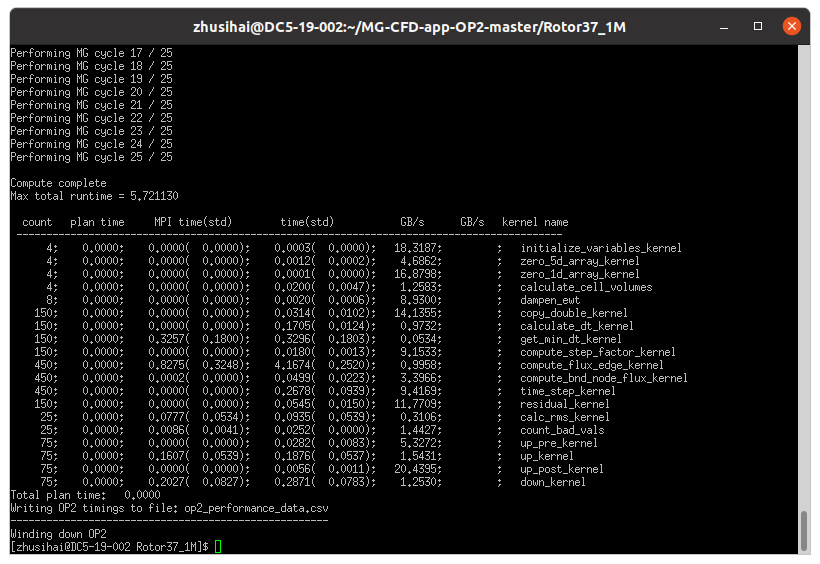

  ----------------------------------------------------------------------------------- ------------------------- ------------------ -------------------------------- --------------------------------------------------------------- --------
                                                                                      OP2-Common-release-2020                                                                                                                       

                                                                                      应用**移植指南**                                                                                                                              

                                                                                      **文档版本**                                 **01**                                                                                           

                                                                                      **发布日期**                                 **2022-07-30**                                                                                   

  {width="8.261111111111111in"                                                                                                                                                 
  height="5.1715277777777775in"}                                                                                                                                                                                                    

                                                                                                                华为技术有限公司                                    {width="1.0298611111111111in"   
                                                                                                                                                                    height="1.0in"}                                                 
  ----------------------------------------------------------------------------------- ------------------------- ------------------ -------------------------------- --------------------------------------------------------------- --------

+-----------------------------------------------------------------------+
| 版权所有 © 华为技术有限公司2022。保留一切权利。                       |
|                                                                       |
| 非经本公司书面许可，任何单位和                                        |
| 个人不得擅自摘抄、复制本文档内容的部分或全部，并不得以任何形式传播。  |
|                                                                       |
| 商标声明                                                              |
|                                                                       |
| {width="0.32083333333333336in" |
| heig                                                                  |
| ht="0.31319444444444444in"}和其他华为商标均为华为技术有限公司的商标。 |
|                                                                       |
| 本文档提及的其他所有商标或注册商标，由各自的所有人拥有。              |
|                                                                       |
| 注意                                                                  |
|                                                                       |
| 您购买的产品、服务或特性等应受华为公司商业合同和条款的约束，本文档    |
| 中描述的全部或部分产品、服务或特性可能不在您的购买或使用范围之内。除  |
| 非合同另有约定，华为公司对本文档内容不做任何明示或默示的声明或保证。  |
|                                                                       |
| 由于产品版本升                                                        |
| 级或其他原因，本文档内容会不定期进行更新。除非另有约定，本文档仅作为  |
| 使用指导，本文档中的所有陈述、信息和建议不构成任何明示或暗示的担保。  |
+=======================================================================+
+-----------------------------------------------------------------------+

  -----------------------------------------------------------------------------
  华为技术有限公司   
  ------------------ ----------------------------------------------------------
  地址：             深圳市龙岗区坂田华为总部办公楼邮编：518129

  网址：             <https://www.huawei.com>

  客户服务邮箱：     <support@huawei.com>

  客户服务电话：     4008302118
  -----------------------------------------------------------------------------

# 目录 {#目录 .Contents}

[目录 [ii](#目录)](#目录)

[1 介绍 [1](#介绍)](#介绍)

[2 环境要求 [2](#环境要求)](#环境要求)

[3 移植规划数据 [4](#移植规划数据)](#移植规划数据)

[4 配置编译环境 [5](#配置编译环境)](#配置编译环境)

[4.1 搭建鲲鹏基座软件环境
[5](#搭建鲲鹏基座软件环境)](#搭建鲲鹏基座软件环境)

[4.2 安装Zlib [6](#安装zlib)](#安装zlib)

[4.3 安装ParMETIS [7](#安装parmetis)](#安装parmetis)

[4.4 安装PT-SCOTCH [8](#安装pt-scotch)](#安装pt-scotch)

[4.5 安装HDF5-1.13.0和Vol-async-1.2
[10](#安装hdf5-1.13.0和vol-async-1.2)](#安装hdf5-1.13.0和vol-async-1.2)

[4.6 安装OP2-Common [12](#安装op2-common)](#安装op2-common)

[5 获取源码 [14](#_Toc120610466)](#_Toc120610466)

[6 编译和安装 [15](#编译和安装)](#编译和安装)

[7 运行和验证 [17](#运行和验证)](#运行和验证)

[8 修订记录 [18](#修订记录)](#修订记录)

# 介绍

OP2库是开发非结构网格计算流体力学（CFD）模型的特定域语言库，支持多种并行模型（OpenMP,
CUDA, MPI, MPI+X,
X代表OpenMP或CUDA等）。使用Python脚本source-to-source转换程序，可方便快捷地将编写好的OP2串行代码，转换为多种不同并行模式的应用程序，便于准确对比和分析不同数值算法和不同并行方式的计算效率，以及测试不同架构硬件平台计算性能。

在公共的OP2-Common库基座上开发CFD应用程序，本项目使用MGCFD-OP2应用，优化CPU与GPU源码，提高在鲲鹏920平台上的计算效率。

关于OP2-Common与MGCFD-OP2的更多信息请访问英国华威大学HPC课题组的官网：https://warwick.ac.uk/fac/sci/dcs/research/systems/hpsc/software/。

语言：C/FORTRAN

一句话描述：开发非结构网格CFD模型的特定域语言库。

开源协议：BSD 3-Clause License

1.  建议的版本

克隆release/2020分支的OP2-Common源码。

克隆master分支的MGCFD-OP2源码，或者v1.0.0-rc1.tar.gz的发布压缩包。

# 环境要求

2.  硬件要求

硬件要求如表2-1所示。

1.  硬件要求

  -----------------------------------------------------------------------
  项目             说明
  ---------------- ------------------------------------------------------
  CPU              Kunpeng 920

  -----------------------------------------------------------------------

3.  软件要求

软件要求如表2-2所示。

{width="0.6958333333333333in"
height="0.2611111111111111in"}

-   不同HPC应用的依赖软件不同，建议按照如下步骤判断其依赖软件：

-   1、查看其上游社区是否提供安装指导文档；

-   2、搜索网络上是否已经有社区提供相关安装文档或博客；

-   3、尝试安装该软件，根据报错情况，决定安装哪些依赖软件；

-   4、咨询华为工程师是否有相关经验。

    1.  软件要求

  ------------------------------------------------------------------------------------------------------------------------
  项目             版本               下载地址
  ---------------- ------------------ ------------------------------------------------------------------------------------
  毕昇编译器       2.1.0              https://www.hikunpeng.com/zh/developer/devkit/compiler/bisheng

  HyperMPI         1.1.1              <https://github.com/kunpengcompute/hmpi/archive/refs/tags/v1.1.1-huawei.tar.gz>

  HUCX             1.1.1              <https://github.com/kunpengcompute/hucx/archive/refs/tags/v1.1.1-huawei.tar.gz>

  XUCG             1.1.1              <https://github.com/kunpengcompute/xucg/archive/ref/tags/v1.1.1-huawei.tar.gz>

  ZLIB             1.2.11             http://www.zlib.net/fossils/zlib-1.2.11.tar.gz

  ParMetis         4.0.3              http://glaros.dtc.umn.edu/gkhome/fetch/sw/parmetis/parmetis-4.0.3.tar.gz

  PT-SCOTCH        6.0.6              https://gitlab.inria.fr/scotch/scotch/-/archive/v6.0.6/scotch-v6.0.6.tar.gz

  HDF5             1.13.0             https://github.com/HDFGroup/hdf5/archive/refs/tags/hdf5-1_13_0.tar.gz

  Vol-async        1.2                https://github.com/hpc-io/vol-async/archive/refs/tags/v1.2.tar.gz

  argobots         1.1                https://github.com/pmodels/argobots/archive/refs/tags/v1.1.tar.gz

  OP2-Common       release/2020分支   git clone -b release/2020 https://github.com/OP-DSL/OP2-Common.git

  MGCFD-OP2        v1.0.0-rc1         https://github.com/warwick-hpsc/MG-CFD-app-OP2/archive/refs/tags/v1.0.0-rc1.tar.gz
  ------------------------------------------------------------------------------------------------------------------------

1.  操作系统要求

操作系统要求如表2-3所示。

1.  操作系统要求

  ------------------------------------------------------------------------------------
  项目         版本              下载地址
  ------------ ----------------- -----------------------------------------------------
  openEuler    openEuler 20.03   https://repo.openeuler.org/openEuler-20.03-LTS-SP3/
               SP3               

  Kernel       4.19.90           https://gitee.com/openeuler/kernel
  ------------------------------------------------------------------------------------

# 移植规划数据

本章节给出OP2-Common和MGCFD-OP2软件在移植过程中涉及到的相关软件安装规划路径的用途及详细说明。

2.  移植规划数据

  --------------------------------------------------------------------------------------------------------------------------------------------------------------------------------------------------------------------------------------------------
  序号   软件安装规划路径         用途                              说明
  ------ ------------------------ --------------------------------- --------------------------------------------------------------------------------------------------------------------------------------------------------------------------------
  1      /usr/local/bisheng       毕昇编译器的安装规划路径。        这里的安装规划路径只是一个举例说明，建议部署在共享路径中。现网需要根据实际情况调整，**后续章节凡是遇到安装路径的命令，都以现网实际规划的安装路径为准进行替换，不再单独说明。**

  2      /usr/local/hmpi          Hyper MPI的安装规划路径。         

  3      /usr/local/zlib          Zlib的安装规划路径。              

  4      /usr/local/PARMETIS      ParMETIS的安装规划路径。          

  5      /usr/local/SCOTCH        PT-SCOTCH的安装规划路径。         

  6      /usr/local/HDF5-1.13.0   HDF5与VOL-Async的安装规划路径。   

  7      /usr/local/OP2           OP2-Common库的安装规划路径。      

  8      /usr/local/MGCFD-OP2     MGCFD-OP2应用的安装规划路径。     
  --------------------------------------------------------------------------------------------------------------------------------------------------------------------------------------------------------------------------------------------------

# 配置编译环境

2.  前提条件

使用SFTP工具将各安装包上传至服务器对应目录下。

3.  配置流程

    1.  配置流程

  ------------------------------------------------------------------------------------------------------------------
  序号   配置项                           说明
  ------ -------------------------------- --------------------------------------------------------------------------
  1      搭建鲲鹏基座软件环境             参考4.1 搭建鲲鹏基座软件环境

  2      安装Zlib                         参考4.2[安装Zlib](#安装zlib)

  3      安装ParMetis                     参考4.3[安装ParMETIS](#安装parmetis)

  4      安装PT-SCOTCH                    参考4.4[安装PT-SCOTCH](#安装pt-scotch)

  5      安装HDF5-1.13.0和Vol-async-1.2   参考4.5[安装HDF5-1.13.0和Vol-async-1.2](#安装hdf5-1.13.0和vol-async-1.2)

  6      安装OP2-Common                   参考4.6[安装OP2-Common](#安装op2-common)
  ------------------------------------------------------------------------------------------------------------------

## 搭建鲲鹏基座软件环境

4.  操作步骤

    （1）直接加载鲲鹏集群登录节点上的基座软件环境：

module use /workspace/public/software/modules

module load compilers/bisheng/2.1.0/bisheng2.1.0

module use /workspace/public/software/modules

module load mpi/hmpi/1.1.1/bisheng2.1.0

module use /workspace/public/software/modules

module load compilers/cuda/11.14.1

（2）如果需要使用具备GPUDirect
RDMA功能的MPI通信库，请参考doc目录下的《鲲鹏基座软件搭建指南.docx》。

## 安装Zlib

5.  操作步骤

    1.  使用PuTTY工具，以root用户登录服务器。

    2.  解压zlib安装包。

**tar -zxf zlib-1.2.11.tar.gz**

注：解压缩时请以实际压缩包名称为准。

3.  进入解压后的目录。

**cd zlib-1.2.11**

4.  进行配置。

**CC=clang ./configure \--prefix=/usr/local/ZLIB**

5.  编译，安装。

**make -j\$(nproc)**

**make install**

6.  配置环境变量。

**cat\>\"/usr/local/ZLIB/zlib_modulefiles\"\<\<EOF**

**#%Module1.0**

**conflict zlib**

**variable modfile \[file normalize \[info script\]\]**

**proc getModulefileDir {} {**

**variable modfile**

**set modfile_path \[file dirname \\\$modfile\]**

**return \\\$modfile_path**

**}**

**set pwd \[getModulefileDir\]**

**set ZLIB \\\$pwd**

**setenv ZLIB \\\$ZLIB**

**prepend-path LD_LIBRARY_PATH \\\$ZLIB/lib**

**EOF**

7.  在当前shell中加载环境变量

    **module use /usr/local/ZLIB/**

    **module load /usr/local/ZLIB/zlib_modulefiles**

8.  若要避免每打开一个shell，导入一次变量。可写入到系统配置文件中。

    **vi /etc/profile**

    新增如下内容：

    **module use /usr/local/ZLIB/**

    **module load /usr/local/ZLIB/zlib_modulefiles**

\-\-\--结束

## 安装ParMETIS

6.  操作步骤

    1.  使用PuTTY工具，以root用户登陆服务器。

    2.  解压ParMETIS安装包。

        **tar -xvf parmetis-4.0.3.tar.gz**

注：解压缩时请以实际压缩包名称为准。

3.  进入解压后的目录。

    **cd parmetis-4.0.3**

4.  修改"metis/include/metis.h"文件。

**sed -i -e \'s/\\#define IDXTYPEWIDTH 32/\\#define IDXTYPEWIDTH 64/g\'
metis/include/metis.h**

5.  进入metis目录，编译安装metis。

    **cd metis**

    **make config shared=1 prefix=/usr/local/PARMETIS/metis**

6.  进入上层目录。

    **cd ..**

7.  修改当前目录下的CMakeLists.txt文件。

    **sed -i -e \'29i add_compile_options(-fPIC)\' CMakeLists.txt**

8.  编译，安装。

    **make config shared=1 prefix=/usr/local/PARMETIS/metis**

    **make install**

9.  配置环境变量。

**cat\>\"/usr/local/PARMETIS/parmetis_modulefiles\"\<\<EOF**

**#%Module1.0**

**conflict parmetis**

**variable modfile \[file normalize \[info script\]\]**

**proc getModulefileDir {} {**

**variable modfile**

**set modfile_path \[file dirname \\\$modfile\]**

**return \\\$modfile_path**

**}**

**set pwd \[getModulefileDir\]**

**set PARMETIS \\\$pwd**

**setenv PARMETIS \\\$PARMETIS**

**prepend-path LD_LIBRARY_PATH \\\$PARMETIS/metis/lib**

**EOF**

10. 在当前shell中加载环境变量。

    **module use /usr/local/PARMETIS/**

    **module load /usr/local/PARMETIS/parmetis_modulefiles**

11. 若要避免每打开一个shell，导入一次变量。可写入到系统配置文件中。

    **vi /etc/profile**

    新增如下内容：

    **module use /usr/local/PARMETIS/**

    **module load /usr/local/PARMETIS/parmetis_modulefiles**

\-\--结束

## 安装PT-SCOTCH

7.  操作步骤

    1.  使用PuTTY工具，以root用户登陆服务器。

    2.  解压SCOTCH安装包。

        **tar -xvf scotch_6.0.6.tar**

注：解压缩时请以实际压缩包名称为准。

3.  进入解压后的源码目录。

**cd scotch_6.0.6/src**

4.  进行编译配置。

**cp Make.inc/Makefile.inc.x86-64_pc_linux2 Makefile.inc**

5.  编辑Makefile.inc。

**删掉第12行的\"-DPTSCOTCH_PTHREAD\"，关闭SCOTCH库的多线程功能。**

6.  编译，安装。

**make libscotch**

**make libptscotch**

**make prefix=/usr/local/scotch-6.0.6 install**

7.  配置环境变量。

**cat\>\"/usr/local/scotch-6.0.6/scotch_modulefiles\"\<\<EOF**

**#%Module1.0**

**conflict scotch**

**variable modfile \[file normalize \[info script\]\]**

**proc getModulefileDir {} {**

**variable modfile**

**set modfile_path \[file dirname \\\$modfile\]**

**return \\\$modfile_path**

**}**

**set pwd \[getModulefileDir\]**

**set SCOTCH \\\$pwd**

**setenv SCOTCH \\\$SCOTCH**

**prepend-path LD_LIBRARY_PATH \\\$SCOTCH/lib**

**prepend-path INCLUDE \\\$SCOTCH/include**

**EOF**

8.  在当前shell中加载环境变量。

    **module use /usr/local/scotch-6.0.6**

    **module load /usr/local/scotch-6.0.6/scotch_modulefiles**

9.  若要避免每打开一个shell，导入一次变量。可写入到系统配置文件中。

    **vi /etc/profile**

    新增如下内容：

    **module use /usr/local/scotch-6.0.6**

    **module load /usr/local/scotch-6.0.6/scotch_modulefiles**

\-\--结束

## 安装HDF5-1.13.0和Vol-async-1.2

8.  介绍

HDF-1.13.x是最新版本的HDF5库，用于HPC环境下的数据I/O，其中引入了Virtual
Object Layer
(VOL)的概念，VOL是HDF5库中的抽象层，可使用多种方法访问符合HDF5的数据模型的数据和对象。VOL截取所有的HDF5
API调用，修改磁盘上的数据，提交这些API调用给一个插件"对象驱动器"。磁盘上的数据格式可以与HDF5格式不同。

Vol-async是在VOL基础上开发的可实现异步数据I/O的HDF5插件，方便应用程序的高速数据I/O。Vol-async需要用到一个多线程管理框架Argobots，Argobots是一个轻量级的运行时系统，管理线程切换、整合计算与数据移动，实现大规模并发，直接利用最底层的硬件和操作系统的结构，广泛应用于工业和学术界。

9.  操作步骤

    1.  使用PuTTY工具，以root用户登录服务器。

    2.  解压HDF5安装包。

**tar -xvf hdf5-1.13.0.tar.gz**

3.  解压Vol-async安装包。

**tar -xvf v1.2.tar.gz**

4.  解压argobots安装包。

**tar -xvf v1.1.tar.gz**

5.  设置源码路径的临时环境变量。

**export H5_DIR=\$PWD/hdf5-hdf5-1_13_0**

**export VOL_DIR=\$PWD/vol-async**

**export ARBT_DIR=\$PWD/vol-async/argobots**

6.  编译安装HDF5-1.13.0

**cd \$H5_DIR**

**./autogen.sh**

**CC=\`which mpicc\`**

**CXX=\`which mpicxx\`**

**./configure \--prefix=/usr/local/hdf5-1.13.0/install
\--with-zlib=/usr/local/ZLIB \--enable-shared \--enable-static
\--enable-parallel \--enable-threadsafe \--enable-unsupported
\--enable-file-locking=no**

**make -j\$(nproc) && make install**

7.  编译安装argobots

**cd \$ARBT_DIR**

**./autogen.sh**

**./configure \--prefix=/usr/local/argobots-1.1/install**

**make -j\$(nproc) && make install**

8.  编译安装Vol-async

**cd \$VOL_DIR/src**

**cp Makefile.summit Makefile**

**编辑Makefile:**

（1）设置好\$H5_DIR and \$ABT_DIR

（2）CFLAGS一行增加-DENABLE_WRITE_MEMCPY=1，可实施双缓冲功能。

**make -j\$(nproc)**

9.  测试HDF-Async程序

**export
LD_LIBRARY_PATH=\$VOL_DIR/src:\$H5_DIR/install/lib:\$ARBT_DIR/install/lib:\$LD_LIBRARY_PATH**

**export HDF5_PLUGIN_PATH=\"\$VOL_DIR/src\"**

**export HDF5_VOL_CONNECTOR=\"async under_vol=0;under_info={}\"**

注：使用Ubuntu OS，需要预加载一些so库文件

**export LD_PRELOAD=\$H5_DIR/install/lib/libhdf5.so**

**export LD_PRELOAD=\$H5_DIR/install/lib/libhdf5_hl.so**

**export LD_PRELOAD=\$ARBT_DIR/install/lib/libabt.so**

10. 测试Vol-async的功能。

**cd \$VOL_DIR/test**

**cp Makefile.summit Makefile**

**编辑Makefile，设置好\$H5_DIR and \$ABT_DIR**

**make**

11. 配置环境变量。

**cat\>\"/usr/local/HDF5/hdf5_modulefiles\"\<\<EOF**

**#%Module1.0**

**conflict hdf5**

**variable modfile \[file normalize \[info script\]\]**

**proc getModulefileDir {} {**

**variable modfile**

**set modfile_path \[file dirname \\\$modfile\]**

**return \\\$modfile_path**

**}**

**set pwd \[getModulefileDir\]**

**set HDF5 \\\$pwd**

**setenv HDF5 \\\$HDF5**

**prepend-path LD_LIBRARY_PATH \\\$HDF5/lib**

**EOF**

12. 在当前shell中加载环境变量。

    **module use /usr/local/HDF5/**

    **module load /usr/local/HDF5/hdf5_modulefiles**

13. 若要避免每打开一个shell，导入一次变量。可写入到系统配置文件中。

    **vi /etc/profile**

    新增如下内容：

    **module use /usr/local/HDF5/**

    **module load /usr/local/HDF5/hdf5_modulefiles**

\-\-\--结束

## 安装OP2-Common

10. 操作步骤

    1.  使用PuTTY工具，以root用户登录服务器。

    2.  下载OP2-Common的源码。

**cd /usr/local/**

**git clone -b release/2020 <https://github.com/OP-DSL/OP2-Common.git>**

**cd OP2-Common**

3.  设置编译OP2库需要的临时变量。

**export CUDA_INSTALL_PATH=/usr/local/cuda-11.4**

**export MPI_INSTALL_PATH=/usr/local/hmpi-1.1.1/ompi**

**export PTSCOTCH_INSTALL_PATH=/usr/local/scotch-6.0.6**

**export PARMETIS_INSTALL_PATH=/usr/local/parmetis-4.0.3/metis**

**export HDF5_INSTALL_PATH=/usr/local/hdf5-1.13.0**

**export OP2_COMPILER=\'clang\'**

**export LD_LIBRARY_PATH=\$CUDA_INSTALL_PATH/lib64:\$LD_LIBRARY_PATH**

**export
LD_LIBRARY_PATH=\$PARMETIS_INSTALL_PATH/lib:\$PTSCOTCH_INSTALL_PATH/lib:\$LD_LIBRARY_PATH**

**export LD_LIBRARY_PATH=\$HDF5_INSTALL_PATH/lib:\$LD_LIBRARY_PATH**

4.  设置安装OP2库的路径和GPU架构。

**export OP2_INSTALL_PATH=/usr/local/OP2-Common**

**export NV_ARCH=\'Ampere\'**

**make -j\$(nproc)**

5.  生成的OP2的各种并行模型的静态链接库文件在/lib目录，即：

**/usr/local/OP2-Common/lib**

# 获取源码

11. 操作步骤

    1.  下载MG-CFD-app-OP2源码包。

        下载地址：<https://github.com/warwick-hpsc/MG-CFD-app-OP2/archive/refs/tags/v1.0.0-rc1.tar.gz>

        或者克隆主分支源码：

        git clone https://github.com/warwick-hpsc/MG-CFD-app-OP2.git

\-\-\--结束

# 编译和安装

12. 操作步骤

    1.  使用PuTTY工具，以root用户登录服务器。

    2.  进入源码目录。

        **cd /usr/local/MG-CFD-app-OP2**

    3.  编译，安装。

一次性编译所有可执行程序，执行：**make all**

或者，编译不同并行方式的应用程序，分别执行：

**make seq**

**make openmp**

**make mpi**

**make mpi_openmp**

**make mpi_vec**

**make cuda**

**make mpi_cuda**

4.  配置环境变量。

    **cat\>\"/usr/local/mgcfd-op2/mgcfd-op2_modulefiles\"\<\<EOF**

**#%Module1.0**

**conflict mgcfd**

**variable modfile \[file normalize \[info script\]\]**

**proc getModulefileDir {} {**

**variable modfile**

**set modfile_path \[file dirname \\\$modfile\]**

**return \\\$modfile_path**

**}**

**set pwd \[getModulefileDir\]**

**set MGCFD \\\$pwd**

**setenv MGCFD \\\$MGCFD**

**prepend-path LD_LIBRARY_PATH \\\$MGCFD/lib**

**prepend-path INCLUDE \\\$MGCFD/include**

**prepend-path PATH \\\$MGCFD/bin**

**EOF**

5.  在当前shell中加载环境变量。

    **module use /usr/local/mgcfd-op2**

    **module load /usr/local/mgcfd-op2/mgcfd-op2_modulefiles**

6.  若要避免每打开一个shell，导入一次变量。可写入到系统配置文件中。

    **vi /etc/profile**

    新增如下内容：

    **module use /usr/local/mgcfd-op2**

    **module load /usr/local/mgcfd-op2/mgcfd-op2_modulefiles**

\-\-\--结束

# 运行和验证

13. 操作步骤

    1.  使用PuTTY工具，以root用户登录服务器。

    2.  在当前shell中加载环境变量。

        **module use /usr/local/mgcfd-op2**

        **module load /usr/local/mgcfd-op2/mgcfd-op2_modulefiles**

    3.  执行不同并行模式的可执行程序。

例如运行：**mpirun -np 4 ../bin/mgcfd_mpi -i inputs.dat -g 25**

具体运行参数，运行并参考**../bin/mgcfd_seq \--help**

运行成功后将显示下图：

{width="3.4395603674540682in"
height="2.5329669728783903in"}

\-\-\--结束

# 修订记录

  -----------------------------------------------------------------------
  发布日期     修订记录
  ------------ ----------------------------------------------------------
  2022-07-30   第一次正式发布。

  -----------------------------------------------------------------------
