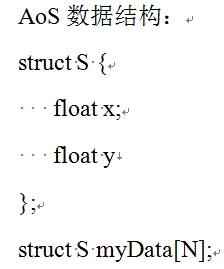
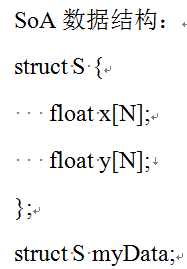
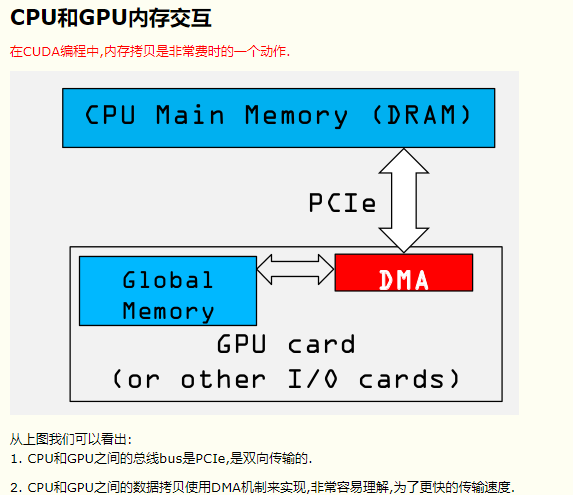
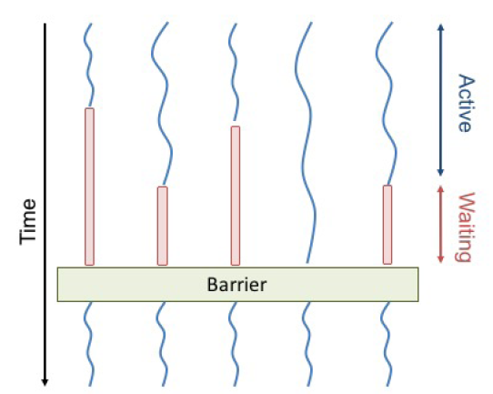
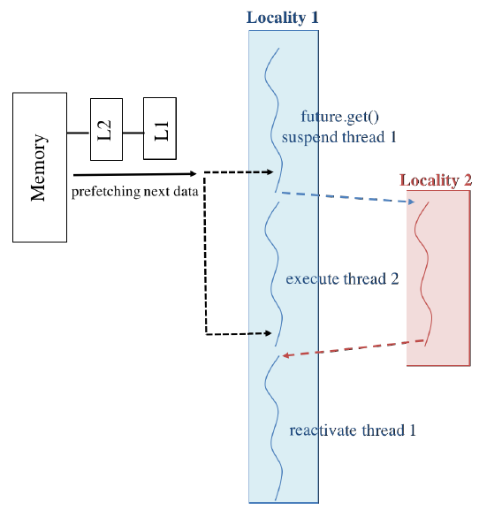

# OP2库的原理

# 目录

1 特定域语言OP2库的架构介绍

1.1整体并行化架构

1.2创建并行计算

1.3创建虚拟区列表

1.4进程边界虚拟数据交换

1.5部分虚拟数据交换

1.6全局操作

1.7获取数据

1.8性能评估

1.9空间释放

1.10特定域语言库的相关研究

2非结构网格区域分解的优化算法

2.1非结构网格区域分解算法

2.2非结构网格重编码

3 异构并行计算后端的优化
[15](#异构并行计算后端的优化)](#异构并行计算后端的优化)

3.1数据AoS和SoA存储方式

3.2避免数据竞争条件

3.3共享内存优化

3.4增大数据的重复利用

3.5 CUDA核函数的关键字优化

3.6多GPU设备间通信的GPUDirect RDMA技术

4多线程异步并行优化

5异步数据I/O优化

## 引言

OP2库是一个已经持续发展了近20年的针对非结构网格计算流体力学开发的特定域语言（Domain-Specific
Language, DSL）库，采用C++语言编程，内部代码针对不同的后端并行库已开展了深入的优化。本项目实施的GPU+CPU异构并行优化，是在已有的优化方案的基础上进行的。因此，本优化方案设计整体上如图1所示，主要使用毕昇编译器编译代码时开展静态优化，以及修改OP2库的代码，引入运行时系统做动态优化。主要优化方案设计包括：

（1）OP2库已有的优化方案，如非阻塞MPI操作数组重叠计算与通信、数组数据布局方式的AoS和SoA的自动转换、线程着色避免竞争条件优化、荷载均衡的非结构网格区域分解算法以及网格重编码增加数据局部性等。

（2）多GPU设备间的GPUDirect技术，实现设备直连，提高数据传输速率（针对GPU异构集群并行的优化）。

（3）针对鲲鹏920处理器的多核架构，引入异步并行HPX库，避免多线程并行时的全局栅障等待开销，实现异步并行优化（单计算CPU节点）。

（4）引入HDF5的异步I/O存储技术，重叠计算与I/O数据传输，缓解HPC场景下的大数据存储瓶颈（针对CPU代码的优化）。

图1 OP2库的整体工作流程图及后端并行库

## 1特定域语言OP2库的架构介绍

特定域语言是针对某一具体应用领域的方法，其应用范围往往限定在一个较为狭窄的领域或算法模式。牺牲其普适性，解决计算流体力学（CFD）开发中的性能、可移植性与实用性三者平衡的挑战性问题。OP2库就是一个针对非结构网格模式开发CFD应用程序的特定域语言库。

### 1.1整体并行化架构 {#整体并行化架构 .标题3}

OP2库实施2级并行：顶层为分布式内存集群，使用MPI通信，在计算节点间做网格分区，构建用于通信的输入和输出虚拟区的数组，采用"归属者计算模式"避免间接访问数据循环引起的数据冲突；第2层并行采用单节点的多核CPU（OpenMP）和GPU异构（CUDA）实现。

OP2库是针对非结构网格数据结构的特定域语言库，针对间接循环的CPU与GPU并行优化是一大特色。单元的循环计算，如果计算是在单元上执行，就是直接数据访问，如果是通过映射关系访问数据（如数据变量存储于节点或边上），就是间接数据访问。如果循环计算都在单元核函数上执行，那么各循环就可以并行执行；如果核心函数间接访问数据，那么可能由多个from-set循环更新计算相同的to-set单元，这种间接访问在基于有限单元或有限体积法的非结构网格应用程序中是很常见的，例如：使用跨单元的界面处的通量更新单元处的状态变量（如有限体积法中），或者质量系数矩阵的整合（如有限单元法中）。间接方式的循环计算很难并行化，因为很难通过编译时的信息来确定单元循环涉及到的数据竞争，数据竞争是由通用的网格结构和特殊的映射关系表决定的，这是在运行时读入到内存中的。

OP2库存在一些限制包括：第一，仅能使用单层的映射关系。这意味着每块数据要么是在数据集循环内直接访问的，要么是至多1层间接式的数据访问。但是该限制不排除使用嵌套间接访问的应用，因为可以创建1个映射关系表，表中的数组标记可以通过多个映射关系来访问。第二，在机器精度内，对数据集的操作结果与处理数据集单元的顺序是独立的。该限制可以挖掘并行化的最大可能性，因为算法的精度与执行的顺序是独立的。最后，仅考虑固定数目的连接或参数个数，诸如从边到节点的映射（2维空间自由度），不同于节点-节点之间的连接（总是变化的）。大部分的FEM和FVM算法的模型构建都是使用固定数目连接关系的映射（静态网格）。

### 1.2创建并行计算

分布式内存并行计算的设计起点是：OP2库如何定义读入的非结构网格模型的数据集、映射和数据集上的数值？目前有2种方法实现这种输入和输出：

（1）允许开发者控制文件的输入输入，对OP2
API做扩展，使其可以定义分布于MPI进程上的op_sets, op_dats, op_maps。

（2）提供基于HDF5的并行化输入输出，OP2应用程序用来从一个特定格式的文件读入数据集、数据集上的数值和映射。

开发者可选择使用基于关键词的层次存储的输入输出HDF5格式，也可使用自己需要的数据存储格式。第一种情况，假设使用用户自己的数据I/O方式加载数据和映射关系，并可以加载跨MPI分布式计算节点的数据集上的数值和映射关系。一个MPI进程的数据集单元数（或数据集上的数值个数）以及映射关系表的大小由应用程序开发者决定。OP2库假设一个MPI进程只有一个分区。例如：假设启动P个进程，节点数g_nnodes，边数g_nedges，开发者决定将节点和边分配到各进程。因此，每个进程有g_nnodes/P个节点和g_nedges/P条边。类似地，边到节点的映射关系表也要分配，诸如进程0提供第一个g_nedges/P入口地址，进程1提供第2个g_nedges/P入口地址，等等。当分配映射关系表入口地址时，假设拥有相同数据集单元X的MPI进程也拥有来自X的映射关系表入口地址（属于所有的映射关系表）。该方法有效地连续块状分区数据集上的数据和映射关系，但并行计算中并未使用该种分区。OP2库还要重新分区数据集上的数据和相关的映射关系表，将所有数据集上的数据和映射关系迁移到正确的MPI进程上，根据需要重新编码映射关系列表。

加载数据和映射关系表完成后，各进程将激活OP2库的set,
map和data声明。这扩展了当前的API功能：

-   op_decl_set: size是数据集上的单元数，由该MPI进程提供；

-   op_decl_map:
    > imap提供映射关系表的部分，对应于来源数据集(from-set)的共享部分；

-   op_decl_dat: dat提供数据值，对应于数据集(set)的共享部分。

实施上述操作的例子是Airfoil程序(airfoil_plain)，实现了数据集上的数据和映射关系表的初始分配。MPI进程0串行地读入数据集上的数据、映射关系表以及读取网格文件到主机内存，然后分配分区数据和映射关系（使用MPI_Scatter操作）到其他子进程。

第二种情况（HDF5-I/O），OP2定义一个HDF5文件格式，使用这个格式开发者创建一个文件，包含OP2应用程序使用的数据集和映射关系。OP2
API支持从一个HDF5文件读入数据和映射关系：

-   op_decl_set_hdf5:
    > 与op_decl_dat相似，但size由file代替，使用关键词name定义读入size大小的HDF5文件；

-   op_decl_map_hdf5:
    > 与op_decl_set相似，但imap由file代替，使用关键词name定义读入映射关系表文件；

-   op_decl_dat_hdf5:
    > 与op_decl_dat相似，但dat由file代替，使用关键词name读入数据。

（1）如果用户负责分配数据数组的内存空间，传递给op_decl_map和op_decl_dat，MPI后端将内部复制这些数据，因为创建halo数组需要重新分配内存空间。最后，用户还要释放应用程序层的已分配内存空间，OP2调用op_exit()释放内部复制数据的内存空间。（2）但是，如果使用OP2的HDF5文件输入输出功能，OP2将在程序结束时负责清理数据数组空间。

### 1.3创建虚拟区列表

图2所示的网格由16个节点和9个单元组成，分为到2个MPI进程（rank X和rank
Y），假设仅有单元到节点的映射关系。进程X拥有节点0, 1, 2, 3, 4, 5, 6,
7，以及单元0, 1, 2, 4, 5；进程Y拥有节点8, 9, 10, 11, 12, 13,
14以及单元3, 6, 7, 8。对单元做循环计算需要从进程X输入节点8, 9, 10,
11上的数据到进程Y。另一边，......对于上述方案，各MPI进程需要为各数据集构建一些列单元，需要从其他"相邻"MPI进行输入和输出这些单元。在OP2应用中，网格分区后立即调用op_halo_create()创建这些halos，下面介绍这个子程序的设计和实施以及使用的数据结构。

图2 非结构网格的单元和节点示意图

为确定一个数据集中哪个单元要从其他的MPI进程输入或输出（通过MPI
Send/Receive通信计算），需要做如下分类：

-   核心(core):
    > 如果通过来自该数据集单元的映射关系表访问的所有单元也是该MPI进程上的核心单元数据集，即认为某数据集的一个单元是它位于的MPI进程的核心单元。例如：网格中的节点和单元（带有从单元到节点的映射关系），如果被该单元访问的所有节点也是该MPI进程的核心，那么该MPI进程中的一个单元是核心单元。

-   输出执行halo (eeh)

-   输入执行halo(ieh)

-   输入非执行halo(inh)

-   输出非执行halo(enh)

上述分类可以清楚地确定一个数据集中的哪些单元可以不通过MPI通信来计算，可实施MPI非阻塞通信条件下重叠计算与通信。如图1的网格，其输入输出单元可分为如表1中的类别。

表1 Import/Export列表

子程序op_halo_create()（定义在op_mpi_core.c）寻遍所有的映射关系列表，创建包含属于上述分类中某一类的数据集单元的标记的列表。一个op_set的输出和输入列表的结构如图3（代码见op_mpi_core.h和op_mpi_core.c）。

图3 halo_list_core结构体代码片段

上述的4个数组使用set-\>index来标记，大小为OP_set_index。在op_halo_create()中创建的输入和输出列表以下步骤实现，每个MPI进程调用：

1、为执行数据集单元创建输出列表：

2、为执行数据集单元和相关映射关系表入口地址创建输入列表：

3、使用输入/输出列表交换映射关系列表：

4、为非执行数据集单元创建输入列表：

5、创建非执行数据集输出列表：

6、使用输入和输出数据集列表交换定义于执行数据集单元上的数据：

7、使用输入和输出数据集列表交换定义于非执行数据集单元上的数据：

8、重编码映射关系表：

9、创建MPI发送数据缓冲区：

10、分离核心单元：

11、保存原始的数据集单元的标记：

12、清理内存空间和粗略估计极端情况的虚拟区大小。

图4显示了在创建虚拟区(halo)后要组织的一个数据集中的单元顺序。

{width="5.564540682414698in"
height="1.2779363517060367in"}

图4 创建halo后一个op_set中的单元顺序

### 1.4进程边界虚拟数据交换

MPI执行的OP2应用程序调用op_par_loop将在每个MPI进程上对数据集的局部单元执行循环计算。另外，如果是间接循环计算，计算也应该对*ieh*操作。根据循环类型（直接或间接）及各op_arg的访问类型，在对不是core以及不在ieh内的单元实施计算前应做虚拟区交换。执行循环计算后，根据访问和op_arg的参数类型，halo必须标记为"dirty"，在下一循环步才能确定更新计算指定的虚拟区（定义在op_mpi_core.c和op_mpi_rt_support.c）。目前OP2利用op_dat结构体中的一个单独的field包含该信息。op_dat-\>dirtybit设置为1来指示op_dat的halo已经被修改了。控制循环计算的规则如下：

1、如果op_par_loop由至少一个op_arg组成，并被间接访问，那么整个循环都认为是间接循环；否则，为直接循环；

2、直接循环仅做局部数据集大小的循环，使用局部数据，不需要做虚拟区交换；

3、间接循环按照图5中的规则确定需要交换的虚拟区域；

4、循环计算完成后，为每个op_arg.dat设置dirty_bit，op_arg.access等于OP_INC,
OP_WRITE或OP_RW。

图5 确定交换虚拟区域的代码片段示意

调用op_exchange_halo(op_arg
\*arg)触发虚拟区交换，定义于op_mpi_rt_support.c。在调用中，上述条件确定要检查的虚拟区交换，如果满足条件，包装相关的halo数据为预定义的发送缓冲数据，调用MPI的非阻塞才做(MPI_Isend和MPI_Irecev)，然后返回1，表明一次非阻塞通信正在进行。一个MPI进程的*eeh*和*enh*提供需要输出和输入的单元标记。使用这些列表，一个MPI进程将包装进入发送缓冲区的数据。然后使用MPI_Isend操作发送数据。图6的代码显示了发送*eeh*的示例。

图6 MPI发送虚拟区交换数据的代码片段

MPI_Irecev操作之后，立即执行MPI_Isend操作，见图7，使用*ieh*和*inh*列表，来设置非阻塞通信，直接拷贝发来的数据进行相关的op_dat。

图7 MPI接收虚拟区数据的代码片段

需要依次执行调用op_wait_all(op_arg_arg)完成MPI通信。op_par_loop是结构化的，因此在循环开始时完成调用所有的op_exchange_halo()程序，接着计算数据集的核心单元，然后调用op_wait_all()。这就允许在通信过程中最大化重叠计算与通信，因为没有核心单元会访问任何虚拟区数据。完成op_wait_all()的调用后，再计算剩余的数据集单元。

上述实施步骤可参考op_seq.h。

### 1.5部分虚拟数据交换

某op_set的虚拟边界数据交换将引起该数据集的所有虚拟单元进行交换。原因是OP2基于输入和输出到该数据集的所有映射关系表，为一个op_set创建了虚拟区。因此，当一个并行化的循环计算对某一边界数据集执行时，而该数据集与区域内部数据自的连接关系数组元素稀疏，则要交换所有的内部数据集的虚拟区数据。在一些三维的应用程序中，边界数据集连接到内部数据集的关系表非常稀疏，部分地执行虚拟区交换将有助于提高计算效率。使用部分虚拟区交换时，仅需要隐藏信息交换延迟，而不是实际转移所有虚拟区数据的时间加延迟。

为此OP2基于确定数据集之间连接关系的映射关系表，实施了部分虚拟区交换机制，仅需要交换部分与该映射关系有关的虚拟单元。使用与之前相同的虚拟区结构体，但现在在op_halo_permap_create()中创建了一个部分虚拟映射表。如果访问相邻进程的分区虚拟边界的单元的全局映射关系列表入口总数，少于需要交换的虚拟数据集大小的30%，就交换创建的虚拟映射列表。

例如，假设一个映射关系是由边界上的边映射内部节点，以及存在一个内部边映射到内部节点的映射关系。在间接访问内部节点的边循环内，如果与由边界的边映射到节点（bedges_to_nodes）的虚拟单元数，少于与bedges_to_nodes和edges_to_nodes（内部边映射到节点）都相关的虚拟单元数的30%，那么使用bedges_to_nodes的虚拟映射表执行部分虚拟数据交换。

### 1.6全局操作

如果op_arg的类型是OP_ARG_GBL，需要为该参数实施全局操作。实施操作为OP_INC
(全局规约),
OP_MAX(全局最大)及OP_MIX(全局最小)中的一个。对于OP_ARG_GBL类型的op_arg，由于执行*ieh*的贡献不能包括在内。因此，参考地址传递空值时，用OP_ARG_GBL类型代替任意的op_org。在各MPI进程执行单元循环计算后，需要对所有MPI进程执行全局操作，该步通过调用op_mpi_reduce()执行。该子程序检查交换数据的类型以及实施操作的类型，调用相关操作和数据类型的MPI_Allreduce命令。

### 1.7获取数据

OP2程序在MPI进程上执行op_fetch_data()操作以单元顺序传递op_dat的数据数组的当前值到OP2.
需要注意的是：用户层的数据数组是内部op_dat的当前状态的拷贝值。该实施步首先复制一份需要的op_dat中的当前数据值，然后根据原始的定义这些数据的数据集单元的全局标记号重新排序。由op_fetch_data_hdf5
(op_dat dat, T\* data, int low, int high)和op_fetch_data_hdf5_file
(op_dat dat, char const \*file_name)执行相似的操作。

相反地，op_put_data()子程序也可以随后执行（如果需要的话），因此程序在用户层可以修改op_dat的内部值。该种情况时，用户提交数据值代替内部op_dat的数据值。有效实施该操作需要将原始的数据集单元标号转换为当前数据集单元编号。

### 1.8性能评估

为评估代码的执行时间，实施了2个计时程序。首先，op_timers_core()（在op_lib_core.c中）测量单个MPI进程的执行时间，而op_timers()（在op_mpi_decl.c中）有一个内在的MPI_Barrier()，因此可以测量多个MPI进程的总体执行时间。op_par_loop()的执行时间被累加和测量。由于创建halo和分区的设置耗时也要被测量，所以进程中的最大值被打印并在主进程中标准输出。

另外，也要收集执行MPI通信量的信息。对于每个op_par_loop(),
创建一个结构体，包含：（1）循环计算的累计耗时；（2）调用op_par_loop()的次数；（3）循环期间需要执行虚拟区交换的op_dat的标记；（4）每个op_dat实施的虚拟区交换的总次数；（5）每个op_dat输出的总字节数。

目前，仅能根据命名识别一个循环。因此，使用一个哈希函数计算对应每个循环的op_mpi_kernel结构体的入口标记，如图8，然后将其存于一个哈希列表中。

对于每个op_arg，在每次调用一个op_par_loop()期间时都要执行一次虚拟区交换，op_arg需要调用op_mpi_perf_comm()（在op_mpi_core.c中）来监测虚拟区交换的耗时。因为该操作会降低计算效率，在编译OP2时允许使用预处理开关-DCOMM_PERF来启用MPI通信监测功能。

图8 收集MPI计算效率评估信息的结构体

### 1.9空间释放

OP2应用程序的最后调用op_exit()释放虚拟列表空间、MPI发送缓冲区和效率评估的列表空间。OP2内部的所有数据（dat）和映射列表（map）空间都释放。

### 1.10特定域语言库的相关研究

OP2的特点是：将非结构网格应用程序，在不改动程度代码的情况下移植到多种后端计算硬件平台，特别是近年出现的多核和众核处理器。OP2可视为一种"访问-执行描述器"编程模型，将计算核心和并行循环计算2个部分分离。解耦的访问-执行的声明方式为应用于多种硬件架构的高性能计算测试提供了机会。基于特定域语言的PDE求解库，近年大量开展研究，主要是针对网格计算模型移植开发的程序库。天气预报领域的DSL库如STELLA和PSyclone，STELLA是模板计算的C++模板库，用于COSMO动力核心，支持CPU和GPU的结构网格计算。PSyclone是UK
MetOffice的统一天气预报模型的自动代码生成程序，仅支持OpenACC的GPU异构并行。还有CLAW-DSL，用于ICON模型，着眼于Fortran应用程序。这些DSL库都紧密联系于较大的软件工程（天气预报），受到大力度资金支持。同时，是否还有其他应用程序使用这些DSL库尚不清楚。

还有一些特殊类型的DSL着眼于求解PDE，基于符号描述求解问题，自动或半自动离散并求解问题。大部分DSL库着眼于具体的PDE和离散方法，提供优异的实用性应用（假设待求解的问题与库的重点符合）。而且这些库通常嵌入在Python语言中，使用符号操作工具，但在HPC领域很少使用，因为解释型Python语言的低性能，最终这些库生成底层的C/C++/Fortran代码实现高性能。此类库中有名的如FEniCS库，目标是有限单元法，但仅支持CPUs的MPI集群并行。FEniCS项目定义统一框架语言（UFL）用于定义有限元算法，尽管可以很容易地建立有限元算法的抽象声明，但缺乏灵活性。Firedrake也是类似的库，也仅支持CPU，使用pyOP2库并行化和执行生成代码。ExaStencils项目使用4层抽象，创建能运行在CPU和GPU（试验中）上的代码，着眼于结构网格和多重网格。DUNE/PDElab是另一个高级库，允许描述PDE和使用多种方法离散，支持结构网格和非结构网格。内嵌在C++框架，目前版本仅支持MPI并行，但支持GPU的研究在进行中。其他的基于网格求解PDE的DSL库还有OpenSBLI,
Devito等，均类似。总结一下，DSL最常见的挑战是：

（1）由于用户代码与执行在硬件上的代码之间的软件层的隐藏，使得调试很困难；

（2）扩展性：算法实施与DSL定义的抽象方法无关；

（3）通常难以修改已自动生成的高层级结构。

## 2非结构网格区域分解的优化算法

### 2.1荷载均衡的区域分解算法 {#荷载均衡的区域分解算法 .标题3}

OP2应用程序对非结构网格进行分区，使虚拟数据最小并降低开发者的介入。一执行OP2声明函数，就从应用程序激活op_partition()，使用合适的形式参数，可以对数据集和映射关系分区并迁移数据到新的MPI进程中。有很多种网格分区程序可完成此任务。根据分布式存储并行实施的需要可选择以下4种网格分区方式：

-   ParMetis的geom图形分区

-   ParMetis的*k*-way图形分区

-   PT-Scotch的*k*-way图形分区

-   从HDF5文件读取的用户定义的分区

OP2也提供了一些支持函数和数据迁移子程序方便实现上述目的。OP2在调用所有的op_decl\_\*后立即分区网格。为此，OP2假设在输入数据时已经完成了并行分布的数据自和映射关系表，输入方式可以是用户自定义的IO或使用HDF5格式的并行化IO。在应用程序中，数据集和映射是以块分区形式分布的。数据集的分区是调用以下封装函数实现的（定义于op_mpi_part_core.c）：

-   op_partition_geom()

-   op_partition_kway()

-   op_partition_ptscotch()

需要用封装函数组织数据或网格单元为ParMetis或PT-Scotch分区程序可识别的格式。在应用程序中，节点的*xy*坐标由***p_x***提供。利用op_partition()分区*p_x*。这可以通过调用封装函数op_partition_geom()使用ParMetis的几何分区算法。调用完op_partition_geom()后，在每个MPI进程上，ParMetis返回一个数组，给出每个数据集单元的新的MPI进程（本例中是每个节点）。应用程序此时认为节点为分区的主数据集。现在主数据集和可获取的映射关系表允许分区其他的次数据集。这些次生数据集将继承主数据集的分区。由封装函数调用partition_all()完成次生数据集的分区。次生数据集的逻辑继承主数据集的分区计算如下。首先，计算使用各映射表对一些次生数据集分区相关的计算成本，次生数据集分区使用从主数据集开始的分区数据集。对一个数据集进行分区时，使用来自分区数据集的映射时的分区成本要超过使用一个方向分区数据集的映射的分区成本要高。使用被认为分区成本最小的映射来对每个次生数据集进行分区。程序分配一些整数型数值标记计算成本。

如果有一个单元到节点的映射以及主数据集为使用该映射的节点（分区后），那么就可以确定各单元的位置（地址）。因此，如果大部分由一个单元指向的节点位于X分区（MPI进程X），那么该单元最好是置于分区X上（如果尚未位于进程X）。当进行节点分区时也是基于相似原理（如果主数据集为单元），此时，创建一个临时的相反映射关系表（如节点向单元的映射）来确定要分区的节点。所有的数据集单元已分配给一个分区后，调用migrate_all()，迁移数据和到新MPI进程的映射关系，将在新的MPI进程上排序单元。最终，renumber_maps()将使用新的标记重编码映射关系表的入口地址。

在OP2应用程序的最后，用于分区的数据结构体作为内存空间被部分释放。为了调试，还实施了一个封装函数：op_partition_random()，对一特定数据集做随机分区。目前调用op_partition()实现分区和halo创建，要使用合适的形式参数---选择特定的分区程序库和op_set,
op_map,
op_dat。仅当使用分布式内存并行后端执行并行分区。否则，提交dummy子程序(无效操作)来替代实际的分区程序调用。

### 2.2非结构网格重编码

OP2可以实施非结构网格单元编号和序号的优化。执行数据集和受间接访问的数据的重编码对计算效率的影响很大：通过确保被单元访问的数据的连续性足够靠近能改善高速缓存的局部性，因此可重复使用数据和高速缓存。OP2实施重编码的子程序，基于SCOTCH库中的Gibbs-Poole-Stockmeyer
(GPS)算法转换输入的网格数据。重编码算法在/op2/c/src/externlib/op_renumber.cpp中实施。

但是，目前的重编码只能在单个计算节点上实施（没有MPI支持），以HDF5格式文件读入一个没有优化的网格数据，然后利用上述方法实现重编码，重编码网格，优化网格的编号，然后将重编码的网格再输出到一个新的HDF5文件，这个新的HDF5文件可以被单计算节点和分布式存储的应用程序来使用。

## 3异构并行计算后端的优化

### 3.1数组的AoS和SoA存储布局

AoS方式仍然是CPU上的常见存储方式，因为CPU有很大的高速缓存容量。SoA方式在GPU上执行效率高，CPU上有更好的矢量化。数组的AoS与SoA存储布局方式如下所示：

采用AoS组织数据会使数据交错存储，进而导致无法实现整合内存。上例中，只使用变量*x*的操作（S-\>*x*），将导致50%的带宽下降和50%的L2缓存浪费。使用SoA组织数据时，即使使用结构体中的单个元素也能够完全利用内存带宽。SoA不会造成数据交错，可实现整合内存，从而达到较高的全局内存性能。使用SoA数据结构可获得5倍的性能加速。涉及到间接数据访问时，选择合适的数组存储方式很重要。例如，一个数据集单元，诸如一个单元或一条边存储有多个数据变量。如果每个单元有4个数值，那么每个单元就应连续存储4个部分---这样的布局称之为AoS(Array-of-Structs)方式；或者所有第1个变量部分连续存储，然后是第2个部分，依次进行存储，这样的布局称之为SoA(Struct-of-Array)方式，见图9。AoS方式将4个部分视为连续整体，将数据存储其间；而SoA方式将每个变量部分视为一个单独的数组。

图9 AoS和SoA数据存储布局

### 3.2避免数据竞争条件 {#避免数据竞争条件 .标题3}

非结构网格模型常用于模拟体内血液流动、飞行器周围流动、海洋洋流或海啸模拟等领域。与结构网格相比，非结构网格模型需要使用显式的连接关系信息来表征单元、节点或边之间的拓扑关系，这样造成大量的间接访问数据，对并行化造成很大的困难，比如：多个线程都试图访问或修改相同的数据，导致数据竞争。

编写并行计算代码必须注意避免当不同线程访问相同数据时的数据竞争。有3种方法来解决数据竞争的问题：（1）全局着色方法，启动每个核函数时，核函数操作相同着色的线程，如图10，图中箭头代表当执行执行红色单元时，间接访问加载的数据块。全局着色方法的缺点是没有重复利用数据，即当多个单元写出相同数据时，在不通启动执行计算中是依次排列的。因为这些操作也是通过相同的映射读取数据，在读取时也没有重复利用的数据。高速缓存低利用率加重了该问题，网格中具有相同着色的单元并不相邻，因此不可能以连续性的内存地址存储单元数据。

图10 全局着色方法示意图

（2）通过锁或相加的原子操作方法串行执行间接循环更新计算。该方法在GPU上的执行成本很高，因为整个线程束必须在同步时等待，导致线程束发散。

（3）使用大的临时数组单独存储各线程的计算结果。但是在计算完成时，还需要另外的核函数收集对应于一个数据点的计算结果，存在需要收集的一个线程的计算结果的数目未知的问题，线程束严重发散，内存访问模式偏离理想状态。该方法或对输出或对读入数据是优化的，但不能对输出和读入都是最优的。另外，临时数组的大小等于单元数乘以映射的维度，这将导致临时数组非常大。

OP2库采用新的避免数据移动和局部性挖掘算法，改进GPU上执行非结构网格模型的计算效率。可以认为内存访问的输入输出是主要的瓶颈，通过利用混合技术获得最优的执行策略：（1）线程块级的单元重编码；（2）通过管理高速缓存使用GPU的共享内存；（3）使用形成线程块的网格分区算法。研究表明：这样可以以最快带宽最大化重复利用共享内存中的数据，对GPU的共享内存和全局内存优化访问模式。

在GPU设备上同时运行线程束，因此在不同线程上执行不同长度计算的效率很低。对应的做法是，每个线程负责数据集的一个单元的计算，该方法可视为对设定数据集的循环每个线程迭代计算一次，可称之为循环数据集或源数据集（from-set）。这将允许循环计算数目是固定的，其中涉及的数据量在映射关系维度和数据数组中是固定的。

具体操作如下：

1、采用GPU上的高速缓存机制，将间接访问数据加载入GPU共享内存。使用2级的"层次着色"方法来避免数据竞争，相比传统的全局着色方法改善了数据局部性；

2、基于图的网格分区方法设计重编码算法，增加一个线程块中的数据可重复利用，另外还增大了共享内存的利用率；

3、最终，应用上述技术和优化方法，对几个代表性的非结构网格模型做改进，考察在GPU设备上的计算效率，并与传统方法做比较。研究表明：在Pascal和Volta型号的GPU设备上，相比传统算法，上述改进的数据局部性算法提高计算效率75%。

### 3.3共享内存优化

避免数据竞争的3种方法都只用到了GPU的全局内存，OP2库将利用GPU的共享内存。共享内存仅在线程块内部共享，但相比全局内存，共享内存具有更低的访问延迟和更高的带宽。OP2的做法是：收集需要执行计算的数据，加载入共享内存中。然后，在计算过程中，对共享内存间接访问，计算结果也存储在共享内存中。线程块中所有线程的计算完成后，共享内存中的数据再拷贝到全局内存中。该方法的优点是：从全局内存中提取或写回数据的操作由线程独立完成，这些线程实际执行了计算任务。另外，读取或输出数据的顺序是在内存中排列好的，保证了可以最大化利用高速缓存。使用AoS布局下，数据可以以连续数据块的形式读入，块大小与结构体的分量数目相同。

使用共享内存会增加复杂度。将更新的共享内存中的数据块(patch)返回全局内存时可能也会导致数据竞争，解决该问题的办法是使用双层着色或分级着色方法。双层着色算法见图11(a)，相关的数据访问见图11(b)，图中线程块为带圆圈的虚线，箭头表示加载的各数据点。第1层着色在线程块返回结果数据到全局内存时避免了数据竞争，第2层着色避免了线程同时写数据到共享内存的冲突问题。

图11着色算法示意图((a)双层着色算法; (b)分级着色算法)

如图12，算法详细介绍了CUDA核函数以双层着色方法的执行步骤。被线程块间接访问的数据从全局内存转移到共享内存，称之为预处理阶段。数据一般由多分量数据点组成（如XYZ坐标），因此该操作由2层嵌套循环组成：（1）数据的循环，以及在其内部的数据；（2）对应数据的数据点（如XYZ坐标）的循环。

图12 执行双层着色方法的代码片段

对于SoA布局，仅需要并行化外部循环（1），因为这将导致并行化读入操作，相互访问内存地址实现读入。基于相同原因，如果使用AoS布局，需要并行化两层循环（将合并为一层循环）。共享内存中的数据布局最好设置为SoA，因为测试结果表明切换至AoS布局，计算效率持续下降。数据加载到共享内存后，各线程执行核函数的主体部分，输出到寄存器。然后，线程更新共享内存中的结果数据。最后，更新的数据返回到全局内存。

使用分级着色的共享内存的另一个好处是：线程块中的数据重利用率提高了。加载来自全局内存的数据仅能一次，但可被多个线程使用（例如：位于两个三角形单元共同边上的数据）。但是，重复利用的数据越多，就得使用更多的线程着色：着色数目不少于输出相同数据的线程个数。因为随着线程着色数目的增加，同步次数也增加，准确地说，同步次数等于着色个数加上2（如果输入和增量变量分别存储于共享内存中，计算前后各1次），在同步次数和重利用数据之间存在权衡。测试表明：如果核函数的内存占用量是有限的，越多的重利用数据将提高计算效率，但权衡的算法实施是比较复杂的。

### 3.4增大数据的重复利用

在使用分级着色的共享内存利用的基础上，进一步改进计算效率的措施是，通过单元重编码进一步提高数据重利用率。具体来说，from-set（直接映射到线程）中的单元重编码，可以用来控制CUDA线程块如何形成，可以实现控制重复使用多少数据。当使用共享内存的方法时，数据重复利用的好处有2个：一是减少了全局内存访问次数，二是减少了需要的共享内存容量（提高占用率）。本研究探讨2种不同的重编码方法：

（1）减小稀疏矩阵带宽的Gibbs-Poole-Stockmeyer (GPS)算法；

图计算中，Gibbs-Poole-Stockmeyer
(GPS)算法是当遍历节点时增加空间和时间局部性的一种经验性算法。例如，考虑一个包含边和节点的网格，其中边是from-set的单元映射到节点的to-set，GPS将重编码节点，改变遍历顺序。重编码是从2个节点开始，以宽度优先搜索（BFS）方式遍历所有节点，然后重编码节点，这样生成树的各层在交叉数列中是以连续块组成的。重编码节点后，改善了节点的空间局部性，按字典排序图的边，因此连续的线程（或串行计算中的空间迭代）访问相同节点的机会越大，这改善了时间局部性和数据重利用。该算法可以推广到网格处理：将每个单元转换为由节点完全相互连接的图，然后再将这些节点联合。上述转换过程见图13。

图13将4维映射的网格(a)转换为图(b)，再实施GPS算法

很若干种直接的推广方法来处理数据集和映射（如：节点、边、单元及连接关系）。第1种是假设所有的映射都描述一种相似的拓扑关系，因此单元可以基于上述的唯一映射来重排序，然后使用贪婪算法对通过其他映射访问的节点进行重排序。另一种方法可以单独地重排序每个数据集，然后基于新的访问节点的顺序重排序单元，以相同方式合并这些独立的数据集及对应映射。因为很多应用程序的映射都在拓扑关系上是非常相似的，也有例外，例如Airfoil应用程序仅有一种映射，因此使用第1种方法。但是，该算法在GPU上执行时没有考虑将线程分组到线程块，仅在线程块中实现了数据重利用。下面的网格分区算法将阐述这种限制性。

（2）基于网格分区的重编码

增大线程块中的数据重利用率等同于降低线程块之间的数据共享，更具体地说，是减少相同数据加载到不同线程块中的次数，图中线程块是带圆圈的虚线，箭头表示加载的数据块；注意加载的数据块比图5的要少。使用共享内存的方法，每个数据块仅需要加载一次。因此，任务就是将单元分区为若干个块，每块大小近似相等，这样当这些数据块分配到CUDA的线程块时，被不同线程块使用的公共数据（加载进入共享内存的数据）会最小化。

假设*G~M~*是由原始映射构建的一个图，其中节点分配到线程，节点之间有边，如果这些边仅访问相同的数据，且假设P*~GM~*={*B~1~*,...,*B~n~*}为该图的一个分区，包含*n*个数据块。以上假设对多个映射的情况也适用。如果存在一系列的数据块*B~d1~*,...,*B~dk~*访问相同的数据，在*G~M~*中这些数据块会形成一个分区，意思是在任意一对数据块和()之间，在*u*和*v*（）之间存在*G~M~*的一条边。注意到各分区有0.5(*k*^2^-*k*)条边，是*k*的单调递增函数，其中，即至少存在一个数据块输出每个数据点，否者数据块之间没有相关性。这意味着使用最小化数据块之间的边数目的目标函数分区，对最大化线程块内的数据重利用率需要经验性的调参。

选择使用ParMETIS库中的*k*-way递归分区算法分区图*G~M~*。这是一种分级分区算法，其中首先通过合并节点粗化图，然后使用递归二分法分区，然后逐步细化图，局部最优化分区边界。该算法的目标是保证最终分区内的数据块大小相同，但因为算法内在的缺陷并不总能达到目的。由于CUDA启动具有相等大小的线程块，其必须等于在创建的分区内的数据块的最大尺寸。否者，会导致一些线程不工作，降低了(线程块的)占用率。算法中的一个调节参数是荷载不均衡因子，可用来定义偏差容忍度。称之为荷载不均衡是因为METIS库原本是用于分布式存储并行计算的，即分布式存储系统中的荷载。荷载不均衡因子定义为：，其中*n*为数据块的数目，size(*B~j~*)为第*j*个数据块的大小。由于反粗化阶段的局部最优化，荷载不均衡因子设为1是不现实的（意味着数据块大小精确地等于线程块大小），实际计算中设置为1.001的表现很好。

将线程块大小设为调节参数，线程块大小定义启用的GPU核函数的实际块大小。处于工作状态的线程数不能超过线程块的大小。为在分区时考虑这一条件，对荷载不均衡定义一个新的线程块大小()和容忍度()：

式中，*S*为原始的块大小，*l*为原始的荷载不均衡参数，为创建尽可能大的块（在限度范围内）的经验调整参数。

这将支持变化的工作线程数目（即确定当前线程是否参与实际计算），也可能会导致必须加载每个数据块的开始和结束标记的额外开支，这在实际计算中需要将其最小化。

由于在GPU上加载和存储工作数组，实际影响计算效率的不是访问的数据点数目，而是访问的高速缓存大小。使用一个简单的数据点重排序算法来优化。算法是：将线程块中被相同数据集读写的数据点分组在一起（在一个连续内存区域内），这使得数据点会尽可能地加载到相同的高速缓存区。这对于更多线程块访问相同分组数据点（位于边界处的数据集单元）的情况更为重要，因为其导致的低效率会恶化每个线程块的计算效率。通过排序，将相同线程块数目访问的数据点分组在一起，在这些分组内，采用字典排序的访问线程块的标记来排序。

必须注意到：GPS算法和ParMETIS库是为了分布计算荷载到计算集群上而开发的，一般会有更大的块大小与总尺寸的比值。这也会造成重排序（分区）阶段，在一个CPU核心上运行需要等待很长时间，但这是一次性计算成本，接下来要再使用很多次重排序，这可使用并行化版本的METIS库能获得进一步的效率改进。分区算法的目的是定义需要进入CUDA线程块的小分区尺寸。

### 3.5 CUDA核函数的关键字优化

（1）通过使用CUDA内部的矢量类型(float2, float4,
double2)，增加正在执行的进出全局内存的加载或存储操作数目。这样做，各线程将在一个操作步从内存中加载多个连续数值。这对于增加已经联合的数据加载效率是有益的。

（2）当更新共享内存时，一个线程块中的线程根据各自的着色进行排序。那么，相同着色的线程相邻，线程束中具有不同着色的线程将更少。一般来说，这能减少线程束发散。

（3）对指向在GPU上的数据的指针使用\_\_restrict\_\_和const标记，可让编译器实施进一步的重编码排序，不这样标记可能会使计算不安全。\_\_restrict\_\_指示编译器在指针之间不要别名混淆，例如指针不会指向相同的内存空间。const让编译器将数据置于纹理内存中，相比全局内存具有更低的访问延迟。

### 3.6多GPU设备间通信的GPUDirect技术

对于异构并行计算系统（如分布式存储的GPU集群），至少需要同时实施2层并行化：（1）分布式存储（进程级并行）；（2）单节点/共享式存储（线程级并行）。设计这样的异构并行计算平台主要考虑2点：（1）整合计算节点间宿主计算策略和单节点上的着色策略；（2）实施OP2在"plan"（可认为是网格分区的结构体）构建阶段进行MPI通信的重叠计算。

因为MPI后端实现通信的重叠计算是将数据集单元分为2组来实现的，核心单元计算不涉及访问虚拟区数据。为实现在GPU集群上的上述目标，对每个需进行虚拟区数据交换的op_par_loop()，OP2分配子分区，各子分区要么仅包含核心单元，要么仅包含非核心单元（包括实行halo,
*ieh*单元）。这将允许对子分区着色，一组着色将专门对仅包含核心单元的子分区执行计算，而不同的数据集将分配为其他着色和计算。GPU集群中一个GPU上执行op_par_loop()的伪代码示例如图14。

图14 MPI+CUDA虚拟数据交换算法的伪代码

当非阻塞通信处于执行阶段时将计算核心单元。子分区的着色被排序，因此包含非核心单元的子分区将在核心单元计算完成后执行计算。在非核心着色完成前可以执行MPI的Wait_all()操作。各op_plan包含一个子分区和着色策略，并根据各自的循环和单元数据进行优化。图14的伪代码中，通过MPI转移虚拟区交换数据，首先通过PCIe总线将虚拟数据拷贝到主机。上述的GPU间数据转移没有利用GPUDirect技术，OP2实施了GPUDirect技术，可回避上面的主机与设备之间的数据拷贝步骤。利用GPUDirect技术，上述伪代码中就不需要主机数据拷贝语句，此处仅需要简单地调用MPI的Send和Receive操作就可实现GPU设备间的数据转移或通信。

多线程的CPU集群实施是基于MPI和OpenMP，与GPU集群的并行设计方法类似，唯一的区别就是没有进出连接于主机的加速器设备的数据转移，所有的数据都驻留于CPU主存内。

目前，为了简化设计，OP2没有利用主机（CPU）和加速器（GPU）同时进行问题求解的功能。但是，同时执行问题求解的功能是可行的，会在将来的研究中实施。一种可行的做法是：分配一个MPI进程执行CPU主机的计算，其他的MPI进程"管理"连接于主机的GPU设备上的计算。管理MPI进程将利用上述完全相同的MPI和CUDA的做法。而负责主机计算的MPI进程将要么仅使用单个线程执行（仅MPI），或者执行多线程（MPI+OpenMP）。该实施算法的关键问题在于：当在不同的处理器上，如何分配和管理计算荷载，与求解给定网格计算的相对计算速度有关。

### 3.6 CPU-GPU间数据传输速度的优化

固定内存pinned
memory，或者不可分页内存,它的一个重要特点是操作系统将不会对这块内存分页并交换到磁盘上，从而保证了内存始终驻留在物理内存中。也正因为如此，操作系统能够安全地使某个应用程序访问该内存的物理地址，因为这块内存将不会被破坏或者重新定位。

由于GPU知道内存的物理地址,因此就可以使用DMA技术来在GPU和CPU之间复制数据。当使用可分页的内存进行复制时(使用malloc)，CUDA驱动程序仍会通过把数据传给GPU，这时复制操作会执行两遍，第一遍从可分页内存复制一块到临时的页锁定内存，第二遍是再从这个页锁定内存复制到GPU上。当从可分页内存中执行复制时，复制速度将受限制于PCIe总线的传输速度和系统前段速度相对较低的一方。在某些系统中,这些总线在带宽上有着巨大的差异。

因此当在GPU和主机之间复制数据时,这种差异会使页锁定主机内存比标准可分页的性能要高大约2倍.即使PCIe的速度于前端总线的速度相等,由于可分页内训需要更多一次的CPU参与复制操作,也会带来额外的开销。

非锁页内存(pagable
memory)：主机内存条内存不足时，可以将部分不适用的内存数据先拷到硬盘上，达到释放部分内存的目的。因此对于非页锁内存的复制是：可分页内存(主机端host端)\--\>临时锁页内存(主机端host端）\--\>GPU。

锁页内存（pinned
memory\--整个虚拟内存内部的操作）：运行数据只能在内存上的固定页，无法像虚拟内存的硬盘部分移动，保证了内存始终驻留在物理内存中.对于锁页内存的复制是：锁页内存(主机端host端)\--\>GPU。

相比锁页内存，非锁页内存多了一次在主机端的数据复制过程。锁页内存弊端：使用固定内存，虚拟内存的功能就会丧失，在应用程序中使用每个页锁定内存时都需要分配物理内存，而且这些内存不能交换到磁盘上。这将会导致系统内存很快被耗尽，因此应用程序在物理内存较少的机器上会运行失败，不仅如此，还会影响系统上其他应用程序的性能。

## 4多线程异步并行优化

传统的多线程和多进程并行方法需要做同步操作（计算与通信是顺序执行的），例如OpenMP的隐式栅障操作（如图15(a)）、MPI的显式栅障操作（MPI_Barrier()）和CUDA的多线程同步操作（cudaDeviceSynchronize()），以及HPC环境下的数据I/O和GPU异构并行环境下主机与设备间的数据传输，造成的等待过程。另外，还存在线程竞争条件、动态资源管理和多核及NUMA域间I/O和系统互联延迟等问题，统称为SLOWER问题(4个HPC瓶颈问题的英文缩写)。

图15 多线程并行时的((a)线程同步栅障；(b)线程异步并发)

如图16，数据流图描述了独立区域A和C（没有直接联系），区域B，D是依赖的。区域B依赖区域A，然后区域D依赖区域B和C。对于不规则荷载情况，重叠区域C和B非常有益。但是，隐式的同步栅障是限制因子，不能隐藏区域A中的不规则性。原始的MPI+OpenMP很难完全利用计算资源（具有并行的数据依赖特性）。HPX提供统一的集合方法，甚至是在不均衡荷载情况，这得益于异步多线程（AMT）的异步设计。AMT可有效重叠域（A，B）的计算与通信，将他们与区域C联合，因此避免同步的等待时间，增加输出。

图16 数据流依赖关系示意图

HPX异步运行时系统，着眼提高并行效率和高度利用计算资源。HPX实施异步的C++标准编程模型，可半自动并行化用户代码。HPX的主要目的是通过增加资源利用改进并行程序的效率和扩展性，以及通过异步API和实施自适应调度降低同步成本。HPX使用future机制（如图15(b)），实施计算与通信的重叠和基于约束的同步。

原始的OP2库没有HPX的后端并行机制，本项目研究将HPX库引入OP2库（见图1）。HPX库的核心思想是实现C++异步并行机制扩展至多跨节点和GPU后端，如图17，HPX库的架构包括：（1）轻量级的线程管理子系统；（2）当地控制对象（LCO）；（3）全局地址空间（AGAS）；（4）通信层（Parcel）；（5）性能监测模块（APEX）。通过以上5个模块的有机组合，实现了多线程、多进程和多设备（CPU-GPU）计算与通信异步操作，尽可能降低对源码的侵入（与OpenMP或MPI运行时类似）。如图2，各模块之间的调用关系（箭头方向表示），HPX层起到衔接顶层应用程序与底层轻量级核操作系统的作用。应用程序调用异步并行性能监测计算器APEX库，反馈给HPX运行时系统，HPX系统通过实施策略引擎（Policy
Engine），自动调节底层LWK
OS的线程和进程调度，平衡并行计算效率与系统能耗。HPX是一个复杂的运行时系统库，本项目研究仅利用HPX的async和dataflow技术避免多线程(如OpenMP)并行中的栅障等待问题，优化OP2库的后端并行库。由于OP2库的MPI并行机制使用了非阻塞操作（重叠计算与计算节点间通信），因此没有使用HPX库优化MPI后端并行库。

图17 异步运行时系统HPX库的架构图

## 5异步数据I/O优化

HPC环境下计算流体力学模拟需要按一定时间频率保存计算结果，即输出到磁盘，是HPC的一个瓶颈，尤其是在CPU-GPU异构并行需要在主机-设备之间传输大规模数据的场景。本项目研究将对OP2库引入采用异步存储技术的HDF5库，具备异步存储的HDF5库API使用与同步存储的HDF5
API很类似，除了需要管理应用程序线程与I/O线程以及任务队列切换的API修改外，需要编码的工作量很低。

HDF5异步存储的原理和实现的流程如图18(a)，异步存储需要至少2条线程：一个是应用程序的文件管理线程，一个是数据I/O管理线程。在计算流体力学模型的文件操作（包括：打开HDF5文件、创建和输出对象直到关闭HDF5文件）的同时，启动异步I/O的管理线程，将上述HDF5文件操作动作纳入一个任务队列，异步I/O管理线程诊断应用程序的文件操作管理线程，如果文件操作任务线程激活，就执行异步I/O，否则线程闲置时，就继续执行其他任务。这样，计算与数据I/O实现重叠。如图18(b)，最下面的同步I/O与计算只能顺序执行，而上面的异步存储将I/O操作与计算重叠后，可节省很大一部分时间，但前提是计算部分相比数据I/O部分的耗时更长，可以隐藏起数据I/O。上述轻量级线程管理基于Argobots库实现，线程切换成本低。

\(a\) 异步存储的流程示意图

\(b\) 异步存储相对同步存储节省的时间示意图

图18 HDF5库异步存储的原理示意图

如图1，OP2库中已有使用同步存储的HDF5库接口，而异步存储的HDF5库基于VOL
(Virtual Object Layer)插件，即VOL-Async
I/O功能，对源码的修改量很小，因此方便异步存储的编程实施。
