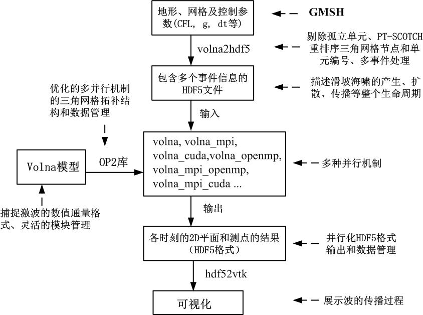

# VOLNA_OP2的基本原理

海啸波演变模型VOLNA(Dutykh et al.,
2011)，经过重新改写，基于OP2库(Mudalige et al., 2012)，开发了可OpenMP,
MPI, CUDA等高性能计算的VOLNA_OP2模型(Istvan et al., 2018)。

VOLNA模型可模拟海啸波形成初期的长时间变形过程，因此可完整地模拟海啸的形成、传播、演变的过程，对研究海底滑坡和海底地震引起的海啸波传播，具有很高的意义。

## 海啸模型相关研究

海啸波传播的模拟方法有：

（1）求解浅水方程(SWE)，结构网格和非结构网格(Behrens and Dias, 2015)。

有限差分：NOAA-MOST

有限单元：SELFE

有限体积：VOLNA, GeoCLAW

（2）求解Boussinesq方程，求解较SWE要复杂！如FUNWAVE, COULWAVE

（3）求解3D的N-S方程，对研究海啸波形成源附近的流体特性有意义

[GPU并行的海啸波模型有：]{.mark}

Celeris (Tavakkol and Lynett,
2017)求解Boussinesq方程，GPU并行，基于有限体积和结构网格，开源代码，仅在1个GPU上运行；

Tsunami-HySEA (Macias et al.,
2017)，GPU-CUDA并行，（嵌套）结构网格，GPU集群并行，代码不开源。

## 控制方程

Cartesian坐标下的非扩散（无粘性）非线性浅水方程（张量形式）：

 (2.1)

 (2.2)

式中，*d*(*x,t*)为随时间变化的海底地形，*v*(x,t)为沿水深积分平均的水平向流速矢量，*g*为重力加速度，*H*(x,t)为总水深。***I~2~***是2阶单位矩阵，海啸波高度或自由水面高度计算如下：

式中，*d*~s~(*x*)为静态地形，*u~z~*(*x,t*)是动态的海床抬升，组成动态地形：

*d~s~*数据一般来至地形数据集，海床变形的垂向分量*u~z~*(*x,t*)根据海啸生成物理机制来计算，例如有限断层滑动的同震分析或海底滑动。

VOLNA模型采用active generation, consequent tsunami propagation,
模拟海啸比在海岸处壅高和下落（run-up和run-down）的过程，这3个功能使得VOLNA模型可以模拟海啸的[整个生命周期。]{.mark}

将控制方程写为[守恒形式]{.mark}，然后讨论对流通量的特征系统：

 (2.3)

上式中的标记：

，

，

将通量投影到法方向（）上，可以计算得到Jacobian矩阵。用物理变量表示其为如下形式：

其中，是投影到法方向()上的法向流速。

Jacobian矩阵的3个特征值：

，，
(2.4)

式中，为浅水重力波波速。（浅水\--有限波长），该变量的作用于可压缩流体力学中的音速的作用相同。

当*H*\>0时，方程组（式2.1和2.2）是严格的双曲型方程。理解雅克比矩阵的特征值结构是建立数值通量计算方法的基础。

## VOLNA模型数值离散方法

有限体积法，优点：鲁棒性，容易应用于非结构化网格，具有局部守恒特点。不考虑源项和边界条件时，FV离散的质量、动量和总能量精确地守恒。

求解守恒形式的方程组，还需要初始条件：

， (3.1)

与合适的边界条件(3.7节)。

图2
控制体*K*，质心*O*，单元*K*指向单元*L*的（边上的）法向

### 3.1一阶通量格式 {#一阶通量格式 .标题3}

计算域，三角化后，分割为一组互不重叠的控制体，覆盖整个计算区域。表示区域的离散网格，对于控制体*K*，有：

，

在中的两个控制体*K*和*L*，相交处是带有法向量或其他节点的一条边。控制体*K*的相邻单元标记为：

FV中控制体单元的网格布置是多样的。VOLNA模型使用的是单元中心存储变量的方法（如图3），这就意味着自由度与单元质心有关。

图3 单元中心存储变量的有限体积

FV第一步：在控制体*K*上对方程式(2.3)积分，对流通量应用Gauss定理，在每个控制体内，施加积分守恒定律，有：

 (3.2)

积分守恒定律的物理意义：控制体内某一变量（质量、动量、能量）的变化率，在控制体*K*内的分布由变量穿过边界的通量和该变量在控制体内的产生量来平衡。

FV第二步：对每个控制体作平均：

平均计算后，FV方法可理解为是：生成一个单元平均的演化方程组：

（Godunov(1959)是第一个应用以上思想离散气动力学方程的人。）

但是，[上述的平均计算]{.mark}意味着每个控制体的分段常数数值解等于单元平均值，在控制体界面处存在多值的数值解，因此在这些界面处的通量计算值是有歧义的。FV法对此的解决方法是：用数值通量函数替代界面处的真实通量值：

上式中，和是两个界面状态变量的Lipschitz连续函数。

选择合适的数值通量函数是关键。一般来说，该函数是这些界面处的精确解或Riemann问题的近似局部解。可实施的数值通量有：[HLL,
HLLC]{.mark}（还有很多其他的数值通量格式）。[最基础的Roe格式呢？]{.mark}

数值通量函数需要满足以下特性：

（1）守恒性

（2）一致性

3.1.1 HLL数值通量

[Harten, Lax and van
Leer]{.mark}建议的近似Riemann解，称之为HLL格式。简化的Riemann扇区如图4，由两组波分隔为三个恒定状态。

图4 对应HLL格式的近似Riemann扇区

图5
在相空间中由Rankine-Hugoniot曲线连接的两个状态变量和

考虑如下Riemann问题：

 (3.14)

近似Riemann扇区内的中间状态变量由和两个激波、表示（见图4和图5）。为了计算得到未知的中间状态变量，将Rankine-Hugoniot条件改写为：

其中，。

可以直接计算出上面方程组的解为：

 (3.15)

现在，我们获得了定义HLL格式数值通量的所有变量：

在推导HLL格式的过程中还缺少一部分：如何计算波速和？这对HLl格式的计算精度影响很大，选择合适的波速和后，HLL格式将具有很好的数值特性，即：满足熵不等式，精确计算孤立激波和保持水深正值
(h,hu,hv\>0)。基于Jacobian特征值解析解，VOLNA模型选择如下波速：

，

式中，为左右状态区域的重力波速，其中：

如果数值格式能写为如下形式即可称该FV格式为通量格式：

式中，为某种形式的矩阵。

HLL格式属于通量格式，且具有很好的健壮性。但HLL格式也有不足，即不能求解孤立的不连续接触问题，HLLC格式可以解决这个问题。

3.1.2 HLLC格式

HLLC格式由[Toro, Spruce and
Speares]{.mark}()推荐，定义了如图6的Riemann扇区结构，在HLL格式中两个激波(和)之间引入一个不连续接触波速.

图6对应于HLLC格式定义的近似Riemann扇区

对于同样的Riemann问题(3.14)。HLLC格式中，Riemann问题的解由三种波速组成：、和，分隔为四个状态变量。波速和与HLL格式的一样，而波速计算如下：

中间状态变量计算如下：

，

最终，HLLC格式的数值通量表述为：

### 3.2半离散格式（时间离散）

引入单元平均值和数值通量到[式(3.2)]{.mark}，导出积分形式的守恒公式：

使用表示的近似值，源项离散见3.4节。由此，下面生成的常微分方程称之为[半离散FV法]{.mark}：

 (3.16)

上述ODE也需要离散，有很多隐式或显式时间积分方法。以表示在时间，控制体*K*内的近似单元平均解，最简单的时间积分方法是Euler前差格式：

应用Euler格式离散式(3.16)，产生全离散的FV格式：

 (3.17)

VOLNA模型使用的时间项离散方法见3.5节介绍。

### 3.3干湿地形处理

海岸以上，*H*=0，方程已不在是双曲型，求解淹没问题存在一定的理论困难。为此，有很有人为方法(ad-hoc
artificial techniques)克服这一问题(run-up and run-down
problems)，例如：slot technique, 虚拟水深, 坐标转换等。

岸线边界条件的简单解析形式为：

，

其中，是海岸线的位置。

VOLNA模型采用Brocchini et
al.(2001)的算法，基于Riemann问题求解法（如图7）：

 

图7 岸线左右状态变量表示的黎曼问题

其主要计算思想就是：将限制条件或传递到Riemann问题的解当中。计算方法：计算海岸线处的波速，判断干湿状态，然后将这些波速施加到近似Riemann解中。

还是考虑两个相邻控制体*K*和*L*，现在必须找到穿过界面的数值通量。考虑下面几种情况：

（1）Wet/Wet界面：如果，，将使用常用的近似Riemann解计算数值通量；

（2）Dry/Dry界面：如果，因为两个干地形单元没有水流，因此为零通量；

（3）Wet/Dry界面：如果，，采用下式计算波速：

，

然后，应用HLL和HLLC格式。

（4）Dry/Wet界面：如果，，采用下式计算波速：

，

然后，应用HLL和HLLC格式。

### 3.4源项离散

[该部分讨论源项离散引起的问题，并提出解决方法。]

水平动量守恒方程中的地形源项，当底部为平底时(*h*=const)，该项为零；当地形坡度较大或地形突然变化时，该项的值很大。可见，很难构建数值格式精确地保证所有恒定解的守恒性。简化这个问题，提出\"lake-at-rest\"特性的简化恒定解：

， (3.18)

以离散变量表示：

， (3.19)

基于[界面静水压力重构]{.mark}方法离散源项(Audusse et al., 2004; Audusse
et al.,
2005)。该平衡算法采用守恒变量矢量、地形数据作为输入，计算步骤如下：

（1）假设控制体*K*和*L*的相邻面，定义界面处地形为，该步仅在初始化阶段计算一次；

（2）静水压力重构界面处的水深定义为：

其中

由平衡条件(3.18)的离散式(3.19)，定义一个新的界面守恒变量：

 (3.20)

（3）由静水压力平衡，修改源项离散式为：

（4）用新的界面值(3.20)代替单元中心值，得到平衡格式：

静水压力重构可保证解的\"lake-at-rest\"特性，并保证解的正值特征(Audusse
and Bristea ,
2005)。以上是一阶算法，还可以扩展到[二阶]{.mark}算法(Audusse et al.,
2004)。

### 3.5 SSP时间离散

采用TVD的时间离散格式，具有很好的稳定性(SSP, Strong
Stability-Preserving) (Shu, 1988)。

2阶RK(2,2)格式（CFL=1）

3阶RK(3,3)格式（CFL=1）：

3阶RK(3,4)格式（CFL=2）：

VOLNA模型采用SSP-RK(3,4)，因为其精度和广泛的稳定区域，该格式是精度与鲁棒性之间的最佳权衡。

### 3.6二阶重构

一阶格式的计算精度太低，除非加密网格，但会造成数值求解效率很低。因此，van
Leer提出二阶重构或MUSCL (Monotone Upstream-centered Scheme for
Conservation Laws)格式。"不是van Leer
(1979)第一次提出梯度重构和坡度限制的思想，而是Kolgan (1972)"

### [3.6.1 MUSCL]{.mark}重构

在1D空间上重构TVD格式不存在问题，但TVD格式在2维空间仅有一阶精度，因此需要基于非结构网格构建二阶非线性格式。方法是：在每个网格单元上求解[分段仿射函数]{.mark}。控制体上实施的线性重构算子要求单元平均计算值也是单元中心处线性重构计算得到的阶段数值。因此，重构计算公式如下：

 (3.26)

式中，是FV法计算的单元平均值，是单元*K*上数值解的梯度估计值（待求解）;和点是网格单元中心。

由于采用点和式(3.26)的表述方法，仍然保证精确的守恒性，这是FV法的核心之处。

下面介绍两种重构技术（每个单元上变量梯度计算）：Green-Gauss积分法和最小二乘法。VOLNA不使用隐式梯度重构法，计算量太大。

### 3.6.2 Green-Gauss梯度重构

就是两点平均。

### 3.6.3 最小二乘法梯度重构 {#最小二乘法梯度重构 .标题3}

就是反距离插值。

图10 最小二乘重构法示意图

因为VOLNA模型使用三角形网格，三角形单元的边界（如图12），梯度重构将简化。VOLNA模型的二阶重构：

图12 控制体单元的边界

### 3.6.4坡度限制函数

思想是：使用限制函数，获得不连续处和较大梯度处的非振荡解(BB73)。当限制函数值为1时，为线性插值的无限制形式。1D情况下，常见的限制函数有15种：CHARM,
minmod, superbee, van
Albada等。无结构网格时情况不同，VOLNA模型使用[Barth-Jespersen
坡度限制器:]{.mark}

式(3.26)的限制形式采用下面的修改的重构算子：

，

其中，假设，相当于一阶格式，而为无限制形式。

Barth and Jespersen (1989)建议采用下面的值：

式中，代表面*f*的重心。

尽管上面的限制函数不完全满足非结构网格上FV法的最大值准则(BO04)，但是可使FV格式具有全局极值消除特性。另外，该限制器可尽可能降低坡度减小量，这对计算精度有利。实际应用中，还需要进行微小修正以防止近似恒定解时分母除以零的情况发生。

### 3.6.5 数值解插值到网格节点上

上述的几种梯度重构过程（特别是单元上的梯度估算），需要知道网格节点上的数值解。由于VOLNA模型采用FV单元中心存储变量的形式，需要插值到节点。

### 3.7施加边界条件

在物理边界()上实施*w*或通量，造成ill-posed
problem

***n***为外法向方向。

1.  [无穿透边界条件（固体边界）]{.mark}

> ，

通量施加于物理边界上的形式：

 （1）

现在，需要确定边界上的，为此，可使用数值边界条件：

2.  [开边界条件]{.mark}

1）开边界为亚临界流，即：

考虑这种边界信息，需要确定的边界通量有如下形式：

 （2）

为此，得获得边界上的u和v。法向流速可由下式计算：

2）超临界流, 需要考虑3个特征值：

为此，还要考虑2种情况：和

第1种情况：需要补充一个物理边界条件\--边界的切向流速；

第2种情况：需要补充一个数值边界条件。

两种情况都有相同的BC形式：，其中

是切向流速。

，，

将上式代入式（2），可计算得到边界通量。

## 参考文献

E. Audusse and M.-O. Bristeau. A well-balanced positivity preserving
"second-order" schemefor shallow water flows on unstructured meshes. J.
Comput. Phys, 206:311--333, 2005. 16, 17

E. Audusse, F. Bouchut, O.M. Bristeau, R. Klein, and B. Perthame. A fast
and stable wellbalancedscheme with hydrostatic reconstruction for
shallow water flows. SIAM J. of Sc.Comp., 25:2050--2065, 2004. 3, 16

K. Anastasiou and C. T. Chan. Solution of the 2D shallow water equations
using the finite volumemethod on unstructured triangular meshes.
International Journal for Numerical Methods in Fluids, 24:1225-1245,
1999. 3

## volna模型的结构

## volna模型的验证

2个验证例子：（1）catalia (2004)海啸；（2）landslide引起的海啸

## 参考文献

K. Anastasiou and C. T. Chan. Solution of the 2d shallow water equations
using the finite volume method on unstructured triangular meshes.
International Journal for Numerical Methodsin Fluids, 24:1225-1245,
1999. 3
