# amatos程序学习记录

## 1、概述

amatos是一个AMR三角形网格的FORTRAN 90程序库(Jorn Behrens et al.,
2005)，目前从代码看来。OpenMP并行功能不能运行【FEM_parallel模块在FEM_gridgen.F90中，但没有使用】，是一个较早期的串行版本的AMR非结构网格生成的库，可作为入门学习之用。

在AMATOS程序库的基础上，开发了[TsunaFlash2d]{.mark}（FVM的海啸波模型---基于amatos2d_searchdevel）、[StormFlash2d]{.mark}(ADER-DG法的风暴潮洪水淹没模型，基于amatos2d)，还有AMATOS3d(flash3d)。

AMATOS库的设计思想是：将复杂的网格生成与自适应过程的细节隐藏。AMATOS不同于大部分的局部加密的四边形结构网格，AMATOS是自适应的非结构三角网格。AMATOS使用space-filling
curves (SFC)算法高效生成层级的三角形网格。

## 2、AMATOS特点

AMATOS根据网格单元标记，局部加密到指定级别(level)。加密的单元不一定嵌套在原始的粗网格上。

### 2.1网格细化技术

AMATOS的网格细化方法如图2.

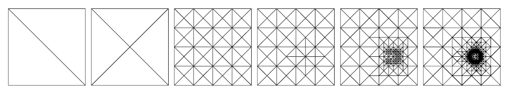

图2 初始三角化和随之执行的方形网格的均匀自适应加密

（1）自适应算法[分为2个阶段]{.mark}：在第1阶段，生成/自适应调整网格。各网格的节点/边/单元包含相关数据。在第2阶段，实施数值计算。为实现该算法，首先从网格的节点/边/单元收集所有需要的数据进入向量，对向量实施计算（利用连续存储位置，执行有效的pipelined或vectorized计算）。最终，将结果分散返回到网格的节点/边/单元存储位置。如图3。

（2）将程序视为[数据流(data-flow)]{.mark}，其中方法作用和操作数据。一个数据结果（称为grid_handle）代表一个具体的网格实例(instance)。方法（amatos程序结构中的子程序）作用于实例，操作实例。可应用不同的方法操作网格，这些操作有些是独立的，有些是关联的。

程序接口(interface)提供在上述2种情况下执行方法的子程序。[收集(grid_getinfo)和分散(grid_putinfo)]{.mark}在步操作网格拓扑的情况下接受[网格handle]{.mark}。其他的方法(methods)，如grid_adapt改变网格拓扑。

在从网格收集到向量上的数据上执行数值计算，在将计算结果返回到网格上之前，***一定不能***改变网格拓扑。

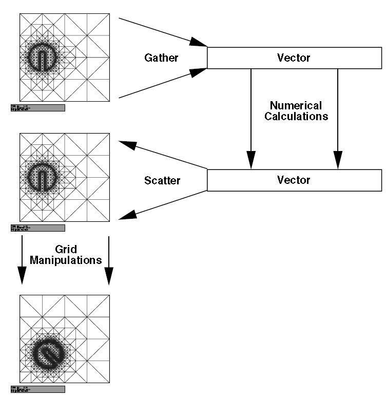

图3 AMATOS使用gather和scatter步在数值计算阶段与网格操作阶段之间切换

平面非结构网格一般就是：四边形和三角形网格。amatos目前仅支持三角形网格。三角形网格细化中常用的细化策略有2种：[规则细化(regular
refinement)和二分法(bisection)]{.mark}（见图4）。规则细化是指：细化构建的三角形是自相似的，因此所有三角形的内角有最低限制，这是数值稳定性所期望的特性。但是，局部的规则细化会造成悬挂节点(hanging
nodes)发生，必须单独处理。另外，规则细化网格搜索SFC更困难。

amatos使用二分法的网格细化方法(Bansch,
1991)，该算法的优点是：简单的递归计算。二分法网格细化也提供有界的内角和无悬挂节点。很容易构建排列网格单元的SFC（见第3节）。

但是，该种网格细化算法也有弊端：即使是均匀细化，[相邻节点数]{.mark}是变化的；二分法细化方法会产生潜在的十字形(criss-cross)网格，在某些情况下会引起数值不稳定的问题(B.
Neta and R. T. Williams,
1986)。二分法网格细化方法很容易拓展用于3D计算域，已有amatos_3d。

2D网格的细化算法如下：

[算法2.1]{.mark}
令三角网格的各单元具有一个标记细化的边，令为标记为细化的单元。

（1）二分各，获得和（子单元）；

（2）标记在上新插入节点对面的边，如图4(b)；

（3）现在，令为具有悬挂节点的三角形单元集；

（4）IF  THEN stop, ELSE goto step 1.

[注意]{.mark}：上述算法仅描述了一级的细化，可以对各网格层递归实施。

3D的四面体网格的二分细化算法与2D网格细化算法相似。就是二分各四面体单元的标记边。

图4 三角形网格细化：(a): 规则细化; (b) 二分法细化

网格粗化通过定义粗化补丁(patch)来实现，如果某节点是对应边的细化创建的，可以从网格上删除（Bansch,
2001），Bansch称粗化补丁为resolvable
patches。在amatos中，在删除对应节点之前，resolvable
patches的3/4的单元必须标记为粗化。使用以上的细化和粗化网格方法，amatos可以创建任意细化的网格。

### 2.2数据管理 {#数据管理 .标题3}

amatos采用Fortran 90的面向对象编程，网格的对象是nodes, edges, elements
(or faces),
tetrahedra。这些对象都定义为一套数据，用于一定的属性，连接到其他网格对象。因此，各网格对象由具有子结构（def,
att,
lnk分别表示定义、属性和连接关系）的结构化数据类型来表征。该数据类型定义在[FEM_define.F90]{.mark}。

amatos中的数据管理对应用程序开发者是隐藏的。amatos提供接口子程序，访问从网格获取的数据集或某个网格的节点/边/单元。访问模式与集合/分散操作类似（图3）。应用程序开发者设计数值格式（[逐点-point-wise、逐边-edge-wise或逐单元-element-wise]{.mark}），即对所有的节点、边或单元执行循环计算。例如，有限差分格式是对网格节点做循环计算，有限体积格式在边上计算数值通量（对边做循环计算）以及有限单元格式对网格单元做循环计算。

为获得网格生成阶段与数值计算阶段均最佳的计算效率，在amatos设计中是独立执行的。图3显示了这种分离。视网格为一个数据的[容器(container)]{.mark}，可通过gather和scatter操作由用户访问数据容器。执行了gather操作后，得到连续的（类似vector）的数据结构的数据。易于实施这样的数据结构的代码优化。为有效实施网格操作和并行化数据通信，网格是面向对象的树状结构数据格式。整个计算过程中的gather和scatter的计算量少于1%的计算耗时。

对于不规则结构数据，可视amatos为一个容器。amatos提供以结构的方式访问数据的接口。实际上，通过使用SFC算法排序数据集，大部分的数据集在计算域内是相邻的，在集合的向量中也是相互靠近的。在向量中保持相邻关系，容易实施并行化。

amatos是面向对象设计的。有3类数据集：节点、边和三角形单元。用坐标定义节点，而边和单元通过其对应的节点编号来定义。

节点包含他们归属单元的编号信息。节点上存储不同类型的物理数据，与应用程序、[数据表征函数]{.mark}(function
representation)和初始配置有关。节点对象由他们的物理坐标r_coor定义，各节点都有自己唯一的编号i_indx。一个节点的属性是它的时间戳、发生时间的标记、它的补丁（周围的单元）、它分开的边编号及其物理数据。最后，当施加周期边界条件时，一个节点连接到其周期partner（节点）。

边对象由他们的节点编号p_node定义，还有各自唯一的编号i_indx。一条边的属性包括时间戳、发生时间的标记、细化的状态、边的边界条件（如果该条边是边界上的边）、数值及其处理器编号（如果并行化）。连接设置为子边（形成一个1-way
tree）和周期partner。边对象包含他们分开单元的编号信息，也包含[该条边的子和父网格边]{.mark}的信息（如果需要细化边的时候）。边上也存储不同类型的数据，甚至若干种未知量，与数据表征函数有关（见2.3节）。

单元（面）对象由其节点(nodes or
vertices)p_node或其边p_edge定义，amatos采用这2种定义方法（要注意一致性）。三角形单元属性包含：时间戳、发生时间的标记、细化层级(refinement
level)、单元的状态（是否细化-refinement、粗化-unrefined或标是否细化/粗化的标记-flagged）、SFC编号及其数值的信息。连接到父和子单元（形成2-way
tree结构）。单元是有方向的（逆时针），一条边位于对应节点的反方向。类似于边，单元也存储不同类型的物理计算数据。

面向对象的设计便于并行化，因为当实施分区的再分配时，所有需要的数据可在一次交换中从一个处理器移动到另一处理器。

为支持时间步格式，[各数据集包含时间戳信息]{.mark}。使用时间戳，可存储不同网格，重复利用若干时间步上的相同数据集。

为高效访问数据对象，amatos分配Hash或Linked列表(list)。在过去、现在和将来时刻，都有所有节点/边/单元的列表。另外，还[开辟了所有边界上的节点/边的列表]{.mark}。为更快的随机访问，amatos使用指针数组来存储所有网格对象的地址，这种管理方式的主要缺点是：当实施粗化网格时，需要不断地包装这些数组。

### 2.3数据表征函数(function representation) {#数据表征函数function-representation .标题3}

amatos支持数据的有限单元函数表征。但是，该特征[必须在编译时就要由应用程序开发者配置好]{.mark}。amatos开发者不能预见应用程序的要求，[使用者的任务是要提供高阶有限单元表征需要的数据和定义]{.mark}。

在amatos中定义有限单元的基本工具是[数据结构署名(signature)]{.mark}。署名包含对应的FE的每个节点/边/单元上的未知量数目、未知量位置的定义、近似阶数以及可选名称的信息。在用户可修改的模块，必须执行FE的初始化。原则上，amatos支持无限种不同类型的FE。

当FE定义好后，在amatos基础上设计的应用程序就可访问这些数据。注意：amatos本身不提供设置刚性或质量矩阵、计算基函数等功能，这些功能必须由应用程序开发者实施。amatos仅提供方便的和整合的数据管理及存储的接口。

### 2.4编程接口 {#编程接口 .标题3}

程序接口由大约25个子程序或函数组成，允许控制网格的生成、终止和自适应加密，保存和恢复网格，恢复和存储数据，在网格节点/边/单元上执行数值计算。

各接口程序的详细介绍见[amatos的技术报告(J. Behrens, 2002)]{.mark}。

## 3、使用SFC算法实施网格分区

网格分区是自适应网格生成算法的关键部分，因为自适应网格生成过程中要频繁计算网格分区。amatos使用space
filling curve（SFC）方法。SFC由Peano
(1889)建立，是提供实数与虚数之间（）的连续满射（surjective
and continuous
mapping），使用一条曲线的递归定义，该曲线在细化极限内遍历在复平面上的每个点，并将其映射为一条1D曲线。SFC在计算机科学领域的离散形式的介绍见文献(???)。SFC有2个特性便于实施计算：

（1）d维域可映射为1D；

（2）保持数据的局部性。

SFC分区算法非常块，可保证最优的荷载均衡和较好的数据局部性，给出相对短的分区界面长度（尽管不是最优的）。SFC分区质量见Zumbusch
(2001)。另外，由于SFC算法的分形特性，给出的排序保持从缓存到主存的各层级内存上的数据局部性。因此，不需要对子区域进行局部的重编码。

Behrens J. and Zimmermann
J.(2000)给出了2D三角形网格的SFC算法。但是，该算法在计算效率和算法实施方便性方面还不是最优的。Jorn
Behrens et al. (2005)引入基于位图的算法，具体如下。事先应已知如下数据：

（a）初始三角化网格中的三角形单元数目*N~0~*；

（b）细化层级的最大级数*l*。

在构建单元时计算全局的SFC编号。如图5，视编号为二进制编码时，在分层级网格上该算法可直接实施。执行所有层级的细化，根据二分的父三角形上的相对位置，增加对应的位（bit），这就产生了SFC编码。该算法容易拓展至四面体网格，也是基于二分法细化。

使用这些数据，对每个单元，我们需要长度为的位结构(bit
structure)。使用第一个*b*-*l*位来连续编号任意排列的初始单元，使用另外的位表示各层级。以上算法如图5的示意。

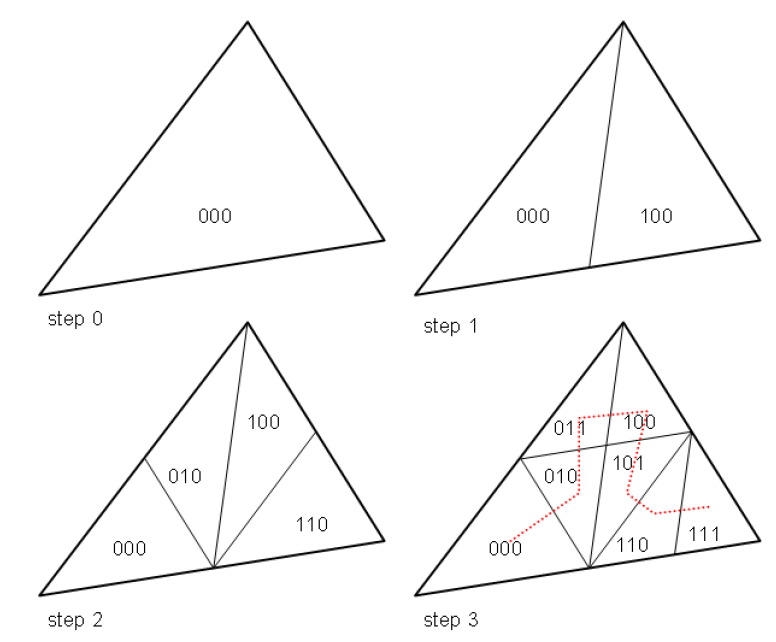

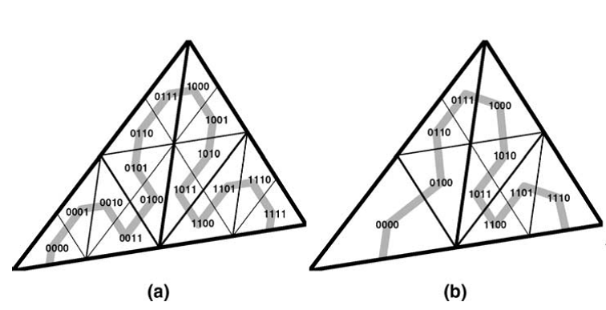

图5 建立采用局部二分法细化三角形网格的SFC算法步骤

建立SFC的算法如下：

[算法2.2.]{.mark}
令为第*k*级网格上的一个单元，用表示单元的2个子单元。

（1）算法从在上的长度*b*的0位图开始；

（2）然后，FOR (*k*=1, *l*) DO:

\(a\)
向2个子单元复制父单元；

\(b\) 根据下面的层级确定左右侧单元：

\(c\) 将子单元的第*k*和位设置为1。

（3）END DO

当计算位图完成后，使用排序(sort)算法对所有单元计算其连续编号。我们使用radix
exchange sort算法，是quicksort的一个变种。

为获得其他网格类（如节点或边）的排序，根据单元的排序，然后收集尚未收集的对应单元上的节点/边，这种方法不仅保证单元数据的局部性，为所有其他未知量也能保证数据局部性。

## 4、分散数据的插值

FEM使用计算域上定义的基函数，容易实施FEM框架下的插值。用户仅需要计算在各坐标处计算基函数的正确的系数。另外，amatos提供基于Hermite单元描述的三次样条插值、径向基函数（RBF）插值以及基于函数的有限单元表征的插值。RBF插值适用于自适应细化网格，因此它是基于任意散点数据构建的。另外，RBF插值易于用来计算任意点处的梯度，甚至不允许求导的特殊FEM类型。对于给定在采样点上的函数值的RBF插值算法如下：

其中，满足插值条件；*K*为设定的相邻采样点的个数；为欧几里得范数；*P*(*x*)为一个多项式，用来封闭根据给定插值条件的计算系数引起的问题；是径向基函数，形式为：。

基于插值的有限单元计算是直接的。令为包含插值坐标*x*的单元上的未知量。则插值函数就是FEM的展开级数：

其中，*b~i~*为FEM基函数；*f~i~*为对应的FEM系数。

注意：所有插值计算都包含在amatos编程接口中。因为插值需要访问各个节点，通过直接访问面向对象的网格数据其计算效率更高。

而且，统一接口允许快速交换不同算例所用到的不同阶数的插值。

[示例2.3]{.mark}.
下面的代码片段展示了如何使用amatos程序接口中的3个不同的插值程序：[grid_domaincheck,
grid_boundintersect,
grid_coordvalue]{.mark}。前2个子程序用来保证半Lagrange时间步格式中上游点是位于计算域中的，调用grid_coordvalue做插值。注意代码片段中：

-   p_mesh是涉及实际网格的网格句柄数据结构；

-   r_coord是节点坐标数组；

-   r_upstr是上游节点坐标数组。

调用grid_coordvalue中，值GRID_highorder预定义于amatos接口中。当使用三次样条插值时，最优变量i_interpolorder相应要设置。i_valpoint是在amatos框架中注册变量的编号。下面是对所有节点做循环，计算插值上游数值：

## 5、支持的有限单元类型

AMATOS可提供[signature数据结构]{.mark}，定义有限单元的基本属性，因此可支持不同类型的FEM。FE的基本属性包括：

（1）FEM的阶；

（2）自由度（DOF）的名称、阶和总数目；

（3）每个单元的节点/边/内部上的自由度数目和位置；

（4）重心坐标上的DOF数目和位置。

当单元类型定义了一个抽象类（在编译库之前就定义了），注册机制允许用户在运行时分配各预定义的单元类型所需要的变量数目。单元类型及其署名见表1。

表1 fem_signature数据结构及常用的有限单元类型

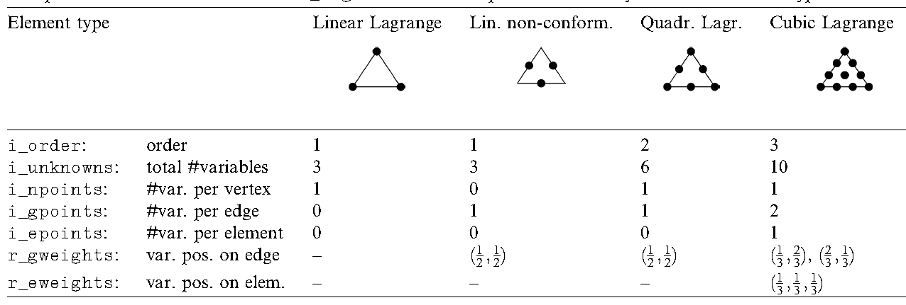

[示例2.4.]{.mark}
下面的代码片段展示了，如何使用amatos支持的FEM类型，创建线性Lagrange单元类型的质量矩阵。质量矩阵的元素使用下式形成：

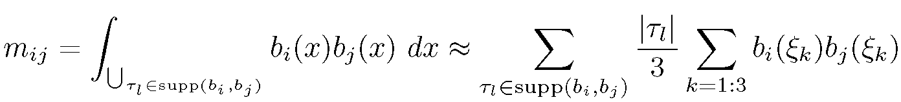

式中，单元的边的中点表示为采样点，而是其面积，supp(*f*)是函数*f*的支撑集；*b~i~*是对应于网格第*i*个节点的FEM基函数。

下面的示例代码较为复杂。实际上不使用，这里为教学目的：

## 6、计算几何

基于amatos开发的应用程序需要对网格类（节点/边/单元）做几何操作。重要的几何操作就是某矢量与计算域边界的交点、某多边形与网格单元的相交面积。以上计算仅在[平面2D]{.mark}版本的amatos中实施，球坐标版本的相应功能未测试。通常，以上计算需要直接访问网格类，因此根据amatos设计思想，这些计算包含在编程接口中。

某矢量与边界的几何相交使用grid_boundintersect子程序来计算，其中通过起始点定义一个矢量，返回交点坐标。相交的算法是基于线段的参数表征。

[算法2.5.]{.mark}

（1）输入：线段和线段；

（2）检查端点*A*是否与端点*B*位于线段相同侧，如果YES，退出；

（3）检查是否与平行，如果YES，退出；

（4）使用下式计算相交：

相交面积的算法实现原理也非常简单，但需要相交多边形是有方向且是凸的（用户必须保证凸多边形）。给定一个多边形与一个三角形单元。然后，算法遍历三角单元的各条边，切割多边形部分面积到边的左侧（内部）。该算法可高效计算多边形的边与三角形的边相交，主要是叉积(cross
product)计算。

[算法2.6]{.mark}.

（1）输入：多边形和三角形；

（2）对于每个*i*=1:3, DO:

（3）对于每个*j*=1:*v*, DO:

\(a\) IF位于的右侧，THEN

\(b\)
计算与的第*i*条相交线；

\(c\) 取*i*作为相交多边形的新节点；

\(d\) END IF

（4）END DO

现在，将给定的多边形有一定相交面积的与所有网格单元相交，需要找到这些单元。amatos使用递归算法实现该计算，接口子程序grid_polygridintersect执行以上计算。

[算法2.7]{.mark}.

（1）输入：多边形*P*与网格*M*；

（2）对于在M中的最粗级别网格上的各单元，DO：

\(a\)
计算与P的相交面积，；

\(b\) IF AND
有子单元和，THEN:

\(c\) 设，GO TO 2a步；

\(d\) ELSE RETURN

\(e\) END IF

（3）END DO

## 7、AMATOS的应用

## 半隐格式求解

在amatos的测试程序MISC_testfem.f90中，组装刚性质量矩阵后，使用CG法求解Ax=b，但最好使用预处理的求解器。

[算法：]{.mark}

（1）初始化：分配临时工作空间，收集坐标值和网格中的单元连接关系；

（2）组装：组装刚度矩阵*A~ij~*和右手边*f~i~*的质量矩阵；

（3）求解：求解线性方程组，得到离散解*u~i~*；

（4）结果：分散结果*u~i~*返回网格。

### 物理海洋模拟

海洋与大气模式的差别在于，海洋具有非常不规则的边界，amatos可以通过多边形（线）处理复杂边界。用户给出初始网格，初始网格仅需要近似逼近给定的区域。第一步，修正初始网格，所有边界节点精确匹配实际的边界位置。细化网格阶段，移动插入的新的边界节点，使网格更加逼近区域轮廓。

在拐角和海湾内的初始网格必须要特别注意，这样才能保证好的网格质量和真实覆盖计算域。复杂几何边界的网格示例如图11。

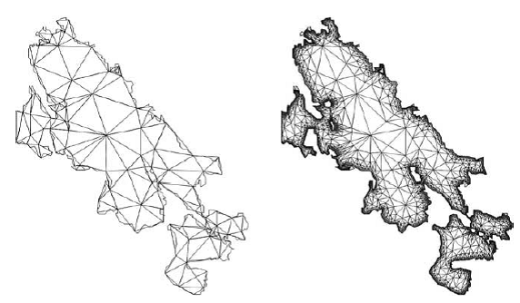

图11 初始网格和细化12级后的网格

## 8、展望

1.  代码优化的amatos_2.0

2.  基于数学和物理准侧的误差评估因子

3.  基于OpenMP线程与MPI任务的数据通信的并行化AMR（[sam(oa)\^2库]{.mark}）。

4.  利用分级的数据结构，用于多网格求解器。

## 参考文献

Icosahedral non-hydrostatic general circulation model (icon gcm)
homepage, http://icon.enes.org/, 2003. （ICON是fluidity模型的前身）

J. Behrens. AMATOS -- A FLEXIBLE ENGINE FOR ADAPTIVE GRID COMPUTATIONS.
Technical Report. Technische Universitat Munchen, Center for
Mathematical Sciences, Boltzmannstr. 3, 85747 Garching, Germany

J. Behrens, amatos -- Adaptive mesh generator for atmosphere and ocean
simulation, Technische Universit¨at M¨unchen, TUM, Center for
Mathematical Sciences, D-80290 Munich, Germany, 2002, API Documentation
Version 1.2. （[该报告对AMATOS原理做了详细介绍]{.mark}）

Jorn Behrens, Natalja Rakowsky, Wolfgang Hiller, Dorthe Handorf,
Matthias Lauter, Jurgen Papke, Klaus Dethloff. 2005. amatos: Parallel
adaptive mesh generator for atmospheric and oceanic simulation. Ocean
Modelling, 10: 171-183.

Behrens J., Zimmermann J., 2000. Parallelizing an unstructured grid
generator with a space-filling curve approach. In: Bode, A., Ludwig, T.,
Karl, W., Wismuller, R. (Eds.), Euro-Par 2000 Parallel Processing, sixth
International Euro-Par Conference, Munich, Germany, August/September
2000, Proceedings. Vol. 1900 of Lecture Notes in Computer Science.
Springer-Verlag, 815-823.

Nicole Beisiegel, Stefan Vater, Jörn Behrens, Frédéric Dias. An adaptive
discontinuous Galerkin method for the simulation of hurricane storm
surge. Ocean Dynamics (2020) 70:641--666

Nicole Beisiegel. High-order Adaptive Discontinuous Galerkin Inundation
Modeling. 2014. 汉堡大学博士论文.

N. Beisiegel, C. E. Castro, and J. Behrens. Quantifying Computational
Efficiency of Adaptive Mesh Refinement for Shallow Water Solvers. 2019

E. Bansch. 1991. Local mesh refinement in 2 and 3 dimensions, Impact of
Comput. in Sci. and Eng. 3: 181-191.

B. Neta and R. T. Williams, Stability and phase speed for various finite
element formulations of the advection equation, Computers and Fluids 14
(1986), 4: 393--410.

半拉格朗日积分格式：

A. Staniforth and J. Cˆot´e, Semi-Lagrangian integration schemes for
atmospheric models -- a review., Mon. Wea. Rev. 119 (1991), 2206-2223.

J. Behrens, An adaptive semi-Lagrangian advection scheme and its
parallelization, Mon.Wea. Rev. 124 (1996), no. 10, 2386-2395.

AMATOS-FVM（TsunaFlash2d模型）中有限体积法的原理基础：

Hanert E., Le Roux, D. Y., Legat V. Deleersnijder, 2005 An efficient
Eulerian finite element method for the shallow water equations. Ocean
Model. 10, 115-136.

F. X. Giraldo. 1997. Efficiency and accuracy of Lagrange-Galerkin
methods on unstructured adaptive grids. Mathematical Modeling and
Scientific Computing, 8

# amatos编程示例

下面提供一个基于amatos库的编程示例代码，是在一个球体上创建自适应三角形非结构网格。

amatos的初始化见[图1]{.mark}。应用程序开发者必须通过调用 [use
GRID_api]{.mark}
使用实施amatos的模块。通过子程序grid_initialize初始化数据结构，而使用grid_setparameters设置网格细化参数。最终，从文件定义的粗网格创建初始网格（通过grid_createinitial实现）。[注意：]{.mark}amatos不是传统意义上的对任意计算域自动生成网格的网格生成器，而是细化一个给定的粗网格。

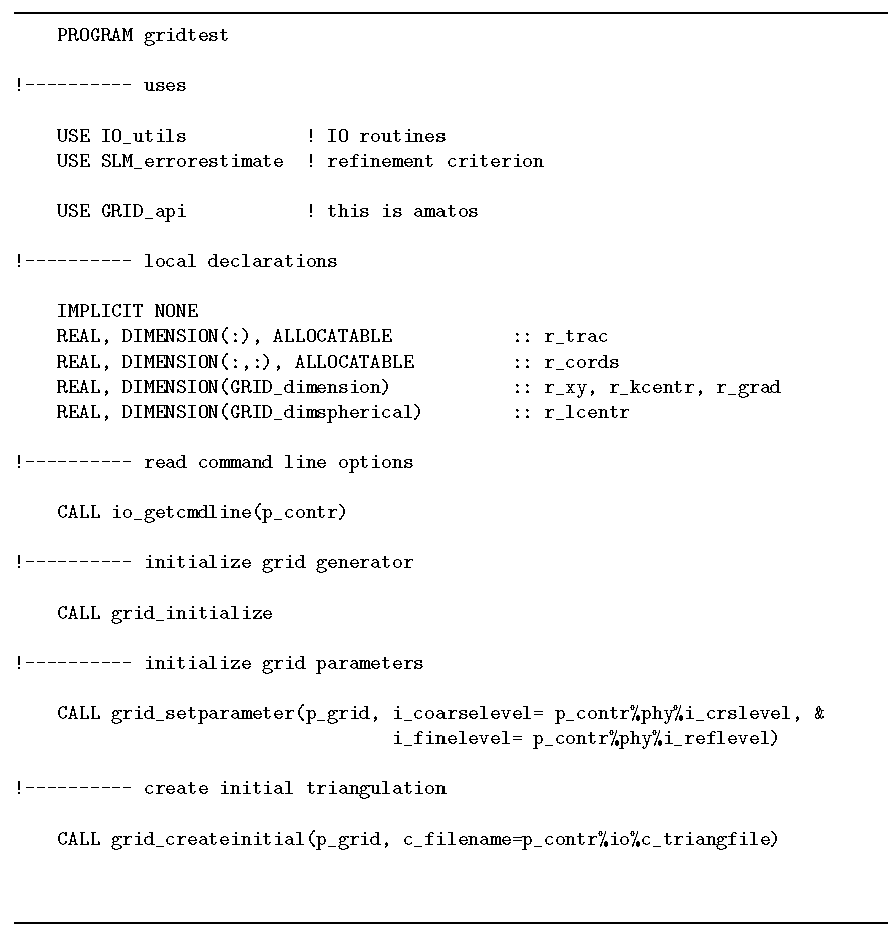

图1 amatos主程序的头部（初始化）

为在amatos中操作物理数据，我们需要初始化一个标量场。amatos提供的p_grid数据结构包含网格大小的信息，即存储数据的网格节点数。代码片段[见图2]{.mark}，显示了如何计算数据，与坐标有关。而来自网格的坐标值使用[grid_getinfo]{.mark}恢复，使用[grid_putinfo]{.mark}将新计算的数据存储返回网格。

自适应程序的主要部分是自适应循环计算，如[图3.]{.mark}
在自适应循环中，第一步是：计算新的数值（在cosine山丘形状标量场的情况，在时间步格式中，时间积分执行该任务）。第二步是：一个合适的误差准则的计算，使用slm_errorest完成，可使用标量场的梯度作为细化准则。第三步是：所有的三角形单元都有一个很大的误差（即超过了r_trsh的阈值），标记为细化的单元。最后，调用grid_adapt执行对应的网格细化，自动关注悬挂节点，确保保持在之前设定的细化限制内。

在每个amatos程序最后，必须注销内部的数据结构，必要时保存备份网格数据。图4显示了执行代码。

上述代码创建了如图5的球体上的三角网格，初始网格由92个节点和180个三角形单元组成，像个足球。

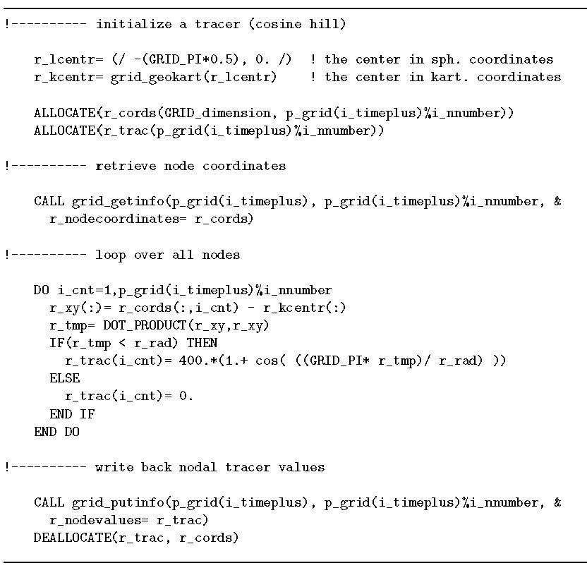

图2 初始化cosine小山丘形状的物质浓度场的amatos代码片段

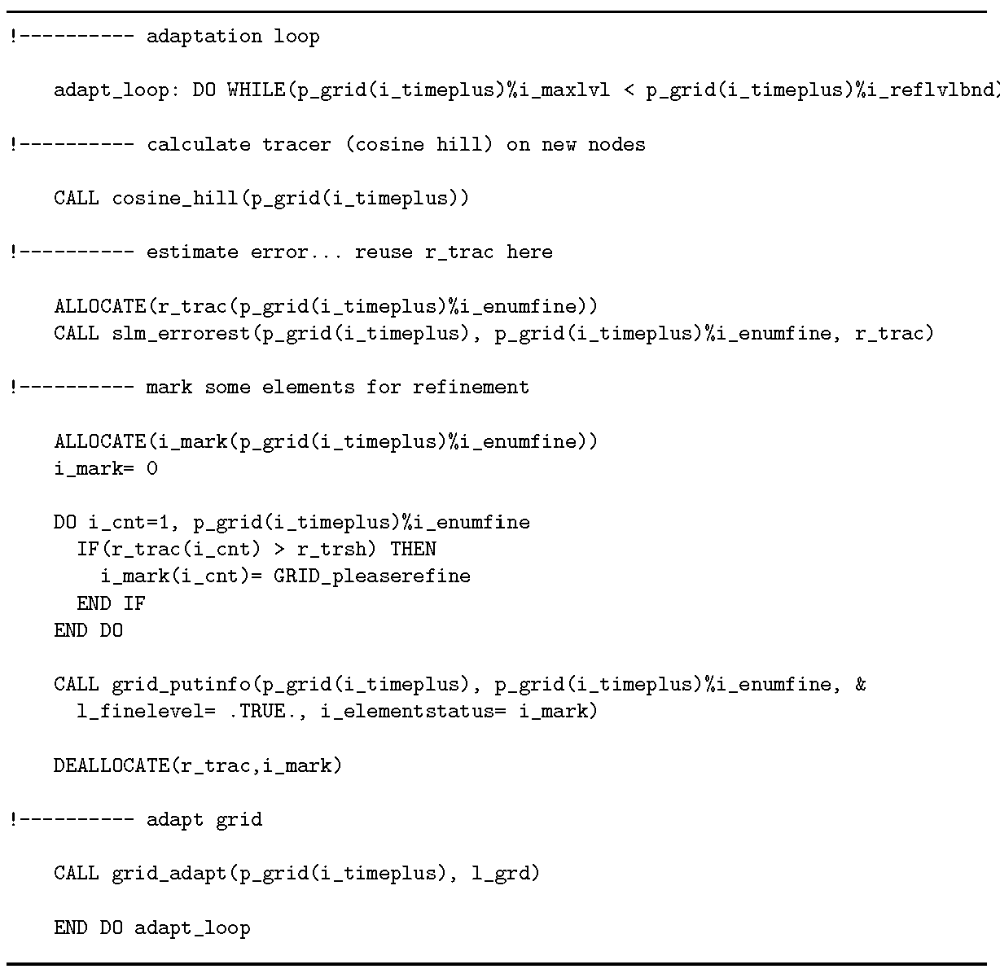

图3 自适应循环计算的示例代码

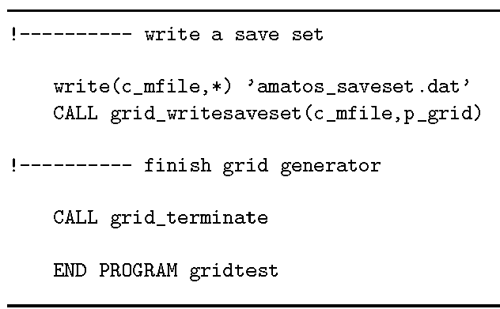

图4 amatos程序的结尾

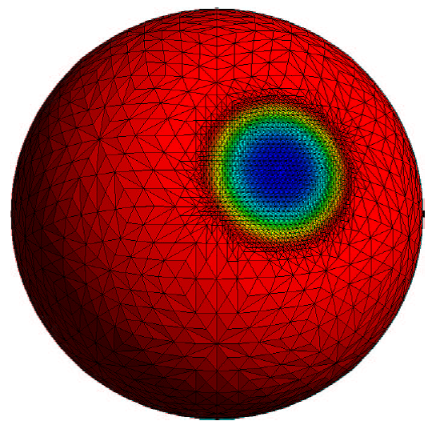

图5 球体上的自适应三角形

# 可视化

可以使用General Mesh Viewer
(GMV)来可视化网格和计算结果。GMV可以在lanl网站上下载。

GMV不是amatos的部分，有一个Fortran 9o
module实施输出数据为GMV兼容文件（ASCII格式）：[IO_plotgmv.F90]{.mark}

如下的场可输出到名为AMATOS_gmv.nnnn，其中nnnn是0000到9999之间的数字：

-   未知量的坐标；

-   未知量的带编号的单元描述；

-   节点数值：

-u, v分量： (u, v)风速分量

-phi: Φ地球势高速场（或静态问题的数值解）；

-zeta：ζ一个附属场；

-标量场

-low-dx, low-dy and tps-dx, tps-dy : Φ的低阶导数和薄平面的样条近似

-   单元数值：

-level: 单元的细化级别

-status：单元标记

另一个可视化AMATOS计算结果的程序是visNET，是基于OpenGL，可实现在线可视化。visNET由面向对象的结构体来实现网格和非结构数据的4D可视化。可视化技术是基本的（标量和向量数据的渲染着色、iso-surface，网格结构等），visNET的特点是能够处理所有类型的数据，包括无网格数据。visNET启动一个独立的进程，在执行主进程计算过程中，来实时渲染图形屏幕。

# AMATOS的接口子程序

下面列出amatos的应用程序接口的子程序，具体使用和参数列表的细节见下面的技术报告（[能下载到吗？]{.mark}）

[J. Behrens, amatos -- Adaptive mesh generator for atmosphere and ocean
simulation, Technische Universit¨at M¨unchen, TUM, Center for
Mathematical Sciences, D-80290 Munich, Germany, 2002, API Documentation
Version 1.2.]{.mark}

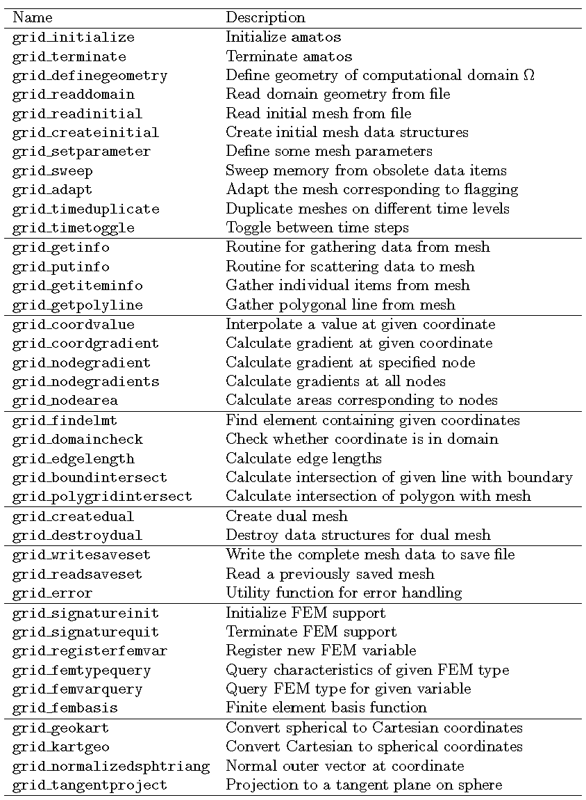
