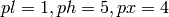
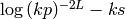

# DG-SWEM的网上手册

[https://users.oden.utexas.edu/\~michoski/dgswem_doc/index.html#](https://users.oden.utexas.edu/~michoski/dgswem_doc/index.html)

This is documentation for the discontinuous Galerkin shallow water
equations model (DG-SWEM).

## 发展史

[Clint Dawson研究团队]{.mark}发展的DG法模型，FORTRAN编程。MPI并行化。

从代码看来，DG-SWEM模型在早期（2001），是基于ADCIRC_v41.11(2001年)的框架下开发的，因此后期DG-SWEM的编码风格及文件格式与ADCIRC模型几乎一致。

从2016年，Prapti
Neupane的代码来看，已经脱离了ADCIRC，但仍然采用了很多ADCIRC模型的源码。

在2017年，Brus对DG-SWEM模型做了较大改进，如曲边单元等技术。

Brus的代码与Neupane的代码区别很大了！

## 下载DG-SWEM（Neupane与Brus的dgswe不同）

DG-SWEM is available for download through github. The reposisoty is
openly available to anyone, though (at present) we are tracking users
for internal purposes. In order to get the repository, please create a
github account.

Once you have done so, join the DG-SWEM google groups online forum and
start a new topic called "Access." You will be added to the forum and
given access to the repository at this point.

The online forum is intended to help DG-SWEM users and developers to
improve and learn how to use the code. Please feel free to ask any
question there, or to answer any question you feel qualified to respond
to. This is a friendly environment, and is entirely intended to help the
user community grow and flourish.

## 运行DG-SWEM的基本模块

Running DG-SWEM should be quite simple. The code has been primarily
developed to work with the [intel fortran
compilers](http://software.intel.com/en-us/intel-compilers), and
[python](http://www.python.org/) (with sympy functionality) is also
necessary in order to run the sediment transport portion of the code --
though the code may easily be run with this function turned off.

That being said, gfortran compilers can also be used if one has GNU
Fortran (Ubuntu/Linaro 4.6.3-1ubuntu5) 4.6.3 or newer. For information
on how to compile using this compiler see the [online
forum](https://groups.google.com/forum/#!forum/dgswem).

Once you have intel compilers and python (with
[sympy](http://sympy.org/en/index.html) -- 一个符号计算库) loaded, go to
the work directory, "dgswem/work/." The code can be compiled to run in
either serial, parallel, or both. To compile all of the above, a simple

[\$ make all]{.mark}

works. This is the best option, and in order to run the test case that
ships with the code, you will need at least 64 processors, requiring
MPI. We tend to use
[mvapich2](http://mvapich.cse.ohio-state.edu/overview/mvapich2/), though
any implementation will work.

Now, in order to run the code you can simply type:

[\$ ./dgswem_serial]{.mark}

or

[\$ ibrun -np 12 ./dgswem]{.mark}

and so on, depending on your submission system. A sample script is
included in the repo for submitting to
[Stampede](https://www.tacc.utexas.edu/stampede/) on
[TACC](https://www.tacc.utexas.edu/).

All parts of the code can be made separately as well. To see these
options, one can simply open "makefile" in the work directory. For
example, if one wants to compile DG-SWEM with short waves from
[SWAN](http://swanmodel.sourceforge.net/), you can find the instructions
in the [online forum](https://groups.google.com/forum/#!forum/dgswem).

It should be noted that the test case that ships in the git repository
requires large wind files that cannot be stored on github. As a
consequence, these files are hosted elsewhere, and downloaded during
compilation using the "get_winds.py" script in the work directory. When
running a new (or different) test case, you need to make sure that
get_winds is turned off in the "makefile." This can be accomplished by
removing "winds" from the makefile.

## 输入文件([fort.dg]{.mark})

The basic input files for DG-SWEM are similar, and meant to coincide
with those of the [ADCIRC project](http://adcirc.org/). The majority of
the information about these input files [can be found on the adcirc
pages](http://adcirc.org/home/documentation/users-manual-v50/input-file-descriptions/).

The basic difference in the input files for DG-SWEM can be found in the
[fort.dg]{.mark} file in the work directory. An example of this file
(the one that ships with the repo) is:

1 ! DGSWE

0,2 ! padapt(1=on,0=off), pflag(1=smooth,2=shocks)

1,8 ! gflag(0=fixed,1=dioristic), dioristic tolerance (0-100)

1,1,1 ! pl(low p), ph(high p), px(fixed p)

0.00005 ! slimit (epsilon tolerance in pflag=1 p_enrichment)

10 ! plimit (integer timestep counter for p_enrichment)

1,0.5,2 ! k, ks, L for pflag=2 tolerance:log((k\*p)\*\*(-L\*2))-ks

1 ! FLUXTYPE

2,2 ! RK_STAGE,RK_ORDER

1 ! DG_TO_CG (ignore)

0 ! MODAL_IC

0, 86400 ! DGHOT, DGHOTSPOOL

5 1 ! SLOPEFLAG (only 1, 4-10 work; 5 is best/fast!), weight(default 1!)

0, 0.0001000, 0.00001, 1 ! SEDFLAG, porosity, SEVDM, and \# of layers

1 ! Reaction rate when chemistry is on in (litres/(mol\*days))

23556 ! Number of total elements in mesh

0,-1.0,0.0,2.5e-6,0 ! artdif, kappa, s0, uniform_dif, tune_by_hand

(ZE_ROE+bed_ROE)\*\*-1 \*QX_ROE

(ZE_ROE+bed_ROE)\*\*-1 \*QY_ROE

以下是上述参数的简要描述：

-   **DGSWE**: This parameter describes the input type for flow edges,
    or usually river types. For most intents and purposes it is almost
    always set to 1.

-   **padapt**: The first flag determines whether p-adaptivity or
    p-enrichement is turned on, on = 1, 0 = off. The second flag
    dtermines what type of p-enrichement scheme will be used to
    determined where to enrich. 1 = smooth enriches in areas that are
    very smooth, and 2 = shocks enriches in areas where the solutions
    has large gradients.

-   **gflag**: This is another flag having to do with p-enrichement.
    gflag = 0 means fixed form p-enrichment, which means that
    p-enrichement occurs relative to a global tolerance, while gflag = 1
    means that p-enrichment is only performed on some percentage of the
    total number of cells, given by the diorsitic tolerance (which is
    the second number).

-   **pl, ph, px**: These are the polynomial basis degrees for the top
    degree polynomial ph, the bottom degree polynomial pl, and the fixed
    degree polynomial px. To run at third order, for example, ph =
    pl=px=2. To run p-enrichment from first degree to fifth degree,
    starting at initial projection order 4, would
    be {width="1.7597222222222222in"
    height="0.17569444444444443in"}.

-   **slimit**: is epsilon tolerance when pflag=1 when smooth type
    enrichment is being used.

-   **plimit**: is the counter that determined how many timesteps are
    taken between each p-enrichement/de-enrichment event.

-   **k, ks, L**: These are the tolerances for the type 2 p-enrichement
    scheme, that go into the formula:
    {width="1.1388888888888888in"
    height="0.1746544181977253in"}.

-   **Fluxtype**: The fluxtype indicated which numerical flux is used.
    Available fluxes are 1 = local Lax Friedrich's, 2 = Roe Flux, 3 =
    Harten-Lax-van Leer Contact flux, 4 = Nonconservative product flux.
    It should be noted that not all fluxtypes are supported by sediment
    transport.

-   **RK_STAGE**: The RK stage is the stage information for stage
    exceeding order Runge Kutta method. Note that this setting is
    related to the type of RK scheme used, see [编译指令]{.mark}

-   **RK_ORDER**: This is the time integration order for the Runge-Kutta
    method.

-   **DG_to_CG**: This flag can be ignored for now.

-   **Modal_IC**: This determines the initial state of the system.
    Modal_IC=0 is a standard cold start configuration. Modal_IC = 1
    reads in modal initial conditions. Modal_IC = 2 reads in hot start
    files. Modal_IC = 3 reads in nodal initial conditions.

-   **DGHOT**: This flag indicates whether hotstart files will be
    produced (1) or not (0), in order to hotstart the code.

-   **DGHOTSPOOL**: This is the spooling number for the hostart, which
    indicates what timestep frequency the hotstart output will be
    written at.

-   **SLOPEFLAG**: The slopeflag determines which slopelimiter will be
    used in the code. Twelve different slopelimiters are supported,
    though the most common setting is slopeflag = 5, which is the
    Bell-Dawson-Shubin (BDS) limiter.

-   **Weight**: The weight is a free parameter used by some
    slopelimiters, that determines specific tolerances. See the
    slopelimiter paper for more detail.

-   **SEDFLAG**: The sediment flag determines whether or not sediment
    will be tranported or not in the domain. If it is, then sedflag = 1
    and DG-SWEM solves the Exner equation. simultaneously for sediment
    transport. If sedflag = 0, then the bathymetry is stationary.

-   **Porosity**: The porosity is a parameter determined by the sediment
    law in the discharge equation. See the Exner equation for more
    details.

-   **SEVDM**: This is the sediment diffusion coefficient value.

-   **Layers**: This determines how many layers of sediment are running.
    Not all functions support more than a single layer of sediment.

-   **Reaction Rate**: This is the rate of the reaction in
    litres/(mol\*day) when chemical reactions are turned on.
    See [*Compiler
    directives*](https://users.oden.utexas.edu/~michoski/dgswem_doc/Compilerflags.html) for
    more details.

-   **Total elements**: This is the total number of element in the mesh.

-   **Artdif,,kappa,s0,uniform_dif,tune_by_hand**: These are the flags
    that determines whether artificial diffison is turned on or not.
    Artdif = 1 is on, Artdif = 0 is off. the kappa and s0 are tolerances
    that determine how sharp the cutoff for the artificial diffusion is.
    The uniform diffusion flag sets all types of diffusion to the same
    value. The tune_by_hand parameter means that each diffusion type
    will be set in the prep routine.

-   **Last two lines:** The last two lines determine the algebraic form
    of the sediment discharge equation. These are tokenized using a
    fortran parser to support any form for the sediment discharge.

## 编译指令

DG-SWEM has been written in a semi-modular way, in order to preserve
performance on when certain features are not active. As a consequence
many compiler directive are used. The directives can be set in
[cmplrflg.mk]{.mark}. Here is a breakdown of the compiler directive
options:

-   **DRKSSP**: Indicates that strong stability preserving Runge Kutta
    will be used for time integration, with stage equal to or exceeding
    order.

-   **DRKC**: Indicates Runge-Kutta-Chebyshev methods will be used for
    time integration, with stage equal to or exceeding order.

-   **DWETDR**: Turns the wetting and drying algorithm on.

-   **DOUT_TEC**: Indicates that tecplot output will be produced
    relative to the NSPOOL parameters.

-   **DSLOPEALL**: This means that all slope limiters will be made
    available for use.

-   **DSLOPE5**: This means only the BDS limiter will be made available
    for use.

-   **DARTDIF**: This means artificial diffusion will be made active.

-   **DSED_LAY**: Indicates that layered sediment evolution will be
    computed.

-   **DTRACE**: This means that a tracer field will be active, that is
    passively advected by the velocity field.

-   **DCHEM**: This means that chemistry is turned on.

-   **DP0**: Indicates that piecewise constants are available for use.

-   **DP_AD**: Means that p-enrichement or p-adaptivity is activated.

-   **[DSWAN:]{.mark} Indicates that the nearshore wave model
    [SWAN](http://swanmodel.sourceforge.net/) will be coupled to the
    solution.**

# DG-SWEM基本操作

从run_case.py代码中学习到：

使用python2语言的subprocess module控制各程序的运行：

show_output显示执行某命令（进程）的输出信息。

def show_output(command):

output = subprocess.Popen(command,stdout=subprocess.PIPE,shell=True)

while output.poll() is None:

l = output.stdout.readline()

print l.rstrip(\'\\n\')

## 1、设置绝对路径

plot_work_dir

dgswe_work_dir

example_dir

nprocessors #启用的进程数(MPI)

## 2、编译DG-SWEM

（1）进入/work目录，编译dgswe_mpi程序：

make clean

make metis

make dgswe OPTS=mpi

make dgprep

make dgpost

（2）进入/plot目录，编译plot程序：

make clean

make plot

（3）运行dgswe

-   建立一个文件：np.in，内容是nprocessors

-   执行前处理：./dgprep \< np.in

-   执行主程序：mpirun --n nprocessors ./dgswe_mpi

-   再执行后处理：./dgpost

（4）绘制（可视化）结果：

./plot

## 3、删除所有运行例子产生的文件

clean_case.py

删除所有的文件，包括可执行程序。

## plot后处理程序

输出为PostScript的矢量图，包括高阶FEM的可视化方法（见Brus,
2017的博士论文）

需要输入文件：plot.inp和plot_sta.inp (可选)

plot.inp的几个感兴趣的参数：

station plot option 绘制测站位置的示意图

order of nodal set for plotting straight elements

order of nodal set for plotting curved elements

adaptive plotting option

colormap path 可选择Legend颜色模式

plot Google Map 下载谷歌地图图片，作为背景图

## error分析程序

分析收敛性和误差的后处理程序，比较粗网格和细网格的收敛速率。

需要输入文件error.inp

!/home/sbrus/Codes/dgswe/grids/converge_quad.grd ! coarse grid file

!/home/sbrus/data-drive/converge_quad/mesh1/P2/CTP2/ ! coarse output
directory

!2 ! p - coarse polynomial order

!2 ! ctp - coarse parametric coordinate transformation order

!.5d0 ! dt - coarse timestep

!/home/sbrus/Codes/dgswe/grids/converge_quad2.grd ! fine grid file

!/home/sbrus/data-drive/converge_quad/mesh2/P2/CTP2/ ! fine output
directory

!2 ! p - fine polynomial order

!2 ! ctp - fine parametric coordinate transformation order

!.25d0 ! dt - fine timestep

!2d0 ! tf - final time (days)

!20 ! lines - lines in output files

## bathy_interp程序

地形的高阶插值计算。

输入文件：bathy.inp；内容？

输出文件：\_interp.hb、elem_nodes.d、interp_nodes.d、boundary_nodes.d、bathy.d

## rimls程序

输入文件：rimls.inp

具体功能尚未清楚。是优化网格的？

/home/sbrus/Codes/dgswe/grids/dummy.cb ! curved boundary file

/home/sbrus/Codes/dgswe/rimls/work/Rimls_test-sub.grd ! eval grid - used
to determine rimls surface evaluation points

1 ! eval hbp - bathymetry order

1 ! eval ctp - parametric coordinate transformation order

/home/sbrus/Codes/dgswe/grids/dummy.cb ! curved boundary file

3 ! lsp - moving least squares fit order

0 ! basis_opt - basis for least squares polynomial (1 - orthonormal,
else - simple)

1d0 ! Erad - radius of Earth

0d0,0d0 ! lambda0,phi0 - center of CPP coordinate system

3.0d0 ! r - muliplier for search radius (1.5 - 4.0)

1.5d0 ! sigma_n - smoothing parameter (0.5 - 1.5)

../output/ ! output directory

1 ! nrpt - number of random points (for converging channel hardwire)

0d0

## spline程序

输入文件：spline.inp

## stations程序

输入文件：dgswe.inp

绘制测站的位置示意图。

## util文件夹

该文件夹下包含很多工具小程序，FORTRAN和MATLAB语言。

# 编译dgswem出现的错误及解决方法

\(1\)

Error: There is no specific subroutine for the generic
\'mpi_dist_graph_creat_adjacent\'

**解决方法**：使用mpich2库(mpich-3.3)，或者使用3.1版本以上（Ver. \>
3.1）的openmpi库。

gedit \~/.bashrc

export PATH=/home/lijian/mpich-3.3/bin:\$PATH

\(2\) 对\'dgesv\_\"未定义的应用

没有正确安装或设置lapack库。

打开/work/makefile，阅读第118行下面的内容：

\###############################################################

\# Library Links (Platform Specific) \#

\###############################################################

查看主机名：hostname

修改makefile中的ifeq
(\$(NAME),chl-tilos)为：lijian（我的笔记本的主机名）

\(3\) 使用Python 3执行run_case.py出现：print l.strip()的语法错误

[切换为Python 2.7]{.mark}

alias python=\'/usr/bin/python2.7\'

在bashrc中使用假名，将永久生效。

或者建立软连接：ln --s /usr/bin/python2.7 /usr/bin/python

或者使用update-alternatives

\(4\) 执行./plot出现错误：convert not authorized error/..

修改：/etc/ImageMagick-6/policy.xml文件中的内容：

rights=\"none\" rights=\"read\|write\"

# python的进程管理语法

os.chdir()方法用于改变当前工作目录到指定的路径。

os.rename()方法用于命名文件或目录，从src到dst，如果dst是一个存在的目录，将抛出OSError。

os.rename语法

rename()方法语法格式如下：

os.rename(src, dst)

参数

src \-- 要修改的目录名

dst \-- 修改后的目录名
