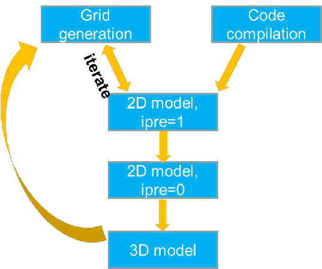

# Typical workflow (a cheat sheet)

Figure 1 Typical workflow with SCHISM modeling.

## Mesh generation tips

Generate meshes in map projection, not lon/lat; this gives flexibility of setting element size (although newer SMS versions can now handle distance in lon/lat directly). Distortion due to projection can be rectified later by projecting back to lon/lat;

Make sure major channels are resolved with at least 1 row of ¡®always wet¡¯ elements ¨C no blockage of major channel flow

Always keep the map file and DEM sources and be willing to edit the grid, as often the model results (and sometimes performance) depend on the mesh
Being an implicit model with ELM treatment of momentum advection, SCHISM has an operating range for the time step. For field applications, the range is 100-400 sec for barotropic cases, 100-200 sec for baroclinic cases. If you have to reduce the time step, make sure you recheck the inverse CFL criterion again.

First estimate the smallest 
 you¡¯d anticipate (e.g., 100s for field applications), and then estimate the coarsest 
 at sample depths to make sure 
 (cf. Table 5.1).
 
Resolving features is much easier with SCHISM ¨C be game! Bathymetry smoothing is not necessary.

Make sure open boundaries do not become completely dry during simulation
[3D simulations with transport] Implicit 
 transport is very efficient, but horizontal transport is still explicit (and is the main bottleneck). Therefore beware of grid resolution in critical regions to avoid excessive sub-cycling; use upwind in areas of no stratification. Another way to speed up is to use hybrid ELM and FV by setting ielm_transport=1.
 
Check the following things immediately after a mesh is generated (via ACE/xmgredit5 or scripts)
Minimum area: make sure there are no negative elements (under xmgredit5->Status). (at least in ¡®wet¡¯ areas). Note that you need to do this check in map projection (meters), not in lon/lat!
Maximum skewness for triangle: use a generous threshold of 17, mainly to find excessive "collapsed" elements that originate from the SMS map issues (and fix them in SMS).

As a general rule of thumb, SCHISM can comfortably handle elements >= 
 (
 in lon/lat), and skewness<=60. Use ACE/xmgredit5 or SMS to check these. Most of those extreme elements are due to SMS map issues so you should fix them there.
 
Fix bad quads: fix all bad-quality quads using fix_bad_quads.f90 as the last step; use 0.5 (ratio of min and max internal angles) as threshold.

## 2D model: pre-processing

Check additional grid issues with a 2D barotropic model with ipre=1, ibc=1, ibtp=0

You can cheat without any open boundary segments during this step

Remember to mkdir outputs in the run directory

Iterate with mesh generation step to fix any mesh issues.

## 2D model: calibration

Start from simple and then build up complexity. Simplest may be a tidal run with a constant Manning¡¯s 
.

Remember most outputs are on a per-core basis if you use OLDIO and need to be combined using the utility scripts; e.g., for global outputs (schout*.nc), use combine_output11.f90 to get global netcdf outputs that can be visualized by VisIT or other tools; for hotstart, use combine_hotstart7.f90. If you use new scribe I/O, you don't need to combine global outputs, but still need to combine hotstart outputs.

Examine surface velocity in animation mode to find potential issues (e.g. blockage of channels)
Negative river flow values for inflow

Check all inputs: ¡®junk in, junk out¡¯. There are several pre-processing scripts for this purpose. Xmgredit5 or SMS is very useful also.

## 3D model: calibration

The model may need velocity boundary condition at ocean boundary. The easiest approach is to use FES2014 or TPXO tide package to generate tidal velocity, and use a global ocean model (e.g. HYCOM) to get sub-tidal velocity. Then use type ¡®5¡¯ in bctides.in.

Avoid large bottom friction in shallow areas in 3D regions
Examine surface velocity in animation mode to find potential issues
Control the balance between numerical diffusion and dispersion (indvel, ihorcon)
Transport solver efficiency may require some experience.

 grid requires some learning/experience, but is a very powerful tool (resembling unstructured grid in the vertical)
See Case studies for commonly encountered issues in 3D setup.

## Note

Another good resource for beginners is a mini live [manual](./Guide_SCHISM-main) by Ms. Christelle Auguste (U. of Tasmania). There is a PDF on there.

