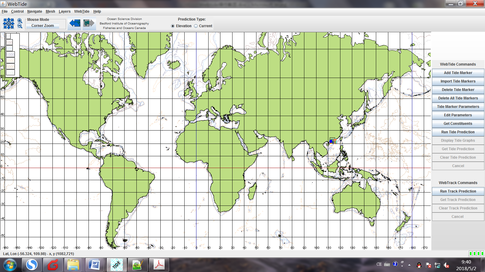

# Gambit网格划分

作者从读博士以来，一直使用Gambit软化生成非结构化网格，需要采用一些小程序将数据生成SELFE/SCHISM的输入网格文件hgrid.gr3

（1）使用ArcGIS10.0软件处理DEM数据，生成计算区域边界，导出维AutoCAD文件；

**提取栅格边界：**3D Analyst Tools-\>Conversion-\>From Raster -\>Raster
Domain

**生成等高线：**Spatial Analyst Tools-\>Surface Analysis-\>Contour

**提取特定等高线**：右击生成的文件，打开属性表，在左上角选择属性选择，电机等高线高程对应的变量(contour)，之后设定"contour"=10m，应用。然后回到等高线界面，右击选择导出所选数据，保存为shp文件。

**河道深泓线：**ArcHydro-\>Channel-\>Profile Line

（2）将边界CAD文件导入Gambit软件，生成三角形网格；

Gambit软件生成网格步骤：需要设置size function, 设置边界类型等

**注意：Gambit的size
function只能应用于tri/tet类型网格，一般适用于机械部件等情况的网格划分。因此，对根据水深设置size
function 的情况应该使用SMS软件。**

（3）将Gambit网格文件保存为Polyflow求解器的neu格式文件，用后处理程序转换为Tecplot格式的网格文件，用于地形插值。

# ACE tools

ACE tools (xmgr5, xmgredit5, and xmvis6) are custom-made for SCHISM
model, and we highly recommend you install them on your local system.
Compared to other visualization tools, ACE tools are highly efficient
and are sufficient for your day-to-day research. However, note that some
new features of SCHISM are not fully supported by ACE, and so
alternative packages (VisIT) should be used. 

The tools can be installed on linux or windows systems.

xmgredit5: a light-weight grid generation and full fledged grid editor.
Very useful for creating input files for SCHISM; （网格生成及编辑）

xmvis6: viz tool for the binary outputs from SCHISM (after combining
from all CPUs). You can viz a horizontal slab, vertical profile at a
point, and transect in animation mode.（可视化工具）

xmgr5: a matlab-like 2D plot tool. （2D作图）

You can find the ACE package in the source code bundle; there is an
install_notes inside.

# SMS软件划分网格（1）

摘录至Todd Jeffrey Wood Master Thesis downloaded from SCHISM Wiki

## 1、大致网格划分步骤

需要软件

使用的软件：SMS10.1 WMS8.3

### 1.1 地形数据处理

DEM数据格式 .flt

不能直接导入SMS10.1,需要先导入[WMS8.3]{.mark},输出为SMS10.1可以导入的数据格式。或者可以直接导入SMS11.0Beta

在[WMS8.3]{.mark}中filter and smooth数据点，提出flat
area数据点和等值线中的zigzags

### 1.2 定义网格区域边界

**创建feature arcs代表0m和2m等值线，使用圆弧圈定海洋区域（任意）。**

使用[WMS8.3]{.mark}中的TOPAZ提取河道path，创建thalweg arcs

### 1.3 创建size function用于网格生成

基于地形高程数据创建size
function，使得深水区域可划分较粗网格，浅水区域要划分较细网格。

### 1.4 使用SMS10.1将数据点转换为非结构网格

### 1.5将地形高程数据插值到网格单元上

### 1.6 扩展网格

将网格扩展至0m等高线，对0m\~1m之间的网格节点赋值高程

### 1.7 定义网格单元的边界类型

Assigned material types to the mesh elements

# 具体的操作

## 2、选择和创建网格区域边界

使用0m等高线代表海岸线(shoreline boundary)

使用1m等高线代表河岸边界（或港湾边界、支流等）(bays boundary)

定义海洋边界(ocean boundary)

### 2.1 由高程点数据生成等高线

使用[WMS8.3]{.mark}软件生成等高线feature arcs，代表用于划分网格的边界。

DEM数据导入WMS后，生成线性等高线代表0m和1m等高线。（WMS8.3-\>display-\>linear
contours），输入需要显示的等高线值(0m and
1m)，然后，将contour转换为feature
arcs(为防止WMS崩溃，需要smooth高程数据---反距离法)

0m和1m等高线转换为feature arcs，分别保存在不同的文件夹。

创建一个coverage（WMS8.3-\>Map Module）保存feature
arcs，方便之后的SMS网格划分。

### 2.2 清除和编辑等高线feature arcs

将map
files导入[SMS]{.mark}软件（如果DEM数据有若干tiles，需要一次处理一个tile数据）

**清理步骤**：自动和手动，剔除不需要的arcs，修改边界，删除和（或）合并圆弧上的点以更精确地代表水体

**自动清理：**

Snaping nodes together:
设置一个阈值(30m)，将arcs上的相邻点在30m以内的合并（网格尺寸为30m）

Clean dangling arcs: automated cleaning tools in SMS-\>remove tangling
arcs command(也要设置阈值30m)

**手动清理**：

-   0m等高线圆弧代表的陆地边界中pit/depression剔除

-   过于狭窄的河道剔除

-   小的岛屿剔除

-   使用hard points保留半岛边界

在将线性等高线转换为特征圆弧时会在所有相交处生成一个节点，这是多余的，需要剔除：选择所有节点，convert
nodes to vertices tool in SMS

剔除河宽小于30m，使用SMS中的measuring tool

保留一些伸入水体中的半岛（可能影响环流），方法：设置hard points, convert
existing vertices to nodes or creating new nodes

### 2.3 合并海岸线

有若干tiles的情况，需要合并海岸线（0m等高线）

需要用航拍图片做地图，辨识海岸线的链接位置

### 2.4 定义模型区域边界

1、选择海洋边界

框定海洋边界区域，海洋水体体积至少是港湾和河道内水体的3倍以上

在SMS软件内实现，创建ocean polygon. Select feature polygon tool in SMS
to select all points in the ocean polygon

海洋边界可以是圆弧，也可以是矩形

2、创建polygons

将map files with feature arcs导入SMS，合并converages。链接所有feature
objects形成封闭圆环

中间可能出现问题。需要将多边形分解为若干子多边形，查找圆弧链接的问题所在。

3、设置多边形的属性

设置多边形的属性用于网格生成，包括：网格生成类型、高程源和该区域的网格单元边界类型。

网格类型：scalar paving density

地形类型：scatter
set(可能不能一次导入所有的高程点，定于有无效高程值的点为-9999）

### 2.5 使用TOPAZ创建河槽内的深泓线

在WMS软件中实现，使用TOPAZ查找河槽的深泓线（通航线），在其附近生成网格，确保有足够密度。

2.5.1 导入高程数据文件到WMS

可以很快导入高程数据到WMS，但这样可能使SMS软件崩溃。

可以到处gdm格式的TIN文件，再导入SMS

2.5.2 在WMS中运行TOPAZ

对每个tile运行TOPAZ，计算thalwegs

将thalweg cells转换为feature arcs: 使用WMS中的DEM contours to Feature
Arcs command.同样要自动和手动清理2.2节中的问题。

创建thalweg arcs后导入SMS，合并这些arcs代表区域边界。

## 3、网格生成

-   创建散点高程数据的size function

-   将0m等高线区域内的map data转换为2D网格

-   高程插值到网格节点上

-   在0m\~1m等高线间创建额外的网格单元

-   对网格单元设置边界类型(material type)

### 3.1 创建散点数据的Size Function

在SMS软件中使用scalar paving
density网格生成功能时，网格单元边长使用一组散点数据（size function or
size data set）来决定这些散点数据附近的网格尺寸。

数据集：（1）高分辨率DEM散点高程数据集；（2）低分辨率的size data set。

Tood创建了2套size
functions用于网格生成计算，考虑了局部水深和需要的最小网格尺寸。（原计划30m的最小网格尺寸可能会产生过多的网格单元数，因此Tood增加最小网格单元边长。）第1套size
data set设置最小单元边长为50m，第2套size data
set设置最小单元边长为100m。创建size function scatter data
sets的步骤如下：

1.  创建散点数据集，设置size function values；

2.  基于地形高程数据选择size function values的分布范围；

3.  在Excel中创建一个函数，在选择的分布范围之间线性插值size function
    > values；

4.  在SMS中的Data Calculator中输入Excel function，将size function
    > values插值到散点中；

5.  光滑size function values

以上，第1步的数据集，采用高分辨率DEM数据的每10个点（其他的剔除），可以导入SMS并能覆盖整个网格区域。合并以上的低分辨率数据点和0m等高线上的数据点以及河道深泓线高程点（可以反映海岸线以及河道的最深部分）。

然后，确定低分辨率散点高程的最大和最小值。以上低分辨率数据集的作用就是，使浅水区域的网格尺度小（网格密），深水区的网格尺度大（网格稀）。

(1)将以上Excel中定义的生成公式，输入到SMS的Data Calculator中，create a
base size function for each scatter point for the two size functions

\(2\) 光滑以上生成的size function
datasets，因为网格单元尺寸突变会使生成的网格质量很差，影响数值稳定性。

Smooth data set using a maximum area change limit of 0.5 and anchoring
the size data set values to the minimum value.

以上生成的数据点可用于scalar paving density 生成网格，进入polygon
properties，选择用于生成网格的size function dataset.

### 3.2 将高程散点转换为非结构化网格

在定义了网格区域边界、创建河道深泓线、设置了多边形属性之后，可以使用高程散点数据生成三角形网格了。

计算区域很大时，一次生成网格困难，需要将多边形网格区域分成若干子区域，分别划分网格。保存为2dm(2D网格)格式文件。

将所有多边形的2D网格导入SMS，选择append，子区域的网格就合并在一块了。

### 3.3 将高程插值到网格节点

此时网格节点上的高程为0.

高分辨率DEM数据要先导入WMS，到处为gdm格式文件，再导入SMS

此步骤出现的问题多是由于SMS内存引起的。

SMS看来并不适合用于大数据的网格插值，此步骤可采用Tecplot完成。

### 3.4 将网格扩展至1m等高线处

清理1m等高线圆弧（方法与0m等高线的一样）

连接1m等高线圆弧与0m等高线圆弧（间距过小的1m等高线圆弧应该清理掉），插入nodes,
完成连接。

完成连接后，创建两者之间的多边形（需要使用SMS11.0），设置属性，划分网格（与3.2节一样）

生成网格，保存为2dm文件（与3.2节一样），网格区域很大时需要分为若干子区域进行网格生成。

### 3.5 设置网格单元的属性

根据水深不同，设置不同的糙率值等。

**注意：SMS软件没有undo按钮！需要不断保存map file**

# SMS网格生成步骤（2）

## 1、生成网格

1、File-Open-CAD file(or XYZ data)

2、左侧边栏中，右击CAD DATA，点击DATA-\> MAP

3、中栏点击Select Feature Arc，下拉菜单中Feature
Objects点击clean，再点击Build Polygons

4、 中栏点击Select Feature Arc，全选线段，右击Redistribute
Vertices，在弹出的对话框中设定网格长度；

5、 右击左侧边栏中map data里的cad，在菜单中type-\>models-\>Generic 2d
models；

6、 点击中栏的select Feature Polygon，双击图形，弹出对话框可预览

7、 Feature Objects\--clean，Feature Objects-\>Map-\>2D Mesh

8、 点击下方工具栏中的mesh
module，点击上方下拉菜单的element中的linear-\>quadratic去除网格中点

## 2、高程插值

9 、点击下方工具栏的Scatter model，打开高程文件，类型选择最后一个xyz文件

10 、点击菜单栏的Scatter，interpolate to mesh，勾选map z

11、点击下方工具栏contour options弹出窗口中，左侧选择2d mesh，在右方2d
mesh的标签栏中勾选contours，在contours标签栏中的contour
method中选择colour fill就可以查看插值结果

## 3、插值完成 ，下面定义边界

12、回到主界面，在下方工具栏里点击mesh module，中栏点击creat
nodstring创立边界

13、站在进口处，面朝水流方向，进口从右向左；接着画出口，也是从右向左；然后画land
boundary，按照逆时针的顺序。

画进出口时，先点击第一点，然后按住shift键点击第二点，回车；

画landboundary时，先点击一点，然后按住ctrl键点击第二点，回车；

14、然后是定义边界，首先要在mesh------define
model里面定义边界类型，一般：1，river；2，ocean；3，island；

然后选中具体的边界，右键，assign
BC,定义边界类型；注意【此处定义边界的顺序要和上面画边界的顺序一致】

15、右击一个边界，renumber

16、保存工程文件和网格文件

17、运行脚本，转换网格文件

# SMS生成网格步骤（3）

1.将CAD中的地形图 →
DXF格式（如果需要加航道、码头岸线等，还需单独加辅助线）→
将CAD中的水深点提取出来（以xyz文件格式）注意：投影坐标和高程系统

2.将DXF文件导入SMS中 → 在MAP中，选择ADCIRC模块（水动力模块）注意：在SMS
8.1中，在MAP中可以直接将DXF文件转化成Scatter points

3.点击Display菜单中的Display options → 将Node属性颜色改成红色 →
通过设置定点Node将工程区两端的端点确定下来 →
开边界的范围也是通过设置Node点 →
将网格间距从工程区向外逐步放大（放大系数可以为1.2～1.5）

4.合并黑点，相邻开边界的attribute属性不能都设为ocean，要间隔设置，陆地和岛屿都设为mainland.

5.选择Feature objects  → clean  → Build polygons  →
{width="0.25833333333333336in"
height="0.20833333333333334in"}→
先全选不生成网格（None），然后对海域单独设置（paving）→ （Map→2D mesh）

6.点击Display菜单中的Display options → mesh quality → mesh → Node →
Locked （检查网格质量，并且可以手动调整）

7.将SMS10.1中生成的.grd文件拖入SMS8.1中（ADCIRC模块）→ Assign BC
→将之前设置海域的mainland属性改回Ocean.

8.点击Nodestrings → 任意选择一个开边界，并且Renumber → File → Save
ADCIRC.

# 模拟步骤

1.  网格划分

Gambit SMS

2.  主程序计算

SELFE4.0 SCHISM5.3.1

3.  后处理

Post-processing Fortran MATLAB

Tecplot VisIT
