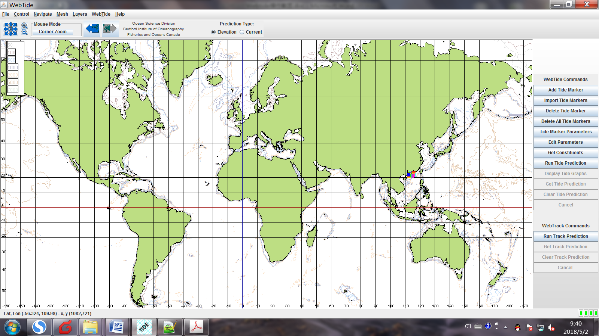

WebTide Version 0.7.1

Ocean Science Division

Bedford Institute of Oceanography

Fisheries and Oceans Canada

图1 Webtide的操作界面

第1步：将bound.ll
(潮汐边界上网格节点的经纬度坐标，注意：一定不能落到陆地上了！否则，WebTide提取时会出错！)图2中显示了珠江口的潮汐边界（共74个节点）

图2 广东近海海域潮汐数据下载

注意：广东沿海的计算开边界，最后一个点位于陆地上，提取webtide时错误。

第2步：点击Edit Parameters

图3中，可以编辑提取潮汐调和参数的起始和终止时间段、时间步长、总的时间步长数和提取的潮汐组分(M2,
K1, N2, ...)

图3 Edit Parameters窗口截图

第3步：点击Get Constitutes

会跳出来包含各节点上的潮汐组分的调和常数，可保存到文件webtide.dat，用于后面的处理。

Run Tide Prediction ?
