M. De Dominicis, N. Pinardi, G. Zodiatis, and R. Lardner. 2013.
MEDSLIK-II, a Lagrangian marine surface oil spill model for short-term
forecasting-Part 1: Theory. Geosciences Model Development, 6, 1851-1869.

# 1、前言

近年来，溢油Lagrangian数学模型朝着可以模拟复杂的相关溢油过程的发现发展：由2D点源的粒子跟踪模型到复杂的油膜多边形表征和3D对流扩散模型(Wang
et al., 2008; Wang and Shen,
2010)。目前，Lagrangian模型尚未有模拟3D溢油物理化学转换过程的案例。

已有很多复杂的Lagrangian溢油模型，诸如：COZOIL, SINTEF OSCAR, GULFSPILL,
ADIOS, MOTHY, MOHID, POSEIDON OSM, OD3D, SMHI, MEDSLIK, GNOME,
OILTRANS。这些模型的计算结果给出油膜粒子的位置和溢油总体积的时间变化过程。并且，Lagrangian方程与Eulerian对流-扩散-反应方程缺少关联，仅有较少模型给出油浓度的计算结果(Wang
and Shen, 2010)。

MEDSLIK_II模型的**创新点**：**(1)
如何由油粒子的对流-扩散和转化过程重构油浓度，目前的溢油模型尚未考虑这个问题；(2)
描述不同类型的溢油状态变量，例如：油膜(oil slick)、油粒子(oil
particles)和结构变量(structural variables)；(3)
应用可获取的海洋流场数据修正溢油模型。**

由Eulerian对流-扩散-转化方程模式建立Lagrangian溢油模型的概念框架。需要注意重构溢油浓度的数值计算网格，此处成为示踪物网格(tracer
grid)。Part2将论证溢油浓度场对网格分辨率的敏感性。为获取溢油浓度场（此处称为结构状态变量），需要定义Lagrangian表征对流-扩散过程的粒子状态变量和转化过程的油膜变量。换言之，MEDSLIK_II模型的Lagrangian方程不是考虑单个粒子的转化，而是对整个油膜体积状态变量(bulk
oil slick volume state
variables)考虑，这一做法已在MEDSLIK模型中实现(Zodiatis et al.,
2008)，**但尚未论证不同数值格式和参数假设对数值模拟结果的影响**。

[海面流场的构建]{.mark}：高频率的径流、波浪引起的Stokes漂移、风应力引起的Ekman流（流速校正和不确定性）。

# 2、控制方程和状态变量

溢油浓度*C*(*x,y,z,t*)的Eulerian型控制方程：

 (1)

Where  is the local time-rate-change operator,
***U*** is the sea current mean filed with components (***U,V,W***);
***K*** is the diffusivity tensor which parameterizes the turbulent
effects, and  are the ***M*** transformation
rates that modify the tracer concentration by means of physical and
chemical transformation processes.

[缺少式(1)的溢油浓度场与Lagrangian粒子模型之间的关联论证。]{.mark}

Lagrangian框架下的溢油浓度演变是基于一些基本假设：(1)
油粒子不影响水动力过程。这个假设在海面上明显存在局限性，漂浮的油粒子改变了空气-海水界面条件和水面风应力。(2)
油粒子位移无限小，无惯性和油粒子之间无相互作用。经过无限小位移的油粒子体积因为物理化学过程而被改变，此改变是作用于整个油膜而不是单个油粒子属性。

应用以上假设于式(1)，可以将示踪物方程分裂为2个分量方程式：

 (2)

 (3)

式中，*C~1~*是仅由风化过程影响的标量浓度；*C*的时空变化是由*C~1~*的对流扩散方程来描述。

式(2)代表作用于整个油膜上的转化过程，定义油膜状态变量(oil slick)。

式(3)应用Lagrangian方法求解，将油膜离散为粒子状态变量(particles)，部分粒子状态变量来至于油膜状态变量。

通过收集粒子状态变量及其属性，计算得到溢油浓度。

MEDSLIK_II模型将溢油浓度*C*分为若干组结构状态变量(见图1a)：

-   水面处的浓度，*C~s~*

-   水面下层的浓度，*C~D~*

-   吸附于海岸线的浓度，*C~C~*

-   下沉至海床的浓度，*C~B~*

{width="2.5256944444444445in"
height="3.647222222222222in"}

图1(a) 溢油浓度分类（[结构状态变量]{.mark}）

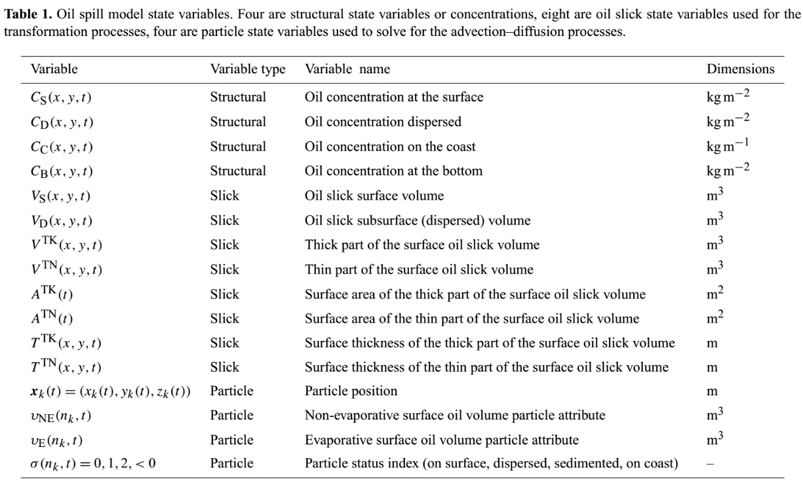{width="5.570833333333334in"
height="3.3715277777777777in"}

水面处油膜假设为是连续物质层，**表面浓度*C~s~***【kg/m^2^】定义为：

 (4)

式中，*m*为溢油重量，*A*为单位面积。

考虑溢油的体积和密度，可写作：

 (5)

**溢油密度*ρ*计算：**

溢油的密度与油的类型有关，根据美国石油协会(API)重力指标(API
gravity)分类，相对水的密度，将石油分为重油和轻油。首先，将*API*密度转换为油的比重：

 (A1)

然后，将比重转换为溢油密度：

 (A2)

式中，为海水的密度，取1026kg/m^3^。

MEDSLIK模型中不考虑溢油密度随时间的变化，也就是密度计算中不考虑温度变化和乳化过程的影响。由此可见，[MEDSLIK模型仅对短期的溢油过程预测有效]{.mark}，缺少考虑温度突变的影响。

在水面下层处，溢油由不同大小的油滴组成，油滴可重新与水面的油膜聚合，亦可沉降至海底。水面下层或扩散(dispersed)的溢油浓度*C~D~*可写作所有油滴组成扩散状溢油的体积*V~D~*：

 (6)

式(2)的风化过程应用于*C~S~*和*C~D~*：

 (7, 8)

*V~S~*和*V~D~*受风化过程作用而改变，风化过程计算依据Mackay et al.,
1980的溢油归宿算法。

当水面油膜到达海岸线时，海岸线由参考分段长度*L~C~*定义，海岸线可以吸附的溢油浓度*C~C~*定义为：

 (9)

式中，*V~C~*为吸附的溢油体积。

海岸线吸附的溢油体积*V~C~*由油粒子状态变量计算，没有计算*V~C~*的理论公式(Prognostic
equation)。

沉降到海底的溢油简化为水体中扩散(dispersed)溢油的汇(sink)，由水面下层(subsurface)中扩散的油粒子计算得到。MEDSLIK_II模型不计算底部溢油浓度*C~B~*，仅由到达海底的油粒子个数来代表。

式（7）和式（8）中的表面油膜体积分为薄油膜体积*V^TN^*和厚油膜体积*V^TK^*，做这个假设是为了利用Mackay
et al., 1980的油膜风化算法。水面油膜体积写作：

 (10)

其中，

 (11)

 (12)

式中，*V^TN^*和*V^TK^*分别为薄油膜体积和厚油膜体积；*A^TN^*和*A^TK^*分别为薄油膜面积和厚油膜面积；*T^TN^*和*T^TK^*分别为薄油膜厚度和厚油膜厚度。这些变量为油膜状态变量（表1）。

为求解式（3）的对流扩散方程（Eulerian），计算*C~S~*,
*C~D~*和*C~C~*，需要定义粒子状态变量。水面油膜体积*V~S~*分裂为*N*个包含粒子体积*(n~k~,t)*，粒子状态标记和粒子位置*x~k~*(*n~k~,t*)等属性的粒子组成。

 (13)

式中，*n~k~*为粒子编号(particle identification number)。

（1）粒子位置*x~k~*(*n~k~,t*)由Langevin方程描述。

（2）根据Mackay风化算法，粒子体积状态变量分为"蒸发"和"非蒸发"两个部分的粒子体积属性：

 (14)

油粒子体积由油膜体积状态变量的时间变化率经验公式计算更新。

（3）粒子状态标记标识4种粒子类型，对应于4种结构状态变量：

-   水面粒子，=0

-   水面下层粒子，=1

-   沉降粒子，=2

-   海岸线吸附粒子，=-*L~i~*，其中*L~i~*代表岸线段标识(coastline
    segment index)。

为求解对流扩散和转化方程（式1），需要定义数值计算网格，在网格上计数粒子个数和溢油浓度。油膜和粒子状态变量之间的关系没有解析计算式。

# 3、计算网格和数值方法

MEDSLIK模型的计算网格为结构网格（见图1b），网格间距，网格单元面积***A***=。（非结构化网格就是三角形单元的面积了。）那么，[结构状态变量和油膜状态变量的空间离散方程为：]{.mark}

 (15, 16)

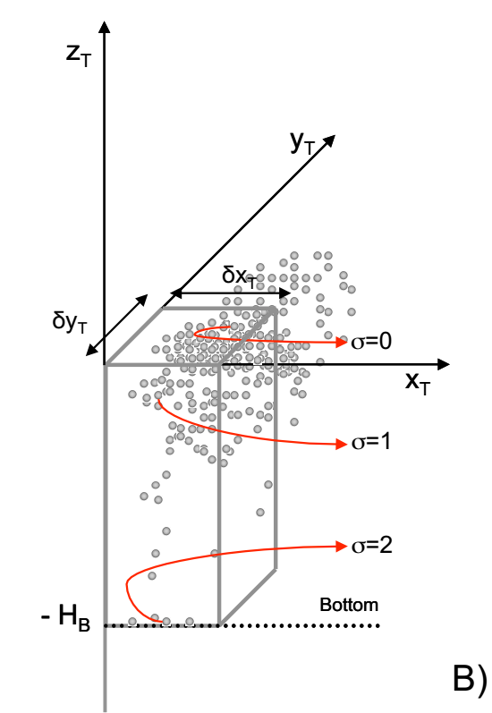{width="2.404166666666667in" height="3.50625in"}

图1(b)
一个网格单元内的风化过程和粒子状态标记()，*H~B~*为单元水深

海岸线由一组段长为连接而成的链条描述，岸线段标识*L~i~*（见图1c）。岸线段长从几米到几百米变化。式(9)的离散形式为：

 (17)

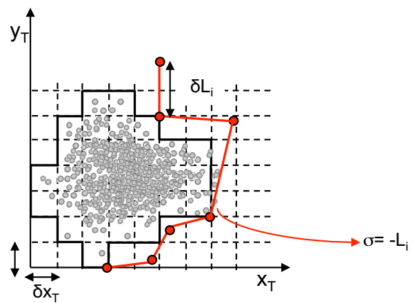{width="2.9875in" height="2.1791666666666667in"}

图1(c) 描述网格内风化过程和海岸线链条的2D俯视图

根据计算网格单元内的粒子状态变量，可以给出结构状态变量(*C*)和粒子状态变量()间的关系式，例如：可以计算水面、水面下层和海岸线（滩）处的溢油浓度。

一个网格单元内的水面、水面下层的粒子个数(*I~S~*, *I~D~*)定义为：

 (18)

水面(surface)和水面下层(subsurface)的溢油浓度(*C~S~*, *C~D~*)可定义为：

 (19)

[（此处表明单元粒子个数越多，越接近Euler浓度场的概念。）]{.mark}

吸附于海岸线粒子的油浓度*C~C~*(*L~i~*,*t*)可以使用*I~C~*(*L~i~*,*t*)计算：

 (20)

吸附于海岸线段的溢油浓度为：

 (21)

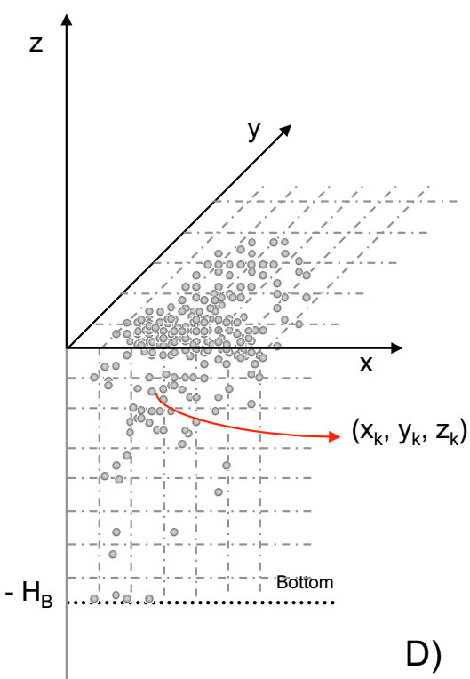{width="2.25625in" height="3.25625in"}

图1(d) 计算区域内溢油对流扩散过程(3D图)

MEDSLIK模型的计算流程如下：

首先，设定水面处粒子变量和油膜变量的初始条件；

然后，计算油膜风化过程（蒸发、扩散和扩展），风化过程描述油膜体积、海面上10m处的风速和海面温度(*SST*)之间的经验关系；

然后，更新计算粒子体积*(n~k~,t)；*

然后，更新计算粒子位置*x~k~*(*n~k~,t*)和粒子状态指标；

最后，计算溢油浓度(Eq.(19)和Eq.(21)。

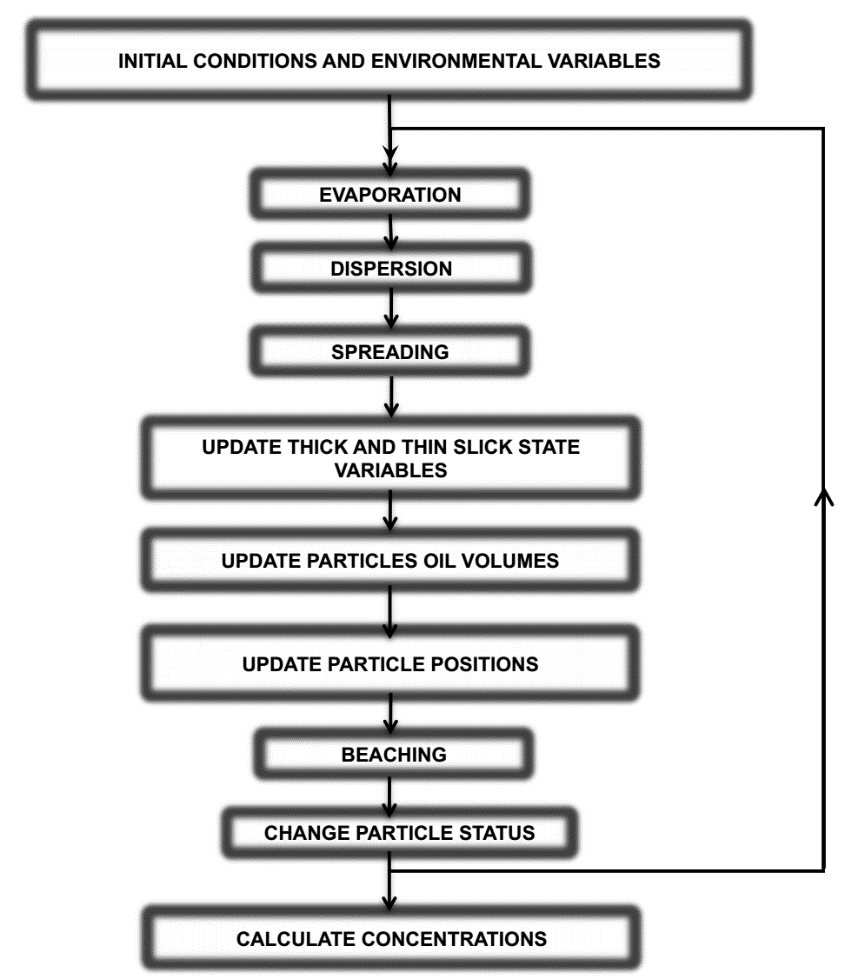{width="3.845833333333333in"
height="4.442361111111111in"}

图2 MEDSLIK模型的计算流程图

油膜状态变量与油膜中心位置有关，油膜中心位置在每个对流扩散计算时间步后更新。油膜中心位置
定义为：

  (22)

油膜中心位置用于计算油膜状态变量。考虑到海面温度的空间变化，该方法将带来计算误差，对风化过程产生影响。例如Gulf
Stream 和 Kuroshio的SST空间分布差异很大（每10km能悬殊若干℃）。

## 3.1初始条件

水面溢油可能是瞬间的，也可能是持续性的。

**持续溢油**：一次溢油可能持续若干小时甚至若干个月(Liu et al.,
2011)，可能早期溢油体积已经随着初始泄漏发生了转化，而后期又有新的溢油释放。为了模拟持续情况下的溢油风化过程，模型将总溢油分成若干子溢油过程(sub-spills),
*N~S~*，由在时间间隔*T~C~*内释放的溢油组成。随着每次子溢油从初始溢油源移开(move
away)，总溢油过程称为子溢油过程组成的事件链(chain)。

**瞬间溢油**：在模拟开始时在水面释放溢油，总溢油体积。

对于**持续溢油**的情况，每*T~C~*的子溢油体积定义如下：

 (23)

式中，*R~C~*为溢油速率(m^3^/s)，*T~C~*为每次子溢油过程的时间间隔。

子溢油过程的发生次数等于：

 (24)

式中，*D~C~*为每次子溢油释放的持续时间(s)。

在一次**瞬时溢油**释放过程中，在模拟开始时释放*N*个油粒子；而对于一次**持续溢油**过程，每隔*T~C~*释放*N~C~*个油粒子：

 (25)

每个油粒子初始体积定义为：

 (26)

对于瞬时溢油释放油粒子的情况，*N~S~*=1。

对于**瞬时和持续溢油**情况，其初始蒸发和非蒸发的溢油体积分别定义为：

 (27)

 (28)

式中，为非蒸发溢油部分的百分比，与溢油类型有关。

薄油膜和厚油膜的初始面积是使用相对厚度和两种油膜面积比*F*计算得到。使用式(10),
(11)和(12)，可以得到：

 (29)

 (30)

和*F*由参数输入定义，标准取值参考表2.
*F*的取值范围：1\~1000；。

的取值范围：1×10^-4^\~0.02m； 
的取值范围：1×10^-6^\~1×10^-5^m。点源溢油推荐高的和取值和低的*F*取值。对于最初扩展的油膜（如卫星观测或航拍），建议低油膜厚度和高*F*值。对后种情况，油膜初始面积可以由卫星图片或其他信息源提取的厚度值来设定。

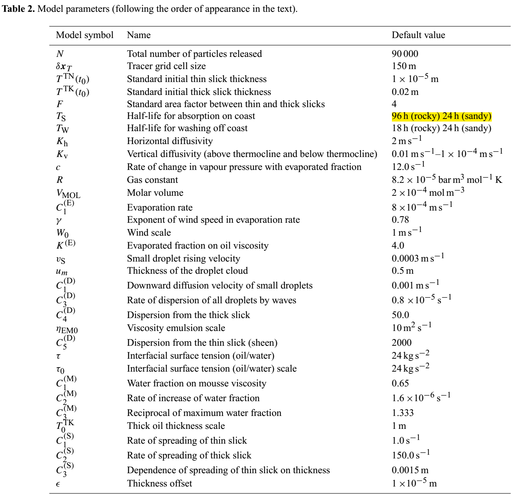{width="5.7756944444444445in"
height="5.570833333333334in"}

# 4、油膜状态变量的时间变化率

应用式(10)，溢油体积的时间变化率可写作：

 (31)

水面油膜体积变化是因为转化过程中的3个主要过程，包括：蒸发、扩散和扩展，如图3。水面处油膜的初始体积变化的第一个过程就是蒸发。一般来说，较为轻质部分的油会先消失，然后剩余部分的油会扩散至水面以下。另外，溢油后最初的几小时，水面溢油会在重力作用下向四周机械性地扩展。对于连续溢油的情况，各子溢油过程中的风化过程相互独立。

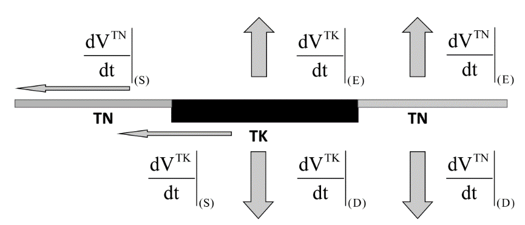{width="3.936111111111111in"
height="1.6923611111111112in"}

图3
Mackay风化过程算法（*TK*代表厚油膜，*TN*代表薄油膜；*V^TK^*和*V^TN^*分别代表水面的厚油膜和薄油膜的体积，下标的*E*,
*D*, *S*分别代表蒸发、扩散和扩展）Evaporation, Diffusion, Spreading

单独考虑厚油膜和薄油膜的风化过程，其控制方程分别为：

 (32)

 (33)

式中，下标分别表示蒸发(*E*),
扩散(*D*)，扩展(*S*)，仅在油膜中心处定义油膜状态变量。

油膜状态变量的时间变化率由修正的Mackay溢油归宿（包括蒸发、扩散和扩展）算法计算(Mackay
et al., 1980)，[见4.1节。]{.mark}

根据Mackay的假设，*T^TN^*不变，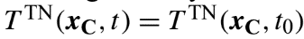{width="1.5319444444444446in"
height="0.1986111111111111in"}。因此，*A^TN^*等于：

 (34)

式中，*V^TN^*使用式(33)更新计算。

厚油膜的体积变化计算如下：

 (35)

厚油膜面积*A^TK^*仅受油膜扩展(spreading)作用而变化：

 (36)

式中，由于扩展引起的厚油膜面积时间变化率由式(B20)计算。*V^TK^*使用式(32)计算更新，厚油膜的厚度(*T^TK^*)的时间变化率计算如下（式35除以式36？）：

 (37)

## [4.1 风化过程]{.mark}

B1 蒸发(evaporation)：

蒸发过程改变厚油膜和薄油膜的体积，是溢油释放至水面后最初的转化过程。由蒸发引起的溢油体积减小使用Mackay
et al.
(1980)公式计算。因为假设是在油膜中心位置计算转化过程，由蒸发引起的厚油膜体积*V^TK^*减小的时间变化率写作：

  (B1)

式中， 
分别为厚油膜和薄油膜的初始体积；为蒸发掉的厚油膜部分的时间变化率。对于厚油膜，蒸发掉部分的时间变化率为：

 (B2)

 (B3)

式中，*P~oil~*为油的蒸汽压力(bar)，*P~0~*为蒸汽压力初始值（与溢油类型有关），*c*为描述已蒸发掉部分溢油的蒸汽压力衰减率的常数(s^-1^)，*A^TK^*(*t*)为厚油膜的面积，*K~M~*为蒸发风速(m/s)，*T*为温度(*K*)，*R*为气体常数(bar
m^3^ mol^-1^ K)，*V~MOL~*为油的摩尔体积(mol/m^3^)。

假设*K~M~*为：

 (B4)

式中，*W*/*W~0~*为无量纲的10m风速模数(*W~0~*=1m/s？)，为经验常数，为蒸发速率(m/s)。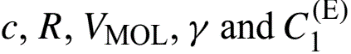{width="1.5958333333333334in"
height="0.24375in"}的取值见表2。

薄油膜体积的时间变化率为：

 (B5)

式中，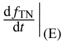{width="0.48055555555555557in"
height="0.3138888888888889in"}为薄油膜蒸发掉的部分的时间变化率。

假设薄油膜蒸发掉的部分立即消失，但是经过扩展过程，蒸发掉的薄油膜可以由四周尚未蒸发掉的厚油膜得到补充。认为薄油膜的含油量在由厚油膜补充油量前后是相等的，可以得到：

 (B6)

式中，*f~MAX~*为蒸发掉的部分的初始比例，表示从薄油膜可以蒸发掉的最大比值。蒸发导致油的粘性增大，可以由下式计算：

 (B7)

式中，为初始粘性(m^2^/s)，为确定蒸发后粘性增大的经验常数（见表2）。

B2扩散(diffusion)：

当溢油以一定体积量释放到水面后将发生扩散过程，由Mackay et al.,
(1979)方程来描述。波浪运动将溢油掺混入水体，形成油膜下层有油滴组成的云团。油滴有大油滴和小油滴，大油滴快速上浮，与水面油膜聚合，小油滴上浮的更慢，可能由于浸没水体时间较长而扩散入下层水体中。可认为小油滴从水面溢油中扣除，即永久扩散(disperse)入水体。判断油滴是大油滴还是小油滴的标准是：小油滴在浮力作用下的上浮速度(rising
velocity)与扩散速度(diffusive velocity)相当，而大油滴的上浮速度更大。

由于水体中小油滴引起的厚油膜体积的时间变化率计算式为：

 (B8)

式中，为小油滴向下方的扩散速度(m/s)，为小油滴的上浮速度，见表2；*c~s~*为小油滴所占的比例，*X~S~*为厚油膜下方的小油滴体积，等于：

 (B9)

式中，*u~m~*为油滴云团的垂向厚度(m)。见表2。

 (B10)

式中，为波浪运动引起的所有油滴扩散速率的经验参数，见表2；*W*/*W*~0~为油膜中心位置的无量纲风速，*S~TK~*为厚油膜下方扩散溢油中小油滴所占比例，等于：

 (B11)

式中，为小于临界尺寸的油滴所占比例，为水油相界面处的表面张力(kg/s^2^)，为乳化溢油的粘度(m^2^/s)。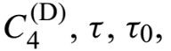{width="0.8715277777777778in"
height="0.2625in"}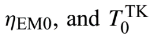{width="1.1472222222222221in"
height="0.27569444444444446in"}的标准取值见表2。

薄油膜扩散(dispersion)仅考虑小油滴，假设这部分的小油滴均从水面溢油中以如下速率扣除：

  (B12)

式中，为控制薄油膜扩散(dispersion)的经验参数，*W*/*W*~0~为油膜中心位置的无量纲风速，*S~TN~*为薄油膜下方扩散溢油中小油滴所占比例，等于：

 (B13)

B3乳化过程(emulsification)：

乳化过程是水掺混到油膜中的过程。乳化过程的主要作用是形成粘度为的水油混合物(mousse)：

 (B14)

式中，由式B7计算，*f^W^*为水在混合物(mousse)中的比例，为反映水分影响水油混合物粘度的系数（见表2）。

假设乳化过程持续发生至达到最大值（对应于漂浮焦油球---
floating tar balls的混合物\--mousse）。*f^W^*的时间变化率为(Mackay et
al., 1979)：

  (B15)

式中，*W*/*W*~0~为油膜中心位置的无量纲风速，为控制水分吸收于混合物的速率系数，为控制混合物中最大水分比例的参数（见表2）。

根据式(B14)和式(B15)，乳化过程影响水油混合物粘度，反过来也影响扩散(dispersion)过程（式B11）。

B4扩展(spreading)：机械性扩展

扩展过程包括2部分：第一部分是由于厚油膜变化薄油膜增加的面积，第二部分是重力-粘性力阶段的Fay扩展过程(Al-Rabeth
et al., 2000)。在扩散过程中薄油膜和厚油膜的体积变化速率分别为：

  (B16)

 (B17)

式中，*FG*为Fay重力扩展系数。

Mackay et al. (1980) 定义薄油膜增加的面积近似为：

 (B18)

式中，为薄油膜扩展速率系数，为与薄油膜扩展厚度变化相关的系数，为经验参数。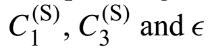{width="0.9618055555555556in"
height="0.22430555555555556in"}的标准取值见表2。

厚油膜的Fay重力扩展系数为：

 (B19)

式中，为厚油膜扩展速率系数(s^-1^)。见表2。

扩展后厚油膜面积的时间变化率为：

  (B20)

在溢油发生的48h内或厚油膜厚度*T^TK^*（式35计算）变为薄油膜厚度*T^TN^*，认为机械性扩展阶段停止，此后终止所有扩展过程，仅模拟薄油膜的物理化学生物转化过程。

# 5、油粒子体积状态变量的时间变化率

式(14)定义的油粒子体积将在作用于油膜变量的转化过程后发生变化。对所有的粒子状态标记，蒸发的油粒子体积变化采用下面的经验关系式计算：

 (38)

式中，*f^(E)^*为蒸发掉的溢油部分的百分比，定义为：

 (39)

式中， 
分别为从厚油膜和薄油膜蒸发掉的体积，使用式(B1)和式(B5)计算。

对于"表层"(surface)和"弥散"(dispersed)的粒子（=0和=1），非蒸发部分的溢油不变，而吸附于海岸线的非蒸发溢油部分需要修正，因为某些海岸线会吸附溢油，例如溢油渗入沙子或岩石海岸形成吸附层。对于"吸附"的油粒子，非蒸发部分的油粒子部分减小至：

 (40)

式中，为油粒子从水面油膜状态变为岸线吸附状态的时刻(vice
versa)；为渗透或永久吸附于海岸的其他方式的[半生命周期(half-life)]{.mark}，半生命周期是油粒子着陆某海岸线后，描述海岸线对油粒子"吸附性"(absorbency)和"释放率"(entrainment
rate)的参数(Shen et al.,
1987)。半生命周期与海岸类型有关，比如沙质海滩或岩石海岸线，取值见表2.

# 6、油粒子位置的时间变化

粒子移动的Langevin方程，同SCHISM的溢油模型。

MEDSLIK模型计算中使用下载数据和参数化公式形成驱动流场，包括：考虑Ekman效应的风生流场和Stokes漂移速度的波浪流场。

（1）Ekman效应的风生流场（SCHISM模型的PTM中也考虑了）

海面处的Ekman流场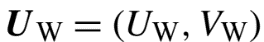{width="1.198611111111111in"
height="0.19236111111111112in"}可使用风速和风与洋流之间夹角的函数参数化计算：

 (47)

式中，*W~x~*和*W~y~*分别为10m处风速的zonal和meridional分量；和为与漂移因子和漂移角度有关的参数，最佳取值分别为3%和0°\~25°

（2）波浪流场

MEDSLIK_II模型使用一个Stokes漂移的解析公式。[下一步的研究需要使用波浪模型来考虑Stokes漂移，如WWM_III模型。]{.mark}

（3）随机的紊动扩散

生成随机数和紊动扩散系数。海洋水平紊动扩散系数(diffusivity)认为是各向同性，取值1\~100m^2^/s，垂向紊动扩散系数在混合层（30m）以上为0.01m^2^/s，以下是0.0001m2/s（见表2）。水下1000m以下为分子粘性(10^-6^m^2^/s)。[SCHISM模型根据紊动封闭方程或GOTM模型计算并输出垂向紊动扩散系数(vdiff.63)。]{.mark}

# 7、数值方法

## 7.1 空间插值

MEDSLIK_II模型是使用网格化的再分析数据（风、浪、流），因此涉及到网格数据插值(numerical
grid)到溢油模型网格(tracer
grid)。[SCHIM溢油模型使用水动力模型的计算结果，不需要不同分辨率网格之间的插值。]{.mark}

## 7.2 时间积分

Lagrangian粒子位置更新，为Lagrangian计算时间步，一般取1800s。

 (58)

 (59)

式中，  分别由式(30)和式(31)计算得到。

模型包括快速过程（转化过程）和慢速过程（对流扩散过程）。因此，风化计算时间步长取值比Lagrangian计算时间步要小：
。

## 7.3 粒子状态更新

一个计算时间步()后，更新油粒子体积和粒子状态标记。该运动步后，如果下面的概率函数变得大于某一随机数*r*=\[0,1\],
水面油粒子将成为弥散(dispersed)状态的油粒子：

 (60)

也就是说：

 (61)

此处，  定义为：

 (62)

式中，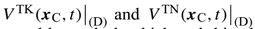{width="2.3270833333333334in"
height="0.23055555555555557in"}分别为厚油膜和薄厚膜下层的弥散油粒子的体积，使用式(B8)和式(B12)计算。

通过检查油粒子(parcel)是相交于岸线段*L~i~*，判断油粒子是否吸附于海岸线，是否要改变的油粒子状态。如果油粒子穿过海岸线，油粒子将移动到相交点处。粒子状态将由"水面"(on
surface)变为"海岸吸附"(beached)：

 (63)

在海岸线搁浅的油粒子未必永久吸附，假设在若干时间步后，以一定的概率重新冲刷入水体(Shen
et al., 1987; Al-Rabeh et al., 2000)。冲刷返回水体的概率为：

 (64)

式中，为冲刷返回水体前的岸线滞留溢油的半生命周期。

根据岸线段类型，将赋值给每段岸线，参考取值见表2。每计算时间步内，为每个"滞留"(beached)粒子生成一个随机数*r*，如果满足下列条件，则油粒子返回水体（粒子状态又变回"水面"）：

 (65)

当一个油粒子冲刷返回水体，需要从岸线永久吸附的溢油部分（式40）扣除，油粒子的新位置使用式(46)计算。永久吸附于海滩的粒子比例是不断变化的。油粒子不会因为永久吸附于海滩而总数目减少，仅减少部分粒子数。实际的粒子总数保持不变。

沉降至海底的粒子部分需要从粒子总数目中扣除。但是，目前模型中没有考虑此过程的参数化方案。认为当粒子距离海底20cm以内时，需要从水体粒子中扣除。因此，粒子状态从"扩散"(dispersed)变为"沉降"(sedimented)可写作：

 (66)

式中，为粒子位置以下的底部水深。

## 7.4 油粒子跟踪计算网格(oil tracer grid)和粒子数目

粒子跟踪计算网格分辨率()和粒子总数(*N*)是复演油浓度时空变化的关键计算参数。（[对SCHISM模型模拟有启示。]{.mark}）

MEDSLIK模拟的参数设置：

-   对流计算网格尺寸*L~A~*=*U*\**dt*\~180m (*U*\~0.1m/s, *dt*=1800s)

-   扩散计算网格尺寸（紊动扩散系数*K*=2m^2^/s^2^）

[粒子轨迹跟踪计算网格尺寸：]{.mark}

还需要评估需要的粒子数目和最小的计算网格分辨率。假设在一个网格单元内仅有一个粒子，并且没有蒸发和岸线滞留，使用式(26)，式(19)初始时刻在水面处的溢油浓度可写作：

 (69)

确定溢油浓度的最大值和最小值，可以使用式(69)评估[需要的最大和最小粒子数目]{.mark}，因此：

 (70)

式中，瞬时溢油情况下*N~S~*=1

假设知道最低的油浓度值，式(7)可用来评估给定溢油方案和溢油计算网格分辨率条件下的粒子数目评估。Part
2论文中就评估了[计算网格分辨率和粒子数目对浓度计算结果的影响]{.mark}(sensitivity)。

# 8、结论

[MEDSLIK模型使用Mackay et al.
(1980)转化算法模拟溢油。下一步：更新转化计算式，考察插值算法和环境条件数据分辨率对转化过程和厚油膜与薄油膜比例的影响。]{.mark}

[MEDSLIK模型尚未考虑3D的物理-化学转化过程。需要增加水体中的溢油转化过程(dissolution)。]{.mark}

M. De Dominicis, N. Pinardi, G. Zodiatis, R. Archetti. 2013. MEDSLIK-II,
a Lagrangian marine surface oil spill model for short-term
forecasting-part2: Numerical simulations and validations. Geosciences
Model Development, 6:1871-1888.

使用卫星和浮标数据验证MEDSLIK计算结果。Lagrangian粒子轨迹跟踪计算精度依赖于Euler流场数据精度，需要使用高分辨率网格和时间(hourly)数据，近岸区域需要考虑Stokes漂移。数值试验表明：构建Euler网格溢油浓度需要约100m的网格分辨率和至少10^5^个粒子。了解溢油的类型和油膜厚度对模拟结果影响也很大。假设可接受的轨迹跟踪计算精度是Euler水平网格分辨率的3倍，MEDSLIK模型可较为准确模拟1\~2.5天的溢油漂移（与洋流环境有关），也就是说每天要初始化模型。

[模型评价：2种方法]{.mark}

（1）浮标漂移轨迹和模型预测轨迹之间的距离差为偏移距离(Al-Rabeth et al.,
2000). A skill score, based on separation distance normalized by the
trajectory length, has been recently proposed by Liu and Weisberg
(2011). 偏移距离的RMSE (root mean square error)。This new metric has
already been used by Röhrs et al. (2012) and Ivichev et al. (2012) to
evaluate their model performances.

（2）Oil spill models' forecasting accuracy can be also evaluated by
comparing the model results to remote sensing observations (Carracedo et
al., 2006; Coppini et al., 2011; Berry et al., 2012; Mariano et al.,
2011; Liu et al., 2011c), although it is difficult to have oil slick
time series for long periods after the first observation, due to the
long revisit time for satellites.

[基于3组数值试验检验油膜模拟对模型假设的敏感性，使用浮标和卫星数据验证模型：]{.mark}

（1）单个粒子漂移轨迹，检验Eulerian洋流数据的时空精度对溢油模型的影响；

（2）油膜模拟的敏感性（对溢油属性输入：溢油类型、油膜厚度和溢油时间）：使用卫星观测初始化模型；

（3）粒子个数和标量网格分辨率对溢油浓度计算的影响。

[气象驱动数据(atmospheric forcing data)：]{.mark}

the European Centre for Medium-Range Weather Forecasts (ECMWF), with
0.25^o^ space, and 6 h temporal resolution.

[海洋流速数据：]{.mark}

MFS: the Mediterranean Forecasting System (MFS) at 6.5 km horizontal
resolution and 72 vertical levels

AFS is one of the nested models with a horizontal grid resolution of
1/45^o^ (approximately 2.2 km) and 31 vertical sigma levels, and it also
considers tidal motion (Guarnieri et al., 2013).

IRENOM has been implemented with 3 km horizontal resolution, starting
from approximately 6.5 km resolution MFS fields, and 40 vertical sigma
layers.

## 2.4 卫星图像获取油膜初始值

定义油膜初始条件的数据包括：释放到海面上的溢油体积、地理坐标、时间、溢油类型、油膜覆盖面积和厚度、从初始时刻开始进入海洋的油膜年龄(age)

大部分溢油信息可以从Synthetic aperture radar (SAR) and MODIS optical
images获取，油膜覆盖面积由油膜等值线坐标提取(Trivero et al., 2001;
Nirchio et al., 2007,
2010).因此，初始时刻t~0~的油膜面积为厚油膜和薄油膜的总和：

因此，初始溢油体积：

 (12)

面积比*F*和厚度(*T^TK^*)未知，必须假设，取表2中的标准取值。*T^TN^*在1\~10μm之间变化。在油膜等值线内的*N*个Lagrangian粒子的初始位置x~k~(t~0~)可以使用以下方法确定（[重构真实的油膜形状]{.mark}）：

由卫星图片提供的油膜等值线是由一系列点(*X~i~*,
*Y~i~*)构成的多边形链条，*i*为油膜多边形边的编号。MEDSLIK_II模型创建一个包含(circumscribe)油膜多边形等值线的盒子(box)，生成随机粒子坐标(*x~k~*(*t~0~*))，粒子位于盒子内，然后检查各粒子*x~k~*(*t~0~*)是否位于油膜多边形等值线内。该方法计算从点*x~k~*(*t~0~*)处发出垂直射线穿过油膜多边形等值线的交点个数，[如果是偶数，那么*x~k~*(*t~0~*)是在多边形外部，如果是奇数，那么*x~k~*(*t~0~*)是在多边形内部。]{.mark}

上述检查算法对有所多边形边循环进行，检验如下条件：

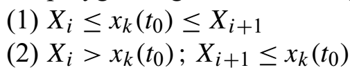{width="2.8652777777777776in"
height="0.5194444444444445in"}

如果上述条件都不满足，那么不存在相交的情况。如果有一个条件满足，模型将判断是否存在一个从*x~k~*(*t~0~*)发出垂直射线与多边形的上方交点(upward
crossing)：

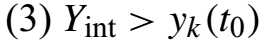{width="1.5194444444444444in"
height="0.24375in"}

式中，*Y~int~*为实际交点的*y*坐标：

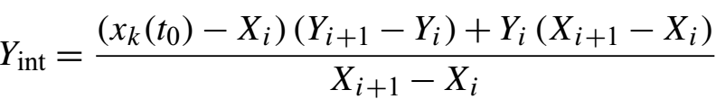{width="3.9291666666666667in"
height="0.5451388888888888in"}

[如果满足第3个条件，则存在一个有效交点。如果交点个数为奇数，则点*x~k~*(*t~0~*)位于多边形内部。]{.mark}重复以上计算，直到位于多边形内部的粒子数等于*N*。

MEDSLIK模型可以在卫星图像油膜区域内，初始化油膜和颗粒状态变量，包括：厚薄油膜厚度(*V^TK^*(*t~0~*)和*V^TN^*(*t~0~*))和油粒子体积((*n~k~,t*))。为了定义以上变量，需要假设溢油的年龄(age)。油粒子漂移转化计算前，有一个仅有风化过程的计算，计算时间等于假设的溢油年龄，见图1，此阶段油膜不改变初始位置，仅更新计算油膜和粒子状态变量（式32和式33---Part1），当达到溢油被观测的时刻开始做漂移转化模拟，该模拟起始时间等于卫星观测时间减去假设的油膜年龄。

{width="4.99375in"
height="2.4805555555555556in"}

图1 溢油演变阶段的初始化和预测模拟

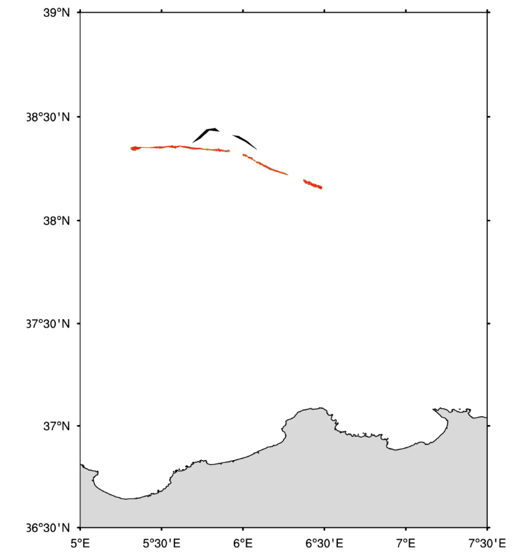{width="3.390972222222222in"
height="3.6152777777777776in"}

图2 卫星观测的油膜图像

[轨迹跟踪计算的误差评估方法：]{.mark}

A new skill score of the oil spill model (Liu and Weisberg, 2011):

ss=\[0,1\], ss的值越大，模型的表现就越好。

## 4.2 溢油浓度对输入参数，粒子数和网格分辨率的敏感性

\(1\) ASAR sensor and MODIS detected the oil slick

\(2\) Experiments were designed to study the model's sensitivity to oil
properties, number of particles, tracer grid resolution

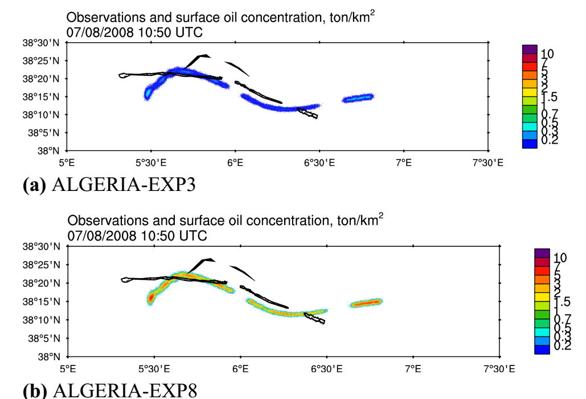{width="4.49375in"
height="3.057638888888889in"}

数值试验检验溢油类型和油膜厚度等参数

（MODIS观测的油膜和模拟的油膜）

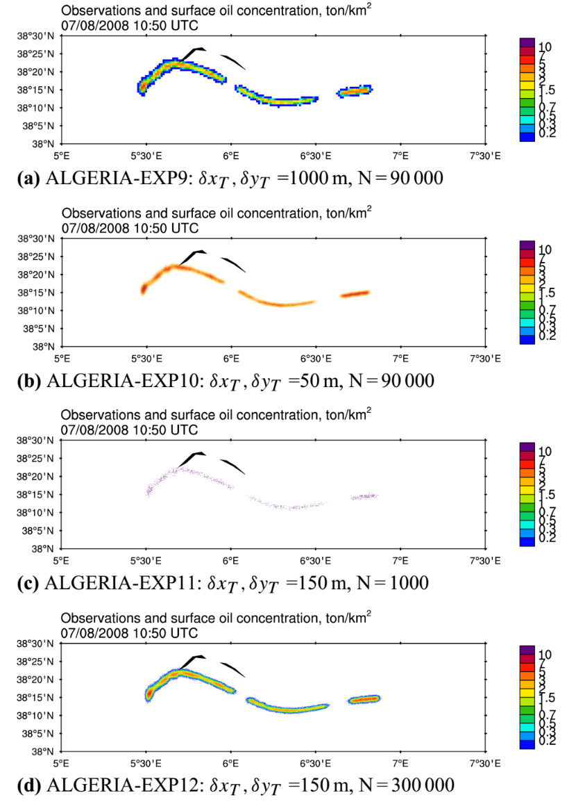{width="3.7180555555555554in" height="5.25in"}

检验网格分辨率和粒子个数对油浓度计算结果的影响
