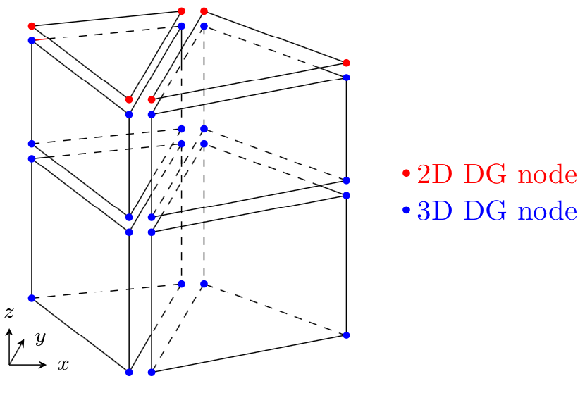
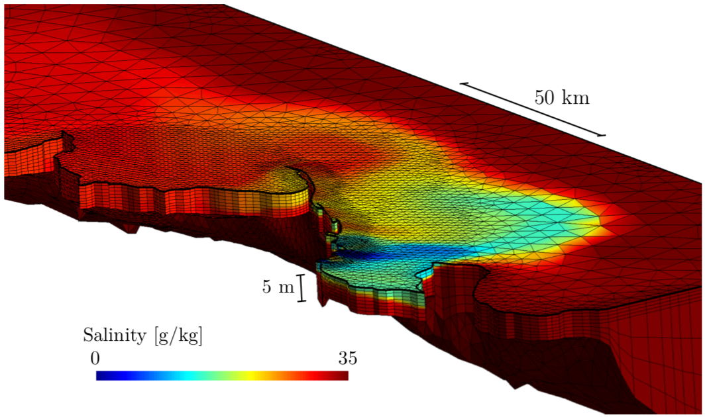

# SLIM1D and SLIM2D

SLIM2D is used in shallow-water environments where wind and tides are
sufficient to keep the water column rather well mixed. It solves the
depth-averaged shallow water equations for the surface elevation and the
horizontal velocity. When the horizontal flow is mainly unidirectional
such as for a well-mixed river, the shallow water equations can be
averaged over the section leading to the 1D section-averaged
shallow-water equations. SLIM1D consists of linear river segments where
variable river width and cross-section are taken into account. River
segments can be joined to model a river network with accurate
computation of bifurcation by the means of a Riemann solver.

SLIM solves the model equations on an unstructured mesh with the
Discontinuous Galerkin finite element method. This approach provides an
optimal degree of flexibility both geometrically and functionally as it
can accurately represent complex topographies and also model solutions
with sharp gradients. Unlike more standard numerical methods, such as
finite volumes, it introduces a minimal amount of numerical dissipation
and thus preserves small-scale flow features such as recirculation
eddies. The model equations can be forced by wind, tides, river
discharges and large-scale currents from a global ocean model.

Most coastal areas are significantly influenced by tides. When
approaching the coast, the tidal signal tends to amplify, especially in
funnel-shaped embayments where the tidal range may reach considerable
magnitudes. Combined with the fact that many estuaries and embayments
also feature gradually sloping bathymetry, the total area submerged
under water may vary significantly during the tidal cycle. To tackle
this issues, SLIM2D is equipped with a wetting-drying algorithm that
allows it to handle dry areas. The algorithm is based on an implicit
time-stepping that combines computational efficiency with local mass
conservation. The video below shows the water transport in the Columbia
River estuary as modeled by SLIM2D. Dry tidal flats are clearly visible
at low tide.

## To learn more...

Le, H.-A., Lambrechts, J., Ortleb, S., Gratiot, N., Deleersnijder, E., &
Soares-Frazão, S. (2020). An implicit wetting--drying algorithm for the
discontinuous Galerkin method: application to the Tonle Sap, Mekong
River Basin. *Environmental Fluid
Mechanics*. <https://doi.org/10.1007/s10652-019-09732-7>

Le, H.-A., Gratiot, N., Santini, W., Ribolzi, O., Tran, D., Meriaux, X.,
Soares-Frazão, S. (2020). Suspended sediment properties in the Lower
Mekong River, from fluvial to estuarine environments. *Estuarine,
Coastal and Shelf Science*, *233*,
106522. <https://doi.org/10.1016/j.ecss.2019.106522>

Vincent, D., Karatekin, Ö., Lambrechts, J., Lorenz, R. D., Dehant, V., &
Deleersnijder, É. (2018). A numerical study of tides in Titan′s northern
seas, Kraken and Ligeia Maria. *Icarus*, *310*,
105--126. <https://doi.org/10.1016/j.icarus.2017.12.018>

Delandmeter, P., Lambrechts, J., Marmorino, G. O., Legat, V., Wolanski,
E., Remacle, J.-F., ... Deleersnijder, E. (2017). Submesoscale tidal
eddies in the wake of coral islands and reefs: satellite data and
numerical modelling. *Ocean Dynamics*, *67*(7),
897--913. <https://doi.org/10.1007/s10236-017-1066-z>

Pham Van, C., de Brye, B., Deleersnijder, E., Hoitink, A. J. F., Sassi,
M., Spinewine, B., Soares-Frazão, S. (2016). Simulations of the flow in
the Mahakam river--lake--delta system, Indonesia. *Environmental Fluid
Mechanics*, *16*(3),
603--633. <https://doi.org/10.1007/s10652-016-9445-4>

Vincent, D., Karatekin, Ö., Vallaeys, V., Hayes, A. G., Mastrogiuseppe,
M., Notarnicola, C., ... Deleersnijder, E. (2016). Numerical study of
tides in Ontario Lacus, a hydrocarbon lake on the surface of the
Saturnian moon Titan. *Ocean Dynamics*, *66*(4),
461--482. <https://doi.org/10.1007/s10236-016-0926-2>

Le Bars, Y., Vallaeys, V., Deleersnijder, É., Hanert, E., Carrere, L., &
Channelière, C. (2016). Unstructured-mesh modeling of the Congo
river-to-sea continuum. *Ocean Dynamics*, *66*(4),
589--603. <https://doi.org/10.1007/s10236-016-0939-x>

Thomas, C. J., Lambrechts, J., Wolanski, E., Traag, V. A., Blondel, V.
D., Deleersnijder, E., & Hanert, E. (2014). Numerical modelling and
graph theory tools to study ecological connectivity in the Great Barrier
Reef. *Ecological Modelling*, *272*,
160--174. <https://doi.org/10.1016/j.ecolmodel.2013.10.002>

Kärnä, T., de Brye, B., Gourgue, O., Lambrechts, J., Comblen, R., Legat,
V., & Deleersnijder, E. (2011). A fully implicit wetting--drying method
for DG-FEM shallow water models, with an application to the Scheldt
Estuary. *Computer Methods in Applied Mechanics and
Engineering*, *200*(5--8),
509--524. <https://doi.org/10.1016/j.cma.2010.07.001>

de Brye, B., Schellen, S., Sassi, M., Vermeulen, B., Kärnä, T.,
Deleersnijder, E., & Hoitink, T. (2011). Preliminary results of a
finite-element, multi-scale model of the Mahakam Delta
(Indonesia). *Ocean Dynamics*, *61*(8),
1107--1120. <https://doi.org/10.1007/s10236-011-0410-y>

de Brye, B., de Brauwere, A., Gourgue, O., Kärnä, T., Lambrechts, J.,
Comblen, R., & Deleersnijder, E. (2010). A finite-element, multi-scale
model of the Scheldt tributaries, river, estuary and ROFI. *Coastal
Engineering*, *57*(9),
850--863. <https://doi.org/10.1016/j.coastaleng.2010.04.001>

Gourgue, O., Comblen, R., Lambrechts, J., Kärnä, T., Legat, V., &
Deleersnijder, E. (2009). A flux-limiting wetting--drying method for
finite-element shallow-water models, with application to the Scheldt
Estuary. *Advances in Water Resources*, *32*(12),
1726--1739. <https://doi.org/10.1016/j.advwatres.2009.09.005>

Lambrechts, J., Hanert, E., Deleersnijder, E., Bernard, P.-E., Legat,
V., Remacle, J.-F., & Wolanski, E. (2008). A multi-scale model of the
hydrodynamics of the whole Great Barrier Reef. *Estuarine, Coastal and
Shelf Science*, *79*(1),
143--151. <https://doi.org/10.1016/j.ecss.2008.03.016>

Hanert, E., Roux, D. Y. L., Legat, V., & Deleersnijder, E. (2005). An
efficient Eulerian finite element method for the shallow water
equations. *Ocean Modelling*, *10*(1--2),
115--136. <https://doi.org/10.1016/j.ocemod.2004.06.006>

# SLIM3D

SLIM3D solves the three-dimensional hydrostatic equations under the
Boussinesq approximation. The model variables are the 3D velocity, the
surface elevation, the salinity and the temperature. The density is
obtained by means of an equation of state. SLIM3D uses a mesh composed
of triangular prismatic elements that are formed by extruding the 2D
unstructured mesh in the vertical direction. The model equations are
solved by means of the Discontinuous Galerkin finite element method.

{width="4.049660979877515in"
height="3.4799825021872266in"}

Sketch of the 3D mesh obtained by vertically extruding a 2D triangular
mesh. All variables are piecewise linear and discontinuous between
elements.

One key aspect in any 3D ocean model is the coupling between the
external and internal modes. SLIM3D uses a mode-splitting formulation in
which the fast propagating gravity waves are solved in an external 2D
mode. That mode can either be discretised explicitly with a small time
step or implicitly with a larger time step.

{width="5.202866360454943in"
height="3.0803062117235345in"}

3D mesh used to simulate the sediment plume dynamics of the Burdekine
River (Australia). The bathymetry being quite shallow and smooth, sigma
layers are sufficient to provide an accurate solution.

In the vertical, SLIM3D allows a combination of z and sigma layers. For
rather shallow environments with mild bathymetry gradients, sigma
coordinates can be used over the entire water column. For deeper areas
with sharp bathymetry gradients, sigma layers are generally used only
near the surface while z layers are used in the rest of the domain. The
number of z layers can be adapted to better approximate bathymetry
gradients.

The accuracy of the mode coupling has been tested on a baroclinic test
case described in Ilicak et al. (2012). The domain is a periodic (along
the 500km-long boundaries) and closed (along the 160km-long boundaries)
channel with a bathymetry of 1000m (exaggerated on the video). The large
bottom drag coefficient and asymmetric initial condition trigger
baroclinic instabilities in the channel. The 4km mesh resolution is
similar to one of typical mesoscale eddy permitting models. SLIM3D is
able to reproduce the development of baroclinic eddies, as illustrated
by the evolution of the predicted temperature.

## To learn more...

Delandmeter, P., Lambrechts, J., Legat, V., Vallaeys, V., Naithani, J.,
Thiery, W., ... Deleersnijder, E. (2018). A fully consistent and
conservative vertically adaptive coordinate system for SLIM 3D v0.4 with
an application to the thermocline oscillations of Lake
Tanganyika. *Geoscientific Model Development*, *11*(3),
1161--1179. <https://doi.org/10.5194/gmd-11-1161-2018>

Vallaeys, V., Kärnä, T., Delandmeter, P., Lambrechts, J., Baptista, A.
M., Deleersnijder, E., & Hanert, E. (2018). Discontinuous Galerkin
modeling of the Columbia River's coupled estuary-plume dynamics. *Ocean
Modelling*, *124*,
111--124. <https://doi.org/10.1016/j.ocemod.2018.02.004>

Delandmeter, P., Lewis, S. E., Lambrechts, J., Deleersnijder, E., Legat,
V., & Wolanski, E. (2015). The transport and fate of riverine fine
sediment exported to a semi-open system. *Estuarine, Coastal and Shelf
Science*, *167*, 336--346. <https://doi.org/10.1016/j.ecss.2015.10.011>

Kärnä, T., Legat, V., & Deleersnijder, E. (2013). A baroclinic
discontinuous Galerkin finite element model for coastal flows. *Ocean
Modelling*, *61*, 1--20. <https://doi.org/10.1016/j.ocemod.2012.09.009>

Kärnä, T., Legat, V., Deleersnijder, E., & Burchard, H. (2012). Coupling
of a discontinuous Galerkin finite element marine model with a finite
difference turbulence closure model. *Ocean Modelling*, *47*,
55--64. <https://doi.org/10.1016/j.ocemod.2012.01.001>

Comblen, R., Blaise, S., Legat, V., Remacle, J.-F., Deleersnijder, E., &
Lambrechts, J. (2010). A discontinuous finite element baroclinic marine
model on unstructured prismatic meshes: Part II: implicit/explicit time
discretization. *Ocean Dynamics*, *60*(6),
1395--1414. <https://doi.org/10.1007/s10236-010-0357-4>

Blaise, S., Comblen, R., Legat, V., Remacle, J.-F., Deleersnijder, E., &
Lambrechts, J. (2010). A discontinuous finite element baroclinic marine
model on unstructured prismatic meshes: Part I: space
discretization. *Ocean Dynamics*, *60*(6),
1371--1393. <https://doi.org/10.1007/s10236-010-0358-3>

White, L., Legat, V., & Deleersnijder, E. (2008). Tracer Conservation
for Three-Dimensional, Finite-Element, Free-Surface, Ocean Modeling on
Moving Prismatic Meshes. *Monthly Weather Review*, *136*(2),
420--442. <https://doi.org/10.1175/2007MWR2137.1>

White, L., Deleersnijder, E., & Legat, V. (2008). A three-dimensional
unstructured mesh finite element shallow-water model, with application
to the flows around an island and in a wind-driven, elongated
basin. *Ocean Modelling*, *22*(1--2),
26--47. <https://doi.org/10.1016/j.ocemod.2008.01.001>

White, L., & Deleersnijder, E. (2007). Diagnoses of vertical transport
in a three-dimensional finite element model of the tidal circulation
around an island. *Estuarine, Coastal and Shelf Science*, *74*(4),
655--669. <https://doi.org/10.1016/j.ecss.2006.07.014>
