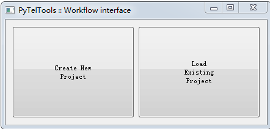
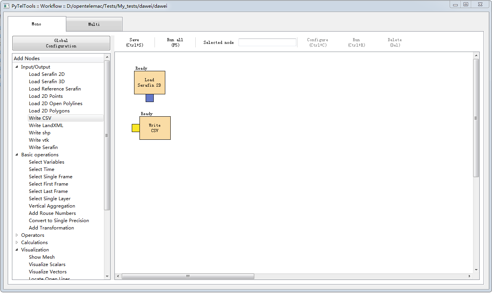

# Telemac模型的工具及基本操作

## 前后处理工具汇总

TELEMAC-MASCARET程序包含1D、2D和3D的水动力模型及其他耦合模型（[泥沙、波浪、水质、富营养化、溢油]{.mark}等）。很多工程咨询公司开发了前后处理工具，可提高实际应用的建模效率。总结如下：

MASCARET模型目前只有水质模型，泥沙模型COULIS尚未耦合及公布。

+------------+----------------+---------------+-----------------------+
| 开发       | MASCARET       | TELEMAC       | 说明                  |
| 单位/个人  |                |               |                       |
+============+================+===============+=======================+
| CNR（加    | TatooineMesher | [PyTel        | Python语言开发；      |
| 拿大国家水 |                | tools]{.mark} |                       |
| 力实验室） | （前处理）；   |               | PyTeltools具有界面，  |
|            | 1D断面数据构建 | （前后处理）  | 分为经典模式和工作流  |
|            | 2D网格。可视化 |               | 程模式（傻瓜步骤）。  |
|            | MASCARET结果； | [推荐]{.mark} |                       |
+------------+----------------+---------------+-----------------------+
| CNR（加    |                | B             | 前后处理              |
| 拿大国家水 |                | lueKENUE（[推 |                       |
| 力实验室） |                | 荐]{.mark}）  |                       |
+------------+----------------+---------------+-----------------------+
| A          | MASCARET-QGIS  | Telemac-QGIS  | QG                    |
| rtelia公司 |                |               | IS插件，需要用PostGIS |
+------------+----------------+---------------+-----------------------+
| T          |                | Tecplot插件   | 可视化serafin文件     |
| ecplot公司 |                |               |                       |
+------------+----------------+---------------+-----------------------+
| Lustra公司 | \--            | C             | QGIS插                |
|            |                | rayfish可视化 | 件，可视化TELEMAC结果 |
+------------+----------------+---------------+-----------------------+
| QG         |                | PostTelemac   | QGIS插件              |
| IS社区开发 |                |               |                       |
+------------+----------------+---------------+-----------------------+
| 法国EDF    | FUDDA          |               | JAVA语言              |
|            |                |               | 开发，界面是法语的（  |
|            |                |               | 老的，可用于1D建模）  |
+------------+----------------+---------------+-----------------------+
| PP个人开发 |                | pputils（[推  | 很好用的Python程序用  |
|            |                | 荐]{.mark}）  | 于Telemac2d的前后处理 |
+------------+----------------+---------------+-----------------------+
| BAW        |                | Serafin-QGIS  | QGIS插件，读取se      |
|            |                |               | rafin格式文件，可视化 |
+------------+----------------+---------------+-----------------------+
| EDF        |                | Postel        | Pytho                 |
|            |                |               | n程序，可视化用，已包 |
|            |                |               | 含在Telemac的程序包中 |
+------------+----------------+---------------+-----------------------+
| EDF        |                | M             | [一维                 |
|            |                | ATISSE-RUBENS | 建模。过时了]{.mark}  |
+------------+----------------+---------------+-----------------------+

## Telemac2d的输入输出文件简介

### 1、输入文件 {#输入文件 .标题3}

TELEMAC2D模型的输入文件（有4个必须的输入文件）：

1.  参数控制文件（必须的）：[T2DCAS]{.mark}，ASCII格式；

2.  地形文件（必须的）：[T2DGEO]{.mark}，serafin格式，MPI并行化时，进行区域分解，地形文件数据内容：
    X Y Z 存储于节点上；

3.  边界条件文件（必须的）：[T2DCLI]{.mark}，ASCII格式，MPI并行化时，进行区域分解；

4.  字典文件（必须的）：[T2DDICO,]{.mark}
    ASCII格式，保存了Telemac模型的所有变量名称和属性。

边界条件文件由前处理程序BLUE
KENUE生成，也可以由TELEMAC2D模型自带的*STBTEL*生成（还没用过）。可以使用文本编辑器修改，每一行数字代表边界上的节点属性。

其他的文件，根据启用的模块，在T2DCAS中打开关键字开关，然后配置输入文件，下面给出最常用的文件类型说明：

-   非恒定边界条件文件：T2DIMP，ASCII格式

-   点源文件：T2DVEF，ASCII格式

-   ......

### 2、输出文件

在T2DCAS中设置需要输出的变量，名称如下：

\'U=\"velocity along x axis (m/s)\"\';

\'V=\"velocity along y axis (m/s)\"\';

\'C=\"wave celerity (m/s)\"\';

\'H=\"water depth (m)\"\';

\'S=\"free surface elevation (m)\"\';

\'B=\"bottom elevation (m)\"\';

\'F=\"Froude number \"\';

\'Q=\"scalar flowrate of fluid (m2/s)\"\';

\'T1=\"tracer 1 etc. \"\';

\'K=\"turbulent kinetic energy in k-epsilon model (J/kg)\"\';

\'E=\"dissipation of turbulent energy (W/kg)\"\';

\'D=\"turbulent viscosity of k-epsilon model (m2/s)\"\';

\'I=\"flowrate along x axis (m2/s)\"\';

\'J=\"flowrate along y axis (m2/s)\"\';

\'M=\"scalar velocity (m/s)\"\';

\'X=\"wind along x axis (m/s)\"\';

\'Y=\"wind along y axis (m/s)\"\';

\'P=\"air pressure (Pa)\"\';

\'W=\"friction coefficient\"\';

\'A=\"drift along x (m)\"\';

\'G=\"drift along y (m)\"\';

\'L=\"Courant number \"\';

\'N=\"supplementary variable N \"\';

\'O=\"supplementary variable O \"\';

\'R=\"supplementary variable R \"\';

\'Z=\"supplementary variable Z \"\';

\'MAXZ=\"maximum elevation\"\';

\'TMXZ=\"time of maximum elevation \"\';

\'MAXV=\"maximum velocity\"\';

\'TMXV=\"time of maximum velocity\"\';

\'US=\"friction velocity \"\'

## Telemac2d的基本操作步骤

\(1\)
圈定模拟范围，AutoCAD软件修改并生成面域文件，导入Gambit软件划分三角形网格；

\(2\)
使用ArcGIS软件，提取遥感影像的地形数据，并在Tecplot中插值到网格上；

\(3\) 网格地形文件采用ADCIRC的grd格式
(也是SCHISM模型的gr3格式)，可以将GRD文件导入BlueKenue软件，用于地形(GEO)和边界条件(CLI)文件的生成。；

\(4\) 使用BlueKenue软件，设置Telemac2d需要的边界条件等配置文件；

\(5\) 分区计算网格和边界条件等，仅运行命令：

partel

该步骤需要的文件是PARTEL.PAR，该文件内容如下：

T2DGEO ! 网格地形文件名

T2DCLI ! 边界条件文件名

4 ! NPARTS 分区个数

1 ! 1: metis 2: scotch：2个非结构网格区域分解的程序库

0 ! sections (河道分段数，没有就设置为0)

\(6\) 使用Telemac2d的MPI版本程序，运行主程序；

该步骤执行前，需要配置MPI并行环境，运行如下命令：

设置环境变量：

set PATH=C:\\Program Files (x86)\\MPICH2\\bin;%PATH

smpd -install -phrase behappy // 安装smpd

smpd -status // 查看smpd状态

mpiexec --register // 注册，认真输入用户密码（2次），屏幕不会显示密码

mpiexec -validate // 出现success

运行：mpiexec --np 4 telemac2d // 4表示启用的进程数（或核心数）

\(7\) 合并各进程的计算结果，保存为serafin格式结果文件；

gretel

看提示：

输入T2DGEO

输入T2DRES // 结果文件

输入启动的进程数： 12

\(8\) 提交算例所有文件，可视化（见上面表中罗列的工具）。

## PyTelTools建模流程

有一个Python语言编写的小程序，可以按照规定的傻瓜步骤(Workflow
Interface)，逐步骤地建立Telemac2d模拟项目。

图1 经典模式和工作流模式

### 1、经典模式的操作界面 {#经典模式的操作界面 .标题3}

图2 经典模式的主界面

图3 整体设置（主要是选择serafin文件的语言和CSV的分隔符号）

图4 提取变量值的界面（Extract variables）

如图4，例如打开HTH算例的计算结果serafin文件。summary中显示了文件中的类型（2D）、变量的个数（3个）、节点数和单元数以及时间序列个数。

图5 选择时间序列的起始范围

其他的界面板块类似。

### 2、工作流界面（傻瓜操作） {#工作流界面傻瓜操作 .标题3}

图6 工作流界面的主界面

包括：创建新工程项目和打开已建工程项目。

图7 可以选择要进行的操作，并可视化操作流程本身

根据流程，一步一步的操作即可。
