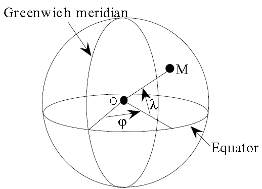
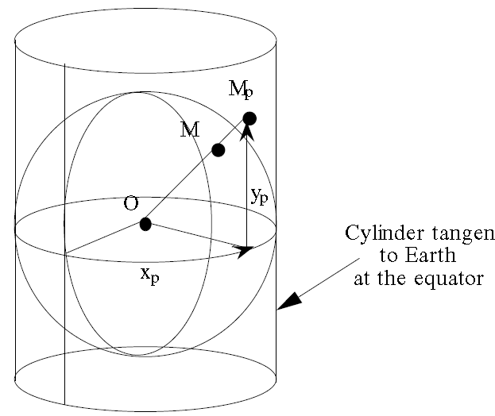

# 第2 章 自由液面水动力学方程

## 2.1 几何标记和概念

## 2.2 自由液面的Navier-Stokes方程

### 2.2.1 非静水压力的Navier-Stokes方程 {#非静水压力的navier-stokes方程 .标题3}

### 2.2.2边界条件 {#边界条件 .标题3}

### 2.2.3 静水压力和Boussinesq假设 {#静水压力和boussinesq假设 .标题3}

### 2.2.4 源项和体积力项 {#源项和体积力项 .标题3}

### 2.2.5 sigma坐标转换的Navier-Stokes方程 {#sigma坐标转换的navier-stokes方程 .标题3}

## 2.3 Saint-Venant方程

[由Navier-Stokes方程推导出2D Saint-Venant方程（浅水方程）。]{.mark}

### 2.3.1 前言 {#前言 .标题3}

Jean-Claude Adhemar Barre, Count(伯爵) of Saint-Venant,
1797年出生，死于1886年。Barre of Saint-Venant
equations，发表于1871年，英文: shallow water
equations，是对Navier-Stokes方程的简化，可用于地表浅水、河流、洪水、海啸、潮汐、（风暴潮）波浪、泥沙输移、溃坝波等的计算模拟。

假设：波长远大于水深。因此，计算涌浪(swell)不在其有效范围。

下面给出不同形式的浅水方程，用来强调模拟的物理现象和数值分析中需要注意的地方。由Navier-Stokes方程获得浅水方程的主要方法是在垂向上做平均。但是，非线性项的存在要求使用一些假设和近似。这些假设决定了浅水方程的适用范围。

### 2.3.2假设，近似和计算准则 {#假设近似和计算准则 .标题3}

**静水压力**

由压力引起的加速度抵消重力加速度。与垂向运动密切联系。

实际上，静水压力假设对于推导Saint-Venant方程不是必要的，但对于将水深转换为压力是必要的。

仅由于水柱的重量在坐标(*x, y,
z*)上导致了压力，可得：

 （2.106）

即：

常数*cs*t可取，其中为自由水面高度，为大气压。如果大气压的梯度为0，可认为大气压为一个源项。为了简化，可写出：

在底部上。

**忽略垂向速度**

在Saint-Venant方程中忽略垂向流速，因此没有垂向流速方程。该假设与静水压力假设一道忽略了垂向上流体的加速度。

**表面和底部的不可渗透性**

假设在水面和底部没有水体质量通过，水体微团滞留在这两个界面处。根据2.2.2节建立的方程，有：

 （2.109）

 （2.110）

注意：当考虑水面蒸发降雨和底部渗透时，就不能做不可渗透性假设。

**莱布尼茨法则**

变化上下界的积分推导，根据下式推导积分项和通量项：

 （2.111）

如果积分式表述为：

其中，*f*代表*F*在垂向上的平均，应用于在*x, y, z*方向上的求导，可得：

 （2.112）

其中，和为向量，但不是单位向量，前者是指向向上，后者指向向下。

类似地，对于一个向量：

 （2.113）

对于时间导数，有：

可得：

 （2.114）

### 2.3.3沿水深平均的Navier-Stokes方程 {#沿水深平均的navier-stokes方程 .标题3}

**原理**

密度不变和静水压力的Navier-Stokes方程，可通过从底部到水面的积分，在垂向上做平均。除了已定义的水柱高度变量外，引入2个新变量：

 （2.115）

3D速度矢量的水平方向分量的垂向平均，也称为速度，或"速度矢量的分量"。分量速度*u*和*v*向量标记为。

**连续方程的平均**

连续方程变为：

 （2.116）

应用莱布尼茨法则，上式变为：

 （2.117）

考虑不可渗透条件，可得：

 （2.118）

或者

 （2.119）

可以看出，上式类似于可压缩流体的质量守恒方程：

在Saint-Venant方程组中，水深起到密度的作用。

**动量方程的平均**

对2.2.3节中推导的动量方程做平均：

并实施静水压力假设（式2.108）。基于*U*分量的例子，考察方程各项的平均。

**时间导数项：**

 （2.120）

**扩散项：**

对于扩散项，假设密度在垂向上不变，可从积分中删去密度项（第1项），由莱布尼茨公式可得：

 （2.121）

（底部法向向量和底部方向向量仍然没有归一化）。

式（2.121）最后2项代表在水面和底部的切应力，例如风应力和摩擦力，稍后说明。

的2个分量分别为：

在得到扩散项的最终形式之前，考虑下列2式的不同形式：

和

最终取值等于向量分量：

和

考虑到密度为常数值，还可以计算扩散项为：

和

**对流项：**

*U*的方程：

根据连续方程，上式还可表述为：

沿垂向计算以上3项中各项的平均。

第3项是最简单的：

 （2.122）

[可得？？？]{.mark}：

 （2.123）

 （2.124）

以上两项导致了非线性项。下面以包含*UV*的表达式为例，推导公式：

 （2.125）

当（水平向）流速在垂向上各项异性时，项不为零。该项称为扩散项(dispersion
term)，通常可理解为额外的扩散项(diffusion
term)。考虑的是在**空间**平均流速周围的波动，这类似于雷诺应力。实际上，这些项是由真实水流导致的物理量输运引起，而不是在垂向上由流速平均导致的。所有流体微团并不是以相同速度移动（在水深方向上是变化的）。在Saint-Venant方程中，相反地是选择沿水深平均的流速。这里采用扩散(diffusion)的形式，导致对雷诺张量增加一个张量。实际上，如果令和，沿*x*和*y*方向的扩散项(dispersion
term)分别为：

 （2.126）

 （2.127）

在上述形式的式子中，可以看出张量增加到应力张量中。一种考虑方式就是修改粘性系数的取值，或者紊动粘性系数，并使用一个有效粘性系数代替，来考虑上述的**扩散(dispersion)**现象。

紊流模型在2D情况下考虑以上扩散现象，这将在*k*-*ε*模型中详细介绍。

**压力梯度**

在*x*方向和*y*方向上的压力梯度分别为：

仅当在水平方向上密度不变时上式才成立。密度变化应考虑在浮力源项中。

**源项和体积力**

沿垂向的恒定源项，即沿*z*轴的积分就是乘以水深*h*即可，如*F~x~*有*hF~x~*。

在2.3.11节中更精确的计算摩擦力为：

上式包含在体积力中，因此随后将被舍去。

**整合各项**

将上述所有项加起来，因为水面和底部的不可渗透性，一些项将消失，可得如下*U*方程：

 （2.128）

以同样方法，可得*y*方向的*V*方程：

 （2.129）

为有效扩散系数，用于模拟紊流粘性系数和扩散。

没有*W*方程，因为*W*方程已用于得到静水压力假设。

联合**质量守恒方程**，这些方程就组成了2D的Barre de
Saint-Venant方程组，并称之为"守恒形式"的方程组。

### 2.3.4 方程组的不同形式 {#方程组的不同形式 .标题3}

**守恒形式**

方程式2.119, 2.128, 2.129可根据下列表达式重新改写：

为分量*Q~x~*和*Q~y~*的向量。"流量"*Q*实际上是单宽流量，单位是m^2^/s。

连续方程：

 （2.130）

动量方程：

 （2.131）

 （2.131）

连续方程中的源项：当自由水面处或底部或水体内部存在水流的提取和汇入时，或者存在降雨或渗透入地下时，连续方程的右手边不为零，而是等于一个源汇项，标记为*Sce*，单位是m/s，汇入水体时为正，例如降雨，降雨强度为mm/h。将源项*Sce*乘以面积就得到真实的流量。

因此，质量守恒方程就写为：

 （2.133）

类似地，在动量方程中，也应当考虑源项输入，即向量分量和（*Mt*表示动量,
momentum），单位是m^2^/s^2^。源项等于和，其中和是点源处的速度分量。

**非守恒形式**

理论上，只有严格地处理守恒方程组，才可以考虑不连续性，可出现在浅水方程的数值解中，如水跃。其他一些原因，如格式的稳定性或使用特征线法，导致采用其他形式的方程，未知量为*h*,
*u*和*v*，称之为**"水深-速度"方程**，该种形式的方程称为**"非守恒"方程**。需要注意的是，该种称谓并不妨碍构建保证水流质量守恒的数值格式。

基于守恒形式的方程组，可计算动量方程和连续方程的导数。连续方程变为：

 （2.134）

动量方程的*x*分量为：

 （2.135）

式（2.135）联立连续方程式（2.134），可得：

 （2.137）

 （2.138）

当存在不连续性时，守恒形式和非守恒形式将不等价。

注意：如果底部有源项，和项加到方程的右手边。如果点源处流速等于周围流速，该项为零。该项包含在*F~x~*和*F~y~*项内，后面将不写出。

**Saint-Venant方程组的波速**

Saint-Venant方程组模拟的2个主要现象是对流或水流输运，以及长波的传播。使用线性化方程组描述小扰动下的长波传播是有效的。可忽略对流项，并假设为平底，可得到1D情况下的方程：

 （2.139）

 （2.140）

式中，*h~0~*为平均水深。

联立上式可得：

 （2.141）

可得：

 （2.142）

类似地，可得：

 （2.143）

这2个式子表示：*u*和*h*以速度+*c*或-*c*（）传播。由欧拉？？？，可知方程：

 （2.144）

的解的类型是：

 （2.145）

函数*A*和*B*的形式由初始条件和边界条件确定。当不存在流速时，Saint-Venant方程组中的波速为。[线性理论中的小振幅的长波波速]{.mark}再次出现。例如，当水深为2000
m，波速为500 km/h，这就是有效的潮汐波和海啸波的传播速度。

**波速-流速公式**

基于以上获得的非守恒公式，可推导出另一种公式。一方面，[Saint-Venant方程组类似于欧拉方程组]{.mark}，另一方面Saint-Venant方程组又包含了特征线方程。最终，可提出对迭代法做预处理的思路，来求解由Saint-Venant方程组得到的线性系统。

用*c*^2^/*g*代替方程组中的水深*h*可得到如下形式的方程式：

质量守恒方程：

 （2.146）

两边同除以2*c*，可得：

 （2.147）

动量方程：

 （2.148）

 （2.149）

该种形式的方程可得到精确解（例如1D溃坝问题），是基本方程。特别是重力加速度不再起作用。最终，所有的未知量*u*,
*v*和*c*都有相同维度。

**与欧拉方程对比**

欧拉方程是描述恒定熵值的无粘性可压缩流体的控制方程。在2D情况下可写为：

 （2.150）

 （2.151）

 （2.152）

式中，为比热容，为恒压下的比热与恒体积下的比热之比。因此，*c*为流体内的波速，等于，*p*为压强，为密度。

欧拉方程与Saint-Venant方程之间具有可比性，此时对于Saint-Venant方程：，对于空气。这种相似性意味着：Saint-Venant方程具有可压缩流体控制方程的形式，只是水深起到变化密度的作用。但Saint-Venant方程的右手边造成与欧拉方程的差异，源项对数值求解造成困难，是一些数值方法很快发散。

### 2.3.5 特征线 {#特征线 .标题3}

特征线法是从准线性微分方程的几何原理得到的，可给出流体力学中某些问题的物理解释，有时可得到解析解。另外，特征线法还可表征需要的边界条件的数量和性质，可诊断出问题的[病态性]{.mark}(ill-posed
problem)。因此，Saint-Venant方程组的特征线和黎曼不变量的概念是基础。下面选择没有扩散项和源项，在平底渠道上的1D波速-流速公式介绍特征线法：

 （2.153）

 （2.154）

将2个方程相加，可得：

 （2.155）

将2个方程相减，可得：

 （2.156）

这些方程有如下形式：

 （2.157）

其中，或，同时也表明沿着由方程或表征的曲线，有。因此，在名为C^+^的曲线上，

可采用方程表示。

在名为C^-^的曲线上，

可采用方程表示。

在C^+^曲线上，量为不变量；

在C^-^曲线上，量为不变量；

C^+^曲线和C^-^曲线称为特征曲线。量和量称为黎曼不变量。特征曲线的存在性将Saint-Venant方程组划分到[双曲型微分方程]{.mark}的类型。

根据*u*-*c*的符号可分为2种情况，其中*u*取正值：

（1）如果，水流称为亚临界流。水波比水流速度快。任意点处的水流依赖于其上游和下游的边界条件。

（2）如果，水流称为超临界流。水波比水流速度慢。任意点的水流仅依赖与其上游的边界条件，对下游产生影响。

（3）如果，水流称为临界流。

因此，根据水流特性边界条件发生改变，这种现象对水流模拟非常重要，也导致很多数值方法的求解失败。

水流的亚临界和超临界状态采用Froude数判断，在1D情况下，有：

在2D情况下，有：

如果Fr\<1，水流为亚临界流；

如果Fr=1，水流为临界流；

如果Fr\>1，水流为超临界流。

### 2.3.6 水跃的标记 {#水跃的标记 .标题3}

水跃是一种典型的不连续问题。

恒定水跃，存在共轭水深关系：

{width="4.549553805774278in"
height="1.8235061242344708in"}

恒定水跃

**移动水跃**

假设水跃以速度*W*向前移动。选择一个贴近水跃的参考坐标，在该参考坐标下，水流是恒定的，Saint-Venant方程亦然有效。水跃两边的质量和动量守恒可写为：

 （2.167）

 （2.168）

由第一个方程可推导出：

 （2.169）

根据水流上游和下游的特征计算水跃速度。如果下游流速*u~2~*为0，有：

如果水跃的高度趋近于0，可取，可知，因此*W*就是长波的波速。如果一个水波被视为一连串无限小的水跃，可基于质量和动量的守恒性简单计算其波速。

注意，*W*并不总与*u*~1~和*u*~2~的方向相同，例如在涌潮(hydraulic
bore)情况时。

{width="4.636468722659668in"
height="1.6036198600174978in"}

水跃在湿地形上以速度*W*传播

### 2.3.7 Mercator投影下的Saint-Venant方程 {#mercator投影下的saint-venant方程 .标题3}

风暴潮以及风暴潮引起的潮流，如果仅考虑潮汐因素，在实际的海面上和潮流平面上其数值存在差异，这主要是由于大气压变化和大范围洋面上的风应力造成。此类现象的物理条件允许忽略垂向加速度，水流近似水平。通常通过求解Saint-Venant方程组模拟风暴潮或风暴潮引起的潮流。实施数值模拟时，要将地球球体部分采用Mercator投影方法投影到平面上。因此，有必要确定Mercator投影后的Saint-Venant方程组的形式。

**Mercator投影**

Mercator投影属于正形（保角）投影，即保证局部角度相等，但不保证距离相等。也就是投影图的尺度在各点处不一样。平面上的域位于球体表面上，球面上的点坐标标识为纬度和经度（见图2.4）。基于一个球体，投影到一个平面称为Mercator平面，在平面上球体的*M*点与位于地球赤道线相切的圆柱体上的点*M~p~*对应，见图2.5。

{width="3.44913167104112in"
height="2.494738626421697in"}

图2.4 经度和纬度

{width="3.2892891513560807in"
height="2.764002624671916in"}

图2.5 Mercator投影的第一个阶段

平面上的坐标*x~p~*和*y~p~*由以下地理坐标确定：

但是，在参考坐标中的坐标对保角投影不对应，因为：

（1）对于地球表面上的东西方向位移*dx*，获得参考坐标下的位移*dx~p~*为：

 （2.170）

（2）而对于南北方向位移*dy*，获得位于*dy~p~*为：

 （2.171）

南北方向的变形比东西方向的边界要大，使得投影不是正形（保角）变换。通过在*y*方向上施加一个尺度变化来获得保角投影。由*y~p~*和推导出新坐标*Y*：

 （2.172）

另外，在点处可对坐标原点实施一个变化。沿着水平轴可获得：

 （2.173）

沿着垂向轴，由积分可获得：

 （2.174）

以上坐标*X*和*Y*是在投影图上得到的坐标，作为输入参数。因此，应该了解如何将Saint-Venant方程组以投影坐标来表述。*X*和*Y*作为球坐标的函数，因此首先在球坐标下表述Saint-Venant方程组。为此，在投影坐标下写出散度和梯度算子：

 （2.175）

 （2.176）

考虑到物理变量和投影的特性，标量和矢量（水深和流速）没有变化，即和。

函数对和的导数可用函数对*X*和*Y*、Mercator坐标的导数替代：

 （2.177）

 （2.178）

由此，可推导得到散度和梯度算子的新表达式：

 （2.179）

 （2.180）

在Mercator坐标下，质量守恒方程必须以非守恒形式求解，因此：

 （2.181）

[注意：]{.mark}以上述形式求解方程，但在有限单元法中，对近似空间造成问题，即如果为多项式函数，则的形式为何？如果和为多项式函数，则的形式为何？当要求证明质量守恒时，这些都是要回答的基本问题。

现在质量守恒方程也能写作连续体形式：

 （2.182）

式中，为笛卡尔散度算子。

在Mercator域上积分上述方程（见4.5.3节的变分公式），可得以下项：

和

后一项等于：

在这些项中，每个长度*dX*,
*dY*和都乘以，保证了真实的局部尺度。计算的控制体或通量因此为真实量。同样地，梯度项给出真实的坡度。

对所有算子，坐标都乘以。在计算执行之前都做该操作。可为每个单元选择一个常数值的纬度。优势是待求解的方程完全等同于笛卡尔方程（由于算子的局部特性，而不是全局特性）。选择的每个单元的常数值纬度是一个近似，但有助于保证严格的有限单元特性（近似计算转换到坐标上执行）。

使用将球坐标投影到Mercator平面上的计算时，应构建乘以的一套坐标。如果使用此方式修改的坐标，自然考虑用Mercator投影，在Saint-Venant方程中无其他修正，保证了质量和水流计算结果都是真实值。

通过确定采用坐标和形式的Saint-Venant方程，评价每个单元使用一个常数值纬度带来的误差，即和。忽略一些项后的原始方程和修正方程间的差具有1/*R*阶。在单元内考虑纬度的变化。

注意：（1）属于不同单元的公共节点具有不同坐标的问题。（3）Navier-Stokes方程的坐标投影变换，要考虑垂向流速明显情况时转换带来的误差。

### 2.3.8 带孔隙度的Saint-Venant方程 {#带孔隙度的saint-venant方程 .标题3}

[城市建筑物周围的洪水淹没。]{.mark}

### 2.3.9 Boussinesq方程组 {#boussinesq方程组 .标题3}

Joseph
Boussinesq是Saint-Venant的学生，建议了一个Saint-Venant方程的拓展，即模拟更弯曲的长波时，相比Saint-Venant方程,考虑垂向上的加速度项，而不采用静水压力假设或忽略垂向速度。实际波速为,
*k*为波数，而不是。Saint-Venant方程仅能处理有限情况的长波。Boussinesq，Serre，Korteweg
and De Vries都试图接近真实的长波扩散关系：

 （2.186）

在Boussinesq理论中，将垂向速度视为与的1阶和的2阶相关的量，其中*A*为波的振幅，*L*为波长。但这种垂向速度近似限制了应用范围，需要增加很多更高阶的项([文献]{.mark})。但是3D非静水压力模型降低了Boussinesq方程的重要性，下面介绍标准的Boussinesq方程，目的是与3D求解做对比。

Madsen P.A., Sorensen O.R., 1992. A new form of the Boussinesq equations
with improved linear dispersion characteristic. Part II. A
slowly-varying bathymetry. Coastal Engineering, 18: 183-204.

Nwogu O., 1993. Alternative form of Boussinesq euqations ofr nearshore
wave propagation. Journal of Waterways, Port, Coastal and Ocean
Engineering, 119: 618-638.

连续方程不变，在动量方程去消除垂向速度。因此，标准的Boussinesq方程中，在右手边加入以下项：

 （2.187）

式中，*H*~0~为参考水深。

将在4.7节考察这一增加项的作用，但需要注意的是：

（1）参考水深*H*~0~和Boussinesq方程的应用范围不允许计算域内有未淹没的床面。如果参考水深为零（即初始为干地形的区域），返回到Saint-Venant方程；

（2）增加项为时间导数项，在恒定流中为零。因此必须指出，对于恒定流情况，求解Boussinesq方程没有用处。

### 2.3.10 Serre方程组 {#serre方程组 .标题3}

Korteweg and De Vries
(1895)修正了Boussinessq法，建立了曲线长波理论。Friedrichs
(1948)建议基于平均水深与波长比值的扰动法，他发现Saint-Venant方程解为0阶。Keller(1948)发现Korteweg
and De Vries解为1阶。孤立波的Laitone解为2阶。Francois
Serre(1953)给出考虑底坡的解。相比Boussinessq方程，Serre方程考虑了更多项。

### 2.3.11 2D情况下的源项和体积力 {#d情况下的源项和体积力 .标题3}

源项*F~x~*和*F~y~*为除了压力和重力外的体积力。一些项，诸如风应力，实际上是三维的表面力，但以源项形式出现在Saint-Venant方程中，作用于整个水体。下面讨论：

-   底部摩阻；

-   拖拽力和水头损失；

-   Coriolis力

-   风应力

-   大气压强

-   动量源项

-   密度的空间变化

-   潮汐项

（1）底部摩阻

底部摩阻是一个重要的未知量，摩阻定律本身就带有很大的经验性。数学模型率定很重要，可使用参数估计法（第9章）自动率定模型。[文献\[139,
30\]]{.mark}第一次使用LiDAR遥感解译的植被高度率定河道洪水模型中的摩阻参数。

摩阻公式：2D情况下有2个方向的摩阻应力分量，分别是：

式中，*C~f~*为摩擦系数。

在自由水面的水力学中很难使用*C~f~*，需要用其他公式代替。最有名的就是谢才系数*C*，（*C*的量纲是m^1/2^/s）。谢才公式中，摩阻公式中使用的流速是渠道中的流速，仅当垂向流速可忽略时，等于水平向流速。

在Navier-Stokes方程中，底部摩阻等于，水深平均导出非守恒形式的Navier-Stokes方程，此时仅包含一项。底部法向向量的范数为：

为某点处最大坡降的余弦倒数，表示为。在非守恒形式的动量方程中添加下式，得到底部剪切力的谢才公式：

 （2.216）

式中，*C*为谢才系数。

谢才阻力公式是针对均匀流建立的，但可拓展用于任何类型的流动。最终，谢才公式表述为：

但是谢才系数不是一个常数，量纲分析和试验表明：谢才系数与水深和底部粗糙度有关。Manning和Strickler经验公式修正这个问题，定义谢才系数的值。最终获得与水深无关，仅与底部粗糙度有关？？？的阻力系数，即，其中*K*为Strickler系数。因此，又可导出Strickler公式：

因为水力半径和水深的差异，1D情况的率定结果并不适用于2D情况。

Strickler系数与底部粗糙度*k~s~*相关：

英语国家常用Manning公式，Manning系数*m*是Strickler系数*K*的倒数。

Manning公式：

Nikuradse公式：该公式起源于沿水深平均对流紊流流速分布的值（见2.4.3节的式2.271）。得到对应的谢才系数为：

 （2.223）

式中，*h*为水深，*k~s~*为底部粗糙因子。

Nikuradse公式常用于有植被区域的洪水模拟。

**2D和3D情况下摩阻系数的评估**

期望在2D和3D模拟中的摩阻系统是一样的。

摩阻系数*C~f~*在Saint-Venant方程组的形式为：

如果考虑一个矩形断面渠道，水深*h*，长度*L*，宽度，由于摩阻引起的质量负加速度，造成流体上的剪切应力，其分量为：

在3D情况下，底部剪切力分量为：

 （2.228）

 （2.229）

对于相同河段，剪切力有如下分量：

可见，如果达到相同的阻力效应，则*u*=*U*和*v*=*V*，即底部流速应等于垂向平均流速。这完全达不到。另外，如果能保证：

 （2.232）

其中，。

则系数可使用因子u/U和v/V修正，实际上2D和3D模型使用相同的阻力系数，可得到相同的水位线。

{width="5.319978127734033in"
height="3.627257217847769in"}

**拖拽力水头损失**

由于树干或桥墩造成。

**密度的空间变化**

在垂向上平均导出的Saint-Venant方程，不能反映垂向密度变化引起的分层现象，密度是温度和盐度的函数。但可以考虑密度的水平向变化。如果盐度为*S*，温度为*T*，密度的函数，其中*S*和*T*是*x,
y ,t*的函数。密度变化产生2种效应：

-   海水淡化

-   重力的差异效应

海水淡化的次生效应在3D模拟中可忽略。另外，由于盐度变化引起的重力差异效应在河口区域非常重要。Saint-Venant方程中的浮力项是Navier-Stokes方程中浮力项在垂向上的平均，可得：

大气压力梯度项为：

和

其中，为垂向上的平均。

实际上，2D模型中没有3D的密度差异信息，仅有的信息是来自于垂向上温度和盐度。浮力项积分为：

这就是斜压力梯度项。

### 2.3.12 2D情况下的边界条件 {#d情况下的边界条件 .标题3}

### 2.3.13 2D情况下的标量方程 {#d情况下的标量方程 .标题3}

守恒形式

非守恒形式

## 2.4 紊流模拟和扩散

### 2.4.1 雷诺应力 {#雷诺应力 .标题3}

### 2.4.2 零方程模型 {#零方程模型 .标题3}

### 2.4.3 固壁上的紊流应力 {#固壁上的紊流应力 .标题3}

### 2.4.4 *k*-*ε*模型 {#k-ε模型 .标题3}

### 2.4.5其他模型 {#其他模型 .标题3}

# 第3章 有限单元模型原理

## 3.1 引言

有限单元法是基于2个主要思路：插值法和变分法（也叫加权剩余法）。两种方法都有一个相同的目的：将连续问题转换为离散问题。如果在一个连续域上，使用方程定义函数*u*。插值法使用一些固定数目的实数，构建一个*u*的近似函数。变分法使用一些固定数目的方程，在域的每个有效点上，取代连续方程。简言之，插值法离散未知函数，变分法离散控制方程。这将在严格的数学框架下定义，这有助于证明解的存在性和唯一性。但对于带自由液面的流体运动，仅在简单情况下存在以上数学描述。

计算域为*N*维实数空间上的开放和有边界的域，为实数集，*N*为空间维数（等于1,
2,
3）。为域的边界，规则边界上可定义法向向量。在连续性意义上，物理量（压强、温度和速度矢量的分量等）在内的域的函数。另外，要求这些函数是平方可积【若，则说*f*在实直线上是平方可积的】，代表平方可积函数的集。在该集上定义点积如下：

 （3.1）

的子集是由函数组成，沿空间的*N*方向上函数的导数也是平方可积的。这保证一个**函数的梯度**也是平方可积的。该子集表示为。在内定义一个新的点积如下：

 （3.2）

空间和空间以及它们的点积称之为**Hilbert空间**。Hilbert空间与**Euclidean向量空间**非常相似。在两个空间上，借助于点积，可定义：

范数： （3.3）

距离： （3.4）

夹角： （3.5）

但是它们的维度是无限的。已由一阶导数描述。可由相同方法使用*k*阶导数描述，类似函数集，直到函数的*k*阶导数都是平方可积的。称为**Sobolev空间**。

仅考虑线性偏微分方程（流体力学方程一般都是非线性的，但使用求解方法来求解方程时都采用线性形式）。下面列出一些稍后会遇到的线性方程：

Helmholtz方程： （3.6）

Poisson方程： （3.7）

本章考虑以下形式的公式：

 （3.8）

下面详细介绍插值法和变分法。

## 3.2 有限单元内的插值

基本思想是使用一个定义在有限维空间*N*上的近似函数*u~h~*，代替一个属于有限维空间的未知函数*u*。这只是一个近似，不能完全保证。最小化就是变分法的目标。

有限单元中，函数*u*由*n*个实数表示，这些实数是在一定自由度（DOF）域的特殊点处的*u*的精确值。对于其他点，做插值就足够了。为定义一个特殊的插值函数，例如多项式，可得到*n*个自由度的*u*精确值是非常复杂的，或者导出高阶的函数。因此，有限单元放弃选择插值函数的单一特性(univocal
nature)，而是选择一个局部的简单插值函数（如常数值、线性、二次）。将空间离散为(tesselation
of
space)线段、三角形、四边形、四面体和棱柱体等。为这些单元在节点上、单元中心和边的中点上，分配**自由度**。因此，使用几何节点的坐标和插值节点的坐标描述各个单元。然后，在各单元内定义插值函数。例如，在1D情况，取线段的节点作为自由度，选择线性函数。函数*u~h~*近似*u*，写为：

 （3.9）

式中，为定义的不同基函数，但在各线段端点*i*上都是线性的。

在这些线段之外，为0。图3.1显示了1D非均匀网格上的基函数。在点*i*处=1，在所有其他自由度上为0。

{width="5.649710192475941in"
height="1.866573709536308in"}

图3.1 一维线性基函数

属性很重要。在2D情况，使用三角形单元和线性插值函数，每个基函数将写作，系数*a,
b
,c*与三角形单元有关，基函数在节点*i*处等于1，在其他节点上等于0。图3.2显示了计算域和在有限单元网格上一个线性基函数在节点处的计算值。

{width="4.70100612423447in"
height="3.092707786526684in"}

图3.2 在三角形网格上的基函数

有时称这些基函数为"**形函数**"。使用线性插值函数，线性函数*u*可被精确表示，称为是在**近似空间**。插值函数可以为二次的，也可以是其他任意阶的，不仅能在自由度上代表（精确）函数，还可表示（精确函数*u*的）导数。

使用四边形单元时，获得插值函数的简单定义是较为困难的。因此，返回在"参考"空间上更规则的参考单元（正方形的四边形），定义**2个空间**之间的几何转换。在参考空间中，**单体单元**（如线段、三角形和四面体）的插值函数更简单。使用一个参考空间构建有限单元矩阵将在7.4.1节中介绍。使用的有限单元将在第7章详细介绍。很多其他类型的单元的精确描述可参考：

Dhatt G., Touzot G. Une presentation de la methode des elements finis.
Collection Universite de Compiegne, Presses de l'Universite Laval. 1981

## 3.3 变分原理

基于离散数目的未知函数*u~i~*，将原函数*u*用*u~h~*表示，现在希望最小化。变分法意思是：对一些函数（称为**试函数**），点积为0。试函数的选取将定义有限单元法的变体形式。最经典的方法是Galerkin法，选取的试函数等于基函数：。在该情况下，如果*u~h~*分解为，则变分法将导出关于未知量*u~i~*的一个线性方程系统。

并且，对每个线性算子*L*都与一个双线性形式*a*相关，诸如：

 （3.10）

有限单元法的目的是，确定对*L*和*a*施加的条件，以求得问题的唯一解。一个重要的条件就是，对每个非零函数*u*，存在一个正实数，有。如果*L*的范数定义为：

该条件表明：*L*应该有一个严格意义上的正范数。否则，如果一个非零函数得到，解将不唯一，因为如果*u*是方程的一个解，则也将是一个解。在变分法框架下，条件可写为：

 （3.11）

称之为"**inf-sup条件**"。**inf-sup条件**阻止由双线性形式导致的寄生解的产生。例如，对于1D域，有均匀分布的自由度，如果*L*为梯度算子，如果基函数为线性且等于试函数，在节点处的函数*u*的值为1和-1之间的连续值（见图3.3），将对每个试函数导出，inf-sup条件将不能被验证。

{width="4.610948162729659in"
height="1.5371347331583551in"}

图3.3 梯度算子的隐形函数

当没有考虑边界条件是会导致该情况的发生，但在远离计算域的区域也会发生。由变分形式的Navier-Stokes方程导出的双线性形式并不总是满足inf-sup条件。不可压缩流体的内部流动的一个条件是：选择不同的单元代表压力和流速，例如，一个二次流速（单元）和一个线性压力（单元）。原则上，这种选择对可压缩流体不是强制性的，即可扩展用于Saint-Venant方程。但是，为流速和水深选择不同的单元可得到更规则的计算结果。如图(plate
5)，在一个1/4圆上模拟二次变化的地形上的潮汐，不考虑方程的对流和扩散项。可以看出：使用线性离散时发生了数值振荡(spurious
oscillation)，但如果流速用[quasi-bubble]{.mark}离散时数值振荡现象消失。还有一种解决方法是，基于结构网格和有限差分法，对压力和流速使用交错网格。最后，对于椭圆型方程，可以使用Laplacian离散，称为"非兼容"离散，在离散层次上，Laplacian离散方程不是椭圆型，等于梯度的散度。在4.12节详细介绍该方法的计算结果，Saint-Venant方程写作波动方程的形式。

更详细介绍有限单元法求解Navier-Stokes方程，可参考文献\[29,
56\]以及\[156\]

Girault V., Raviart P.A., Finite element methods for the Navier-Stokes
equations. Springer-Verlag. 1986

Pironneau O., Method of finite element method for fluids.

{width="5.43536198600175in"
height="3.5255982064741906in"}

plate 5 Lynch算例（无对流项的线性化浅水方程）

Atkinson J.J., Westerink J.J., Hervouet J.-M., 2004. Similarities
between the quasi-bubble and the generalized wave continuity equation
solutions to the shallow water equations. International Journal for
Numerical Methods in Fluids, 45: 689-714.

# 第4章 求解Saint-Venant方程(Telemac2D)

## 4.1 现有方法

求解守恒形式和非守恒形式的Saint-Venant方程的数值方法有：

（1）准波动方程形式：基于动量方程，流速将从连续方程中消除\[189\]；

（2）波动方程形式：推导基于时空的方程得到，见2.3.4节；

（3）Boltzmann方程：从动力学格式开始，后面简要介绍；

（4）有限差分法

（5）有限体积法

（6）有限单元法

（7）Lagrangian或半拉格朗日法(ELM法)

（8）谱方法

一种数值格式要综合考虑原始方程和求解方法的选择。如果使用分裂步方法（见4.3节），联合使用不同方法，但算法变的复杂，理解变难。因此，4.2节以后主要使用有限单元法，但同时借用半拉格朗日法思想，使用特征线法或使用有限体积法中的分裂格式（第6章），离散对流项。

实际上，有限差分法可认为是一种形式的有限单元法，矩阵对角化，且在结构网格上实施，更易于计算高阶导数，可获得更多种数值格式。

### 4.1.1 好的数值格式的主要特性 {#好的数值格式的主要特性 .标题3}

精确性、一致性、稳定性、唯一性、单调性、守恒性、激波捕捉能力

### 4.1.2 有限差分法 {#有限差分法 .标题3}

ADI法，结构网格。

### 4.1.3 双曲型方程的有限体积格式 {#双曲型方程的有限体积格式 .标题3}

[（此部分参考TORO的教材）]{.mark}

一维守恒性方程：

 （4.12）

其中，

*S*(*F*)是包含扩散项、源项和底部坡降的右手边。

该方程系统的解析解涉及计算系统的雅克比矩阵：

 （4.13）

雅克比矩阵的特征值为：和，以及特征向量为：

和

这些特征值使得Saint-Venant方程组是双曲型的。有限体积法在各控制体或单元上寻找恒定量。这符合非结构化网格的单元结构，或者以非结构网格的节点为中心存储变量。如果舍去源项*S*(*F*)，式（4.12）在各控制体上求和，可得：

 （4.14）

式中，代表不同维度单元的长度、表面积和体积，为法向向量。

因此，知道控制单元边界上的*G*(*F*)，就能够确定*F*随时间的变化。因为*F*在各单元上恒定，在单元界面处不连续。确定*G*(*F*)意味着在不连续处两边的速度和水深恒定的情况下，找到黎曼问题的解。该问题类似于使用特征曲线理论和黎曼不变量，求解湿地形上溃坝问题（4.13.4节）。[Roe]{.mark}基于线性化雅克比矩阵建议了Riemann问题的近似求解是很多数值通量格式的起点。但Roe解在干地形区域发生非物理的水跃现象，需要用扩散波代替。数值通量的计算考虑水流方向。

二维守恒形式方程为：

 （4.15）

数值计算原理是相同的。通过求解Riemann问题，有限体积法获得带有激波的方程系统的精确结果。具有质量和动量守恒的特性。另一方面，*S*(*F*)中不同的源项，主要为底坡和摩阻项，计算难度增加。河床摩阻在单独的分裂步计算，一般隐式计算。这会影响第一计算步中建立的平衡性。诸如[Bermudez
et
al.建立]{.mark}的新数值格式，建议采用迎风格式计算底坡和通量，来满足守恒性。

### 4.1.4 动力学格式 {#动力学格式 .标题3}

动力学格式是基于气体Boltzmann动力学方程，建立的[有限体积]{.mark}数值格式^\[155\]^。

见低阶格式的介绍文档。

### 4.1.5 有限单元格式 {#有限单元格式 .标题3}

经典的Galerkin法，使用中心导数计算对流项，违反了方程的双曲型性质，因为不区别迎水流方向和下游方向。设计有其他技术解决该难题。例如，基于SUPG法的CDG(Characteristic-Dissipative-Galerkin
\[99\])，在6.2节介绍。

Taylor-Galerkin法是一种显式格式，与有限差分法的Lax-Wendroff格式相似。该格式会引入数值扩散，与计算时间步长有关\[170\]。

最小二乘法是一种隐式格式，最小二乘法最小化剩余。

[Hicks and
Steffler]{.mark}对以上3种方法做了Fourier分析，与Stoker解的算例做了比较（见4.13.4节），确定CDG的数值扩散比Taylor-Galerkin法要小。最小二乘法对非恒定流是无效的，求解超临界流也有困难。

## 4.2 Telemac 2D模型算法概况

（1）方程组的初始化：水深-流速形式的非守恒Saint-Venant方程组。如果选择使用特征线法（离散对流项），则使用分裂步法分2个阶段求解方程组。

（2）在第一（分裂）步中，对应物理变量*u*, *v*和*h*, *k*, *ε*,
*T*的输运方程的对流项，方程的双曲型特性适于应用特征线法求解。

（3）在第二（分裂）步中，考虑其他方程组：对流项(propogation，*hu*)，扩散项和源项，还有不能使用特征线法求解的对流项。该步采用有限单元法求解；时间项离散允许消除原方程组的非线性项。在空间和时间上的变分公式和离散式，则将连续的方程组转换为关于未知量的离散的线性方程组，未知量为在网格节点上的物理变量*u*,
*v*和*h*。离散的方程组可采用共轭梯度类型的迭代法求解。

## 4.3 分裂步方法

使用特征线法求解对流项时采用分裂步方法。

时间离散后，计算域上的未知量*h, u,
v*等仅在....时刻求解。标记，函数*f*的时间导数离散如下：

式中，为函数*f*在时刻（新时间步）上的值，是在时刻（旧时间步）上的值。除非导数项在时刻上的值可得到二阶精度，否则离散格式为一阶精度。为此，在相同时刻离散其他项，对于对流项或存在非线性时，以上离散是不可能的。

注意：时间导数离散采用的是有限差分法。在有限单元法中，差分也可以理解为项部分的积分，项是由包含时间项的变分公式得到的。

计算原理如下：在时刻*t^0^*的初始解为*f*^0^，连续时间步迭代计算*f^n^*，首先得到*f^1^*，然后*f^2^*，依次计算。

在一个时间步内，为了由*f^n^*得到*f^n+1^*，仅考虑部分项，使用分裂步方法计算中间值，即计算：

 （4.22）

然后，

 （4.23）

式中，*f*代表*h, u, v, k*, *ε*或者*T。*

2个式子之和保存初始条件。但是，时间项近似和对流项一样是一阶精度的，不在时刻上离散。

**注意：**使用特征线法也可以实现时间项的二阶近似。例如，通过在2个不同时间步（和）上计算2个阶段的对流，对流算子等于。2个对流阶段的计算结果记作和。将替代为下式即可获得二阶精度格式：

但是，求解将变得复杂。

## 4.4 使用特征线法求解对流项

即ELM法。

## 4.5 对流项，扩散项和源项

当不使用特征线法时，该步求解所有的方程，此时考虑输运项。

### 4.5.1 时间离散 {#时间离散 .标题3}

如之前介绍的分裂步算法，函数*f*的时间导数采用以下形式：

 （4.30）

**使用之前计算的对流项结果**：

 （4.31）

 （4.32）

 （4.33）

式中，,
和是ELM计算的*h u
v*的对流项结果。

严格地说，上式右手边项应该沿着特征线的时间积分计算得到。

**不使用之前计算的对流项结果**：

 （4.34）

 （4.35）

 （4.36）

根据不同变量选择的不同数值格式，实际上是前2种情况的混合。如果存在于这些方程中的*h
u
v*是在时刻或时刻的变量，此时尚未定义这些变量的值。如果要达到二阶时间计算精度，则，*u*和*v*也是如此。应该小心实施半隐格式的时间离散。实际上，Fourier分析得到半隐格式格式的放大因子等于1，但考虑到非线性或边界条件，半隐格式是不稳定的。考虑稳定性，函数*f*的时间离散应采用：

其中，\>0.5，但应接近0.5。当\>0.5时，仍称为半隐格式。

**子迭代步**

上述的半隐格式不能求解所有的问题。实际上，非线性项会引出未知量和。不做任何处理的话，最终会得到一个非线性方程组，将不知道如何求解。因此，采用下列离散形式：

 （4.37）

式中，称为速度的松弛系数；称为"波（传播）高（度）"，用作计算长波传播波速。

为线性化方程，应等于*h^n^*，但通过以相同的时间步长连续求解之，取其值接近，这里的时间步长称为子迭代步，计算式为：

 （4.38）

称为水深的松弛系数。为的当前值，不做子迭代计算时=*h^n^*，做子迭代计算后等于，值为之前子迭代计算的结果。

类似地，当不使用特征线法计算对流项时，将写为：

 （4.39）

式中，为对流场，等于，是由子迭代步计算的近似值。

松弛系数一般取大于0.5的值（0.55或0.6可得到较好的计算值）。

**扩散项**

扩散项的半隐格式离散（以*u*为例），可得：

 （4.40）

为方便实施不同数值格式，对扩散项使用特殊的松弛系数，不等于（例如在准波动方程）。

**水深波动方程**

函数*Z~s~*（自由水面）表述为底部高程和水深*h*的函数。水深*h*的半隐格式离散方程为：

 （4.41）

也就是说：

 （4.42）

式中，。

**摩阻项的离散**

### 4.5.2 空间离散 {#空间离散 .标题3}

通过投影到基函数上来计算离散点上的函数值：

式中，*n*为离散点个数，*f^i^*为函数在点*i*处的值，为该点处的基函数。每个基函数与一个自由度联系。如第3章，在该点处等于1，在其他点处等于0。

在给定的单元内，函数值由离散节点处的值插值得到。

插值函数仅在参考单元上形式简单。各实际单元是参考单元通过简单的几何转化而来，各单元对应一种转化。见第7章基函数的描述。

注意：为避免inf-sup条件可能重复(resurgence)，对变量*h u
v*的空间离散不仅相同。因此在变分公式中有2套基函数。

### 4.5.3 变分形式 {#变分形式 .标题3}

使用变量*u*和*h*建立变分式。水深和流速分别属于和空间。是定义在域上的平方可积函数集，是的子集，由导数是平方可积的函数组成，且沿的边界为零。对流速*u*施加Dirichlet边界条件，这应该扩展至其他边界条件，如对水深*h*施加Dirichlet边界条件，以及弱形式的不可渗透边界条件。

[Bernardi and Pironneau \[13\]]{.mark}已建立低雷诺数下算法的收敛性。

实际应用中，变分公式由选择的一套函数组成，称为"试函数"，标记为，每个试函数与一个离散点联系（编号*j*的自由度），然后由满足条件的*E*=0形式代替一个方程。

本章中，假设试函数不等于基函数，水深的离散可不同于流速的离散。因此，标记：

：在点*i*处的基函数，描述水深；

：在点*i*处连续方程的试函数；

：在点*i*处的基函数，描述流速分量；

：在点*i*处2个动量方程的试函数；

与水深相关的基函数个数标记为*nph*；与流速相关的基函数个数标记为*npu*。

*nph*和*npu*不必相等（例如，线性的水深基函数和二次的流速基函数）。

时间离散后的控制方程为：

连续方程：

 （4.45）

动量方程：

 （4.46）

 （4.47）

*h u
v*没有时间上标都是指半隐格式计算的结果。和的定义见4.5.1节。基于这些方程，数值计算分为2个阶段：用各试函数相乘得到域上的积分，然后将未知函数投影到基函数上。

**域上积分和乘以试函数**

乘以试函数，在域上做积分，对水深的每个自由度(*i*=1,
*nph*)，得到如下方程：

 （4.48）

对流速的每个自由度(*i*=1, *npu*)，得到如下方程：

 （4.49）

 （4.50）

为代入在弱形式中出现的不可渗透边界条件，连续方程的以下项由分部积分可得：

 （4.51）

**投影到基函数**

如前所述，有：

经过投影后，方程变为：

连续方程：

动量方程：

在将以上方程变为线性系统之前，需要更精确地描述边界积分[（代入边界条件？）]{.mark}。

### 4.5.4 自然边界条件 {#自然边界条件 .标题3}

自然边界条件以边界积分的形式出现在之前的方程中。

**质量守恒**

在质量守恒方程中，这些边界积分为：

 （4.57）

这些项表述为穿过边壁的通量，有2种情况：

（1）穿过陆地边界时，不计算边界积分，称为"不可渗透边界条件的弱形式"。

（2）穿过流体边界时，必须计算边界积分。下式计算出现一个问题：

式中包含未知量。

处理包含未知量的项的方法尚无定论（自由出流边界会产生反射现象），因此当不能给出在时刻的流速分量值时，用代替。

[Westerink et
al.]{.mark}使用不可渗透边界条件的弱形式求解波动方程形式的Saint-Venant方程组^\[190,\ 115\]^。在弱形式框架下，发现该边界条件可已知之前观察到的非物理模式。[图6显示了]{.mark}桥墩后的卡门涡街，图中也显示了前一个桥墩后的流场。表明：混合使用滑移边界和弱形式的不可渗透边界。在无修正的情况下满足的条件。

{width="3.548144138232721in"
height="5.172201443569554in"}

图6 基于Saint-Venant方程组模拟的桥墩后的卡门涡街

### 4.5.5 源汇项 {#源汇项 .标题3}

连续方程可写为：

 （4.61）

还没有定义源项*Sce*的值。将源项*Sce*视为点源，有*isce*个点源，写为：，为点*isce*的基函数，*X*为未知系数。目的是在点源处施加入汇。在不存在边界通量时，对整个域求积分，使用时间导数的常用离散方法，可得：

同时，

对其施加

最终可得：

因此，引入源汇项的概念与域的离散有关的项，这是因为假设点源不简化为点源，而是在基函数定于的域上扩散。

另一种求解是写作，其中是与基函数有关的狄拉克函数，等同于直接将项在点*isce*处直接加到连续方程的右手边，如果*i*=*isce*，则认为，否则等于0。

### 4.5.6 系统的矩阵形式 {#系统的矩阵形式 .标题3}

## 4.6 辐射条件(Thompson法)

当计算域存在人为边界，例如海洋开边界，边界条件的引入会导致病态问题。在海洋开边界上，仅已知自由水面高度，需要施加高度和流速的边界条件。当水流指向这些边界的内方向时，导致病态问题，数值解可能会发散。特征线理论指出对于2D问题不可使直接施加边界条件，1D的特征线将转换为2D圆锥体\[33\]，基于特征线理论可施加"辐射"边界条件，这就是Thompsom法\[182\]。实际应用中，使用以下方法：

-   提供开边界处的所有数据，包括水位和流速，均作为边界条件施加；

-   边界处的局部条件使用特征线理论和黎曼不变量来研究，确定哪些信息是必要的，哪些信息是不必要的。推导处待施加的新的水位和流速。下面介绍适[用于Saint-Venant方程的Thompson法]{.mark}，可得到唯一解\[127\]。

使用4.1.3节的标记的守恒形式的Saint-Venant方程，并回忆式4.15：

考虑所有源项以及计算域内的入汇流量，右手边为：

考虑开边界处的局部法向向量阶局部切向量。通过旋转，引入对和的导数，其中为边界的法向，为边界的切向：

 （4.87）

下列雅克比矩阵的行列式等于1。

因此可得：

 （4.88）

系统（4.87）可写为：

 （4.89）

其中，

 （4.90）

通过将标记为速度的法向分量，标记为速度的切向分量，可得：

 （4.91）

接下来，忽略边界上在切向上的变化，求解系统：

 （4.92）

其中，

矩阵*A*可对角化为，其中：

由*dW*=*LdF*，返回到对角化系统：

 （4.94）

上式的每一行就是一个带源项的简单的输运方程。Thompson建议在边界点附近将*L*视为的常数，写作，其中：

 （4.95）

上方横杠表示视为常数值。因此，向量*W*的黎曼不变量为：

-    （对流速度为）

-   
    （对流速度为+*c*）

-   
    （对流速度为-*c*）

如果考虑标量*T*，增加：

-    （对流速度为）

使用特征线法处理纯对流问题。如果有源项，将在分裂步中考虑。当黎曼不变量已知时，用下式计算原始变量：

 （4.96）

如果离散计算域的特征曲线没有相应的用户设置的信息，当沿着上游方向的特征曲线移动时，在边界处将出现病态问题。另一方法，也要舍去多余信息。实际应用中，仅位于开边界上的点需要沿着上游方向的特征曲线移动，Thompson法并不耗时太多。但是需要计算每个点上的3（或者4）条特征线，每次都要准备对应的对流场。实际上，某些潮汐模拟是在Courant数在50左右才执行，这不能得到边界处的局部对流场。

[plate
7]{.mark}显示了使用Thmopson辐射边界条件模拟圆形波浪，在一个方形水库内传播，离开计算域。此例中，边界处没有设定信息，但是，可观察到：波浪向外传播时仅在角落处有一点反射，因为本方法中没有忽略边界处的切向计算项。

{width="5.6028674540682415in"
height="3.6417760279965004in"}

## 4.7 求解Boussinesq方程组

很少有采用有限单元法求解Boussinesq方程组。

## 4.8 求解2D的*k*-*ε*模型

### 4.8.1 对流项 {#对流项 .标题3}

### 4.8.2 产生项，扩散项和源项 {#产生项扩散项和源项 .标题3}

## 4.9 求解2D标量输运方程

## 4.10 2D守恒定律

### 4.10.1 水流质量守恒 {#水流质量守恒 .标题3}

### 4.10.2 标量质量守恒 {#标量质量守恒 .标题3}

### 4.10.3 水头和动量守恒 {#水头和动量守恒 .标题3}

### 4.10.4 能量守恒 {#能量守恒 .标题3}

## 4.11 干地形处理

### 4.11.1选择1：自由水面梯度修正 {#选择1自由水面梯度修正 .标题3}

### 4.11.2选择2：掩蔽干地形单元 {#选择2掩蔽干地形单元 .标题3}

## 4.12 准波动方程

## 4.13 测试算例

### 4.13.1 lake-at-rest算例 {#lake-at-rest算例 .标题3}

变底部（地形），数值解不能有任何运动。如果底部坡度和水深梯度不能以合适的格式离散（有限体积法中需要使用迎风格式），就不能保证数值解不移动。

在telemac2d模型的算法中，可以保证此现象，因为未知量"水深"实际为增量。动量守恒方程的驱动项为，如果从水平自由水位开始，则驱动项为零。如果计算域中存在干地形区域，计算变的复杂，见4.11节干地形处理。

### 4.13.2 堰流的下游水跃 {#堰流的下游水跃 .标题3}

### 4.13.3 波动传播 {#波动传播 .标题3}

### 4.13.4 Ritter和Stoker解 {#ritter和stoker解 .标题3}

1D溃坝问题的解析解。

# 第5章 求解Navier-Stokes方程组(Telemac3D)

## 5.1 前言

POM

TRIM3D, TRIM2D: ELM

Delft-3D FLOW

ADCIRC

自由水面的重构是比较困难的。解决此问题的新技术：

（1）ALE法(Arbitrary
Lagrangian-Eulerian)：为网格分配一个指定的速度，来跟踪计算域的移动。ALE法中的网格速度并不是真实的水粒子的速度。

（2）MAC法(Marker And
Cell)，使用没有质量的虚拟粒子标记充满水的单元。MAC法的优点是：可处理波浪破碎和任意不存在统一函数描述的自由水面变化问题；缺点是：除了计算流体流动控制方程外，额外的计算粒子的耗时。

（3）VOF法（Volume Of Fluids）

[水平集法(level-set)？]{.mark}

（4）SPH法

## 5.2 静水压力假设的方程组

### 5.2.1 分裂步方法 {#分裂步方法-1 .标题3}

### 5.2.2 空间离散 {#空间离散-1 .标题3}

### 5.2.3 构建3D网格 {#构建3d网格 .标题3}

### 5.2.4 Sigma转换和统一的sigma转换 {#sigma转换和统一的sigma转换 .标题3}

### 5.2.5 对流步 {#对流步 .标题3}

### 5.2.6 扩散步 {#扩散步 .标题3}

### 5.2.7 压力-连续方程计算步 {#压力-连续方程计算步 .标题3}

## 5.3 非静水压力Navier-Stokes方程组

### 5.3.1 静水压力计算步 {#静水压力计算步 .标题3}

### 5.3.2 连续方程计算步 {#连续方程计算步 .标题3}

### 5.3.3 自由水位计算步 {#自由水位计算步 .标题3}

## 5.4 准波动方程（静水压力模型的变体）

### 5.4.1 显格式计算扩散项？ {#显格式计算扩散项 .标题3}

### 5.4.2 隐格式计算扩散项？ {#隐格式计算扩散项 .标题3}

## 5.5 3D标量输运方程

## 5.6 3D质量守恒

### 5.6.1 水流质量守恒 {#水流质量守恒-1 .标题3}

### 5.6.2 标量质量守恒 {#标量质量守恒-1 .标题3}

## 5.7 Navier-Stokes方程的源汇项

# 第6章 求解标量输运方程(Telemac2D, Telemac3D)

标量输运方程计算是流体力学方程数值求解的重点之一。标量输运方程组的双曲型特性意味着空间导数项需要迎风格式离散。基于结构网格，研发了不少数值方程，如Quickest,
Ultimate等格式，但这些数值方法不能用于有限单元模型（或非结构网格）。下面介绍3种可用于非结构网格有限单元模型的数值方法：

（1）特征线法；[（欧拉拉格朗日法）]{.mark}

（2）[SUPG(流线迎风Petrov-Galerkin)法]{.mark}，用于连续方程；

（3）余量[分配格式(residual distribution
schemes)]{.mark}，主要用于有限体积法的数值方法。

## 6.1 特征线法

特征线法的主要优点是无条件稳定和数值解的单调性。在其弱形式中，还可考虑物质守恒性。基本原理是：临时采用拉格朗日法，计算在时刻、网格的*M*点上的函数值，等于相同函数在、网格的*Q*点上的函数值，*Q*点的函数值是从*M*点开始，经过时间长度沿轨迹线逆向返回计算得到。因此，使用黎曼不变量写出特征线方程：

称*Q*点为"**特征线的根部**"。

对各*M*点，特征线法由2步组成：

（1）通过创建在时刻经过*M*点的迹线，找到特征线的根部（*Q*点）。

（2）在到达单元内做插值。

计算轨迹线造成时间层的计算问题。使用速度场计算轨迹线，有：

 （6.1）

但是，对流速度在时刻是未知的（在一个计算步结束前）。有2种选择：（1）选择时间步的流速场（假设流速场固定）；（2）选择接近时刻流速场，重复若干次相同时间步的计算。后一种方法计算耗时较长，因为迭代计算量增大。通常情况下，采用固定流速场的假设方法。另外，在特征线法的框架下，时间层的标记是复杂的，因为它依赖于特征线的计算。

特征线（轨迹线）采用龙格库塔1阶方法计算，在特征线根部的插值要符合选取的有限单元类型。龙格库塔2阶方法不能明显改善计算精度，且计算量大。更高阶的插值算法，相比高阶龙格库塔法，可较显著地改进计算精度。

### 6.1.1 轨迹线计算 {#轨迹线计算 .标题3}

在2D网格上介绍轨迹线的计算原理。各时间步分割为若干子时间步，在子时间步长上认为速度恒定（局部计算*nsub*，例如认为流体质点3步可穿过一个单元）。如果设和为待计算轨迹线的起始点*D*的坐标，下一点*A*的坐标为和通过下式计算确定（迹线是从时刻返回时刻，因此取减号）：

 （6.2）

 （6.3）

式中，和分别为*D*点处的流速分量。

因为*D*点**并不总是网格的节点**，因此在一个单元内通过插值得到和。在有限单元模型中的主要问题是：正确地找到到达点*A*，也就是说，定位到达点*A*的所属单元。必须得确定所属单元，因为要插值计算点*A*处的流速。还需要定位特征点根部点*Q*，因为要做对流作用下的物理量插值。

计算轨迹线时，在到达时刻之前，可能有2种情况会发生：

（1）到达开边界处：理论上，轨迹线继续流出计算域。因为缺少继续计算轨迹线的信息，点*Q*取在轨迹线与开边界的交点处。在离开计算域的时刻（和之间）要尽可能精确地做插值。

（2）到达陆地边界处：理论上，该种情况不可能发生，由于龙格库塔法插值近似导致的。轨迹线与陆地边界交叉点代替点*A*，落入计算域外部。为了避免在下一子时间步再次流出计算域，流速设置为0。

构建特征线时，流体质点在网格内的移动和定位是特征线法的基石。需要的算法结构和截断误差管理，使得特征线法是一种使用较为困难的方法。

### 6.1.2 插值 {#插值 .标题3}

如上所述，在第2步计算中插值要与单元类型兼容。如果插值算法太耗散，则需要考虑采用更高阶的单元。深入了解特征线法，可参考文献\[45,
69\]。采用特征线法离散对流项要小心地优化，部分可矢量化计算。

### 6.1.3 弱形式下的特征线法 {#弱形式下的特征线法 .标题3}

特征线法的2个缺点是：格式的耗散性和质量不守恒。可在非恒定有限单元法框架下，使用"弱"方法修正这2个问题。详细介绍可参考文献\[70\]。

Hervouet J.-M., Application of the method of characteristics in their
weak formulation to solving two-deimensional advection equations on mesh
grids. 1986

下面介绍求解守恒性输运方程的方法：

 （6.4）

式（6.4）写为非恒定的变分公式，有：

 （6.5）

分部积分式（6.5），可得：

 （6.6）

在式（6.6）中，需要区别在时间和时间的试函数。实际上，该方法的创意在于可移动的网格，即允许水流质点在时间步内移动。在这些条件下，可以认为试函数存在对流运动，因此：

这里要计算试函数的非守恒形式的对流方程。可简化式（6.6）为：

 （6.7）

从时间到时间完成试函数的演变，可认为在时间的网格为最优网格。因此，通过沿着特征线计算在时间时的特征线根部位置，计算得到时间的试函数。这由经典的特征线法（"强形式"）计算完成。式（6.7）的左手边项为：一个质量矩阵乘以未知量向量。在右手边，存在代表穿过边界的通量的项，由边界条件计算得到；项是有问题的，因为该项等于。基于最优网格的基函数分解。因此，必须在时间到时间之间基函数是交错分布时，知道如何计算项的矩阵。因此计算域是任意位于网格(map)上的2个相交三角形（单元）的联合体。文献\[68\]建议基于[分布理论(distribution
theory)]{.mark}精确计算这些项。但是该方法计算量较大且对计算机产生的截断误差敏感。Hasbani
et al.
(1983)提出一种近似计算方法，使用**高斯积分**数值计算积分。有限单元框架下的弱形式的特征线法，现在称为欧拉拉格朗日局部伴随法（Eulerian-Lagrangian
Localized Adjoint Method, ELLAM）。

Hasbani Y., Livne E., Bercovier M., 1983. Finite elements and
characteristics applied to advection-diffusion equations. Computers and
Fluids, 11(2): 71-83.

## 6.2 流线迎风Petrov-Galerkin法

SUPG法的原理是(Brooks and Hughes,
1982)：使用根据水流方向变形的试函数。Petrov-Galerkin法中，使用二次函数获得试函数。SUPG法的创新之处在于：使用**线性函数，**但是为**不连续函数**获得试函数。因此试函数采用下式代替：

 （6.8）

式中，为计算域的节点*i*处的流速；*k*为系数，待确定。在1D网格上，这些新的试函数的形状如图6.1所示。

Brooks A.-N., Hugues T.J.R., 1982. Streamline Upwind Petrov Galerkin
formulations for convection diminated flows with particular emphasis on
the Navier-Stokes equations. Computer Methods in Applied Mehanics and
Engineering, 32: 199-259.

理论上，这些试函数可用于方程的所有项。但因为浅水方程的特殊性，对SUPG法修改3处：

（1）SUPG试函数不能应用于连续方程的所有项。应用SUPG法于对流项(propagation
term)产生**畸变项**。因为对流项不应该采用迎风格式处理，这一问题尚待解决。

（2）必须用单元常数值矢量（由各节点上的流速值平均）或者用在时刻的真实流速矢量，替换矢量（矢量等于在节点*i*处速度矢量的节点值），本身在空间上是一个变化的函数。较小的改变不会影响SUPG法的稳定性，但有必要保证质量的精确守恒。Telemac2D模型选择用替换矢量的SUPG法。

{width="4.97586832895888in"
height="2.5551049868766404in"}

图6.1 SUPG试函数

（3）系数*k*的选择：[Brooks and
Hughes]{.mark}建议由热传导方程分析得到的结果选择*k*，但Telemac2D不采用此方法。Telemac2D模型选择*k*的方法介绍如下。

由计算流体力学原理可知：通过对对流项(centred
term)增加一个人工扩散，可获得二阶精度的迎风对流项。应用SUPG法离散对流项（仅考虑函数*f*的对流过程），考察基于有限单元SUPG的效果。因此，变为：

在对流项基础上，必须增加下列项：

因为半隐格式计算*f*，上式修改了矩阵和右手边。在1D情况下，该项类似于扩散系数*ku*。因此，可以看出系数*k*提供扩散项（对中间对流项增加了一个迎风处理），即。因此，将*k*写为：，其中为迎风系数，需要说明其选择方法。

由于SUPG导致的附加项可理解为人工扩散，可稳定中间格式。在2D情况下，因为点积的作用，该扩散作用仅应用于水流方向。尽管Fourier分析显示为确保该格式的稳定性\[93\]，系数等于Courant数是足够的，则。

在选择以上的*k*后，可以看出：SUPG法已被修改，但并不改变质量守恒方程的质量守恒性。修改后的基的总和等于1，因为：

注意到，可使用不同性质的试函数处理守恒方程的各项，而不改变其质量守恒性，只要网格上的试函数的总和等于1。对于SUPG试函数，通过选择一种单元上为常数值的系数以及选择代替，保证试函数总和等于1。

## 6.3 连续方程的守恒格式

该格式基于守恒形式的连续方程，为：

[代表什么？]{.mark}

如果使用SUPG法，该方法的试函数仅用于对流项，因为实际上需要求解的是：

这就是不需要子迭代步计算的守恒格式。

## 6.4 分配格式

余量分配法(residual distribution method)。

### 6.4.1 2D N&PSI格式 {#d-npsi格式 .标题3}

### 6.4.2 3D MURD格式 {#d-murd格式 .标题3}

# 第7章 有限单元的现代技术

本章介绍Telemac模型中使用的有限单元、网格和有限单元矩阵的存储技术。

## 7.1 有限单元介绍

### 7.1.1 线性插值的三角形单元 {#线性插值的三角形单元 .标题3}

如图7.1，参考三角形单元由节点组成，节点坐标为(0,0),
(1,0)和(0,1)，其编号依次为1，2和3。在参考三角形单元上，基函数为：

 （7.1）

 （7.2）

 （7.3）

{width="2.388888888888889in"
height="2.4547386264216975in"}

图7.1 参考三角形单元

### 7.1.2 Quasi-bubble三角形单元 {#quasi-bubble三角形单元 .标题3}

如图7.2，Quasi-bubble单元发表于1993年\[142\]。是基于三角形单元推导的，在3个节点P1,
P2,
P3基础上增加一个点P4。三角形的重心可作为第4个点。初始三角形则分解为3个三角形：T1，T2和T3。

Mewis P., Holz K,-P., 1993. A quasi-bubble function approach for shallow
water waves. Advances in Hydro-Science and Engineering, 1: 768-774.

通过选择线性离散方法，在有限单元理论中，Quasi-bubble单元上的基函数为4个分段线性函数（对P1\~P4这4个节点），定义在三角形上，有：

 （7.4）

{width="2.826388888888889in"
height="2.2708333333333335in"}

图7.2 Quasi-bubble单元

### 7.1.3 四面体单元 {#四面体单元 .标题3}

参考单元由4个节点组成，坐标分别是(0,0,0), (1,0,0),
(0,1,0)和(0,0,1)，见图7.3。基函数为：

 （7.5）

 （7.6）

 （7.7）

 （7.8）

{width="2.9051017060367452in"
height="2.7847222222222223in"}

图7.3 四面体单元

### 7.1.4 棱柱体单元 {#棱柱体单元 .标题3}

棱柱体由3个垂向矩形边和2个三角形边（顶部和底部）组成，不一定是水平的，见图7.4，图中的数字表示节点的局部编号。

{width="1.571628390201225in"
height="2.554364610673666in"}

图7.4 棱柱体单元

每个函数*f*可近似计算如下：

 （7.9）

其中，和分别是定义在域的网格的节点*i*上的函数值和双线性基函数，在节点*i*处=1，在其他节点处=0。

为简化计算，以及为了计算在网格各单元上的基函数，可首先在更简单的组成参考单元的棱柱体上进行计算，见图7.5。

{width="3.705617891513561in"
height="3.4967147856517937in"}

图7.5 参考单元

与参考单元的节点相关的基函数*P~i~*为：

在域的网格上的任意棱柱体上的基函数的限制是从等参转换*F*的函数*P~i~*组合推导而来，将参考棱柱体转换为实际计算的棱柱体单元。

对于网格的任意棱柱体，其节点坐标为，*F*将参考单元上的一个坐标为的节点*M~0~*，与实际计算的棱柱体单元上的一个坐标为的节点*M*联系起来，考虑如下关系：

出现在*F*的定义中的函数*P~i~*是定义在参考单元上的基函数，因为该选择的参考单元为等参单元（插值节点是几何节点）。

可简化*F*的定义，因为：

因此，可得到*F*的如下关系：

 （7.10）

基函数由定义。通常，转换的双线性意味着实际域上的基函数有一个非多项式定义。注意到，实际网格上*z=const*的平面可能在参考空间内不是一个平面，这可能对分层模拟产生深远影响。

## 7.2 网格介绍

### 7.2.1 2D网格 {#d网格 .标题3}

{width="3.8632775590551183in"
height="2.266288276465442in"}

图7.6 全局编号和边界点编号

### 7.2.2 3D网格 {#d网格-1 .标题3}

## 7.3 矩阵存储

### 7.3.1 对角矩阵存储 {#对角矩阵存储 .标题3}

### 7.3.2 CSR格式存储 {#csr格式存储 .标题3}

### 7.3.3 EBE格式存储 {#ebe格式存储 .标题3}

### 7.3.4 基于边(edge)的存储 {#基于边edge的存储 .标题3}

## 7.4 矩阵运算

### 7.4.1 构建矩阵 {#构建矩阵 .标题3}

### 7.4.2 基于边存储格式的矩阵组合 {#基于边存储格式的矩阵组合 .标题3}

### 7.4.3 单元向量的组合 {#单元向量的组合 .标题3}

### 7.4.4 非对称EBE矩阵和一个向量的积 {#非对称ebe矩阵和一个向量的积 .标题3}

### 7.4.5对称EBE矩阵和一个向量的积 {#对称ebe矩阵和一个向量的积 .标题3}

### 7.4.6 转置EBE矩阵和一个向量的积 {#转置ebe矩阵和一个向量的积 .标题3}

### 7.4.7 Dirichlet边界条件的处理 {#dirichlet边界条件的处理 .标题3}

### 7.4.8 对角矩阵和一个矩阵的积 {#对角矩阵和一个矩阵的积 .标题3}

### 7.4.8 基于边存储格式的矩阵-向量的积 {#基于边存储格式的矩阵-向量的积 .标题3}

### 7.4.9 矩阵-向量的积 {#矩阵-向量的积 .标题3}

## 7.5 线性方程组求解

## 7.6 下降法和预处理

### 7.6.1 共轭梯度法 {#共轭梯度法 .标题3}

### 7.6.2 共轭余量法 {#共轭余量法 .标题3}

### 7.6.3 法向方程上的共轭梯度 {#法向方程上的共轭梯度 .标题3}

### 7.6.4 最小误差法 {#最小误差法 .标题3}

### 7.6.5 GMRES法 {#gmres法 .标题3}

## 7.7 预处理

### 7.7.1 对角化预处理 {#对角化预处理 .标题3}

### 7.7.2 Saint-Venant方程组的*c*-*u*预处理 {#saint-venant方程组的c-u预处理 .标题3}

### 7.7.3 块对角化预处理 {#块对角化预处理 .标题3}

### 7.7.4 LU分解的预处理 {#lu分解的预处理 .标题3}

### 7.7.5 Crout预处理 {#crout预处理 .标题3}

### 7.7.6 Gauss-Seidel EBE预处理 {#gauss-seidel-ebe预处理 .标题3}

### 7.7.7 基于边存储的Crout和Gauss-Seidel预处理 {#基于边存储的crout和gauss-seidel预处理 .标题3}

# 第8章 并行化计算

域分解

METIS

# 第9章 参数估计

## 9.1 引言

## 9.2 伴随法原理

## 9.3 Dirichlet边界条件的处理

## 9.4 在Telemac-2D模型中的应用

### 9.4.1 摩阻系数的估计 {#摩阻系数的估计 .标题3}

### 9.4.2 伴随系统右手边的计算 {#伴随系统右手边的计算 .标题3}

## 9.5 代价函数最小化的下降法

### 9.5.1 共轭梯度法 {#共轭梯度法-1 .标题3}

## 9.6 验证和结果

# 第10章 应用案例

## 10.1 Malpasset溃坝波

## 10.2 英吉利海峡的潮汐

## 10.3 孤立波

## 10.4 Lock-exchange问题
