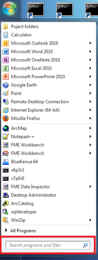
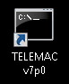
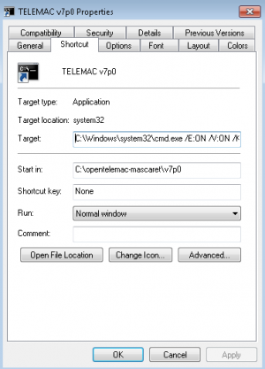
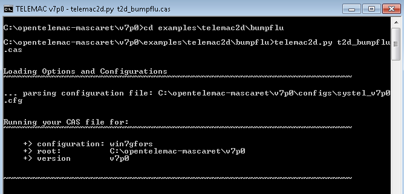

# Instructions to finish the installation manually after a failure of the automatic installation

*[Important note:]{.underline}* *The following instructions are to check
out the first tag (v7p2r2) of the v7p2 version. If you wish to work with
a different version, edit all commands, paths, names and the
configuration file with the version you wish to use.*

## 1. Open the DOS prompt command

{width="1.7519892825896763in"
height="4.6563713910761155in"}

If you do not know where the prompt command is, go to the Windows start
menu and type "**cmd**" in the "Search programs and files" box. (see
picture on the right)

## 2. Check out the TELEMAC source code

From the DOS prompt command, run the following command:

svn co http://svn.opentelemac.org/svn/opentelemac/tags/v7p2r2
\"C:\\opentelemac-mascaret\\v7p2\" \--username ot-svn-public \--password
telemac1\*

[Note:]{.underline} The download could last more than 20 minutes
depending on the quality of the internet connection.

[Note:]{.underline} If the checkout crashed you do not have to start
again just type svn update in the v7p2r2 folder to carry on the
download.

## 3. Copy configuration file

Save the configuration file as ***systel_v7p2.cfg*** in
C:\\opentelemac-mascaret\\v7p2\\configs.

Here are the configuration files for v7p2: [configuration file
v7p2](http://wiki.opentelemac.org/doku.php?id=configuration_file_v7p2)

for v7p0 : [configuration
file](http://wiki.opentelemac.org/doku.php?id=configuration_file)

## 4. Create a shortcut of the DOS prompt command on your Desktop

{width="0.6993536745406824in"
height="0.8191021434820648in"}

## 5. Rename it "Telemac v7p2"

{width="0.8in"
height="0.9680555555555556in"}

## 6. Edit the properties of the new shortcut

{width="2.275272309711286in"
height="3.159818460192476in"}

-   Click right on the shortcut and edit the properties. The properties
    window should pop up (see picture on the right)

-   In the **Target** box, copy/paste the following path next to what is
    already there, [separated by a space]{.underline}.

[下面的代码其实就是设置环境变量用的：]{.mark}

/E:ON /V:ON /K set
SYSTELCFG=C:\\opentelemac-mascaret\\v7p2\\configs\\systel_v7p2.cfg &&
PATH=C:\\opentelemac-mascaret\\v7p2\\scripts\\python27;!PATH!

-   In the **Start in** box, delete the path and replace it by
    > C:\\opentelemac-mascaret\\v7p2

```{=html}
<!-- -->
```
-   Click OK

## 7. 编译TELEMAC系统

Double click on the Telemac v7p2 shortcut you created and run the
following command:

compileTELEMAC.py

[Note:]{.underline} The compilation can last more than 30 minutes
depending on the characteristics of your computer

# 如何运行一个模拟项目?

After installing the TELEMAC system with the automatic installer, the
software can be run through the shortcut created during the installation
process.

## 运行一个算例

All test cases are in C:\\opentelemac-mascaret\\v7p0\\examples

1.  Double click on the TELEMAC v7p0 shortcut

{width="0.8032119422572178in"
height="0.9719422572178478in"}

Navigate to the test case folder. For example

C:\\opentelemac-mascaret\\v7p0\\examples\\telemac2d\\bumpflu

> cd examples\\telemac2d\\bumpflu

2.  Run the following command:

telemac2d.py t2d_bumpflu.cas

{width="5.3486767279090115in"
height="2.569734251968504in"}

## Deadlock on execution(运行时不动了？!)

If when you are testing a case the listing seems block just after
displaying the header. It might be because your mpi installation is not
registered to do that.

Do the following actions:

1.  In an admnistrator shell type the following commands:

2.  smpd -install

3.  mpiexec -remove

4.  mpiexec -register (With your windows login)

If you do not have administrator rights. A temporary solution that you
will have to redo everytime you open a new shell. Is to go inside the
temporary folder run the command that was displayed in the listing (the
one with mpirun in it).

To check that it worked:

1.  In an user shell type the following commands

2.  mpiexec -validate (it should return SUCCESS on a user shell)

3.  smpd -status (it should return \'smpd running on \<hostname\>\')

# 编译TELEMAC-MASCARET V8.2

不能正确编译mascaret模型，其他一切正常。

必须在ifort CMD环境下，执行Python3脚本。

## 遇到的问题及解决

2.1

编译nestor时，#error: can\'t find include file: backfill_to_level.f

。。。。。。

要把nestor下的代码，拷贝到builds/../nestor下面去？！！！

2.2

UnicodeDecodeError: \'utf-8\' codec can\'t decode byte 0xd3 in position
1086: invalid continuation byte

在parser_fortran.py的第1695行，

\# encoding=\'utf-8\'修改为encoding=\'ISO-8859-1\'

修改代码为：

src_file = open(dif_file, \'r\', encoding=\'ISO-8859-1\')

2.3

mascaret静态链接库连接的问题:

xilib.exe /nologo /out:libmascaret.lib \*.obj

再返回到D:\\opentelemac\\v8p2r0\\scripts\\python3

继续执行python compile_telemac.py

2.4 仍然无法连接生成mascaret,exe

注销了compil_tools.py的部分错误信息代码，在第507行。
