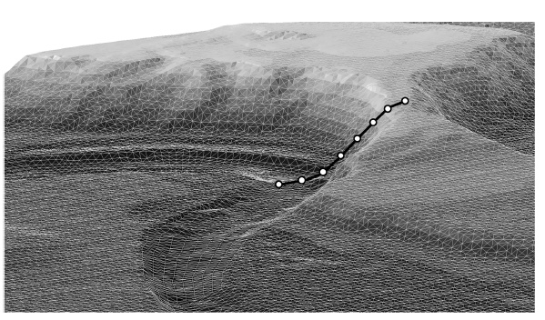

# telemac2d的河道崩岸模型

## 蜿蜒河道演变及河岸崩塌

蜿蜒河道的演变机理复杂，冲积河流的水沙特性时空变异极大。因此，需要在数值模型中综合考虑各种影响蜿蜒河流演变的因素。但实际应用中，因为要模拟很长的时空尺度的过程，对物理机制和河流地形等因子作了简化，导致一些重要的物理过程未考虑到模拟当中，例如通过单一的侵蚀因子替代河岸崩塌过程的土力学过程，用于河道的横向发展模拟
(Camporeale et al.,
2005)；河道的植被会改变河岸的可侵蚀性，河道植被的影响也未考虑在河道演变模型中
(Malkinson and Wittenberg,
2007)；河道演变模型中的土力学河岸约束条件一般仅施加于单一河道，实际上自然界的河道水系非常复杂（例如洞庭湖水系），对复杂水系的河道岸坡崩塌的判断及模拟是十分必要的。

上述的问题对模拟复杂水系河道的河岸崩塌现象提出了要求，需要开发更为复杂的河岸崩塌模型。TELEMAC2D模型中开发了采取物理机制和经验判断综合判断河岸崩塌的模块，用于识别和判断河岸崩塌位置和蜿蜒河道演变过程
(Güneralp et al., 2012)，并且可用于长时间河道演变过程的模拟。

## TELEMAC2D的土力学模块

Telemac2d中的土力学计算模块(GEOTECH)分为5个部分：

（1）地形分析算法

生成沿斜坡稳定性评估中的断面网络。该算法模拟区域中任意斜坡位置，并非严格地沿着弯道河段的外河岸。

（2）河岸崩塌起源算法

沿每个断面，搜索最有可能剖面失稳的几何体。

（3）河岸稳定性评估

对任意潜在失稳剖面，计算安全性因子。

（4）河岸浸润水位

计算河岸附近滩地的地下水位。

（5）河岸崩塌块体分析

移除不稳定崩塌块体，在下坡方向沉积，更新计算网格地形。

以上模块综合评估河岸的土力学稳定性，河道地形采用三角形网格(TIN)描述，河道水流条件（主要是水位）决定河岸稳定性，并计算泥沙输移和河道演变过程。

图1 土力学模块的5个部分及与TELEMAC2D水动力学模型的耦合

（1）地形分析

传统的河岸崩塌模型中，河道地形分析算法与计算网格是独立的2个部分，在河道任意断面都可发生河岸崩塌，这些模型一般采用贴体曲线坐标的结构网格，用于描述单一的蜿蜒河道，而河道漫滩往往缺少地形数据，且此类模型没有考虑冲刷和淤积历史事件的影响（忽略了古河槽和季节性演变河槽），河岸稳定性分析在每个网格断面进行，这虽然大大简化了稳定性分析的复杂度，但要求网格结构是结构性的，用于复杂水系的河道稳定性时并不适用。

在TELEMAC2D模型的土力学模块中，沿计算网格的*x*和*y*轴方向生成等间距的土力学分析横剖面，横剖面的长度、间距和节点数可由用户定义，模型也可根据模拟区域边界自动调整剖面长度。基于此，每个横剖面旋转至指向最陡方向，这就避免了低估河岸比降的问题，否则会导致河岸崩塌判断错误。最后，调整每个分析剖面的节点数，直到分析剖面（从河槽深泓到河岸顶部）上的计算网格节点数是单调地增加或减少，如图2。

图2 土力学稳定性分析剖面节点及计算网格

为改善计算效率，土力学模型可设置为仅考虑完全淹没、完全干地形或仅位于水陆边界附近的部分来生成分析剖面。模型认为干地形部分的河岸是稳定的。如图3，展示了整个模拟区域内分析剖面生成和旋转过程。

图3
分析剖面生成和河道地形图（干地形为LiDAR数据，水下地形采用DGPS技术测量；水深由TELEMAC2D模型计算。稳定性分析剖面长度16
m，间距为长度的0.71倍，仅考虑水下淹没部分的断面。）

（2）河岸崩塌起源判断的遗传算法

河岸崩塌的临界滑动面，就是上部移动块体与下部的稳定土体结构的相邻面，通常采用节点搜索算法来定位。考虑若干组的不同土力学特性的试验滑动面计算得到最小稳定因子。TELEMAC2D模型的土力学模块采用Li
et al. (2010)的竞争选择的遗传算法来提高临界滑动面判别的计算效率。

（3）河岸稳定性评估

用安全因子*F~s~*定量判断河岸的稳定性。采用2D毕肖普条分法进行岸坡稳定性计算，如图4。需要迭代求解下列方程：

式中，*W~s,i~*是条块*i*中土体重量；*U~i~*是条块基底部位的空隙水压力；*b~i~*是条块的宽度；是承压水压力；是孔隙水重量；是条块基底部位的倾斜角度；为条块顶部的倾斜角度；是承压水压力方向与滑动面法向之间的夹角；为摩擦角度；*m*为Bishop公式中的经验系数，*n*为条块数目。

如果安全因子*F~s~*小于1.0，则认为河岸失稳。

图4 河岸稳定性计算的毕肖普条分法示意图

（4）河岸浸润水位

当河岸土体浸没于水体当中，河岸稳定分析中的条分土块就会部分或完全地充水，相对干燥状态时土体自重增大（式3\~4的*W~s~*）。因此，在计算土块重量之前需要先计算水位。河岸的浸润水位线低于河道中的水位，为考虑该滞后效应，采用指数函数计算在时刻土体中的水位：

式中，和分别是在*t~0~*和时刻的河岸土体中的水位；为时刻河道中的水位；*k*为水位向收敛的速率。

根据水力传导度调整*k*的取值。另外，涨水阶段比落水阶段，河岸土体中的水位变化要快，所以要分阶段取不同的*k*值。

（5）河岸崩塌块体移除和沉积

有2种选择决定崩塌发生后土块的去向。一是：河岸崩塌后，土块立即进入水流带走；二是：较细颗粒部分（黏土和细沙）随水流流走，而较粗颗粒部分（砾石）在下游方向以水下休止角沉积下来。

如图4，假设河岸土体由等体积的粗细部分组成，摩擦角为45°，沿河道走向坡角恒定。因此，崩塌块体的面积均分（见图4a\~图4c的灰色部分）。

在河岸崩塌事件发生后，沿不稳定剖面需要采用迭代计算步骤，更新计算网格。注意2D土力学计算的剖面与3D计算网格不在同一层。因此，河岸崩塌断面的节点与计算网格节点并不重合。另外，覆盖于不稳定滑动剖面节点上的计算网格单元和节点在垂向上移动，直到河岸失稳之前和滞后计算网格的体积差与期望的侵蚀土壤的体积（细颗粒的土体体积部分）一致，至此沿滑动剖面的更新网格单元的河岸梯度与泥沙休止角一致，见图4c。因为河床地形演变存在空间差异以及崩塌土体（较粗颗粒部分）堆积于河岸坡角处，需要使用3D求解器计算泥沙沉积。

## 参考文献

Benjamin Dewals, Ismail Rifai, Kamal El-Kadi Abderrazek, et al. (2018).
Numerical Simulation of lateral dike breaching due to overtopping. River
Flow 2018. E3S Web of Conferences 40, 03025.

Rousseau, Y. Y. , Van de Wiel, M. J. and Biron, P. M. (2014)
\'Implementation of geotechnical and vegetation modules in TELEMAC to
simulatethe dynamics of vegetated alluvial floodplains\' In: O. Bertrand
and C. Coulet (Eds). Proceedings of the 21st Telemac-Mascaret User
Conference., \'Telemac-Mascaret User Conference\'. Held 15-17 October
2014 at Grenoble, France. Grenoble: Artelia Eau & Environnement,
169-177.

Li, Y.C., Chen, Y.M., Zhan, T.L.T., Ling, D.S. , Cleall, P.J.2010. An
efficient approach for locating the critical slip surface in slope
stability analyses using a real-coded genetic algorithm. *Can. Geotech.
J. 47*: 806-820.

Camporeale, C., Perona, P., Porporato, A. & Ridolfi, L. 2005. On the
long-term behavior of meandering rivers. *Water Resources Research
41*(12): W12403.

Güneralp, I., Abad, J.D., Zolezzi, G., & Hooke, J. 2012. Advances and
challenges in meandering channels research. *Geomorphology 163-164*:
1-9.

Malkinson, D. & Wittenberg, L. 2007. Scaling the effects of riparian
vegetation on cross-sectional characteristics of ephemeral mountain
streams: A case study of Nahal Oren, Mt. Carmel, Israel. *Catena
69*(2):103-110.
