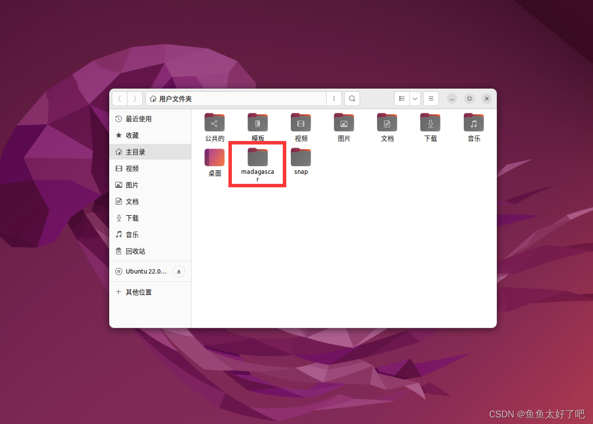
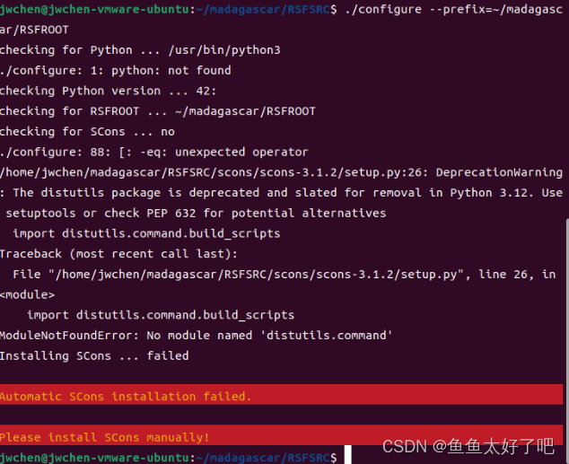
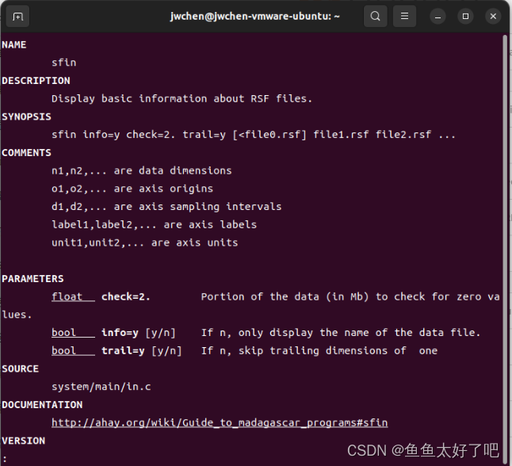
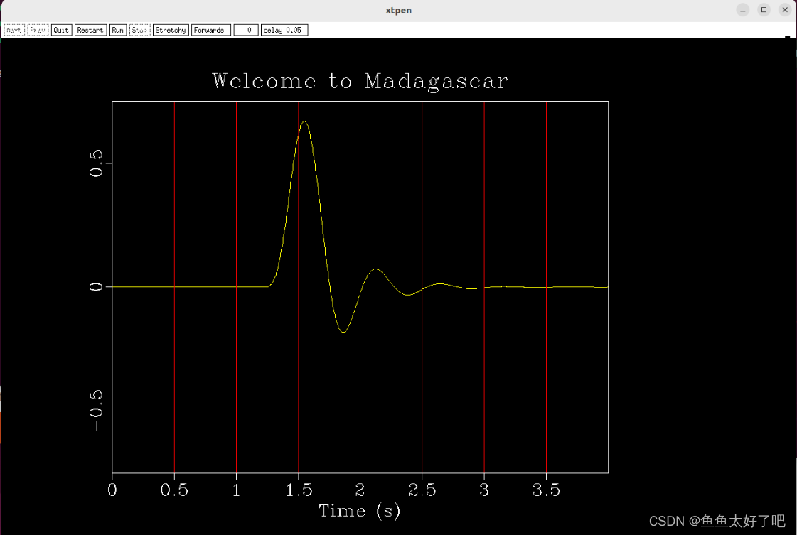
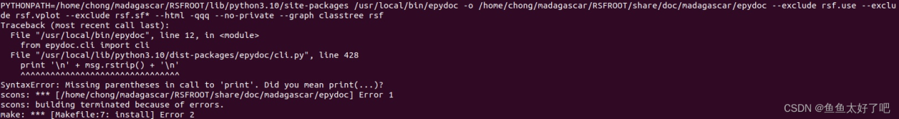

# Ubuntu22.04系统下安装地震数据处理软件Madagascar

## 目录

-   [前言](https://blog.csdn.net/qq_45317164/article/details/128490125#_4)

-   [安装之前的准备](https://blog.csdn.net/qq_45317164/article/details/128490125#_22)

-   [系统版本：Ubuntu22.04](https://blog.csdn.net/qq_45317164/article/details/128490125#Ubuntu2204_23)

-   [建议的软件目录](https://blog.csdn.net/qq_45317164/article/details/128490125#_28)

-   [软件下载](https://blog.csdn.net/qq_45317164/article/details/128490125#_41)

-   [环境（依赖库）安装（重要）](https://blog.csdn.net/qq_45317164/article/details/128490125#_56)

-   [编译和安装](https://blog.csdn.net/qq_45317164/article/details/128490125#_173)

-   [环境变量配置](https://blog.csdn.net/qq_45317164/article/details/128490125#_197)

-   [安装结束](https://blog.csdn.net/qq_45317164/article/details/128490125#_215)

-   [结语](https://blog.csdn.net/qq_45317164/article/details/128490125#_229)

-   [安装过程可能遇到的问题](https://blog.csdn.net/qq_45317164/article/details/128490125#_232)

-   [epydoc](https://blog.csdn.net/qq_45317164/article/details/128490125#1epydoc_234)

-   [Make过程中的_byte2tif.c编译错误（2023年4月1日版本）（后续已修复）](https://blog.csdn.net/qq_45317164/article/details/128490125#2Make_byte2tifc202341_240)

前言

Madagascar
是一款开源的地震数据处理软件，其不仅提供了地震数据处理所需要的各类软件包，还为数据处理提供了有力的编程环境。更多关于Madagascar
的介绍和使用方法，可以参考官方wiki页面：

Madagascar Main Page(ahay.org)

下面是摘自官方wiki介绍：

Madagascar is an open-source software package for multidimensional data
analysis and reproducible computational experiments. Its mission is to
provide:

a convenient and powerful environment

a convenient technology transfer tool

for researchers working with digital image and data processing in
geophysics and related fields. Technology developed using the Madagascar
project management system is transferred in the form of recorded
processing histories, which become "computational recipes" to be
verified, exchanged, and modified by users of the system.

下面是Prof. Yang Liu 在Madagascar School on Open-Source Geophysics in
Hefei 2020\*为Madagascar做的介绍PPT：

Introduction to Madagascar Software Project - Yang Liu

Madagascar软件github页面：https://github.com/ahay/src，你可以在这里找到软件的最新release。如果你的网络访问github存在问题，可以考虑使用gitee，具体使用方法此处不展开，放上一个gitee搜索页面：Gitee搜索:Madagascar。

\*注：不定期会有Madagascar相关的活动在高校之间举办，可以参考Madagascar
Conferences页面寻找更多信息。

## 安装之前的准备

系统版本：Ubuntu22.04

这里使用Ubuntu版本为22.04，不同的操作系统版本可能存在细微的差别，下面的教程可以提供一个参考，同时，不同Linux发行版本的安装教程可以参考官方提供的安装教程Madagascar
Installation和Madagascar Advanced
Installation(针对不同Linux发行版本)，我在去年写过一篇Windows下Ubuntu
WSL环境的Madagascar安装教程，有需求也可以参考Windows11/10
环境下安装Madagascar (WSL Ubuntu)。

如果你使用的是Vmware虚拟机，你需要提前安装好操作系统。关于Ubuntu-22.04操作系统的安装（包括虚拟机安装）网上有许多详尽的教程，此处不做赘述。

## 建议的软件目录

如果你精通linux或者对其有一定的了解，这一步可以略过。

在下载软件源文件之前，建议提前规划好软件的源文件存放目录和软件安装目录，由于Linux存在用户权限的问题，建议将软件所有文件放在用户目录下，以免产生不必要的麻烦。如果你对linux的使用并不熟悉，请使用下面给出的推荐的软件源文件和软件安装目录：/home/用户名/Madagascar/，或者相对目录\~/Madagascar/：

/home/用户名/Madagascar/

├── RSFSRC

│ ├── 这里存放Madagascar软件的源文件

├── RSFROOT

│ ├── 这里为Madagascar软件（使用configure prefix参数设置，下文会讲到）

如下图所示，源文件RSFSRC和软件目录RSFROOT均存放在用户文件夹的Madagascar目录下：

## 软件下载

你需要提前准备好**Madagascar**源文件，推荐使用如下命令(包含了构建和进入推荐的目录文件夹)：

#构建和进入目录

cd \~ & mkdir madagascar

cd madagascar

#使用git命令clone源文件

git clone https://github.com/ahay/src RSFSRC

等待git命令clone结束即可进入下一步。如果git命令提示无法访问（经常会出现的问题）可以多尝试几次，也可以考虑使用gitee，相关的教程网上有很多也很详细，此处不再赘述。

还可以通过github下载压缩包，解压到对应的RSFSRC目录下(/home/用户名/madagascar/RSFSRC/)：https://github.com/ahay/src

## 环境（依赖库）安装（重要）

环境安装是Madagascar安装中最重要也是最容易忽略的一环，这一步关乎Madagascar中许多模块是否能够正确安装启用。注意：除了安装依赖库以外（该用sudo的时候会提到），请不要使用root用户或者管理员权限(sudo)。

首先进入克隆或者下载好的源文件目录（如果在上一步的软件下载中你没有按照推荐的目录下载或克隆，请使用你自己下载的目录而并非下面给出的目录，后面许多步骤也一样，读者请自行进行替换）。使用configure进行配置，prefix参数指定安装文件夹，如果你对linux使用不是很熟悉，建议使用下面的目录。

#进入目录

cd \~/madagascar/RSFSRC

#使用configure查看环境(prefix=后面是你想安装Madagascar的位置，建议使用下面的目录)

./configure \--prefix=\~/madagascar/RSFROOT

一般来说，直接使用configure会出现错误，而且这个报错信息会比较迷惑，如下图所示。参考下面的步骤可以解决这个问题。

首先，Ubuntu22.04虽然自带Python3.10，但是无法直接使用python命令，而只能使用python3命令。所以我们首先给python创建一个软链接（其实是复制）：

#查看python命令是否合法

which python

#一般来说（如果是刚刚安装好的ubuntu22.04系统），这个命令没有输出

#或者使用下面的命令，一般来说会提示找不到命令"python":

python \--version

#如果没有出现"找不到命令\'python\'"，而是输出了对应的3.10版本号的话，下面这一步可以跳过

#需要管理员权限(sudo)

sudo cp /usr/bin/python3 /usr/bin/python

**注：如果你有更完善的python环境配置（例如anaconda），这一步请注意自行调整。**\
创建完python3到python的软连接之后，再使用which python或者python
\--version命令的话应该是有输出的，如下图所示：

建立完软连接之后，再使用configure依旧会报错，如下图所示，不过这个报错提示比较有针对性：没有安装pip。

#第二次configure

./configure \--prefix=\~/madagascar/RSFROOT

包括pip在内的其他依赖库可以参考官方页面的依赖库安装教程[**Madagascar** Advanced
Installation](https://www.reproducibility.org/wiki/Advanced_Installation#Platform-specific_installation_advice)解决，下面给出Ubuntu22.04版本的解决方案（依然是参考官方的教程）。

#安装python pip 和必要的numpy包

sudo apt-get install pip

#虽然不推荐使用sudo安装numpy，但是只有这样才能在软件configure的时候识别到。

#使用sudo安装一般会有如下WARNING：

#WARNING: Running pip as the \'root\' user can result in broken
permissions and conflicting behaviour with the system package manager.
It is recommended to use a virtual environment instead:
https://pip.pypa.io/warnings/venv

sudo python -m pip install numpy

#安装有关依赖

sudo apt-get install libxaw7-dev freeglut3-dev libnetpbm10-dev \\

libgd-dev libplplot-dev libavcodec-dev libcairo2-dev \\

libjpeg-dev swig g++ gfortran libopenmpi-dev libfftw3-dev \\

libsuitesparse-dev scons

上面的安装结束之后，再使用configure便可以合理的输出了。当然，可以再对各项输出进行检验。例如，如果你的电脑有支持cuda的显卡并且有意使用的话，可以在进行下一步的安装之前将cuda环境配置好，由于这一部分并不通用且网上相应的教程也很多也比较详细，此处不多赘述。

注意：如果你的系统下安装了cuda(nvcc
\--version可查看cuda版本)，最好确认其版本不过高，目前已知cuda-12.0在下面的make过程会报错而cuda-11.0不会，如果你在make过程中遇到了与cuda相关的(编译器为nvcc而不是gcc)问题，可以考虑降低系统的cuda版本。

#第三次configure

./configure \--prefix=\~/madagascar/RSFROOT

按理来说，输出应该是下面这样：

checking for Python \... /usr/bin/python

checking Python version \... 3.10.4

checking for RSFROOT \... \~/madagascar/RSFROOT

checking for SCons \... /usr/bin/scons

checking SCons version \...
v4.0.1.c289977f8b34786ab6c334311e232886da7e8df1

Running RSFROOT=\~/madagascar/RSFROOT /usr/bin/scons config \...

scons: Reading SConscript files \...

checking platform \... (cached) linux \[ubuntu\]

checking for C compiler \... (cached) gcc

checking if gcc works \... yes

checking if gcc accepts \'-x c -std=gnu17 -Wall -pedantic\' \... yes

checking for ar \... (cached) ar

checking for rpc \... no

checking complex support \... yes

checking for X11 headers \... /usr/include

checking for X11 libraries \... /usr/lib/X11

checking for OpenGL \... yes

checking for sfpen \... (cached) xtpen

checking for ppm \... yes

checking for tiff \... yes

checking for GD (PNG) \... yes

checking for GD (GIF) \... yes

checking for plplot \... yes

checking for ffmpeg \... yes

checking for cairo (PNG) \... yes

checking for cairo (SVG) \... yes

checking for cairo (PDF) \... yes

checking for jpeg \... yes

checking for BLAS \... yes

checking for LAPACK \... yes

checking for SWIG \... (cached) /usr/bin/swig

checking for numpy \... (cached) yes

checking API options \... (cached) \[\]

checking for C++ compiler \... (cached) g++

checking if g++ works \... yes

checking if g++ accepts \'-std=gnu++17 -U\_\_STRICT_ANSI\_\_ -Wall
-pedantic\' \... yes

checking for MPICC \... (cached) /usr/bin/mpicc

checking if /usr/bin/mpicc works \... yes

checking for MPICXX \... (cached) /usr/bin/mpicxx

checking if /usr/bin/mpicxx works \... yes

checking for MPIRUN \... (cached) /usr/bin/mpirun

checking for Posix threads \... yes

checking for OpenMP \... yes

checking for CUDA \... (cached) no

checking for FFTW \... yes

checking if FFTW supports threads \... yes

checking for SuiteSparse \... yes

checking for pfft \... no

scons: done reading SConscript files.

scons: Building targets \...

shell_script(\[\"env.sh\"\], \[\])

shell_script(\[\"env.csh\"\], \[\])

scons: done building targets.

Done with configuration.

参考上面的输出，如果你和上面所展示的一样，大部分需要的条目都是'yes'，便可以继续下一步的安装。

## 编译和安装

在configure没有问题之后，便可以开始编译和安装。只需要一个简单的命令：

#以防万一（如果你在这个目录下，可以忽略这个cd命令）。

#当然，如果你自定了源文件目录，请使用你的自定目录。

cd \~/madagascar/RSFSRC

#编译和安装

make && make install

由于相关的源文件比较多，编译时间通常会比较长。编译结束之后，你会看到如下图所示的输出（就是在提示你已经编译安装完成要配置环境变量）。接下来便可以进行环境变量的配置。

To start using madagascar, source env.sh or env.csh from:

/home/用户名/madagascar/RSFROOT/share/madagascar/etc/

Local documentation center at:

/home/用户名/madagascar/RSFROOT/share/doc/madagascar/

Documentation wiki at http://www.ahay.org

## 环境变量配置

最后一步，配置环境变量。参考上面的提示，打开你的终端配置文件
\~/.bashrc。Ubuntu22.04默认的终端是bash，所以这里用
\~/.bashrc做参考。当然，如果你在使用其他的shell如zsh等，打开相应的配置文件即可。

如果你使用的带有图形界面的Ubuntu，你可以使用Ubuntu自带的gedit打开：

gedit \~/.bashrc

当然，你也可以使用vim（Ubuntu22.04应该是不自带vim的）或者其他文本编辑软件。

然后使用图形界面进行文本编辑。在文件的最后追加一行：

#下面使用的是上面推荐的RSFROOT的目录地址，如果你在安装时自定了安装目录，请使用你的自定安装目录

source \~/madagascar/RSFROOT/share/madagascar/etc/env.sh

你甚至可以用echo命令完成上面的步骤：

#下面使用的是上面推荐的RSFROOT的目录地址，如果你在安装时自定了安装目录，请使用你的自定安装目录

echo \'source \~/madagascar/RSFROOT/share/madagascar/etc/env.sh\' \>\>
\~/.bashrc

## 安装结束

环境配置结束之后，你便完成了**Madagascar**的安装工作。打开一个新的终端，或者在旧的终端使用source
\~/.bashrc
命令，你便可以调用**Madagascar**相关的软件模块了。以sfin为例：

sfin

会输出对应的模块说明文档(键入q可以退出该页面)：

你可以使用下面的命令查看图像输出：

sfspike n1=1000 k1=300 \| sfbandpass fhi=2 phase=y \| \\

sfwiggle clip=0.02 title=\"Welcome to Madagascar\" \| sfpen

其输出应该为：

## 结语

Madagascar是一款强大的开源数据处理软件，不仅仅限制于地震数据处理，其多样的软件模块为包括地震数据处理和图像处理在内的许多问题的解决提供了很好的软件环境。更多的Madagascar使用方法和教程可以参考官方网站Madagascar
Main
Page(ahay.org)。不定期会有相应的会议或者教学活动举办，可以关注Madagascar
Conferences，还可以关注开发者博客。以上这些内容在Main
Page里面都可以找到。后续还会有更多更丰富的内容，尽情期待！

## 安装过程可能遇到的问题

我的邮箱：cplusv_official@qq.com

### 1.epydoc

2023年1月4日更新：

由于系统中存在python2.x版本的epydoc，导致在make过程中使用的基于python3的scons和python2的语法不兼容而报错，

解决方法：

使用sudo pip uninstall epydoc移除epydoc

### 2.Make过程中的_byte2tif.c编译错误（2023年4月1日版本）（后续已修复） {#make过程中的_byte2tif.c编译错误2023年4月1日版本后续已修复 .标题3}

2023年4月8日2e4cf60已修复

由于当前版本的Madagascar存在bug，导致在make&make
install这一步中会出现如下错误：

\$ gcc -o build/user/fomels/sfbyte2tif -pthread -fopemp
build/user/fonels/\_byte2tif.o -lbuild/lib -lrsf -ln -lblas -llapack
-lblas -lgonmp-lfftw3f -lfftw3 -lfftw3f_threads -lfftw3_threads -ltiff

/usr/bin/ld: build/user/fomels/\_byte2tif.o: in function \'main\' :

\_byte2tif.c: (.text.startup+0x109): undefined reference to
\'write_JPEG_file\'

collect2 : error: ld returned 1 exit status

可以参考Github这篇issue：

\[BUG\] Fatal error while gcc building src/user/fomel/\_byte2tif.c (A
immature solution is suggested.) #287

解决方法（2种）：

下载前一个稳定版本的Madagascar进行安装。

如果采用当前版本，进入源文件目录下的user/fomel/（如果你按照我的推荐方案来的话应该是/home/你的用户名/madagascar/RSFSRC/user/fomel/）,打开该目录下的SConstruct文件，将其种的第129行的：

prog = env.Program(\'sf\'+conv,\'\_%s.c\' % conv,LIBS=libs+\[tiff\])

改成：

prog = env.Program(\'sf\'+conv,\[\'\_%s.c\' % conv,jpeg_o\]
,LIBS=libs+\[tiff\]+\[jpeg\])

即可正常make & make install。
