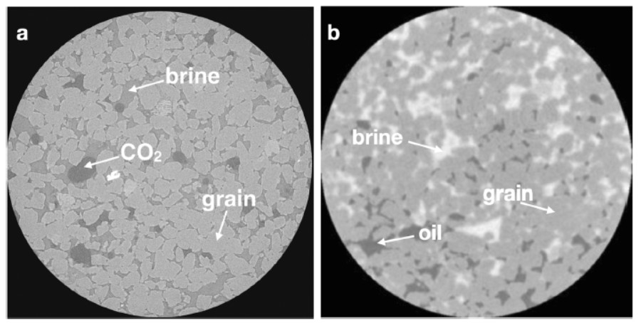
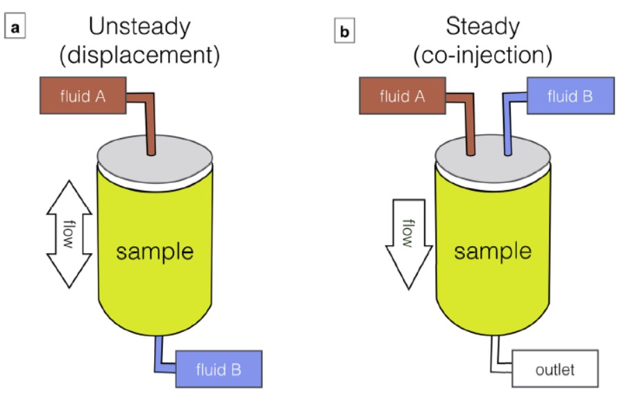
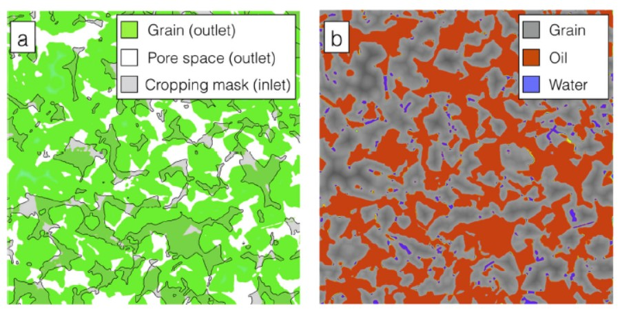
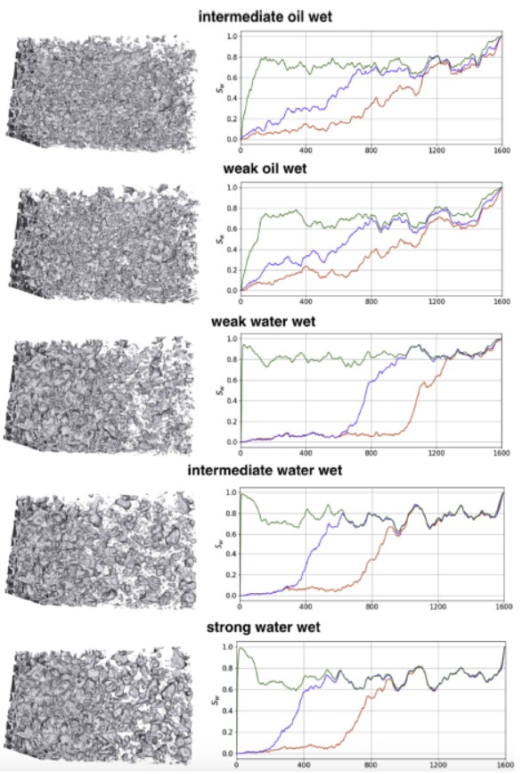

# LBPM
美国Virginia Tech, 橡树岭国家实验室和挪威国家石油公司Equinor联合研发的, 用于模拟透过数字岩芯的孔隙尺度两相流体动力学模型.

仿真传统的special core analysis laboratory (SCAL)实验。

模拟非恒定移动、固定饱和态下的恒定流动, 以及仿真离心机实验。

以上方法基于第一性原理，判断相对渗透率和毛细曲线和理解两相流动行为.

基于CT图像的多孔结构中的流体分析(a in-situ distribution of brine and CO2 within Bentheimer sandstone; b in-situ distribution of sodium iodide (NaI) doped brine and oil in Benntheimer sandstone)

SCAL试验:(a)样品岩芯底部的流体储层; (b) 入口同步注入2种流体获得恒定态的流量比例

Bentheimer砂岩的出口混合层
a a cropping mask is generated based on the shape of the porespace at the inlet (transparent grey); at the outlet any solid grain (green) that intersects with cropping mask is removed; b the resulting mixing layer prevents the mismatch at
the inlet / outlet from blocking flow pathways, supporting both large flow conduits through the large pores and film flow conduits along the grain structure. An analogous condition is applied at the inlet.

Simulations of water flooding using a flux boundary condition with Ca = 10?4: (left column) end-state oil distribution, where water and solid matrix are made transparent; (right column) local water saturation profiles along the flow axis, in which three representative global saturation of approximately 0.35, 0.45 and 0.72 is presented, corresponding to red, blue and green curves, respectively

## 参考文献
James E. McClure, et al. 2021. The LBPM software package for simulatingmultiphase flow on digital images of porous rocks. Computational Geosciences, 25: 871�C895.

