# MODFLOW6的输入和输出格式

## 引言

MODFLOW6没有GUI界面，命令行输入，读取ASCII文本文件或二进制文件。计算结果保存为ASCII文本文件或二进制文件。

MODFLOW6的数值方法和原理见单独的报告文件(Hughes and others, 2017;
Langevin and others, 2017; Provost and others, 2017; Langevin and
others, 2020; Hughes and others, 2022a; Langevin and others, 2022;
Hughes and others, 2022b)。

## 运行模拟

需要mfsim.nam文件，否则终止运行。可以查询运行参数：

mf6.exe -h

运行时创建输出文件mfsim.lst

## 输入指令的形式

为了增加输入文件的可读性，使用blocks and keywords

BEGIN

END

本报告的举例样式：

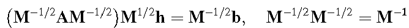

一个有效输入格式：

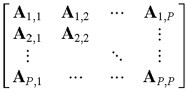

另一个有效输入格式：

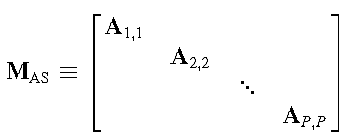

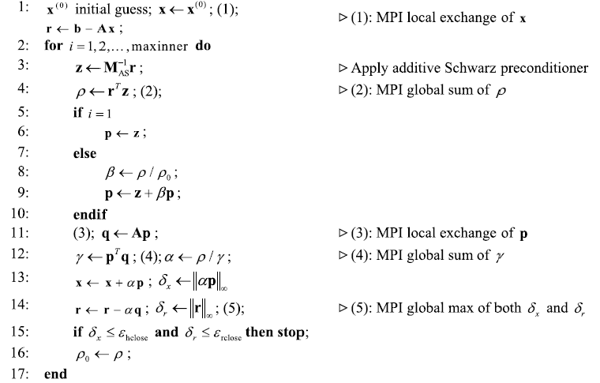

### 在OPEN/CLOSE文件中定义块信息

大部分的块信息可以从单独的文本文件读取，但有的块不支持OPEN/CLOSE功能。

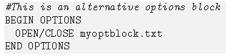

附录A Blocks列表（OPEN/CLOSE表示块信息是否能在单独的文件定义）

### 文件名输入

Windows不区分文件名大小写，但Linux系统区分。如MODEL.DIS

## 模拟名称文件

mfsim.nam

文件包含如下的输入块，必须以一定顺序列出。options块是可选的，还需要其他的一些块。

**块的结构**

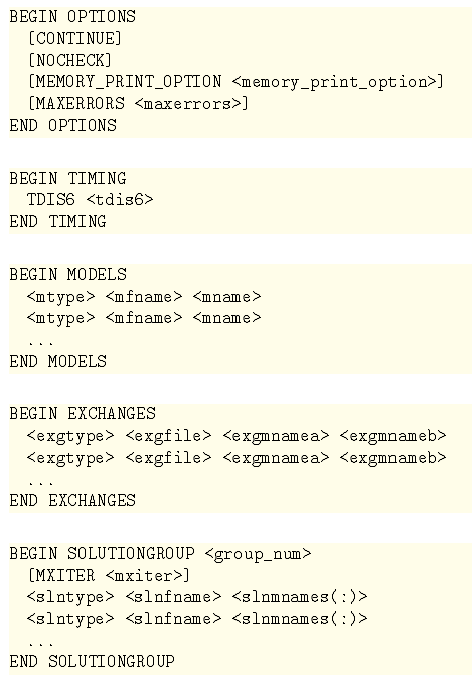

**变量解释**

**输入文件举例**

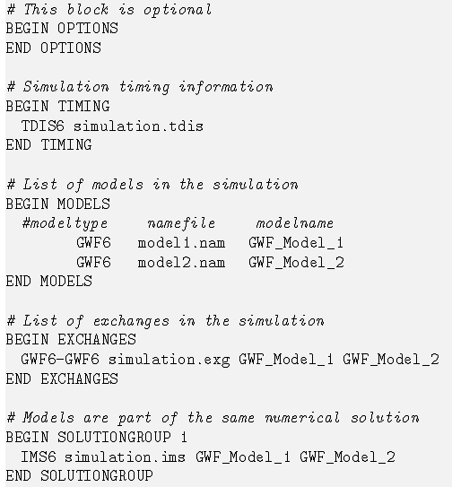

## 时间离散（TDIS）软件包

TDIS软件的输入都是从模拟名称文件中的TIMING输入块的TDIS文件读取。

## 自适应时间步(ATS)功能

在TDIS输入文件中激活定义ATS6选项，在TDIS软件包中使用Adaptive Time Step
(ATS)工具。

在PERIODDATA块中激活对任意stress
periods的自适应时间步长功能。如果是自适应的，则nstp和tsmult参数对时间步长推进没有影响。否则，使用定义的ATS设置控制时间推进。

目前的ATS实施的限制是：无法在驱动周期内显式定义保存输出的次数。在周期结束时获得输出，在周期内根据Output
Control时间步设置。Output Control设置保存结果是基于FIRST, LAST,
FREQUENCY和STEPS选项。

## GWF模型输入

GWF模型在模拟名称文件的MODELS块的GWF入口加入模拟（主程序）。

MODFLOW6的GWF模型有3种空间离散方法：DIS, DISV, DISU

### 给MODFLOW用户的建议

MODFLOW6包含了MOFLOW-2005, MODFLOW-NWT,
MODFLOW-USG和MODFLOW-LGR的大部分功能，但MODFLOW6的一些软件包分解、改名和删除了，一些功能由于内存限制不再使用了，如GWF模型的quasi-3d
confining units。

列举了MODFLOW6与之前版本的MODFLOW的主要差别(Langevin and others
(2017))：P16\~19，共20条不同。

输入输出文件和用户与计算机交互方面也有一些不同，见P19\~20，共9条。

### 数组输入(READARRAY)

DATA块的输入指令：

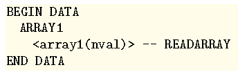

**READARRAY控制行**

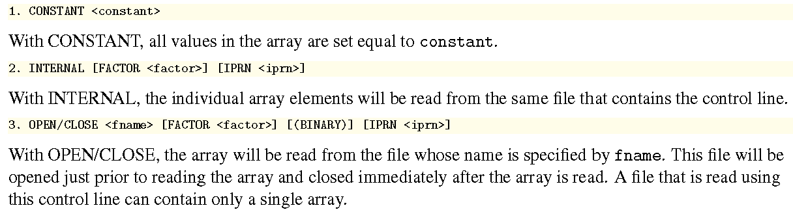

**READARRAY变量描述**

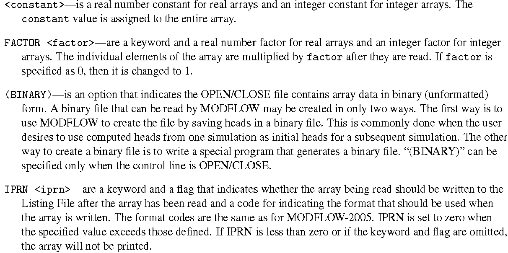

表4
IPRN代码及对应的数组读取格式，这些编码决定了用户提供的数组是如何写到列表文件的

**READARRAY举例**

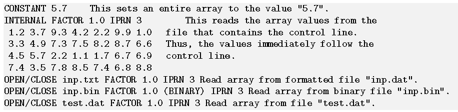

IC软件的GRIDDATA块

如果有可选的LAYERED关键词，则分层给定初始水头条件，适用于DIS和DISV，DISU不分层给定初始值。

对整个str数组设置初始值，则：

还有一些数组输入的说明如下：

-   List输入

-   长度和时间单位

-   恒定态模拟

-   水体收支

-   Cell-by-cell流动

### GWF模型名称文件

表5 Ftype值，Pname列表示软件包名称是否以名称文件提供

### 结构网格离散(DIS)输入

结构网格的离散信息从定义为DIS6的文件读取，一个模型仅可以定义一种离散输入文件(DISU6,
DISV6或者DIS6)。

### 节点的离散（DISV）输入

结构网格的离散信息从定义为DISV6的文件读取，一个模型仅可以定义一种离散输入文件(DISU6,
DISV6或者DIS6)。

DISV软件包的单元和单元节点的编号如图1。单元的节点列表必须是顺时针顺序。第1个节点号增加到节点列表的最后面，封闭多边形。因此，用户可决定是否封闭单元多边形。

图1 使用节点离散软件包定义的节点和单元的编号示意图

### 非结构离散（DISU）输入

结构网格的离散信息从定义为DISU6的文件读取，一个模型仅可以定义一种离散输入文件(DISU6,
DISV6或者DIS6)。

使用节点定义各单元的形状和位置。该信息是可选的，仅当DIMENSIONS块中定义了节点数(NVERT)才读取（上述信息），分配给大于零的值。如果文件中提供了节点和2D单元信息，则该信息也写出到二进制网格文件。提供该信息可能对后处理程序读取二进制网格文件有用。

DISU软件不支持分层的概念，与MODFLOW-USG的DISU不同。在MODFLOW6中，模型的所有网格输入和输出都使用DISU软件包，作为节点数规模的1D数组进入和写出。

所有模型都不需要DISU
VERTICES和CELL2D块。如果在NPF软件包中定义了SAVE_SPECIFIC_DISCHARGE或者使用XT3D，则需要这些块。通常建议包括VERTICES和CELL2D块。

### 初始条件(IC)软件包

使用IC6定义的文件类型读取IC软件包信息。一个GWF模型仅定义一个IC软件。

### Output Control (OC)选项

类型OC6的名称文件定义输出控制选项。如果没有OC6文件，使用默认输出控制。输出控制决定如何以及何时将水头输出到列表文件或写到单独的二进制输出文件。

水头的PRINT和SAVE选项，不再有指定单个分层的选项。只要这些数组的一个打印或保存，所有层都打印或保存。

### Observation (OBS) Utility for a GWF Model {#observation-obs-utility-for-a-gwf-model .标题3}

GWF模型观测值包括：模拟的地下水头(head)，计算的节点上的drawdown以及两个连接节点之间的流动(flow-ja-face)。各GWF模型观测类型需要的数据列于表6。对于flow-ja-face观测类型，负值和正值分别代表对ID定义的cellid的损失和收益。

### Node Property Flow (NPF) Package

与XT3D有关的软件包。

### Time-Varying Hydraulic Conductivity (TVK) Package

随时间变化的水力传导度(TVK)软件包，从NPF软件的OPTIONS块的TVK6记录定理的文件读取。

### Horizontal Flow Barrier (HFB) Package

从名称文件的HFB6类型的文件读取HFB软件包的输入。

### Storage软件包

从名称文件的STO6类型读取STO软件包的输入。如果模型不考虑STO软件，则不计算储水变化，模型将是恒定态。一个GWF模型仅定义一个STO软件。

### 随时间变化的存储(TVS)软件包 {#随时间变化的存储tvs软件包 .标题3}

在STO软件包的OPTIONS块的TVS6记录定义，读入TVS软件的输入。

### Skeletal Storage, Compaction, Subsidence (CSUB)软件包

从名称文件的CSUB6类型文件读取CSUB软件包的输入。CSUB软件包的技术细节参考Hughes
et al.,
2022b。如果模型中不考虑CSUB软件，则不计算由于密实导致的储水变化。一个GWF模型仅定义一个CSUB软件包。当GWF模型中使用CSUB软件时，仅第一个和最后一个stress
period可以在STO软件包中的STEADY-STATE定义。对各单元，在STO软件包中必须也要单位储水量SS定义为零。

Hughes, J.D., Leake, S.A., Galloway, D.L., and White, J.T., 2022b,
Documentation for the Skeletal Storage, Compaction, and Subsidence
(CSUB) Package of MODFLOW 6: U.S. Geological Survey Techniques and
Methods, book 6, chap. A62, 57 p.

在PERIOD块中的所有驱动力软件信息，将继续应用于接下来的驱动周期，直到模拟结束，或直到遇到其他PERIOD块。当遇到新的PERIOD块时，使用新的PERIOD块中的驱动力代替之前的块中的所有驱动力。注意：该行为与一些软件包（MAW,
SFR, LAK,
UZF）不同。为了关闭一个驱动周期的所有驱动力，一个PERIOD块必须不能定义有入口。如果一个PERIOD块不在第一个驱动周期定义，则直到文件的第一个PERIOD块的iper值之前都不会施加驱动力。

### 浮力(BUY)软件

变密度的地下水流

### 恒定水头(CHD)软件

在名称文件中从CHD6类型文件读取CHD软件包的输入。单个GWF模型可以有任意个CHD软件。但是，当CHD软件要设置一个GWF单元为恒定水头单元时，此时该单元在CHD软件包中已经分配为恒定水位单元，会发生错误。

之前版本的MODFLOW，不能将恒定水头单位转换为激活的单元。一旦一个单元分配为恒定水头单元，直到模拟结束前都是恒定水头单元。在MODFLOW6中，在接下来的驱动周期中，一个单元不是恒定水头单元，则之前的恒定水头单元可以转变为激活的单元。

在MODFLOW6中，在任何驱动周期内，任何恒定水头单元只能设定为一个水头值。必须使用时间序列功能来插值到单个时间步长上。

### 井(WEL)软件

在名称文件中的WEL6类型文件读取井(WEL)软件包的输入。单个GWF模型可以定义任意数目的WEL软件。

### 排水(DRN)软件

从名称文件中的DRN6类型的文件读取DRN软件的输入。一个GWF模型可以定义任意数目的DRN软件。

PERIOD块中的所有驱动软件信息，将继续施加到接下来的驱动周期，直到模拟结束，或直到遇到其他的PERIOD块。

### 河流(RIV)软件

RIV软件包不模拟河流内的地表水流动，仅考虑河流-含水层渗流。如果河流内的流动是重要的，则使用Streamflow
Routine软件（SFR）。因此，河段编号的顺序对RIV软件的计算结果没有影响，河道渗流对每个河段是独立计算的。

从名称文件中的RIV6类型的文件读取RIV软件的输入。一个GWF模型可以定义任意数目的RIV软件。

### 统一的水头边界(GHB)软件

从名称文件中的GHB6类型的文件读取GHB软件的输入。一个GWF模型可以定义任意数目的GHB软件。

### 补水(RCH)软件---基于列表的输入

### 补水(RCH)软件---基于数组的输入

### 蒸散发(EVT)软件---基于列表的输入

### 蒸散发(EVT)软件---基于数组的输入

### 多含水层井(MAW)软件

### 径流路径(SFR)软件

从名称文件中的SFR6类型的文件读取SFR软件的输入。一个GWF模型可以定义任意数目的SFR软件。但是，单独的软件包中的河段之间不能计算水流，除了使用MVR软件计算各软件包之间的水流传输。河段可定义为宽矩形横断面或使用测站编号-高度点的不规则横断面。不规则横断面在Streamflow
Routing Package Cross-Section Table Input File一节讨论。

必须显式地定义河段连接关系，程序可更方便地验证河网的连接关系。假设的河网的河段连接如图2。

这个软件包的输入文件很复杂，需要Python脚本程序来创建：SFRMaker

有3个局限性（参考原理手册）。

### 径流路径软件的断面输入文件

不规则横断面的测站-高程数据使用xfraction和高度数据定义（图3），使用河段的底部高程（RTP）转换为使用指定河段宽度（REID）和高程的测站位置。

### 湖泊(LAK)软件

在名称文件中读取LAK6类型的文件，LAK软件的输入。一个GWF模型可以定义任意数目的LAK软件。

### 湖泊的基于表的输入文件

### 不饱和区域流(UZF)软件

### 水流转移(MVR)软件

### Ghost-Node Correction (GNC)软件

从名称文件中读取类型GNC6文件，GNC软件的输入。每个GWF模型仅能定义一个GNC软件。

GNC软件有2个可选项对方程系统增加修改项。隐式选项（默认），对方程的左手边和右手边增加修改项，使用默认选项时，稀疏矩阵求解器的LINEAR块中需要定义BICGSTAB加速项。当对GNC软件定义EXPLICIT选项时，对右手边增加修改项，可使用CG或BICGSTAB加速方法。

### 地下水流(GWF)模型的交换

在模拟名称文件中，从GWF6-GWF6类型文件读取GWF-GWF Exchange的输入。

使用XT3D功能改进某些类型单元连接的水流计算精度时，表征地下水流的各向异性，不能实施GWF-GWF交换。

## 地下水物质输移(GWT)模型

地下水溶质输移模型，。。。

## 迭代模型求解

迭代模型求解（IMS）在模拟名称文件中的SOLUTIONGROUP块中定义。模型求解将求解所有添加到其中的模型，与模拟名称中定义的一致，将包括Numerical
Exchanges。IMS需要定义非线性和线性的设置。

## 观测(OBS)工具

MODFLOW6支持Observation工具，不需要输入观察的值。

观察工具提供提取在模型运行期间产生的考察区域的数值解。

观测工具不计算残差值，即观测与模型计算值之差。

观测工具生成的输出方便后处理。

观察工具的输入是从一个或多个输入文件读取，各文件与某个模型或软件包相关。对于提取GWF模型的模拟值，从软件包的OPTIONS块的OBS6关键词的文件读取。

各OBS6文件可包含一个OPTIONS块，和一个或多个CONTINOUS块。

观测值在各时间步末尾输出，表示在时间步期间MODFLOW6使用的值。当OBS工具的输入涉及没有某驱动周期内定义的驱动软件边界时，给定NODATA值。

OBS工具生成的输出文件可以是文本或二进制格式。二进制文件后缀是.bsv

### 可提供的模型观测类型

GWF模型

GWT模型

## 随时间变化的输入(Time-variable Input)

之前版本的MODFLOW，大多数驱动力边界软件以驱动周期为单位读取输入，这些读取的值在驱动周期内是恒定的。在MODFLOW6中，很多驱动力值可以定义为更高维度的时间分辨率（逐时间步长或更短的时间步长），使用两种时间变化方法之一来定义。边界数据读取以列表单元形式，称为"时间序列"的时间变化输入。以2D数组形式的边界数据称为"时间序列数组"。

插值方法有3种：STEPWISE, LINEAR, LINEAREND

### 时间序列

时间序列文件，在软件包的OPTIONS块中的关键词TS6
FILEIN。通常时间序列文件使用ts后缀。

在一个Package中使用时间序列

**使用时间序列定义软件包输入的例子**

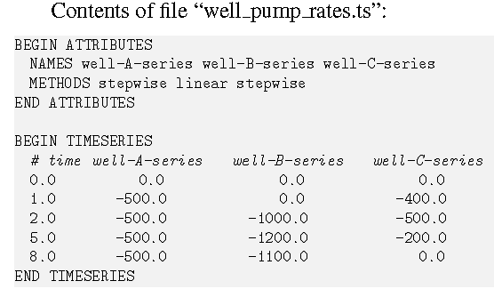

### 时间-数组序列

举例：

## GWF和GWT模型的二进制输出文件介绍

MODFLOW6计算结果可输出为二进制文件，有几种不同类型的二进制输出文件；（1）二进制网格文件，包含所有后处理程序的需要信息，快速重构模型网格及连接关系；（2）相关变量文件，包含模拟结果的二进制文件，如水头；（3）收支文件，包含连接单元之间的模拟水流和来自驱动软件的水流。

观测也写出到二进制输出文件。

输出变量为DOUBLE PRECISION变量和Integer变量。

二进制文件格式如后文介绍，输出频率和类型在Output Control
Option和各个软件包输入文件中描述。

### 二进制网格文件

文件后缀.grb，名称是离散输入文件名字。内容与离散软件包类型有关。GWF模型输出二进制网格文件，GWT模型不会输出。

**DIS Grids**

**DISV Grids**

DISV网格的二进制网格文件包含关于节点和哪些节点组成一个单元的信息。存储各节点的x,y坐标，存储在VERTICES数组。组成所有单元的节点列表存储于JAVERT数组。

使用IAVERT数组找到任意单元的节点列表。

节点列表是"封闭的"，各单元的第1个节点等于最后一个节点编号。

在DISV二进制网格文件中还存储IA和JA数组。这些数组描述单元连接关系。JA数组中的连接直接对应使用FLOW-JA-FACE记录，写出到收支文件。

DISV二进制网格文件的内容如下：

**DISU Grids**

DISU网格的二进制网格文件包含关于节点和哪些节点组成一个单元的信息，但这与是否用户提供了DISU软件包的信息有关。除了在NPF软件包中指定了XT3D或SAVE_SPECIFIC_DISCHARGE选项以外，都不需要。存储各节点的x,y坐标，存储在VERTICES数组。组成所有单元的节点列表存储于JAVERT数组。使用IAVERT数组找到任意单元的节点列表。节点列表是"封闭的"，各单元的第1个节点等于最后一个节点编号。

### 相关变量文件

MODFLOW6中，对于GWF模型TEXT值定义为HEAD，GWT模型的TEXT值定义为CONECNTRATION

单元分配一个IDOMAIN值为0或1.0x10^30^，干的单元分配为值-1.0x10^30^

当使用Newton-Raphson公式时不使用干的单元值。

**DIS Grids**

对每个驱动周期，时间步和层，数据保存为二进制输出文件，写出下面2个记录：

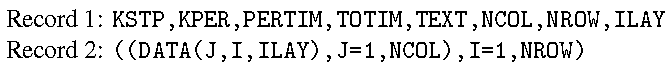

**DISV Grids**

**DISU Grids**

**先进的水流和输移软件包**

GWF模型的LAK, SFR和MAW软件包，GWT模型的LKT, SFT,
MWT和UZT软件包，的相关变量可保存为二进制文件。表33显示了这些软件包的相关变量的文本识别号与描述。

### 模型收支文件

MODFLOW6可选择性地输出收支文件，也称之为cell-by-cell水流文件。收支文件保存为二进制格式，可使用如ZONEBUDGET程序做后处理。GWF和GWT模型的收支文件包含单元间水流和溶质流动、由于储水变化的流动、来自驱动软件包和先进的驱动软件的流动、与其他模型的交换流动等。收支文件的内容包含所有进出单元的流动。用户必须激活Output
Control Package和某软件包中的保存流动项开关。

**收支文件的格式**

下面介绍收支文件的一般形式，这样能创建工具读取收支文件。下面介绍不同网格类型的文件内容。

**单元间流动**

离散类型的变化

GWF模型的收支文件内容

### 观测输出文件

当使用BINARY选项打开一个观测输出文件（见OBS工具），输出文件有如下形式。Record
1有100 bytes长度。

## 参考文献

Hughes, J.D., Russcher, M.J., Langevin, C.D., Morway, E.D., and
McDonald, R.R., 2022a, The MODFLOW Application Programming Interface for
simulation control and software interoperability: Environmental
Modelling & Software, v. 148, 105257
