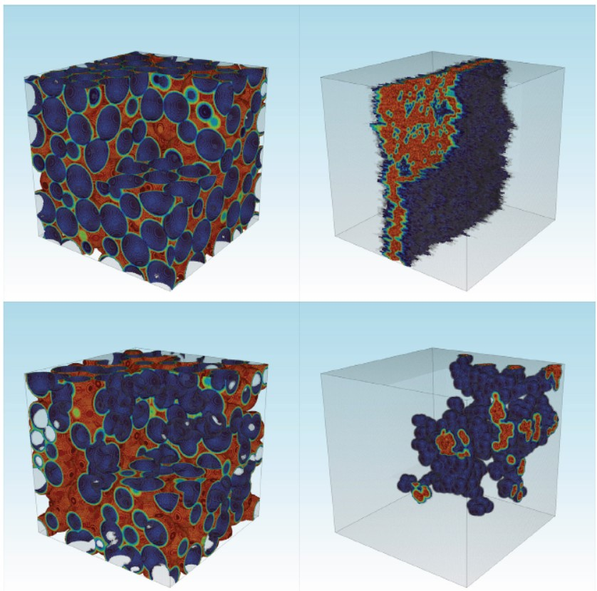
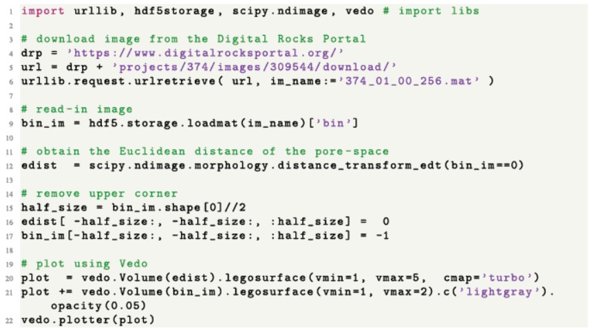

# 数字岩芯可视化
The term ‘digital rock’ refers to a computational model of a porous medium in 2D or 3D whose source is either an actual image of a rock or soil (e.g., an x-ray microtomography image), or it is based on a model (e.g., calculated via process-based simulations of sediment transportation and deposition stochastic realization from a geostatistical model).

## Digital Rocks Portal
Digital Rocks Portal stores both actual images from a variety of imaging techniques and representative porous media models.

[数字岩芯库链接](https://www.digitalrocksportal.org)

根据不同类型，数字岩芯库中的文件分为10组. 这些数据是模拟石油-水通过孔隙的数学模型的输入文件。

岩芯孔隙空间的欧式距离可视化

下载和可视化的Python脚本

## 参考文献
Javier E. Santos, MichaelJ. Pyrcz, Ma Prodanovi. 2022. 3D Dataset of binary images: A collection of synthetically created digital rock images of complex media.Data in Brief, 40: 107797.

M. Prodanovic, M. Esteva, M. Hanlon, G. Nanda, P. Agarwal, Digital Rocks Portal: a repository for porous media images, 2015, https://www.digitalrocksportal.org/.10.17612
