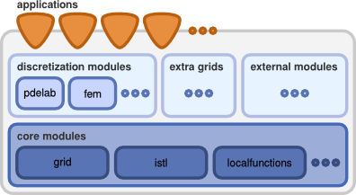

# DUNE Numerics

<https://dune-project.org/>

## DUNE

DUNE, the Distributed and Unified Numerics Environment is a modular
toolbox for solving partial differential equations (PDEs) with
grid-based methods. It supports the easy implementation of methods like
Finite Elements (FE), Finite Volumes (FV), and also Finite Differences
(FD).

DUNE is free software licensed under the GPL (version 2) with a so
called "runtime exception" (see
[**license**](https://dune-project.org/about/license)). This licence is
similar to the one under which the **libstdc++** libraries are
distributed. Thus it is possible to use DUNE even in proprietary
software.

The underlying idea of DUNE is to create slim interfaces allowing an
efficient use of legacy and/or new libraries. Modern C++ programming
techniques enable very different implementations of the same concept
using a common interface at a very low overhead. Thus DUNE ensures
efficiency in scientific computations and supports high-performance
computing applications.

Particular highlights are

-   a [generic grid
    interface](https://dune-project.org/doxygen/master/), allowing to
    interface a range of very different [grid
    implementations](https://dune-project.org/doc/grids)

-   the [Iterative Solver Template
    Library](https://dune-project.org/modules/dune-istl), featuring an
    algebraic multigrid preconditioner

-   Highlevel [interfaces for trial and test
    functions](https://dune-project.org/modules/dune-localfunctions) and [generic
    discretization modules](https://dune-project.org/groups/disc/)

-   [Python binding](https://dune-project.org/doc/pythonbindings) for
    the full grid interface and a flexible concept to provide bindings
    for user modules.

## Getting started

You want to install and use Dune on your machine and you are a complete
novice? Then this is the right place to start!

We will give a short introduction to Dune and guide you through the
installation process.

## What is Dune?

Dune is a software framework for the numerical solution of partial
differential equations (PDEs) written in C++. This means that it
provides a set of classes that help you to write your own PDE solver. It
is not an application with a fancy graphical user interface that you can
just run, type in your PDE and look at the result. Instead you write a
C++ program that includes various pieces from the framework and glues
them together to solve a particular PDE with a particular method. It is,
however, quite flexible in letting you implement various different
solution procedures. Dune does also provide Python bindings for a large
part of its core features which can help with the rapid prototyping of
new code or for pre- and postprocessing tasks.

## Installing Dune

It is important to note that installation of Dune requires a computer
system with a relatively recent operating system, either Linux or Apple
MacOS. Windows is not officially supported, but installation can be done
via virtualization, see [[installation on
Windows]{.underline}](https://dune-project.org/doc/installation/installation-windoze-wsl).
There are a number of different ways how to install and use Dune on your
computer (*click on the links to follow the instructions*):

### Dune C++ binary packages

This is the most convenient way to get started if you do **not** want to
modify the Dune sources.

The details depend on the system you are using:

-   [[Installation on Debian and Ubuntu
    systems]{.underline}](https://dune-project.org/doc/installation/installation-deb)

-   [[Installation on Windows via
    WSL+Ubuntu]{.underline}](https://dune-project.org/doc/installation/installation-windows-wsl)

### Python packages via PyPI

[[Installation of Dune from the Python Package Index
(PyPi)]{.underline}](https://dune-project.org/doc/installation/installation-pip).
This is another very convenient way to install Dune which does not
require root access and works on a broad range of systems including
MacOS for which binary packages might not be available.

### Full installation from source {#full-installation-from-source .标题3}

Sooner or later you will most likely want to use the latest Dune
features or even add new features to the Dune code modules. This will
require you to [[build Dune from
source]{.underline}](https://dune-project.org/doc/installation/installation-buildsrc).

For convenience Peter Bastian maintains a set of scripts that
[[[automate the
installation]{.underline}]{.mark}](https://dune-project.org/doc/installation/installation-helper-script)
on Linux.

## Running a first example

### Your first example with C++

You can find a more detailed description of these first steps with some
background in the [[first
chapter]{.underline}](https://tu-dresden.de/mn/math/numerik/sander/ressourcen/dateien/sander-getting-started-with-dune-2-7.pdf) of
Oliver Sander's [[Dune
book]{.underline}](https://dune-project.org/doc/book/). It describes
installation from binary packages, installation from the source
repository, how to create your own Dune module, and also how to solve a
simple PDE with the Dune core modules.

### Your first example with Python

You can test the installation by constructing a simple structured grid.
Call python and then execute

**from** dune.grid **import** structuredGrid

grid = structuredGrid(\[0,0\],\[1,1\],\[10,10\])

print( grid.size(0) ) *\# should return 100*

grid.plot() *\# requires the installation of \`matplotlib\`*

For a more detailed description of the Python bindings take a look at
the section on the [DUNE grid
interface](https://dune-project.org/sphinx/content/sphinx/dune-fem/dune-corepy_nb.html)
as part of the [dune-fem
tutorial](https://dune-project.org/sphinx/content/sphinx/dune-fem/).

## Working with further Dune modules

[[dune-PDELab]{.underline}](https://dune-project.org/modules/dune-pdelab)

[[Instructions for installing from the
source.](https://dune-project.org/doc/gettingstarted/beginners-resources-pdelab)
and using the
[tutorials](https://dune-project.org/modules/dune-pdelab-tutorials/).]{.underline}

[[dune-fem]{.underline}](https://dune-project.org/modules/dune-fem)

[[Detailed instructions on how to install dune-fem and its Python
bindings using
pip.](https://dune-project.org/doc/gettingstarted/beginners-resources-dunefem).]{.underline}

# Installation of Dune from binary packages on Debian and Ubuntu systems

We assume that you are running a freshly installed Ubuntu 20.04 LTS with
no additional packages installed yet.

## Installing Dune core modules

To now install the precompiled main Dune packages run the following
commands:

sudo apt **install** libdune-grid-dev

sudo apt **install** libdune-uggrid-dev

sudo apt **install** libdune-istl-dev

You need root access in order to execute this command. The sudo command
will ask for your password and you need to be in the list of sudoers
(which is automatically the case for the user who has been created when
installing Ubuntu).

The command installs libraries and include files at appropriate places
in the system. Since Dune is a software framework that allows you to
write your own applications in C++ we also need some source code to
compile.

## Installing more Dune modules

There are a few more modules available in Debian based system, e.g. you
can run the following to install
the [dune-pdelab](https://dune-project.org/modules/dune-pdelab) and [dune-functions](https://dune-project.org/modules/dune-functions) package:

sudo apt **install** libdune-functions-dev

sudo apt **install** libdune-pdelab-dev

## Further tools

Most likely you will want to also install the following packages to be
able to build own code, visualize results and generate unstructured
meshes

sudo apt **install** git

sudo apt **install** cmake

sudo apt **install** gmsh

sudo apt **install** paraview

# Installation Dune and its Python bindings from PyPI

We have added installation support of Dune modules via pip using the
Python package index (PyPI). The module and the modules it depends on
are downloaded, build, and installed either into the system or into a
python virtual environment (the latter might be of more interest as it
is an option to install Dune without root privileges). This could also
be of interest for C++ users of Dune as Python bindings are not
mandatory. Scripts like dunecontrol and duneproject can be used the same
way as with a system installation so that installed and source modules
can easily be used together.

Starting with the 2.8 release, we are planning to upload stable release
versions as well as regular developer snapshots of all core modules.
That should make it easy for users to work with an installed Dune which
can be updated to a developer version if a newer feature is required.

Installing the main core modules (common, geometry, and grid) can be
easily installed into a virtual environment without requiring root
privileges by running

**python3** -**m** venv \~/dune-env

**source** \~/dune-env/bin/activate

pip install dune-grid

You should now be able to test with one of your own Dune modules or you
can run a Python test:

**python** -**m** dune.grid

**cd** grid_tutorial

**python** example.**py**

Simply remove \~/dune-env to get rid of everything.

To install the most recent development snapshot simply run

pip **install** \--pre dune-grid

All core modules are available on the Python Package Index (PyPI), as
well as some additional grid managers (e.g. pip install dune-alugrid),
and the discretization module dune-fem.

We have tested on a number of Linux distributions and on MacOS. On
Windows follow the [[WSL
installation]{.underline}](https://dune-project.org/doc/installation/installation-windows-wsl) and
instead of installing the binary packages use pip as described above.
Please report if you encounter any problems with the setup.

## Install from the Git repository

In addition to the stable release packages on PyPI, it is possible to
install the current development version from the Git repository via pip.
This will also install the current Git versions of all dependent Dune
modules.

For example, you can install dune-grid via

python3 -m venv \~/dune-env

source \~/dune-env/bin/activate

pip install
dune-grid@git+https://gitlab.dune-project.org/core/dune-grid.git

It is also possible to run

pip install .

within a cloned Git repositroy of some Dune module to download and
install all dependent module. After that

dunecontrol \--current all

can be used to configure and build the source module and replace the
installed python package with a editable source version.

## Known issue

If some software component was found through the environment
variable CMAKE_PREFIX_PATH then there might be problems later when
loading some shared libraries requiring to add those paths also
the LD_LIBRARY_PATH.

# Building from Source

Sooner or later you will want to use the latest Dune features or add new
features to the Dune code modules. On this page, we try to collect the
details on how to build Dune from source and how special features of the
tool chain work.

The text here covers the C++ part of Dune. If you want to use the Dune
Python bindings then you should read the [[Dune Python installation
instructions]{.underline}](https://dune-project.org/doc/installation/installation-pythonbindings) as
well.

**Note**: The process described below works for Linux/UNIX based
systems. On Windows systems follow the setup of
a [[WSL]{.underline}](https://dune-project.org/doc/installation/installation-windows-wsl) and
then proceed as described below.

Dependencies

In order to build DUNE you need at least the following software:

-   C++ compiler supporting c++-17 language standard,
    e.g. [[clang]{.underline}](https://clang.llvm.org/) \>=
    5, [[g++]{.underline}](https://gcc.gnu.org/) \>= 7

-   [[CMake]{.underline}](https://cmake.org/) \>= 3.13

-   [[pkg-config]{.underline}](https://www.freedesktop.org/wiki/Software/pkg-config/)

Detailed information on supported compiler and CMake versions can be
found in the [[release
notes]{.underline}](https://dune-project.org/releases) for releases and
in the list [[recent
changes]{.underline}](https://dune-project.org/dev/recent-changes) for
the development branch *master*. See also the [[FAQ
section]{.underline}](https://dune-project.org/doc/installation/installation-buildsrc/#faq) for
information about how to resolve the build dependencies.

The following software is recommended but optional:

-   MPI
    (e.g. [[OpenMPI]{.underline}](https://www.open-mpi.org/) or [[MPICH]{.underline}](https://www.mpich.org/))

-   Python Virtual Environment
    (e.g. [[python3-venv]{.underline}](https://wiki.ubuntuusers.de/venv/) or [[virtualenv]{.underline}](https://pypi.org/project/virtualenv/))

This will provide you with the core DUNE features.

Some DUNE modules might support further software. At the end of the
configuration process of each dune module, a list of found, optional and
required dependencies is listed.

## Getting the sources

First you need to download the DUNE core modules to your computer in one
common directory. You can either download [[tarballs of the last
releases of the core
modules]{.underline}](https://dune-project.org/releases) or
download [[directly from our git
repositories]{.underline}](https://dune-project.org/groups/core). Note:
If you download the modules directly from git make sure to checkout a
release branch if you don't want to work with the current development
version.

For instance, create a directory and clone the core modules:

mkdir dune; cd dune

git **clone** https:*//gitlab.dune-project.org/core/dune-common.git*

git **clone** https:*//gitlab.dune-project.org/core/dune-geometry.git*

git **clone**
https:*//gitlab.dune-project.org/core/dune-localfunctions.git*

git **clone** https:*//gitlab.dune-project.org/core/dune-istl.git*

git **clone** https:*//gitlab.dune-project.org/core/dune-grid.git*

## Building DUNE modules

To compile the modules DUNE has to check several components of your
system and whether prerequisites within the modules are met. For the
ease of users we have designed a custom utility on top of
CMake, dunecontrol. This can be found in the directory dune-common/bin/.

The typical way to run dunecontrol is using an options file and execute:

./dune-common/bin/dunecontrol *\--opts=config.opts all*

This will configure and build all modules you have downloaded in the
order of resolved dependencies.

The config.opts file contains, e.g.,

CMAKE_FLAGS=\"-DCMAKE_BUILD_TYPE=Release\"

See below for more details on the options file.

More generally, you can separately run

./dune-**common**/bin/dunecontrol \[OPTIONS\] cmake \[CMAKE_FLAGS\]

./dune-**common**/bin/dunecontrol \[OPTIONS\] make \[MAKE_FLAGS\]

in order to first configure and then build all modules with the given
flags.

From now on, we assume that dunecontrol is in your PATH, e.g., by
running

echo \'export PATH=/path/to/dune-common/bin:\${PATH}\' \>\>
\${HOME}/.bashrc

source \${HOME}/.bashrc

## Building other DUNE modules

Besides the core modules you can find lots of other dune modules:

-   [[Grid Modules]{.underline}](https://dune-project.org/groups/grid)

-   [[Discretization
    Modules]{.underline}](https://dune-project.org/groups/disc)

-   [[Extension
    Modules]{.underline}](https://dune-project.org/groups/extension)

-   [[Tutorial
    Modules]{.underline}](https://dune-project.org/groups/tutorial)

If you want to use one of those modules make sure to download the module
and all dependencies in the same common directory as the DUNE core
modules. Building your modules is done in the same way as building the
core modules by calling dunecontrol.

Building a specific DUNE module (and its dependent modules)

You can instruct dunecontrol to build only a certain dune module, using
the \--only=\<module_name\> switch. Running dunecontrol script

dunecontrol \--**only**=\<module_name\> **all**

where \<module_name\> is the name of that particular module given in
the dune.module file, will build only the module \<module_name\>.

If you want to build a module and the modules it depends on, you must
run:

dunecontrol \--module=\<module_name\> **all**

### Changing build mode and optimization flags

The flags passed to the compiler are controlled by CMake. Thus, in order
to change these flags, you have to add a CMAKE_FLAG responsible for
compiler (and/or linker) options.

One can either specify a global build mode:

dunecontrol cmake
-DCMAKE_BUILD_TYPE=\[Debug\|M**in**SizeRel\|RelWithDebInfo\|Release\]

(see [[CMake
documentation]{.underline}](https://cmake.org/cmake/help/latest/variable/CMAKE_BUILD_TYPE.html) for
a more detailed description of the CMake option)

or you can specify compiler flags explicitly, e.g.,

dunecontrol cmake -DCMAKE_CXX_FLAGS=\"-O3 -DNDEBUG -march=native\"

This is equivalent to specifying both, the release more and the
additional -march=native flag:

dunecontrol cmake -DCMAKE_BUILD_TYPE=Release
-DCMAKE_CXX_FLAGS=\"-march=native\"

Both flags can be put into an options file, see below, or can be set by
specifying the CMAKE_FLAGS environmental variable:

CMAKE_FLAGS=\'-DCMAKE_BUILD_TYPE=Release
-DCMAKE_CXX_FLAGS=\"-march=native\"\' dunecontrol cmake

Note, if you do not specify anything, the CMake defaults are used which
essentially means: no code optimization.

Speeding up the build process

Building several DUNE modules can be quiet time consuming. Using a
concurrent build can speed this up. Either you can instruct make to use
multiple threads when building,

dunecontrol make -jN

or you can specify another make-system, like [[Ninja
build]{.underline}](https://ninja-build.org/), by setting a different
CMake generator:

dunecontrol cmake -GNinja

dunecontrol make

If parts of the code must be rebuild multiple times, a utility
like [[ccache]{.underline}](https://ccache.dev/) might be useful and can
be specified as a COMPILER_LAUNCHER in CMake:

dunecontrol cmake -DCMAKE_CXX_COMPILER_LAUNCHER=/path/to/ccache

(see [[CMake
documentation]{.underline}](https://cmake.org/cmake/help/latest/envvar/CMAKE_LANG_COMPILER_LAUNCHER.html) for
a more detailed description of the CMake option)

### Storing flags in an options file

As it is often not convenient to specify the desired options after
the dunecontrol call, one can pass the options via file specified by
the \--opts option:

dunecontrol \--opts=\<file\> COMMAND

Possible options for the options-file (or the environment) are

-   CMAKE_FLAGS: arguments passed to the cmake command

-   MAKE_FLAGS: arguments passed to the make command

-   BUILDDIR: build directory for an out-of-source build.
    default: build-cmake

-   CMAKE: executable to use for cmake

-   DUNE_CONTROL_PATH: A PATH variable to locate dune modules in its
    subdirectories, directories are separated by colon :

An example of an options file is

\# **set** build **mode** and **compiler** flags,

\# install **to** **a** custom directory,

\# disable the MPI library,

\# add **a** search path **for** external libraries

\# and use Ninja-build instead of **make** **as** the build-tool

CMAKE_FLAGS=*\"-DCMAKE_BUILD_TYPE=Release \\*

-DCMAKE_CXX_FLAGS=\\\"-march=native\\\" \\

-DCMAKE_INSTALL_PREFIX=/path/where/**to**/install/dune \\

-DCMAKE_DISABLE_FIND_PACKAGE_MPI=1 \\

-DCMAKE_PREFIX_PATH=\\\"/path/to/lib1;/path/to/lib2\\\" \\

-GNinja*\"*

## Details about the dunecontrol utility

The general structure of a dunecontrol call is

dunecontrol \[OPTIONS\] COMMAND

### Commands

The following atomic COMMANDs can be executed:

-   cmake: run the CMake system for each module and passes along the
    directories of the found dune modules

-   make: run make (or any other build tool that was configured) for
    each module

-   all: combination of cmake and make

-   exec: execute a command in each module directory

-   bexec: execute a command in each module's build directory

-   update: pull the latest version from the Git repository

-   git: run a specific git command in all module directories

### Options

The following general OPTIONS are available:

-   \--help: Show a detailed list of all options with description.

-   \--module=\<mod\>, \--only=\<mod\>, \--current, \--current-dep:
    Control which modules to build, see above.

-   \--builddir=\<dir\>: Make out-of-source builds in a subdir \<dir\>.
    This directory is created inside each module. If \<dir\> is an
    absolute path, the build directory is set to \<dir\>/module-name for
    each module.

-   \--opts=\<file\>: load default options from \<file\>

## Creating your own DUNE project module

You can create your own dune project module by using
the duneproject script available in dune-common/bin directory. Running
the script will create a directory with supporting files
(CMakeLists.txt etc.) and a sample .cc file. After creating the module
you can build this as explained above under "Building a specific DUNE
module".

The [[DUNE Build System
Documentation]{.underline}](https://dune-project.org/buildsystem) will
also give you an excellent introduction to the build system and how to
create new modules/projects your own.

## Installing DUNE in HPC Clusters

Cluster architectures often have a linux based system that is quiet
different from a desktop environment, with its own package management
system that needs special handling of the installation such that
everything is found properly. However, often it is enough to just load
the (build) dependencies and build DUNE using dunecontrol the classical
way as described above. There are also some *non-official* ways of
building DUNE in HPC environments, e.g.

-   There is a DUNE package for
    the [[Spack]{.underline}](https://spack.io/) package management
    system,
    see [[https://gitlab.dune-project.org/spack/dune-spack]{.underline}](https://gitlab.dune-project.org/spack/dune-spack) for
    more information

-   Installing DUNE in a system
    using [[EasyBuild]{.underline}](https://easybuilders.github.io/easybuild) is
    available for the [[DUNE core
    modules]{.underline}](https://docs.easybuild.io/en/latest/version-specific/Supported_software.html#list-software-dune-core-898) and [[DUNE-Fem
    and
    dependencies]](https://docs.easybuild.io/en/latest/version-specific/Supported_software.html#list-software-dune-fem-785).
    There are also other examples how to write the required description
    files for the software management system,
    see [[https://gitlab.mn.tu-dresden.de/spraetor/dune-easybuild]{.underline}](https://gitlab.mn.tu-dresden.de/spraetor/dune-easybuild) for
    further examples.

-   Some old instructions for the BlueGene-P system can be found in
    the [[Installation Notes for Blue Gene
    P]{.underline}](https://dune-project.org/doc/installation/installation-buildsrc/docs/installation-bluegenep).

Warning: those descriptions and tools are often provided just for a
single or a few DUNE releases and are sometimes outdated.

# Installation of DUNE from source via helper script

Here we demonstrate how to install Dune from source on Ubuntu 20.04 LTS.
This is the way to go if you want to have access to all of DUNE's source
files (e.g. because you want to inspect or modify them), to have more
control over the build process (e.g. change compiler flags or
enable/disable certain libraries) and also get dune-alugrid.
Consequently this way of installation is more complex than installation
from binary packages. We will simplify life by providing shell scripts
that do all the work.

We assume that you are running a freshly installed Ubuntu 20.04 LTS with
no additional packages installed yet. In order to install and run Dune
you first need to install the following packages (for this to work you
need sudo rights):

sudo apt **install** git

sudo apt **install** cmake

sudo apt **install** mpich mpich-doc libmpich-dev

sudo apt **install** zlib1g zlib1g-dev

sudo apt **install** paraview

sudo apt **install** gmsh

In order to automate the installation from source Peter Bastian provides
installer scripts. It downloads the following dune modules:

-   dune-common

-   dune-geometry

-   dune-grid

-   dune-alugrid

-   dune-istl

-   dune-localfunctions

-   dune-grid-howto

-   dune-uggrid

Just check out the following repository

git **clone**
https://conan2.iwr.uni-heidelberg.de/git/peter/dune-installer.git

and run the installer (choose a different folder for other Dune versions
or other setups):

./dune-installer/core-2.7**.1**/installer.sh my-dune-dir

Here my-dune-dir is the name of a new directory where you want your Dune
installation in. This will download and install the UG grid manager,
download all Dune core modules and create an opts-file and a
build-script.

Now you can run the build-script in the newly created directory:

**cd** my-dune-dir

./buildmodules.**sh**

If this does not work for you then you need to edit the installer script
in dune-installer/core-2.7.1/installer.sh and ask some expert (e.g on
the mailing list).

If all went well, where are the compiled files? The build-script sets up
things for a so-called 'out-of-core' build.

cd release-build

gets you to a directory that mirrors all dune-modules but with the
created files in it. In every subdirectory you will find a
link src_dir that will lead to the corresponding source directory that
created these files.
