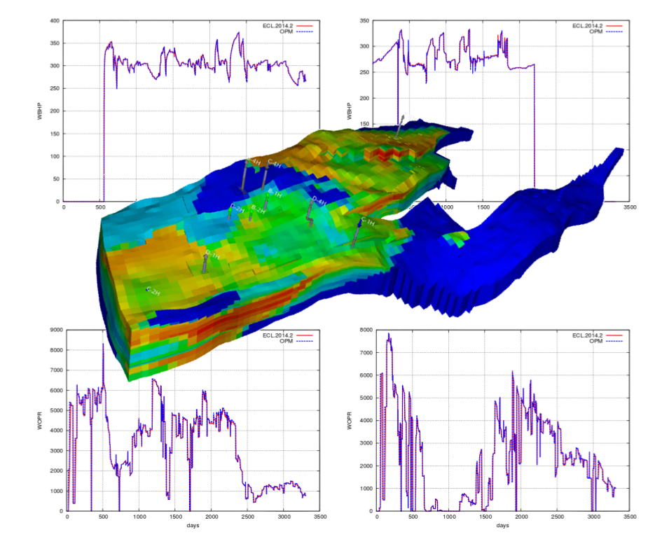
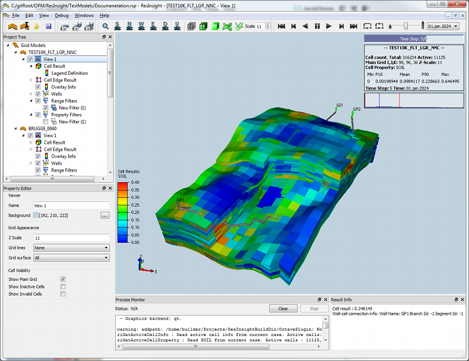

# **OPM--Open Porous Flow model**

## 特色

黑油模型(Black Oil model)

基于DUNE库、Zoltan库

MPI并行化, GPU异构并行的线性方程组求解器

## 本仓库文档

- [install](./install/)：源码安装、GPU 运行与 ResInsight
- [doc](./doc/)：原理与 Tutorials
- [DUNE](./DUNE/)：DUNE 库介绍与安装
- [ResInsight](./ResInsight/)：开源后处理
- [README-EN.md](./README-EN.md)：英文说明

## 参考文献

Atgeirr Flo Rasmussen, et al. 2021. The Open Porous Media Flow reservoir simulator. Computers and Mathematics with Applications 81: 159–185.

## DUNE

DUNE库的介绍与安装说明，见 [DUNE](./DUNE/)

## ResInsight

开源的后处理软件ResInsight，见 [ResInsight](./ResInsight/) 与 [install/install-ResInsight.md](./install/install-ResInsight.md)

## 相关文档

- [Underground](../)：学科入口
- [DuMux-3.6](../DuMux-3.6/)：同基于 DUNE 的多孔介质模拟
- [hpc-base](../../hpc-base/)：MPI、GPU、线性求解器
- [Turbulence/OpenFOAM](../../Turbulence/OpenFOAM/)：多孔介质 / 多相 CFD 对照
