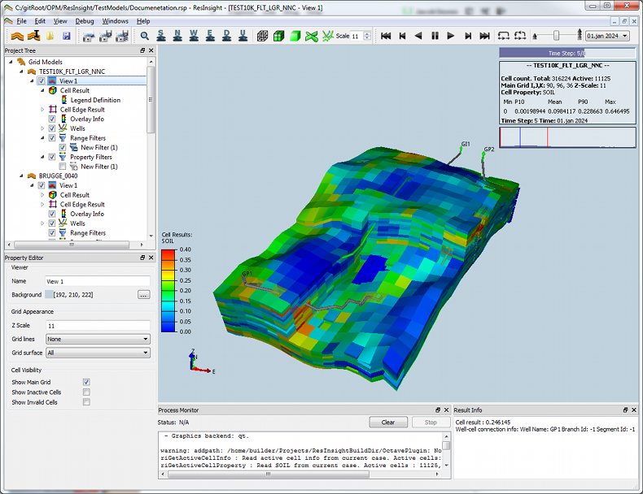

# **OPM--Open Porous Flow model**

## 特色

黑油模型(Black Oil model)

基于DUNE库、Zoltan库

MPI并行化, GPU异构并行的线性方程组求解器

## 参考文献

Atgeirr Flo Rasmussen, et al. 2021. The Open Porous Media Flow reservoir simulator. Computers and Mathematics with Applications 81: 159C185.

# DUNE

DUNE库的介绍与安装说明

# ResInsight 

开源的后处理软件ResInsight 

