# Visualizing the solution with ResInsight

*Note: the rest of this guide was made with a version of ResInsight that
is no longer current, the current version looks different, although the
principles should be the same.*

The field data (3D data, typically per cell) is typically written to
restart files. For the current case, you will find this in the file
NORNE_ATW2013.UNRST (a unified restart file).

We will now open the case in ResInsight to look at some solution
variables. You can click on the pictures to see a larger version.

First we need to import the case. Click the *Import Eclipse
Case* button.

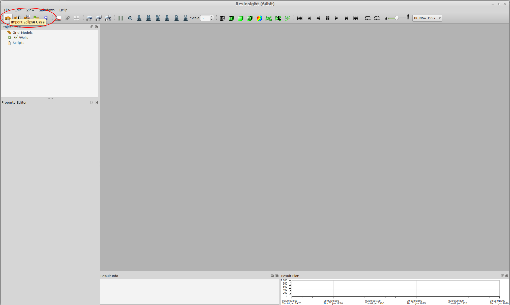

Navigate to the directory containing the output (out_serial if you
followed the instructions earlier) and choose the EGRID file.

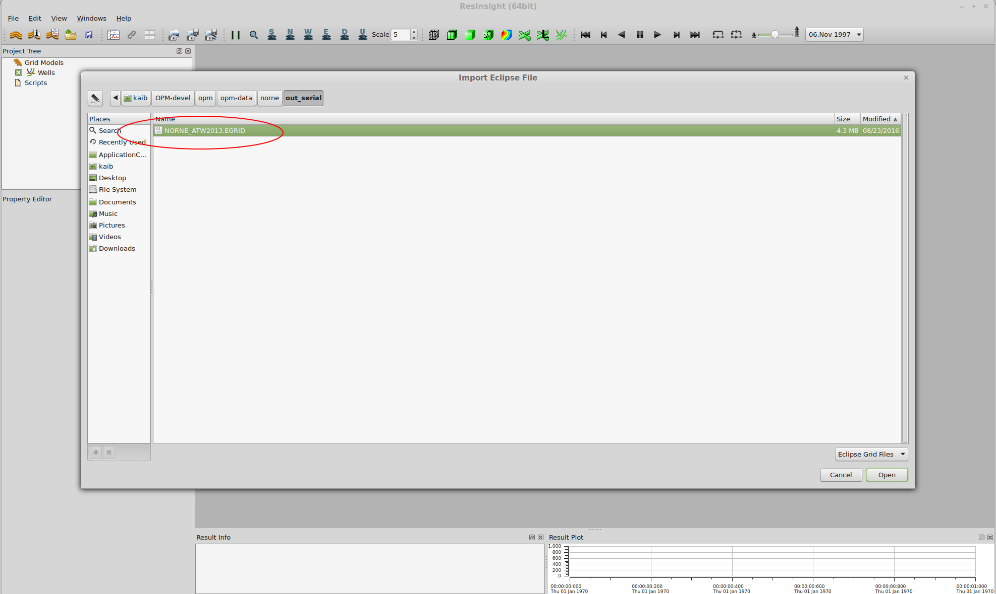

The case should open, looking like this:

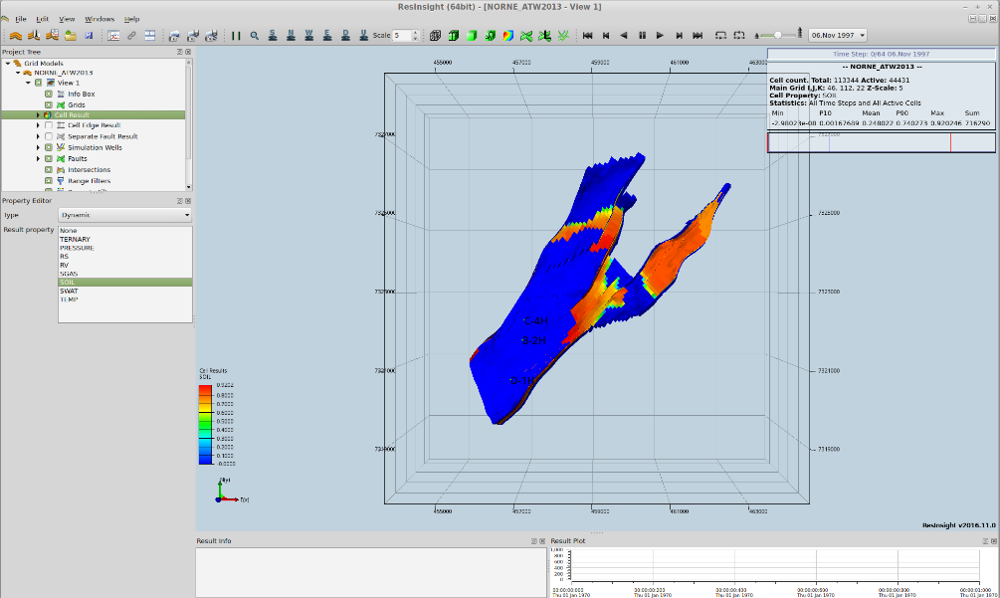

You can rotate and zoom to get a better view. Use the right mouse button
to rotate, the middle button to zoom and the left button to move the
view.

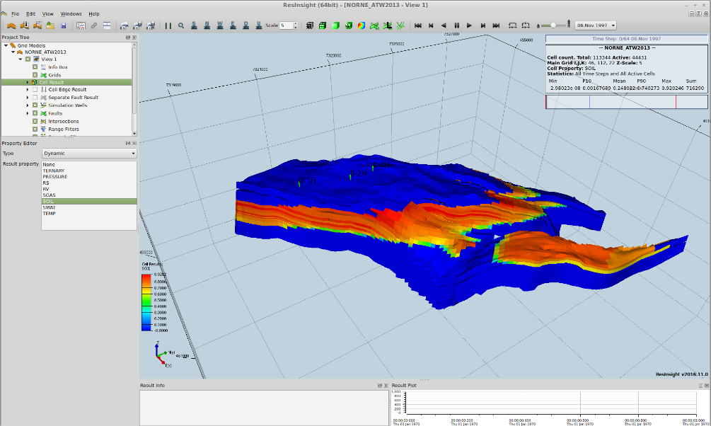

By default, we are looking at the oil saturation. Now we want to look at
all phase saturations using a ternary color scheme. Click on
the *TERNARY* line in the property editor.

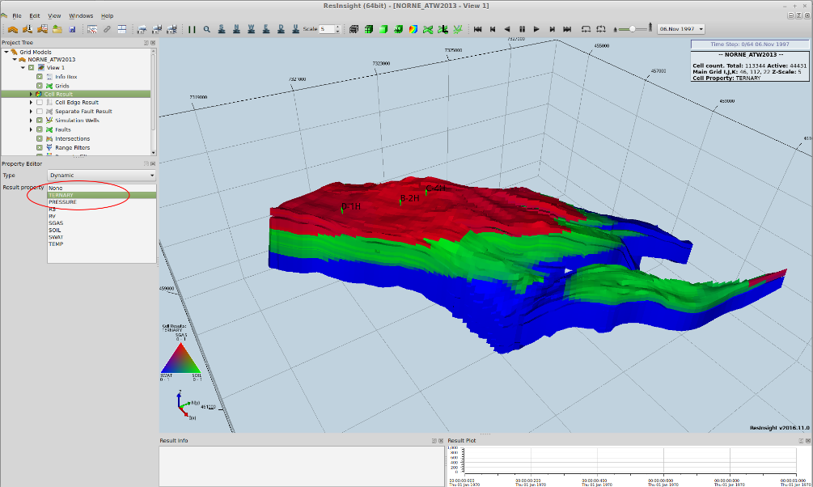

The wells are not as visible as we'd like, so we will change how they
are displayed. Click *Simulation Wells* in the *Project Tree* view, then
choose *Top of active cells BB* for *Well head position*. Now the well
heads are shown at the edge of the full bounding box, and stand out
better. Also we'll change the *Well label color* to white.

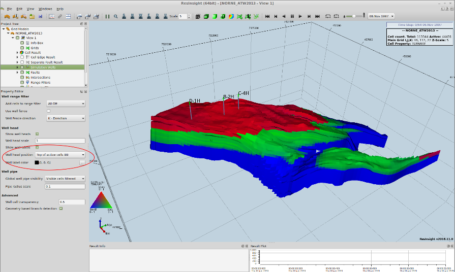

Then we'll animate the results, click the *Play* button as shown.

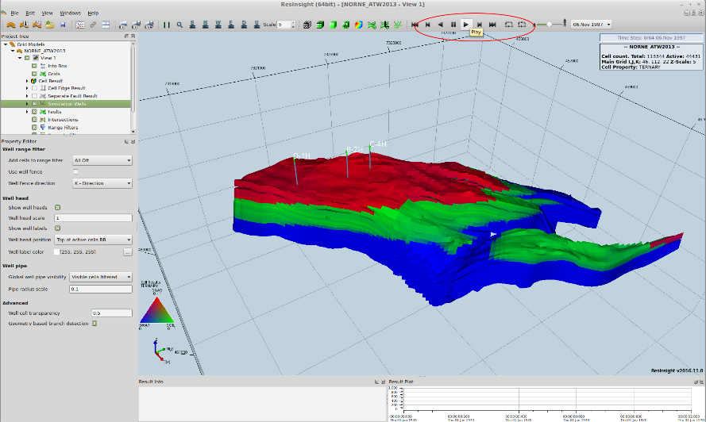

By clicking *Pause* you can stop at any timestep of your choosing. Note
that the number of wells change during the simulation.

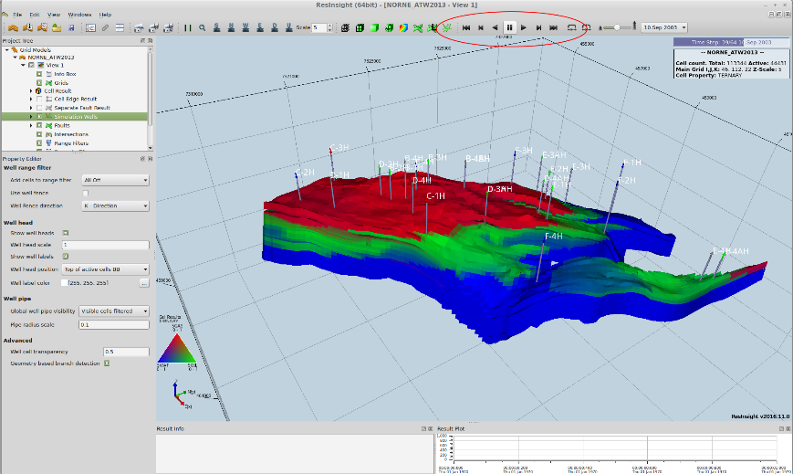

# Visualizing summary data with ResInsight

The ResInsight visualization tool can also display well curves and other
summary data interactively. To do this, click the *Import Summary
Case* button.

Navigate to the output directory and choose the SMSPEC file.

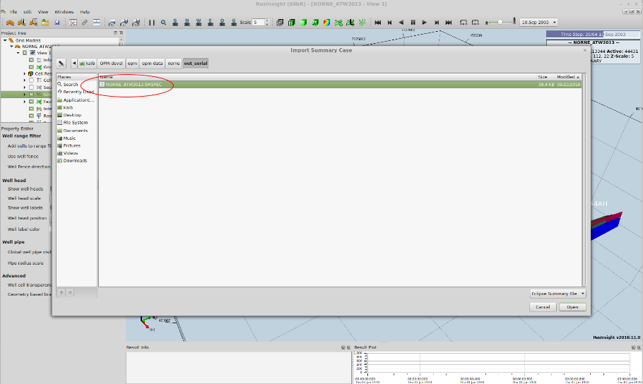

By default, field production rates for gas, oil, water and liquid (oil +
water) are shown. The gas production curve dominates the others in this
case, as should be expected since it is a case using METRIC and
rates are therefore shown in cubic meters per day.

We'd like to inspect the bottom-hole pressure of the well B-1H.
Expand *Summary plot 1* in the *Project Tree*, delete the production
curves and add the well BHP curve as shown below.

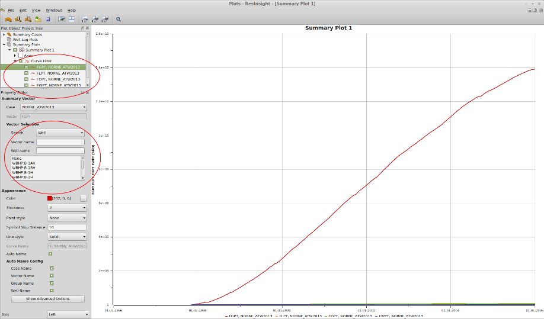

Now we are looking at the BHP curve we wanted to.

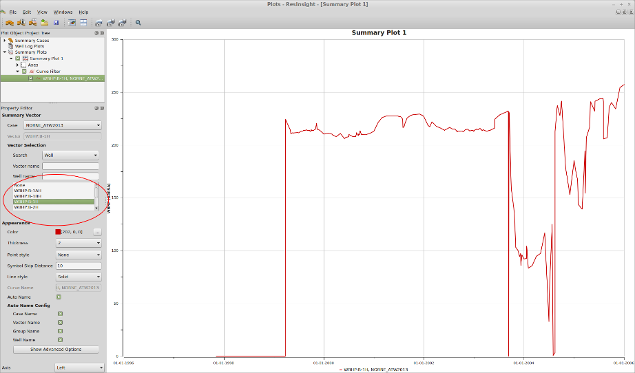

If we want to look at properties for a particular well, or a particular
property, we can use a filter. Type the well name C-2H in the *Well
name* field and the list of choices will be restricted to those relevant
to that well. Choose *WBHP:C-2H* to see its BHP curve.

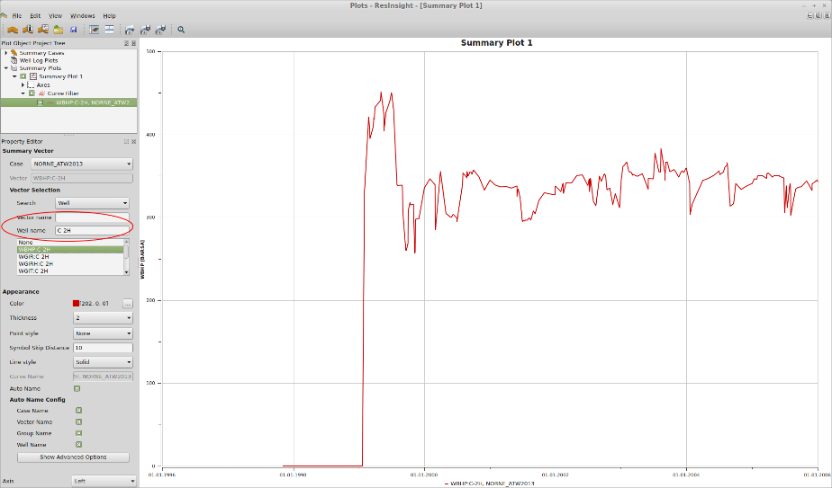

ResInsight can export these images easily. In the *Edit* menu,
choose *Snapshot To File* to export them to files. You can see a few
examples below.

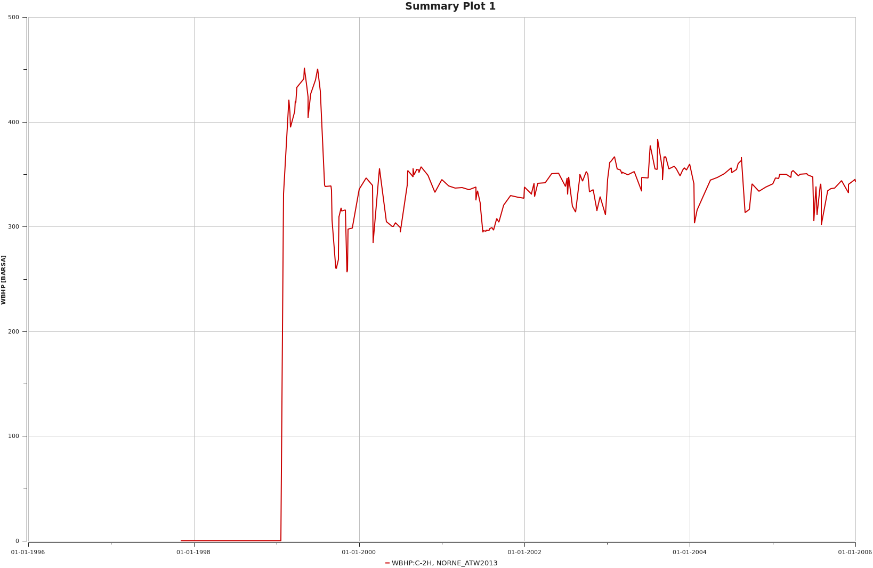

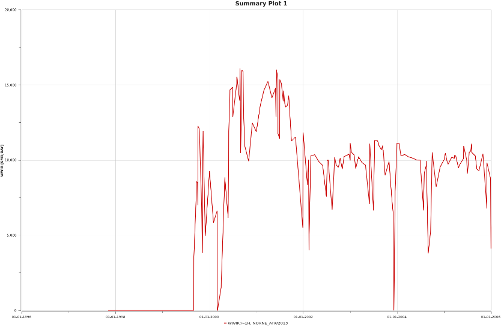
