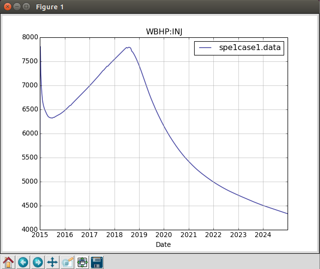

# 运行OPM

串行运行： flow NORNE_ATW2013.DATA --output-dir=out_serial

并行运行： mpirun --allow-run-as-root -np 8 NORNE_ATW2013.DATA --output-dir=out_parallel

运行完毕后，将生成几个新的文件：

NORNE.EGRID
NORNE.INIT
NORNE.SMSPEC
NORNE.UNRST
NORNE.UNSMRY

## 运行结果

生成几个日志文件：终端输出、PRT文件和DBG文件

终端输出：如果遇到求解不收敛或约束被破坏的情况，将减小计算时间步长：

Problem: Solver convergence failure - Iteration limit reached
Timestep chopped to 3.630000 days

## PRT log(NORNE_ATW2013.PRT)

比终端输出更细节的信息

## DBG log (NORNE_ATW2013.DBG)

比PRT输出更细节的信息，包括debuging信息

# 绘制井曲线

## 检查变量

使用[libecl工具](https://github.com/Statoil/libecl)中的ecl_summary工具

ecl_summary --list NORNE_ATW2013.DATA

Keywords start with a letter signifying its scope: C for completion (well perforation), F for field, G for group (of wells), R for region and W for wells.

The rest of the keyword identifies the quantity, some examples (note that some of the concepts such as oil production rate makes sense and can be used with several of the scopes):

Well keywords (W): BHP for bottom hole pressures, GOR for gas-oil ratio, OPR for oil production rate, WIR for water injection rate.

Region keywords (R): OIP for oil in place, GIPL for gas in place in the liquid phase (dissolved in it).

The string after the colon (if any) is the name of the well or group, the region number, or (for completion data) the well name and completion location.

会得到不同变量的列表，其中比较有趣的有：

WBHP:INJ �C Bottom hole pressure of INJ well
WGIR:INJ �C Gas injection rate of INJ well
WBHP:PROD �C Bottom hole pressure of PROD well
WOPR:PROD �C Oil production rate of PROD well
WGPR:PROD �C Gas production rate of PROD well

手动检查变量值： 

ecl_summary SPE1CASE1.DATA WBHP:INJ

ecl_summary NORNE_ATW2013 WBHP:C-4H   # 查看井C-4H的底部孔压力

## 绘制变量

使用[opm-utilities](https://github.com/OPM/opm-utilities/)的summaryplot的Python脚本程序

wget https://raw.githubusercontent.com/OPM/opm-utilities/master/summaryplot

apt-get install python-ecl python-numpy python-matplotlib libecl-dev

绘制井曲线： 

python summaryplot WBHP:INJ WBHP:PROD WOPR:PROD WGPR:PROD WGIR:INJ SPE1CASE1.DATA

生成，注意：因为输入的deck定义FIELD单位(压力单位是psi)，则Flow输出也使用该单位
