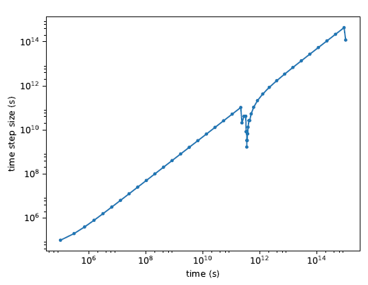

# Waiwera标准算例测试
在/test/benckmark路径包含很多测试算例，可用于验证代码可以正常运行，也可帮助用户熟悉Waiwera如何设置模拟。算例包括：
```
• MINC: benchmark tests with fractured rocks represented using the
Multiple INTeracting Continua (MINC) approach (see Modelling fractured
media using MINC)---一种反映岩石裂隙的网格处理方法。
• Model Intercomparison Study: a selection of test problems from the
1980 "Geothermal Model Intercomparison Study"
• NCG: tests for non-condensable gas equations of state (see Water / NCG
EOS modules)---气体状态方程。
• sources: tests for verifying correct behavior of various source
controls (see Source controls)---各种源项控制。
```
使用CREDO库管理Waiwera标准算例测试： pip install waiwera-credo

运行Waiwera标准算例测试还需要PyTOUGH，控制TOUGH2模拟的Python库，用来提取TOUGH2结果，与Waiwera结果比对。

## 运行测试算例
串行方式运行： python benchmark_tests.py

并行方式运行： python benchmark_tests.py -np 4

注意：建议在非su身份下并行运行，否则mpirun会出现错误。

测试结果保存在：/test/benchmark/test_summary.html

## 运行单个测试
进入/test/benchmark/minc/column，然后运行：

python test_minc_column.py -np 2

运行结果信息保存在：/output/TESTNAME/TESTNAME-report.html

# Waiwera输入
输入文件是JSON格式，一种轻量级的数据交换格式，可读性强，例如：

{\"dimensions\": {\"length\": 20.5, \"width\": 14.8, \"depth\": 17.2},

\"position\": \[161.2, -12.5, 405.1\],

\"colour\": \"blue\",

\"checked\": true

}

Python脚本处理JSON文件：

import json

data = json.load(file(\'input.json\', \'r\'))

data\[\"dimensions\"\]\[\"depth\"\] = 17.3

data\[\"age\"\] = 3.5

json.dump(data, file(\'edited.json\', \'w\'))

## Waiwera JSON文件结构


# 设置一个Waiwera模拟

## 5.1模拟名称

{\"title\": \"Wairakei reservoir model, version 12.4\"}

## 5.2模拟网格

## 5.3模拟坐标系统

## 5.4网格单元排序

## 5.5网格正交性

## 5.6网格区域分解

## 5.7网格荷载平衡

## 5.8网格分区

## 5.9水的热动力学

### 5.9.1热动力学计算

### 5.9.2外插液态水热动力学

## 5.10状态方程

### 5.10.1主要变量参数

### 5.10.2渗透率修正

### 水的EOS模块

### 水/NCG (non-condensible gases) EOS模块

### 水/盐 EOS模块

### Water / salt / NCG EOS模块

## 5.11重力

## 5.12岩石参数

### 岩石类型 

### 岩石渗透率

### 渗透方向

### 随时间变化的岩石属性

### 岩石类型单元和区域

### 相对渗透率曲线

### 毛细孔压力函数

## 5.13使用MINC模拟裂隙介质

### MINC几何

### MINC岩石属性

### 示例

{\"mesh\": {\"filename\": \"my_mesh.msh\",

\"zones\": {\"production\": {\"x\": \[-500, 500\],

\"y\": \[-500, 500\],

\"z\": \[-1000, -200\]},

\"outer\": {\"-\": \"production\"}},

\"minc\": {\"geometry\": {\"fracture\": {\"spacing\": 45},

\"matrix\": {\"volume\": \[0.15, 0.3, 0.5\]}},

\"rock\": {\"fracture\": {\"type\": \"fracture\"},

\"matrix\": {\"type\": \"matrix\"},

\"zones\": \"production\"

}}

},

\"rock\": {\"types\": \[{\"name\": \"formation\",

\"permeability\": \[1e-14, 1e-14, 1e-15\],

\"zones\": \[\"outer\"\]},

{\"name\": \"fracture\",

\"permeability\": 1e-12, \"porosity\": 0.5},

{\"name\": \"matrix\",

\"permeability\": 1e-16, \"porosity\": 0.05}\]}

}

### MINC初始条件

### MINC输出

## 6.8边界条件

### 6.8.1无通量边界条件

### 6.8.2Dirichlet边界条件

### 6.8.3Neumann边界条件

## 6.9源汇项

### 6.9.1源汇项名称

### 6.9.2源汇项单元和区域

### 6.9.3注射

### 6.9.4产出

### 6.9.5混合流体

### 6.9.6示踪剂注入

### 6.9.7分离器

### 6.9.8源汇项控制

### 6.9.10源项的交互作用

## 6.10源项网络

有些源项不独立，存在相互作用的情况，包括：multi-feed wells, borefields,
reinjection

### 6.10.1分组

### 6.10.2 Reinjectors

## 6.11插值表

## 6.12初始条件

## 6.13时间推进计算

### 6.13.1 时间步进计算方法

At each time step, the time-stepping method results in a system of
non-linear equations to be solved, using the PETSc "SNES" iterative
non-linear solver (see Solution of equations at each time step). This in
turn leads to a sequence of systems of linear equations to be solved at
each non-linear solver iteration, using the PETSc "KSP"linear solvers.

### 6.13.2 指定计算时间步长

### 6.13.3 自适应时间步长

### 6.13.4 减小时间步长

### 6.13.5 时间步进终止

### 6.13.6 恒定态模拟

### 6.13.7 求解非线性方程组

### 6.13.8示例

{\"time\": {\"step\": {\"size\": 1e6,

\"adapt\": {\"on\": true,

\"method\": \"iteration\",

\"minimum\": 5, \"maximum\": 8},

\"maximum\": {\"number\": 500},

\"stop\": {\"size\": {\"maximum\": 1e15}},

\"method\": \"beuler\",

\"solver\": {

\"nonlinear\": {\"maximum\": {\"iterations\": 10},

\"tolerance\": {\"function\": {\"relative\": 1e-6}},

\"jacobian\": {\"differencing\": {\"increment\": 1e-9}}}

}},

\"stop\": null}}

### 6.13.8 求解线性方程组

### 6.13.9 求解物质输移方程

## 6.14 物质输移

## 6.15 Log output

### 6.15.1 YAML format

### 6.15.2 Log message structure

### 6.15.3 Log message format

## 6.16 模拟输出

Waiwera outputs the simulation results (not log messages, which are
written to the Log output) to an output file in the HDF5 file format.
HDF5 is a binary file format and data model designed for efficiently
storing and handling large, complex datasets. A variety of software
tools are available for managing, viewing and analyzing HDF5 files.
Waiwera simulation results consist mainly of:

-   selected fluid properties (e.g. pressures, temperatures) in each
    cell

-   selected flux properties (e.g. mass fluxes) through each face

-   selected source properties (e.g. flow rates, enthalpies) at each
    source (see Source terms)

-   selected source group and reinjector properties (e.g. flow rates,
    enthalpies) if a source network is defined (see Source networks)

-   selected mesh geometry properties (e.g. cell centroids and volumes,
    and face areas) which are written to the HDF5 file at specified
    times.

### 6.16.1 Regular output

### 6.16.2 Initial and final output

### 6.16.3 Output at specified times

### 6.16.4 Output fields

### 6.16.5 Jacobian matrix output

## 6.17 使用脚本设置模拟

# 导入Waiwera的输入文件

## 7.1从TOUGH2输入数据文件导入

## 7.2 导入过程的限制

## 7.3 导入网格

## 7.4 示例

# 运行Waiwera

## 8.2运行

waiwera model.json

mpiexec -np 16 waiwera model.json

## 8.3 选择并行计算进程数目

## 8.4 PETSc命令行参数

mpiexec -np 16 waiwera model.json -log_view

## 8.5 Run-time console output

# 后处理Waiwera的输出

## 9.1可视化模拟输出

使用HDFView工具

## 9.2 模拟输出文件是什么结构?

### 9.2.1 Output at cells

### 9.2.2 Output at sources

### 9.2.3 Output at faces

### 9.2.4 Output time dataset

### 9.2.5 Index datasets and data ordering

### 9.2.6 MINC cell indexing

## 9.3 模拟输出和处理脚本

使用h5py：


将生成如下图片：


Fig. 9.4: Steady-state temperature and vapour saturation results for
demo simulation

## 9.4 Log output




Fig. 9.5: Time step size history plot from Waiwera YAML log file, for a
steady-state simulation
