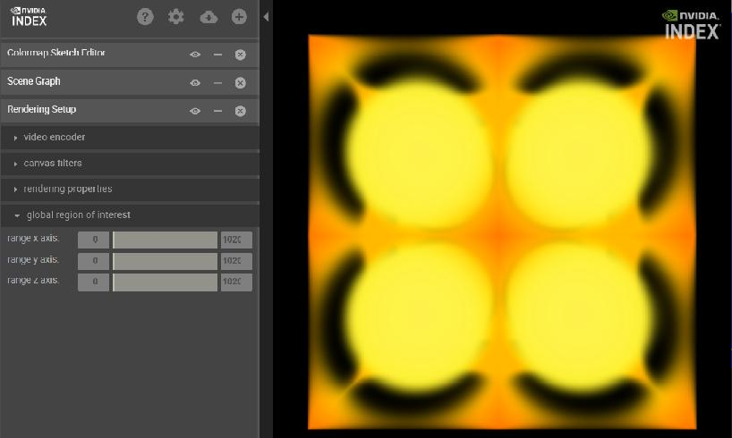
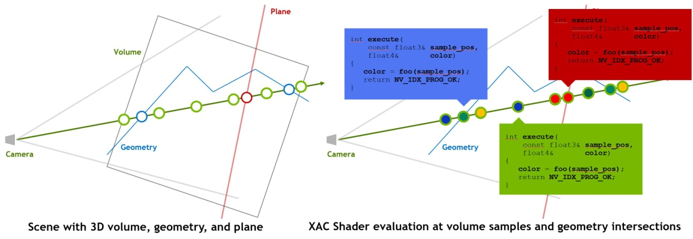
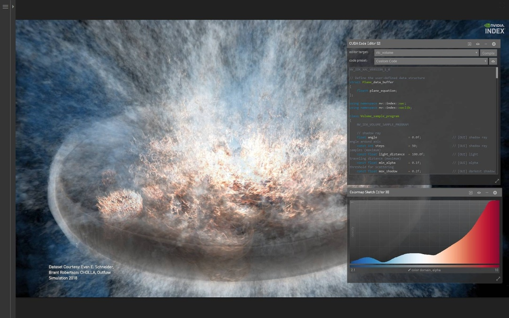

# Index图形渲染库介绍

适用于 PARAVIEW 的 NVIDIA INDEX 插件

-   帮助更快获得科学发现的交互式立体可视化功能

-   以交互方式分析整个数据集。

-   更快地取得见解。

科学发现离不开将模拟结果迅速可视化。但是，现有的可视化工具无法供用户实时分析大型结构化和非结构化数据集。

NVIDIA IndeX? 是一种面向 HPC
的领先立体可视化工具，有助于解决这一难题。它将可视化工作负载分配到GPU加速的集群中，利用
GPU 的计算能力让用户实时地分析大型数据集。

现在，IndeX 已集成到HPC领域最热门的可视化工具之一ParaView
内。这意味着默认情况下，用户可以通过最新版的 ParaView 使用 IndeX
功能，以便与其现有的立体可视化工作流程进行实时交互。而且，IndeX
提供随数据扩展的可视化性能，以便科学家分析原始解决方案中的整个数据集，从而更快获得科学发现。

## 特性和优势

适用于ParaView的NVIDIA
[IndeX插件]{.mark}提供随数据扩展的交互式立体可视化功能，让科学家能分析整个数据集，从而更快获得科学发现。

### 结构化和非结构化立体数据的实时可视化 {#结构化和非结构化立体数据的实时可视化 .标题3}

使用适用于
ParaView的IndeX插件，科学家通过以高帧速率渲染大规模数据，可以实时分析完整分辨率的模拟数据。通过将完整的数据可视化，科学家能快速锁定特别值得关注的数据并做进一步分析，从而更快获得科学发现。

### 无缝的工作流程 {#无缝的工作流程 .标题3}

适用于ParaView的IndeX插件允许用户通过ParaView界面利用IndeX的强大功能。这样一来，用户无需学习新的工具、无需改变工作流程，并能专注于研究和更快获得科学发现。

### 快速分析大规模数据 {#快速分析大规模数据 .标题3}

现有的立体可视化工具无法让科学家以交互方式实时分析大规模数据。科学家必须等上数秒时间待每次交互加载完成，或使用迭代过程实施解决方案，以锁定特别值得关注的数据。适用于ParaView的IndeX插件将数据分散到GPU加速集群内的多个节点上，实时地分析大型数据集。

### 开源插件 {#开源插件 .标题3}

开源软件的优势是用户可以根据自己的需求自定义应用程序。与ParaView相同，IndeX
插件也属于开源软件，可轻松适用于ParaView的定制版本。此插件可以像其他任何标准ParaView插件一样编译，无需使用任何特殊工具和编译器。

借助
BSC，我们生成了大型的人类心脏模型。要验证这些模型的准确性，我们必须对这个数据集进行可视化。并且，高互动性的可视化对于搜集有意义的研究发现而言至关重要。通过IndeX插件，我们可以实时地对我们的54M四面体细胞模型进行可视化。最棒的是，它能完全融入我们现有的ParaView工作流程。
-Mariano Vazquez， 巴塞罗那超级计算中心。

## 其他特性

-   允许以实时交互方式分析大型数据集

-   与 ParaView 基元混合的深度校正

-   动态流式传输和在 GPU 中缓存时变体数据

-   支持所有常见的 ParaView 数据格式

-   在单一节点上合成 ParaView 几何图形

-   针对 Windows 和 Linux 预先构建工作站版本

-   适用于工作站和 HPC 集群的

## PARAVIEW 插件

此插件有两个版本。如果在工作站或单服务器节点中使用，可免费获得此插件。如果想在
GPU
加速的多节点系统中快速分析大规模数据，学术用户可免费获得此插件的集群版本，商业用户则需购买该版本的许可证。

要了解更多信息以及与其他用户交流，请访问 IndeX 论坛页面。

# 使用Index编程

## 前言

## Purpose of this document

The NVIDIA IndeX^®^ framework is intended for large-scale and
high-quality volume data visualization. This document describes how to
unbox NVIDIA IndeX and render a volumetric dataset.

### Audience {#audience .标题3}

This document is intended for scientists, engineers, and other
professionals who require high-quality visualization of volumetric
datasets of any size for interactive, real-time rendering, exploration,
and analysis.

### Prerequisites {#prerequisites .标题3}

Unpackaging the NVIDIA IndeX release and rendering a volumetric dataset
requires no special skills. A description of the hardware and software
prerequisites for running NVIDIA IndeX are included in this document.

Integrating NVIDIA IndeX into your visualization pipeline requires C++
programming skills. This task is covered in the developer documentation
shipped with NVIDIA IndeX.

### How this document is organized {#how-this-document-is-organized .标题3}

This document is organized as follows:

-   [Accelerating scientific
    discovery](https://raytracing-docs.nvidia.com/nvindex/getting_started/installing_sdk/index.html#intro#intro-to-ni) provides
    a brief introduction to NVIDIA IndeX.

-   [System
    requirements](https://raytracing-docs.nvidia.com/nvindex/getting_started/installing_sdk/index.html#system_reqs#system-reqs) describes
    the hardware and software requirements for running NVIDIA IndeX.

-   [Installing NVIDIA
    IndeX](https://raytracing-docs.nvidia.com/nvindex/getting_started/installing_sdk/index.html#installing_index#install-nv) guides
    you through download and installation of NVIDIA IndeX.

-   [Testing your
    installation](https://raytracing-docs.nvidia.com/nvindex/getting_started/installing_sdk/index.html#testing_installation#test-install) describes
    how to load and render an example dataset.

-   [Importing a
    dataset](https://raytracing-docs.nvidia.com/nvindex/getting_started/installing_sdk/index.html#importing_dataset#import-dataset) explains
    how to load and render your own data.

-   [Next
    steps](https://raytracing-docs.nvidia.com/nvindex/getting_started/installing_sdk/index.html#next_steps#next-steps) offers
    suggestions for further exploration.

-   [Frequently asked
    questions](https://raytracing-docs.nvidia.com/nvindex/getting_started/installing_sdk/index.html#faq#faq) provides
    immediate answers to commonly asked questions.

-   [This
    appendix](https://raytracing-docs.nvidia.com/nvindex/getting_started/installing_sdk/index.html#svol_simple_prj#svol-simple-prj-scene-file) provides
    a listing of a simple scene that you can edit to load your own data.

### 1 Accelerating scientific discovery {#accelerating-scientific-discovery .标题3}

The NVIDIA IndeX^®^ framework sets a new standard for interactive and
collaborative exploration and analysis of large-scale scientific
visualizations. This document is intended to guide you through the steps
for unboxing NVIDIA IndeX and start visualizing and exploring your
scientific data.

For additional information about NVIDIA IndeX, see the:

-   [NVIDIA IndeX 3D Volumetric Visualization
    Framework](https://developer.nvidia.com/nvidia-index) page, which
    provides a brief introduction to NVIDIA IndeX and how teams are
    using it to solve large-scale visualization challenges and advance
    scientific understanding.

-   [NVIDIA Ray Tracing
    Documentation](https://raytracing-docs.nvidia.com/) page, where you
    can link to or download NVIDIA IndeX documentation.

**Note:** Setting up the development environment is not part of the
scope of this document. For a description of the NVIDIA IndeX SDK and
setting up the development environment, see the [Programmer\'s
manual](https://raytracing-docs.nvidia.com/nvindex/manual/index.html).

### 2 System requirements {#system-requirements .标题3}

Following is a list of system requirements for NVIDIA IndeX:

GPU and driver

At least one CUDA-capable GPU and a driver that is compatible with the
CUDA version required by NVIDIA IndeX. See the NVIDIA IndeX release
notes for details.

Operating systems

> NVIDIA IndeX runs under the following Linux and Windows systems:

-   Red Hat Enterprise Linux (RHEL) or CentOS version 7 or newer.
    > Typically, NVIDIA IndeX will run on other Linux distributions.

-   Microsoft Windows 10.

### 3Installing NVIDIA IndeX {#installing-nvidia-index .标题3}

To install NVIDIA IndeX:

1.  Fill in and submit the [IndeX
    contact](https://developer.nvidia.com/index-contact) form.

You will be given instructions for downloading NVIDIA IndeX.

2.  After downloading NVIDIA IndeX, unzip the contents to the
    appropriate directory on your machine.

For a description of the directories, see the README (readme.md or
readme.html).

### 4Testing your installation {#testing-your-installation .标题3}

The following procedure explains how to test your installation by
running the rendering service included with your NVIDIA IndeX download.
The rendering service initializes NVIDIA IndeX, loads the test dataset,
and renders it. An HTTP server is automatically started and a viewing
URL is specified in the log. Multiple people can view and explore the
visualization from multiple browser instances using the same URL to
enable a collaborative experience.

To test your installation:

1.  Open a terminal session if you have not already done so.

2.  From the machine where you installed NVIDIA IndeX, switch to
    the demo directory.

> **Note:** You cannot run the demo from elsewhere because all child
> scripts and files have relative paths from the demo directory.

3.  To start the demo, enter the following command at the prompt:

    -   Windows: nvindex-viewer.cmd

    -   Linux: ./nvindex-viewer.sh

> When rendering is successfuly completed, a viewing URL is displayed in
> the log.

4.  If the process fails, check the log for error messages. Ensure that
    all errors are fixed. If you are unable to resolve an error, contact
    NVIDIA for support at <nvidia-index@nvidia.com>.

5.  To display a successful rendering result, open a browser session and
    load the URL displayed in the log. As mentioned already, multiple
    people can interact with the visualization simultaneously by
    starting separate browser instances and loading the same URL.

> {width="4.933128827646544in"
> height="2.955372922134733in"}
>
> *Fig. 4.1 -- Initial image rendered from demo dataset.*

6.  To explore the visualization, manipulate it directly and use the
    supported functionality displayed to the left of the visualization.
    For example:

    -   *Panning* --- Hold down the Ctrl key while dragging the mouse

    -   *Zooming* --- Hold down the Shift key while dragging the mouse

    -   *Rotating* --- Drag the mouse

> To add a panel, click the + button at the top of the window.

7.  To close the visualization and release the memory, open
    the **\[**Server**\]** menu (top-left) and
    click **\[**File ➤ Shutdown server**\]**.

### 5 Importing a dataset {#importing-a-dataset .标题3}

This chapter describes how to import your own data using a simple scene
file and use the render service to visualize it. The scene file you
create is used by the system at runtime to upload your data and override
related settings in the default scene file.

To import and render your own data:

1.  Create a simple scene file to import your data:

    1.  Create an empty text file and name it svol-simple.prj.

    2.  Copy the contents of the scene file listing in
        the [appendix](https://raytracing-docs.nvidia.com/nvindex/getting_started/installing_sdk/index.html#svol_simple_prj#svol-simple-prj-scene-file) into
        the empty text file.

2.  Edit the following settings in svol-simple.prj as needed:

    -   A volume shader used for shading a volume dataset
        called svol_prog

    -   A color map applied to the volume dataset called svol_cmap

    -   Rendering properties applied to the dataset
        called svol_render_props

    -   The dataset with importer information called seismic_uint8 In
        particular, you need to specify the following information about
        the dataset:

        -   Location

        -   Size

        -   Voxel type

```{=html}
<!-- -->
```
1.  Save the edited svol-simple.prj scene file to
    the \[main_distribution_directory\]/demo directory.

2.  Open a command line session, if you have not already done so.

3.  At the command prompt, enter:

4.  ./nvindex-viewer.sh \--add svol-simple.prj

> The \--add option enables you to specify the scene file that you want
> the system to use to override settings in the default scene file.

5.  When rendering is successful, enter the viewing URL from the log
    into the location field of your browser to view the result.

### 6 Next steps {#next-steps .标题3}

This chapter offers some suggestions to expand your hands-on exploration
of NVIDIA IndeX capabilities.

6.1Running NVIDIA IndeX from a cloud service

NVIDIA IndeX is currently available as a cloud service
from [AWS](https://github.com/NVIDIA/nvindex-cloud/blob/master/doc/aws.md) and [Google
Cloud
Marketplace](https://github.com/NVIDIA/nvindex-cloud/blob/master/doc/gke-app.md).
Extensive documentation is provided to guide you through the process of
setting up a cluster, uploading data , rendering, and viewing the
result. Example datasets that you can use are available from the [Sample
Dataset
Information](https://github.com/NVIDIA/nvindex-cloud/blob/master/doc/datasets.md) page.
Instructions are also provided for uploading and rendering your own
datasets.

6.2Exploring the NVIDIA IndeX tutorials

Be sure to take a look at the tutorials, which explore some of the key
capabilities of NVIDIA IndeX. You can start the tutorials from
the \[main_distribution_directory\]/tutorial using
the ./nvindex-tutorial.sh shell script. Be sure to take a look at
the ../tutorial/README for additional detail before you start.

6.3Integrating NVIDIA IndeX into your application

For detailed information about integrating NVIDIA IndeX into your
application or application pipeline, refer to the NVIDIA IndeX
documentation accessible from the [NVIDIA Ray Tracing
Documentation](https://raytracing-docs.nvidia.com/) page.

### 7Frequently asked questions {#frequently-asked-questions .标题3}

**Q:**Do I need to install the CUDA SDK or any other libraries to use
the plugin?

**A:**The [CUDA SDK](https://developer.nvidia.com/cuda-zone) is required
for building example programs or plugins that make use of CUDA. You also
need to install the appropriate NVIDIA display driver for your GPU.

**Q:**Can I render multiple volumes?

**A:**Yes, the NVIDIA IndeX SDK supports multi-volume rendering.

### [Appendix A: Example scene file svol-simple.prj]{.mark} {#appendix-a-example-scene-file-svol-simple.prj .标题3}

The following listing is the simple scene file named svol-simple.prj.
You can use this file to override the settings of the default scene file
to load your own data. For more information, see [Importing a
dataset](https://raytracing-docs.nvidia.com/nvindex/getting_started/installing_sdk/index.html#importing_dataset#import-dataset).

Words in italics should be replaced by the appropriate value for your
installation.

#! index_app_project 0

\# -\*- mode: Conf; -\*-

index::region_of_interest = 0 0 0 500 500 1500

app::scene::root::children = sparse_volume_data

app::scene::sparse_volume_data::type = static_scene_group

app::scene::sparse_volume_data::children = svol_render_props svol_cmap
rtc_volume volume_dataset

app::scene::rtc_volume::type = rendering_kernel_program

app::scene::rtc_volume::target = volume_sample_program

app::scene::rtc_volume::enabled = true

app::scene::rtc_volume::source_file = sparse_volume_basic.cu

\# Setup rendering properties

app::scene::svol_render_props::type = sparse_volume_rendering_properties

app::scene::svol_render_props::filter_mode = trilinear

app::scene::svol_render_props::sampling_distance = 0.5

\# The map_type: either procedural or lookup_table

app::scene::svol_cmap::type = colormap

app::scene::svol_cmap::map_type = lookup_table

app::scene::svol_cmap::domain = 0.0 1.0

app::scene::svol_cmap::domain_boundary_mode = clamp_to_edge

\# The volume type. A sparse volume is able to manage dense and sparse
volume

\# datasets as well as multi-resolution data.

app::scene::volume_dataset::type = sparse_volume

\# This option selects a specific data importer. The importer reads raw
voxel

\# data in a given order (see below).

app::scene::volume_dataset::importer =
nv::index::plugin::base_importer.Sparse_volume_importer_raw

\# The voxel format. The present dataset\'s voxels are of type uint8.
Valid types

\# are: uint8, uint16, sint16, rgba8, float32.

app::scene::volume_dataset::voxel_format = uint8

\# In some cases, volume data is stored in z-first/x-last order. In such
cases,

\# the option \'app::scene::volume_dataset::convert_zyx_to_xyz\' needs
to be set to

\# \'true\' because NVIDIA IndeX sores the volume data in x-first/z-last
order in

\# memory.

\# The present dataset is assumed to be in x-first/z-last order, i.e.,
no

\# conversion required: app::scene::volume_dataset::convert_zyx_to_xyz =
false

\# The size of the dataset in the datasets local space

app::scene::volume_dataset::size = 500 500 1500

\# The bounding box defines the space within which the volume is defined

app::scene::volume_dataset::bbox = 0 0 0 500 500 1500

\# Import directory

app::scene::volume_dataset::input_directory = *your-directory*

\# Name of the file

app::scene::volume_dataset::input_file_base_name =
*your-filename-without-extension*

\# File extension (including the initial dot character)

app::scene::volume_dataset::input_file_extension =
.*your-filename-extension*

\# Cache data on disk for future accelerated data imports

app::scene::volume_dataset::cache = false

The value of app::scene::rtc_volume::source_file is the
filename sparse_volume_basic.cu. This file contains a generic sparse
volume CUDA program, displayed in Listing A.1:

*Listing A.1: CUDA file sparse_volume_basic.cu*

class Volume_sample_program

{

NV_IDX_VOLUME_SAMPLE_PROGRAM

const nv::index::xac::Colormap colormap = state.self.get_colormap();

public:

NV_IDX_DEVICE_INLINE_MEMBER

void initialize() {}

NV_IDX_DEVICE_INLINE_MEMBER

int execute(

const Sample_info_self& sample_info,

Sample_output& sample_output)

{

using namespace nv::index;

const auto& svol = state.self;

const auto svol_sampler =

svol.generate_sampler\<float,xac::Volume_filter_mode::TRILINEAR\>(

0u,

sample_info.sample_context);

const float v = svol_sampler.fetch_sample(

sample_info.sample_position_object_space);

sample_output.set_color(colormap.lookup(v));

return NV_IDX_PROG_OK;

}

};

## 1系统概览

[https://raytracing-docs.nvidia.com/nvindex/manual/index.html#system_overview#software-components](https://raytracing-docs.nvidia.com/nvindex/manual/index.html#system_overview#software-components)

### 1.1Software components {#software-components .标题3}

The NVIDIA IndeX release contains the following parts:

-   Two shared library files for the Linux platform:

    -   libdice, the Distributed Computing Environment (DiCE) layer

    -   libnvindex, the IndeX library

-   The set of C++ header files that declare the components of the IndeX
    API.

-   The NVIDIA IndeX Programmer\'s Manual (this document)

-   The [API
    documentation](https://raytracing-docs.nvidia.com/nvindex/reference/index.html)
    for IndeX and its support libraries

-   [Installation
    instructions](https://raytracing-docs.nvidia.com/nvindex/getting_started/index.html)

In the documentation, the IndeX and DiCE software libraries are
referenced together as the "IndeX library." The application programming
interface for these two libraries is called the "IndeX API."

<https://raytracing-docs.nvidia.com/nvindex/getting_started/index.html>

[[Unboxing]{.underline}](https://raytracing-docs.nvidia.com/nvindex/getting_started/installing_sdk/index.html)

[System
settings](https://raytracing-docs.nvidia.com/nvindex/getting_started/system_settings/index.html)

[Options
files](https://raytracing-docs.nvidia.com/nvindex/getting_started/scene_file_syntax/index.html)

[Structure and
syntax](https://raytracing-docs.nvidia.com/nvindex/getting_started/scene_file_syntax/description/index.html)

[Options file:
project.prj](https://raytracing-docs.nvidia.com/nvindex/getting_started/scene_file_syntax/project_options/index.html)

[Options file:
scene.prj](https://raytracing-docs.nvidia.com/nvindex/getting_started/scene_file_syntax/scene_options/index.html)

The system settings explain how to tune your system so that NVIDIA IndeX
runs effectively. Option files are used to define parameter settings for
system operation and scene display and construction.

## 2基本编程概念

## 2Basic programming concepts

The follow sections describe the syntactic conventions, file system
organization, and basic programming concepts of NVIDIA IndeX.

2.1Naming conventions

The IndeX library is written in C++. It use the
namespace [nv::index](https://raytracing-docs.nvidia.com/nvindex/reference/nindex/namespacenv_1_1index.html) for
identifiers, and the NVIDIA_INDEX\_ prefix for macros.

Multiple words are concatenated with the underscore character (\_) to
form identifiers. Function names are all spelled in lowercase; type and
class names start with one initial uppercase letter.

2.2Main C++ header files

The C++ header
file [iindex.h](https://raytracing-docs.nvidia.com/nvindex/reference/nindex/iindex_8h.html) in
the IndeX API directory nv/index contains the base functionality for
initializing and accessing the IndeX library. More specific components
of the library also have their respective header files in nv/index.

2.3Interfaces

The IndeX API follows current C++ library design principles for
component software to achieve binary compatibility across shared library
boundaries and future extensibility. The design provides access to the
shared library through *interfaces*, abstract base classes with pure
virtual member functions.

The global
function [nv_index_factory](https://raytracing-docs.nvidia.com/nvindex/reference/nindex/group__nv__index.html#gab11a622fe7c01d97c7fc3f5741cda4af)()
returns the main
interface [IIndex](https://raytracing-docs.nvidia.com/nvindex/reference/nindex/classnv_1_1index_1_1IIndex.html) that
allows access to the whole library. From this interface other interfaces
of the library can be accessed with
the [IIndex](https://raytracing-docs.nvidia.com/nvindex/reference/nindex/classnv_1_1index_1_1IIndex.html)::get_api_component
member function.

2.4Reference counting

Interfaces are reference-counted dynamic resources that need to be
released when no longer needed. Whenever a function returns a pointer
to [mi::base::IInterface](https://raytracing-docs.nvidia.com/nvindex/reference/base/classmi_1_1base_1_1IInterface.html) or
a class that uses it as a base class, the corresponding reference
counter has already been increased by 1. That is, you can use the
interface pointer without first determining if the pointer is still
valid. Whenever you do not need an interface any longer, you have to
release it by calling its release() method. Omitting such calls leads to
memory leaks.

2.5Handle class

To assist in memory management of class instances, the IndeX API
provides the handle
class [mi::base::Handle](https://raytracing-docs.nvidia.com/nvindex/reference/base/classmi_1_1base_1_1Handle.html).
This handle class maintains pointer semantics while supporting reference
counting for interface pointers. For example, the operator acts on the
underlying interface pointer. The destructor calls release() on the
interface pointer; the copy constructor and assignment operator take
care of retaining and releasing the interface pointer as necessary. Note
that it is also possible to use other handle class implementations, for
example, [std::tr1::shared_ptr\<T\>](http://en.cppreference.com/w/cpp/memory/shared_ptr) or [boost::shared_ptr](http://www.boost.org/doc/libs/1_58_0/libs/smart_ptr/shared_ptr.htm).

2.6Resources

As is typical in all resource-heavy applications, you should aim for
minimal resource usage by releasing interface pointers as soon as you no
longer need the resources to which they provide access. When a handle
class instance goes out of scope, its destructor method releases its
resources. By introducing a nested scope (surrounding statements in
a { and } pair), resources acquired with the scope will automatically be
released at its end.

2.7Strings

The
interface [mi::IString](https://raytracing-docs.nvidia.com/nvindex/reference/dice/classmi_1_1IString.html) represents
strings. However, some methods return constant strings as a pointer
to const char for simplicity. These strings are managed by the IndeX
library and you must not deallocate the memory pointed to by such a
pointer. These pointers are valid as long as the interface from which
the pointer was obtained is valid.

## 3 XAC \-- Accelerated Compute Interface

The [[IndeX Accelerated Compute (XAC)
Interface]{.underline}](https://raytracing-docs.nvidia.com/nvindex/reference/nindex/group__xac.html) enables
programmers to add real-time compiled sampling programs into the IndeX
volume rendering pipeline. XAC programs are written in the CUDA
programming language.

The data distribution, parallelization, and management is handled by
IndeX while the XAC interface can directly modify the rendering output
produced by Index.

### 3.1Sample program overview {#sample-program-overview .标题3}

IndeX performs a front-to-back ray casting procedure for each rendered
frame of a scene. A user-defined sampling program can be executed at
each step of a ray generated by the ray caster.

There are two types of sampling programs:

> *Surface programs*
>
> Based on
> class [ISurface_sample_program](https://raytracing-docs.nvidia.com/nvindex/reference/nindex/classnv_1_1index_1_1ISurface__sample__program.html)
>
> *Volume programs*
>
> Based on
> class [IVolume_sample_program](https://raytracing-docs.nvidia.com/nvindex/reference/nindex/classnv_1_1index_1_1IVolume__sample__program.html)

Volume sampling programs are called for each step traversing through a
volume during the ray casting procedure. In contrast, surface programs
are only executed when a surface-based scene element is hit.

[[Listing 3.1]{.underline}](https://raytracing-docs.nvidia.com/nvindex/manual/index.html#listing_3.1) shows
the basic structure of a volume sampling program.

*Listing 3.1*

using namespace
[nv::index::xac](https://raytracing-docs.nvidia.com/nvindex/reference/nindex/namespacenv_1_1index_1_1xac.html);

class Volume_sample_program

{

[NV_IDX_VOLUME_SAMPLE_PROGRAM](https://raytracing-docs.nvidia.com/nvindex/reference/nindex/xac__interface__standard__lib__doc_8h.html#a8c9c2118abac6903df27e98dc2288aaf)

public:

[NV_IDX_DEVICE_INLINE_MEMBER](https://raytracing-docs.nvidia.com/nvindex/reference/nindex/xac__interface__standard__lib__doc_8h.html#a7e66f15f9e79913e3ef8d06094aa58d1)

void initialize()

{

\...

Initialize the program

}

[NV_IDX_DEVICE_INLINE_MEMBER](https://raytracing-docs.nvidia.com/nvindex/reference/nindex/xac__interface__standard__lib__doc_8h.html#a7e66f15f9e79913e3ef8d06094aa58d1)

int execute(

const Sample_info_self& sample_info,

Sample_output& sample_output)

{

\...

Perform computations

return
[NV_IDX_PROG_OK](https://raytracing-docs.nvidia.com/nvindex/reference/nindex/group__xac__lib.html#gga88218f7155972573815d158e255a3524a374ca8497af1f5fb96a81ad99e9e2b54);

}

};

In [[Figure 3.1]{.underline}](https://raytracing-docs.nvidia.com/nvindex/manual/index.html#xac#shader-evaluation),
sampling is performed at various positions along the course of a rays
traversal from the camera into the scene:

{width="5.932239720034995in"
height="2.0503871391076114in"}

*Fig. 3.1 -- XAC code execution in volume and surface programs occurs
when sampling a volume along a ray or when a ray intersects a surface.*

[[Figure
3.2]{.underline}](https://raytracing-docs.nvidia.com/nvindex/manual/index.html#xac#Cholla-Resample-Layout-xac-shape-v01a)
shows a volume sample program in the code editor:

{width="4.923475503062117in"
height="3.077171916010499in"}

*Fig. 3.2 -- Code editor and image display*

[[Listing 3.2]{.underline}](https://raytracing-docs.nvidia.com/nvindex/manual/index.html#listing_3.2) shows
the basic structure of a surface sampling program.

Listing 3.2

using namespace
[nv::index::xac](https://raytracing-docs.nvidia.com/nvindex/reference/nindex/namespacenv_1_1index_1_1xac.html);

class Surface_sample_program

{

[NV_IDX_SURFACE_SAMPLE_PROGRAM](https://raytracing-docs.nvidia.com/nvindex/reference/nindex/xac__interface__standard__lib__doc_8h.html#a3e20492d1d6ce3a7e9885748e8922ef4)

public:

[NV_IDX_DEVICE_INLINE_MEMBER](https://raytracing-docs.nvidia.com/nvindex/reference/nindex/xac__interface__standard__lib__doc_8h.html#a7e66f15f9e79913e3ef8d06094aa58d1)

void initialize()

{

\...

*Initialize the program*

}

[NV_IDX_DEVICE_INLINE_MEMBER](https://raytracing-docs.nvidia.com/nvindex/reference/nindex/xac__interface__standard__lib__doc_8h.html#a7e66f15f9e79913e3ef8d06094aa58d1)

int execute(

const Sample_info_self& sample_info,

*Read-only*

Sample_output& sample_output)

*Write-only*

{

\...

*Perform computations*

return
[NV_IDX_PROG_OK](https://raytracing-docs.nvidia.com/nvindex/reference/nindex/group__xac__lib.html#gga88218f7155972573815d158e255a3524a374ca8497af1f5fb96a81ad99e9e2b54);

}

};

The available information that is passed as input in
the Sample_info_self depends on the associated scene element for which
the program is executed.

See the [[API documentation for structs used in
sampling]{.underline}](https://raytracing-docs.nvidia.com/nvindex/reference/nindex/xac__interface__sample__info__doc_8h.html).

### 3.2Scene property access {#scene-property-access .标题3}

[[Listing 3.3]{.underline}](https://raytracing-docs.nvidia.com/nvindex/manual/index.html#listing_3.3) demonstrates
how the state object provides access to the associated scene element for
which a sample program has been called.

Listing 3.3

class Volume_sample_program

{

[NV_IDX_VOLUME_SAMPLE_PROGRAM](https://raytracing-docs.nvidia.com/nvindex/reference/nindex/xac__interface__standard__lib__doc_8h.html#a8c9c2118abac6903df27e98dc2288aaf)

const Regular_volume volume = state.self;

Retrieve the associated scene element reference

\...

*Program using *volume

}

[[Listing 3.4]{.underline}](https://raytracing-docs.nvidia.com/nvindex/manual/index.html#listing_3.4) demonstrates
how scene elements that have been specified in the IndeX scene can be
accessed in sample programs.

*Listing 3.4*

 

const Regular_volume volume =

state.scene.access\<Regular_volume\>(0);

*Example object retrieval from the scene*

Additionally, the scene provides access to a set of scene element
handling and basic transformation functions.

See the [[API documention for the XAC scene definition
class]{.underline}](https://raytracing-docs.nvidia.com/nvindex/reference/nindex/xac__interface__scene__doc_8h.html).

### 3.3 Scene element overview {#scene-element-overview .标题3}

Predefinied elements that are part of the XAC interface can provide
information about the current IndeX state, for example, rendering
behavior and color mapping.

-   [xac::Ray](https://raytracing-docs.nvidia.com/nvindex/reference/nindex/classnv_1_1index_1_1xac_1_1Ray.html)

-   [xac::Camera](https://raytracing-docs.nvidia.com/nvindex/reference/nindex/classnv_1_1index_1_1xac_1_1Camera.html)

-   [xac::Colormap](https://raytracing-docs.nvidia.com/nvindex/reference/nindex/classnv_1_1index_1_1xac_1_1Colormap.html)

-   [xac::Light](https://raytracing-docs.nvidia.com/nvindex/reference/nindex/classnv_1_1index_1_1xac_1_1Light.html)

-   [xac::Material_phong](https://raytracing-docs.nvidia.com/nvindex/reference/nindex/classnv_1_1index_1_1xac_1_1Material__phong.html)

XAC also provides a set of geometric scene elements that are used for
the final visualization output:

-   [xac](https://raytracing-docs.nvidia.com/nvindex/reference/nindex/namespacenv_1_1index_1_1xac.html)::Regular_volume

-   [xac::Height_field](https://raytracing-docs.nvidia.com/nvindex/reference/nindex/classnv_1_1index_1_1xac_1_1Height__field.html)

-   [xac::Triangle_mesh](https://raytracing-docs.nvidia.com/nvindex/reference/nindex/classnv_1_1index_1_1xac_1_1Triangle__mesh.html)

-   [xac::Plane](https://raytracing-docs.nvidia.com/nvindex/reference/nindex/classnv_1_1index_1_1xac_1_1Plane.html)

-   [xac::Cone](https://raytracing-docs.nvidia.com/nvindex/reference/nindex/classnv_1_1index_1_1xac_1_1Cone.html)

-   [xac::Cylinder](https://raytracing-docs.nvidia.com/nvindex/reference/nindex/classnv_1_1index_1_1xac_1_1Cylinder.html)

-   [xac::Ellipsoid](https://raytracing-docs.nvidia.com/nvindex/reference/nindex/classnv_1_1index_1_1xac_1_1Ellipsoid.html)

Compute texture objects can store additional information for surface
scene elements.

-   [xac::Compute_texture_tile](https://raytracing-docs.nvidia.com/nvindex/reference/nindex/classnv_1_1index_1_1xac_1_1Compute__texture__tile.html)

See the [[API documention for XAC scene
elements]{.underline}](https://raytracing-docs.nvidia.com/nvindex/reference/nindex/group__xac__obj.html).

### 3.4XAC library functionality {#xac-library-functionality .标题3}

Standard CUDA math functionality is available within the sample
programs. Additional headers can be provided by the scene and included
within the sample program.

The XAC interface also provides a set of convenience macros and
functions for printing debugging information, transformation handling,
basic shading operations and generic gradient operators.

See also the [[API documentation for XAC macros and
functions]{.underline}](https://raytracing-docs.nvidia.com/nvindex/reference/nindex/xac__interface__standard__lib__doc_8h.html).

## 4 API用法

The IndeX software distribution includes an introduction to [programming
with the IndeX API in this
manual](https://raytracing-docs.nvidia.com/nvindex/manual/index.html#basic_programming_concepts#basic-programming-concepts) and [APIs,
modules and source
code](https://raytracing-docs.nvidia.com/nvindex/reference/examples/html/index.html) that
showcase various features of using the library through its application
programming interface (API). All the code examples can be run using the
command line to test and illustrate individual functionalities of the
library.

[https://raytracing-docs.nvidia.com/nvindex/manual/index.html#basic_programming_concepts#basic-programming-concepts](https://raytracing-docs.nvidia.com/nvindex/manual/index.html#basic_programming_concepts#basic-programming-concepts)

The example source code is located under
the src/index_examples/ directory. Running the make command in
the src/ directory will build all the examples in the subdirectories
containing a specific example. In order to run these examples, library
paths need to be set. This can be done by executing the following
command in the shell at the tape\'s root directory:

[source src/setup.sh]{.mark}

Executing each example program with the -h option will show that
example\'s usage options. Please note, this setup.sh script is for bash.
If you need to use other type of shell, please adjust the setup script
accordingly.
