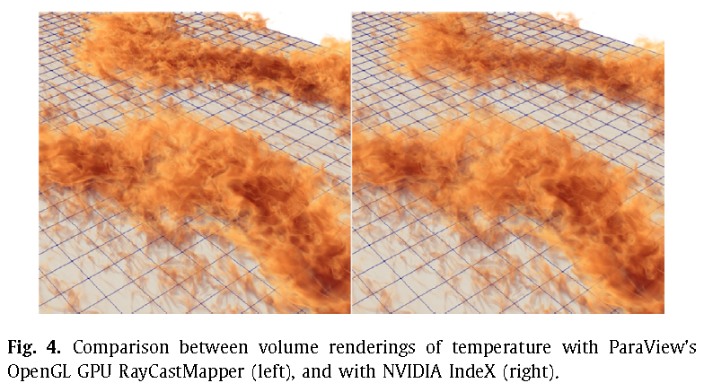
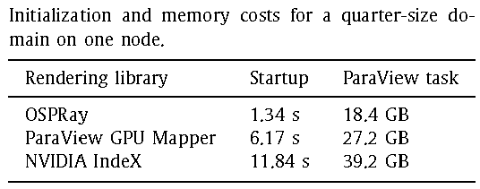
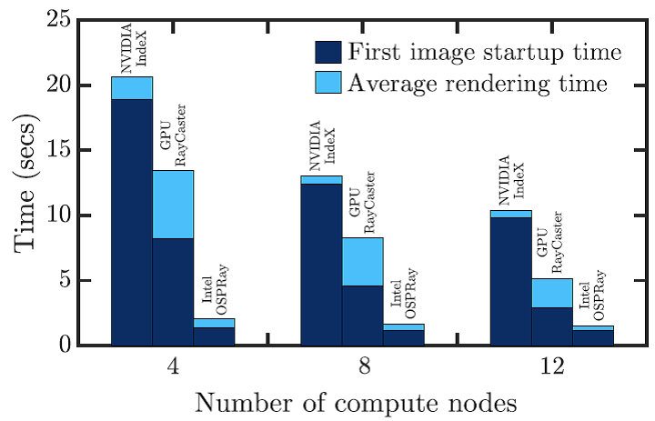

Jean M. Favre, Alexander Blass. A comparative evaluation of three volume
rendering libraries for the visualization of sheared thermal convection.
Parallel Computing 88 (2019) 102543

海洋中温跃层的湍流可视化对解释海洋动力过程很重要。本文使用ParaView5.6的可视化技术，对AFiD直接数值模拟的数据进行可视化。ParaView采用并行化可视化，包括：[基于GPU渲染的数据并行可视化管线以及基于CPU渲染的多线程并行]{.mark}。

ParaView的默认安装使用自己的光线追踪的体渲染，但缺少高级参数设置的GUI，因此没有做测试。本文采用ParaView中的Nvidia
IndeX库（基于GPU）和Intel
OSPRay(基于CPU)的光线追踪体渲染库。均采用ParaView的Python源程序示例：/Wrapping/Python/paraview/benchmark/

所有测试忽略IO耗时。

EGL-based rendering layer，可使用GPU加速的headless,
offscreen渲染，但GPU内存有限（16GB-Tesla GPU）。对于full
size模拟的图形渲染，必须[使用多节点的数据并行管线]{.mark}，可利用不同GPU的叠加内存。

## ParaView的GPU光线追踪

核心光线追踪代码使用GLSL编码，至少需要OpenGL
3.2版本。数据存储进入vtkVolumeTexture，来管理OpenGL的体纹理、类型和内部格式。

paraview的VolumeRayCastMapper通过调用glTexImage3D()，绑定32bit浮点标量场数组到3D纹理图像中。创建一个纹理对象，将数据从host内存转移到GPU内存。最高计算效率与GPU内存大小和转移带宽(PCIe3
serial bus)有关。

## NVIDIA IndeX

可以以多GPU方式使用IndeX。

NVIDIA IndeX Accelerated Compute
(XAC)接口，整合了以CUDA编程的核心表面和体采样程序，这样我们可使用IndeX提供的统一代码，无需用户自己编程。如图4,2种基于GPU的side-by-side渲染效果，GUI保证都使用了一样的颜色和透明度转移函数及采样率。ParaView的GPU
Ray Casting图像（左边）和IndeX渲染的图像（右边），很难看出差别。

## Intel OSPRay

多线程的CPU光线追踪渲染，使用MPI层通信进程间数据，组合图像。

并行效率主要不是数据并行，而是依赖[多线程执行]{.mark}。

## 并行化图像组合

ParaView默认的并行计算模式是使用[数据并行]{.mark}，而一个网格数据的子片段(sub-pieces)是通过相同的可视化管线来处理的。为组合各计算节点上的[各帧缓存(framebuffers)]{.mark}，PV使用Sandia国家实验室开发的IceT组合库。

注意：IndeX使用一个专用的图像组合库，仅当测试Index时，[关闭]{.mark}ParaView的默认图像组合程序。

## 单计算节点上基于GPU的渲染

数据量太大时无法使用Index，发现64^3^个体素cube时，不能执行。

Index库的启动时间较长，由于CPU与GPU之间的数据转移。

表1

## 单计算节点上基于CPU的渲染

## 并行渲染全域

图7 初始耗时与每一帧的平均渲染耗时

## 结论

IndeX具有[更优的交互式渲染]{.mark}，但初始化耗时很高。

OSPRay利用了多线程执行的优势，适用于没有GPU的集群。OSPRay在初始化和平均渲染耗时方面具有最大优势，但在相邻进程边界处的并行化合成图像时有瑕疵，但这些瑕疵在极端放大后才能看出来（在MPI分布数据的ghost-cells附近）。

[最好的可视化质量]，对于[电影级产出]的折中方法是：使用ParaView自己的体渲染程序，使用GPU节点的小subsets。

这里的科学可视化[主要有2个目的]{.mark}：（1）交互式环境可对大规模数据做原型的可视化，编辑颜色和透明度转移函数是最必须的步骤来提供合适的可视化；（2）处理长的与时间相关的模拟输出，为实现高效率产出，可使用并行化和scable的IO程序。
