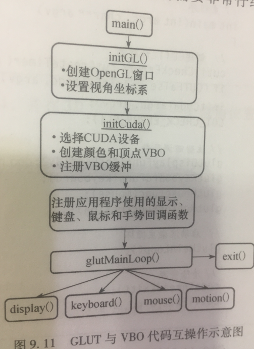
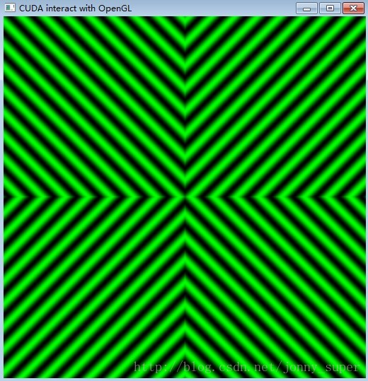
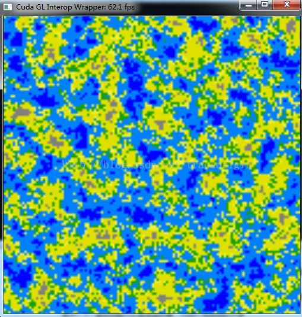
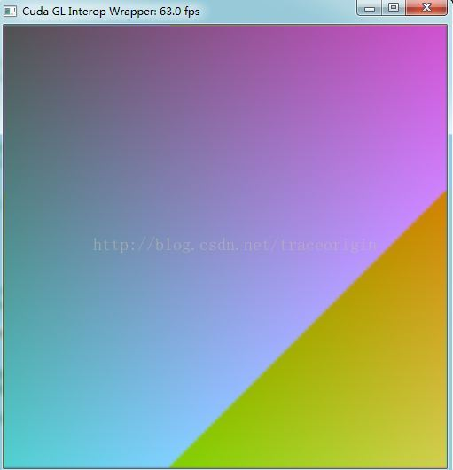

# CUDA-OpenGL的交互性介绍

CUDA-OpenGL交互性：Mapping Memory (映射内存)

OpenGL：不透明的数据缓冲对象

-   Virtex Buffer Object (VBO)

-   Pixel Buffer Object (PBO)

-   用户对其控制很有限

CUDA：C语言风格的内存管理: 用户完全可以控制

CUDA可以使用2种OpenGL内存对象：

（1）PBO：OpenGL中用于存储像素的一段内存。2D图像是由多个像素或颜色点组成的，CUDA程序映射PBO，并逐个像素生成或修改图像，然后利用OpenGL进行显示。

（2）VBO：OpenGL中用于存储3D向量的一段内存。CUDA程序映射VBO，生成或修改3D位置信息，之后OpenGL将这些网格渲染成彩色表面、3D线框图像或3D点集。

CUDA-OpenGL交互性：Map/Unmap OpenGL buffers into CUDA memory space

Rendering From a VBO（两个阶段）

init(): Create VBO Initialize VBO

display(): Populate Render Display

Rendering from a VBO with CUDA interop

init(): Create VBO Initialize VBO

Register VBO with CUDA

Map VBO to CUDA

display(): Populate

unmap VBO from CUDA

Render Display

重要的几个OpenGL-CUDA交互函数：

为CUDA注册VBO:

cudaGraphicsGLRegisterBuffer(cuda_vbo, \*vbo, flags);

将VBO映射到CUDA:

cudaGraphicsMapResources(1, cuda_vbo, 0);

cudaGraphicsResourceGetMappedPointer(&d_ptr, size, \*cuda_vbo);

从CUDA反映射VBO:

cudaGraphicsUnmapResources(1, cuda_vbo, 0);

**OpenGL**的资源可以映射至CUDA地址空间的资源有：*buffer*、*texture_和_renderbuffer* 对象。*buffer\_\_对象可以使用*cudaGraphicsGLRegisterBuffer()*来进行注册。在CUDA中，它表现的和一个设备指针一样，
因此可以通过*cudaMemcpy()*来进行读写。texture 和_renderbuffer* 对象需要使用cudaGraphicsGLRegisterImage()来进行注册。在CUDA中，它表现的像CUDA数组。核函数可以对绑定至纹理引用或者表面引用的"数组"进行读取，也可以通过表面函数对在注册时使用了cudaGraohicwRegistrerFlagsSurfaceLoadStore标志的资源进行写操作。这些数组也可以通过cudaMemcpy2D来进行读写操作。cudaGraphicsGLRegisterImage()支持所有的纹理格式（1,
2，4分量或者内置类型，归一化整数，非归一化整数）。

# CUDA-OpenGL交互函数API

## 运行时应用程序接口(Runtime application interface)

### 枚举（Enumerations）

enum cudaGLDeviceList

枚举出对应当前OpenGL上下文的CUDA设备

Values

cudaGLDeviceListAll = 1

The CUDA devices for all GPUs used by the current OpenGL context

cudaGLDeviceListCurrentFrame = 2

The CUDA devices for the GPUs used by the current OpenGL context in its
currently rendering frame

cudaGLDeviceListNextFrame = 3

The CUDA devices for the GPUs to be used by the current OpenGL context
in the next frame

### 函数（Functions）

[注意以下3个函数]{.mark}

1.  cudaGLGetDevices // 获取与当前OpenGL上下文相关的CUDA设备

2.  cudaGraphicsGLRegisterBuffer // Registers an OpenGL buffer object.

3.  cudaGraphicsGLRegisterImage // Register an OpenGL texture or
    renderbuffer object.

[分别介绍如下：]{.mark}

【1】

\_\_host\_\_
[cudaError_t](https://docs.nvidia.com/cuda/cuda-runtime-api/group__CUDART__TYPES.html#group__CUDART__TYPES_1gf599e5b8b829ce7db0f5216928f6ecb6)
cudaGLGetDevices ( unsigned int\* pCudaDeviceCount, int\* pCudaDevices,
unsigned int
cudaDeviceCount, [cudaGLDeviceList](https://docs.nvidia.com/cuda/cuda-runtime-api/group__CUDART__OPENGL.html#group__CUDART__OPENGL_1gb16c58ea3958e29c9b15cad8e5b03969)
deviceList)

参数：

pCudaDeviceCount

\- Returned number of CUDA devices corresponding to the current OpenGL
context

pCudaDevices

\- Returned CUDA devices corresponding to the current OpenGL context

cudaDeviceCount

\- The size of the output device array pCudaDevices

deviceList

\- The set of devices to return. This set may
be [[cudaGLDeviceListAll]{.underline}](https://docs.nvidia.com/cuda/cuda-runtime-api/group__CUDART__OPENGL.html#group__CUDART__OPENGL_1ggb16c58ea3958e29c9b15cad8e5b03969b1031844a49f8a68bc2c094038698a57) for
all
devices, [[cudaGLDeviceListCurrentFrame]{.underline}](https://docs.nvidia.com/cuda/cuda-runtime-api/group__CUDART__OPENGL.html#group__CUDART__OPENGL_1ggb16c58ea3958e29c9b15cad8e5b03969d9d4e71110c181530d30f573503c47f4) for
the devices used to render the current frame (in SLI),
or [[cudaGLDeviceListNextFrame]{.underline}](https://docs.nvidia.com/cuda/cuda-runtime-api/group__CUDART__OPENGL.html#group__CUDART__OPENGL_1ggb16c58ea3958e29c9b15cad8e5b039691662f007efc147b77a9fe6ff58b58c1e) for
the devices used to render the next frame (in SLI).

Returns

[cudaSuccess](https://docs.nvidia.com/cuda/cuda-runtime-api/group__CUDART__TYPES.html#group__CUDART__TYPES_1gg3f51e3575c2178246db0a94a430e0038e355f04607d824883b4a50662830d591), [cudaErrorNoDevice](https://docs.nvidia.com/cuda/cuda-runtime-api/group__CUDART__TYPES.html#group__CUDART__TYPES_1gg3f51e3575c2178246db0a94a430e0038e942e4cbbd2bef6e92e293253f055613), [cudaErrorInvalidGraphicsContext](https://docs.nvidia.com/cuda/cuda-runtime-api/group__CUDART__TYPES.html#group__CUDART__TYPES_1gg3f51e3575c2178246db0a94a430e0038dd7f0c630ce778feac72135990cba5fb), [cudaErrorUnknown](https://docs.nvidia.com/cuda/cuda-runtime-api/group__CUDART__TYPES.html#group__CUDART__TYPES_1gg3f51e3575c2178246db0a94a430e00382e491daacef266c7b3e3c1e140a6133c)

Description

Returns in \*pCudaDeviceCount the number of CUDA-compatible devices
corresponding to the current OpenGL context. Also returns
in \*pCudaDevices at most cudaDeviceCount of the CUDA-compatible devices
corresponding to the current OpenGL context. If any of the GPUs being
used by the current OpenGL context are not CUDA capable then the call
will return [cudaErrorNoDevice]{.underline}.

Note:

-   This function is not supported on Mac OS X.

-   Note that this function may also return error codes from previous,
    asynchronous launches.

See also:

[cudaGraphicsUnregisterResource](https://docs.nvidia.com/cuda/cuda-runtime-api/group__CUDART__INTEROP.html#group__CUDART__INTEROP_1gc65d1f2900086747de1e57301d709940), [cudaGraphicsMapResources](https://docs.nvidia.com/cuda/cuda-runtime-api/group__CUDART__INTEROP.html#group__CUDART__INTEROP_1gad8fbe74d02adefb8e7efb4971ee6322), [cudaGraphicsSubResourceGetMappedArray](https://docs.nvidia.com/cuda/cuda-runtime-api/group__CUDART__INTEROP.html#group__CUDART__INTEROP_1g0dd6b5f024dfdcff5c28a08ef9958031), [cudaGraphicsResourceGetMappedPointer](https://docs.nvidia.com/cuda/cuda-runtime-api/group__CUDART__INTEROP.html#group__CUDART__INTEROP_1ga36881081c8deb4df25c256158e1ac99), [cuGLGetDevices](https://docs.nvidia.com/cuda/cuda-driver-api/group__CUDA__GL.html#group__CUDA__GL_1g98bb15525b04d2f6a817c21e07d8b7cd)

【2】

\_\_host\_\_
[cudaError_t](https://docs.nvidia.com/cuda/cuda-runtime-api/group__CUDART__TYPES.html#group__CUDART__TYPES_1gf599e5b8b829ce7db0f5216928f6ecb6)
cudaGraphicsGLRegisterBuffer ( cudaGraphicsResource\*\* resource, GLuint
buffer, unsigned int flags)

参数有：

resource

\- Pointer to the returned object handle

buffer

\- name of buffer object to be registered

flags

\- Register flags

Returns

[cudaSuccess](https://docs.nvidia.com/cuda/cuda-runtime-api/group__CUDART__TYPES.html#group__CUDART__TYPES_1gg3f51e3575c2178246db0a94a430e0038e355f04607d824883b4a50662830d591), [cudaErrorInvalidDevice](https://docs.nvidia.com/cuda/cuda-runtime-api/group__CUDART__TYPES.html#group__CUDART__TYPES_1gg3f51e3575c2178246db0a94a430e0038938c6e8b96ecde62e3ab5137156f739a), [cudaErrorInvalidValue](https://docs.nvidia.com/cuda/cuda-runtime-api/group__CUDART__TYPES.html#group__CUDART__TYPES_1gg3f51e3575c2178246db0a94a430e00383e8aef5398ee38e28ed41e357b48917c), [cudaErrorInvalidResourceHandle](https://docs.nvidia.com/cuda/cuda-runtime-api/group__CUDART__TYPES.html#group__CUDART__TYPES_1gg3f51e3575c2178246db0a94a430e0038c4673247aee4d1ab8d07871f376e0273), [cudaErrorUnknown](https://docs.nvidia.com/cuda/cuda-runtime-api/group__CUDART__TYPES.html#group__CUDART__TYPES_1gg3f51e3575c2178246db0a94a430e00382e491daacef266c7b3e3c1e140a6133c)

Description

Registers the buffer object specified by buffer for access by CUDA. A
handle to the registered object is returned as resource. The register
flags flags specify the intended usage, as follows:

-   [[cudaGraphicsRegisterFlagsNone]{.underline}](https://docs.nvidia.com/cuda/cuda-runtime-api/group__CUDART__TYPES.html#group__CUDART__TYPES_1ggd17cc29b28205bbe32ac575eba16c277540ff4c59c6782d5bd5a5c7d1534df19):
    Specifies no hints about how this resource will be used. It is
    therefore assumed that this resource will be read from and written
    to by CUDA. This is the default value.

-   [[cudaGraphicsRegisterFlagsReadOnly]{.underline}](https://docs.nvidia.com/cuda/cuda-runtime-api/group__CUDART__TYPES.html#group__CUDART__TYPES_1ggd17cc29b28205bbe32ac575eba16c277f0d4f60ed6cd732dce5522dcc6252a06):
    Specifies that CUDA will not write to this resource.

-   [[cudaGraphicsRegisterFlagsWriteDiscard]{.underline}](https://docs.nvidia.com/cuda/cuda-runtime-api/group__CUDART__TYPES.html#group__CUDART__TYPES_1ggd17cc29b28205bbe32ac575eba16c2778dccc1b266c4fb93d52219bab1fb6fb0):
    Specifies that CUDA will not read from this resource and will write
    over the entire contents of the resource, so none of the data
    previously stored in the resource will be preserved.

Note:

Note that this function may also return error codes from previous,
asynchronous launches.

See also:

[cudaGraphicsUnregisterResource](https://docs.nvidia.com/cuda/cuda-runtime-api/group__CUDART__INTEROP.html#group__CUDART__INTEROP_1gc65d1f2900086747de1e57301d709940), [cudaGraphicsMapResources](https://docs.nvidia.com/cuda/cuda-runtime-api/group__CUDART__INTEROP.html#group__CUDART__INTEROP_1gad8fbe74d02adefb8e7efb4971ee6322), [cudaGraphicsResourceGetMappedPointer](https://docs.nvidia.com/cuda/cuda-runtime-api/group__CUDART__INTEROP.html#group__CUDART__INTEROP_1ga36881081c8deb4df25c256158e1ac99), [cuGraphicsGLRegisterBuffer](https://docs.nvidia.com/cuda/cuda-driver-api/group__CUDA__GL.html#group__CUDA__GL_1gd530f66cc9ab43a31a98527e75f343a0)

【3】

\_\_host\_\_
[cudaError_t](https://docs.nvidia.com/cuda/cuda-runtime-api/group__CUDART__TYPES.html#group__CUDART__TYPES_1gf599e5b8b829ce7db0f5216928f6ecb6)
cudaGraphicsGLRegisterImage ( cudaGraphicsResource\*\* resource, GLuint
image, GLenum target, unsigned int flags)

参数有：

resource

\- Pointer to the returned object handle

image

\- name of texture or renderbuffer object to be registered

target

\- Identifies the type of object specified by image

flags

\- Register flags

Returns

[cudaSuccess](https://docs.nvidia.com/cuda/cuda-runtime-api/group__CUDART__TYPES.html#group__CUDART__TYPES_1gg3f51e3575c2178246db0a94a430e0038e355f04607d824883b4a50662830d591), [cudaErrorInvalidDevice](https://docs.nvidia.com/cuda/cuda-runtime-api/group__CUDART__TYPES.html#group__CUDART__TYPES_1gg3f51e3575c2178246db0a94a430e0038938c6e8b96ecde62e3ab5137156f739a), [cudaErrorInvalidValue](https://docs.nvidia.com/cuda/cuda-runtime-api/group__CUDART__TYPES.html#group__CUDART__TYPES_1gg3f51e3575c2178246db0a94a430e00383e8aef5398ee38e28ed41e357b48917c), [cudaErrorInvalidResourceHandle](https://docs.nvidia.com/cuda/cuda-runtime-api/group__CUDART__TYPES.html#group__CUDART__TYPES_1gg3f51e3575c2178246db0a94a430e0038c4673247aee4d1ab8d07871f376e0273), [cudaErrorUnknown](https://docs.nvidia.com/cuda/cuda-runtime-api/group__CUDART__TYPES.html#group__CUDART__TYPES_1gg3f51e3575c2178246db0a94a430e00382e491daacef266c7b3e3c1e140a6133c)

Description

Registers the texture or renderbuffer object specified by image for
access by CUDA. A handle to the registered object is returned
as resource.

target must match the type of the object, and must be one of
GL_TEXTURE_2D, GL_TEXTURE_RECTANGLE, GL_TEXTURE_CUBE_MAP, GL_TEXTURE_3D,
GL_TEXTURE_2D_ARRAY, or GL_RENDERBUFFER.

The register flags flags specify the intended usage, as follows:

-   [cudaGraphicsRegisterFlagsNone](https://docs.nvidia.com/cuda/cuda-runtime-api/group__CUDART__TYPES.html#group__CUDART__TYPES_1ggd17cc29b28205bbe32ac575eba16c277540ff4c59c6782d5bd5a5c7d1534df19):
    Specifies no hints about how this resource will be used. It is
    therefore assumed that this resource will be read from and written
    to by CUDA. This is the default value.

-   [cudaGraphicsRegisterFlagsReadOnly](https://docs.nvidia.com/cuda/cuda-runtime-api/group__CUDART__TYPES.html#group__CUDART__TYPES_1ggd17cc29b28205bbe32ac575eba16c277f0d4f60ed6cd732dce5522dcc6252a06):
    Specifies that CUDA will not write to this resource.

-   [cudaGraphicsRegisterFlagsWriteDiscard](https://docs.nvidia.com/cuda/cuda-runtime-api/group__CUDART__TYPES.html#group__CUDART__TYPES_1ggd17cc29b28205bbe32ac575eba16c2778dccc1b266c4fb93d52219bab1fb6fb0):
    Specifies that CUDA will not read from this resource and will write
    over the entire contents of the resource, so none of the data
    previously stored in the resource will be preserved.

-   [cudaGraphicsRegisterFlagsSurfaceLoadStore](https://docs.nvidia.com/cuda/cuda-runtime-api/group__CUDART__TYPES.html#group__CUDART__TYPES_1ggd17cc29b28205bbe32ac575eba16c2775e6fe684d912bce0098e86e4463a5e85):
    Specifies that CUDA will bind this resource to a surface reference.

-   [cudaGraphicsRegisterFlagsTextureGather](https://docs.nvidia.com/cuda/cuda-runtime-api/group__CUDART__TYPES.html#group__CUDART__TYPES_1ggd17cc29b28205bbe32ac575eba16c277bdb2f88d1ead2a284634cf3fc63be116):
    Specifies that CUDA will perform texture gather operations on this
    resource.

The following image formats are supported. For brevity\'s sake, the list
is abbreviated. For ex., {GL_R, GL_RG} X {8, 16} would expand to the
following 4 formats {GL_R8, GL_R16, GL_RG8, GL_RG16} :

-   GL_RED, GL_RG, GL_RGBA, GL_LUMINANCE, GL_ALPHA, GL_LUMINANCE_ALPHA,
    GL_INTENSITY

-   {GL_R, GL_RG, GL_RGBA} X {8, 16, 16F, 32F, 8UI, 16UI, 32UI, 8I, 16I,
    32I}

-   {GL_LUMINANCE, GL_ALPHA, GL_LUMINANCE_ALPHA, GL_INTENSITY} X {8, 16,
    16F_ARB, 32F_ARB, 8UI_EXT, 16UI_EXT, 32UI_EXT, 8I_EXT, 16I_EXT,
    32I_EXT}

The following image classes are currently disallowed:

-   Textures with borders

-   Multisampled renderbuffers

Note:

Note that this function may also return error codes from previous,
asynchronous launches.

See also:

[cudaGraphicsUnregisterResource](https://docs.nvidia.com/cuda/cuda-runtime-api/group__CUDART__INTEROP.html#group__CUDART__INTEROP_1gc65d1f2900086747de1e57301d709940), [cudaGraphicsMapResources](https://docs.nvidia.com/cuda/cuda-runtime-api/group__CUDART__INTEROP.html#group__CUDART__INTEROP_1gad8fbe74d02adefb8e7efb4971ee6322), [cudaGraphicsSubResourceGetMappedArray](https://docs.nvidia.com/cuda/cuda-runtime-api/group__CUDART__INTEROP.html#group__CUDART__INTEROP_1g0dd6b5f024dfdcff5c28a08ef9958031), [cuGraphicsGLRegisterImage](https://docs.nvidia.com/cuda/cuda-driver-api/group__CUDA__GL.html#group__CUDA__GL_1g52c3a36c4c92611b6fcf0662b2f74e40)

## 图形接口(Graphics Interporability)

下面介绍7个CUDA运行时应用程序的图形交互函数。

（1）cudaGraphicsMapResources // 映射图形资源，可以被CUDA访问

参数包括：

count

\- Number of resources to map

resources

\- Resources to map for CUDA

stream

\- Stream for synchronization

（2）cudaGraphicsResourceGetMappedMipmappedArray

Get a mipmapped array through which to access a mapped graphics
resource.

（3）cudaGraphicsResourceGetMappedPointer

Get an device pointer through which to access a mapped graphics
resource.

（4）cudaGraphicsResourceSetMapFlags

（5）cudaGraphicsSubResourceGetMappedArray

（6）cudaGraphicsUnmapResources // Unmap graphics resources.

（7）cudaGraphicsUnregisterResource // Unregisters a graphics resource
for access by CUDA.

一旦某个资源对CUDA进行了注册，便可以根据需要通过cudaGraphicsUnmapResources()和cudaGraphicsUnregisterResource()多次进行映射和解除映射的操作。cudaGraphicsResourceSetMapFlags方法用于设置提示标识（例如，只读、只写等），以便CUDA驱动程序进行优化资源管理。

# 简单的CUDA-OpenGL交互（基于PBO）

实现CUDA和OpenGL的互操作，使得GPU能够将通用计算的运算结果交给OpenGL进行绘制。

本文的应用程序主要包括两个方面：

1.使用CUDA核函数生成图像数据；

2.将数据传递给OpenGL驱动程序并进行渲染。

实现这个功能需要按如下4个步骤：

Step1:申明两个全局变量，保存指向同一个缓冲区的不同句柄，指向要在OpenGL和CUDA之间共享的数据；

Step2:选择运行应用程序的CUDA设备(cudaChooseDevice),告诉cuda运行时使用哪个设备来执行CUDA和OpenGL
(cudaGLSetGLDevice）；（CUDA5.0以后废除了cudaGLSetGLDevice）

Step3：在OpenGL中创建像素缓冲区对象；

Step4:
通知CUDA运行时将像素缓冲区对象bufferObj注册为图形资源，实现缓冲区共享。

然后就可以按照一般的CUDA程序调用核函数进行计算。运行结果如下：

Jason Sanders, Edward Kandrot, CUDA By Example: An Introduction to
General-Purpose GPU Programming (2011).

# cuda与opengl互操作之VBO

opengl的缓冲区可以映射到CUDA的地址空间，当做global memory被访问。

这样做可以使计算得到的数据直接可视化，提升速度。

因为数据存储在设备端，没有设备端到主机端的传输耗费，不论计算还是可是化都相当的快。

具体使用6个步骤：

1、创建VBO (完全是OpenGL API)

glGenBuffers(1, vbo);

glBindBuffer(GL_ARRAY_BUFFER, \*vbo);

glBufferData(GL_ARRAY_BUFFER, size, 0, GL_DYNAMIC_DRAW);

glBindBuffer(GL_ARRAY_BUFFER, 0);

2、注册VBO

struct cudaGraphicsResource \*cuda_vbo_resource;

cudaGraphicsGLRegisterBuffer(&cuda_vbo_resource, \*vbo,
cudaGraphicsMapFlagsWriteDiscard);

3、映射VBO

cudaGraphicsMapResources(1, &cuda_vbo_resource, 0);

cudaGraphicsResourceGetMappedPointer((void\*\*)&dptr, &num_bytes,
cuda_vbo_resource);

4、使用

launch_kernel(dptr, mesh_width, mesh_height, animTime);

5、解除映射

cudaGraphicsUnmapResources(1, &cuda_vbo_resource, 0);

6、解除注册

cudaGraphicsUnregisterResource(cuda_vbo_resource);

7、删除VBO

glBindBuffer(GL_ARRAY_BUFFER, \*vbo);

glDeleteBuffers(1, vbo);

8、绘制？

glDrawArrays

## 代码实例

参考SimpleGL代码以及Learning_VBO_PBO

# cuda与opengl互操作之PBO

PBO（像素缓冲区对象）也可以映射到CUDA地址空间，CUDA的kernel函数可以讲计算结果直接写到PBO中，然后将PBO的内容复制到texture，进行绘制。

具体使用步骤：

1、创建PBO（完全的OpenGL API）

// Generate a buffer ID called a PBO (Pixel Buffer Object)

glGenBuffers(1,pbo);

// Make this the current UNPACK buffer (OpenGL is state-based)

glBindBuffer(GL_PIXEL_UNPACK_BUFFER, \*pbo);

// Allocate data for the buffer. 4-channel 8-bit image

glBufferData(GL_PIXEL_UNPACK_BUFFER, size_tex_data, NULL,
GL_DYNAMIC_COPY);

2、注册PBO [（与VBO一样！）]{.mark}

struct cudaGraphicsResource \*cuda_pbo_resource;

cudaGraphicsGLRegisterBuffer(&cuda_pbo_resource, \*pbo,
cudaGraphicsMapFlagsWriteDiscard);

3、映射PBO[（与VBO一样！）]{.mark}

cudaGraphicsMapResources(1, &cuda_pbo_resource, 0);

cudaGraphicsResourceGetMappedPointer((void\*\*)&d_output, &num_bytes,
cuda_pbo_resource);

4、使用

launch_kernel(d_output, window_width, window_height, w);

5、解除映射

cudaGraphicsUnmapResources(1, &cuda_pbo_resource, 0);

6、解除注册

cudaGraphicsUnregisterResource(cuda_pbo_resource);

7、删除PBO

glBindBuffer(GL_ARRAY_BUFFER, \*pbo);

glDeleteBuffers(1, pbo);

8、绘制

glBindBuffer(GL_PIXEL_UNPACK_BUFFER, pbo);

glBindTexture(GL_TEXTURE_2D, textureID);

[glTexSubImage2D]{.mark}(GL_TEXTURE_2D, 0, 0, 0, 128, 128,
/\*window_width, window_height,\*/ GL_RGBA, GL_UNSIGNED_BYTE, NULL);

glBegin(GL_QUADS);

glTexCoord2f(0.0f,1.0f); glVertex3f(0.0f,0.0f,0.0f);

glTexCoord2f(0.0f,0.0f); glVertex3f(0.0f,1.0f,0.0f);

glTexCoord2f(1.0f,0.0f); glVertex3f(1.0f,1.0f,0.0f);

glTexCoord2f(1.0f,1.0f); glVertex3f(1.0f,0.0f,0.0f);

glEnd();

## 代码实例

参考simpleCUDA2GL和cuda2GL(GLFW版本)以及Learning_VBO_PBO

# 同第1个示例PBO

最近在学习OpenGL，过程中需要使用CUDA进行并行计算。因此，需要解决OpenGL与CUDA的交互问题。学习记录如下：

-   Step1. 共享数据区

想到交互，不难想到通信，数据共享等词语。这里使用的是共享数据的方式来完成OpenGL与CUDA的交互。而OpenGL与CUDA都有着自己独特的类型定义。因此，对于共享的数据区，我们需要给它起两个不同的名字，分别为OpenGL以及CUDA服务。

OpenGL：

GLuint bufferObj;

CUDA：

cudaGraphicsResource \*resource;

-   Step2.将显卡设备与OpenGL关联（已废除）

注：在CUDA5.0版本以及以后的版本，不需要此操作。参考NVIDIA官方文档如下：

[cudaError_t](http://localhost/CUDA/cuda-runtime-api/index.html#group__CUDART__TYPES_1gf599e5b8b829ce7db0f5216928f6ecb6)
cudaGLSetGLDevice ( int device)

[Deprecated](http://localhost/CUDA/cuda-runtime-api/index.html#deprecated__deprecated_1_deprecated000031)
This function is deprecated as of CUDA 5.0. This function is deprecated
and should no longer be used. It is no longer necessary to associate a
CUDA device with an OpenGL context in order to achieve maximum
interoperability performance. 

具体的设置代码为：

cudaDeviceProp prop;

int dev;

memset(&prop, 0, sizeof(cudaDeviceProp));

prop.major = 1;

prop.minor = 0;

cudaChooseDevice(&dev, &prop);

cudaGLSetGLDevice(dev);

-   Step3. 初始化OpenGL

#define DIM 512

glutInit(argc, argv);

glutInitDisplayMode(GLUT_DOUBLE \| GLUT_RGBA);

glutInitWindowSize(DIM, DIM);

glutCreateWindow(\"bitmap\");

glewInit();

这里需要注意的是：

1.  需要使用opengl扩展库：glew32.dll。若您没有glew32扩展库，[点此下载](http://download.csdn.net/detail/ruby97/5301227)  (其安装方式与glut，freeglut等相同)

2.  （重要）需要在opengl初始化代码最后加上：glewInit()，否则会在后面执行到glGenBuffers报运行时错误：0xC0000005:
    > Access violation.

3.  使用glew库需要： #include
    > \"gl/glew.h\"，且其声明的位置尽量放在代码最顶端，否则编译报错。

4.  具体示例代码，[点此下载](http://download.csdn.net/detail/ruby97/5301208)

------------------------------------------------------   华丽的分割线
------------------------------------------------------------

到此为止，基本的准备工作就完成了。下面开始实际的工作。

共享数据缓冲区是在CUDA C核函数 和 OpenGL渲染操作之间
实现互操作的关键部分。为了实现两者之间的数据传递，我们首先需要创建一个缓冲区。

-   Step4. 使用OpenGL API创建数据缓冲区

const GLubyte\* a;

a = glGetString(GL_EXTENSIONS);

glGenBuffers(1, &bufferObj);*//生成一个缓冲区句柄*

glBindBuffer(GL_PIXEL_UNPACK_BUFFER_ARB,
bufferObj);*//将句柄绑定到像素缓冲区（即缓冲区存放的数据类型为：PBO）*

glBufferData(GL_PIXEL_UNPACK_BUFFER_ARB, DIM\*DIM\*4, NULL,
GL_DYNAMIC_DRAW_ARB);*//申请内存空间并设置相关属性以及初始值*

这里，我们使用如下枚举值：

GL_PIXEL_UNPACK_BUFFER_ARB

表示指定缓冲区存储的内容是一个Pixel Buffer Object（PBO）

GL_DYNAMIC_DRAW_ARB

表示应用程序将会对缓冲区进行修改

这时，可能你会疑问，前两句代码是干嘛的？

因为，GL_PIXEL_UNPACK_BUFFER_ARB对glew扩展库的版本有要求，所以最好检查一下当前环境是否支持GL_PIXEL_UNPACK_BUFFER_ARB枚举值。

可以看到，我的环境是支持GL_ARB_pixel_buffer_object的，如果您的环境不支持该枚举值，可能需要您更新glew扩展库版本。

-   Step5. 把缓冲区分享给CUDA

由于我们的目的是要使用CUDA的并行计算能力，所以CUDA必须要有权利访问共享数据缓冲区。

要实现该操作，需要将缓冲区句柄注册为一个图形资源，即Graphics
Resource；然后"分享给CUDA"

cudaGraphicsGLRegisterBuffer(&resource, bufferObj,
cudaGraphicsMapFlagsNone)

代码中的resource即之前定义的：

cudaGraphicsResource \*resource;

方法cudaGraphicsGLRegisterBuffer的参数3表示缓冲区属性，它有以下三种可选值：

1.  [cudaGraphicsRegisterFlagsNone](http://localhost/CUDA/cuda-runtime-api/index.html#group__CUDART__TYPES_1ggd17cc29b28205bbe32ac575eba16c277540ff4c59c6782d5bd5a5c7d1534df19) :
Specifies no hints about how this resource will be used. It is therefore
assumed that this resource will be read from and written to by CUDA.
This is the default value.

2.  [cudaGraphicsRegisterFlagsReadOnly](http://localhost/CUDA/cuda-runtime-api/index.html#group__CUDART__TYPES_1ggd17cc29b28205bbe32ac575eba16c277f0d4f60ed6cd732dce5522dcc6252a06) :
Specifies that CUDA will not write to this resource.（只读）

3.  [cudaGraphicsRegisterFlagsWriteDiscard](http://localhost/CUDA/cuda-runtime-api/index.html#group__CUDART__TYPES_1ggd17cc29b28205bbe32ac575eba16c2778dccc1b266c4fb93d52219bab1fb6fb0) :
Specifies that CUDA will not read from this resource and will write over
the entire contents of the resource, so none of the data previously
stored in the resource will be preserved.（只写）

-   Step6. 让CUDA映射共享资源，并获取相对于显卡而言的设备指针

uchar4\* devPtr;

size_t size;

cudaGraphicsMapResources(1, &resource, NULL);

cudaGraphicsResourceGetMappedPointer((void\*\*)&devPtr, &size,
resource);

CUDA官方文档中这样描述：CUDA在访问图形接口（比如openGL）的共享资源之前，需要首先对其进行映射(map)，然后才可以访问共享数据区，CUDA对资源的访问过程中，OpenGL不能对该数据区其进行任何操作，直到CUDA对数据区解除映射（unmap）为止。

Nvidia的原文描述如下：

Map graphics resources for access by CUDA. Maps the count graphics
resources in resources for access by CUDA.

The resources in resources may be accessed by CUDA until they are
unmapped. The graphics API from which resources were registered should
not access any resources while they are mapped by CUDA. If an
application does so, the results are undefined.

映射完成后，我们需要获得缓冲区对于显卡（设备）而言的指针，即代码中的
devPtr。没有设备指针，我们怎么进行并行计算呢。

-   Step7. 执行CUDA核函数

dim3 grids(DIM/16, DIM/16);

dim3 threads(16, 16);

kernel_opengl\<\<\<grids, threads\>\>\>(devPtr);

一个简单的核函数kernel_opengl的定义如下：

\_\_global\_\_ void kernel_opengl(uchar4\* ptr){

int x = threadIdx.x + blockIdx.x \* blockDim.x;

int y = threadIdx.y + blockIdx.y \* blockDim.y;

int offset = x + y \* blockDim.x \* gridDim.x;

float fx = x/(float)DIM - 0.5f;

float fy = y/(float)DIM - 0.5f;

unsigned char green = 128 + 127 \* sin(abs(fx\*100) - abs(fy\*100));

ptr\[offset\].x = 0;

ptr\[offset\].y = green;

ptr\[offset\].z = 0;

ptr\[offset\].w = 255;

}

此时，执行完核函数，CUDA的使命也就完成了。它的产出就是：缓冲区的数据已经被更新了\~\~

-   Step8. 解除CUDA对共享缓冲区的映射

cudaGraphicsUnmapResources(1, &resource, NULL)

如果不解除映射，那么OpenGL将没有权限访问共享数据区，因此也就没有办法完成图像的渲染显示了。

-   Step9. 调用OpenGL API显示

glutKeyboardFunc(key_func);

glutDisplayFunc(draw_func);

glutMainLoop();

其中，显示回调函数为：

static void draw_func(void){

glDrawPixels(DIM, DIM, GL_RGBA, GL_UNSIGNED_BYTE, 0);

glutSwapBuffers();

}

乍一看，可能感觉会比较奇怪。因为draw_func里面没有使用到缓冲区句柄bufferObj，那么数据如何会显示呢？

因为，之前的代码：

glBindBuffer(GL_PIXEL_UNPACK_BUFFER_ARB, bufferObj);

该调用将共享缓冲区指定为一个像素源，OpenGL驱动程序随后会在所有对glDrawPixels()的调用中使用这个像素源。这也就说明了我们为什么使用glDrawPixels来绘制图形了。

通过查看glDrawPixels的文档：

void glDrawPixels(

GLsizei width,

GLsizei height,

GLenum format,

GLenum type,

const GLvoid \*pixels

);

不难发现其最后一个参数为一个缓冲区指针。如果没有任何缓冲区被指定为GL_PIXEL_UNPACK_BUFFER_ARB源，那么OpenGL将从这个参数指定的缓冲区进行数据复制并显示。但在本例中，我们已经将共享数据缓冲区指定为GL_PIXEL_UNPACK_BUFFER_ARB。此时，该参数含义将变为：已绑定缓冲区内的偏移量，由于我们要绘制整个缓冲区，因此这便宜量就是0.
