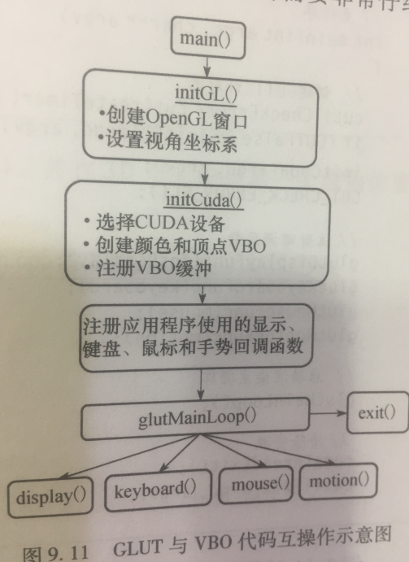

# 基于C++与CUDA的N卡GPU并行程序------OpenGL图形互操作性

<https://blog.csdn.net/wanchaochaochao/article/details/105912910>

[摘要：本文较系统地介绍了如何实现OpenGL与CUDA的交互性，以及鼠标设备通过OpenGL与CUDA程序实现交互式计算。]{.mark}

## 图形互操作性的极简框架示例

GPU的成功要归功于它能实时计算复杂的渲染任务，同时系统的其他部分还可以执行其他的任务，这就带来了一个显而易见的问题：能否在同一个应用程序中GPU既执行渲染计算，又执行通用计算?如果要渲染的图像依赖通用计算的结果,那么该如何处理？或者在已经渲染的帧上执行某种图像处理，又该如何实现?

在通用计算和渲染模式之间存在这种互操作，CUDA
C应用程序可以无缝地与OpenGL和DirectX这两种实时渲染API进行互操作。本文示例，在CUDA计算生成图像数据，然后使用OpenGL进行渲染显示.原来在GPU上的CUDA数据，需要传递到CPU上才能进行显示，但是用上OpenGL进行渲染显示之后,就可以不需要CPU的参与，OpenGL可以直接在内存上读取数据并进行显示，少了CPU的中间环节,程序的性能也会提高一些.但是这里需要将OpenGL和CUDA的内存资源进行打通链接，使内存可以在OpenGL和CUDA之间共享，因此首先声明两个全局变量来保存句柄，这个句柄指向将要在OpenGL和CUDA之间共享的数据内存.之所以需要两个独立的变量，是因为OpenGL和CUDA对于这个共享的内存资源，各自有着不同的\"名字\"。变量bufferObj是OpenGL对这个数据内存的命名，二变量resource则是CUDA对这个数据内存的命名。

#include \"GL/glut.h\"

#include \"cuda.h\"

#include \"cuda_gl_interop.h\"

#include \"../common/book.h\"

#include \"../common/gpu_bitmap.h\"

#define DIM 1024

GLuint bufferObj; //OpenGL命名

cudaGraphicsResource \*resource; //CUDA命名

在有些系统上可能有多个GPU，所以需要自动识别并选定一个GPU设备进行CUDA的计算，这段代码是指在运行选择一个拥有1.0或更高版本计算功能集的GPU。首先创建一个cudaDeviceProp结构并将其初始化为空，然后将major版本设置为1，minor版本设置为0。然后将这个结构传递给cudaChooseDevice(),这个函数将在运行时选择系统中的某个满足cudaDeviceProp结构制定条件的GPU。这样就可以选择并获取GPU设备的ID编号并将其存储到dev变量中，最后将设备编号dev传递到cudaGLSetGLDevice()中，就可以将其GPU设备设置为CUDA运行设备。具体的代码如下.

int main( int argc, char \*\*argv ){

cudaDeviceProp prop;

int dev;

memset( &prop, 0, sizeof( cudaDeviceProp ) );

prop.major = 1;

prop.minor = 0;

HANDLE_ERROR( cudaChooseDevice( &dev, &prop ) );

HANDLE_ERROR( cudaGLSetGLDevice( dev ) );

}

但是,在CUDA5.0的更高版本之后,上一段代码是不需要的,可以直接注释或者删除,如果没有删除,那么在进行编译的时候,会有提示说不用使用cudaGLSetGLDevice().\
在CUDA运行初始化之后,就可以继续调用GL工具箱的设置函数来初始化OpenGL驱动程序,初始化并创建一个窗口,之后将在这个窗口中绘制结果,具体代码如下所示.

glutInit( &argc, argv );

glutInitDisplayMode( GLUT_DOUBLE \| GLUT_RGBA );//初始化显示模式

glutInitWindowSize( DIM, DIM ); //设置窗口大小

glutCreateWindow( \"bitmap\" ); //创建窗口,名称为bitmap

现在开始执行实际的OpenGL互操作,需要注意的是,共享数据缓冲区是在CUDA核函数和OpenGL渲染操作之间实现互操作的关键部分.要在OpenGL和CUDA之间传递数据,我们首先要创建一个缓冲区在这两组API之间使用.首先在OpenGL创建一个像素缓冲区对象（PBO）,并将句柄保存在全局变量GLuint
bufferObj中.首先通过glGenBuffers()生成一个缓冲区句柄,然后通过glBingBuffer()将句柄绑定到像素缓冲区,最后通过glBufferData()请求OpenGL驱动程序来分配一个缓冲区.在这个示例中请求分配一个DIM\*DIM个32位的值,并且使用GL_DYNAMIC_DRAW_ARB表示这个缓冲区被应用程序反复修改,由于没有任何数据预先加载到缓冲区,因此glBufferData()的倒数第二个参数设置为NULL.

glBindBuffer = (PFNGLBINDBUFFERARBPROC)
GET_PROC_ADDRESS(\"glBindBuffer\");

glDeleteBuffers = (PFNGLDELETEBUFFERSARBPROC)
GET_PROC_ADDRESS(\"glDeleteBuffers\");

glGenBuffers = (PFNGLGENBUFFERSARBPROC)
GET_PROC_ADDRESS(\"glGenBuffers\");

glBufferData = (PFNGLBUFFERDATAARBPROC)
GET_PROC_ADDRESS(\"glBufferData\");

glGenBuffers( 1, &bufferObj );

glBIndBuffer( GL_PIXEL_UNPACK_BUFFER_ARB, bufferObj );

glBufferData( GL_PIXEL_UNPACK_BUFFER_ARB, DIM \* DIM \* 4,

NULL, GL_DYNAMIC_DRAW_ARB );

的工作就是通知CUDA运行时,缓冲区bufferObj将在CUDA与OpenGL之间共享,要实现这个操作,需要将bufferObj注册为一个图形资源.通过调用cudaGraphicsGLRegisterBuffer(),我们告诉CUDA运行时希望在OpenGL和CUDA之间使用OpenGL的bufferObj,CUDA将在变量resource中返回一个句柄指向缓冲区,随后将通过这个句柄resource来访问bufferObj.cudaGraphicsMapFlagsNone表示不需要为缓冲区指定特定的行为,cudaGraphicsMapFlagsReadOnly则表示只读,cudaGraphicsMapFlagsWriteDiscard表示缓冲区中之前的内容应该抛弃,从而变成只写的.需要注意的是,在linux系统中,如果一块GPU同时进行显示输出和CUDA计算,那么可能会有运行报错.错误提示在cudaGraphicsGLRegisterBuffer()函数遇到一个错误,这时需要使用另一个显卡将显示输出传递到电脑显示器上,这个显卡可以是集显,核显或者AMD显卡,之后只使用N卡GPU来执行CUDA计算.

HANDLE_ERROR(

cudaGraphicsGLRegisterBuffer( &resource,

bufferObj,

cudaGraphicsMapFlagsNone ) );

在OpenGL中使用bufferObj来引用这个缓冲区,在CUDA中通过指针resource来引用这个缓冲区,由于我们需要在CUDA
C核函数中对这个缓冲区进行读写,因此需要多个指向该对象的句柄,我们需要GPU设备内存中的一个实际地址并传递给核函数,首先告诉CUDA运行映射这个共享资源,然后请求一个指向被映射资源的指针.然后,可以把devPtr作为设备指针来使用,此外还可以作为一个像素源由OpenGL使用.

HANDLE_ERROR( cudaGraphicsMapResources( 1, &resource, NULL ) );

uchar4\* devPtr;

size_t size;

HANDLE_ERROR(

cudaGraphicsResourceGetMappedPointer( (void\*\*)&devPtr,

&size,

resource) );

在完成这些设置之后,main()剩余工作主要是:首先,启动核函数并将指向共享缓冲区的指针传递给它,该核函数的作用是生成将要显示的图像数据.其次,取消对共享缓冲区内存资源的映射,需要注意是,要在执行绘制任务之前取消这个内存资源的映射,这样能确保CUDA部分和图形显示部分之间实现同步,取消映射之前的所有CUDA操作完成之后,才会开始执行取消映射之后的图形调用.最后可以通过GLUT注册键盘回调函数和显示回调函数,并通过glutMainLoop()将执行控制交给GLUT绘制循环.

dim3 grids(DIM/16,DIM/16);

dim3 threads(16,16);

kernel\<\<\<grids,threads\>\>\>( devPtr );

HANDLE_ERROR( cudaGraphicsUnmapResources( 1, &resource, NULL ) );

// set up GLUT and kick off main loop

glutKeyboardFunc( key_func );

glutDisplayFunc( draw_func );

glutMainLoop();

这个应用程序的剩余部分是三个函数kernel(),key_func(),draw_func().首先是核函数用来生成图像数据,这个图像的生成比较简单,具体代码如下所示

\_\_global\_\_ void kernel( uchar4 \*ptr ) {

// map from threadIdx/BlockIdx to pixel position

int x = threadIdx.x + blockIdx.x \* blockDim.x;

int y = threadIdx.y + blockIdx.y \* blockDim.y;

int offset = x + y \* blockDim.x \* gridDim.x;

// now calculate the value at that position

float fx = x/(float)DIM - 0.5f;

float fy = y/(float)DIM - 0.5f;

unsigned char green = 128 + 127 \*

sin( abs(fx\*100) - abs(fy\*100) );

// accessing uchar4 vs unsigned char\*

ptr\[offset\].x = 0;

ptr\[offset\].y = green;

ptr\[offset\].z = 0;

ptr\[offset\].w = 255;

}

上述的核函数生成图像数据之后,还需要OpenGL来绘制缓冲区中的数据,上述glBindBuffer()函数将共享缓冲区绑定为像素源,之后使用glDrawPixels()函数来绘制图像,其中最后一个输入参数0表示缓冲区的偏移,这就是draw_func()函数需要执行的工作.

static void draw_func( void ) {

// we pass zero as the last parameter, because out bufferObj is now

// the source, and the field switches from being a pointer to a

// bitmap to now mean an offset into a bitmap object

glDrawPixels( DIM, DIM, GL_RGBA, GL_UNSIGNED_BYTE, 0 );

glutSwapBuffers();

}

最后实现键盘回调函数,如果按下Esc键,那么程序将会结束退出,回调函数key_func()如下所示.

static void key_func( unsigned char key, int x, int y ) {

switch (key) {

case 27:

// clean up OpenGL and CUDA

HANDLE_ERROR( cudaGraphicsUnregisterResource( resource ) );

glBindBuffer( GL_PIXEL_UNPACK_BUFFER_ARB, 0 );

glDeleteBuffers( 1, &bufferObj );

exit(0);

}

}

当运行这个示例时,将会绘制一个具有催眠效果的图片,你可以使用这张图片对你的朋友(或者敌人)进行催眠.

{width="2.7597222222222224in"
height="2.74375in"}

## 交互式动画示例

上述的例子只是显示一张简单的图像,这个例子将记录并解释如何显示一个动画输出,并[且能够用鼠标进行互操作,]{.mark}从而实现令人印象深刻的交互式动画.Talk
is cheap.首先上代码：

#include \"../common/book.h\"

#include \"../common/gpu_anim.h\"

#define DIM 1024

\_\_global\_\_ void kernel( uchar4 \*ptr, int ticks ) {

// map from threadIdx/BlockIdx to pixel position

int x = threadIdx.x + blockIdx.x \* blockDim.x;

int y = threadIdx.y + blockIdx.y \* blockDim.y;

int offset = x + y \* blockDim.x \* gridDim.x;

// now calculate the value at that position

float fx = x - DIM/2;

float fy = y - DIM/2;

float d = sqrtf( fx \* fx + fy \* fy );

unsigned char grey = (unsigned char)(128.0f + 127.0f \*

cos(d/10.0f - ticks/7.0f) /

(d/10.0f + 1.0f));

ptr\[offset\].x = grey;

ptr\[offset\].y = grey;

ptr\[offset\].z = grey;

ptr\[offset\].w = 255;

}

void generate_frame( uchar4 \*pixels, void\*, int ticks ) {

dim3 grids(DIM/16,DIM/16);

dim3 threads(16,16);

kernel\<\<\<grids,threads\>\>\>( pixels, ticks );

}

int main( void ) {

GPUAnimBitmap bitmap( DIM, DIM, NULL );

bitmap.anim_and_exit(

(void (\*)(uchar4\*,void\*,int))generate_frame, NULL );

}

可以看到这份代码似乎更加简短了,主函数只有两行,剩下的子函数也只是定义了如何生成图像数据,关于OpenGL互操作的繁琐代码似乎没看到,这也太神奇了吧,原来这是因为另外定义了一个类GPUAnimBitmap,然后把所有关于互操作的繁琐代码都放进去封装好了.

现在开始浏览GPUAnimBitmap类的代码,首先是数据成员的定义如下.bufferObj和resource分别是共享缓冲区的句柄变量,width和height定义了窗口的尺寸.

struct GPUAnimBitmap{

GLuint bufferObj;

cudaGraphicsResource \*resource;

int width, height;

void \*dataBlock;

void (\*fAnim)(uchar4\*,void\*,int);

void (\*animExit)(void\*);

void (\*clickDrag)(void\*,int,int,int,int);

int dragStartX, dragStartY;

}

需要注意的是dataBlock,用户如果需要实现自己特定的功能,那么就需要把特定的数据存储为dataBlock,这样就可以非常方便的在类的内部实现特定数据的存储和调用,因为这是自己定义的特定类型,所以无法预先定义为某种类型,所以将其定义为void\*指针类型,所以在之后的调用时,需要对dataBlock进行强制类型转换,而且GPUAnimBitmap这个类不会访问这个用户数据,只是将其传递给已注册的回调函数.

用户注册的灰调函数将保存在fAnim,animExit以及clickDrag中.在每次调用glutIdleFunc()时都将调用fAnim(),这个函数负责生成在动画中绘制的图像数据,在动画退出时将调用animExit()一次,用户应该在这个函数中实现当动画结束时需要执行的清理代码.

最后还有一个可选函数clickDrag(),这个函数将响应用户的鼠标点击拖拽等事件.如果用户注册了这个函数,那么当按下拖拽或者释放鼠标时,都将调用该函数.鼠标点击的初始起点位置保存在(dragStartX,
dragStartY)中,当释放鼠标时,点击拖拽等事件的起始位置和结束位置就会传递给用户,从而实现令人印象深刻的交互式动画。

如下所示是GPUAnimBitmap类的构造函数,其代码和上节讲的OpenGl交互操作的初始化过程很相似,当然上述也提到了,cudaGLSetGLDevice()那一段可以删掉.其大致过程就是选择一个CUDA设备,然后使用glutInit()初始化GLUT窗口,然后是请求OpenGL驱动程序分配一个缓冲区句柄并绑定到像素源,最后请求OpenGL驱动程序分配一块GPU内存,完成之后将缓冲区通知给CUDA,通过cudaGraphicsGLRegisterBuffer()来注册bufferObj从而获取一个CUDA
C名字.

struct GPUAnimBitmap{

GLuint bufferObj;

cudaGraphicsResource \*resource;

int width, height;

void \*dataBlock;

void (\*fAnim)(uchar4\*,void\*,int);

void (\*animExit)(void\*);

void (\*clickDrag)(void\*,int,int,int,int);

int dragStartX, dragStartY;

GPUAnimBitmap( int w, int h, void \*d = NULL ) {

width = w;

height = h;

dataBlock = d;

clickDrag = NULL;

// first, find a CUDA device and set it to graphic interop

cudaDeviceProp prop;

int dev;

memset( &prop, 0, sizeof( cudaDeviceProp ) );

prop.major = 1;

prop.minor = 0;

HANDLE_ERROR( cudaChooseDevice( &dev, &prop ) );

cudaGLSetGLDevice( dev );

// a bug in the Windows GLUT implementation prevents us from

// passing zero arguments to glutInit()

int c=1;

char\* dummy = \"\";

glutInit( &c, &dummy );

glutInitDisplayMode( GLUT_DOUBLE \| GLUT_RGBA );

glutInitWindowSize( width, height );

glutCreateWindow( \"bitmap\" );

glBindBuffer =
(PFNGLBINDBUFFERARBPROC)GET_PROC_ADDRESS(\"glBindBuffer\");

glDeleteBuffers =
(PFNGLDELETEBUFFERSARBPROC)GET_PROC_ADDRESS(\"glDeleteBuffers\");

glGenBuffers =
(PFNGLGENBUFFERSARBPROC)GET_PROC_ADDRESS(\"glGenBuffers\");

glBufferData =
(PFNGLBUFFERDATAARBPROC)GET_PROC_ADDRESS(\"glBufferData\");

glGenBuffers( 1, &bufferObj );

glBindBuffer( GL_PIXEL_UNPACK_BUFFER_ARB, bufferObj );

glBufferData( GL_PIXEL_UNPACK_BUFFER_ARB, width \* height \* 4,

NULL, GL_DYNAMIC_DRAW_ARB );

HANDLE_ERROR( cudaGraphicsGLRegisterBuffer( &resource, bufferObj,
cudaGraphicsMapFlagsNone ) );

}

\~GPUAnimBitmap() {

free_resources();

}

}

在完成OpeenGL的互操作的初始化代码后,现在面临的问题是如何绘制图像数据,绘制操作的主要工作是通过函数glutIdleFunction()完成的.这个函数要做三件事,首先映射共享缓冲区并获取指向该缓冲区的GPU指针,其次调用用户指定的函数fAnim(),这个函数会启动一个CUDA
C核函数并用图像数据来填充devPtr指向缓冲区,最后取消GPU指针的映射,释放OpenGL驱动程序使用的缓冲区,并使用glutPostRedisplay()绘制图像.

static void idle_func( void ) {

static int ticks = 1;

GPUAnimBitmap\* bitmap = \*(get_bitmap_ptr());

uchar4\* devPtr;

size_t size;

HANDLE_ERROR( cudaGraphicsMapResources( 1, &(bitmap-\>resource), NULL )
);

HANDLE_ERROR( cudaGraphicsResourceGetMappedPointer( (void\*\*)&devPtr,
&size, bitmap-\>resource) );

bitmap-\>fAnim( devPtr, bitmap-\>dataBlock, ticks++ );

HANDLE_ERROR(cudaGraphicsUnmapResources(1, &(bitmap-\>resource), NULL )
);

glutPostRedisplay();

}

最后是在核函数上生成波纹的图像数据，从而实现波纹动画,这个核函数的过程比较简单，代码如下所示。

\_\_global\_\_ void kernel( uchar4 \*ptr, int ticks ) {

// map from threadIdx/BlockIdx to pixel position

int x = threadIdx.x + blockIdx.x \* blockDim.x;

int y = threadIdx.y + blockIdx.y \* blockDim.y;

int offset = x + y \* blockDim.x \* gridDim.x;

// now calculate the value at that position

float fx = x - DIM/2;

float fy = y - DIM/2;

float d = sqrtf( fx \* fx + fy \* fy );

unsigned char grey = (unsigned char)(128.0f + 127.0f \*

cos(d/10.0f - ticks/7.0f) /

(d/10.0f + 1.0f));

ptr\[offset\].x = grey;

ptr\[offset\].y = grey;

ptr\[offset\].z = grey;

ptr\[offset\].w = 255;

}

CUDA核函数kernel()是生成图像数据的,除此之外还需要编写一个主机端的函数,在这个函数中需要启动CUDA
C核函数,最后把这个函数保存在GPUAnimBitmap的成员idle_func()中.这样就可以生成一个波纹动画

void generate_frame( uchar4 \*pixels, void\*, int ticks ) {

dim3 grids(DIM/16,DIM/16);

dim3 threads(16,16);

kernel\<\<\<grids,threads\>\>\>( pixels, ticks );

}

{width="3.0479166666666666in"
height="2.959722222222222in"}

上述已经实现了可以动态刷新的动画效果,但是依然没有鼠标操作,接下来把鼠标的点击拖拽操作加到动画中.我们继续浏览GPUAnimBitmap类中的函数.首先是anim_and_exit()函数,在主程序中通过bitmap.anim_and_exit()来执行动画绘制,是重要的组成部分.函数的参数列表中,第一个是用户定义的函数,这个用来生成图像数据，通过参数传递并赋值给fAnim，第二个是退出函数,赋值给animExit,这个能够注册执行用户的回调函数。然后创建指针\*bitmap，并将this赋值给bitmap，就能获取当前所定义的bitmap缓冲区数据，Key和Draw分别是键盘和绘制初始图像的函数。

void anim_and_exit( void (\*f)(uchar4\*,void\*,int), void(\*e)(void\*) )
{

GPUAnimBitmap\*\* bitmap = get_bitmap_ptr();

\*bitmap = this;

fAnim = f;

animExit = e;

glutKeyboardFunc( Key );

glutDisplayFunc( Draw );

if (clickDrag != NULL)

glutMouseFunc( mouse_func );

glutIdleFunc( idle_func );

glutMainLoop();

}

在类的初始化定义中有clickDrag=NULL，这是指鼠标点击拖拽的事件回调函数，为此先来观察click_drag()函数。

void click_drag( void (\*f)(void\*,int,int,int,int)) {

clickDrag = f;

}

在主程序中,用户如果在bitmap.anim_and_exit()的前一行运行,就会注册传递一个回调函数f,这个函数f是用户自己定义的特定函数,能够执行想要的某种操作,函数f的参数列表是(void\*,int,int,int,int),

bitmap.click_drag( (void (\*)(void\*,int,int,int,int))f );

所以就能发现,如果用户执行bitmap.click_drag()，那么就会把鼠标回调函数传递赋值给clickDrag=f，所以在anim_and_exit()中的clickDrag就不是初始化的NULL，因此当判断if
(clickDrag != NULL)为真时，就会执行GLUT的鼠标回调函数glutMouseFunc(
mouse_func )，再来看mouse_func()如何定义的。

static void mouse_func( int button, int state,

int mx, int my ) {

if (button == GLUT_LEFT_BUTTON) {

GPUAnimBitmap\* bitmap = \*(get_bitmap_ptr());

if (state == GLUT_DOWN) {

bitmap-\>dragStartX = mx;

bitmap-\>dragStartY = my;

} else if (state == GLUT_UP) {

bitmap-\>clickDrag( bitmap-\>dataBlock,

bitmap-\>dragStartX,

bitmap-\>dragStartY,

mx, my );

}

}

}

为了充分理解上述代码,我们先来了解GLUT如何处理鼠标事件，GLUT使用glutMouseFunc()注册用户的函数，这样当发生鼠标点击事件时就会调用用户设置的方法,这个函数的原型如下所示。

void glutMouseFunc(void(\*func)(int button,int state,int x,int y));

参数：

func：处理鼠标click事件的函数的函数名,在调用的参数函数中还有四个参数

参数函数的参数:

button:点击鼠标按钮的事件,表示点击哪个键,取值有GLUT_LEFT_BUTTON,GLUT_MIDDLE_BUTTON,GLUT_RIGHT_BUTTON

state:鼠标状态,表示按下或者松开,取值有GLUT_DOWN,GLUT_UP

x,y:鼠标当前的窗口坐标,以左上角为原点

除了鼠标点击事件,还能检测鼠标的动作,比如鼠标移动,Active
motion是指鼠标移动且点击按钮,调用的函数为glutMotionFunc(),Passive
motion是指只有鼠标移动,调用的函数为glutPassiveMotionFunc,使用glutEntryFunc()检测鼠标进入或离开窗口,函数原型如下所示.

void glutMotionFunc(void(\*func)(int x,int y));

void glutPassiveMotionFunc(void (\*func)(int x,int y));

参数：

Func：处理各自类型motion的函数名,在调用的参数函数还有两个参数

参数函数的参数:

x,y是鼠标在窗口的坐标

void glutEntryFunc(void(\*func)（int state）);

参数：

Func：处理这些事件的函数名。

参数函数的参数:

state:表示离开或者进入窗口,取值有GLUT_LEFT,GLUT_ENTERED

现在我们再回到上面的mouse_func()，这段代码表示,如果按下鼠标左键,记录下这时的鼠标位置并保存为dragStartX和dragStartY，当松开鼠标左键,再次记录下此时的鼠标位置,并执行参数函数clickDrag，同时将这两个点的四个坐标值传递给clickDrag()。而在主函数中执行了如下所示的这一行之后，

bitmap.click_drag( (void (\*)(void\*,int,int,int,int))f );

那么clickDrag函数会等于我们用户自己定义的 f 函数,那么我们如何定义 f
函数以实现自己想要的鼠标点击功能呢?

上面那张是演示的波纹动画,波纹的中心是窗口的正中间，因为窗口的大小为DIM=1024，所以中心坐标是DIM/2，所以在CUDA核函数中才有一下两行，这两行直接决定了波纹的中心位置。

float fx = x - DIM/2;

float fy = y - DIM/2;

那么我们能不能用鼠标直接点击窗口的某个位置,然后程序就可以自动将波纹的中心调整到那个位置上去呢?答案是当然可以.

首先定义一个结构体centerPoint,用来表示波纹中心的位置坐标

struct centerPoint{

float x = DIM/2;//将波纹中心位置,初始化为窗口中心

float y = DIM/2;

};

然后在主程序main()中定义波纹中心点数据,这时定义一个结构体数据data,就存储了波纹中心的位置坐标

centerPoint data;

这时又有一个地方需要注意了,那就是这个用户数据data,如何传递给bitmap,以使其它的函数比如bitmap.anim_and_exit()绘图函数等,能够实时共享调用这个用户数据?这就要用到上述提到的,在bitmap类数据成员中一个是

void \*dataBlock

这个指针dataBlock专门用来保存用户自己设置的特定数据,由于用户自己有可能设置为任何可能的类型,所以这个指针的类型预先设为void\*,所以在用户自己调用dataBlock的时候,需要对其进行强制类型转换.在bitmap的构造函数中的第三个参数,就是用来传递这个用户数据的,因为这个构造函数中有

GPUAnimBitmap( int w, int h, void \*d = NULL ) {

width = w;

height = h;

dataBlock = d;//传递用户数据dataBlock

clickDrag = NULL;

所以在主函数main()中执行如下所示的这一行,就是把波纹中心位置的结构体数据data的地址传递给bitmap中的dataBlock

GPUAnimBitmap bitmap( DIM, DIM, &data );

这时需要定义鼠标点击的回调函数point(),在这里需要把鼠标点击时的位置坐标拿过来传给dataBlock进行保存

void point(void\* dataBlock,int dragStartX,int dragStartY,int mx,int
my){

((centerPoint \*)dataBlock)-\>x = dragStartX;

((centerPoint \*)dataBlock)-\>y = DIM - dragStartY;

cout\<\<\"起点:(\"\<\<dragStartX\<\<\" ,
\"\<\<dragStartY\<\<\")\"\<\<endl;

//cout\<\<\"终点:(\"\<\<mx\<\<\" , \"\<\<my\<\<\")\"\<\<endl;

}

定义好鼠标点击事件的回调函数之后，需要能够调用这个point()，这时应当执行如下所示的代码，将point()函数作为参数,传递给bitmap.clickDrag，这样当clickDrag!=NULL时，就会执行mouse_func，最终执行point()函数的具体操作。

bitmap.click_drag( (void (\*)(void\*,int,int,int,int))point );

这时要在generate_frame()函数中将鼠标点击的位置数据读取出来,设波纹中心坐标为cx和cy,需要注意的是在赋值过程需要用到强制类型转换,最后将cx和cy传递给核函数kernel(),将cx和cy作为波纹的中心坐标

float cx = ((centerPoint \*)dataBlock)-\>x;

float cy = ((centerPoint \*)dataBlock)-\>y;

最后，加入鼠标点击功能的波纹动画效果图如下所示,鼠标点到哪,波纹中心就会随之移到哪.

{width="3.65625in"
height="3.672222222222222in"}

以上只是鼠标点击事件,如果要实现这种功能,需要在GPUAnimBitmap类中使用glutPassiveMotionFunc()获取鼠标在移动过程中的位置数据,其定义和实现过程与鼠标点击事件glutMouseFunc()类似,基于此可以实现在鼠标移动过程中,将波纹中心实时调整到鼠标位置

Talk is cheap.最后放出完整的波纹动画代码

代码见：[demo/code5.cpp]{.mark}
