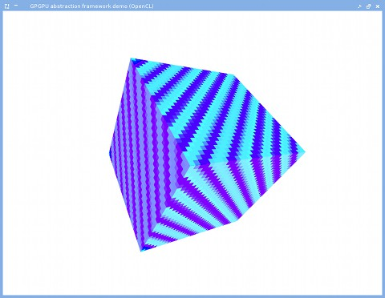

# GPGPU abstraction framework (CUDA/OpenCL + OpenGL)
CUDA与OpenCL的统一框架，并与OpenGL交互。

## Introduction

The differences between CUDA and OpenCL are mostly cosmetic from the
developer\'s point of view. Therefore it is possible to create a
framework which abstracts the differences away, which is the topic of
this entry.

While OpenCL aims to unify GPGPU development, there are still practical
benefits to using CUDA on NVIDIA setups that one simply cannot go
around. Firstly, identical kernels often perform differently on OpenCL
and on CUDA (CUDA usually being the faster). Secondly, CUDA exposes some
features specific to NVIDIA architectures that are not available in
OpenCL. Because of this, when targeting both AMD and NVIDIA platforms, I
usually end up writing both OpenCL and CUDA implementations of my
algorithms.

In order to get rid of this duplicate effort once and for all, I
designed a framework which abstracts the parts that go differently
between CUDA and OpenCL, and wrote an API over it, allowing applications
to define and run GPGPU algorithms in a CUDA/OpenCL agnostic way,
easily.

This framework offers

1.  A pseudolanguage, which is automatically compiled as CUDA or OpenCL
    based on the host application\'s runtime choice

2.  A very easy abstract C++ API to handle initializations, buffers,
    kernels, and textures

3.  OpenGL interoperability

## An example

A demonstration at this point probably clarifies things the most. In the
host application, you can do this:

**#include **\"gpgpu_frame.h\"\
**#include **\"gpgpu_cuda.h\"\
**#include **\"gpgpu_opencl.h\"\
\
gpgpuController \*gpgpuCtrl;\
GLuint texHandle_gl;\
int bufHandle_gpgpu;\
int texHandle_gpgpu;\
int kernelHandle_gpgpu;\
\
\
*/\*  main():  Initializations \*/*\
initGL(\...);\
\
**if** (gpgpuMode == 1)\
    gpgpuCtrl =
(gpgpuController\*) [new]{.underline} cudaController(-1); *// -1 == find
a device capable of OpenGL interop.*\
**else**\
    gpgpuCtrl =
(gpgpuController\*) [new]{.underline} openCLController(-1);\
\
*// We use one texture*\
glGenTextures(1, &texHandle_gl);\
glEnable(GL_TEXTURE_2D);\
glActiveTexture(GL_TEXTURE0);\
glBindTexture(GL_TEXTURE_2D, texHandle_gl);\
glTexImage2D(GL_TEXTURE_2D, 0, GL_RGBA32F, 512, 512, 0, GL_RGBA,
GL_FLOAT, NULL);\
glTexParameteri(GL_TEXTURE_2D, GL_TEXTURE_MIN_FILTER, GL_LINEAR);\
glTexParameteri(GL_TEXTURE_2D, GL_TEXTURE_MAG_FILTER, GL_LINEAR);\
\
*/\**\
*   This is how it goes:  1) The OpenGL texture is shared to GPGPU to be
used by the GPGPU kernel*\
*                         2) The kernel fills in a buffer based on
samples of the texture*\
*                         3) The buffer is written over the texture, and
released back to OpenGL*\
*   (What the kernel actually does is irrelevant, but it essentially
incrementally changes the texture)*\
*\*/*\
*// Allocating the GPGPU resources*\
bufHandle_gpgpu = gpgpuCtrl-\>newBuffer(texSize, NULL); *// If not NULL,
data is read from the pointer*\
texHandle_gpgpu = gpgpuCtrl-\>makeGLTexture(texHandle_gl);\
\
*// Clearing the texture*\
gpgpuCtrl-\>clearBuffer(bufHandle_gpgpu);\
gpgpuCtrl-\>fillTexFromBuffer(texHandle_gpgpu, bufHandle_gpgpu);\
\
*// Kernel sources*\
KernelSrc src;\
src.appendFromFile(\"texfill.gp\");\
src.setKeywords(gpgpuCtrl-\>getKeywords());\
kernelHandle_gpgpu = gpgpuCtrl-\>newKernel(&src);\
\
*// Binding the buffer and the texture to the kernel*\
gpgpuCtrl-\>setBufferParam(kernelHandle_gpgpu, bufHandle_gpgpu);\
gpgpuCtrl-\>setTex(kernelHandle_gpgpu,
texHandle_gpgpu, \"cubetex\"); *// \"Cubetex\" == tex name in kernel
code*\
\
*// Total threads X, block size X; and the same for Y (Y can be omitted
for 1D)*\
gpgpuCtrl-\>setKernelExecConf(kernelHandle_gpgpu, 512, 16, 512, 16);\
gpgpuCtrl-\>preferSM(kernelHandle_gpgpu); *// Prefer as much shared
memory as possible (supported by CUDA)*\
\
*// Writing out the final sources if you want to check them out*\
*// (Will be postfixed by \".cu\" or \".cl\" depending on your
backend)*\
gpgpuCtrl-\>writeKernelSrc(kernelHandle_gpgpu, \"texfillSource\");\
\
*// We can also benchmark the kernel right here and now*\
*// (Prints statistics to stdout)*\
gpgpuCtrl-\>reportTiming(kernelHandle_gpgpu);\
\
\
\
*/\* loop(): The main loop (ran for each frame) \*/*\
*// Executing the kernel*\
gpgpuCtrl-\>executeKernel(kernelHandle_gpgpu);\
\
*// Filling in the texture from the buffer data*\
gpgpuCtrl-\>fillTexFromBuffer(texHandle_gpgpu, bufHandle_gpgpu);\
\
updateGL(); *// OpenGL renders a cube using the texture*

The kernel source file \"texfill.gp\":

#kernelDecl{accumulateTexture}{float4 \*outBuf}# {\
    #sharedMem# int maxValue;\
\
    int myX = #globalThreadX#;\
    int myY = #globalThreadY#;\
\
    **if** (#threadX# == 0 && #threadY# == 0)\
        maxValue = 0;\
    #localSync#;\
\
    float relX = #div{(float)myX}{512.0f}#;\
    float relY = #div{(float)myY}{512.0f}#;\
    float4 sample = #tex2DSample4{cubetex}{relX}{relY}#;\
\
    int pixShuffle = ((myX+myY)%100);\
    float outX = pixShuffle \< 50 ? sample.x : 1.0f-sample.x;\
\
    #atomicMax{&maxValue}{pixShuffle}#;\
    #localSync#;\
\
    #sincos{sample.z\*3.14f +
(float)maxValue\*0.1f}{sample.x}{sample.y}#;\
\
    sample.z += 0.01f;\
\
    outBuf\[myY\*512 + myX\] =
#float4Ctor{outX}{sample.y}{sample.z}{1.0f}#;\
}

The code parser scans for hashes, and replaces content it recognizes by
the equivalent OpenCL/CUDA code.\
The compiled CUDA code looks like this:

**#define LANG_CUDA**\
\
texture\<float4, 2, cudaReadModeElementType\> cubetex;\
\
extern \"C\" \_\_global\_\_ void accumulateTexture(float4 \*outBuf) {\
    \_\_shared\_\_ int maxValue;\
\
    int myX = blockIdx.x\*blockDim.x + threadIdx.x;\
    int myY = blockIdx.y\*blockDim.y + threadIdx.y;\
\
    **if** (threadIdx.x == 0 && threadIdx.y == 0)\
        maxValue = 0;\
    \_\_syncthreads();\
\
    float relX = \_\_fdividef((float)myX, 512.0f);\
    float relY = \_\_fdividef((float)myY, 512.0f);\
    float4 sample = tex2D(cubetex, relX, relY);\
\
    int pixShuffle = ((myX+myY)%100);\
    float outX = pixShuffle \< 50 ? sample.x : 1.0f-sample.x;\
\
    atomicMax(&maxValue, pixShuffle);\
    \_\_syncthreads();\
\
    \_\_sincosf(sample.z\*3.14f + (float)maxValue\*0.1f, &sample.x,
&sample.y);\
\
    sample.z += 0.01f;\
\
    outBuf\[myY\*512 + myX\] = make_float4(outX, sample.y,
sample.z, 1.0f);\
}

And the compiled OpenCL code looks like this:

**#define LANG_OPENCL**\
\
\_\_kernel void accumulateTexture(\_\_global float4 \*outBuf, \_\_read_only image2d_t cubetex, sampler_t TEXSAMPLER_LINEAR)
{\
    \_\_local int maxValue;\
\
    int myX = (int)get_global_id(0);\
    int myY = (int)get_global_id(1);\
\
    **if** ((int)get_local_id(0) == 0 && (int)get_local_id(1) == 0)\
        maxValue = 0;\
    barrier(CLK_LOCAL_MEM_FENCE);\
\
    float relX = native_divide((float)myX, 512.0f);\
    float relY = native_divide((float)myY, 512.0f);\
    float4 sample = read_imagef(cubetex, TEXSAMPLER_LINEAR,
(float2)(relX, relY)**)**;\
\
    int pixShuffle = ((myX+myY)%100);\
    float outX = pixShuffle \< 50 ? sample.x : 1.0f-sample.x;\
\
    atomic_max(&maxValue, pixShuffle);\
    barrier(CLK_LOCAL_MEM_FENCE);\
\
    {\
        const float sinCosAngle = sample.z\*3.14f +
(float)maxValue\*0.1f;\
        sample.x = native_sin(sinCosAngle);\
        sample.y = native_cos(sinCosAngle);\
    }\
\
    sample.z += 0.01f;\
\
    outBuf\[myY\*512 + myX\] = (float4)(outX, sample.y,
sample.z, 1.0f);\
}

Neat, huh? At least I think so.\
Note how little you have to do to get an OpenGL texture in? Doing that
directly with CUDA or OpenCL is involved and error-prone. What\'s worse,
both the API calls and declarations in the kernel code go very
differently between the two. With this framework you only have to (i)
give a name for the OpenGL texture, (ii) bind it with a kernel, and
(iii) in the kernel code sample it by referring to its name.

The full example along with the framework (BSD
license): [[gpgpu_frame-0.3.tar.gz](http://wili.cc/blog/entries/gpgpu-frame/gpgpu_frame-0.3.tar.gz).]{.mark}\
This GPGPU abstraction framework is at a proof-of-concept stage; some
features might be missing. I am implementing stuff as I go, therefore
expect updates (or ask for them).\
{width="3.8207655293088365in"
height="2.9589709098862644in"}

**Notes**

Documentation and feature list: See file \"gpgpu_frame.h\" in the
example. (Also read README and INSTALL)

You can see which anchor keywords are supported from the header above,
and use them in the pseudolanguage code like this:
#keywordName{param1}{param2}..{paramN}#. The parameters cannot contain
\'{\' or \'}\' and keywords cannot be nested.

In case the pseudolanguage does not suffice (e.g. you need to nest
keywords or procedurally generate code), you can inherit the KernelSrc
class and reimplement genSrc() function to generate code (this is what I
usually do) using calls like: append(\"int blockStartX = %s\<\<%d;\\n\",
d_keywords-\>blockX().c_str(), (int)(log2(blockSizeX) + 0.5));

The CUDA backend uses the Driver API and invokes \"nvcc\" and \"ptxas\"
on the fly (see the blog
entry [[cuda-m4]{.underline}](http://wili.cc/blog/cuda-m4.html)).

In case you\'re not interested in OpenGL interoperability, instead of
passing -1 to the gpgpuController constructor, pass 0. If you already
have a context initialized, pass its handle instead.
