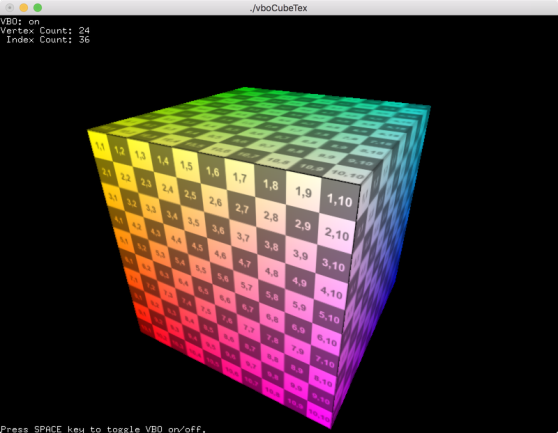
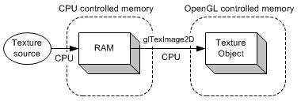
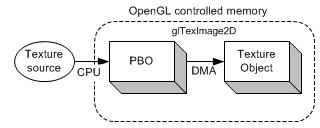

# OpenGL / OpenCL Interoperability : A Case Study Using Autostereograms

How to use OpenCL with OpenGL to implement algorithms on GPU.

-   [**[Download source - 12.9
    MB]{.underline}**](https://www.codeproject.com/KB/openGL/685281/Stereogram_src.zip)

-   [**[Download demo - 87.6
    KB]{.underline}**](https://www.codeproject.com/KB/openGL/685281/Stereogram_demo.zip)

## Introduction

Over the past decade or so, GPUs (Graphics Processing Units) have
evolved from hardware specialized in (and dedicated to) rendering tasks
to programmable high-performance computing devices that open new
possibilities in term of numerical computations.

Numerous algorithms can use the vast processing power of GPUs to execute
tasks faster and/or on larger data sets. Even in the days of the fixed,
non-programmable graphical pipeline, graphics hardware could be used to
speed up algorithms mostly related to image processing. For example,
fixed pipeline functionality could be used to compute image difference,
blur images, blend images and even assist in computing the average value
of an image (or of an array of values).

Subsequently, programmable pipeline stages emerged giving even more
flexibility to programmers. With the new possibilities offered by
programmable stages, a broader class of algorithms could be ported to be
executed on GPUs. A certain amount of ingenuity was often needed to
convert algorithms so that they could be expressed in a suitable form to
be computed by rendering something on the screen, often a screen-aligned
quad.

Nowadays programmable GPUs support an even higher-level programming
paradigm that turns them into GPGPUs (General-Purpose Graphics
Processing Units). This new paradigm allows implementation of algorithms
non-related to rendering by giving access to GPU computing hardware in a
more generic, non-graphics-oriented way.

This article explores the new possibilities offered by GPGPU APIs using
autostereogram generation as a case study where the programmable
rendering pipeline can be extended by interoperating with GPGPU
functionality. The depth buffer of a scene rendered using OpenGL is used
as input for autostereogram generation on GPU using both OpenCL (GPGPU)
kernels and OpenGL GLSL (programmable rendering pipeline) shaders to
compute autostereograms without depth data having to be read back to the
CPU.

## Case Study : Autostereogram Generation

This article provides a brief presentation of autostereogram generation
algorithm foundation and is not meant to review details of
autostereogram generation. Please see references for further
information.

Stereograms regained popularity when autostereograms became more common.
Autostereograms are those single images that can be viewed as 3D scenes
when looked at while not focusing on the image plane, most often behind
the image plane.

{width="3.996628390201225in"
height="2.998720472440945in"}

3D scenes encoded in autostereograms can be difficult to see at first,
but after a while, viewing those \"secret\" scenes hidden in
autostereograms becomes very easy and effortless.  

The algorithm implemented in this article is one of the simplest
autostereogram generation algorithms. It basically repeats a tileable
pattern (which can either be a tileable texture or a randomly generated
texture) by changing the \"repeat length\" according to the z-depth of
the pixel in the input depth map. So basically:

Hide   Copy Code

For each line of the output image:

Copy an entire line of the repeating texture (the tile)

For each pixel of the line in the input depth map:

Copy the color of the pixel located at one-tile-width pixels to left,
minus an offset X

where X is 0 for maximum depth (furthest from eye)

and X is the maximum number of offset pixels (\~30 pixels) for minimum
depth (closest to eye)

Thus, the closer a pixel is supposed to be to the viewer, the shorter
the repeating pattern is going to be. This is the basis of what tricks
the eyes and brain into thinking that the image is three-dimensional.
The output image width will be the sum of the repeating image and the
input depth image widths to make room for the initial unalterned copy of
the repeating image.

Instead of providing a more formal algorithm description, a CPU
implementation that will describe it more precisely will later be
examined while presenting a reference implementation for upcoming result
and performance comparison.

## References

-   Stereogram description
    : [[http://en.wikipedia.org/wiki/Stereogram]{.underline}](http://en.wikipedia.org/wiki/Stereogram)

-   Autostereogram description
    : [[http://en.wikipedia.org/wiki/Autostereogram]{.underline}](http://en.wikipedia.org/wiki/Autostereogram)

-   Autostereogram viewing techniques
    : [[http://www.hidden-3d.com/how_to_view_stereogram.php]{.underline}](http://www.hidden-3d.com/how_to_view_stereogram.php)

-   Non-technical and technical discussion about stereograms
    : [[http://www.techmind.org/stereo/stereo.html]{.underline}](http://www.techmind.org/stereo/stereo.html)

## General implementation overview

The following diagram represents the overall algorithm pipeline.

{width="5.314812992125984in"
height="1.990563210848644in"}

## Render 3D scene

Rendering of the 3D scene is done using OpenGL Core Profile pipeline.
The scene used as an example in this article contains a simple animated
ball that bounces off the walls of an open box. A dynamic scene was
chosen to provide more of a \"real-time\" effect from the different
implementations.

The scene is rendered to textures using a framebuffer object in order to
manipulate resulting data more easily. Using textures as render targets
instead of the main backbuffer has some advantages:

-   Output dimensions (width and height) become easier to control

-   Problems when the rendering window is overlapped with other windows
    can be avoided

-   Texture usage usually fits more naturally in this kind of
    post-processing pipeline

However, it would be possible to use standard backbuffer to render to
and simply read back from this buffer.

Scene rendering generally outputs two buffers: a color buffer and a
depth buffer. The latter is the part that is relevant for stereogram
generation. There is thus no requirement to store colors when rendering
the scene; only depth matters. Therefore, when creating
the framebuffer object to which the scene will be rendered there is no
need to attach a color texture. The following code shows creation of the
framebuffer object with only a depth texture as its target.

Hide   Shrink {width="0.16805555555555557in"
height="0.16805555555555557in"}   Copy Code

*// Allocate a texture to which depth will be rendered.*

*// This texture will be used as an input for our stereogram generation
algorithm.*

glGenTextures( 1 , &mDepthTexture );

glBindTexture( GL_TEXTURE_2D , mDepthTexture );

glTexImage2D(

GL_TEXTURE_2D ,

0 ,

GL_DEPTH_COMPONENT32 ,

kSceneWidth ,

kSceneHeight ,

0 ,

GL_DEPTH_COMPONENT ,

GL_FLOAT ,

0

);

glTexParameteri( GL_TEXTURE_2D , GL_TEXTURE_MAG_FILTER , GL_LINEAR );

glTexParameteri( GL_TEXTURE_2D , GL_TEXTURE_MIN_FILTER , GL_LINEAR );

glTexParameteri( GL_TEXTURE_2D , GL_TEXTURE_WRAP_S , GL_CLAMP_TO_EDGE );

glTexParameteri( GL_TEXTURE_2D , GL_TEXTURE_WRAP_T , GL_CLAMP_TO_EDGE );

glBindTexture( GL_TEXTURE_2D , 0 );

*// Create a framebuffer object to render directly to the depth
texture.*

glGenFramebuffers( 1 , &mDepthFramebufferObject );

*// Attach only the depth texture: we don\'t even bother attaching a
target*

*// for colors, because we don\'t care about it.*

glBindFramebuffer( GL_FRAMEBUFFER , mDepthFramebufferObject );

glFramebufferTexture2D(

GL_FRAMEBUFFER ,

GL_DEPTH_ATTACHMENT ,

GL_TEXTURE_2D ,

mDepthTexture ,

0

);

glBindFramebuffer( GL_FRAMEBUFFER , 0 );

Other initialization tasks are needed to perform scene rendering.
Notably:

-   Create, load and compile rendering shaders

-   Create vertex buffers

In the main rendering loop, the following tasks must be performed:

-   Set the framebuffer object as rendering target

-   Set the shader program as active program

-   Render the scene

In order to keep the article to a reasonable length these tasks will not
be explained here. They are fairly common, straight-forward and not
specific to this algorithm.

The following is a scene rendering generated by this program.

{width="4.380638670166229in"
height="3.2868482064741906in"}

## Horizontal coordinates computation

This is an interesting part of the algorithm as it is the one that will
vary greatly between CPU and GPU implementations.

After this step, repeated tile texture coordinates will have been
computed for each pixel of the final output image. Computing the
vertical texture coordinate is not a major challenge as the tile simply
repeats itself vertically without any variation. Vertical texture
coordinates will not even be computed in this step, they will simply be
trivially determined in the next step. The core of this stereogram
generation algorithm is actually the computation of horizontal texture
coordinates in the repeated tile for every output image pixel.

The result of this step will be a two-dimensional image of the same size
as the final output stereogram where each pixel holds one single
floating point value representing the horizontal texture coordinate.
These floating point values will be constantly increasing from left to
right where the fractional part will represent the actual coordinates
(in a range between 0 and 1) and the integer part will represent the
number of times the pattern has been repeated up to this point. This
representation is used to avoid blending problems when looking up
values. For example, if the algorithm samples between value 0.99 and
0.01, interpolation will yield a sampled value of around 0.5, which is
completely wrong. By using value 0.99 and 1.01 instead, interpolation
will yield a sampled value of around 1.0, which is coherent.

The algorithm pseudo-code listed above can be slightly modified to fit
this intermediate step. After setting the first pixels to an entire line
of repeated tile coordinates (i.e. increasing values between 0 and 1 to
get a whole line of the tile), the lookup step can start by looking up
one-tile-width number of pixels to the left, minus a value depending on
the depth. So, in pseudo-code:

Hide   Copy Code

For each line of the output coordinate image:

Write the coordinates for the first line of the repeating tile

For each pixel of the line in the input depth map:

Sample the coordinate in the currently-written line one-tile-width
pixels to left, minus an offset X

where X is 0 for maximum depth (furthest from eye)

and X is the maximum number of offset pixels (\~30 pixels) for minimum
depth (closest to eye)

Add 1 to this value so that result is constantly increasing

Store computed value in output coordinate image

More clarity with regards to implementation details will come out of the
CPU implementation, as it is still fairly high-level while providing all
working details.

## Render stereogram

This last step takes the coordinate \"image\" and the repeated tile
image as inputs and simply renders the final image by sampling the tile
image at the appropriate place. It gets horizontal texture coordinates
from input coordinate \"image\". It computes vertical texture
coordinates from output pixel coordinates (the tile simply repeats
itself vertically).

This sampling is done on the GPU using custom shaders. A screen-aligned
quad is rendered and the following pixel shader is used to compute the
final color in generated stereogram.

Hide   Copy Code

#version 150

smooth in vec2 vTexCoord;

out vec4 outColor;

// Sampler for the generated offset texture.

uniform sampler2D uOffsetTexture;

// Sampler for the repeating pattern texture.

uniform sampler2D uPatternTexture;

// Scaling factor (i.e. ratio of height of two previous textures).

uniform float uScaleFactor;

void main( )

{

// The horizontal lookup coordinate comes directly from the

// computed offsets stored in the offset texture.

float lOffsetX = texture( uOffsetTexture, vTexCoord ).x;

// The vertical coordinate is computed using a scaling factor

// to map between the coordinates in the input height texture

// (i.e. vTexCoord.y) and where to look up in the repeating pattern.

// The scaling facture is the ratio of the two textures\' height.

float lOffsetY = ( vTexCoord.y \* uScaleFactor );

vec2 lCoords = vec2( lOffsetX , lOffsetY );

outColor = texture( uPatternTexture , lCoords );

};

This concludes the algorithm overview. The next section describes the
CPU implementation of the coordinates generation phase.

## CPU implementation

The CPU implementation of the algorithm just covers generation of
offsets (i.e. texture coordinates) from input depths. It is a simple C++
translation of the pseudo-code given above. It still is composed of
three steps:

1.  First, depths are read back from GPU to CPU

2.  Then, offsets are generated from these depths

3.  Finally, offsets are written back from CPU to GPU

{width="5.554794400699913in"
height="2.0804429133858267in"}

### Step 1 : Reading input depths from GPU to CPU {#step-1-reading-input-depths-from-gpu-to-cpu .标题3}

After rendering the scene, depths are stored in a texture that lives on
GPU. To access those depths for CPU implementation, depths must be
fetched from GPU and stored in memory accessible from the CPU.
A std::vector of floats is used to store those depths on the CPU side,
as shown in the following code.

Hide   Copy Code

*// Read the depths data from the GPU.*

glBindTexture( GL_TEXTURE_2D , mDepthTexture );

glGetTexImage(

GL_TEXTURE_2D ,

0 ,

GL_DEPTH_COMPONENT ,

GL_FLOAT ,

mInputDepths.data()

);

glBindTexture( GL_TEXTURE_2D , 0 );

Depths will then be stored in the vector of floating point values.

### Step 2 : Processing {#step-2-processing .标题3}

Generating offsets is simply applying the algorithm described above in
pseudo-code and storing the result in a regular memory array. The
following code shows this translation reading
from mInputDepths to mOutputOffsets.

Hide   Shrink {width="0.16805555555555557in"
height="0.16805555555555557in"}   Copy Code

const int lPatternWidth = pPatternRenderer.GetPatternWidth();

const int lStereogramWidth = kSceneWidth + lPatternWidth;

for ( int j = 0; j \< kSceneHeight; ++j )

{

*// First initialize the first band of lookups without depths offsets.*

for ( int i = 0, lCountI = lPatternWidth; i \< lCountI; ++i )

{

float& lOutput = mOutputOffsets\[ j \* lStereogramWidth + i \];

lOutput = i / static_cast\< float \>( lPatternWidth );

}

*// Then compute offsets.*

for ( int i = lPatternWidth; i \< lStereogramWidth; ++i )

{

float& lOutput = mOutputOffsets\[ j \* lStereogramWidth + i \];

*// Get the depth value associated with this pixel.*

const int lInputI = i - lPatternWidth;

const float lDepthValue = mInputDepths\[ j \* kSceneWidth + lInputI \];

*// Get where to look up for the offset value.*

const float lLookUpPos = static_cast\< float \>( lInputI ) + kMaxOffset
\* ( 1 - lDepthValue );

*// Lerp between pixel values.*

const int lPos1 = static_cast\< int \>( lLookUpPos );

const int lPos2 = lPos1 + 1;

const float lFrac = lLookUpPos - lPos1;

const float lValue1 = mOutputOffsets\[ j \* lStereogramWidth + lPos1 \];

const float lValue2 = mOutputOffsets\[ j \* lStereogramWidth + lPos2 \];

*// We add 1.0 to the lerp-ed so that offset values are always
increasing*

*// in a given row (to make sure interpolation between any offset value*

*// still makes sense).*

const float lValue = 1.0f + ( lValue1 + lFrac \* ( lValue2 - lValue1 )
);

lOutput = lValue;

}

}

### Step 3 : Writing output offsets from CPU to GPU {#step-3-writing-output-offsets-from-cpu-to-gpu .标题3}

After generating the offsets, they must be sent back to GPU for final
stereogram rendering. This operation is basically Step 1 in reverse and
is shown in the following code.

Hide   Copy Code

glBindTexture( GL_TEXTURE_2D , mOffsetTexture );

glTexSubImage2D(

GL_TEXTURE_2D ,

0 ,

0 ,

0 ,

lStereogramWidth ,

kSceneHeight ,

GL_RED ,

GL_FLOAT ,

mOutputOffsets.data()

);

glBindTexture( GL_TEXTURE_2D , mOffsetTexture );

Offsets will then have been written to GPU memory.

This concludes the algorithm CPU implementation. The biggest drawback
from this approach is the need to exchange relatively large amount of
data between CPU and GPU for every frame. Reading back image data from
GPU for processing and then writing it back to GPU can be a considerable
performance killer in real-time applications.

In order to prevent this issue, processing will be performed directly on
GPU memory, avoiding the round-trip read-write between CPU and GPU. This
approach is described in the following section.

## GPU implementation

To avoid unwanted round-trips between CPU and GPU, depth data has to be
processed directly on the GPU. However, the stereogram generation
algorithm requires looking up values previously set within the same line
of the output image. Reading from and writing to the same texture/image
buffer is extremely unfriendly to conventional GPU processing approaches
such as using fragment shaders.

It would be possible to use a \"band\" based approach where vertical
bands would be rendered, from left to right, with each band no larger
than the minimal look-up distance to the left. In the example provided
in the source code, the repeating pattern width is 85 pixels, and the
largest offset to that full look-up is 30 pixels (value of kMaxOffset),
for a resulting maximum band width of 55 pixels. Because of the
impossibility of reading at random locations from the texture being
rendered to, two copies of the texture being rendered to would need to
be kept: one to read from, and one to write to. Then what was just
written would have to be copied to the other texture.

This approach requires two copies of the texture which is not optimal.
Also, band width has a direct impact on the number of rendering passes
which has a direct impact on performance. However, this width is
dependent on the width of the repeating pattern, which can vary from one
generation to the other, and on the maximum offset, which is a parameter
that might benefit being able to be tuned in real-time. Having
performance depending on varying parameters is far from ideal.

A more flexible approach than is possible using conventional
programmable rendering pipelines is required. Enters OpenCL. The
\"General Purpose\" part of this GPGPU API is especially important for
this type of application. It will enable the use of GPU for more
generic, less rendering-oriented algorithms and this flexibility will
allow efficient use of GPU for stereogram generation.

First, a few modifications that need to be done to the rendering part of
the CPU implementation will be shown. Then, creation of an OpenCL
context able to share resources with an OpenGL context will be
described. Finally, the OpenCL kernel used to generate stereograms will
be presented along with elements needed to run it.

### Modifications to rendering of the scene {#modifications-to-rendering-of-the-scene .标题3}

The depth texture used by the CPU version of the algorithm cannot be
used with the GPU implementation that was just presented. This texture
has to be shared with the OpenCL context and OpenCL has limitations on
formats of OpenGL textures it can access directly. According to the
documentation
for [[clCreateFromGLTexture2D]{.underline}](http://www.khronos.org/registry/cl/sdk/1.1/docs/man/xhtml/clCreateFromGLTexture2D.html)which
refers to a [[table of supported Image Channel Order
Values]{.underline}](http://www.khronos.org/registry/cl/sdk/1.1/docs/man/xhtml/cl_image_format.html), GL_DEPTH_COMPONENT32 is
not a supported value for internal format of OpenGL textures that are to
be shared with OpenCL. This is unfortunate because the internal
representation of this format is very likely to be the same as the one
to be used, but this lack of support problem can be circumvented.

In order to get a depth texture from the scene rendering step, a second
texture will be attached to the frame buffer object. Remember that only
one single depth texture was attached in the CPU version. This depth
texture still needs to be attached so that it may serve as a depth
buffer for depth test to work properly. However, another texture will be
attached as a \"color attachment\" except that instead of receiving the
color, it will receive the depth value. The following code shows how to
create this texture and how to attach it to the frame buffer object.

Hide   Shrink {width="0.16805555555555557in"
height="0.16805555555555557in"}   Copy Code

*// Skipped code to allocate depth texture\...*

*// \*\*\* DIFFERENCE FROM CPU IMPLEMENTATION \*\*\**

*// However, because OpenCL can\'t bind itself to depth textures, we
also create*

*// a \"normal\" floating point texture that will also hold depths.*

*// This texture will be the input for our stereogram generation
algorithm.*

glGenTextures( 1 , &mColorTexture );

glBindTexture( GL_TEXTURE_2D , mColorTexture );

glTexImage2D(

GL_TEXTURE_2D ,

0 ,

GL_R32F ,

kSceneWidth ,

kSceneHeight ,

0 ,

GL_RED ,

GL_FLOAT ,

0

);

glTexParameteri( GL_TEXTURE_2D , GL_TEXTURE_MAG_FILTER , GL_LINEAR );

glTexParameteri( GL_TEXTURE_2D , GL_TEXTURE_MIN_FILTER , GL_LINEAR );

glTexParameteri( GL_TEXTURE_2D , GL_TEXTURE_WRAP_S , GL_CLAMP_TO_EDGE );

glTexParameteri( GL_TEXTURE_2D , GL_TEXTURE_WRAP_T , GL_CLAMP_TO_EDGE );

glBindTexture( GL_TEXTURE_2D , 0 );

*// Create a framebuffer object to render directly to the depth
texture.*

glGenFramebuffers( 1 , &mDepthFramebufferObject );

*// Attach the depth texture and the color texture (to which depths will
be output)*

glBindFramebuffer( GL_FRAMEBUFFER , mDepthFramebufferObject );

glFramebufferTexture2D(

GL_FRAMEBUFFER ,

GL_DEPTH_ATTACHMENT ,

GL_TEXTURE_2D ,

mDepthTexture ,

0

);

glFramebufferTexture2D(

GL_FRAMEBUFFER ,

GL_COLOR_ATTACHMENT0 ,

GL_TEXTURE_2D ,

mColorTexture ,

0

);

glBindFramebuffer( GL_FRAMEBUFFER , 0 );

A fragment shader is then needed to render depth to this \"color
attachment\". It is fairly simple as shown in the following code:

Hide   Copy Code

#version 150

out vec4 outColor;

void main( )

{

float lValue = gl_FragCoord.z;

outColor = vec4( lValue , lValue , lValue , 1.0 );

}

These modifications will give a texture that is usable
with clCreateFromGLTexture2D() for sharing with the OpenCL context, as
will be shown in the following section.

### OpenCL context creation {#opencl-context-creation .标题3}

The following steps are usually performed in order to create an OpenCL
context:

Hide   Copy Code

List OpenCL platforms and choose one (usually the first one).

List OpenCL devices on this platform and choose one (usually the first
one).

Create an OpenCL context on this device.

However, for the stereogram generation algorithm implementation, care
must be taken to allocate an OpenCL context that will be able to access
OpenGL resources from existing context. Extra parameters will be given
to OpenCL context creation routines to request a compatible context.
This means that context creation can fail if, for example, OpenGL
context was created on a different device than the one for which we are
trying to allocate an OpenCL context. Therefore, creation steps need to
be modified to enforce this compatibility requirement:

Hide   Copy Code

List OpenCL platforms.

For each platform:

List OpenCL devices on this platform

For each device:

Try to allocate a context

on this device

compatible with current OpenGL context

if context successfully created:

stop

Note that all platforms and devices must be looped over to ensure that
the right context is found. The following shows the code performing this
OpenCL context creation.

Hide   Shrink {width="0.16805555555555557in"
height="0.16805555555555557in"}   Copy Code

cl_int lError = CL_SUCCESS;

std::string lBuffer;

*//*

*// Generic OpenCL creation.*

*//*

*// Get platforms.*

cl_uint lNbPlatformId = 0;

clGetPlatformIDs( 0 , 0 , &lNbPlatformId );

if ( lNbPlatformId == 0 )

{

std::cerr \<\< \"Unable to find an OpenCL platform.\" \<\< std::endl;

return false;

}

*// Loop on all platforms.*

std::vector\< cl_platform_id \> lPlatformIds( lNbPlatformId );

clGetPlatformIDs( lNbPlatformId , lPlatformIds.data() , 0 );

*// Try to find the device with the compatible context.*

cl_platform_id lPlatformId = 0;

cl_device_id lDeviceId = 0;

cl_context lContext = 0;

for ( size_t i = 0; i \< lPlatformIds.size() && lContext == 0; ++i )

{

const cl_platform_id lPlatformIdToTry = lPlatformIds\[ i \];

*// Get devices.*

cl_uint lNbDeviceId = 0;

clGetDeviceIDs( lPlatformIdToTry , CL_DEVICE_TYPE_GPU , 0 , 0 ,
&lNbDeviceId );

if ( lNbDeviceId == 0 )

{

continue;

}

std::vector\< cl_device_id \> lDeviceIds( lNbDeviceId );

clGetDeviceIDs( lPlatformIdToTry , CL_DEVICE_TYPE_GPU , lNbDeviceId ,
lDeviceIds.data() , 0 );

*// Create the properties for this context.*

cl_context_properties lContextProperties\[\] = {

*// We need to add information about the OpenGL context with*

*// which we want to exchange information with the OpenCL context.*

#if defined (WIN32)

*// We should first check for cl_khr_gl_sharing extension.*

CL_GL_CONTEXT_KHR , (cl_context_properties) wglGetCurrentContext() ,

CL_WGL_HDC_KHR , (cl_context_properties) wglGetCurrentDC() ,

#elif defined (\_\_linux\_\_)

*// We should first check for cl_khr_gl_sharing extension.*

CL_GL_CONTEXT_KHR , (cl_context_properties) glXGetCurrentContext() ,

CL_GLX_DISPLAY_KHR , (cl_context_properties) glXGetCurrentDisplay() ,

#elif defined (\_\_APPLE\_\_)

*// We should first check for cl_APPLE_gl_sharing extension.*

#if 0

*// This doesn\'t work.*

CL_GL_CONTEXT_KHR , (cl_context_properties) CGLGetCurrentContext() ,

CL_CGL_SHAREGROUP_KHR , (cl_context_properties) CGLGetShareGroup(
CGLGetCurrentContext() ) ,

#else

CL_CONTEXT_PROPERTY_USE_CGL_SHAREGROUP_APPLE , (cl_context_properties)
CGLGetShareGroup( CGLGetCurrentContext() ) ,

#endif

#endif

CL_CONTEXT_PLATFORM , (cl_context_properties) lPlatformIdToTry ,

0 , 0 ,

};

*// Look for the compatible context.*

for ( size_t j = 0; j \< lDeviceIds.size(); ++j )

{

cl_device_id lDeviceIdToTry = lDeviceIds\[ j \];

cl_context lContextToTry = 0;

lContextToTry = clCreateContext(

lContextProperties ,

1 , &lDeviceIdToTry ,

0 , 0 ,

&lError

);

if ( lError == CL_SUCCESS )

{

*// We found the context.*

lPlatformId = lPlatformIdToTry;

lDeviceId = lDeviceIdToTry;

lContext = lContextToTry;

break;

}

}

}

if ( lDeviceId == 0 )

{

std::cerr \<\< \"Unable to find a compatible OpenCL device.\" \<\<
std::endl;

return false;

}

*// Create a command queue.*

cl_command_queue lCommandQueue = clCreateCommandQueue( lContext ,
lDeviceId , 0 , &lError );

if ( !CheckForError( lError ) )

{

std::cerr \<\< \"Unable to create an OpenCL command queue.\" \<\<
std::endl;

return false;

}

After the OpenCL context is created, OpenCL buffer objects (of
type cl_mem) can now be created to represent OpenGL textures to be
shared. Memory will not be allocated for those buffers, they will simply
be aliases of the same underlying buffers as the OpenGL textures,
allowing OpenCL to read from and write to those buffers.

In order to create those references to OpenGL textures,
the [[clCreateFromGLTexture2D]{.underline}](http://www.khronos.org/registry/cl/sdk/1.1/docs/man/xhtml/clCreateFromGLTexture2D.html) function
is used, as shown here:

Hide   Copy Code

*// OpenCL 1.2 deprecates clCreateFromGLTexture2D to use*

*// clCreateFromGLTexture, but we keep it to work with OpenCL 1.1.*

mDepthImage = clCreateFromGLTexture2D(

mContext ,

CL_MEM_READ_ONLY ,

GL_TEXTURE_2D ,

0 ,

pInputDepthTexture ,

&lError

);

if ( !CheckForError( lError ) )

return false;

mOffsetImage = clCreateFromGLTexture2D(

mContext ,

CL_MEM_WRITE_ONLY ,

GL_TEXTURE_2D ,

0 ,

pOutputOffsetTexture ,

&lError

);

if ( !CheckForError( lError ) )

return false;

Note that this function is deprecated
by [[clCreateFromGLTexture]{.underline}](http://www.khronos.org/registry/cl/sdk/1.2/docs/man/xhtml/clCreateFromGLTexture.html) in
OpenCL 1.2,
but [[clCreateFromGLTexture2D]{.underline}](http://www.khronos.org/registry/cl/sdk/1.1/docs/man/xhtml/clCreateFromGLTexture2D.html)will
still be used so that this application can run on OpenCL-1.1-only
systems.

The buffers can now be used as regular OpenCL buffers that will be
processed by an OpenCL kernel which will be described in the following
section.

Kernel design, implementation and execution

The purpose of this section is not to go into OpenCL concepts and syntax
details, but to present elements specific to this problem. In the
context of this stereogram generation algorithm, two factors have a
major impact on kernel design: first, there is a data dependency for
pixels on the same line and second, it is not possible for a kernel to
read from and write to the same image buffer within the same kernel
execution.

**How much data should the kernel process?**

Kernels are designed to run on a subset of the data to be processed in
order for them to be run in parallel by the multiple computing units
available in OpenCL-capable devices. A very popular design choice for
image processing algorithms implemented in OpenCL is to have one kernel
instance run on each pixel of the image, which allows a great deal of
parallelism. However, the stereogram generation algorithm shows a
problematic data dependency on pixels on the same line to the left of
any pixel to be processed. Therefore, designing the kernel to be run
once **per line** instead of per pixel is better suited for the problem
at hand so that the proposed kernel will handle an entire line at a
time.

**How can reading from and writing to the same buffer be avoided?**

Another problem somewhat related to this data dependency issue is the
impossibility to read from and write to the same image buffer within an
OpenCL kernel, just like OpenGL textures cannot be sampled from and
written to within the same render pass. However, results from already
processed pixels are required to compute upcoming pixels. The algorithm
will need to be adapted.

A simple observation can help: a value never needs to be looked up
further than the width of the repeating image. Therefore, a local buffer
of the same width can be used to hold the last computed offsets. By
using this local buffer to write to and to read from at will as a
circular buffer, that read/write problem can be avoided. When an offset
is computed, the kernel always reads from the local buffer and writes
the result back to both the local buffer and the output image. Thus
there is never a need to read from the output image, which solves the
problem.

Those types of adaptations are common when implementing algorithms using
GPGPU APIs. These APIs usually offer different capabilities and present
different restrictions in comparison to CPU implementations, notably
with regards to synchronization primitives. Modifications such as this
one can be necessary to port the algorithm as in this case. However,
they can also be optimizations that allow the kernel to run faster, for
example by having more efficient memory access patterns. This must be
kept in mind when porting algorithm from CPU to GPGPU: the translation
is not always direct even for simple problems like this one.

Having dealt with those design issues, it is now possible to come up
with an implementation for this kernel. The following code illustrates
the concerns discussed above.

Hide   Shrink {width="0.16805555555555557in"
height="0.16805555555555557in"}   Copy Code

// We will sample using normalized coordinates.

// Because we will sample exact values, we can choose nearest filtering.

const sampler_t kSampler =

CLK_NORMALIZED_COORDS_FALSE

\| CLK_ADDRESS_CLAMP_TO_EDGE

\| CLK_FILTER_NEAREST;

// Stereogram-generating kernel.

\_\_kernel void Stereogram(

\_\_write_only image2d_t pOffsetImage ,

\_\_read_only image2d_t pDepthImage

)

{

// Private buffer to hold last image offset.

float lBuffer\[ kPatternWidth \];

const int2 lOutputDim = get_image_dim( pOffsetImage );

const int lRowPos = get_global_id( 0 );

if ( lRowPos \>= lOutputDim.y )

return;

// First copy direct values.

for ( int i = 0 ; i \< kPatternWidth; ++i )

{

const float lValue = ( i / (float) kPatternWidth );

// We copy them in the temporary buffer from which we will fetch
upcoming offsets.

lBuffer\[ i \] = lValue;

// \... and we also output it in the first band of the image.

const int2 lOutputPos = { i , lRowPos };

write_imagef( pOffsetImage , lOutputPos , (float4) lValue );

}

// Then actually generate offsets based on depth.

for ( int i = kPatternWidth ; i \< lOutputDim.x; ++i )

{

const int2 lLookupPos = { i - kPatternWidth , lRowPos };

const float4 lDepth = read_imagef( pDepthImage , kSampler , lLookupPos
);

const float lOffset = kMaxOffset \* ( 1 - lDepth.x );

const float lPos = i + lOffset;

const int lPos1 = ( (int) ( lPos ) );

const int lPos2 = ( lPos1 + 1 );

const float lFrac = lPos - lPos1;

const float lValue1 = lBuffer\[ lPos1 % kPatternWidth \];

const float lValue2 = lBuffer\[ lPos2 % kPatternWidth \];

const float lValue = 1 + lValue1 + lFrac \* ( lValue2 - lValue1 );

// Update private buffer.

lBuffer\[ i % kPatternWidth \] = lValue;

// Update output image.

const int2 lOutputPos = { i , lRowPos };

write_imagef( pOffsetImage , lOutputPos , (float4) lValue );

}

};

This kernel code must now be compiled by the OpenCL drivers before it
can be run. Doing so is like compiling any OpenCL kernel:

Hide   Shrink {width="0.16805555555555557in"
height="0.16805555555555557in"}   Copy Code

*// Create program.*

const char\* lCode = kKernelCode;

*// We pass compilation parameters to define values that will be
constant for*

*// all execution of the kernel.*

std::ostringstream lParam;

lParam \<\< \"-D kPatternWidth=\" \<\< pPatternWidth \<\< \" -D
kMaxOffset=\" \<\< kMaxOffset;

cl_program lProgram = clCreateProgramWithSource( mContext , 1 , &lCode ,
0 , &lError );

if ( !CheckForError( lError ) )

return false;

lError = clBuildProgram( lProgram , 1 , &mDeviceId ,
lParam.str().c_str() , 0 , 0 );

if ( lError == CL_BUILD_PROGRAM_FAILURE )

{

*// Determine the size of the log*

size_t lLogSize;

clGetProgramBuildInfo(

lProgram , mDeviceId , CL_PROGRAM_BUILD_LOG , 0 , 0 , &lLogSize

);

*// Get the log*

std::string lLog;

lLog.resize( lLogSize );

clGetProgramBuildInfo(

lProgram ,

mDeviceId ,

CL_PROGRAM_BUILD_LOG ,

lLogSize ,

const_cast\< char\* \>( lLog.data() ) ,

0

);

*// Print the log*

std::cerr \<\< \"Kernel failed to compile.\\n\"

\<\< lLog.c_str() \<\< \".\" \<\< std::endl;

}

if ( !CheckForError( lError ) )

return false;

cl_kernel lKernel = clCreateKernel( lProgram , \"Stereogram\" , &lError
);

if ( !CheckForError( lError ) )

return false;

A few parameters are defined as constants that will be used by all
executions of this kernel. It would have been possible to use a
different strategy to allow runtime tweaking of the kMaxOffset parameter
for example. The value of this variable could have been passed as a
parameter to the kernel function, but in this application it is kept
constant so it was defined as a kernel-compile-time constant.

The only thing left for the kernel to be ready to run is to bind the
kernel function parameters, i.e. the input and output image buffers:

Hide   Copy Code

*// Now that we initialized the OpenCL texture buffer, we can set*

*// them as kernel parameters, they won\'t change, the kernel will*

*// always be executed on those buffers.*

lError = clSetKernelArg( mKernel , 0 , sizeof( mOffsetImage ) ,
&mOffsetImage );

if ( !CheckForError( lError ) )

return false;

lError = clSetKernelArg( mKernel , 1 , sizeof( mDepthImage ) ,
&mDepthImage );

if ( !CheckForError( lError ) )

return false;

These parameters can be set once for all kernel executions because they
do not change. The kernel is always run on those buffers so those
parameters can be set at initialization instead of in the main loop.

Running of the kernel inside the main loop requires three simple steps:

1.  Synchronize OpenGL textures to make sure OpenGL has finished writing
    to them before using them with OpenCL

2.  Run the OpenCL kernel

3.  Synchronize OpenGL textures to make sure OpenCL has finished writing
    to them before returning them to OpenGL

{width="6.663888888888889in"
height="2.495833333333333in"}

The following code shows how to perform these tasks:

Hide   Shrink {width="0.16805555555555557in"
height="0.16805555555555557in"}   Copy Code

cl_mem lObjects\[\] = { mDepthImage , mOffsetImage };

cl_int lError = 0;

*// We must make sure that OpenGL is done with the textures, so*

*// we ask to sync.*

glFinish();

const int lNbObjects = sizeof( lObjects ) / sizeof( lObjects\[0\] );

lError = clEnqueueAcquireGLObjects(

mCommandQueue , lNbObjects , lObjects , 0 , NULL , NULL

);

CheckForError( lError );

*// Perform computations.*

lError = clEnqueueNDRangeKernel(

mCommandQueue ,

mKernel ,

1 ,

NULL ,

&mSize ,

&mWorkgroupSize ,

0 ,

NULL ,

NULL

);

CheckForError( lError );

*// Before returning the objects to OpenGL, we sync to make sure OpenCL
is done.*

lError = clEnqueueReleaseGLObjects(

mCommandQueue , lNbObjects , lObjects , 0 , NULL , NULL

);

CheckForError( lError );

lError = clFinish( mCommandQueue );

CheckForError( lError );

Offsets will thus have been computed on the GPU without needing to
transfer data back from the GPU to the CPU and then again from CPU to
GPU.

This concludes the GPU implementation of the algorithm. It showed that
by combining OpenGL and OpenCL, expensive round-trips between CPU memory
and GPU memory can be avoided while still maintaining enough flexibility
to implement non-trivial algorithms.

The Code

The code provided in this article shows the implementation of the
concepts presented herein. It is not designed to be particularly
reusable. It is meant to be as simple as possible, as close as possible
to OpenGL and OpenCL API calls and with the least amount of dependencies
possible in order to clearly illustrate the object of the article. In
fact, this demo application was initially developed in a personal
framework that was then stripped in order to arrive at the current
minimal application.

This demo was run successfully on Intel and NVidia hardware. It was not
tested on AMD hardware but it should run as is or worst-case scenario
with only minor modifications. It was run on Windows Vista and 7
(compiled with Microsoft Visual Studio), Ubuntu Linux (compiled with
GCC) and OS X Mountain Lion (compiled with GCC).

The application supports three modes that can be switched alternately by
using the space bar. The first one is the regular rendering of the scene
using very basic lighting shading. The second one is the stereogram
generation CPU implementation. The third one is the stereogram
generation GPU implementation.

On Intel HD Graphics 4000 hardware, the first mode (regular rendering)
runs at around 1180 frames per second. The second mode (CPU
implementation) runs at around 11 frames per second. The third mode (GPU
implementation) runs at around 260 frames per second. Even though frames
per second are not necessarily the most precise performance metrics,
they still give an appreciation of results. It is clear that by avoiding
the round-trip from GPU to CPU and by using the parallel computation
power of the GPU, significant performance improvements can be achieved.

Conclusion 

The stereogram generation algorithm presented in this article is a great
opportunity to demonstrate the power of using GPGPU to interact with the
rendering pipeline. It was shown that a part of the algorithm that would
be either impossible to implement using only the programmable rendering
pipeline (GLSL shaders) or would result in a very inefficient
implementation can be implemented quite easily using OpenCL to access
OpenGL textures and process them in ways that would not really be
GLSL-friendly.

By providing flexible means to implement more complex algorithms
directly on GPU, interaction between rendering pipeline (OpenGL) and
GPGPU APIs (OpenCL) presents an elegant and efficient solution to GPU
data processing for interesting (i.e. difficult) problems. It gives
developers tools to address such problems with less programming
gymnastics that is often required to implement algorithms on the GPU and
even opens the door to more possibilities than the ones offered by the
regular programmable rendering pipeline.

That being said, this implementation could probably still be much
improved. OpenCL is not a magic wand that \"automagically\" achieves
portable performance. Optimizing OpenCL implementation can be a beast of
its own\... So it would be interesting to take this demo application
further in order to see how its simple implementation could be improved
to achieve even greater performance. Furthermore, OpenGL Compute Shader
would also be an interesting path to explore to solve similar problems.

## References

[[http://sa09.idav.ucdavis.edu/docs/SA09_GL_interop.pdf]{.underline}](http://sa09.idav.ucdavis.edu/docs/SA09_GL_interop.pdf) :
An interesting presentation on OpenGL / OpenCL interoperability.
