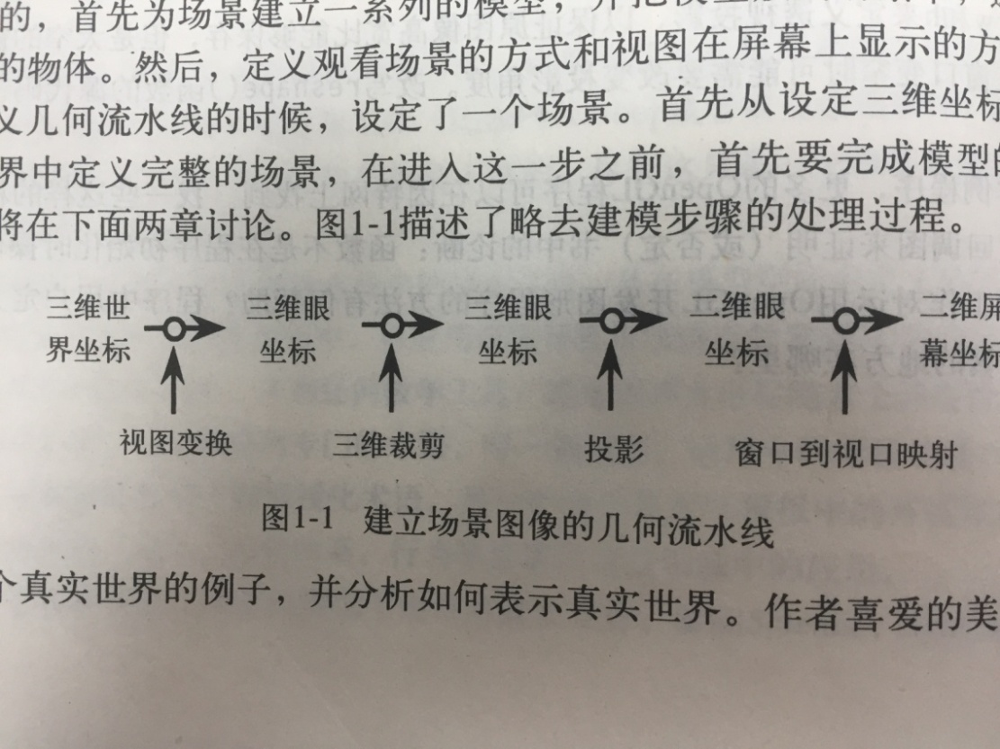
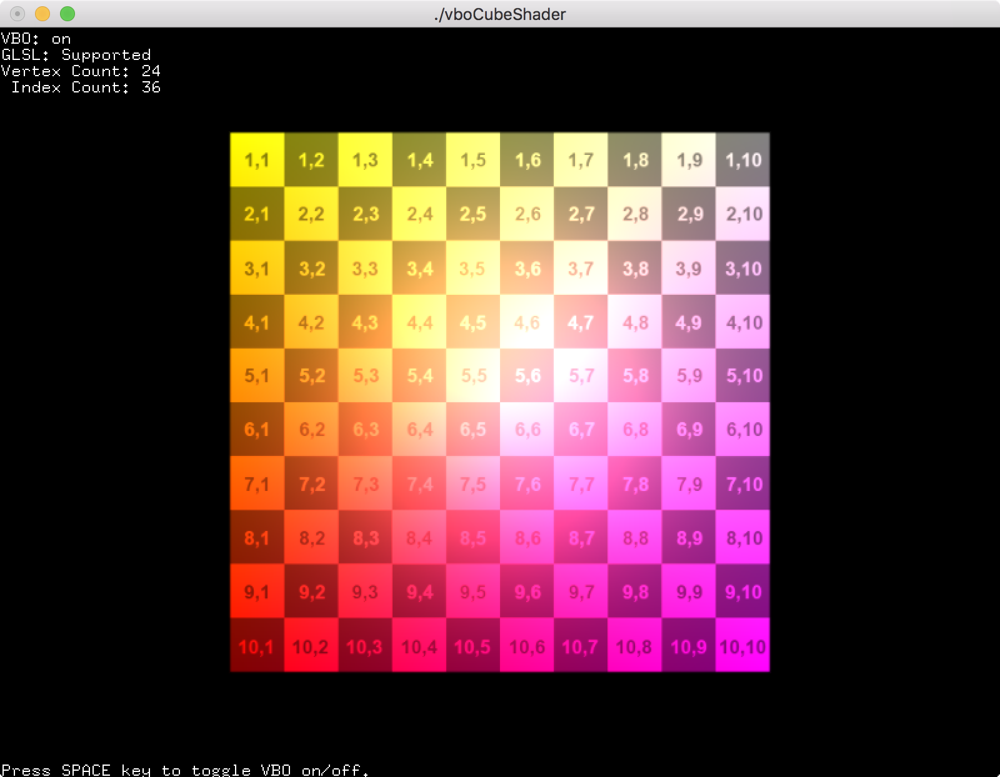
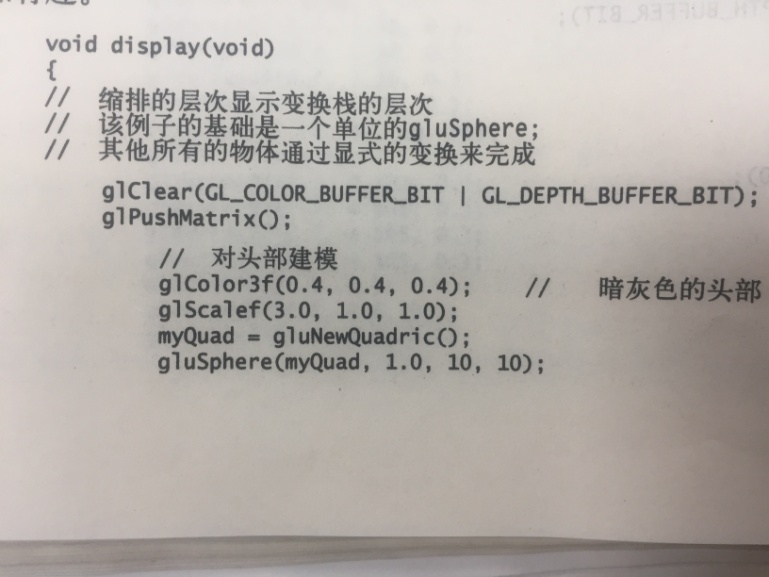
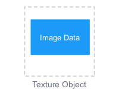
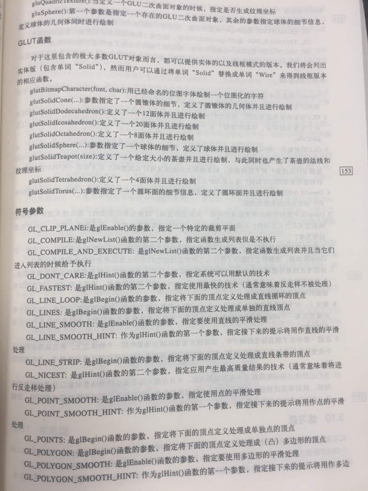
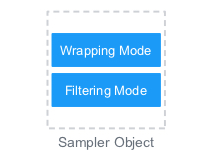
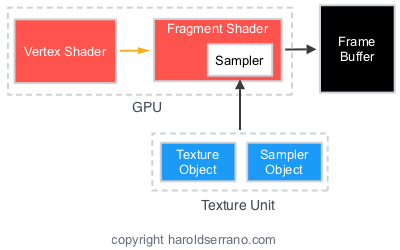

# OpenGL渲染的11步

OpenGL
API十分庞大，要记住这么多的函数是很困难的。OpenGL也是一种状态机器，要记住执行很多步骤！在OpenGL中执行渲染是很容易的，但很容易忘记这些步骤。下面请记住执行基本的OpenGL渲染的11个步骤

开始：假设characterData包含渲染物体的数据：

//Vertex data of character

float characterData\[36\]={1.0,0.4,0.9,1.0,\....};

**Step 1**. Generate a Vertex Array Object:

//1. Generate a Vertex Array Object. Assume you have a global GLuint
myVertexArrayObject declared.

glGenVertexArrays (1,&myVertexArrayObject);

**Step 2**. Bind the Vertex Array Object:

//2. Bind the Vertex Array Object

glBindVertexArray (myVertexArrayObject);

**Step 3**. Generate a Vertex Buffer Object:

//3. Create a vertex buffer object

GLuint myBuffer;

glGenBuffers(1,&myBuffer);

**Step 4**. Bind the Vertex Buffer Object:

//4. Bind the vertex buffer

glBindBuffer(GL_ARRAY_BUFFER,myBuffer);

**Step 5**. Load Data into the buffer:

//5. Load data in the buffer

glBufferData(GL_ARRAY_BUFFER,sizeof(characterData),characterData,GL_STATIC_DRAW);

**Step 6**. Get Location of Attributes in current active shader:

//6. Get the location of the shader attribute called \"position\".
Assume positionLocation is a global GLuint variable

positionLocation=glGetAttribLocation(programObject, \"position\");

**Step 7**. Get Location of Uniform in current active shader:

//7. Get Location of uniform called \"modelViewProjectionMatrix\".
Assume modelViewProjectionUniformLocation is a global GLuint variable.

modelViewProjectionUniformLocation =
glGetUniformLocation(programObject,\"modelViewProjectionMatrix\");

**Step 8**. Enable the attribute location found in the shader:

//8. Enable the attribute location

glEnableVertexAttribArray(positionLocation);

**Step 9**. Link buffer data to shader attributes:

//9. Link the buffer data to the shader attribute locations and inform
OpenGL about the types of data in bound buffers and any memory offsets
needed to access the data

glVertexAttribPointer(positionLocation,3, GL_FLOAT, GL_FALSE, 0, (const
GLvoid \*)0);

**Step 10**. Draw using data in currently bound and enabled buffers:

//1. Bind the VAO

glBindVertexArray (myVertexArrayObject);

//2. Start the rendering process

glDrawArrays(GL_TRIANGLES, 0, 36);

//3. Unbind the VAO

glBindVertexArray (0);

**Step 11**. Delete previously generated buffer:

glDeleteBuffers(1, &myBuffer);

# 节点属性的目的是什么？

一个GPU由以下4个着色器组成：

{width="5.227176290463692in"
height="2.182202537182852in"}

-   Vertex Shader

-   Fragment Shader

-   Tessellation Shader

-   Geometry Shader

以上4种着色器中，OpenGL仅需要节点着色器。但只有使用了片段着色器后，节点着色才有用。节点着色器在屏幕上设置物体的[正确的坐标空间]{.mark}，而片段着色器为你的物体[增加颜色]{.mark}。

物体数据通过OpenGL缓冲发送到GPU。加载这些缓冲，缓冲包含代表物体属性的数据。这些属性可以是节点位置、法向向量或纹理坐标。纹理坐标也称为UV坐标。

一个节点着色器(Vertex Shader)通过称为节点属性(vertex
attribute)接收该信息。节点着色器仅接收节点属性数据。细分(tessellation)、几何和片段着色器不能接收节点属性。如果这些着色器需要该数据，必须从节点着色器传递给它。

{width="4.870277777777778in"
height="2.4079997812773404in"}

[节点属性是CPU与GPU之间的主要联系，它是连接两个世界的变量]{.mark}，没有节点属性，物体就不能出现在屏幕上。没有节点属性，节点着色器就不能接收数据。以此类推，其他着色器也接收不到任何数据。

这就是节点属性的目的。节点属性接收来自CPU的数据，提供给节点着色器，并与其他着色器共享数据。

# 节点着色器如何接收数据？

节点着色器是图形管线的第1个阶段，它计算和向前传递模型的坐标到不同的着色器。但节点着色器是如何接收数据的呢？

首先注意到：

（1）节点着色器是图形管线的唯一一个强制阶段；

（2）在运行节点着色器之前，执行一个称为节点拾取(Vertex
Fetch)的固定函数节点。该节点从应用程序中拾取数据。

在GLSL中，着色器获取数据的in和out声明机制，表明它们是in或out存储修饰语。当声明一个变量为in，表明它是输入到节点着色器。这样设置了图形管线的输入变量。

在OpenGL中，in变量称为节点属性(vertex
attribute)。通过节点属性，节点数据引入图形管线中。

通过使用glVertexAttrib()函数告诉节点拾取阶段用什么数据填充属性。

void glVertexAttrib4fv(GLuint index, const GLFloat \*v);

参数index引用属性，v是指向数据的指针，放入属性中。

注意到很多节点着色器中都有如下声明：[layout(location =0);]{.mark}

layout修饰语用来设置节点属性的位置。该位置是你使用index引用属性的值。

如果你想更新着色器中节点属性的值，简单地更新由glVertexAttrib()指向的数据即可。

因此，节点着色器如何接收数据？答案是：[通过利用节点拾取阶段、in修饰语变量和glVertexAttrib()接收数据]{.mark}。

# 如何将数据从一个着色器传递给另一个着色器？

节点着色器从节点属性接收输入数据，那么片段着色器是怎么获取数据的呢？通过使用in和out关键字，数据从一个着色器传递到另一个着色器。

使用out关键字创建输出着色变量。着色器中的out变量向下一个着色器提供输入数据，声明为in变量。

下面的节点和片段着色器都有相同的变量out_color，节点着色器中声明为[out变量]{.mark}，意思是提供数据给下一个着色器。

[节点着色器：]{.mark}

#version 450 core

//color is an input vertex attribute

layout (location =0) in vec4 color;

//out_color is an output variable that will be sent to the next shader

out vec4 out_color;

void main(){

//\...Shader stuffs here

//output a color to the fragment shader through out_color;

out_color=vec4(1.0,0.0,0.0,1.0);

}

在下面的片段着色器中，out_color变量声明为in修饰语，意思是从上一个着色器接收数据。

[片段着色器：]{.mark}

#version 450 core

//input from the vertex

in vec4 out_color;

//output to the framebuffer

out vec4 color;

void main(){

//\...Shader stuffs here

//assign the output data to the framebuffer with the color data from the
vertex shader

color=out_color;

}

通过变量发送数据很容易。但如果你想以数组或结构体的形式在着色器之间发送数据，怎么办？为此，你可以将变量组合到一个[接口块体(Interface
Block)]{.mark}中。

接口块体的声明与结构体声明类似，除了你必须使用in/out关键字声明。例如，下面的节点着色器拥有一个称为COLOROUT的接口块体。该块体包含类似结构体的变量，声明为out。

[节点着色器：]{.mark}

#version 450 core

//color is an input vertex attribute

layout (location =0) in vec4 color;

//declare COLOROUT as an output interface block

out COLOROUT{

vec4 color; //send color to next stage

}colorout;

void main(){

//\...Shader stuffs here

//output a color to the fragment shader through colorout;

colorout.color=vec4(1.0,0.0,0.0,1.0);

}

如果你注意到，接口块体有块体名COLOROUT（大写）和一个接口名colorout（小写）。在不同着色阶段，接口块体使用块体名匹配（如COLOROUT）。在着色器中使用他们的实例名来应用。例如，在下面的片段着色器中，来自节点着色器的数据用块体名COLOROUT匹配。但是，在片段着色器中，块体使用不同的实例名引用。

[片段着色器：]{.mark}

#version 450 core

//declare COLOROUT as an input interface block

in COLOROUT{

vec4 color; //send color to next stage

}fragmentColorIn;

//output to the framebuffer

out vec4 color;

void main(){

//\...Shader stuffs here

//assign the output data to the framebuffer with the color data from the
vertex shader

color=fragmentColorIn.color;

}

因此，这就是如何在着色器之间传递数据的方法。

# OpenGL中的纹理操作

## 创建和初始化纹理

OpenGL中的纹理代表图像(image)，可以包装成[物体(character)]{.mark}。例如，下面的图像显示了没有纹理和具有纹理的物体。

{width="4.573485345581802in"
height="2.145786307961505in"}

OpenGL中，有2种数据存储类型：Buffers和Textures

Buffers是无类型数据的线性块，可视为通用的内存分配。

Textures是多维数据，比如图像。

{width="3.835492125984252in"
height="2.1056233595800524in"}

在OpenGL中，属性(attribute)属于包括：

-   节点位置

-   法向向量

-   U-V坐标

都存储在OpenGL的buffers中。相反，图像数据存储在OpenGL的纹理对象(texture
object)中。

{width="2.079861111111111in"
height="1.5597222222222222in"}

为了存储图像数据在一个纹理对象中，必须：

1、创建纹理对象；

2、分配纹理存储空间；

3、绑定纹理对象。

可以使用以下函数创建、绑定和分配纹理存储空间：

// create a new texture object [v4.5 opengl]{.mark}

glCreateTextures(\...); // glGenTextures(...) v3.3

// Allocate texture storage

glTexStorage2D(\...);

// Bind it to the GL_Texture_2D target

glBindTexture(\...);

OpenGL在4.5为所有的glGen\*()函数增加了glCreate\*()版本。二者区别如下：glGen\*()只有在bind之后才会生成真正的object，而glCreate\*()在create时立刻生成真正object。

代码实例如下：

//The type used for names in OpenGL is GLuint

GLuint texture;

//创建一个新的2D[纹理对象]{.mark}

glCreateTextures(GL_TEXTURE_2D,1,&texture);

//Specify the amount of storage we want to use for the texture

glTextureStorage2D(texture, // Texture object

1, // 1 mimap level

GL_RGBA32F, //32 bit floating point RGBA data

256, 256); //256 x 256 texels

//Bind it to the OpenGL Context using the GL_TEXTURE_2D binding point

glBindTexture(GL_TEXTURE_2D, texture);

在绑定了纹理对象后，就可以向纹理加载数据了。数据通过使用下列函数加载到纹理：

// function to load texture data

glTexSubImage2D(\...)

下列代码展示了如何向纹理加载数据：

// Define some data to upload into the texture

float \*data=new float\[256\*256\*4\];

glTexSubImage2D(texture, //Texture object

0, //level 0

0, 0, //offset 0,0

256, 256, //256 x 256 texels

GL_RGBA, //Four channel data

GL_FLOAT, //Floating point data

data); //Pointer to data

## 纹理目标和类型

纹理目标(target)决定了纹理对象的类型(type)

例如，我们创建的是2D纹理。因此，纹理对象绑定到一个2D纹理目标：GL_TEXTURE_2D。如果是1D纹理，则绑定纹理对象到1D纹理目标：GL_TEXTURE_1D

因为要使用图像，用到很多GL_TEXTURE_2D，这是因为图像是2D表征的数据。

## 在着色器中从纹理读取数据

当纹理对象绑定后，包含数据，着色器可读取使用数据。在着色器中，纹理可声明为统一的采样变量(uniform
Sampler Variables)。

{width="4.168055555555555in"
height="2.079861111111111in"}

例如：

uniform sampler2D myTexture;

采样器维度对应纹理的维度。由于我们的纹理是2D纹理，因此采样器必须为2D，表示2D纹理的采样器类型类型是sampler2D

如果纹理是1D，采样器是sampler1D；如果纹理是3D，则sampler3D

## 纹理坐标

采样器(sampler)表示纹理和采样参数。而纹理坐标表示0.0\~1.0的坐标。需要这2套信息将纹理应用于对象。现在已知了：使用Sampler表示着色器中的纹理。但如何在着色器中表示纹理坐标呢？

物体数据通过OpenGL缓冲发送到GPU。加载这些缓冲，缓冲包含代表物体属性的数据。这些属性可以是节点位置、法向向量或纹理坐标。纹理坐标也称为UV坐标。

一个节点着色器(Vertex Shader)通过称为节点属性(vertex
attribute)接收该信息。节点着色器仅接收节点属性数据。细分(tessellation)、几何和片段着色器不能接收节点属性。如果这些着色器需要该数据，必须从节点着色器传递给他。

{width="5.412645450568679in"
height="2.3353357392825895in"}

因此，节点着色器通过节点属性变量接收纹理坐标，然后将坐标传递给片段着色器。当片段着色器中获得纹理坐标后，OpenGL可将纹理应用于对象。

下列代码显示了纹理坐标声明为节点属性。在主函数中，坐标传递给没有修改的片段着色器。

#version 450 core

//uniform variables

uniform mat4 mvMatrix;

uniform mat4 projMatrix;

// Vertex Attributes for position and UV coordinates

layout(location = 0) in vec4 position;

layout(location = 1) in vec2 texCoordinates;

//output to fragment shader

out TextureCoordinates_Out{

vec2 texCoordinates;

}textureCoordinates_out;

void main(){

//calculate the position of each vertex

vec4 position_vertex=mvMatrix\*position;

//Pass the texture coordinate through unmodified

textureCoordinates_out.texCoordinates=texCoordinates;

gl_Position=projMatrix\*position_vertex;

}

## 操控如何读取纹理数据

采样器接收在纹理单元中发现的纹理数据。一个纹理单元包含一个纹理对象和一个采样器对象。上文已经介绍了纹理对象，下面介绍[采样器对象]{.mark}。

纹理坐标范围在0.0\~1.0.
OpenGL允许用户自己决定如何处理在上述范围以外的坐标，称之为[Wrapping
Mode]{.mark}。OpenGL还允许用户决定当纹理上的纹理点(texel)与像素没有1:1比例时如何处理，称之为[Filtering
Mode]{.mark}。采样器对象存储wrapping和filtering参数来控制纹理。

{width="2.079861111111111in"
height="1.5597222222222222in"}

采样器需要绑定到一个纹理单元的纹理对象和采样器对象。当这套数据完成时，采样器用于实施一个纹理所需要的所有信息。

{width="4.168055555555555in"
height="2.6083333333333334in"}

在特殊情况下，可以创建采样器，将其绑定于一个纹理单元。但大多数情况，你不必创建采样器对象。这是因为一个纹理对象拥有一个默认的采样器对象，可供使用。默认的采样器对象拥有一个默认的wrapping/filtering模式参数。

为了访问默认的采样器对象（存储在纹理对象内部），可以调用：

//accessing the default sampler object in a texture object and setting
the sampling parameters

glTexParameter()

在绑定纹理对象到纹理单元之前，你必须激活纹理单元。通过调用下面的函数来实现，带有需要使用的纹理单元：

//Activate Texture Unit 0

glActiveTexture(GL_TEXTURE0);
