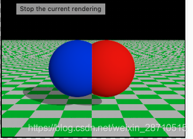

# POV-Ray介绍

https://blog.csdn.net/weixin_28710515/article/details/89175222

[（The Persistence of Vision Ray Tracer, or
POV-Ray）]{.mark}POV视觉光线追踪器是一个光线跟踪程序，它是从基于文本的场景描述文件生成图像，可在各种计算机平台上使用。它最初基于DKBTrace，由David
Kirk Buck和Aaron A.
Collins为Amiga计算机编写。早期的Polyray光线追踪器也受到其作者Alexander
Enzmann的影响。POV-Ray是免费的开源软件，在Github上可以下载。POV-Ray自创建以来已经成熟。该软件的最新版本包括以下功能：

1.  一个图灵完全的场景描述语言（SDL），支持宏和循环

2.  有现成可用的场景，纹理和对象库

3.  支持大量的几何图元和构造实体几何图形(CSG)

4.  几种可用的光源定义

5.  大气效应，如雾和媒体（烟雾，云）

6.  使用光子映射的反射，折射和光焦散

7.  表面图案，如皱纹，凸起和涟漪，用于程序纹理和凹凸贴图

8.  光能传递

9.  图像格式支持纹理和渲染输出，包括TGA，PNG，JPEG等

10. 广泛的用户文档

POV-Ray的主要吸引力之一是其大量的第三方支持。可以在Web上找到大量工具，纹理，模型，场景和教程。对于那些想要了解光线跟踪和相关几何和图形算法如何工作的人来说，它也是一个有用的参考。

其他介绍可参考维基百科。

## 关于安装

一般可以到POV-RAY官网寻求帮助。

针对Windows用户，可以下载POV-RAY的Windows版安装包进行安装，比较容易；

针对Mac用户，虽然POV-RAY官方说不打算开发支持Mac版本，但是有一个网站开发了非官方版本，照样可以满足Mac用户的需求，本人就是使用此版本，点击POV-RAY
for Mac（非官方版本）获取；

关于Linux用户，官方有详细的安装教程，参考官方文档即可。

安装后，有一些实例，可供用户，来进行尝试。\[注\]不同系统，可能使用不同，详情登陆查看官方帮助文档。

## 教程

POV-Ray的scene采用独特的语言来进行描述，即SDL(scene description
language)。我们可以在文本中，进行编程，而POY-Ray通过读入这些编写好的脚本文件，来进行图像绘制。在后续介绍中，分为[基础和高级教程]{.mark}两部分，首先推出基础教程系列：

-   POV-RAY基础教程 - 介绍

-   POV-RAY基础教程 - 基本SDL

-   POV-RAY基础教程 - CSG

-   POV-RAY基础教程 - 光源

-   POV-RAY基础教程 - 简单贴图/纹理设置

-   POV-RAY基础教程 - 相机

-   POV-RAY基础教程 - POV-Ray坐标系

# POV-RAY基础教程-基本SDL

本片介绍POV-RAY基本元素，同时编写基本的SDL文件并运行，由于POV-RAY是基于POV场景描述文进行图形渲染的，所以，首先需要了解和掌握POV文件的编写。

## 第一副图像

了解POV-Ray的坐标系。

首先，我们必须告诉POV-Ray我们的相机的位置以及它的方向。为此，我们使用3D坐标。POV-Ray的常用坐标系统是正y轴朝上，正x轴指向右边，正z轴指向屏幕，这种坐标系称为[左手坐标系]{.mark}。

## 添加标准包含文件

可以使用我们个人喜欢的文本编辑器，我们创建一个名为demo.pov文件。某些版本的POV-Ray带有自己的内置文本编辑器，可能更容易使用。然后我们输入以下文字。输入区分大小写，大小写敏感。

#include"colors.inc"//包含文件包含

#include"stones.inc"//预定义的场景元素

第一个include语句读入各种有用颜色的定义。第二个包含语句读入石头纹理的集合。POV-Ray附带许多标准包含文件。其他感兴趣的是：

#include"textures.inc"//预定义的场景元素

#include "shapes.inc"

#include"glass.inc"

#include"metals.inc"

#include"woods.inc"

他们读取预定义的纹理，形状，玻璃，金属和木材贴图。可以通过这些文件查看一下可用的形状和纹理。

我们应该只包括我们场景中需要的头文件。POV-Ray附带的一些包含文件非常大，如果我们不需要它们，我们应该考虑更好地节省解析时间和内存。在以下示例中，我们将仅使用colors.inc和stones.inc
包含文件。

我们可能在一个场景文件中包含众多数量的头文件。包含文件本身可能还包含其他的头文件，但最大嵌套包含层级不能超过十层。

头文件搜索顺序，首先在当前目录中搜索include语句中指定的文件名。如果在当前目录中未找到您的.Inc文件，POV-Ray将搜索您指定的任何库路径。库路径是由+L
命令行开关或Library_Path选项设置的。有关库路径的更多信息，请参阅设置POV-Ray选项一章。

因为将包含文件保存在单独的目录中更方便使用，所以POV-Ray的标准安装会将这些文件放在c:\\povray3\\include目录中（c:\\povray3将替换为您安装POV-Ray的实际目录）。

## 添加相机

camera声明定义相机位置以及它的方向。由x，y和z坐标定义摄像机的位置以及它的指向。我们使用向量描述坐标。通过在一对尖括号之间放置三个数值并用逗号分隔值来指定向量。我们将以下相机声明添加到场景中。

camera {

location \<0, 2, -3\>

look_at \<0, 1, 2\>

}

简言之，location
\<0,2,-3\>将摄像机放置在距离光线跟踪系统中心\<0,0,0\>的上面两个单位，远离屏幕三个单位处。默认情况下，+z进入屏幕，-z远离屏幕。同时look_at
\<0,1,2\>旋转摄像机指向坐标\<0,1,2\>，这使得它在相机前面5个单元，比相机低1个单位。这look_at点应该是我们场景关注的焦点。

## 描述物体

现在摄像机已设置好记录场景，让我们在场景中放置一个黄色球体。我们将以下内容添加到场景文件中：

sphere {

\<0, 1, 2\>, 2

texture {

pigment { color Yellow }

}

}

第一个向量指定球体的中心。在此示例中，x坐标为零，因此它左右居中。y =
1在原点上一个单位。z坐标为2，即摄像机前面的五个单位。在中心向量之后是逗号，后跟半径，在这种情况下是半径。由于半径是球体宽度的一半，因此球体宽度为四个单位。

## 向物体添加纹理

在我们定义了球体的位置和大小之后，我们需要描述表面的外观。该texture语句指定了这些参数。纹理块描述对象的颜色，凹凸和完成属性。在此示例中，我们仅指定颜色。这是我们必须做的最低限度。除颜色外的所有其他纹理选项将使用默认值。

我们定义的颜色是我们希望物体在完全照明时看起来的样子。如果我们正在绘制一个球体的图片，我们将使用深色调的颜色来指示阴影侧和明亮的阴影在照明侧。然而，光线追踪为您解决了这个问题。我们只需要选择物体中固有的基本颜色，POV-Ray会根据场景中的光线使其变亮或变暗。因为我们定义了对象实际具有的基本颜色而不是它看起来如何，调用参数pigment。

许多类型的颜色图案可用于颜料声明。关键字color指定整个对象是一种纯色而不是某种颜色模式。我们可以使用之前在标准包含文件中定义的颜色标识符之一colors.inc。

如果我们的需求没有可用的标准颜色，我们可以使用color关键字后跟依次定义我们自己的颜色red，green和blue指定要混合的红色，绿色和蓝色值。例如，可以通过以下方式指定漂亮的粉红色：

color red 1.0 green 0.8 blue 0.8

注意：国际而非美国形式的"颜色"也是可以接受的，并且可以在任何可以使用"颜色"的地方使用。

每个关键字后面的值应该在0.0到1.0之间。未指定的三个组件中的任何一个都将默认为0.也可以使用快捷方式表示法。以下产生相同的粉红色：

color rgb \<1.0, 0.8, 0.8\>

在许多情况下，color关键字是多余的，因此指定粉红色的最短方式是：

rgb \<1.0, 0.8, 0.8\>

颜色在颜色部分中有更详细的解释。

## 定义光源

我们的场景还需要一个细节。我们需要一个光源。直到我们创造一个，在这个虚拟世界中没有光明。因此我们添加了这一行

light_source { \<2, 4, -3\> color White}

小结：
到场景文件获取我们的[第一个完整的POV-Ray场景文件]{.mark}，其中包含：[头文件、相机、物体定义(包含贴图)、灯光]{.mark}

如下所示。

#include \"colors.inc\"

background { color Cyan }

camera {

location \<0, 2, -3\>

look_at \<0, 1, 2\>

}

sphere {

\<0, 1, 2\>, 2

texture {

pigment { color Yellow }

}

}

light_source { \<2, 4, -3\> color White}

light_source声明中的矢量将光的位置指定为右侧的两个单位，原点上方的四个单位和距离原点的三个单位。光源是一个发光的不可见的微小点。它没有物理形状，因此不需要纹理。

运行上述代码，如果您指定了预览显示，它将显示在屏幕上。如果您指定了输出文件（默认为文件输出），则POV-Ray也会创建一个文件。

注意：如果您没有高色彩或真彩色显示硬件，则预览图像可能看起来很差，但无论显示类型如何，都会将完整的细节写入图像文件。

以上是只是一个基本的场景绘制过程，但我们必须从基础知识开始，然后我们才能获得更多有趣的功能和场景。

## 基本形状

到目前为止，我们刚刚使用了球体形状。POV-Ray可以渲染许多其他类型的形状。以下部分将介绍如何使用一些更简单的对象作为上面使用的球体的替代。

**长方体**

box是最常用的对象之一。我们尝试这个例子代替球体：

box {

\<-1, 0, -1\>, // 左下角

\< 1, 0.5, 3\> // 右上角

texture {

T_Stone25 // Pre-defined from stones.inc

scale 4 // Scale by the same amount in all

// directions

}

rotate y\*20 // Equivalent to \"rotate \<0,20,0\>\"

}

在该示例中，我们可以看到通过指定其对角的3D坐标来定义框。第一矢量通常是最小的x，y和z坐标，第二矢量应该是最大的x，y和z值，但是可以使用任何两个相对的角。Box对象只能与世界坐标系的轴平行定义。我们以后可以将它们旋转到任何角度。

注意：我们可以对值和向量执行简单的数学运算。在rotate参数中，我们将向量标识符y乘以20.这与\<0,1,0\>
\* 20或\<0,20,0\>作用相同。

**锥体**

这是另一个示例，说明如何使用cone：

cone {

\<0, 1, 0\>, 0.3 // Center and radius of one end

\<1, 2, 3\>, 1.0 // Center and radius of other end

texture { T_Stone25 scale 4 }

}

锥形由每个末端的中心和半径限定。在这个例子中，一端位于\<0,1,0\>位置，半径为0.3，而另一端以\<1,2,3\>为中心，半径为1.如果我们想要锥体到达尖点我们必须使用radius
=
0。实心端盖彼此平行并垂直于锥轴。如果我们想要一个没有端盖的开锥，我们必须在第二个半径之后添加open关键字，如下所示：

cone {

\<0, 1, 0\>, 0.3 // Center and radius of one end

\<1, 2, 3\>, 1.0 // Center and radius of other end

open

texture { T_Stone25 scale 4 }

}

**圆柱体**

我们也可以这样定义cylinder：

cylinder {

\<0, 1, 0\>, // Center of one end

\<1, 2, 3\>, // Center of other end

0.5 // Radius

open // Remove end caps

texture { T_Stone25 scale 4 }

}

**平面**

让我们试试一个计算机图形标准The Checkered
Floor。我们将以下对象添加到demo.pov文件的第一个版本， 包括球体。

plane {

\<0, 1, 0\>, -1

pigment {

checker color Red, color Blue

}

}

这里定义的对象是无限平面。矢量\<0,1,0\>是平面的表面法线（即如果我们站在表面上，则法线点直线向上）。之后的数字是平面从原点沿法线移动的距离 -
在这种情况下，地板放置在y = -1处，以便y = 1，半径= 2的球体停留在它上面。

注意：即使没有texture声明，这里也有隐含的纹理。我们可能会发现，连续输入嵌套的语句texture
{pigment可能会变得令人厌烦，所以POV-Ray让我们
texture在很多情况下都会忽略声明。一般来说，我们只需要围绕纹理标识符的纹理块（如T_Stone25上面的示例），或者创建分层纹理（稍后介绍）。

此颜料使用检查颜色图案并指定应使用红色和蓝色两种颜色。因为矢量\<1,0,0\>，\<0,1,0\>和\<0,0,1\>经常使用，POV射线具有三个内置向量标识符
x， y以及z分别可以用作速记。因此，可以定义为：

plane { y, -1

pigment { \... }

}

[注意：我们不使用矢量标识符周围的尖括号。]

至此完整代码如下：

#include \"colors.inc\"

background { color Cyan }

camera {

location \<0, 2, -3\>

look_at \<0, 1, 2\>

}

sphere {

\<0, 1, 2\>, 2

texture {

pigment { color Yellow }

}

}

plane {

\<0, 1, 0\>, -1

pigment {

checker color Red, color Blue

}

}

light_source { \<2, 4, -3\> color White}

运行的图如下：

看着地板，我们注意到球在地板上投下了阴影。光线跟踪器可以非常精确地计算阴影，从而产生精确，锐利的阴影。在现实世界中，经常会看到半影或柔和的阴影。稍后我们将[学习如何使用扩展光源来柔化阴影。]{.mark}

**Torus对象**

一个torus可以被认为是甜甜圈或内胎。它是一种在多种CSG中非常有用的形状，因此POV-Ray采用这种四阶四次多项式作为原始形状。圆环的语法非常简单，一旦我们了解了两个浮点值的含义，就可以很容易地使用它。而不是关于这个主题的讲座，让我们创建一个并用它做一些实验。我们创建一个名为的文件[tordemo.pov，]{.mark}并按如下方式编辑它：

#include \"colors.inc\"

camera {

location \<0, .1, -25\>

look_at 0

angle 30

}

background { color Gray50 } // to make the torus easy to see

light_source { \<300, 300, -1000\> White }

torus {

4, 1 // major and minor radius

rotate -90\*x // so we can see it from the top

pigment { Green }

}

我们追踪现场。好吧，这是一个甜甜圈好吧。让我们尝试更改主要和次要半径值，看看会发生什么。我们将它们更改如下：

torus {5，.25 //主要和次要半径

这看起来更像是呼啦圈！我们试试这个：

torus {3.5,2.5 //主要和次要半径

哇！一个有严重体重问题的甜甜圈！有了这么简单的语法，除了改变它的纹理之外，除了改变它的纹理之外我们还能做些什么呢？或者在那里？让我们来看看...Tori是CSG中非常有用的对象。我们来试试吧。我们改变了圆环和盒子：

difference {

torus {

4, 1

rotate x\*-90 // so we can see it from the top

}

box { \<-5, -5, -1\>, \<5, 0, 1\> }

pigment { Green }

}

有意思...半个圆环。现在我们添加另一个翻转另一个方式。只是，让我们宣布原始的半圆环和必要的变换，以便我们可以再次使用它们：

#declare Half_Torus = difference {

torus {

4, 1

rotate -90\*x // so we can see it from the top

}

box { \<-5, -5, -1\>, \<5, 0, 1\> }

pigment { Green }

}

#declare Flip_It_Over = 180\*x;

#declare Torus_Translate = 8; // twice the major radius

现在我们创建一个包含两个Half_Torus对象的联合：

union {

object { Half_Torus }

object { Half_Torus

rotate Flip_It_Over

translate Torus_Translate\*x

}

}

现在代码如下：

#include \"colors.inc\"

camera {

location \<0, .1, -25\>

look_at 0

angle 30

}

background { color Gray50 } // to make the torus easy to see

light_source { \<300, 300, -1000\> White }

#declare Half_Torus = difference {

torus {

4, 1

rotate -90\*x // so we can see it from the top

}

box { \<-5, -5, -1\>, \<5, 0, 1\> }

pigment { Green }

}

#declare Flip_It_Over = 180\*x;

#declare Torus_Translate = 8; // twice the major radius

union {

object { Half_Torus }

object { Half_Torus

rotate Flip_It_Over

translate Torus_Translate\*x

}

}

显示图形是：

这是一个S形物体，但我们无法从现有的相机中看到整个物体。让我们添加一些链接，每个方向三个，沿+
z方向移动对象并围绕+
y轴旋转它，以便我们可以看到更多。我们还注意到，Tori会见的地方似乎有一个小的差距。这是因为我们正在直接在xz平面上查看此场景。我们将相机的y坐标从0更改为0.1以消除此问题。

union {

object { Half_Torus }

object { Half_Torus

rotate Flip_It_Over

translate x\*Torus_Translate

}

object { Half_Torus

translate x\*Torus_Translate\*2

}

object { Half_Torus

rotate Flip_It_Over

translate x\*Torus_Translate\*3

}

object { Half_Torus

rotate Flip_It_Over

translate -x\*Torus_Translate

}

object { Half_Torus

translate -x\*Torus_Translate\*2

}

object { Half_Torus

rotate Flip_It_Over

translate -x\*Torus_Translate\*3

}

object { Half_Torus

translate -x\*Torus_Translate\*4

}

rotate y\*45

translate z\*20

}

渲染这个，我们看到一个凉爽，起伏，蛇状的东西或其他。但我们想要建模一些有用的东西，这些东西我们可能会在现实生活中看到。链条怎么样？

考虑一下，我们意识到链条的单个链接可以使用两个半圆柱和两个圆柱轻松建模。

我们创建一个新文件。我们可以使用相同的相机，背景，光源和声明的对象和转换，如我们所使用的
[tordemo.pov：]{.mark}

#include \"colors.inc\"

camera {

location \<0, .1, -25\>

look_at 0

angle 30

}

background { color Gray50 }

light_source{ \<300, 300, -1000\> White }

#declare Half_Torus = difference {

torus {

4,1

sturm

rotate x\*-90 // so we can see it from the top

}

box { \<-5, -5, -1\>, \<5, 0, 1\> }

pigment { Green }

}

#declare Flip_It_Over = x\*180;

#declare Torus_Translate = 8;

现在，我们制作了两个半圆环的完整圆环：

union {

object { Half_Torus }

object { Half_Torus rotate Flip_It_Over }

}

图片如下：

这似乎是制作一个完整圆环的浪费方式，但我们真的要将每一半移动以为圆柱体腾出空间。首先，我们在联合之前添加声明的柱面：

#declare Chain_Segment = cylinder {

\<0, 4, 0\>, \<0, -4, 0\>, 1

pigment { Green }

}

然后我们将两个Chain_Segments加到联合并转换它们，使它们与每一侧的圆环的小半径对齐：

union {

object { Half_Torus }

object { Half_Torus rotate Flip_It_Over }

object { Chain_Segment translate x\*Torus_Translate/2 }

object { Chain_Segment translate -x\*Torus_Translate/2 }

}

图片如下：

现在我们将两个圆周+
y和-y平移，以便修剪的末端与圆柱的末端相交。该距离等于先前声明的一半Torus_Translate：

union {

object {

Half_Torus

translate y\*Torus_Translate/2

}

object {

Half_Torus

rotate Flip_It_Over

translate -y\*Torus_Translate/2

}

object {

Chain_Segment

translate x\*Torus_Translate/2

}

object {

Chain_Segment

translate -x\*Torus_Translate/2

}

}

我们渲染这个，瞧！链的单个链接。但我们还没有完成！谁听说过绿链？我们宁愿使用漂亮的金属色。首先，我们去除所声明的圆环和圆柱体中的任何颜料块。然后我们在创建链接的联合之前添加一个黄金纹理的声明。最后，我们将纹理添加到union中并将其声明为单个链接：

#declare Half_Torus = difference {

torus {

4,1

sturm

rotate x\*-90 // so we can see it from the top

}

box { \<-5, -5, -1\>, \<5, 0, 1\> }

}

#declare Chain_Segment = cylinder {

\<0, 4, 0\>, \<0, -4, 0\>, 1

}

#declare Chain_Gold = texture {

pigment { BrightGold }

finish {

ambient .1

diffuse .4

reflection .25

specular 1

metallic

}

}

#declare Link = union {

object {

Half_Torus

translate y\*Torus_Translate/2

}

object {

Half_Torus

rotate Flip_It_Over

translate -y\*Torus_Translate/2

}

object {

Chain_Segment

translate x\*Torus_Translate/2

}

object {

Chain_Segment

translate -x\*Torus_Translate/2

}

texture { Chain_Gold }

}

现在我们建立两个链接的联合。第二个必须平移+
y，使其内壁恰好与另一个链接的内壁相遇，就像链条的链接一样。该距离变为先前声明的Torus_Translate减2（小半径的两倍）的两倍。这可以通过以下表达式来描述：

Torus_Translate \* 2-2 \* Y

我们将此表达式声明如下：

#declare Link_Translate = Torus_Translate \* 2-2 \* y;

在对象块中，我们将使用此声明的值，以便我们可以将其相乘以创建其他链接。现在，我们旋转第二个链接90\*y，使其垂直于第一个链接，就像链的链接一样。最后，我们将联合缩放1/4，以便我们可以看到整个事物：

union {

object { Link }

object { Link translate y\*Link_Translate rotate y\*90 }

scale .25

}

我们渲染这个，我们将看到一对非常现实的链接。如果我们想要创建一个完整的链，我们必须声明上面的联合，然后创建这个声明的对象的另一个联合。我们必须确保从声明的对象中删除缩放：

#declare Link_Pair =

union {

object { Link }

object { Link translate y\*Link_Translate rotate y\*90 }

}

至此代码为：

#include \"colors.inc\"

camera {

location \<0, .1, -25\>

look_at 0

angle 30

}

background { color Gray50 }

light_source{ \<300, 300, -1000\> White }

#declare Flip_It_Over = x\*180;

#declare Torus_Translate = 8;

#declare Half_Torus = difference {

torus {

4,1

sturm

rotate x\*-90 // so we can see it from the top

}

box { \<-5, -5, -1\>, \<5, 0, 1\> }

}

#declare Chain_Segment = cylinder {

\<0, 4, 0\>, \<0, -4, 0\>, 1

}

#declare Chain_Gold = texture {

pigment { BrightGold }

finish {

ambient .1

diffuse .4

reflection .25

specular 1

metallic

}

}

#declare Link = union {

object {

Half_Torus

translate y\*Torus_Translate/2

}

object {

Half_Torus

rotate Flip_It_Over

translate -y\*Torus_Translate/2

}

object {

Chain_Segment

translate x\*Torus_Translate/2

}

object {

Chain_Segment

translate -x\*Torus_Translate/2

}

texture { Chain_Gold }

}

#declare Link_Translate = Torus_Translate \* 2-2 \* y;

union {

object { Link }

object { Link translate y\*Link_Translate rotate y\*45 }

scale .20

}

图片为：

现在我们宣布我们的链：

#declare Chain = union {

object { Link_Pair}

object { Link_Pair translate y\*Link_Translate\*2 }

object { Link_Pair translate y\*Link_Translate\*4 }

object { Link_Pair translate y\*Link_Translate\*6 }

object { Link_Pair translate -y\*Link_Translate\*2 }

object { Link_Pair translate -y\*Link_Translate\*4 }

object { Link_Pair translate -y\*Link_Translate\*6 }

}

最后，我们通过几个转换创建我们的链，以便更容易看到。这些包括将其缩小1/10，然后旋转它以便我们可以清楚地看到每个链接：

object {Chain scale .1 rotate &lt;0,45，-45&gt;}

我们渲染这个，我们应该看到一个非常逼真的金链在屏幕上对角拉伸。

圆环对象可用于创建链。

# POV-RAY基础教程 - CSG

构造型实体几何体（CSG）是一种可以组合原始对象以创建更复杂的对象的手段或者说方式，在上一篇介绍黄金链就已经用到了CSG方法。

## 什么是CSG？

POV-Ray的CSG(Constructive Solid
Geometry)允许我们通过以四种不同的方式组合原始形状来构造复杂的实体。它们是：

1.  使用union声明，将两个或多个形状合并在一起；

2.  使用intersection声明，将两个或多个形状组合在一起以形成由两个形状共有的区域组成新形状；

3.  使用difference声明，初始的形状具有从中减去所有后续的形状；

4.  使用merge声明，它就像一个联合体，其中联合体内的表面被移除（在透明CSG对象中很有用）。

我们接下来细讨论这些细节

### CSG Union

让我们试着做一个简单的联合。创建一个名为的文件csgdemo.pov并按如下方式编辑它：

#include \"colors.inc\"

camera {

location \<0, 1, -10\>

look_at 0

angle 36

}

light_source { \<500, 500, -1000\> White }

plane { y, -1.5

pigment { checker Green White }

}

让我们添加两个球体，每个球体沿x轴在每个方向上平移0.5个单位。我们将一个蓝色和另一个红色染色。

sphere { \<0, 0, 0\>, 1

pigment { Blue }

translate -0.5\*x

}

sphere { \<0, 0, 0\>, 1

pigment { Red }

translate 0.5\*x

}

我们跟踪此文件并记下结果。现在我们在两个球体周围放置一个联合块。这将从两个对象中创建单个CSG联合。

union{

sphere { \<0, 0, 0\>, 1

pigment { Blue }

translate -0.5\*x

}

sphere { \<0, 0, 0\>, 1

pigment { Red }

translate 0.5\*x

}

}

> 

我们再次追踪文件。联合将看起来与每个球体本身的外观没有什么不同，但现在我们可以给整个联合提供单个纹理并将其整体转换。我们现在就这样做。

union{

sphere { \<0, 0, 0\>, 1

translate -0.5\*x

}

sphere { \<0, 0, 0\>, 1

translate 0.5\*x

}

pigment { Red }

scale \<1, .25, 1\>

rotate \<30, 0, 45\>

}

我们再次追踪文件。我们可以看到，该对象发生了巨大变化。我们尝试不同的比例值并旋转并尝试一些不同的纹理。

将一个纹理分配给CSG对象而不是将纹理分配给每个单独的组件有许多优点。首先，如果我们的CSG对象具有大量组件，则使用一个纹理要容易得多，因为更改对象外观只涉及更改一个单一纹理。其次，文件解析得更快，因为纹理只需要解析一次。在进行大型场景或动画时，这可能是一个很重要的因素。第三，仅使用一个纹理可以节省内存，因为纹理只存储一次并由CSG对象的所有组件引用。将纹理分配给所有n个组件意味着它被存储n次。

### CSG intersection

顾名思义，取物体的交集，现在让我们使用这些相同的球体来说明intersection声明的CSG对象。我们将单词更改union为intersection并删除scale和rotate语句：

intersection {

sphere { \<0, 0, 0\>, 1

translate -0.5\*x

}

sphere { \<0, 0, 0\>, 1

translate 0.5\*x

}

pigment { Red }

}

图片

我们追踪文件并将看到一个镜头形状的物体而不是两个球体。这是因为交叉点由两个形状共享的区域组成，在这种情况下是两个球体重叠的透镜形区域。我们喜欢这个镜片形物体，所以我们将用它来展示差异。

### CSG Difference

我们围绕y轴旋转镜头形状的交叉点，使得宽边朝向相机。

intersection{

sphere { \<0, 0, 0\>, 1

translate -0.5\*x

}

sphere { \<0, 0, 0\>, 1

translate 0.5\*x

}

pigment { Red }

rotate 90\*y

}

让我们创建一个圆柱体并将其粘在镜头中间。

cylinder { \<0, 0, -1\> \<0, 0, 1\>, .35

pigment { Blue }

}

我们渲染场景以查看圆柱体的位置。我们将围绕镜头形状的交叉点和圆柱体放置一个difference块，如下所示：

difference {

intersection {

sphere { \<0, 0, 0\>, 1

translate -0.5\*x

}

sphere { \<0, 0, 0\>, 1

translate 0.5\*x

}

pigment { Red }

rotate 90\*y

}

cylinder { \<0, 0, -1\> \<0, 0, 1\>, .35

pigment { Blue }

}

}

渲染的图形如下：

我们再次渲染文件，看到镜头形状的交叉点，在它的中间有一个整齐的洞。圆筒已经从交叉区域subtracted。注意，圆柱体的颜料使孔的表面着蓝色。如果我们消除这种颜料，孔的表面将是黑色的，因为如果没有指定颜色，这是默认颜色。好吧，让我们现在变得有点狂野。让我们宣布我们的穿孔镜片对象给它一个名字。让我们也消除声明对象中的所有纹理，因为我们希望它们在最终的联合中。

#declare Lens_With_Hole = difference {

intersection {

sphere { \<0, 0, 0\>, 1

translate -0.5\*x

}

sphere { \<0, 0, 0\>, 1

translate 0.5\*x

}

rotate 90\*y

}

cylinder { \<0, 0, -1\> \<0, 0, 1\>, .35 }

}

让我们使用一个联合来构建一个由这个对象的副本组成的复杂形状。

union {

object { Lens_With_Hole translate \<-.65, .65, 0\> }

object { Lens_With_Hole translate \<.65, .65, 0\> }

object { Lens_With_Hole translate \<-.65, -.65, 0\> }

object { Lens_With_Hole translate \<.65, -.65, 0\> }

pigment { Red }

}

让我们通过在颜料块中添加一些过滤器使其成为部分透明的物体。

union {

object { Lens_With_Hole translate \<-.65, .65, 0\> }

object { Lens_With_Hole translate \<.65, .65, 0\> }

object { Lens_With_Hole translate \<-.65, -.65, 0\> }

object { Lens_With_Hole translate \<.65, -.65, 0\> }

pigment { Red filter .6 }

}

可以看到，透过红色部分可以看到地面纹路，说明有一定的透明度

### CSG Merge

这将我们带到第四种CSG对象，即merge。合并与联合相同，但不跟踪合并内的CSG中对象的几何。这应该消除我们的对象的问题。我们来试试吧。

merge {

object { Lens_With_Hole translate \<-.65, .65, 0\> }

object { Lens_With_Hole translate \<.65, .65, 0\> }

object { Lens_With_Hole translate \<-.65, -.65, 0\> }

object { Lens_With_Hole translate \<.65, -.65, 0\> }

pigment { Red filter .6 }

}

果然，确实如此！

### CSG问题

我们必须注意CSG代码中存在严重缺陷。POV-Ray使用内部/外部测试来确定光线与CSG对象相交的点。当两个不同形状的表面重合时会出现问题，因为没有办法（由于计算机的浮点精度）来判断重合表面上的点是属于一种形状还是另一种形状。请看下面的示例，其中使用圆柱体在较大的盒子中切割孔。

difference {

box { -1, 1 pigment { Red } }

cylinder { -z, z, 0.5 pigment { Green } }

}

注意：框定义中的向量-1和1分别扩展为\<-1，-1，-1\>;和\<1,1,1\>。

图片如下

从图片中，我们可以看到，在两个物体相交的表面，产生了红绿斑点，这是因为，坐标相同的两个相交表面，POV-Ray不知道具体渲染哪一个，可能一会渲染这个，一会渲染那个，就会产生这种现象。\
既然，是因为坐标完全一样，导致的这种问题，如果想解决这种问题，我们只需将其移动一点位置就可以了

difference {

box { -1, 1 pigment { Red } }

cylinder { -1.001\*z, 1.001\*z, 0.5 pigment { Green } }

}

图片如下

# POV-RAY基础教程 - 光源

在任何光线追踪场景中，照亮物体及其表面所需的光线必须来自光源。POV-Ray中有多种光源，仔细使用正确的光源可以产生非常令人印象深刻的结果。我们花一点时间来探索一些不同类型的光源及其各种参数。

## 1Pointlight(点光源)

点光源正是名称所指示的。点光源没有大小，是不可见的，无论距离光源有多远，都可以均匀地照亮场景中的所有物体（这种行为可以改变）。这是最简单和最基本的光源。只有两个重要参数，位置和颜色。让我们设计一个简单的场景并在其中放置一个点光源。我们创建一个新文件并命名litedemo.pov。我们编辑如下：

#include \"colors.inc\"

#include \"textures.inc\"

camera {

location \<-4, 3, -9\>

look_at \<0, 0, 0\>

angle 48

}

plane {

y, -1

texture {

pigment {

checker

color rgb\<0.5, 0, 0\>

color rgb\<0, 0.5, 0.5\>

}

finish {

diffuse 0.4

ambient 0.2

phong 1

phong_size 100

reflection 0.25

}

}

}

torus {

1.5, 0.5

texture { Brown_Agate }

rotate \<90, 160, 0\>

translate \<-1, 1, 3\>

}

box {

\<-1, -1, -1\>, \<1, 1, 1\>

texture { DMFLightOak }

translate \<2, 0, 2.3\>

}

cone {

\<0,1,0\>, 0, \<0,0,0\>, 1

texture { PinkAlabaster }

scale \<1, 3, 1\>

translate \<-2, -1, -1\>

}

sphere {

\<0,0,0\>,1

texture { Sapphire_Agate }

translate \<1.5, 0, -2\>

}

渲染的图片如下：

现在我们添加一个点光源：

light_source {

\<2, 10, -3\>

color White

}

然后我们渲染，得到下图，大家可以感受一下

渲染后可以看到物体清晰可见，有清晰的阴影。最靠近光源的弯曲物体的侧面是最亮的，而远离光源的区域是最暗的。我们还注意到，方格平面一直均匀地照射到地平线上。

## 2Spotlight（聚光灯）

聚光灯是一种非常有用的光源。它们可用于添加高光和照亮功能，因为摄影师使用斑点来做同样的事情。要创建聚光灯，只需将spotlight
关键字添加到常规点光源即可。聚光灯有几个参数比聚光灯更多。这是radius，
falloff，tightness和point_at。radius参数是完全照明锥体的角度。该falloff参数是本影锥体的角度，其中光线从黑暗中落下。该tightness参数确定光衰减的速率。该point_at参数就是它所说的，聚光灯所指向的位置。让我们改变场景中的光线如下：

light_source {

\<0, 10, -3\>

color White

spotlight

radius 15

falloff 20

tightness 10

point_at \<0, 0, 0\>

}

然后我们渲染，得到下图，大家可以感受一下

我们渲染它，看到只有物体被照亮。平面的其余部分和物体的外部部分现在都没有点亮。有一个广泛的衰落区域，但阴影仍然是锐利的。让我们尝试摆弄其中的一些参数，看看他们做了什么。我们将衰减值更改为16（它必须始终大于半径值）并再次渲染。现在衰减非常狭窄，物体要么明亮，要么完全黑暗。现在我们将衰减更改回20并将紧密度值更改为100（更高更紧）并再次渲染。聚光灯似乎变得更小了，但真正发生的事情是衰减变得如此陡峭，以至于半径实际上看起来更小了。我们认为紧密度值10（默认值）和衰减值18对于这个聚光灯是最好的，我们现在想在场景周围放置一些点以产生效果。除了我们已经拥有的白色之外，让我们放置一个的蓝色和一个红色的聚光灯光源：

light_source {

\<10, 10, -1\>

color Red

spotlight

radius 12

falloff 14

tightness 10

point_at \<2, 0, 0\>

}

light_source {

\<-12, 10, -1\>

color Blue

spotlight

radius 12

falloff 14

tightness 10

point_at \<-2, 0, 0\>

}

图片如下

渲染这个我们看到现在的场景有一种神奇的效果。三个聚光灯全部聚集在物体上，一侧为蓝色，另一侧为红色，中间有足够的白色以提供平衡。

## 3Cylinder（柱状光源）

聚光灯呈锥形，这意味着它们的效果会随着距离而变化。物体越远离聚光灯，表观半径越大。但是我们可能希望无论聚光灯有多远，半径和衰减都是特定的大小。因此，需要圆柱形光源。圆柱形光源就像聚光灯一样，除了半径和衰减区域外是相同的，无论我们的物体离光源有多远。因此，形状是圆柱而不是圆锥。我们可以通过用spotlight关键字替换关键字来指定圆柱形光源cylinder
关键词。我们现在尝试使用我们的场景，用圆柱灯替换所有三个聚光灯并再次渲染。我们看到场景更加暗淡。这是因为圆柱形约束不会像聚光灯那样让光线散开。需要更大的半径和衰减值来完成这项工作。对于所有三个灯，我们尝试半径为20，衰减为30。

## 4Area（区域光源）

到目前为止，我们所有的光源都有一个共同点。它们产生锐利的阴影。这是因为实际光源是无限小的点。物体要么直接看到光，在这种情况下它们是完全照明的，或者它们不是，在这种情况下它们是完全遮蔽的。在现实生活中，这种鲜明的光影情况只存在于太阳直射光穿透太空黑暗的外太空中。但是在地球上，光在物体周围弯曲，从物体上反弹，通常光源具有一定的尺寸，这意味着它可以部分地隐藏在视线之外（阴影不再是锐利的）。他们有一种所谓的本影，或者一个模糊的区域，那里既没有光照，也没有光影。为了模拟这些柔软
阴影，射线追踪者必须给它的光源尺寸。POV-Ray通过称为区域光的功能实现了这一点。区域灯具有两个轴的尺寸。这些由区域光源语法中的前两个向量指定。我们还必须指定阵列中有多少个灯。更多会给我们更干净柔和的阴影，但渲染时间会更长。通常3
\* 3或5 \* 5阵列就足够了。我们还可以选择指定自适应值。该
adaptive关键字告诉光线跟踪器它可以适应这种情况并仅发送所需的光线来确定像素的值。如果未使用自适应，则将为区域光中的每个光发送单独的光线。这真的可以减缓事情的发展。自适应值越高，本影就越清洁，但痕迹越长。通常，自适应值为1就足够了。最后，我们可能应该使用
jitter关键词。这告诉光线追踪器稍微移动区域光线中每个光线的位置，使阴影看起来真正柔和，而不是给我们一个由紧密带状阴影组成的本影。好的，我们来试试吧。我们注意到圆柱灯并添加以下内容：

light_source {

\<2, 10, -3\>

color White

area_light \<5, 0, 0\>, \<0, 0, 5\>, 5, 5

adaptive 1

jitter

}

这是一个以\<2,10，-3\>为中心的白色区域光。它是5个单元（沿x轴）5个单元（沿z轴），其中有25（5
\*
5）个灯。我们已经指定了自适应1和抖动。我们渲染并立即注意到两件事。跟踪点或聚光灯的轨迹需要相当长的时间，而且阴影不再清晰！他们周围都有很好的柔软的umbrae。等等，它变得更好。

聚光灯和圆柱灯也可以是区域灯！还记得我们场景中聚光灯的那些尖锐阴影吗？使用5
\*
5阵列作为聚光灯是没有多大意义的，但是较小的阵列可以很好地为我们提供适当数量的本影聚光灯。我们来试试吧。如下所示：

light_source {

\<2, 10, -3\>

color White

spotlight

radius 15

falloff 18

tightness 10

area_light \<1, 0, 0\>, \<0, 0, 1\>, 2, 2

adaptive 1

jitter

point_at \<0, 0, 0\>

}

light_source {

\<10, 10, -1\>

color Red

spotlight

radius 12

falloff 14

tightness 10

area_light \<1, 0, 0\>, \<0, 0, 1\>, 2, 2

adaptive 1

jitter

point_at \<2, 0, 0\>

}

light_source {

\<-12, 10, -1\>

color Blue

spotlight

radius 12

falloff 14

tightness 10

area_light \<1, 0, 0\>, \<0, 0, 1\>, 2, 2

adaptive 1

jitter

point_at \<-2, 0, 0\>

}

图片如下

我们现在有三个区域聚光灯，一个单位正方形，由四个（2 \*
2）灯组成，三种不同的颜色，都在我们的场景中闪耀。我们渲染它，它似乎完美。我们所有的阴影都有小而紧的本影，就像我们期望在真实聚光灯下的物体上找到的那种。

## 5Ambient (环境光)

用于模拟间漫反射的效果。如果没有相互漫反射，则所有未被光源直接照射的区域将完全变暗。POV-Ray使用ambient关键字来确定来自环境光源的光被表面反射的光量。默认情况下，环境光源在任何地方向所有方向发光，都是纯白色（rgb
\<1,1,1\>）。改变颜色可用于创造有趣的效果。首先，可以轻松调整场景的整体亮度。不是改变每个表面处理中的所有环境值，而是仅修改环境光源。通过分配不同的颜色，我们可以创建出色的效果，如喜怒无常的微红色环境照明。以下是红色环境光源的示例。

global_settings {ambient_light rgb \<1,0,0\>}

效果图：

有关详细信息，请参阅环境光。

## 6其他特殊光源属性

### 6.1 shadowless

可以为光源分配shadowless关键字，并且由于其存在于场景中而不会投射阴影。有时候，使用我们选择照亮物体的灯光很难正确照亮场景。将较高的环境值应用于场景中每个对象的纹理是不切实际且不现实的。相反，我们会在场景周围放置几个补光灯。填充灯只是调光灯，其shadowless关键字用于增强场景中可能无法点亮的其他区域的照明。让我们尝试在我们的场景中使用一个。添加以下内容：

light_source {

\<0, 20, 0\>

color Gray50

shadowless

}

在场景中心，这是一个相当暗淡的20个单位。它将为所有对象（包括背景中的平面）提供昏暗的照明。我们渲染它并看到。

### 6.2 给光源加个形状

光源是看不见的。它们只是灯光来自的地方。它们没有真正的尺寸或形状。如果我们希望我们的光源是可见的形状，我们可以使用looks_like关键字。我们可以指定我们的光源看起来像我们选择的任何对象。当我们使用时looks_like，则no_shadow自动应用于对象。这样做是为了使物体不会阻挡来自光源的任何照明。如果我们想要发生一些阻塞（如在灯罩中），最好简单地使用一个联合来做同样的事情。让我们将这样的对象添加到场景中。这是我们为此目的制作的一个灯泡：

#declare Lightbulb = union {

merge {

sphere { \<0,0,0\>,1 }

cylinder {

\<0,0,1\>, \<0,0,0\>, 1

scale \<0.35, 0.35, 1.0\>

translate 0.5\*z

}

texture {

pigment {color rgb \<1, 1, 1\>}

finish {ambient .8 diffuse .6}

}

}

cylinder {

\<0,0,1\>, \<0,0,0\>, 1

scale \<0.4, 0.4, 0.5\>

texture { Brass_Texture }

translate 1.5\*z

}

rotate -90\*x

scale .5

}

现在我们添加光源：

渲染这个我们看到一个相当可信的灯泡现在照亮了场景。但是，如果我们没有指定高环境值，则灯泡不会被光源点亮。从好的方面来看，所有的阴影都会远离灯泡，就像在真实情况下一样。阴影是锐利的，所以让我们的灯泡成为一个区域：

light_source {

\<0, 2, 0\>

color White

area_light \<1, 0, 0\>, \<0, 1, 0\>, 2, 2

adaptive 1

jitter

looks_like { Lightbulb }

}

我们注意到我们已将此区域放置在xy平面而不是xz平面上。我们还注意到灯泡的实际外观不受光源的任何影响。灯泡必须由其他光源照明，或者在这种情况下，由高环境值照明。

### 6.3 光线fading

在现实生活中，光线在行进时会散射，因此它会降低物体从其光源进一步照射的能力。为了模拟这一点，POV-Ray允许我们使用两个关键字：fade_distance，其指定实现完全照明的距离，以及指定fade_power衰减的实际速率的指数值。我们将这些关键字应用于我们的补光灯。首先，我们通过更改
Gray50为使填充光更亮一些Gray75。现在我们按如下方式更改补光灯：

light_source {

\<0, 20, 0\>

color Gray75

fade_distance 5

fade_power 1

shadowless

}

这意味着填充光的全部值将在距光源5个单位的距离处实现。衰落功率为1意味着衰减将是线性的（光以恒定速率下降）。我们渲染这个以查看结果。绝对有效！

现在让我们尝试2的衰落功率和10的淡入淡出距离。再次，这很好用。衰落功率更快，衰减功率为2，因此我们不得不将衰落距离提高到10。

效果图：

小结：光源种类较多，属性较多，一些渲染区别不是很明显，建议大家自己动手试验。

# POV-RAY基础教程-简单贴图/纹理设置

到目前为止所呈现的图片对于物体的外观有些无聊。通过一些简单的纹理设置，来产生一些令人惊奇的效果。

## 表面finish

表面处理光线跟踪器的主要特征之一是它能够通过高光和反射等表面处理来完成有趣的事情。让我们在球体上添加一个漂亮的小Phong高光（闪亮点）。为此，我们需要添加一个finish关键字后跟一个参数。我们将球体的定义更改为：

#include \"colors.inc\"

#include \"textures.inc\"

camera {

location \<-4,3,-9\>

look_at \<0,0,0\>

angle 48

}

light_source {

\<0,2,0\>

color Gray75

}

sphere {

\<0, 1, 2\>, 2

texture{

pigment { color Yellow }

finish { phong 1 }

}

}

效果图如下

我们渲染场景。所述phong关键字将添加一个亮点光照射在物体上的相同的颜色。它为图片增添了很多可信度，使物体看起来光滑有光泽。较低的phong值会使高光不那么明亮（值应介于0和1之间）。

## 添加Bump效果

我们添加的亮点说明了我们的感知有多少取决于对象的反射属性。光线跟踪可以通过对我们的感知进行欺骗来利用这一点，使我们看到实际上并不存在的复杂细节。假设我们想要在物体上有一个非常凹凸不平的表面。在数学上模拟许多颠簸是非常困难的。然而，我们可以通过改变光线从表面反射的方式来模拟凸起的外观。反射计算取决于称为表面法线的矢量。这是一个指向远离表面并垂直于它的矢量。通过人工修改（或扰动）这个法向量，我们可以模拟颠簸。我们将场景更改为如下所示并渲染它：

sphere {

\<0, 1, 2\>, 2

texture {

pigment { color Yellow }

normal { bumps 0.4 scale 0.2 }

finish { phong 1 }

}

}

效果图

这告诉POV-Ray使用该bumps模式来修改曲面法线。值0.4控制凸起的表观深度。通常，凸起约为1个单位宽，对于半径为2的球体不能很好地工作。刻度使凸起1/5宽，但不影响它们的深度。

## 创建颜色模式

我们可以做的不仅仅是为对象指定纯色。我们可以在颜料块中创建复杂的图案，如下例所示：

sphere {

\<0, 1, 2\>, 2

texture {

pigment {

wood

color_map {

\[0.0 color DarkTan\]

\[0.9 color DarkBrown\]

\[1.0 color VeryDarkBrown\]

}

turbulence 0.05

scale \<0.2, 0.3, 1\>

}

finish { phong 1 }

}

}

wood关键字确定一种具体的上色模式，这是是木制。对于在POV空间的每一个位置来说，每一种模式都是返回float类型的值，范围是\[0,1\]。不在范围内的值，都会被忽略。color_map关键字用来确定颜色向量是如何来安排这种值的。

在上述例子中，从DarkTan到DarkBrown占据脉络的90%，而从DarkBrown到VeryDarkBrown占据了10%。具体效果可以从图片中看出，turbulence关键是轻微调节模式中的条纹脉络，以至于看起来不那么像完整的圆形。scale关键字调节模式的大小

改变模式，尝试其他效果，如红蓝相间的条纹

sphere {

\<0, 1, 2\>, 2

texture {

pigment {

wood

color_map {

\[0.0 color Red\]

\[0.5 color Red\]

\[0.5 color Blue\]

\[1.0 color Blue\]

}

scale \<0.2, 0.3, 1\>

}

finish { phong 1 }

}

}

许多模式中，sphere的半径经常设置为1，在定义颜色转换中，这是一种非常粗糙的设置方法。比如说，一个木制纹理经常设置在一个球体上的值的为1。在上述的代码中，我们可以看到scale关键字后面跟随者一个向量。x:0.2；y:0.3;z:1;
小于1的话，会挤压这个元素。大于1会拉伸这个元素。通过改变scale的值，我们就获得了图片中的带状效果。

## 预定义纹理

POV-Ray具有一些非常经典的预定义好的纹理来供我们使用。这些纹理定义存在于标准的包含目录内。比如说：glass.inc,metals.inc,stones.inc和woods.inc。通过名字，我们就可以知道他们具体包含那些类型的纹理了。其中，有一些纹理是完全具有上述讲过的关键字的（pigment,normal,inish等）并且已经被定义好了。而有一些纹理只具有pigments或者只有finishes
。

我们将球体的定义更改为以下内容，然后重新渲染它：

sphere {

\<0, 1, 2\>, 2

texture {

pigment {

DMFWood4 // pre-defined in textures.inc

scale 4 // scale by the same amount in all

// directions

}

finish { Shiny } // pre-defined in finish.inc

}

}

标识符DMFWood4在定义时已经缩小了很小。对于此示例，我们希望扩大模式。因为我们想要统一缩放它，我们可以在scale关键字之后放置一个值，而不是x，y，z比例因子的向量。我们通过文件textures.inc查看有哪些纹理设置。我们只需在DMFWood4现在插入后使用Shiny重新渲染我们的文件。

以下是使用完整纹理标识符而不仅仅是碎片的示例。

sphere {

\<0, 1, 2\>, 2

texture { PinkAlabaster }

}

# POV-RAY基础教程 - 相机

## 使用焦点模糊

让我们构建一个简单的场景来说明焦点模糊的使用。对于这个例子，我们将使用粉红色球体，绿色框和蓝色圆柱体，球体放置在前景中，盒子放在中心，圆柱体放在背景中。一个方格的透视地板和几个光源将完成现场。我们创建一个名为的新文件focaldem.pov并输入以下文本：

#include \"colors.inc\"

#include \"shapes.inc\"

#include \"textures.inc\"

sphere {

\<1, 0, -6\>, 0.5

finish {

ambient 0.1

diffuse 0.6

}

pigment { NeonPink }

}

box {

\<-1, -1, -1\>, \< 1, 1, 1\>

rotate \<0, -20, 0\>

finish {

ambient 0.1

diffuse 0.6

}

pigment { Green }

}

cylinder {

\<-6, 6, 30\>, \<-6, -1, 30\>, 3

finish {

ambient 0.1

diffuse 0.6

}

pigment {NeonBlue}

}

plane {

y, -1.0

pigment {

checker color Gray65 color Gray30

}

}

light_source { \<5, 30, -30\> color White }

light_source { \<-5, 30, -30\> color White }

现在我们可以将焦点模糊相机放置到合适的观看位置。从我们的三个物体直接回来将产生一个美好的景色。调整焦点会将焦点移动到场景中的任何位置。我们只需在文件中添加以下行：

camera {

location \<0.0, 1.0, -10.0\>

look_at \<0.0, 1.0, 0.0\>

focal_point \< 1, 1, -6\> // pink sphere in focus

aperture 0.4 // a nice compromise

blur_samples 20 // more samples, higher quality image

}

焦点只是相机焦点最清晰的点。我们将这一点定位在场景中并为光圈指定一个值，以调整我们希望焦点模糊从聚焦区域发出的距离或距离。调整focal_point为\<-6,
1, 30\>,使焦点落在圆柱体上\
效果图

调整focal_point为\<0,1,0\>,使焦点落在正方体上\
效果图

光圈设置可以被认为是焦点区域。打开光圈具有使焦点区域更小的效果，同时使光圈值更小，使得焦点区域更大。这就是我们如何控制焦点周围开始出现焦点模糊的方式。

aperture关键字，他的翻译是光圈，孔径。我们可以通过修改它的属性值，来获得，焦点距离我们物体的远近程度的效果，即，获得不同的聚焦效果。我们为他赋值越小，关注的区域就越大，反之，则小。

下面aperture的值为0.05时，三个物体都在焦点范围内，都能看清。

效果图

aperture的值增大到1.5时，会获得更加模糊的效果

效果图

blur_samples关键字的作用是采样设置，很容易理解的是：采样点数越多，值越大，我们就可以获得质量/分辨率越高的图像，但相应的渲染时间就会长。合理设置该属性值，是一个折中的选择。

使用焦点模糊摄像机的几点注意：

1.我们不需要在指定anti-aliasing，因为焦点模糊代码会使用它自己的采样法，从而能够自动的考虑到抗锯齿问题。

2.焦距模糊功能只能在透视摄像机上使用。

# POV-RAY基础教程 - POV-Ray坐标系

物体、灯光和摄像机的位置都是使用的典型的3D坐标系统。之前，我们讲解过POV-Ray的坐标系统。这里我们在回顾一下，X轴的正方向指向右边，Y轴正方向指向上，Z轴指向屏幕里。坐标系统的位置经常用三个元素来表示(x,y,z)，这是很容易理解的。向量也不总是来表示指示方向的。他们也涉及一些对物体移动、旋转和大小控制的操作。大小，位置，方向和变形的坐标操作，与变换标识符有关。

## 转换

支持的转换包括rotate，scale和translate。它们用于转动，调整大小和移动对象或纹理。一个变换矩阵可直接用于指定一个复杂变换。多个变换可以通过一个变换标记合并在一起。转换的语法如下:

TRANSFORMATION:

rotate \<Rotate_Amt\> \| scale \<Scale_Amt\> \|

translate \<Translate_Amt\> \| transform TRANSFORM_IDENTIFIER \|

transform { TRANSFORMATION_BLOCK\...} \|

matrix \<Val00, Val01, Val02,

Val10, Val11, Val12,

Val20, Val21, Val22,

Val30, Val31, Val32\>

TRANSFORMATION_BLOCK:

TRANSFORM_IDENTIFIER \| TRANSFORMATION \| inverse

TRANSFORM_DECLARATION:

#declare IDENTIFIER = transform { TRANSFORMATION_BLOCK\...} \|

#local IDENTIFIER = transform { TRANSFORMATION_BLOCK\...}

### Translate

Translate关键字经常后面跟着一个向量，这个向量用来确定相对于目前位置，要移动的变化量。例如：

sphere { \<10, 10, 10\>, 1

pigment { Green }

translate \<-5, 2, 1\>

}

上面的代码将会把球体，从\<10,10,10\>移动到\<5,12,11\>，而不是\<-5,2,1\>。另外translate后面的如果有的元素为0，那么就是没有变化。例如：

sphere { \<10, 10, 10\>, 1

pigment { Green }

translate 3\*x // evaluates to \<3,0,0\> so move 3 units

// in the x direction and none along y or z

}

### Scale比例

你可以通过使用scale标识符来改变物体或者贴图模式的大小。同样的，关键字后面也是一个向量,向量的中元素分别表示原来位置的倍数。scale可以用来拉伸或者压扁元素。大于1拉伸，小于1压扁。多个scale可以用使用。例如：

sphere {

\<0,0,0\>, 1

scale \<2,1,0.5\>

}

上面的代码会拉伸球体变成一个椭球体。X方向是原来的2倍，Y方向不变，Z方向是原来的1/2。

如果向量中三个元素都相同，那么可以用一个常数来代替。另外不能设置为0，系统将发出警告，同时将0变为1，视为没有进行scale操作。

旋转

您可以通过添加rotate修改器来更改对象或纹理图案的方向。向量的中元素分别表示三个轴的旋转角度。

注意，旋转是按照X,Y,Z的顺序进行的，如果你对一个复杂的选择变量理解不了，不妨，想宣战单个方向。然后一步步来。

rotate \<0, 30, 0\> // 30 degrees around Y axis then,

rotate \<-20, 0, 0\> // -20 degrees around X axis then,

rotate \<0, 0, 10\> // 10 degrees around Z axis.

POV-Ray使用的是[左手系旋转系统]{.mark}，当进行旋转时，不妨用一下左手试试。

## [矩阵]

matrix关键字可以用来指定具体的变换矩阵，从而应用到物体和纹理上。它的语法如下：

MATRIX:

matrix \<Val00, Val01, Val02,

Val10, Val11, Val12,

Val20, Val21, Val22,

Val30, Val31, Val32\>

Val00到Val32组成了一个4X4的矩阵，一般情况下，矩阵中的第四列会隐式设置成\<0,0,0,1\>。对于一个给定的点P=

qx = Val00 \* px + Val10 \* py + Val20 \* pz + Val30

qy = Val01 \* px + Val11 \* py + Val21 \* pz + Val31

qz = Val02 \* px + Val12 \* py + Val22 \* pz + Val32

一般的，你是不会使用matrix关键字，因为它比变换命令更不好描述，而且不直观。然而matrix命令可以完成一些更复杂的变换，比如说裁剪操作

object {

MyObject

matrix \< 1, 1, 0,

0, 1, 0,

0, 0, 1,

0, 0, 0 \>

}

## [转换顺序]

因为旋转操作与轴有关，大小操作与原位置有关，你可能希望在原位置，对物体先进性大小和旋转操作，然后在移动物体。

需要注意的是：在指定物体位置然后在进行旋转操作时，经常会发生错误。因为旋转操作是围绕着旋转轴进行的，这时物体的位置就可能变化太大，从而超出摄像机的视野。

同样的，移动操作之后再进行大小操作，也会把物体移动到想象不到的位置。如果你先移动然后在大小，会导致，移动倍数效果。比如说

translate \<5, 6, 7\>

scale 4

上面的代码，将会移动到\<20,24,28\>而不是\<5,6,7\>

## [相反变换]{.mark}

transform {

scale \<20,24,28\>

translate y\*3 inverse

}

一个相反变换，效果就是正常变换的对立面。可以用来取消一些变换，这样就可以不适用一大推的正常变换操作了。

当然，正常变换也可以达到inverse的效果，只需要改变其对立属性即可。比如说：translate
y\*3的对立可以为：translate -y\*3

## [变换标识符]

整合多个变换操作到复杂的场景中是非常有用的。一个变换标识符就可以达到这样的目的。变换标识符被声明成下面形式：

TRANSFORM_DECLARATION:

#declare IDENTIFIER = transform{ TRANSFORMATION\... } \|

#local IDENTIFIER = transform{ TRANSFORMATION\... }

IDENTIFIER是标识符的名字，TRANSFORMATION是任何有效的变换操作，修改。具体例子如下：

#declare MyTrans =

transform {

rotate THISWAY

scale SOMUCH

rotate -THISWAY

scale BIGGER

translate OVERTHERE

rotate WAYAROUND

}

下面是上面定义的标识符的具体使用，括号可以省略。

object {

MyObject // Get a copy of MyObject

transform MyTrans // Apply the transformation

translate -x\*5 // Then move it 5 units left

}

object {

MyObject // Get another copy of MyObject

transform { MyTrans } // Apply the same transformation

translate x\*5 // Then move this one 5 units right

}

如果在一个极端复杂的CSG物体上使用变换标识符，会比单独应用每一个变换指令快，这是因为，当再次使用标识符时，他已经是被编译过的了。当然是再次使用，速度会快，而不是初次使用。

## [纹理和物体的变换]

当一个物体进行变换时，附着在物体上的纹理也会跟着变换。但是会有以下几种情况出现：如果现实变换操作（rotate、matrix、translate）在进行纹理设置，那么纹理是不会发生变换的。如果先进行纹理设置，在进行变换，那么纹理也会跟着变换。如果在纹理设置中进行变换操作，那么只会对纹理产生效果。

sphere { 0, 1

texture { Jade } // texture identifier from TEXTURES.INC

scale 3 // this scale affects both the

// shape and texture

}

sphere { 0, 1

scale 3 // this scale affects the shape only

texture { Jade }

}

sphere { 0, 1

texture {

Jade

scale 3 // this scale affects the texture only

}

}

另外，变换操作还可以单独的应用到pigment,surface和normal中，这样应用操作的同时，可能会影响到其他的一些因素。下面是一个例子：

box { \<0, 0, 0\>, \<1, 1, 1\>

texture {

pigment {

checker Red, White

scale 0.25 // This affects only the color pattern

}

normal {

bumps 0.3 // This specifies apparent height of bumps

scale 0.2 // Scales diameter and space between bumps

// and also the height. Has no effect on

// color pattern.

}

rotate y\*45 // This affects the entire texture but

} // not the object.

}

结束！
