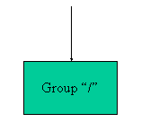
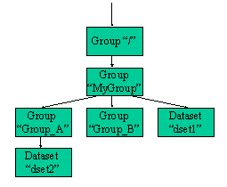

# 学习HDF5

<https://portal.hdfgroup.org/display/HDF5/Learning+HDF5>

## The HDF Group

For a quick introduction to HDF5 see the following:

  -----------------------------------------------------------------------------------------------------------------------------------
  [**Introduction to                                                                A very brief introduction to HDF5 and the HDF5
  HDF5**](https://portal.hdfgroup.org/display/HDF5/Introduction+to+HDF5)            programming model and APIs
  --------------------------------------------------------------------------------- -------------------------------------------------
  [**Learning HDF5 with                                                             A tutorial for learning how to use HDFView. NO
  HDFView**](https://portal.hdfgroup.org/display/HDF5/Learning+HDF5+with+HDFView)   programming involved!

  [**Learning the                                                                   Step by step instructions for learning HDF5 that
  Basics**](https://portal.hdfgroup.org/display/HDF5/Learning+the+Basics)           include programming examples
  -----------------------------------------------------------------------------------------------------------------------------------

For a quick introduction to HDF5 see the following:

  -----------------------------------------------------------------------------------------------------------------------------------
  [**Introduction to                                                                A very brief introduction to HDF5 and the HDF5
  HDF5**](https://portal.hdfgroup.org/display/HDF5/Introduction+to+HDF5)            programming model and APIs
  --------------------------------------------------------------------------------- -------------------------------------------------
  [**Learning HDF5 with                                                             A tutorial for learning how to use HDFView. NO
  HDFView**](https://portal.hdfgroup.org/display/HDF5/Learning+HDF5+with+HDFView)   programming involved!

  [**Learning the                                                                   Step by step instructions for learning HDF5 that
  Basics**](https://portal.hdfgroup.org/display/HDF5/Learning+the+Basics)           include programming examples
  -----------------------------------------------------------------------------------------------------------------------------------

These tutorials and examples are available for learning about the HDF5
High Level APIs, tools, Parallel HDF5, and the HDF5-1.10 VDS and SWMR
new features:

+---------------------+------------------------------------------------+
| [**Using the High   | [H5LT                                          |
| Level               | (Lite)](https://portal.hdfgroup.org/dis        |
| APIs**](https:      | play/HDF5/HDF5+Lite+%28H5LT%29+Interface)[H5IM |
| //portal.hdfgroup.o | (Image)](https://portal.hdfgroup.org/disp      |
| rg/display/HDF5/Int | lay/HDF5/HDF5+Image+%28H5IM%29+Interface)[H5TB |
| roduction+to+the+HD | (Table)](https://portal.hdfgroup.org/disp      |
| F5+High+Level+APIs) | lay/HDF5/HDF5+Table+%28H5TB%29+Interface)[H5PT |
|                     | (Packet                                        |
|                     | T                                              |
|                     | able)](https://portal.hdfgroup.org/display/HDF |
|                     | 5/HDF5+Packet+Table+%28H5PT%29+Interface)[H5DS |
|                     | (Dimension                                     |
|                     | Scale)](https://portal.hdfgroup.org/display/H  |
|                     | DF5/HDF5+Dimension+Scale+%28H5DS%29+Interface) |
+=====================+================================================+
| [**Introduction to  | A brief introduction to Parallel HDF5. If you  |
| Parallel            | are new to HDF5 please see the  topic first.   |
| HDF                 |                                                |
| 5**](https://portal |                                                |
| .hdfgroup.org/displ |                                                |
| ay/HDF5/Introductio |                                                |
| n+to+Parallel+HDF5) |                                                |
+---------------------+------------------------------------------------+
| **[Tools for        | [Learning HDF5 with                            |
| Viewing and Editing | HDFView](https://portal.hdfgrou                |
| HDF5                | p.org/display/HDF5/Learning+HDF5+with+HDFView) |
| Files](https://p    |                                                |
| ortal.hdfgroup.org/ | [Using the HDF5 Command-line                   |
| display/HDF5/Tools+ | Tools](https://portal.hdfgroup.org/d           |
| for+Viewing+and+Edi | isplay/HDF5/Using+the+HDF5+Command-line+Tools) |
| ting+HDF5+Files):** |                                                |
|                     | [Use Case - JPSS NPP                           |
|                     | Files](htt                                     |
|                     | ps://portal.hdfgroup.org/display/HDF5/USE+CASE |
|                     | %3A+Examining+a+JPSS+NPP+File+with+HDF5+tools) |
+---------------------+------------------------------------------------+
| **HDF5-1.10 New     | [Introduction to the Virtual Dataset -         |
| Features**          | VDS](https://portal.hdfgroup.org/display/HD    |
|                     | F5/Introduction+to+the+Virtual+Dataset++-+VDS) |
|                     |                                                |
|                     | [Introduction to Single-Writer/Multiple-Reader |
|                     | (SWMR)](https://portal.hdfgr                   |
|                     | oup.org/pages/viewpage.action?pageId=48812567) |
+---------------------+------------------------------------------------+
| [**Example          |                                                |
| Programs**          |                                                |
| ](https://portal.hd |                                                |
| fgroup.org/display/ |                                                |
| HDF5/HDF5+Examples) |                                                |
+---------------------+------------------------------------------------+
| **Videos**          | [Introduction to                               |
|                     | HDF5]                                          |
|                     | (https://www.youtube.com/watch?v=BAjsCldRMMc)\ |
|                     | [Parallel                                      |
|                     | HDF5                                           |
|                     | ](https://www.youtube.com/watch?v=qrI27pI0P1E) |
+---------------------+------------------------------------------------+

For more information, see the HDF5 User\'s Guide, Reference Manual and
other
[documentation](https://portal.hdfgroup.org/display/support/Documentation).

### Other {#other .标题3}

[NEON (National Ecological Observatory Network) HDF5
Tutorials](http://neondataskills.org/HDF5/)

[NERSC Online Tutorial: Introduction to Scientific I/O
(HDF5)](https://www.nersc.gov/users/training/online-tutorials/introduction-to-scientific-i-o/)

[HDF Workshops](http://hdfeos.org/workshops/index.php)

### Videos: {#videos .标题3}

[HDF5 is For Lovers](https://www.youtube.com/watch?v=Nzx0HAd3FiI)

[General Youtube search
for *hdf5* ](https://www.youtube.com/results?search_query=hdf5%22) (many
are regarding HDF5 software)

## HDF5文件组成

An HDF5 file is a container for storing a variety of scientific data and
is composed of two primary types of objects: [groups and
datasets.]{.mark}

-   **HDF5 group:** a grouping structure containing zero or more HDF5
    objects, together with supporting metadata

-   **HDF5 dataset:** a multidimensional array of data elements,
    together with supporting metadata

Any HDF5 group or dataset may have an associated attribute list. An
**HDF5 attribute** is a user-defined HDF5 structure that provides extra
information about an HDF5 object.

Working with groups and datasets is similar in many ways to working with
directories and files in UNIX. As with UNIX directories and files, an
HDF5 object in an HDF5 file is often referred to by its **full path
name** (also called an **absolute path name**).

/ signifies the root group.

/foo signifies a member of the root group called foo.

/foo/zoo signifies a member of the group foo, which in turn is a member
of the root group.

## HDF5 API

The HDF5 library provides several interfaces, or APIs. These APIs
provide routines for creating, accessing, and manipulating HDF5 files
and objects.

The library itself is implemented in C. To facilitate the work of
FORTRAN 90, C++ and Java programmers, HDF5 function wrappers have been
developed in each of these languages. This tutorial discusses the use of
the C functions and the FORTRAN wrappers.

All C routines in the HDF5 library begin with a prefix of the
form *H5*\*, where \* is one or two uppercase letters indicating the
type of object on which the function operates. The FORTRAN wrappers come
in the form of subroutines that begin with *h5* and end with *\_f*. The
APIs are listed below:

  --------------------------------------------------------------------------
  **H5**    Library Functions: general-purpose H5 functions
  --------- ----------------------------------------------------------------
  **H5A**   Annotation Interface: attribute access and manipulation routines

  **H5D**   Dataset Interface: dataset access and manipulation routines

  **H5E**   Error Interface: error handling routines

  **H5F**   File Interface: file access routines

  **H5G**   Group Interface: group creation and operation routines

  **H5I**   Identifier Interface: identifier routines

  **H5L**   Link Interface: link routines

  **H5O**   Object Interface: object routines

  **H5P**   Property List Interface: object property list manipulation
            routines

  **H5R**   Reference Interface: reference routines

  **H5S**   Dataspace Interface: dataspace definition and access routines

  **H5T**   Datatype Interface: datatype creation and manipulation routines

  **H5Z**   Compression Interface: compression routine(s)
  --------------------------------------------------------------------------

## HDF5编程

Keep the following in mind when looking at the example programs included
in this tutorial:

APIs vary with different languages

-   C routines begin with the prefix "H5\*" where \* is a single letter
    indicating the object on which the operation is to be performed:\
    File Interface: H5Fopen\
    Dataset Interface: H5Dopen

-   FORTRAN routines begin with "h5\*" and end with "\_f":\
    File Interface: h5fopen_f\
    Dataset Interface: h5dopen_f

-   APIS for languages like C++, Java, and Python use methods associated
    with specific objects.

HDF5 library has its own defined types

For portability, the HDF5 library has its own defined types. Some common
types that you will see in the example code are:

 hid_t is used for object handles

 hsize_t is used for dimensions

 herr_t** **is used for many return values

Language specific files must be included in applications

C: Add #include hdf5.h

FORTRAN: Add USE HDF5 and  call h5open_f and h5close_f to initialize and
close the HDF5 FORTRAN  interface

Python: Add import h5py / import numpy

## 创建一个[HDF5文件]{.mark}(HDF5 File)

An HDF5 file is a binary file containing scientific data and supporting
metadata.

To create an HDF5 file, an application must specify not only a file
name, but a file access mode, a file creation property list, and a file
access property list. These terms are described below:

### **File access mode:** {#file-access-mode .标题3}

When creating a file, the file access mode specifies the action to take
if the file already exists:

-   H5F_ACC_TRUNC specifies that if the file already exists, the current
    contents will be deleted so that the application can rewrite the
    file with new data.

-   H5F_ACC_EXCL specifies that the open will fail if the file already
    exists. If the file does not already exist, the file access
    parameter is ignored.

In either case, the application has both read and write access to the
successfully created file.

Note that there are two different access modes for opening existing
files:

-   H5F_ACC_RDONLY specifies that the application has read access but
    will not be allowed to write any data.

-   H5F_ACC_RDWR specifies that the application has read and write
    access.

### File creation property list: {#file-creation-property-list .标题3}

The file creation property list is used to control the file metadata.
File metadata contains information about the size of the user-block\*,
the size of various file data structures used by the HDF5 library, etc.
In this tutorial, the default file creation property list, H5P_DEFAULT,
is used.

\*The user-block is a fixed-length block of data located at the
beginning of the file which is ignored by the HDF5 library. The
user-block may be used to store any data or information found to be
useful to applications.

### File access property list: {#file-access-property-list .标题3}

The file access property list is used to control different methods of
performing I/O on files. It also can be used to control how a file is
closed (whether or not to delay the actual file close until all objects
in a file are closed). The default file access property
list, H5P_DEFAULT, is used in this tutorial.

Please refer to the *H5F* section of the *HDF5 Users\'
Guide* and *Reference Manual* for detailed information regarding file
access/creation property lists and access modes.

The steps to create and close an HDF5 file are as follows:

1.  Specify the file creation and access property lists, if necessary.

2.  Create the file.

3.  Close the file, and if necessary, close the property lists.

### Programming Example {#programming-example .标题3}

[Description]{.underline}

The following example code demonstrates how to create and close an HDF5
file.

C:

#include \"hdf5.h\"

#define FILE \"file.h5\"

int main() {

hid_t file_id; /\* file identifier \*/

herr_t status;

/\* Create a new file using default properties. \*/

file_id = H5Fcreate(FILE, H5F_ACC_TRUNC, H5P_DEFAULT, H5P_DEFAULT);

/\* Terminate access to the file. \*/

status = H5Fclose(file_id);

}

[Fortran 90:]{.mark}

PROGRAM FILEEXAMPLE

USE HDF5 ! This module contains all necessary modules

IMPLICIT NONE

CHARACTER(LEN=8), PARAMETER :: filename = \"filef.h5\" ! File name

INTEGER(HID_T) :: file_id ! File identifier

INTEGER :: error ! Error flag

!

! Initialize FORTRAN interface.

!

CALL h5open_f (error)

!

! Create a new file using default properties.

!

CALL h5fcreate_f(filename, H5F_ACC_TRUNC_F, file_id, error)

!

! Terminate access to the file.

!

CALL h5fclose_f(file_id, error)

!

! Close FORTRAN interface.

!

CALL h5close_f(error)

END PROGRAM FILEEXAMPLE

See [HDF5 Introductory
Examples](https://portal.hdfgroup.org/display/HDF5/Examples+from+Learning+the+Basics) for
the examples used in the Learning the Basics tutorial.

For details on compiling an HDF5 application[: \[ [Compile
Information](https://portal.hdfgroup.org/display/HDF5/Compiling+HDF5+Applications) \]]{.mark}

### 编译HDF5应用程序 {#编译hdf5应用程序 .标题3}

https://portal.hdfgroup.org/display/HDF5/Compiling+HDF5+Applications

### Remarks {#remarks .标题3}

**In C:** The include file hdf5.h contains definitions and declarations
and must be included in any program that uses the HDF5 library.

**In FORTRAN:** The module HDF5 contains definitions and declarations
and must be used in any program that uses the HDF5 library. Also note
that [H5_OPEN](https://portal.hdfgroup.org/display/HDF5/H5_OPEN) MUST be
called at the beginning of an HDF5 Fortran application (prior to any
HDF5 calls) to initialize the library and variables.
The [H5_CLOSE](https://portal.hdfgroup.org/display/HDF5/H5_CLOSE) call
MUST be at the end of the HDF5 Fortran application.

-   [H5F_CREATE](https://portal.hdfgroup.org/display/HDF5/H5F_CREATE) creates
    an HDF5 file and returns the file identifier.\
    For Fortran, the file creation property list and file access
    property list are optional. They can be omitted if the default
    values are to be used.

The root group is automatically created when a file is created. Every
file has a root group and the path name of the root group is always /.

[H5F_CLOSE](https://portal.hdfgroup.org/display/HDF5/H5F_CLOSE) terminates
access to an HDF5 file.\
When an HDF5 file is no longer accessed by a
program, [H5F_CLOSE](https://portal.hdfgroup.org/display/HDF5/H5F_CLOSE) must
be called to release the resources used by the file. This call is
mandatory.\
Note that
if [H5F_CLOSE](https://portal.hdfgroup.org/display/HDF5/H5F_CLOSE) is
called for a file, but one or more objects within the file remain open,
those objects will remain accessible until they are individually closed.
This can cause access problems for other users, if objects were
inadvertently left open. A File Access property controls how the file is
closed.

[File Contents]{.underline}

The HDF Group has developed tools for examining the contents of HDF5
files. The tool used throughout the HDF5 tutorial is the HDF5
dumper, h5dump, which displays the file contents in human-readable form.
The output of h5dump is an ASCII display formatted according to the HDF5
DDL grammar. This grammar is defined, using Backus-Naur Form, in the DDL
in BNF for HDF5.

To view the HDF5 file contents, simply type:

h5dump \<filename\>

Figure 4.1 describes the file contents of file.h5 (filef.h5) using a
directed graph.

**Fig. 4.1**   Contents of file.h5 (filef.h5)

{width="1.6319444444444444in"
height="1.5208333333333333in"}

Figure 4.2 is the text description of file.h5, as generated by h5dump.
The HDF5 file called file.h5 contains a group called /, or the *root
group*. (The file called filef.h5, created by the FORTRAN version of the
example, has the same output except that the filename shown
is filef.h5.)

**Fig. 4.2** file.h5 in DDL

HDF5 \"file.h5\" {

GROUP \"/\" {

}

}

[File Definition in DDL]{.underline}

Figure 4.3 is the simplified DDL file definition for creating an HDF5
file. For simplicity, a simplified DDL is used in this tutorial. A
complete and more rigorous DDL can be found in the *DDL in BNF for
HDF5*, a section of the *HDF5 User\'s Guide*.

**Fig. 4.3**   *HDF5 File Definition*

The following symbol definitions are used in the DDL:

::= defined as

\<tname\> a token with the name *tname*

\<a\> \| \<b\> one of \<a\> or \<b\>

\<a\>\* zero or more occurrences of \<a\>

The simplified DDL for file definition is as follows:

\<file\> ::= HDF5 \"\<file_name\>\" { \<root_group\> }

\<root_group\> ::= GROUP \"/\" { \<group_attribute\>\*

\<group_member\>\* }

\<group_attribute\> ::= \<attribute\>

\<group_member\> ::= \<group\> \| \<dataset\>

## 创建一个数据集(Dataset)

https://portal.hdfgroup.org/display/HDF5/Creating+a+Dataset

A dataset is a multidimensional array of data elements, together with
supporting metadata. To create a dataset, the application program must
specify the location at which to create the dataset, the dataset name,
the datatype and dataspace of the data array, and the property lists.

### Datatypes {#datatypes .标题3}

A datatype is a collection of properties, all of which can be stored on
disk, and which, when taken as a whole, provide complete information for
data conversion to or from that datatype.

There are two categories of datatypes in HDF5:

-   **Pre-defined:**   These datatypes are opened and closed by HDF5.

Pre-defined datatypes can be atomic or composite:

-   Atomic datatypes cannot be decomposed into smaller datatype units at
    the API level. For example: integer, float, reference, string.

-   Composite datatypes are aggregations of one or more datatypes. For
    example: array, variable length, enumeration, compound.

```{=html}
<!-- -->
```
-   **Derived:**   These datatypes are created or derived from the
    pre-defined types

。。。。。。。。

## 从一个数据集读取和写入

https://portal.hdfgroup.org/display/HDF5/Reading+From+and+Writing+To+a+Dataset

During a dataset I/O operation, the library transfers raw data between
memory and the file. The data in memory can have a datatype different
from that of the file and can also be of a different size (i.e., the
data in memory is a subset of the dataset elements, or vice versa).
Therefore, to perform read or write operations, the application program
must specify:

» The dataset

» The dataset\'s datatype in memory

» The dataset\'s dataspace in memory

» The dataset\'s dataspace in the file

» The dataset transfer property list

(The dataset transfer property list controls various aspects of the I/O
operations, such as the number of processes participating in a
collective I/O request or hints to the library to control caching of raw
data. In this tutorial, we use the default dataset transfer property
list.)

» The data buffer

The steps to read from or write to a dataset are as follows:

1.  Obtain the dataset identifier.

2.  Specify the memory datatype.

3.  Specify the memory dataspace.

4.  Specify the file dataspace.

5.  Specify the transfer properties.

6.  Perform the desired operation on the dataset.

7.  Close the dataset.

8.  Close the dataspace, datatype, and property list if necessary.

To read from or write to a dataset,
the [H5D_READ](https://portal.hdfgroup.org/display/HDF5/H5D_READ)  and
[H5D_WRITE](https://portal.hdfgroup.org/display/HDF5/H5D_WRITE) routines
are used.

[Remarks]{.underline}

[H5F_OPEN](https://portal.hdfgroup.org/display/HDF5/H5F_OPEN) opens an
existing file and returns a file identifier.

[H5D_OPEN](https://portal.hdfgroup.org/display/HDF5/H5D_OPEN) opens an
existing dataset with the specified name and location.

[H5D_WRITE](https://portal.hdfgroup.org/display/HDF5/H5D_WRITE) writes
raw data from an application buffer to the specified dataset, converting
from the datatype and dataspace of the dataset in memory to the datatype
and dataspace of the dataset in the file. Specifying H5S_ALL for both
the memory and file dataspaces indicates that the entire dataspace of
the dataset is to be written to. H5S_ALL by itself does not necessarily
have this meaning. See the Reference Manual entry for H5Dwrite for more
information on using H5S_ALL.

[H5D_READ](https://portal.hdfgroup.org/display/HDF5/H5D_READ) reads raw
data from the specified dataset to an application buffer, converting
from the file datatype and dataspace to the memory datatype and
dataspace. Specifying H5S_ALL for both the memory and file dataspaces
indicates that the entire dataspace of the dataset is to be
read. H5S_ALL by itself does not necessarily have this meaning. See the
Reference Manual entry for H5Dread for more information on
using H5S_ALL.

。。。。。。。

## 创建一个属性(Attribute)

https://portal.hdfgroup.org/display/HDF5/Creating+an+Attribute

Attributes are small datasets that can be used to describe the nature
and/or the intended usage of the object they are attached to. In this
section, we show how to create, read, and write an attribute.

### Creating an attribute {#creating-an-attribute .标题3}

Creating an attribute is similar to creating a dataset. To create an
attribute, the application must specify the object which the attribute
is attached to, the datatype and dataspace of the attribute data, and
the attribute creation property list.

The steps to create an attribute are as follows:

1\. Obtain the object identifier that the attribute is to be attached
to.

2\. Define the characteristics of the attribute and specify the
attribute creation property list.

A.  Define the datatype.

B.  Define the dataspace.

C.  Specify the attribute creation property list.

3\. Create the attribute.

4\. Close the attribute and datatype, dataspace, and attribute creation
property list, if necessary.

To create and close an attribute, the calling program must use
 [H5A_CREATE](https://portal.hdfgroup.org/display/HDF5/H5A_CREATE)  and 
[H5A_CLOSE](https://portal.hdfgroup.org/display/HDF5/H5A_CLOSE). For
example:

### Reading/Writing an attribute {#readingwriting-an-attribute .标题3}

Attributes may only be read or written as an entire object; no partial
I/O is supported. Therefore, to perform I/O operations on an attribute,
the application needs only to specify the attribute and the attribute\'s
memory datatype.

The steps to read or write an attribute are as follows.

1\. Obtain the attribute identifier.

2\. Specify the attribute\'s memory datatype.

3\. Perform the desired operation.

4\. Close the memory datatype if necessary.

To read and/or write an attribute, the calling program must contain
the [H5A_READ](https://portal.hdfgroup.org/display/HDF5/H5A_READ) and/or [H5A_WRITE](https://portal.hdfgroup.org/display/HDF5/H5A_WRITE) routines.
For example:

。。。。。。。。。。。。

## 创建一个组(Group)

An HDF5 group is a structure containing zero or more HDF5 objects. The
two primary HDF5 objects are groups and datasets. To create a group, the
calling program must:

1\. Obtain the location identifier where the group is to be created.

2\. Create the group.

3\. Close the group.

To create a group, the calling program must
call [[H5G_CREATE]{.underline}](https://portal.hdfgroup.org/display/HDF5/H5G_CREATE).\
To close the
group, [[H5G_CLOSE]{.underline}](https://portal.hdfgroup.org/display/HDF5/H5G_CLOSE) must
be called. The close call is mandatory.

For example:

C:

group_id = H5Gcreate(file_id, \"/MyGroup\", H5P_DEFAULT, H5P_DEFAULT,
H5P_DEFAULT);

status = H5Gclose (group_id);

FORTRAN:

CALL h5gcreate_f (loc_id, name, group_id, error)

CALL h5gclose_f (group_id, error)

### Programming Example {#programming-example-1 .标题3}

Description

See [HDF5 Introductory
Examples](https://portal.hdfgroup.org/display/HDF5/Examples+from+Learning+the+Basics) for
the examples used in the Learning the Basics tutorial.

The example shows how to create and close a group. It creates a file
called group.h5 (groupf.h5 for FORTRAN), creates a group
called MyGroup in the root group, and then closes the group and file.

For details on compiling an HDF5 application: \[ [Compiling HDF5
Applications](https://portal.hdfgroup.org/display/HDF5/Compiling+HDF5+Applications) \]

### File Contents {#file-contents .标题3}

The contents of group.h5 and the definition of the group are shown
below. (The FORTRAN program creates the HDF5 file groupf.h5 and the
resulting DDL shows groupf.h5 in the first line.)

+-------------------------------------+---+-----------------------------+
| **Fig. 8.1**   *The Contents        |   | **Fig. 8.2**   *group.h5 in |
| of group.h5.*                       |   | DDL*                        |
+=====================================+===+=============================+
| {width="1.0138888888888888in" |   |                             |
| height="1.4802777777777778in"}      |   | GROUP \"MyGroup\" {         |
|                                     |   |                             |
|                                     |   | }                           |
|                                     |   |                             |
|                                     |   | }                           |
|                                     |   |                             |
|                                     |   | }                           |
+-------------------------------------+---+-----------------------------+

## 使用绝对和相对名称创建组

https://portal.hdfgroup.org/display/HDF5/Creating+Groups+using+Absolute+and+Relative+Names

## 在组中创建数据集

https://portal.hdfgroup.org/display/HDF5/Creating+Datasets+in+Groups

We have shown how to create groups, datasets, and attributes. In this
section, we show how to create datasets in groups. Recall
that [[H5D_CREATE]{.underline}](https://portal.hdfgroup.org/display/HDF5/H5D_CREATE) creates
a dataset at the location specified by a location identifier and a name.
Similar
to [[H5G_CREATE]{.underline}](https://portal.hdfgroup.org/display/HDF5/H5G_CREATE), the
location identifier can be a file identifier or a group identifier and
the name can be relative or absolute. The location identifier and the
name together determine the location where the dataset is to be created.
If the location identifier and name refer to a group, then the dataset
is created in that group.

### Programming Example {#programming-example-2 .标题3}

Description

See [[HDF5 Introductory
Examples]{.underline}](https://portal.hdfgroup.org/display/HDF5/Examples+from+Learning+the+Basics) for
the examples used in the Learning the Basics tutorial.

The example shows how to create a dataset in a particular group. It
opens the file created in the previous example and creates two datasets:

For details on compiling an HDF5 application: \[ [[Compiling HDF5
Applications]{.underline}](https://portal.hdfgroup.org/display/HDF5/Compiling+HDF5+Applications) \]

[File Contents]{.underline}

**Fig. 10.1** The Contents of groups.h5 (groupsf.h5 for FORTRAN)

{width="2.6527777777777777in"
height="2.1875in"}

**Fig. 10.2a** *groups.h5 in DDL*

# Parallel HDF5 (PHDF5)设计概览

<https://portal.hdfgroup.org/display/HDF5/Introduction+to+Parallel+HDF5>

There were several requirements that we had for Parallel HDF5 (PHDF5).
These were:

-   Parallel HDF5 files had to be compatible with serial HDF5 files and
    sharable between different serial and parallel platforms.

-   Parallel HDF5 had to be designed to have a single file image to all
    processes, rather than having one file per process. Having one file
    per process can cause expensive post processing, and the files are
    not usable by different processes.

-   A standard parallel I/O interface had to be portable to different
    platforms.

With these requirements of HDF5 our initial target was to support MPI
programming, but not for shared memory programming. We had done some
experimentation with thread-safe support for Pthreads and for OpenMP,
and decided to use these.

Implementation requirements were to:

-   Not use Threads, since they were not commonly supported in 1998 when
    we were looking at this.

-   Not have a reserved process, as this might interfere with parallel
    algorithms.

-   Not spawn any processes, as this is not even commonly supported now.
