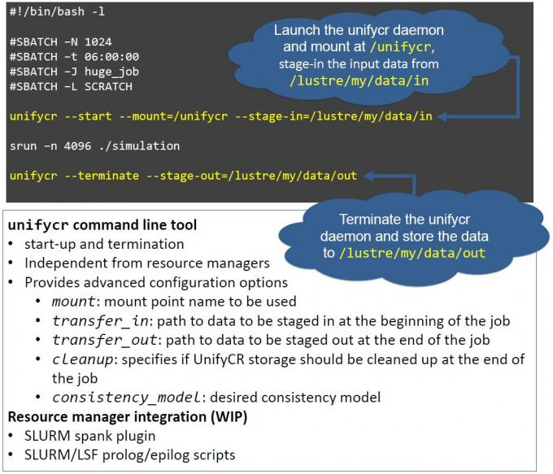
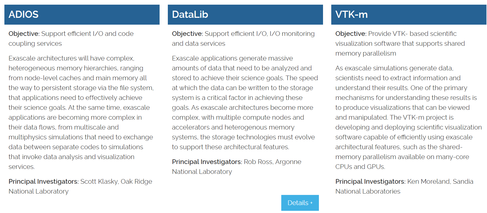
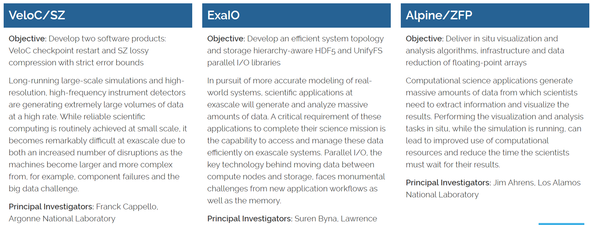

# ExaIO

In pursuit of more accurate real-world systems modeling, scientific
applications at exascale will generate and analyze massive amounts of
data. One critical requirement for these applications to be able to
complete their science mission is the capability to access and manage
these data efficiently on exascale systems. Parallel I/O, the key
technology behind moving data between compute nodes and storage, faces
monumental challenges from new application workflows, as well as the
memory, interconnect, and storage architectures considered in the
designs of exascale systems. The ExaIO project is delivering the
Hierarchical Data Format version 5 (HDF5) library and the UnifyFS file
system to efficiently address these storage challenges.

## Project Details

In the future, parallel I/O libraries and file systems must be able to
handle file sizes of many terabytes and I/O performance much greater
than what is currently achievable to satisfy the storage requirement of
exascale applications and enable them to achieve their science goals. As
the storage hierarchy expands to include node-local persistent memory,
solid-state storage, and traditional disk and tape-based storage, data
movement among these layers must become much more efficient and capable.
The ExaIO project is addressing these parallel I/O performance and data
management challenges by enhancing the HDF5 library and developing
UnifyFS to use exascale storage devices.

HDF5 is the most popular high-level I/O library for scientific
applications to write and read data files at supercomputing facilities,
and it has been used by numerous applications. The ExaIO team is
developing various HDF5 features to address efficiency and other
challenges posed by data management and parallel I/O on exascale
architectures. The ExaIO team is productizing HDF5 features and
techniques that were previously prototyped, exploring optimizations on
upcoming architectures, and maintaining and optimizing existing HDF5
features tailored for the exascale applications. They are also adding
new features, including transparent data caching in the multilevel
storage hierarchy, topology-aware I/O-related data movement, full
single-writer and multi-reader for workflows, asynchronous I/O, and I/O
from accelerator processors (i.e., GPUs).

The ExaIO team is developing [UnifyFS]{.mark}, a user-level file system
highly specialized for shared file access on high-performance systems
with distributed node-local storage. Although distributed node-local
storage offers significant performance advantages, it is extremely
challenging to use it for applications that operate on shared files.
UnifyFS creates a shared file system namespace across the distributed
storage devices in a job, greatly simplifying their use. Thus, UnifyFS
addresses a major usability factor of pre-exascale and exascale systems.
UnifyFS transparently intercepts I/O calls from applications and I/O
libraries, allowing UnifyFS to be cleanly integrated with applications
and other software, including I/O and checkpoint/restart libraries.

## Principal Investigator(s):

Suren Byna, Lawrence Berkeley National Laboratory

## Collaborators:

Lawrence Berkeley National Laboratory, Lawrence Livermore National
Laboratory, Oak Ridge National Laboratory, Argonne National Laboratory,
the HDF Group

## Progress to date

The ExaIO team has improved the HDF5 library in terms of performance and
The team developed the Virtual Object Layer (VOL) feature to open the
HDF5 applications performance interface (API) and developed several
optimizations to improve HDF5 performance. These optimizations include
the ability to stage the data in a temporary fast storage location, such
as burst buffer, and move the data to the desired final destination
asynchronously; a caching VOL connector to use multiple levels of memory
and storage devices; and a capability that enables a single writing
process to update an HDF5 file while multiple reading processes access
the file in a concurrent, lock-free manner. The team also demonstrated
the benefits of moving data between GPU accelerators and storage
asynchronously. The HDF5 team actively works with several ECP
applications (e.g., EQSIM, ExaSky, ExaStar, QMCPACK, WarpX) to integrate
HDF5 API and apply performance optimizations.

The team fully redesigned and implemented the UnifyFS internals,
resulting in 3.5× faster read performance. The team replaced the
previous metadata management infrastructure with new local and global
structures for fast access to file information and completely removed
the dependence on message passing interface (MPI) for portability. The
team also extensively tested and validated its support for HDF5
(parallel and serial) and MPI-IO applications.

## 参考文献

ExaHDF5: Delivering Efficient Parallel I/O on Exascale Computing Systems

HDF5 Cache VOL: Efficient and Scalable Parallel I/O through Caching Data
on Node-local Storage

https://www.exascaleproject.org/research-project/exaio/

https://exascale.llnl.gov/

# Unify:

Unify: Distributed Burst Buffer File System

Fast, scalable I/O performance over distributed storage

Hierarchical storage systems are the wave of the future for high
performance computing (HPC) centers like LLNL's Livermore Computing
Complex. The Unify project aims to improve I/O performance by utilizing
distributed, node-local storage systems. This design scales bandwidth
and capacity according to the computer resources used by a given job.
Furthermore, Unify avoids inter-job interference from parallel file
systems or shared burst buffers.

Unify is a suite of specialized, flexible file systems---the first is
available on GitHub with more on the way---that can be included in a
user's job allocations. A user can request which Unify file system(s) to
be loaded and the respective mount points. Tests on LLNL's [Catalyst
cluster](https://hpc.llnl.gov/hardware/platforms/catalyst) show more
than 2x improvement in write performance.

{width="5.314753937007874in"
height="4.5566185476815395in"}

***Figure:*** UnifyFS supports checkpoint/restart workloads. Like all
current and future Unify file systems, UnifyFS is launched at the
beginning of a batch job. Additional information about UnifyFS
configuration can be found on Read the Docs, linked below. (Click to
enlarge.)

https://computing.llnl.gov/projects/unify

# 可视化

https://www.exascaleproject.org/research-group/data-and-visualization/

{width="5.354429133858268in"
height="2.3493700787401575in"}

{width="5.3976585739282585in"
height="2.0568613298337706in"}
