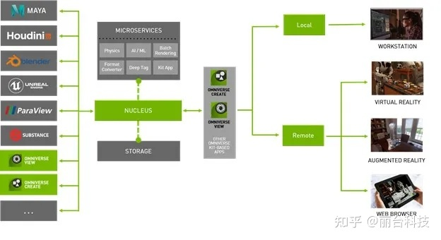

# Omniverse再添新插件，全新ParaView Connector加速HPC可视化进程

研究人员越来越多地依靠科学可视化来分析、理解和获取科学洞察，以帮助大家了解最新的威胁（如新冠疫情），或是展望未来人类登陆火星。

由于大规模模拟会产生几十甚至几百TB的数据，而且团队成员分散在全球各地，因此研究人员需要一些工具来增强可视化，同时还能够确保他们在不同的高性能计算系统环境下同时工作。

通过**NVIDIA
Omniverse**实时协作平台，用户可以在他们首选的内容创建和可视化应用上以通用场景描述（USD）格式共享2D和3D模拟数据。全球团队可以使用**Omniverse**通过实时连接查看、更新同一数据集并与该数据集进行交互，从而实现真正的交互式协作。

Omniverse ParaView Connector即将推出

该平台经过扩展后已能够满足科学可视化社区的需求，而且，目前还加入了一个可与全球热门科学可视化应用ParaView连接的连接器。研究人员可以在其本地工作站或HPC系统上使用ParaView来分析各个领域的大型数据集，包括天体物理学、气候和天气、流体动力学以及结构分析。

这款在2021年GTC大会上发布的**Omniverse ParaView
Connector**即将推出，研究人员可以通过它来提高产能、加快研究速度。他们不再需要下载和交换大型数据集，同时也可以获得即时反馈------这一切都要归功于**Omniverse**可以让用户在云端的同一工作空间中工作。

{width="4.522084426946631in"
height="2.463826552930884in"}

NVIDIA Omniverse流水线

用户可以通过各种应用连接器（包括ParaView
Connector）将其USD格式数据上传到Omniverse
Nucleus数据库。之后，客户只要连接Omniverse Kit就能获得：

**逼真的视觉效果：**用户可以通过**Omniverse**平台组件（如**Omniverse RTX
Renderer**）使用各种**NVIDIA**核心技术，如实时光线追踪、逼真的素材、景深以及高级照明和阴影。这使研究人员能够更好将其模拟结果可视化，从而获得更深入的洞察。

**高端可视化工具访问：Omniverse**用户可以通过各种主流应用（如SideFX
Houdini、Autodesk Maya和NVIDIA
IndeX）打开USD文件并进行互动。请查看文件了解如何与**Omniverse**中的各种应用进行交互，从而最大程度地利用分析。

**规模化的交互：**每次通过批量渲染来分析数据集的一个部分十分耗时。传统的应用速度太慢，无法实时渲染光线追踪、柔和阴影和景深等功能，而这些功能正是快速、不间断分析所必需的。现在用户能够以原始分辨率直观地与整个数据集进行高帧率交互，从而加快研究速度。

**NVIDIA
IndeX**为大型体积数据提供交互式可视化功能，让用户能够实时放大任何时间步长的最小细节。通过即将登陆**Omniverse**的IndeX，用户将能够运用这两种技术进行更好、更快的科学分析。这场GTC分会将介绍当IndeX连接到**Omniverse**时，可以为研究人员带来什么好处。

{width="5.225902230971129in"
height="3.2071839457567806in"}

在Omniverse中使用 NVIDIA
IndeX实现火星登陆器的可视化。模拟数据由NASA提供。

**实时协作：Omniverse**无需在不同系统上下载数据，大幅简化了工作流程。此外，它还可以让不同系统上的研究人员同时对同一数据进行可视化、分析和修改，从而提高他们的工作效率。

**为科学出版物创造电影视觉效果：**宣传推广是科学出版物的重要环节。通过**Omniverse**平台上的高端渲染工具，研究人员和艺术家可以实时互动，将他们的作品转化为便于广大观众理解的电影视觉效果。
