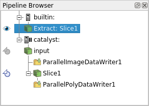

# Introduction to ParaView Catalyst Live(2014)

[[https://blog.kitware.com/introduction-to-paraview-catalyst-live/]{.underline}](https://blog.kitware.com/introduction-to-paraview-catalyst-live/)

[[ParaView Catalyst]{.underline}](http://catalyst.paraview.org/) is a
library that adds ParaView analysis and visualization capabilities to a
simulation program. For each time step, the simulation code generates
data which is passed (using [[Catalyst's
API]{.underline}](http://catalyst.paraview.org/)) to a ParaView
pipeline. This pipeline generates images or processed data that can be
saved to disk.

Furthermore, data can be exchanged with a remote ParaView server
enabling easy inspection of simulation status and modification of
analysis and visualization parameters. We call this connection [ParaView
Catalyst Live.]{.mark}

The goal of this post is to enable you to try out Catalyst Live and
introduce its main features. First, we invite you to watch a video which
introduces the example presented next.

[[Introduction to Paraview Catalyst
Live]{.underline}](https://vimeo.com/107165598) from
[[Kitware]{.underline}](https://vimeo.com/kitware) on
[[Vimeo]{.underline}](https://vimeo.com/).

To be able to run the example presented, you need to download a
[[repository
version]{.underline}](http://www.paraview.org/Wiki/ParaView/Git) of
ParaView, configure it with [PARAVIEW_ENABLE_CATALYST and
PARAVIEW_ENABLE_PYTHON]{.mark} and compile it (see the [[ParaView Build
and Install
Wiki]{.underline}](http://www.paraview.org/Wiki/ParaView:Build_And_Install)
for more information). Optionally, you can also enable PARAVIEW_USE_MPI
if you want to run coprocessing or ParaView in parallel.

You also need two scripts: driver.py and coprocessing-pipeline.py which
are attached to this blog post. driver.py plays the role of a simulation
process which generates at each time step a wavelet with a
different parameters (see ParaView's Sources/Wavelet menu).
coprocessing-pipeline.py processes this data by running a contour
filter, saving both the wavelet and the contour as data files, saving an
image showing the contour and enabling Catalyst Live communication. This
second script was generated using the [[Catalyst Script Generator
Plugin]{.underline}](http://www.paraview.org/Wiki/images/4/48/CatalystUsersGuide.pdf)
(for ParaView 4.1 and earlier it was called the CoProcessing Script
Generator Plugin).

With these, you are ready to try out Catalyst Live. Note that all
commands shown are relative to ParaView's build directory. First
download the two scripts in a directory (assume it is called
Catalyst-test) and start the driver and the coprocessing pipeline:

[bin/pvbatch \~/Catalyst-test/driver.py coprocessing-pipeline.py
1000]{.mark}

Here we run the driver for 1,000 time steps and we pass the coprocessing
pipeline script as a parameter. Then, start ParaView and connect to
Catallyst using Catalyst \> Connect menu. The Pipeline Browser displays
two servers, the builtin server and the catalyst server. Note that next
to the catalyst server there is a 'play' icon showing that the
simulation is running.

{width="2.3224376640419946in"
height="1.8524289151356081in"}

The two grayed out icons next to PVTrivialProducer0 and Contour0 allow
you to extract data from Catalyst, transfer it, and visualize it on
Catalyst Live. Care must be exercised when clicking on the extract icons
as data you request to be transfered may be very big (for real
simulations). When you click on the extract icon next the the Contour0
data is added as a source to the builtin server. This data can be
visualized by clicking on the eye icon next to it.

{width="3.5051082677165355in"
height="3.272516404199475in"}

A user can do the following operations:

-   Modify any visualization pipeline or writer parameters. Note that
    pipeline elements cannot be added or removed in the current version
    and we provide only generic writer parameters such as file name and
    writing frequency.

-   Pause a simulation using Catalyst \> Pause Simulation and continue
    it using Catalyst \> Continue. If a simulation is paused, a 'pause'
    icon will be displayed next to the catalyst server.

-   Pause the simulation at a certain time step in the future using
    Catalyst \> Set Breakpoint or remove a previously set breakpoint
    using Catalyst \> Remove Breakpoint. If a breakpoint is set, a red
    circle is displayed next to the catalyst server.

While a simulation is paused, the user can fully interact with
simulation data by changing visualization pipeline parameters.

If you compiled ParaView with PARAVIEW_USE_MPI you can run both Catalyst
and Paraview in parallel:

[mpiexec -np 5 bin/pvbatch -sym \~/Catalyst-test/driver.py
coprocessing-pipeline.py 1000]{.mark}

runs the driver and the coprocessing pipeline on 5 processors

[mpiexec -np 2 bin/pvserver]{.mark}

runs ParaView server on 2 processors

[bin/paraview -url=cs://your-computer-name:11111]{.mark}

runs the ParaView client and connects it to the ParaView server you just
started. Everything else behaves the same as in the serial run.

With this, we end our introduction to ParaView Catalyst Live and invite
you to try it out. It is part of the ParaView 4.2 release.

## Update 2017/11/03

The files in the post are now used for testing and are available in the
ParaView source code.  Search the source code for the driver
CatalystWaveletDriver.py and the coprocessing pipeline
CatalystWaveletCoprocessing.py. You can use these files as described in
the post or you can run the associated ParaView tests: ctest -R
CatalystLive. Make sure you compile ParaView with BUILD_TESTING,
PARAVIEW_USE_MPI and PARAVIEW_ENABLE_PYTHON.

# [[How to try out Catalyst]{.underline}](https://discourse.paraview.org/t/how-to-try-out-catalyst/4213) 

[[https://discourse.paraview.org/t/how-to-try-out-catalyst/4213]{.underline}](https://discourse.paraview.org/t/how-to-try-out-catalyst/4213)

**EDIT: since ParaView 5.9, Catalyst was refactored and the following
may not be relevant anymore**

Catalyst is the part of the ParaView framework dedicated to the in-situ
analysis, i.e. the processing of data on the simulation side, at the
time of the simulation.

Catalyst allows minimal modification on the simulation code (4 lines of
codes are enough once linked to a Catalyst Adaptor !) and modifying the
processing pipeline does not require any programmatic knowledge.
Simulation code in python, C, C++ and fortran are supported (in fact,
any language that can use a C interface)

# Architecture of a Catalyst Project

-   at one side, your simulation code

-   at the other side, the ParaView framework (see Catalyst Editions)

-   between them, the Catalyst Adaptor : a thin interface to manage
    communication between simulation and paraview

-   optionally, but very likely, a python script to configure the
    paraview pipeline.

# The Adaptor

Has two roles:

-   it runs a ParaView pipeline, through a vtkCPProcessor object. The
    easiest way to initialize this pipeline is to use a python script
    exported from ParaView. During the update step, the adaptor should
    set a VTK Object as the pipeline input data.

-   (optionally) it converts your simulation data to a VTK Object(s)
    (zero-copy most of the time).\
    This object will be the input of a ParaView processing pipeline

# Example : python simulation and Live Visualization

## Setup

Download ParaView 5.8 and the PythonFullExample [[post release 5.8
29]{.underline}](https://gitlab.kitware.com/paraview/paraview/-/tree/48c0c9696efe0f948c6effe600377cb250ddb5fb/Examples/Catalyst/PythonFullExample)

-   fedatastructure.py : simulation internal code: does not know about
    catalyst

-   fedriver.py : simulation code, containing the main loop : call the
    adaptor

-   coprocessor.py : the adaptor, called by the driver and initialized
    with a pipeline script.

-   cpscript.py : a pipeline script, exported by ParaView.

To enable the LiveVisualization, modify cpscript.py (line 56) :

coprocessor.EnableLiveVisualization(True, 1)

## Run

Launch ParaView. Go to the Catalyst menu and click connect. A pop up
raises, asking for a port connection. Validate with the default 22222
value. Another pop should say that ParaView is now waiting for a
connection.

A new server appears in the pipeline browser, named 'catalyst'.

(1){width="2.28125in"
height="1.1145833333333333in"}

**hint** : check Catalyst/Pause Simulation. As the demo is quite short,
it is useful to pause before the connection happens.

Now you are ready to launch the simulation !

\$ ./bin/pvbatch
ParaView-v5.8.0/Examples/Catalyst/PythonFullExample/fedriver.py
ParaView-v5.7.0/Examples/Catalyst/PythonFullExample/cpscript.py

Now new sources has appeared in the pipeline browser (2). Note that to
preserve your computer memory (and network) only metadata has been
transferred.\
(2){width="2.28125in" height="1.625in"}
(3){width="2.28125in" height="1.625in"}

Click on the icon left to it in order to fetch the actual data (3), and
be able to display it in ParaView (4)(don't forget to click on the eye
to set the visibility !)\
(4)

{width="4.66282261592301in"
height="3.515768810148731in"}

The simulation is still paused here.\
You can now unpause it via the same menu (Catalyst / run) and see your
simulation data being updated on the screen ! (5)\
(5) {width="2.8125in"
height="2.4791666666666665in"}\
**hint** : in this example, one time step is quite quick so maybe the
visualization will jump and drop some of the timesteps ... don't
hesitate to modify the code !

The simulation ends and stop the communication. A message box pops in
ParaView and the catalyst part of the pipeline is removed. But the
extracted data is still here !

## Configure the pipeline

You can try replacing the cpscript.py by your own exported from
ParaView.\
First load a representative dataset, i.e. a dataset with the format
(structured grid, polydata ...) and data arrays named as in the
simulation. In our example you can load the fullgrid_0.pvti created by
the previous run. Then set up the pipeline you want. (6)\
(6) {width="2.21875in" height="3.1875in"}

Click on the Catalyst/Define Export menu to open the Export Inspector.
Here you can select a writer for your source, take screenshots and
enable others live visualization (7a). Writers can be configured (7b).

(7a) {width="2.6770833333333335in"
height="2.0520833333333335in"} (7b)
{width="2.292869641294838in"
height="1.6729451006124234in"}\
Save the script with Catalyst/Export script.

You can re run the simulation with your new script !\
(8)

{width="4.4327362204724405in"
height="2.9209930008748906in"}
