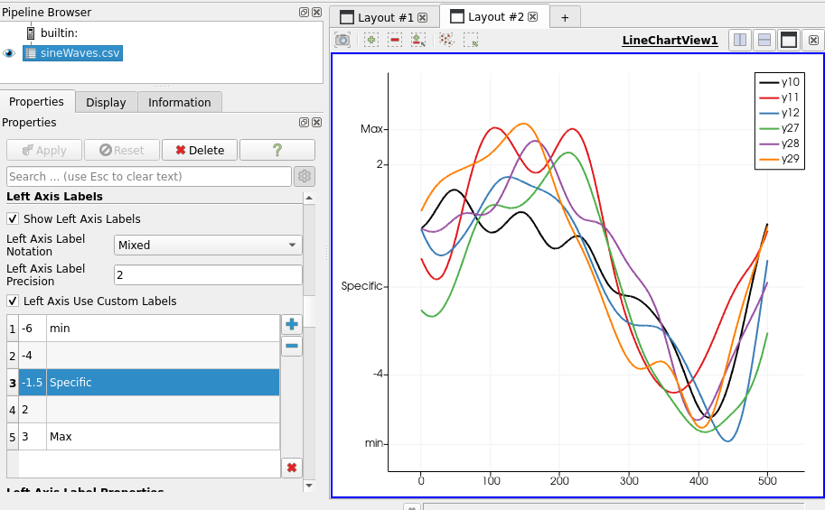

# 关于ParaView

ParaView is an open-source, multi-platform data analysis and
visualization application. ParaView users can quickly build
visualizations to analyze their data using qualitative and quantitative
techniques. The data exploration can be done [interactively in 3D or
programmatically]{.mark} using ParaView's [batch processing
capabilities]{.mark}. ParaView was developed to analyze [extremely large
datasets]{.mark} using distributed memory computing resources. It can be
run on supercomputers to analyze datasets of petascale as well as on
laptops for smaller data. ParaView is an application framework as well
as a [turn-key application.]{.mark}

The ParaView code base is designed in such a way that all of its
components can be reused to quickly develop vertical applications. This
flexibility allows ParaView developers to quickly develop applications
that have specific functionality for a specific problem domain. ParaView
runs on distributed and shared memory parallel and single processor
systems. It has been successfully deployed on Windows, Mac OS X, Linux,
SGI, IBM Blue Gene, Cray and various Unix workstations, clusters and
supercomputers. Under the hood, ParaView uses the Visualization Toolkit
(VTK) as the data processing and rendering engine and has [a user
interface written using Qt5®]{.mark} The goals of the ParaView team
include the following:

-   Develop an open-source, multi-platform visualization application.

-   Support distributed computation models to process large data sets.

-   Create an open, flexible, and intuitive user interface.

-   Develop an extensible architecture based on open standards.

# ParaView的发展历史

The ParaView project started in 2000 as a collaborative effort between
Kitware Inc. and Los Alamos National Laboratory. The initial funding was
provided by a three-year contract with the US Department of Energy ASCI
Views program. The first public release, ParaView 0.6, was announced in
October 2002. （VTK的第一个发布版本是在1994年）

Independent of ParaView, Kitware started developing a web-based
visualization system in December 2001. This project was funded by Phase
I and II SBIRs from the US Army Research Laboratory and eventually
became the ParaView Enterprise Edition. PVEE significantly contributed
to the development of ParaView's [client/server architecture.]{.mark}

Since the beginning of the project, Kitware has successfully
collaborated with Sandia, Los Alamos National Laboratories, the Army
Research Laboratory and various other academic and government
institutions to continue development. The project is still going strong!

In September 2005, Kitware, Sandia National Labs and CSimSoft started
the development of ParaView 3.0. This was a major effort focused on
rewriting the user interface to be [more user-friendly]{.mark} and on
developing a quantitative analysis framework. [ParaView 3.0 was released
in May 2007]{.mark}.

# ParaView的版本更新记录

下面摘取我感兴趣的一些关于ParaView的ChangLog，不包括patch版本的发布。

### ParaView 5.11.0(2022) 

？？？

### ParaView 5.10.0(2022)

总结：新版本的PV加强了图形渲染功能。

OSPRay Material Editor

A new OSPRay material editor control panel has been added to control the
OSPRay materials. This control panel can be accessed by selecting the
"Material Editor" item in the "View" menu. The control panel is
available when ParaView is compiled
with PARAVIEW_ENABLE_RAYTRACING CMake option set to ON to enable the
editor widget.

This editor enables the following:

-   Load a material library using a .json file or create materials
    directly in the GUI

-   Edit / Add / Remove properties on the materials

-   Attach the selected material to the current selected source

[Python scripting improvements]{.mark}

[Improvements to 'LoadState' Python API]{.mark}

When loading .pvsm state files in Python using LoadState function, it
was tricky to provide arguments to override data files used in the state
file. The LoadState function has now been modified to enable you to
specify filenames to override using a Python dictionary. The Python
trace captures this new way of loading state files. Invocations of this
function with previously used arguments is still supported and will
continue to work.

Some examples:

\# use data files under a custom directory

LoadState(\"\.....pvsm\",

data_directory=\"/\...\",

restrict_to_data_directory=True)

\# explicitly override files

LoadState(\"\.....pvsm\",

filenames=\[\\

{

\'name\' : \'can.ex2\',

\'FileName\' : \'/\..../disk_out_ref.ex2\',

},

{

\'name\' : \'timeseries\',

\'FileName\' : \[ \'/\..../sample_0.vtp\',

\'/\..../sample_1.vtp\',

\'/\..../sample_2.vtp\',

\'/\..../sample_3.vtp\',

\'/\..../sample_4.vtp\',

\'/\..../sample_5.vtp\',

\'/\..../sample_6.vtp\',

\'/\..../sample_7.vtp\',

\'/\..../sample_8.vtp\',

\'/\..../sample_9.vtp\',

\'/\..../sample_10.vtp\'\]

},

\])

[Python initialization during import]{.mark}

To make creation of various proxies easier, ParaView defines classes for
each known proxy type. These class types were immediately defined
when paraview.simple was imported or a connection was initialized.
Creation of these class types is now deferred until they are needed.
This helps speed up ParaView Python initialization.

This change should be largely transparent to users except for those who
were directly accessing proxy types from the paraview.servermanager as
follows:

\# will no longer work

cls = servermanager.sources.\_\_dict\_\_\[name\]

\# replace as follows (works in previous versions too)

cls = getattr(servermanager.sources, name)

[Fetching data to the client in Python]{.mark}

paraview.simple now provides a new way to fetch all data from the data
server to the client from a particular data producer.
Using paraview.simple.FetchData users can fetch data from the
data-server locally for custom processing.

Unlike Fetch, this new function does not bother applying any
transformations to the data and hence provides a convenient way to
simply access remote data.

Since this can cause large datasets to be delivered the client, this
must be used with caution in HPC environments.

Virtual reality improvements

Many updates to improve the OpenVR plugin support have been made in
ParaView 5.10:

-   Added a "Come to Me" button to bring other collaborators to your
    current location/scale/pose.

{width="3.9625054680664915in"
height="1.7995002187226596in"}

-   Fixed crop plane sync issues and a hang when in collaboration.

-   Support desktop users in collaboration with an "Attach to View"
    option that makes the current view behave more like a VR view (shows
    avatars/crop planes etc).

{width="3.7885170603674543in"
height="2.1810181539807525in"}

-   Added a "Show VR View" option to show the VR view of the user when
    they are in VR. This is like the SteamVR option but is camera
    stabilized making it a better option for recording and sharing via
    video conferences.

-   Add Imago Image Support -- added support for displaying images
    strings that are found in a dataset's cell data (optional, off by
    default).

-   Fix thick crop stepping within collaboration.

-   Update to new SteamVR Input API, which allows you to customize
    controller mappings for ParaView. Default bindings for VIVE, HP
    Motion, and Oculus Touch controllers are provided.

-   Add an option controlling base station visibility.

-   Re-enabled the option and GUI settings to set cell data value in VR.

-   Adding points to a polypoint, spline, or polyline source when in
    collaboration now works even if the other collaborators do not have
    the same representation set as active.

### ParaView 5.9.1(May, 2021)

修改了一些BUG，主要是Catalyst、Reader changes、Ray tracing fixes

### ParaView 5.9.0(January, 2021) 

（1）Extractors：保存数据和图像，完全去掉了Extracts
Inspector。现在使用Properties

To save images or data from ParaView, one typically uses **File \> Save
Data** or **File \> Save Screenshot**. With this release, we introduce a
new pipeline object, called **Extractor**, to enable saving data and
image extracts from the pipeline. This has evolved from the **Extracts
Inspector** that was introduced in earlier versions and which has now
been entirely removed. Instead of using a separate control panel to
define parameters for extracts, one now simply uses
the **Properties** panel the same way it is used to change properties on
readers and filters.

Refer the [[ParaView
Guide]{.underline}](https://docs.paraview.org/en/latest/UsersGuide/savingResults.html#extractors) for
details on how to use these extractors.

https://docs.paraview.org/en/latest/UsersGuide/savingResults.html#extractors

<https://discourse.paraview.org/t/extracts-exports-and-catalyst-python-scripts/4569>

（2）使用命令行参数选择DISPLAY或EGL设备

有多个GPU，必须为每个PV rank指定DISPLAY环境变量或EGL设备编号，now have
two new command-line arguments added to  pvserver,  pvrendering  and 
pvbatch  executables.

--displays= can be used to specify a comma-separated list of available
display names, for example:

\> .. pvserver \--displays=:0,:1,:2

\> .. pvserver \--displays=host1:0,host2:0

For EGL, these can be EGL device index, e.g.

\> .. pvserver \--displays=0,1

These displays (or devices) are then assigned to each of the ranks in a
round-robin fashion. Thus, if there are 5 ranks and 2 displays, the
displays are assigned as 0, 1, 0, 1, 0 sequentially for the 5 ranks.

--displays-assignment-mode= argument can be used to customize this
default assignment mode to use a contiguous assingment instead. Accepted
values are 'contiguous' and 'round-robin'. If contiguous mode is used
for the 5 ranks and 2 displays example, the displays are assigned as 0,
0, 0, 1, 1.

Launcher arguments for using mesa

On linux, paraview_mesa launcher has now been removed. ParaView binaries
now respect command-line arguments instead to indicate if Mesa3D
libraries should be loaded for software rendering, instead of using
OpenGL libraries available on your system. Pass --mesa with
optional --backend \[swr\|llvm\] to any of the ParaView executables to
request Mesa3D-based rendering with appropriate backend.

Using MPICH ABI compatible implementation

ParaView binaries can now be used on linux systems with MPICH ABI
compatible MPI implementation. Compatible MPI implementations are
listed [[here]{.underline}](https://wiki.mpich.org/mpich/index.php/ABI_Compatibility_Initiative).
To use system MPI implementation instead of the one packaged with
ParaView, pass --system-mpi command line argument to any of the ParaView
executables.

Fast preselection

A fast preselection option is available in the render view settings.
When enabled, the preselection reuses visible geometry to display
preselection. This is a lot faster than interactive selection
extraction, especially for big datasets. The drawback is that
preselection behaves slightly differently with translucent geometrie

[（2）不再支持Python2]{.mark}!

（3）渲染功能提高：

更新光追：OSPRay从1.8升级到2.4，随之更新了NVIDIA的visRTX

OSPRay version 2 consolidates volume sampling responsibilities to the
new OpenVKL thread and SIMD accelerated "volume kernel library" library.
The most visible change to ParaView users from this upgrade is the
addition of volume rendering to the OSPRay path tracer backend. In a
path tracing context, volumes can emit and receive lighting effects to
and from the rest of the scene. This can bring about a new level of
realism when used carefully.

{width="3.042055993000875in"
height="3.0803280839895013in"}

*Example dataset volume rendered in OSPRay path tracer and a mirror
wall.*

The second most visible ray tracing update in [ParaView 5.9]{.mark} is
likely the inclusion of Marston Conti's [expanded set of path tracer
materials]{.mark}.

{width="3.445145450568679in"
height="3.8366557305336833in"}

*Example dataset with concrete and cast chromium materials.*

There are smaller but still notable ray tracing updates and bug fixes in
this release as well.

-   vtkMolecule data from, for example, protein data bank (.pdb) files,
    are now drawn.

-   The ray caster now supports gradient backgrounds, path tracer now
    supports backplate and environmental backgrounds (independently or
    simultaneously).

-   Streamlines and line segments generally are smoother and have
    rounded ends.

-   There are two new sizing modes that exactly control the size of
    implicitly rendered spheres (for points) and cylinders (for lines).
    Choose "All Exact" to make the "Point Size" or "Line Width" be the
    world space radius or "Each Exact" to take radii from a designated
    point aligned array. "All Approximate" and "Each Scaled" are the
    legacy behaviors where the radius depends on object bounds or maps a
    point aligned array though a transfer function.

-   Kitware's 5.9 Linux ParaView binaries now include OSPRay's
    module_mpi which supports image space parallelism over cluster nodes
    to accelerate ray traced rendering of moderately sized scenes. To
    use it spawn one ParaView and any number of ospray_module_workers in
    a heterogenous MPI run, supplying the ParaView rank
    with OSPRAY_LOAD_MODULES=mpi and OSPRAY_DEVICE=mpiOffload environment
    variables. OSPRay render times will be sped up roughly in proportion
    to the number of workers when rendering is a bottleneck.

（4）NVIDIA IndeX plugin
improvements：结构网格和非结构网格、多GPU渲染（使用NVIDIA
Index的[多GPU渲染]{.mark}，[需要集群版的Index插件]{.mark}）

Unstructured grids

The NVIDIA IndeX plugin is now more efficient when loading and rendering
large unstructured grids, thanks to an optimized data subdivision that
does not require any manual configuration.

The unstructured grid renderer in NVIDIA IndeX has been made more robust
when handling grids with degenerate cells or topology issues.

Support for rendering unstructured grids with per-cell attributes
(scalars) was also added.

Structured grids

When rendering structured grids on multiple ranks with the NVIDIA IndeX
plugin, ParaView now uses significantly less main memory than before.

Multi-GPU rendering

The GPUs used by NVIDIA IndeX are now decoupled from those assigned to
ParaView ranks. This means all available GPUs will be utilized for
rendering, independent of the number of ranks. Running ParaView on
multiple ranks is still beneficial, however, for accelerating data
loading and processing, as well as for other rendering modes.

Please note that multi-GPU support requires the Cluster Edition of the
NVIDIA IndeX plugin.

POWER9 support

{width="4.49615813648294in"
height="2.5297462817147855in"}

*Unstructured Grid rendered with NVIDIA IndeX in ParaView*

[Stability fixes and usability improvements]{.mark}

The plugin will no longer try to initialize CUDA on a ParaView client
that is connected to a remote pvserver. This previously caused errors
when CUDA was not available on the client.

If ParaView is running on multiple ranks, the plugin requires IceT
compositing to be disabled by you. It will now inform you if IceT has
yet not been disabled in that case.

When running on multiple ranks and loading a dataset using a file reader
that does not support parallel I/O (such as the legacy VTK reader),
ParaView will load all data on a single rank. If this happens, the
plugin will now inform you that only a single rank will be used for
rendering with NVIDIA IndeX and recommend switching to a file format
that has a parallel reader.

Enabling the "NVIDIA IndeX" representation for multiple visible datasets
is now handled more consistently: The plugin will only render the
visible dataset that was added last (i.e., the last entry shown in the
Pipeline Browser) and print a warning informing you about this. Several
issues when switching between datasets by toggling their visibility were
resolved.

Logging of errors and warnings for error conditions and unsupported use
cases was improved.

（5）矩形网格的体渲染：现在可以直接对矩形网格执行\"GPU Based\"的体渲染。

{width="3.3411811023622047in"
height="2.267670603674541in"}

Volume rendering with blanking of uniform grids

ParaView now supports direct volume rendering with blanking of uniform
grids. This means uniform grids with ghost cells/points will now behave
as expected with the GPU volume mapper.

{width="3.329711286089239in"
height="2.398112423447069in"}

Volume rendering multiblock datasets with 3D uniform grids

If a multiblock dataset has blocks of only 3D uniform grids such
as vtkImageData or vtkUniformGrid, such a dataset can now be volume
rendered. In distributed environments, it is assumed that blocks are
distributed among ranks in such a fashion that a sorting order can be
deduced between the ranks by using the local data bounds, i.e., bounds
do not overlap between ranks.

{width="3.4629779090113737in"
height="2.5848304899387577in"}

*Volume rendering of multiblock datasets with non-overlapping uniform
grids.*

Volume rendering with a separate opacity array

The **Volume** representation has a new option for specifying that a
separate array should be used for opacity mapping. Additionally, options
for choosing the opacity array and component (or vector magnitude) to
use for opacity mapping have also been provided.

This option is available when using the "Projected tetra" or "Resample
to Image" volume rendering modes for unstructured grids and when using
the "Smart" and "GPU Based" volume rendering modes for regular grids
(image data, uniform grids, and rectilinear grids).

Custom opacity array ranges

When volume rendering is used and the **Use Separate Opacity
Array** option is enabled, it is now possible to set a custom range for
the scalar opacity function that is separate from the range used for the
color transfer function.

（6）New VRPlugin interactor styles：Stylus和Move Point

Python scripting improvements

[（7）重新设计Catalyst！！！]{.mark}

新的开发包括：（1）新的C-API，称为Catalyst-API，使用Conduit来描述数据和元数据；（2）轻量级stub实施API；（3）Paraview-Catalyst

[注意]{.mark}：**Legacy Catalyst APIs are still supported** in this
version and will continue to be supported until further notice.

Improved Python-based Catalyst pipeline scripts

Catalyst Intel® Optane™ Persistent Memory update

Simple Python-based simulation for Catalyst tests / demos

\> pvbatch -m paraview.demos.wavelet_miniapp \--help

Improvements to ParaView Live

ParaView Catalyst Live python API

Examples/PythonClient/catalystLiveVisualizer.py

（8）Cinema支持改变了：。。。

[注意：]{.mark}

最低CMake版本是[3.12]{.mark}

最低Qt版本是[5.12]{.mark}

Autoload plugin
options：自动加载插件，使用PARAVIEW_PLUGIN_AUTOLOAD\_\<PLUGIN\>

### ParaView 5.8.1(Aug. 2020)

对5.8.0版本修正了60多个bug！

### ParaView 5.8.0(Feb, 2020)[---更新VR插件和Catalyst Edition]{.mark} {#paraview-5.8.0feb-2020更新vr插件和catalyst-edition .标题3}

[HyperTreeGrid additions]{.mark}

A new plugin called **HyperTreeGridADR** (ADR is Analysis Driven
Refinement) is available in ParaView. This plugin adds a **Resample To
Hyper Tree Grid** filter that resamples datasets to Hyper Tree Grids
following a metric rule to decide when to subdivide nodes. To use the
filter, define a subdivision metric. A node is subdivided if and only if
the data it contains is within the chosen metric. A visualization metric
is also proposed so you can, for example, decide to subdivide using
entropy while being able to visualize the arithmetic mean. This filter
enables subdividing point data as well as 3D cell data.

The implementation is an adaptation to Hyper Tree Grids of the work of
Nouanesengsy et al. 2014: "ADR visualization: A generalized framework
for ranking large-scale scientific data using Analysis Driven
Refinement" from [[LDAV
2014]{.underline}](http://ldav2014.sci.utah.edu/program.html).

**渲染功能提高**

[（1）OpenVR新特性：]{.mark}

-   A new **Reset All Positions** option has been added to reset
    positions of objects that have been moved using the **Grab** mode.

-   A new **Pick** interaction is available that allows grabbing of
    objects far away with the ray.

-   A new option **Interactive Ray** has been added. When enabled, the
    ray turns green when an interaction with an object is possible and
    the ray is cut at its intersection with the object.

（2）基于物理的渲染和法向映射

ParaView now supports physically based rendering.

Under the **Lighting** properties group of the **Surface**
representation, a new interpolation type "[PBR"]{.mark} can be enabled
that provides new properties: 粗糙度、金属、颜色纹理、金属纹理、辐射纹理

（3）NVIDIA IndeX plugin updated to [version 2.4]{.mark}

Added new Custom Visual Element that allow users to write [their own
volume kernel codes using XAC]{.mark}, NVIDIA IndeX Accelerated
Computing Technology. The XAC kernels are small user programable CUDA
programs (editable with your preferred text editor) that can be used to
replace the default volume shading kernel executed by IndeX. The [XAC
kernels]{.mark} are compiled by IndeX at runtime, which means that you
can load a kernel and edit it on the fly and changes are applied
immediately. The new Custom Visual Element provides the means to load a
XAC kernel from file, apply updates and provide a list of predefined
user parameters that are wired to your kernel.

（4）Custom labels for charts

（5）改善动画缓冲和效率

ParaView now has refactored caching of rendered data when playing
animations with caching enabled. The new changes avoid pipeline updates
and data movement when cached data is being used. The cache is now
stored on the rendering nodes, thus avoiding the need to delivery data
when playing animations. This also includes several cleanups to minimize
unnecessary pipeline updates for pipelines that are not impacted by the
animation. While such updates are largely no-ops, they still caused lots
of bookkeeping code to execute which adversely impacted the
performance. [[Read
more...]{.underline}](https://blog.kitware.com/improving-animation-performance-in-paraview/).

This introduces backwords incompatible changes to representations that
will affect developers who have custom vtkPVDataRepresentation or
vtkPVView subclasses. Please refer to [[Major API
Changes]{.underline}](https://kitware.github.io/paraview-docs/nightly/cxx/MajorAPIChanges.html) for
details.

（6）线性camera插值

（7）使用GPU做Volume slicing

添加了新的[体]{.mark}表征特性称为[Blend
Mode]{.mark}。该特性取代了旧的SHow Isosurface特性。有3种blend mode:

-   *Composite*: This is the default volume rendering mode.

-   *Isosurface*: This is the replacement of the old **Show
    Isosurface** property.

-   *Slice*: This mode allows the configuration of a slice plane with an
    interactive widget.

Cropping volume rendering without filtering

[过滤器修改：]{.mark}

-   Redistribute dataset filter

-   **Linear Cell Extrusion** filter

-   Generating global point and cell Ids

-   Explicit refinement for line source points

-   Seamless UV texture coordinate generation

[界面的改进：]{.mark}

-   Larger icons in the RenderView toolbar

-   New data histogram in the *Color Opacity Editor*

-   New range handles in the *Color Opacity Editor*

-   Light widgets

-   Copying **SpreadSheet** view selections to clipboard

-   Exporting contents of the *Output Messages* window

[Python scripting improvements]{.mark}

Improved Python properties support

Run Script button in Python Shell now provides the script path

ZIP archives for Python packages and modules in static builds

（6）Catalyst：在5.8版本又恢复了Catalyst编辑功能，但是是新的更简单的形式。编译时打开开关PARAVIEW_BUILD_EDITION，表示编译Paraview的编辑功能。https://blog.kitware.com/paraview-editions/

### ParaView 5.7.0(September, 2019)（Ubuntu 20.04） 

（1）新的CMake模块系统：最小化用户编译时需要自己设置的开关

（2）Python：从5.8版本开始，仅支持Python3

（3）不提供Catalyst编辑，后面的版本会增加相关的编辑功能。

（4）更新第三方依赖关系

（5）使用Mesa做渲染：

不使用paraview --mesa-llvm,执行命令了，而是：

\> paraview-mesa paraview \--backend llvmpipe

\> paraview-mesa pvserver \--backend llvmpipe

\> paraview-mesa pvbatch \--backend swr

传递给Paraview应用程序的参数，可以用：

\> paraview-mesa pvserver \--backend llvmpipe \-- \--server-port=22222

  ------------------------------------------------------------------------
  1   \> paraview-mesa \--help
  --- --------------------------------------------------------------------

  ------------------------------------------------------------------------

[（6）ParaView and VTK add GPU-accelerated ray tracing with NVIDIA
RTX]{.mark}

无缝支持[硬件光追，使用OptiX]{.mark}，是NVIDIA RTX平台的一个组件。

采用最新的GPU加速，特别是NVIDIA的Turing GPU的光追支持的RT
Cores，ParaView为科学可视化代入广泛的益处。超越为了发表的漂亮图片，生成的photo-realism在一些情况下用来直接比较模拟输出与观察。

在另一些情况下，基于物理的渲染过程获得的可视化启示，包括：阴影、周围的遮挡、或者depth-of-field效果，有助于理解scene中对象的空间关系。visual
fidelity需要显著的计算量，但现代GPU使该过程的实时成为可能。

<https://www.kitware.com/paraview-and-vtk-add-gpu-accelerated-ray-tracing-with-nvidia-rtx/>

（7）新的Export Inspector

（8）支持区域分解数据的IO：.vtpd/.vtpc格式文件

（9）渲染提高：NVIDIA IndeX plugin updated to version 2.3

*Visualization of a Galactic Wind, a simulation calculated with a
GPU-Accelerated Hydrodynamic Solver (Cholla). Courtesty Prof. Brant
Robertson (University of California, Santa Cruz) and Evan Schneider
(Princeton University).*

（10[）Ray tracing updates]{.mark}：Paraview
5.7将OSPRay升级到[1.8.4版本]{.mark}。于是，现在有[2种光追方法]{.mark}可选，相关的GUI控制面板新的标记[是\"Ray
Tracing\"]{.mark}，代替\"OSPRay\"。如果GPU支持RTX光追，可在子菜单中选择：OptiX
pathtracer

Both [OSPRay and OptiX]{.mark} benefit from two noteworthy new features.
The first is that the ray traced render cache, which accelerates video
playback, has been expanded beyond volume rendering to speed up surface
rendering as well. The second was the addition of camera depth of field
controls to the "Adjust Camera" dialog that let you produce images that,
like in a photograph, are crisp at the focal point but blurred up to and
beyond it.

**Logo** source：向PV生成的图片加入自己的Logo

Improvements to viewing multi-component arrays in the Spreadsheet view

（11）Panoramic projection
plugin：从360°都可捕捉图像，可作为特殊设备的输入，如VR头戴设备、Panoramic屏幕。有2种投影类型：

-   Equirectangular projection (usual world map projection)

-   Azimuthal equidistant projection (fisheye projection)

（12）可终止动画保存，而不是一直要等到完成再能结束。

（13）过滤器更改：很多。。。。。。

（14）Reader: GmshReader plugin、ParFlow reader

（15）NetCDF Time Annotation Filter Plugin

The new NetCDFTimeAnnotationPlugin exposes a filter called **NetCDF Time
Annotation Filter** that can be used to easily display an annotation
with the current NetCDF time of the data. This filter benefits from a
new feature of the NetCDF reader that now creates field data arrays with
the time units and calendar of the produced data. The filter is a
compound filter that encapsulates a **Programmable Filter** and
a **Python Annotation** filter.

Important note: This plugin requires the third-party netcdftime Python
module, which is not included in the ParaView binaries available
on [[www.paraview.org]{.underline}](http://www.paraview.org/). It is
required to have it installed in order to build and use this filter.

（16）Python scripting improvements

-   Python Trace window scrolls to the bottom when tracing

-   Layouts and Python support

-   OpenGL information retrieval in paraview.simple module

-   Tracing of animation controls and camera links

（17）Catalyst：加强了Paraview的时空批处理并行能力，参考博客：

<https://blog.kitware.com/paraview-spatio-temporal-parallelism-revised/>

### ParaView 5.6.0---主要是升级插件版本

[ParaView 4.1之前版本的State文件不再支持了。]{.mark}可使用ParaView
5.5打开state文件，然后保存新的状态文件，新保存版本的状态文件可以被ParaView
5.6读取。

讨论社区，移到：[http://discourse.paraview.org](http://discourse.paraview.org/)

读取系列格式(.series):vtm, vtmb, vthb, vth, vtp, vtt, vtu, vti, vtk,
vts, vtr, pvtp, pvtu, pvtt, pvti, pvts, pvtr, pvtk, ply, stl

Tecplot reader: 处理ZONETYPE参数

Gmsh Reader Plugin

zSpace
support：通过zSpace配置文件(.pvx)配置zSpace设备。.pvx文件位于Examples/VR路径。另外，相机角度已经在ParaView
Client和zSpace屏幕之间同步了。

[渲染功能提高：]{.mark}

(1)特征边缘的表征：增加了Feature
Edges，可显示数据源的边缘，而不是之前用的边界线框。

(2)NaN颜色不透明。

(3)更新OSPRay版本[到1.6.1]{.mark}.
改进包括：更好的内存管理、移动体渲染的控制和[非结构单元类型]{.mark}、直接的等值面体渲染和新的path
tracer材料（如principled material as exemplified with the "scratched"
sample material.）

{width="3.4607589676290464in"
height="2.937703412073491in"}

OSPRay-rendered surfaces with new materials

\(4\) NVIDIA IndeX plugin [version 2.2]{.mark}

4.1 Structured Volume Grids:

-   New render engine provides optimized memory usage and faster
    initialization times.

-   Added Catalyst support for In-Situ visualizations.

-   Added support for all ParaView\'s playback modes when using time
    series datasets.

-   Added support for interactive changes of scalar values/properties.

-   Added support to render volume combined geometry in cluster mode.

-   Added support for datasets with signed types sint8 and sint16.

4.2Unstructured Volume Grids:

-   New Visual Elements presets: Iso-Surface, Depth Enhancement and Edge
    Enhancement.

-   Added support for interactive changes of scalar values/properties.

4.3Common:

-   Added support for orthographic projection camera.

-   Added support for logarithmic scale in colormaps when mapping data
    to colors.

-   Improved profiling log: HW/SW information and detailed performance
    values.

Python 3.7.1 now supported

[重要的Catalyst功能更新:]{.mark}

(1)New Catalyst Script Definition and Export: There is a new streamlined
process for defining and exporting Catalyst scripts. The [**Catalyst
Export Inspector** panel]{.mark} is the new place to define everything
you want Catalyst to eventually export. Your choices are saveable in
ParaView state files and match the normal user interface for exporting
data files and screenshots. There are some new options too, including
choices to export Cinema Spec D tables and to place all Catalyst output
inside a specific directory. To export the Catalyst Script you've
defined, use the new **Export Catalyst Script** option.

Both entry points are under the **Catalyst** menu. The original **Export
State** wizard and **Data Extract Writers** controls are still there,
too, but they are deprecated and will be removed soon.

\(2\) --live option: The ParaView client now has a \--live=\<port\>
option to automatically connect to a Catalyst-enabled simulation that is
expecting a **Live** connection.

Simulating a Catalyst run

The example Python script Examples/Catalyst/SampleScripts/filedriver.py
has been added. It can be used with pvbatch to emulate running a
Catalyst-enabled simulation by reading in files and running Catalyst
Python scripts. The script is documented on how to use it.

新的输出选项：

Generated Catalyst scripts now have the option to:

-   start Catalyst output after a requested time step (while also
    forcing output at the very first time step to verify Catalyst
    output);

-   output only requested arrays based on what arrays are read in when
    generating the Catalyst Python script;

-   automatically handle the Catalyst adaptor channel names.

### ParaView 5.5.0\--[首次引入NVIDIA IndeX插件]

[渲染提高：]{.mark}

（1）更多对OSPRAY射线跟踪渲染的更新：增加Light
Inspector面板用来控制射线。

[（2）首次引入NVIDIA IndeX插件]{.mark}

NVIDIA IndeX™ is a visualization SDK that leverages GPUs for scalable,
real-time visualization and computing of multi-valued volumetric and
geometric data. NVIDIA IndeX as ParaView plugin is developed in
collaboration with Kitware to [accelerate large scale volume rendering
for both structured and unstructured meshes.]{.mark}

We have simplified access to the plugin by integrating it natively with
ParaView's binaries. Now with ParaView 5.5, you can get the plugin
source code and binaries for both Windows and Linux as part of ParaView
download. Once the plugin is loaded in ParaView, you simply select
NVIDIA IndeX from the "Representation" drop down menu to take advantage
of various features like:

-   Interactive large scale volume rendering of unstructured and
    structured meshes.

-   Time varying support for structured meshes.

-   Advanced visual enhancements such as depth and edge enhancement
    presets for better insights.

-   Rendering multiple volume slices combined with volumetric rendering.

-   Depth correct mixing with ParaView primitives.

For more details, please see the blog post about the [NVIDIA IndeX
Plugin in ParaView
5.5](https://blog.kitware.com/nvidia-index-plugin-in-paraview-5-5/).

（3）Preview
mode：更容易生成发表质量的图片，有新的PreView模式，可以调整图像参数。为使用PreView模式，从View-\>Previre子菜单选择目标分辨率。

（4）Embossing(浮雕)插件

（5）3D Glyphs representation culling：启用3D
Glyphs表征中的culling和LOD，需要OpenGL\>==4.0

（6）Horizontal color legend title in vertical orientation
mode：调整颜色条的方向。

（7）Image volume representation can now render
isocontours：使用基于OpenGL的体渲染mapper来显示等值线，无需在CPU上预计算。图片体表征有2个属性：Show
IsoSurfaces（启用特征）和Contour
Values（定义等值线数值，与Contour过滤设置类似）。

（8）Catalyst

Created a Catalyst volume rendering edition：为Catalyst增加了体渲染编辑

### [[ParaView 5.4.0]{.mark}](https://blog.kitware.com/paraview-5-4-0-release-notes/)（Ubuntu 18.04）---首次引入VR 

新的颜色条(Legend)

VTK-m Filter Enhancements and
Additions：VTK-m等值线过滤现在支持多于1个等值线数值。

当加载State文件时的新选项：加载状态文件更容易，与其他用户分享。

保存动画与截屏：保存时有对话框，方便调整。相应的也调整了Python API

更好地支持大文件：vtkSystemTools::Stat()方法，支持打开超过4GB的文件，之前legeacy
VTK reader是办不到的。

首次引入虚拟现实：[[Virtual Reality
Support]{.mark}](https://blog.kitware.com/kitware-and-newmont-guide-mining-with-virtual-reality/)：ParaView
can now be built with OpenVR support. Visualizations set up with
ParaView can be sent to headset devices supported by OpenVR for
rendering. Kiware与Newmont Mining Corporation
(Newmont)合作，用于矿模型数据的VR可视化，有助于地质学家评估矿产情况。

### [ParaView 5.3 (Mar 2017)](https://blog.kitware.com/paraview-5-3-0-release-notes/)---[首次引入VTK-m]{.mark}, 使用Qt5 

[首次VTK-m插件]{.mark}：引入VTKmFilters插件，包含初步的VTK-m过滤，完全利用众核架构。[VTK-m插件通过TBB支持众核系统，还可以通过CUDA启用GPU支持]{.mark}。初步发布提供以下过滤：Threshold,
Contour (single-valued contours), Gradient (including divergence,
vorticity, and q-criterion computation), and Level of Detail.

[ParaView GUI now uses Qt 5]{.mark}

### [ParaView 5.2 (Nov 2016)](https://blog.kitware.com/paraview-5-2-0-release-notes/) {#paraview-5.2-nov-2016 .标题3}

OSPRay第一次在ParaView
5.1中引入，5.2版本解决了一些bug，更新OSPRay到1.1版本，完全可以利用OSPRay的体渲染，渲染效率介于VTK自己的固定点CPU和GPU体渲染之间。这是VTK的第一个体渲染选项，能够使体可以[投射阴影]{.mark}，但[不能用于非分布式内存系统]{.mark}。

Figure 1: OSPray volume rendering enables shadows.

改进了vtk的GPU体渲染，防止由于并行化体渲染时的不连续采样引起的瑕疵。

使用Mesa 13.0（Linux），显著加速PV（原本用Intel的OpenSWR引擎）

更新了Cinema，This newest version, code named "Chaplin", has a
significantly expanded camera model and more accurate direct-to-float
value-rendered images. 

Figure 5: Camera near planes from a Cinema export of an earth scene with
older Phi/Theta camera on left and a corresponding Pose-based camera on
right.

### [ParaView 5.1.0 (June 2016)](https://blog.kitware.com/paraview-5-1-0-release-notes/)---首次引入OSPRay（基于光追技术的体渲染） 

首次引入Intel OSPRay，版本是0.10.0

插值点云

通用数组

X-Ray View (Interavtive View Link)

图像的重采样：

启动时的欢迎页面

Catalyst

Cinema

### [[ParaView 5.0.0 (January 2016)]{.mark}](http://www.kitware.com/blog/home/post/1032)

5.0系列的开始，有很多亮点：

(1)新的渲染引擎：采用现代的OpenGL
APIs和设计方式。针对现代GPU，显著提高多边形和体渲染的效率。

(2)支持OpenSWR和[Mesa]{.mark}

(3)OSPRay：HPC环境下的光追引擎，开源，使用Display和View属性，控制一些参数，如阴影和材料属性。

(4)不同数据源之间的连接选择

(5)使用EGL做off-screen渲染：可使用ParaView命令行的可执行程序（如pvserver,
pvbatch, pvpython）来渲染到EGL
off-screen缓存中。这样，就运行server一侧的硬件加速渲染，无需安装窗口系统（如X11）。

(6)社区大气模型(CAM5)的Catalyst Adaptor

(7)加速算法插件：使用TBB加速数据过滤。

### [[ParaView 4.4 (September 2015)]{.mark}](http://www.kitware.com/blog/home/post/966) 

4个4.x版本的最后一个发布版本。接下来的ParaView
5.0将完全重写，使用[现代的渲染后端]{.mark}（OpenGL）。

### ParaView 4.3.1 (January 2015)

用户手册随着代码更新而及时更新。

### ParaView 4.2 (September 2014)\--引入Cinema

解决了200多个问题。

引入Cinema，以batch模式或在线的Catalyst处理大规模数据，产生较小的数据产品。

### ParaView 4.1.0 (January 2014)

解决了170多个问题。

ParaView Catalyst: Zero-Copy infrastructure for transferring data

### ParaView 4.0.1 (June 2013)

加强了CoProcessing模块，细节将以Catalyst用户手册的形式发布。

ParaView Catalyst: Editions

### ParaView 3.98.1 (February 2013)

2007年Kitware公司发布了第一个ParaView 3.0
