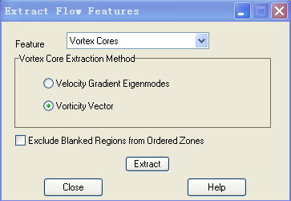

**处理无规律数据**

{width="5.469064960629921in"
height="4.523793744531933in"}

{width="5.768055555555556in"
height="2.9067880577427823in"}

涡核识别

（1）速度梯度特征值法(lamda-2方法)\-\--计算量大

（2）涡矢量法（Q方法）\-\-\--计算量小

{width="5.768055555555556in"
height="3.8453707349081365in"}

**激波面的提取识别**

{width="5.768055555555556in"
height="0.710825678040245in"}

{width="5.768055555555556in"
height="0.36097331583552056in"}

**涡核的识别与提取**

{width="5.768055555555556in"
height="2.044838145231846in"}

{width="5.768055555555556in"
height="2.3620155293088363in"}

壁面湍流的流线分离和贴体的提取

{width="5.768055555555556in"
height="2.821411854768154in"}

{width="5.768055555555556in"
height="1.1296708223972003in"}

**Lamda-2计算涡核**

{width="6.062595144356956in"
height="2.5752613735783028in"}

{width="5.945138888888889in"
height="4.829029965004374in"}

{width="5.768055555555556in"
height="4.5394127296587925in"}

在动画中添加文本（比如：时间、某些图形等）

{width="5.768055555555556in"
height="3.579423665791776in"}
