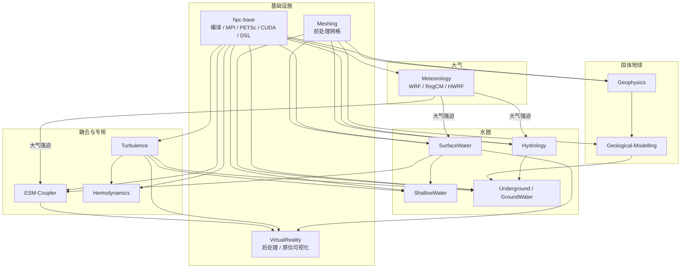

# 学科关系图

日期：2026-08-14  
范围：除 `hpc-base/` 外的学科 Markdown 文档树（含与 `hpc-base` 的依赖说明）  
依据：目录结构、学科 / 模型 README 交叉链接、正文关键词共现。

本文描述文档之间的**工作流依赖、显式超链接、内容主题耦合**，用于导航与后续补链；不改写各学科技术正文。

---

## 1. 总览

仓库按地球科学应用分学科目录；文档关系可分成三层：

| 层次 | 含义 | 当前状态 |
|------|------|----------|
| 工作流依赖 | 前处理 → 模拟 → 耦合 → 后处理；算力基座贯穿全程 | 逻辑清晰，已写进学科 README「相关文档」 |
| 显式超链接 | Markdown 相对路径链接 | 学科内为主；跨学科边多来自入口 README |
| 内容主题耦合 | 正文点名其他学科的模型 / 工具 | 往往强于显式链接（尤其 ESM、Meshing、PETSc） |

文档数量大致（会随增删变化）：`SurfaceWater` 最多，其次 `VirtualReality`、`Underground`、`ESM-Coupler` / `Hydrology`；`GroundWater` 几乎仅入口说明。

---

## 2. 工作流分层



文本简图（与上图一致）：

```text
                         ┌──────────────┐
                         │  Meteorology │  NWP / WRF / RegCM
                         └──────┬───────┘
                                │ 大气强迫
         ┌──────────────────────┼──────────────────────┐
         ▼                      ▼                      ▼
   ┌───────────┐         ┌────────────┐          ┌────────────┐
   │Hydrology  │         │SurfaceWater│          │ShallowWater│
   │分布式水文 │         │河流 / 海洋 │          │浅水 / 洪水 │
   └─────┬─────┘         └──────┬─────┘          └────────────┘
         │                      │
         ▼                      ▼
   ┌───────────┐         ┌────────────┐     ┌─────────────────┐
   │Underground│◄────────│  Meshing   │────►│Geological-Model.│
   │地下 / 多孔│  网格   │网格前处理  │     │地震解释 / 隐式建模│
   └───────────┘         └────────────┘     └────────┬────────┘
         ▲                      │                    │
         │                      ▼                    ▼
   ┌───────────┐         ┌────────────┐     ┌─────────────────┐
   │Hemodynamics│        │Turbulence  │     │   Geophysics    │
   │血液动力学  │        │CFD / 湍流  │     │正演 / 反演 / FWI│
   └───────────┘         └────────────┘     └─────────────────┘
                                │
         ┌──────────────────────┼──────────────────────┐
         ▼                      ▼                      ▼
   ┌───────────┐         ┌────────────┐          ┌────────────┐
   │ESM-Coupler│         │VirtualReal.│          │  hpc-base  │
   │耦合器 / ESM│         │可视化 / 原位│          │编译 / MPI / GPU│
   └───────────┘         └────────────┘          └────────────┘
```

### 2.1 枢纽角色

| 角色 | 目录 | 作用 |
|------|------|------|
| 算力基座 | [hpc-base](../hpc-base/) | 编译器、MPI、PETSc、CUDA、容器、DSL；多数学科入口链入 |
| 前处理枢纽 | [Meshing](../Meshing/) | 服务 SurfaceWater（如 `.gr3`）、Hydrology（三角网）、Underground（USG / 角点）、Geophysics（SeismicMesh） |
| 后处理枢纽 | [VirtualReality](../VirtualReality/) | ParaView / Catalyst / VisIt 等；被 ESM、Turbulence、Underground 等引用 |
| 耦合枢纽 | [ESM-Coupler](../ESM-Coupler/) | 连接 Meteorology 与 SurfaceWater（ROMS / CROCO / WW3 等）及原位可视化 |
| 薄入口 | [GroundWater](../GroundWater/) | 专题说明；实体文档在 Underground / Hydrology |

---

## 3. 显式超链接关系

### 3.1 学科入口「相关文档」边

以下边来自各学科 `README.md` 的 `## 相关文档`（双向在表中合并表述）：

| 连接 | 含义 |
|------|------|
| Meteorology ↔ ESM-Coupler ↔ SurfaceWater | 区域地球系统耦合（大气–海洋 / 波浪） |
| Hydrology ↔ Underground（及 GroundWater） | 地表水–地下水、MODFLOW 族 |
| Meshing ↔ SurfaceWater / Hydrology / Geophysics / Underground | 网格格式与目标模式 |
| Geophysics ↔ Geological-Modelling、SurfaceWater/Firedrake | 解释 / 隐式建模；Firedrake–spyro |
| Turbulence ↔ Underground / Hemodynamics / ShallowWater / VirtualReality | OpenFOAM 生态与可视化 |
| ShallowWater ↔ SurfaceWater / Meshing | 浅水 / 洪水与河口海洋模式对照 |
| Hemodynamics ↔ Turbulence / Meshing / VirtualReality | 心血管 CFD 与通用 CFD / 网格 / 可视化 |
| 各学科 → hpc-base | 编译与并行依赖 |

根 [README.md](../README.md) 链向全部学科目录及本规范相关说明。

### 3.2 链接结构特征

- **学科内链接占多数**（模型 `README` → `install/` / `doc/` / `manual/`）。
- **跨学科链接**仍偏少，且多集中在学科入口；模型级正文之间的稳定相对链接弱于正文点名。
- 历史笔记中可能存在失效相对路径；补链时以现存目录为准校验。

### 3.3 单模型文档的纵向结构

多数模型目录呈同一纵向关系（非学科间横向）：

```text
学科/README.md
  └─ 模型/README.md
       ├─ install/*.md    编译安装
       ├─ doc/*.md        原理 / 学习笔记（含原 Word 转换稿）
       └─ manual/         操作流程（如 SCHISM）
```

原 `*.docx.md` 已统一为 `*.md`；此类转换稿多为孤立笔记，上层索引仍可逐步补全。

---

## 4. 内容主题耦合（关键词共现）

正文跨目录点名，表示知识上已耦合，未必已有 Markdown 链接。下列为高信号簇（数量级会随文档增减变化）：

| 主题簇 | 典型证据 | 关系解读 |
|--------|----------|----------|
| ESM 大气–海洋 | WRF / ROMS / CROCO / RegCM 在 ESM-Coupler 中高频出现 | 跨学科知识最密区 |
| 水文–地下水 | MODFLOW 出现在 Hydrology、Meshing；WRF 出现在 Hydrology（WRF-Hydro） | 强迫与耦合双线 |
| 网格–SCHISM 族 | SCHISM / ADCIRC 在 Meshing 中大量出现 | `.gr3`、ACE-tools、OCSMesh、OceanMesh2D |
| Firedrake–FWI | Firedrake 在 Geophysics；spyro 回指 SurfaceWater | DSL / 有限元共享 |
| OpenFOAM 族 | OpenFOAM 出现在 Underground、hpc-base 等 | porousMultiphaseFoam 等延伸 |
| 原位可视化 | ParaView 广布；Catalyst 与 ESM（如 RegESM）相关 | 在线可视化工作流 |
| 基座技术外溢 | PETSc、CUDA、OP2 在多学科正文出现 | 学科文档概念上依赖 hpc-base |

---

## 5. 按学科的主要邻居

| 学科 | 上游 / 输入 | 下游 / 协作 | 基座 |
|------|-------------|-------------|------|
| [Meteorology](../Meteorology/) | — | Hydrology、SurfaceWater、ESM-Coupler | hpc-base |
| [Hydrology](../Hydrology/) | Meteorology、Meshing | Underground、GroundWater | hpc-base |
| [SurfaceWater](../SurfaceWater/) | Meshing、Meteorology | ESM-Coupler、ShallowWater、VirtualReality；Firedrake↔Geophysics | hpc-base |
| [ShallowWater](../ShallowWater/) | Meshing、SurfaceWater | Turbulence（对照） | hpc-base（含 OP2/CUDA） |
| [Underground](../Underground/) | Meshing、Hydrology、Geological-Modelling | GroundWater、Turbulence（OpenFOAM） | hpc-base（PETSc 等） |
| [GroundWater](../GroundWater/) | — | 指向 Underground / Hydrology | hpc-base |
| [Geophysics](../Geophysics/) | Meshing | Geological-Modelling、SurfaceWater/Firedrake | hpc-base |
| [Geological-Modelling](../Geological-Modelling/) | Geophysics、Meshing | Underground | hpc-base |
| [ESM-Coupler](../ESM-Coupler/) | Meteorology、SurfaceWater | VirtualReality（Catalyst 等） | hpc-base |
| [Turbulence](../Turbulence/) | hpc-base | Underground、Hemodynamics、ShallowWater、VirtualReality | hpc-base |
| [Hemodynamics](../Hemodynamics/) | Meshing、Turbulence | VirtualReality | hpc-base |
| [Meshing](../Meshing/) | — | SurfaceWater、Hydrology、Geophysics、Underground | hpc-base |
| [VirtualReality](../VirtualReality/) | 各模拟学科输出 | ESM 原位可视化 | hpc-base |

---

## 6. 建议补链清单（可选后续）

优先补**模型级**相对链接（内容已耦合、入口未链稳）：

1. `ESM-Coupler` ↔ `Meteorology/WRFV4`、`SurfaceWater/ROMS`、`SurfaceWater/CROCO`、`SurfaceWater/WaveWatch-III`
2. `SurfaceWater/SCHISM` ↔ `Meshing/OCSMesh`、`Meshing/ACE-tools`、`Meshing/OceanMesh2D`
3. `Geophysics/spyro` ↔ `SurfaceWater/Firedrake`；`Geophysics/Devito` ↔ `Geophysics/JUDI`
4. `Hydrology/GSFLOW`、`Hydrology/pywatershed` ↔ `Underground/MODFLOW6`
5. `Underground/porousMultiphaseFoam` ↔ `Turbulence/OpenFOAM`
6. `ESM-Coupler/RegESM` ↔ `VirtualReality/In-situ-Visualization`（Catalyst）
7. 各学科仍指向失效路径的历史链接：按现存树校验后修正或删除

---

## 7. 相关规范

- [非 hpc-base Markdown 规范](./superpowers/specs/2026-08-14-non-hpc-base-markdown-design.md)
- [hpc-base Markdown 规范](./superpowers/specs/2026-08-14-hpc-base-markdown-design.md)
- [仓库根 README](../README.md)
