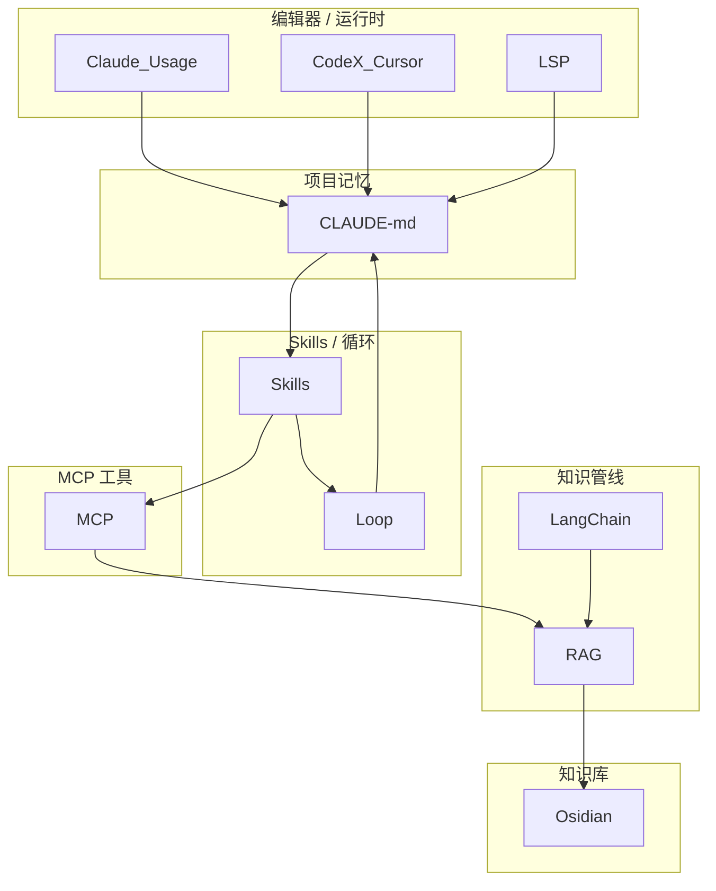

# agent-dev 模块关系

依据 `agent-dev/` 目录结构、各 `.md` 标题与正文关键词共现。根 `README.md` 未建子目录索引；**跨文件夹相对链接为 0**，边来自内容耦合。

## 三层关系

| 层次 | 含义 |
|------|------|
| 工作流依赖 | 运行时 → 路由 → CLAUDE.md / Skills → MCP → RAG → Obsidian → Loop |
| 显式超链接 | 几乎全是 GitHub / 官方文档；目录内部互链缺失 |
| 内容主题耦合 | PETSc–AmgX、Fortran、LLM 路由、Gmsh–OpenFOAM |

## 逻辑分层

## 依赖速查

| 模块 | 应链接 |
|------|--------|
| [[Claude_Usage]] | [[CLAUDE-md]] · [[主题-LLM路由]] · [[CodeX_Cursor]] · [[Skills]] |
| [[CodeX_Cursor]] | [[Claude_Usage]] · [[主题-LLM路由]] · [[MCP]] · [[Skills]] |
| [[LSP]] | [[CLAUDE-md]] · [[主题-Fortran-Agent]] · [[Skills]] |
| [[CLAUDE-md]] | [[Claude_Usage]] · [[Skills]] · [[Loop]] · [[主题-Fortran-Agent]] |
| [[Skills]] | [[CLAUDE-md]] · [[MCP]] · [[Loop]] · [[LangChain]] · [[Osidian]] |
| [[Loop]] | [[Skills]] · [[CLAUDE-md]] · [[Claude_Usage]] |
| [[MCP]] | [[Claude_Usage]] · [[RAG]] · [[主题-PETSc-AmgX-Agent]] · [[主题-Fortran-Agent]] |
| [[RAG]] | [[MCP]] · [[LangChain]] · [[主题-PETSc-AmgX-Agent]] · [[Osidian]] |
| [[LangChain]] | [[RAG]] · [[Skills]] · [[主题-PETSc-AmgX-Agent]] · [[CUDA]] |
| [[Osidian]] | [[RAG]] · [[Skills]] · [[MOC-OpenGeoModeller]] |

## 关键交叉点

- **DeepSeek / Gemini / Grok / CCR** ← [[主题-LLM路由]] → [[Claude_Usage]] / [[CodeX_Cursor]]
- **PETSc MCP + knowledge-rag + LangChain 示例** ← [[主题-PETSc-AmgX-Agent]] → [[Linear_Solver]] / [[CUDA]]
- **fortran-mcp + fortls + `/build`/`/test` + VS2022** ← [[主题-Fortran-Agent]] → [[Language]]
- **Gmsh MCP + Foam-Agent** → [[Meshing]] / [[Turbulence]] / [[主题-OpenFOAM族]]
- **Blender / ParaView MCP** → [[VirtualReality]]
- **brain-map / Obsidian CLI** → 本库 [[知识图谱使用说明]]

## 可视化

- Canvas：[[05-agent-dev/agent-dev-知识图谱.canvas|agent-dev-知识图谱]]
- 总入口：[[MOC-agent-dev]] · [[MOC-OpenGeoModeller]]
